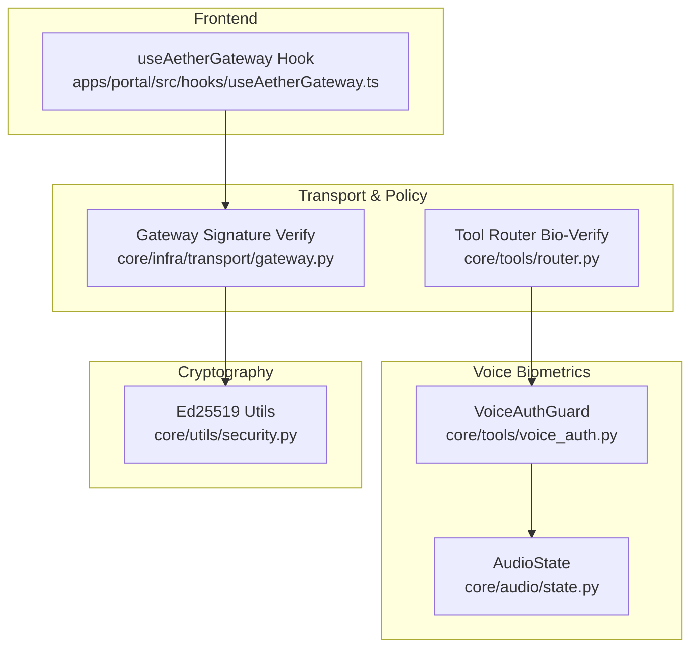
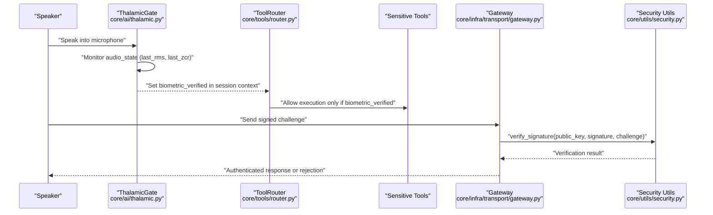
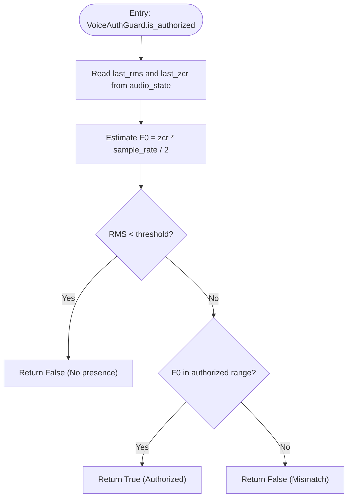
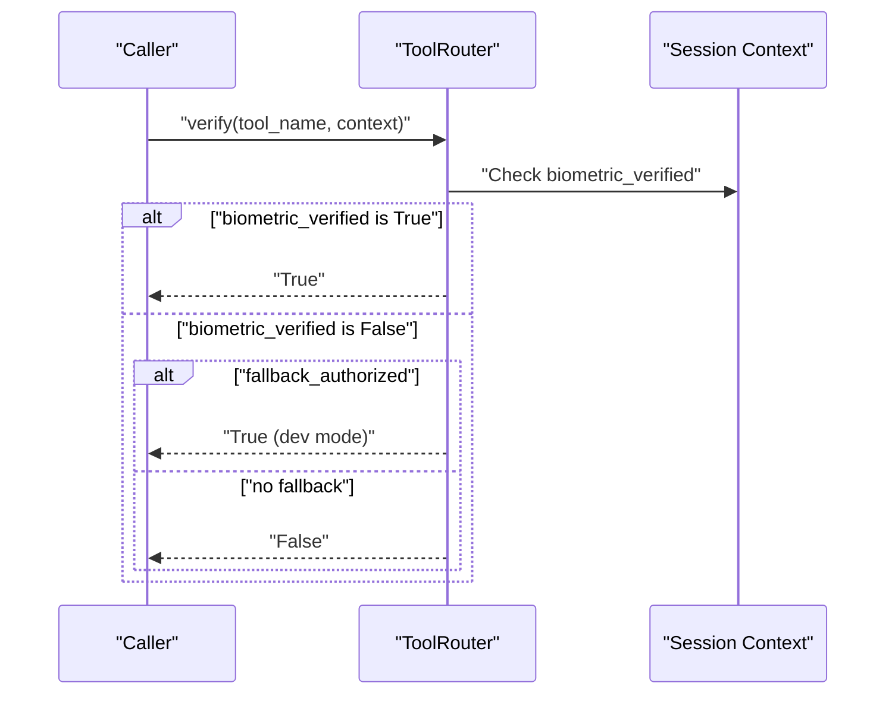
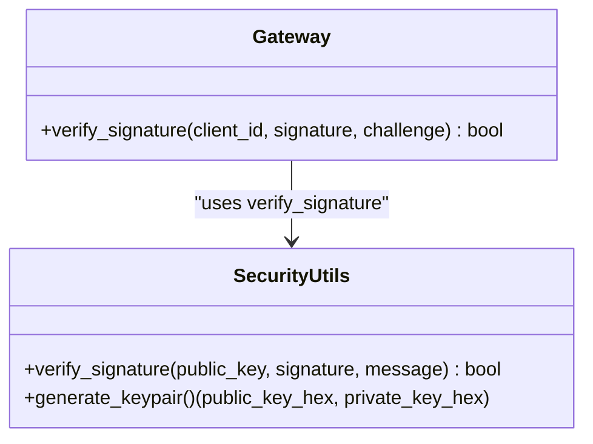
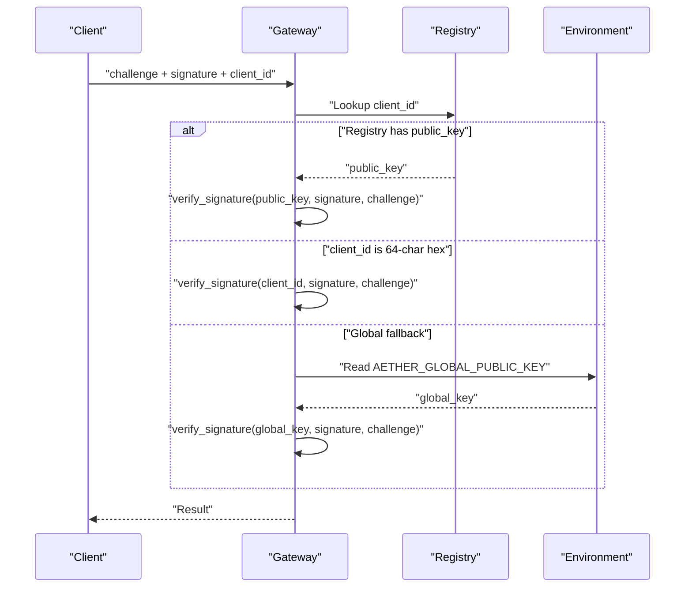
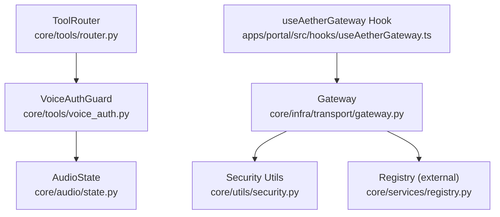

# Biometric Security

<cite>
**Referenced Files in This Document**
- [voice_auth.py](file://core/tools/voice_auth.py)
- [security.py](file://core/utils/security.py)
- [gateway.py](file://core/infra/transport/gateway.py)
- [router.py](file://core/tools/router.py)
- [state.py](file://core/audio/state.py)
- [thalamic.py](file://core/ai/thalamic.py)
- [useAetherGateway.ts](file://apps/portal/src/hooks/useAetherGateway.ts)
</cite>

## Table of Contents
1. [Introduction](#introduction)
2. [Project Structure](#project-structure)
3. [Core Components](#core-components)
4. [Architecture Overview](#architecture-overview)
5. [Detailed Component Analysis](#detailed-component-analysis)
6. [Dependency Analysis](#dependency-analysis)
7. [Performance Considerations](#performance-considerations)
8. [Troubleshooting Guide](#troubleshooting-guide)
9. [Conclusion](#conclusion)
10. [Appendices](#appendices)

## Introduction
This document describes the biometric security system in Aether Voice OS with a focus on:
- The Soul-Lock verification mechanism and voice authentication protocols
- Speech pattern recognition and enrollment/verification thresholds
- Cryptographic foundations using Ed25519 key pairs and signature verification
- Identity management for souls, including public key storage and identity verification workflows
- Middleware patterns enforcing security policies and protecting sensitive operations
- Extensibility examples for custom biometric verification, additional authentication methods, and external identity provider integrations
- Security best practices, threat modeling, and mitigation strategies
- Troubleshooting guidance for authentication failures and biometric enrollment issues

## Project Structure
The biometric security system spans several subsystems:
- Voice authentication and biometric gating for sensitive tools
- Audio state management feeding biometric signals
- Transport gateway and router enforcing biometric locks and cryptographic verification
- Frontend telemetry hook consuming audio metrics for diagnostics

**Diagram sources**
- [voice_auth.py](file://core/tools/voice_auth.py#L19-L51)
- [state.py](file://core/audio/state.py#L36-L74)
- [gateway.py](file://core/infra/transport/gateway.py#L646-L670)
- [router.py](file://core/tools/router.py#L55-L84)
- [security.py](file://core/utils/security.py#L18-L55)
- [useAetherGateway.ts](file://apps/portal/src/hooks/useAetherGateway.ts#L216-L228)

**Section sources**
- [voice_auth.py](file://core/tools/voice_auth.py#L1-L82)
- [state.py](file://core/audio/state.py#L1-L129)
- [gateway.py](file://core/infra/transport/gateway.py#L640-L670)
- [router.py](file://core/tools/router.py#L52-L92)
- [security.py](file://core/utils/security.py#L1-L71)
- [useAetherGateway.ts](file://apps/portal/src/hooks/useAetherGateway.ts#L216-L228)

## Core Components
- VoiceAuthGuard: Provides a lightweight voice biometric check using audio_state’s last_rms and last_zcr to estimate fundamental frequency and validate presence.
- AudioState: Thread-safe singleton exposing last_rms and last_zcr consumed by biometric checks and telemetry.
- ToolRouter: Enforces a “biometric lock” by checking a session context flag indicating voice-print stability and optionally allowing a development fallback.
- Gateway: Performs Ed25519 signature verification against registry-stored public keys, ephemeral hex keys, or a global development key.
- Security Utilities: Ed25519 signature verification and keypair generation helpers.

**Section sources**
- [voice_auth.py](file://core/tools/voice_auth.py#L19-L51)
- [state.py](file://core/audio/state.py#L36-L74)
- [router.py](file://core/tools/router.py#L55-L84)
- [gateway.py](file://core/infra/transport/gateway.py#L646-L670)
- [security.py](file://core/utils/security.py#L18-L70)

## Architecture Overview
The system enforces two complementary layers:
- Biometric lock for tool invocation: The router checks a biometric_verified flag set by the audio capture layer (Thalamic Gate) and gates sensitive tools accordingly.
- Cryptographic identity verification: The gateway verifies Ed25519 signatures using public keys stored in the registry or passed directly as hex-encoded keys.

**Diagram sources**
- [thalamic.py](file://core/ai/thalamic.py#L41-L98)
- [router.py](file://core/tools/router.py#L55-L84)
- [gateway.py](file://core/infra/transport/gateway.py#L646-L670)
- [security.py](file://core/utils/security.py#L18-L55)

## Detailed Component Analysis

### Voice Authentication and Biometric Template Matching
- Estimation logic: Fundamental frequency (F0) is approximated from zero-crossing rate and sample rate, combined with RMS energy to detect presence and validate pitch range.
- Thresholds: A fixed authorized pitch range is used to gate access; values outside this range deny authorization.
- Enrollment process: Not implemented in the referenced code; the current mechanism relies on a static authorized pitch range and does not persist or compare against enrolled templates.
- Enrollment and matching extension points: The VoiceAuthGuard class is the natural place to integrate enrollment routines and template comparison.

**Diagram sources**
- [voice_auth.py](file://core/tools/voice_auth.py#L25-L51)
- [state.py](file://core/audio/state.py#L57-L58)

**Section sources**
- [voice_auth.py](file://core/tools/voice_auth.py#L19-L51)
- [state.py](file://core/audio/state.py#L36-L74)

### Middleware Patterns for Enforcing Security Policies
- Biometric lock enforcement: The ToolRouter checks a biometric_verified flag in the session context and denies execution otherwise, with a development-mode fallback.
- Development fallback: Allows bypassing biometric checks during development or testing.

**Diagram sources**
- [router.py](file://core/tools/router.py#L55-L84)

**Section sources**
- [router.py](file://core/tools/router.py#L52-L92)

### Cryptographic Foundations: Ed25519 Key Pairs and Signature Verification
- Key generation: Ed25519 keypairs generated and returned as hex-encoded strings.
- Signature verification: Accepts hex or bytes inputs, converts to bytes, and verifies using PyNaCl.
- Public key distribution: Stored per soul in the registry and used by the gateway to verify challenges.
- Direct/public key mode: If client_id is a 64-character hex string, treated as a public key.
- Global fallback: Development-only fallback using a global public key environment variable.

**Diagram sources**
- [security.py](file://core/utils/security.py#L18-L70)
- [gateway.py](file://core/infra/transport/gateway.py#L646-L670)

**Section sources**
- [security.py](file://core/utils/security.py#L18-L70)
- [gateway.py](file://core/infra/transport/gateway.py#L646-L670)

### Identity Management System: Soul Registration, Public Key Storage, and Identity Verification Workflows
- Public key storage: Souls retrieved from the registry expose a public_key field used for signature verification.
- Identity verification workflow: The gateway attempts to resolve a public key from the registry, falls back to treating client_id as a hex public key, and supports a global development key.
- Integration points: The router consumes a biometric_verified flag set by the audio capture layer; the gateway consumes signed challenges from clients.

**Diagram sources**
- [gateway.py](file://core/infra/transport/gateway.py#L646-L670)

**Section sources**
- [gateway.py](file://core/infra/transport/gateway.py#L646-L670)

### Speech Pattern Recognition, Enrollment Processes, and Verification Thresholds
- Current implementation: Uses RMS and zero-crossing rate to approximate F0 and enforce a pitch range; no enrollment or persistent template matching.
- Enrollment extension: Introduce a dedicated enrollment routine that captures multiple samples, extracts robust features, and stores a biometric template per soul.
- Threshold tuning: Adjust authorized pitch range and RMS thresholds based on demographic and environmental conditions.

**Section sources**
- [voice_auth.py](file://core/tools/voice_auth.py#L14-L16)
- [voice_auth.py](file://core/tools/voice_auth.py#L25-L51)
- [state.py](file://core/audio/state.py#L57-L58)

### Middleware Patterns for Protecting Sensitive Operations
- Biometric lock: The router gates sensitive tools behind a biometric_verified flag.
- Development fallback: Controlled bypass for testing scenarios.
- Logging: Clear security logs for bio-lock decisions and signature verification outcomes.

**Section sources**
- [router.py](file://core/tools/router.py#L55-L84)
- [security.py](file://core/utils/security.py#L18-L55)

### Implementing Custom Biometric Verification and Extending Authentication Methods
- Custom biometric verification: Add a new guard class similar to VoiceAuthGuard with distinct feature extraction and matching logic; wire it into the router’s verification pipeline.
- Additional authentication methods: Extend the gateway’s verification logic to support alternative schemes (e.g., device-bound secrets) while maintaining Ed25519 as the primary method.
- External identity providers: Integrate with external IDPs by mapping their identifiers to souls and retrieving associated public keys from the registry.

**Section sources**
- [voice_auth.py](file://core/tools/voice_auth.py#L19-L51)
- [gateway.py](file://core/infra/transport/gateway.py#L646-L670)

### Integrating with External Identity Providers
- Registry-driven mapping: Store external provider identifiers alongside souls and their public keys.
- Public key retrieval: The gateway’s resolution logic already supports registry lookups and direct public keys; external provider integration primarily involves provisioning the registry entries.

**Section sources**
- [gateway.py](file://core/infra/transport/gateway.py#L646-L670)

## Dependency Analysis
The following diagram highlights key dependencies among security-critical components.

**Diagram sources**
- [voice_auth.py](file://core/tools/voice_auth.py#L10-L10)
- [state.py](file://core/audio/state.py#L10-L10)
- [router.py](file://core/tools/router.py#L55-L84)
- [gateway.py](file://core/infra/transport/gateway.py#L646-L670)
- [security.py](file://core/utils/security.py#L18-L55)
- [useAetherGateway.ts](file://apps/portal/src/hooks/useAetherGateway.ts#L216-L228)

**Section sources**
- [voice_auth.py](file://core/tools/voice_auth.py#L10-L10)
- [state.py](file://core/audio/state.py#L10-L10)
- [router.py](file://core/tools/router.py#L55-L84)
- [gateway.py](file://core/infra/transport/gateway.py#L646-L670)
- [security.py](file://core/utils/security.py#L18-L55)
- [useAetherGateway.ts](file://apps/portal/src/hooks/useAetherGateway.ts#L216-L228)

## Performance Considerations
- Audio-state access: The biometric checks rely on last_rms and last_zcr from audio_state; ensure minimal overhead in the audio processing path.
- Router verification: Keep context flag checks O(1) and avoid heavy computation in the policy enforcement path.
- Signature verification: Ed25519 verification is fast; batch or cache public keys where appropriate to reduce repeated registry lookups.
- Frontend telemetry: Avoid frequent polling; use event-driven updates to minimize bandwidth and CPU usage.

## Troubleshooting Guide
- Authentication failures
  - Biometric lock denied: Verify that biometric_verified is set in the session context by the audio capture layer and that the router is not in development fallback mode.
  - Signature verification fails: Confirm the client_id resolves to a valid public key in the registry, or that client_id is a 64-character hex string representing a public key; ensure the global development key environment variable is not inadvertently used.
- Biometric enrollment issues
  - Static pitch range mismatch: Adjust the authorized pitch range based on speaker characteristics and environment.
  - No presence detected: Increase RMS threshold or improve microphone placement and signal conditioning.
- Frontend diagnostics
  - Monitor paralinguistic telemetry (pitch, spectral centroid) to confirm audio metrics are flowing and reasonable.

**Section sources**
- [router.py](file://core/tools/router.py#L55-L84)
- [gateway.py](file://core/infra/transport/gateway.py#L646-L670)
- [voice_auth.py](file://core/tools/voice_auth.py#L25-L51)
- [useAetherGateway.ts](file://apps/portal/src/hooks/useAetherGateway.ts#L216-L228)

## Conclusion
Aether Voice OS implements a layered security model combining a lightweight voice biometric check and Ed25519-based cryptographic verification. The ToolRouter enforces a biometric lock using a session context flag, while the Gateway validates client identities using registry-stored or direct public keys. The current voice authentication relies on a static pitch range and does not include enrollment or persistent template matching. Extensibility points exist to introduce robust enrollment, advanced biometric matching, and integration with external identity providers, while maintaining strong cryptographic guarantees.

## Appendices
- Best practices
  - Prefer Ed25519 for all cryptographic operations; keep private keys securely stored and avoid logging sensitive material.
  - Use environment variables sparingly; restrict global development fallbacks to controlled environments.
  - Instrument security-critical paths with clear logs and metrics to aid auditing and incident response.
- Threat modeling
  - Spoofing: Mitigate by moving from static pitch ranges to robust biometric templates and anti-spoofing measures.
  - Man-in-the-middle: Ensure all channels are secured and verify signatures rigorously.
  - Privilege escalation: Always gate sensitive tools behind biometric locks and cryptographic verification.