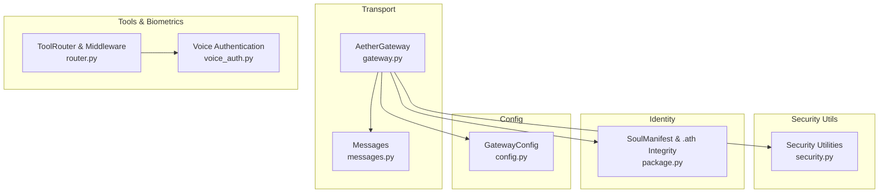
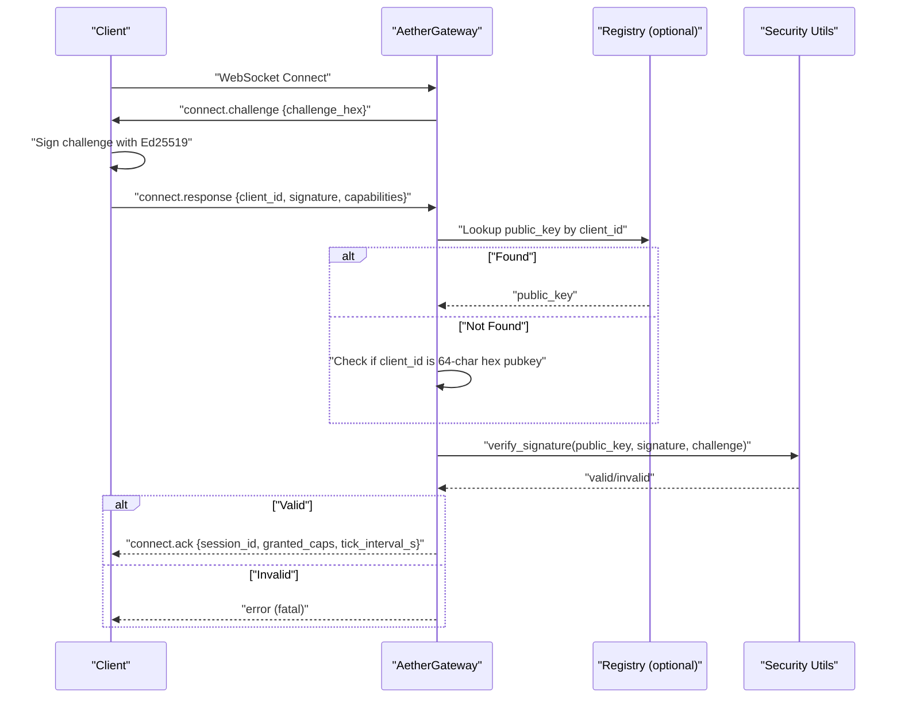
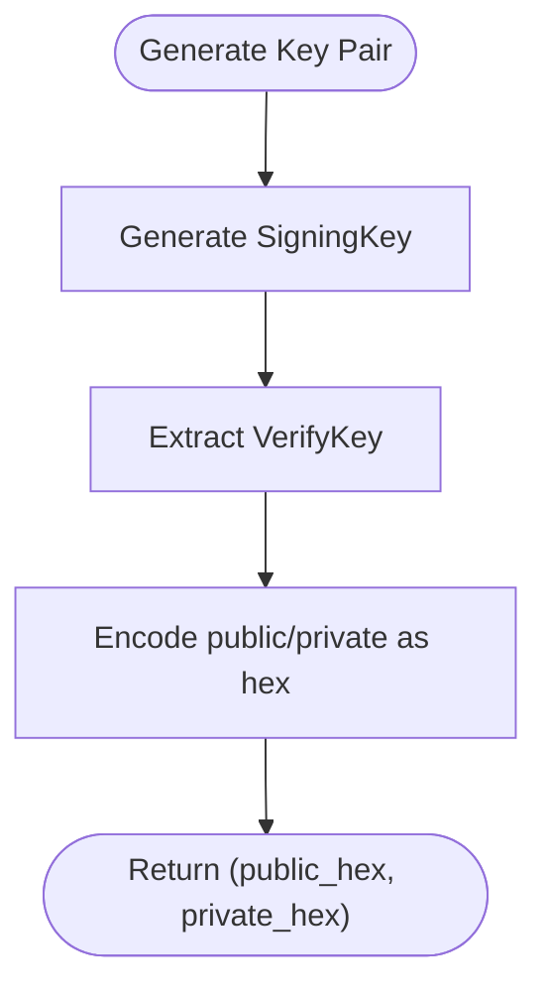
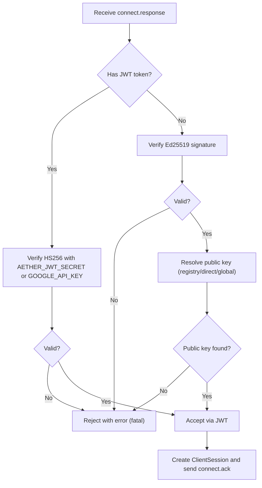
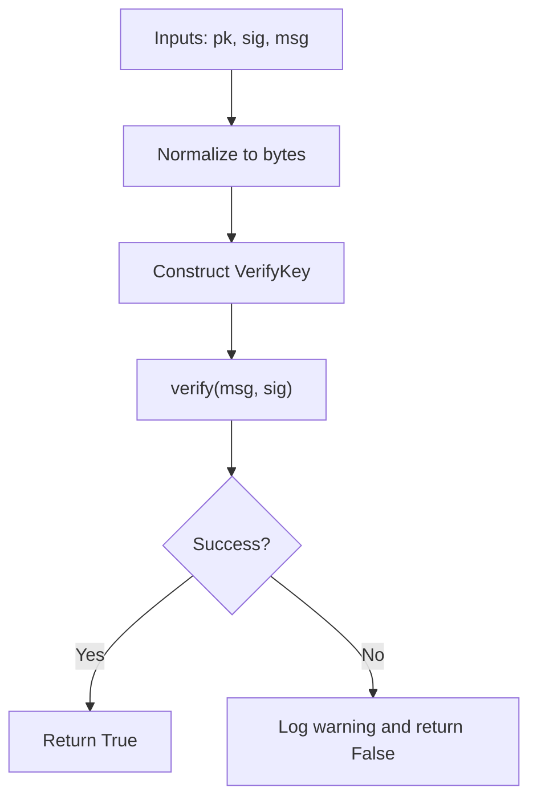
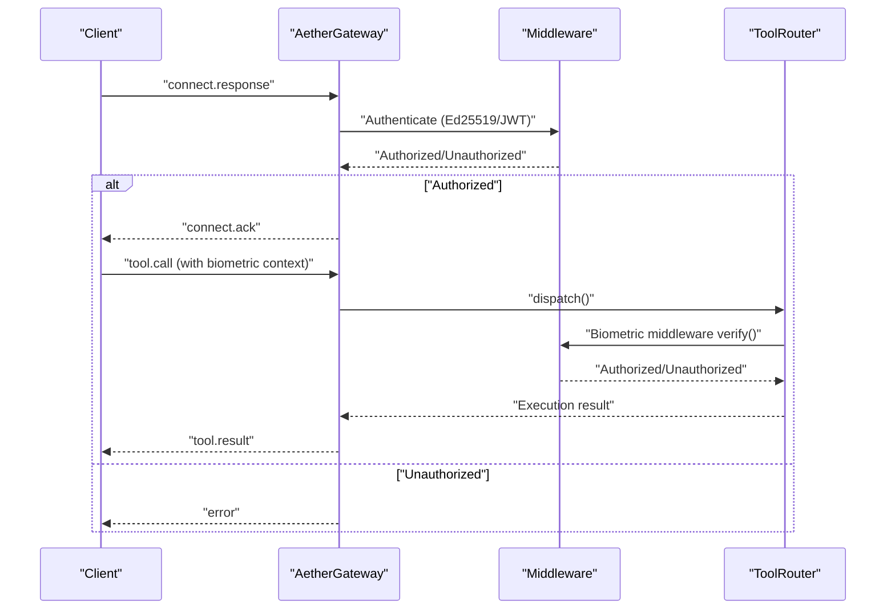
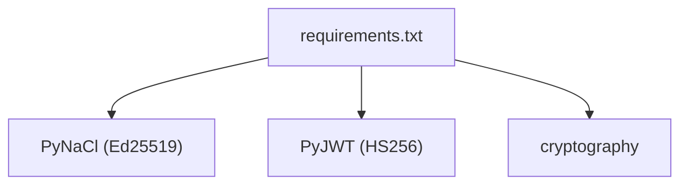

# Cryptographic Foundation

<cite>
**Referenced Files in This Document**
- [security.py](file://core/utils/security.py)
- [gateway.py](file://core/infra/transport/gateway.py)
- [messages.py](file://core/infra/transport/messages.py)
- [gateway_protocol.md](file://docs/gateway_protocol.md)
- [package.py](file://core/identity/package.py)
- [router.py](file://core/tools/router.py)
- [voice_auth.py](file://core/tools/voice_auth.py)
- [config.py](file://core/infra/config.py)
- [requirements.txt](file://requirements.txt)
</cite>

## Table of Contents
1. [Introduction](#introduction)
2. [Project Structure](#project-structure)
3. [Core Components](#core-components)
4. [Architecture Overview](#architecture-overview)
5. [Detailed Component Analysis](#detailed-component-analysis)
6. [Dependency Analysis](#dependency-analysis)
7. [Performance Considerations](#performance-considerations)
8. [Troubleshooting Guide](#troubleshooting-guide)
9. [Conclusion](#conclusion)
10. [Appendices](#appendices)

## Introduction
This document details the cryptographic foundation of Aether Voice OS security. It covers Ed25519 key pair generation and management, the gateway handshake protocol (challenge-response), signature verification, and middleware patterns for authentication and integrity. It also provides guidance on extending the system with custom cryptographic primitives, best practices for key rotation and secure randomness, and performance and audit considerations.

## Project Structure
The cryptographic stack spans several modules:
- Security utilities for Ed25519 signature verification and key generation
- Gateway transport for challenge-response authentication and session establishment
- Message schemas for handshake and steady-state messaging
- Identity package model with optional Ed25519 public key and integrity checks
- Tool router and voice authentication middleware for biometric protections
- Configuration for gateway parameters and environment secrets

**Diagram sources**
- [gateway.py](file://core/infra/transport/gateway.py#L529-L617)
- [messages.py](file://core/infra/transport/messages.py#L16-L80)
- [security.py](file://core/utils/security.py#L18-L70)
- [package.py](file://core/identity/package.py#L23-L50)
- [router.py](file://core/tools/router.py#L46-L85)
- [voice_auth.py](file://core/tools/voice_auth.py#L19-L52)
- [config.py](file://core/infra/config.py#L88-L100)

**Section sources**
- [gateway.py](file://core/infra/transport/gateway.py#L1-L120)
- [messages.py](file://core/infra/transport/messages.py#L1-L80)
- [security.py](file://core/utils/security.py#L1-L71)
- [package.py](file://core/identity/package.py#L1-L166)
- [router.py](file://core/tools/router.py#L1-L308)
- [voice_auth.py](file://core/tools/voice_auth.py#L1-L81)
- [config.py](file://core/infra/config.py#L88-L100)

## Core Components
- Ed25519 signature verification and key generation utilities
- Gateway challenge-response handshake with optional JWT fallback
- Message schemas for connect.challenge, connect.response, connect.ack
- Identity manifest with optional Ed25519 public key and SHA256 integrity
- Biometric middleware and voice authentication for sensitive tools
- Configuration of gateway timeouts and tick intervals

**Section sources**
- [security.py](file://core/utils/security.py#L18-L70)
- [gateway.py](file://core/infra/transport/gateway.py#L559-L617)
- [messages.py](file://core/infra/transport/messages.py#L47-L80)
- [package.py](file://core/identity/package.py#L23-L50)
- [router.py](file://core/tools/router.py#L46-L85)
- [voice_auth.py](file://core/tools/voice_auth.py#L19-L52)
- [config.py](file://core/infra/config.py#L88-L100)

## Architecture Overview
The gateway enforces a non-interactive Ed25519 challenge-response handshake. Clients receive a 32-byte random challenge, sign it with their Ed25519 private key, and send connect.response with client_id and signature. The gateway validates the signature against the registry-provided public key, a direct hex public key, or a development fallback. On success, it issues connect.ack with session metadata.

**Diagram sources**
- [gateway_protocol.md](file://docs/gateway_protocol.md#L10-L33)
- [gateway.py](file://core/infra/transport/gateway.py#L559-L617)
- [security.py](file://core/utils/security.py#L18-L56)

**Section sources**
- [gateway_protocol.md](file://docs/gateway_protocol.md#L37-L74)
- [gateway.py](file://core/infra/transport/gateway.py#L559-L617)
- [messages.py](file://core/infra/transport/messages.py#L47-L80)

## Detailed Component Analysis

### Ed25519 Key Pair Management
- Generation: New key pairs are generated using a secure Ed25519 signing key. Public and private keys are returned as hexadecimal strings.
- Storage: Public keys can be embedded in the .ath package manifest under the public_key field for discovery by the gateway.
- Distribution: Public keys are distributed via the registry (by client_id) or directly as a 64-character hex client_id in ephemeral mode.

**Diagram sources**
- [security.py](file://core/utils/security.py#L58-L70)
- [package.py](file://core/identity/package.py#L46-L48)

**Section sources**
- [security.py](file://core/utils/security.py#L58-L70)
- [package.py](file://core/identity/package.py#L46-L48)

### Cryptographic Handshake Protocol
- Challenge: The gateway generates 32 random bytes and sends connect.challenge with challenge_hex.
- Response: The client signs the challenge bytes and responds with connect.response including client_id, signature, and capabilities.
- Validation: The gateway attempts verification against:
  - Registry-specified public key for the client_id
  - Direct mode: treats client_id as a 64-character hex public key
  - Development fallback: reads AETHER_GLOBAL_PUBLIC_KEY from environment
- Acknowledgement: On success, the gateway replies with connect.ack and stores the client session.

**Diagram sources**
- [gateway.py](file://core/infra/transport/gateway.py#L559-L617)
- [gateway.py](file://core/infra/transport/gateway.py#L619-L670)
- [security.py](file://core/utils/security.py#L18-L56)

**Section sources**
- [gateway.py](file://core/infra/transport/gateway.py#L559-L617)
- [gateway.py](file://core/infra/transport/gateway.py#L619-L670)
- [messages.py](file://core/infra/transport/messages.py#L47-L80)

### Signature Verification Process
- Inputs: public_key (hex or bytes), signature (hex or bytes), message (raw bytes or string).
- Steps:
  - Normalize inputs to bytes
  - Construct VerifyKey from public_key
  - Verify signature against message
  - Return boolean result with logging on failure
- Integrity: The .ath package supports SHA256 integrity checks independent of Ed25519 signatures.

**Diagram sources**
- [security.py](file://core/utils/security.py#L18-L56)
- [package.py](file://core/identity/package.py#L140-L153)

**Section sources**
- [security.py](file://core/utils/security.py#L18-L56)
- [package.py](file://core/identity/package.py#L140-L153)

### Security Middleware Patterns
- Request Authentication:
  - Gateway enforces Ed25519 challenge-response or JWT token verification before accepting a session.
  - Optional registry lookup for public key resolution.
- Response Validation:
  - connect.ack confirms session acceptance and grants capabilities.
  - Heartbeat mechanism ensures liveness and prunes stale clients.
- Secure Communication Channels:
  - The handshake uses raw bytes for signing; tests demonstrate signing challenge bytes directly.
  - Environment variables provide secrets for JWT verification.

**Diagram sources**
- [gateway.py](file://core/infra/transport/gateway.py#L559-L617)
- [router.py](file://core/tools/router.py#L287-L302)
- [voice_auth.py](file://core/tools/voice_auth.py#L54-L67)

**Section sources**
- [gateway.py](file://core/infra/transport/gateway.py#L559-L617)
- [router.py](file://core/tools/router.py#L287-L302)
- [voice_auth.py](file://core/tools/voice_auth.py#L54-L67)

### Extending the Authentication Framework
- Add new algorithms:
  - Implement a new verification function in security utilities and wire it into the gateway’s verification chain.
  - Extend message schemas to support new response types if needed.
- Integrate additional secrets:
  - Use environment variables for new secrets and add fallback logic in the gateway.
- Biometric integrations:
  - Enhance the BiometricMiddleware to integrate with hardware or ML-based voiceprints.
  - Propagate biometric context to tool dispatchers for sensitive operations.

[No sources needed since this section provides general guidance]

## Dependency Analysis
External cryptographic dependencies include PyNaCl for Ed25519, PyJWT for HS256 verification, and cryptography for general crypto operations. These are declared in requirements.txt.

**Diagram sources**
- [requirements.txt](file://requirements.txt#L13-L16)

**Section sources**
- [requirements.txt](file://requirements.txt#L13-L16)

## Performance Considerations
- Handshake latency targets:
  - Tests indicate sub-200ms average handshake latency for local connections.
- Randomness:
  - Use cryptographically secure randomness for challenges (os.urandom).
- Verification cost:
  - Ed25519 verification is fast; avoid unnecessary conversions and minimize allocations.
- Network overhead:
  - Keep message payloads minimal (challenge is 32 bytes; signatures are 64 bytes).
- Heartbeat tuning:
  - Adjust tick_interval_s and max_missed_ticks to balance liveness detection and bandwidth.

[No sources needed since this section provides general guidance]

## Troubleshooting Guide
Common issues and resolutions:
- Signature verification failures:
  - Ensure the challenge is signed as raw bytes, not hex.
  - Confirm public key encoding matches expectations (hex vs bytes).
- Handshake timeouts:
  - Increase handshake_timeout_s in GatewayConfig if clients are slow.
- Missing environment secrets:
  - Provide AETHER_JWT_SECRET or GOOGLE_API_KEY for JWT verification.
- Registry mismatches:
  - Verify client_id corresponds to a registered soul with a valid public_key.
- Biometric lockouts:
  - Ensure biometric context is present for sensitive tools; development fallback may authorize in test mode.

**Section sources**
- [gateway.py](file://core/infra/transport/gateway.py#L564-L580)
- [gateway.py](file://core/infra/transport/gateway.py#L619-L635)
- [router.py](file://core/tools/router.py#L287-L302)
- [config.py](file://core/infra/config.py#L88-L100)

## Conclusion
Aether Voice OS employs a robust Ed25519-based challenge-response handshake for secure gateway authentication, complemented by optional JWT verification and biometric middleware for sensitive operations. The system’s modular design enables straightforward extension with additional algorithms and enhanced biometric protections while maintaining strong defaults for integrity and performance.

[No sources needed since this section summarizes without analyzing specific files]

## Appendices

### Best Practices Checklist
- Key Management
  - Rotate Ed25519 key pairs periodically; update manifests and registry entries accordingly.
  - Store private keys securely; never embed them in client-side code.
- Randomness
  - Use os.urandom for all randomness (e.g., challenges).
- Timing Attacks
  - Treat all verification failures uniformly to avoid timing side-channels.
- Audit and Monitoring
  - Log authentication outcomes and failures; monitor for anomalies.
  - Conduct periodic penetration testing and cryptographic reviews.

[No sources needed since this section provides general guidance]