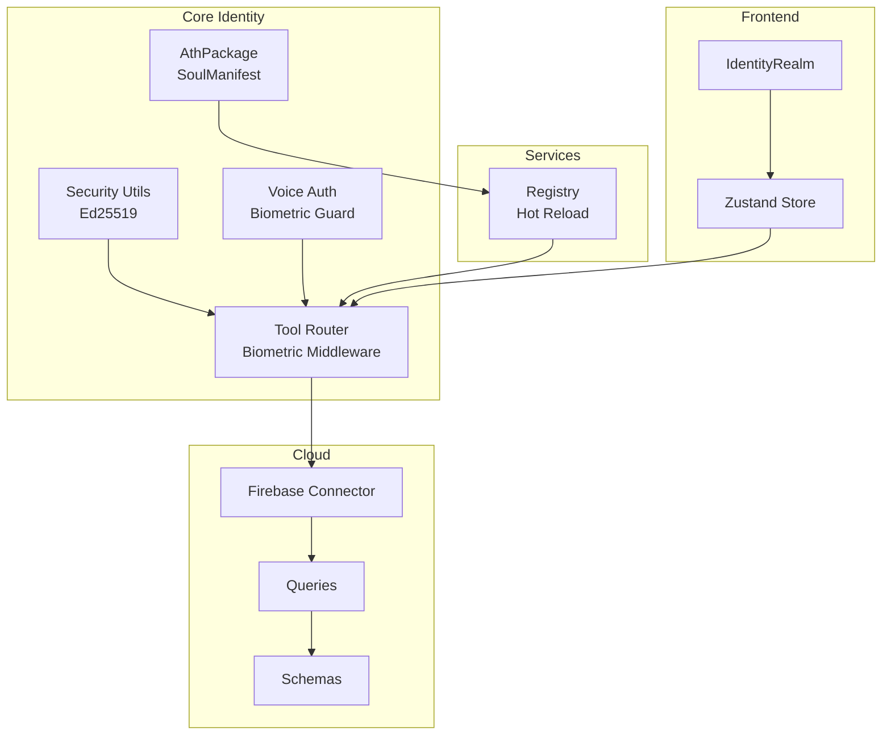
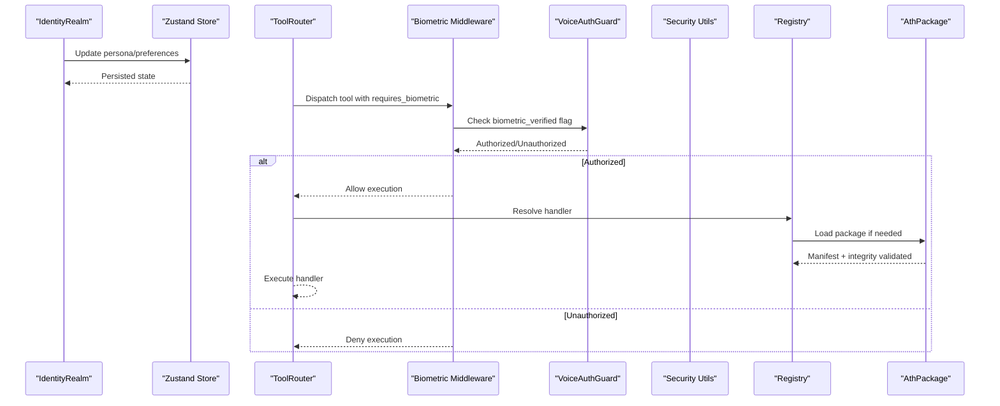
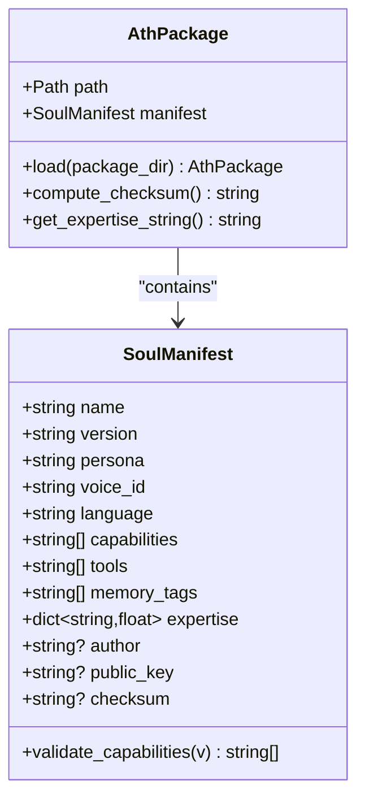
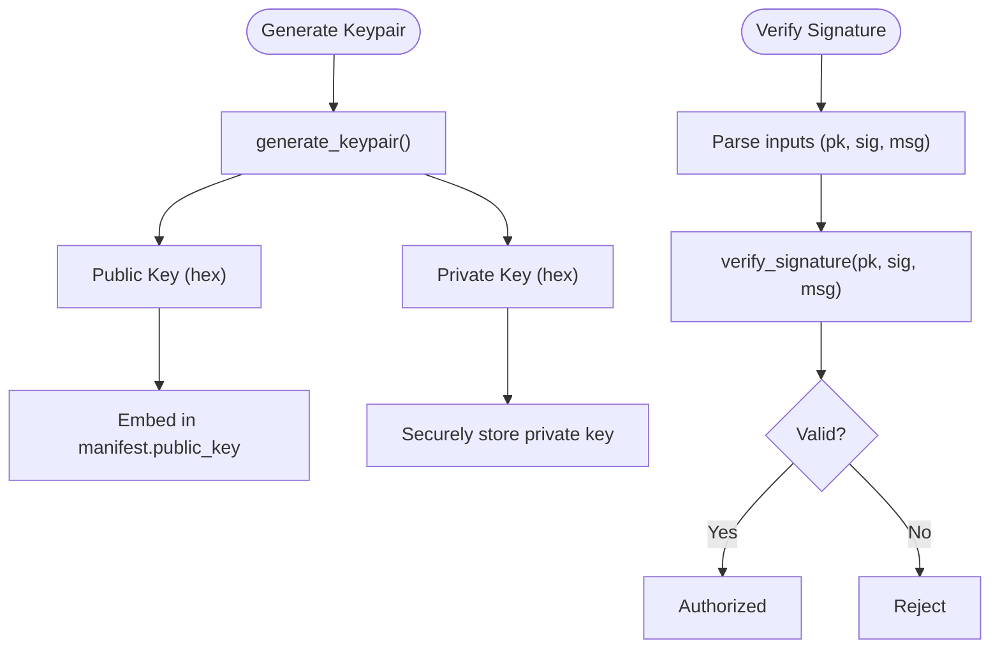
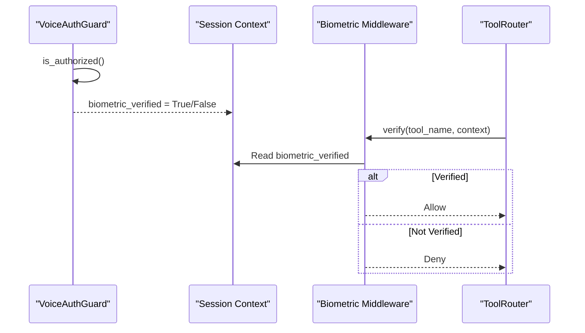
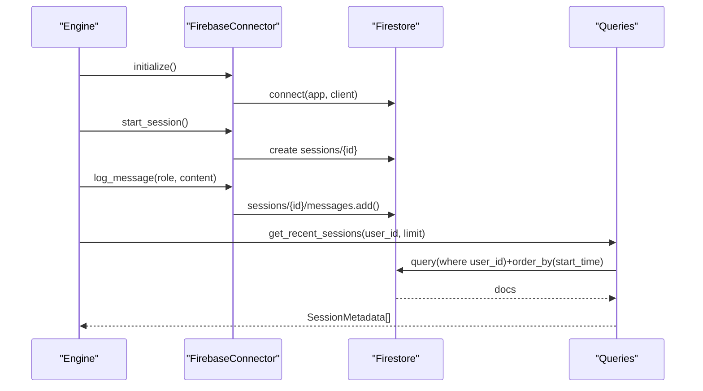
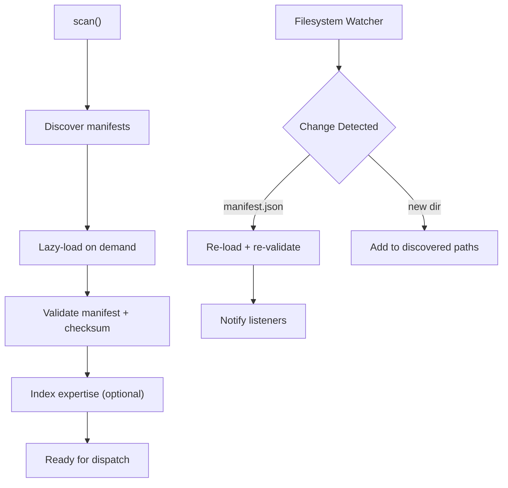
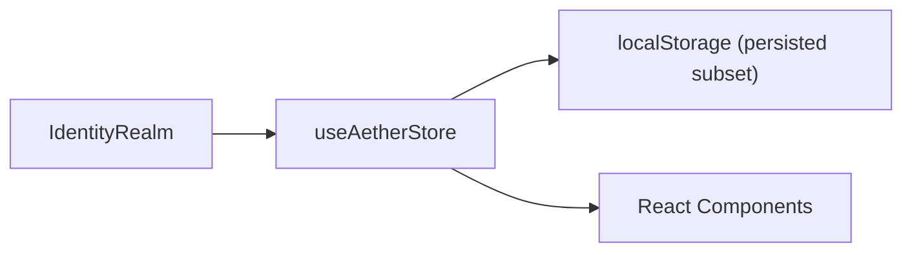
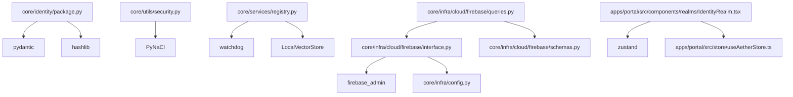

# Identity Management

<cite>
**Referenced Files in This Document**
- [package.py](file://core/identity/package.py)
- [ath_package_spec.md](file://docs/ath_package_spec.md)
- [security.py](file://core/utils/security.py)
- [voice_auth.py](file://core/tools/voice_auth.py)
- [router.py](file://core/tools/router.py)
- [registry.py](file://core/services/registry.py)
- [errors.py](file://core/utils/errors.py)
- [interface.py](file://core/infra/cloud/firebase/interface.py)
- [queries.py](file://core/infra/cloud/firebase/queries.py)
- [schemas.py](file://core/infra/cloud/firebase/schemas.py)
- [config.py](file://core/infra/config.py)
- [IdentityRealm.tsx](file://apps/portal/src/components/realms/IdentityRealm.tsx)
- [useAetherStore.ts](file://apps/portal/src/store/useAetherStore.ts)
- [Soul.md](file://brain/personas/Soul.md)
- [test_identity.py](file://tests/unit/test_identity.py)
</cite>

## Table of Contents
1. [Introduction](#introduction)
2. [Project Structure](#project-structure)
3. [Core Components](#core-components)
4. [Architecture Overview](#architecture-overview)
5. [Detailed Component Analysis](#detailed-component-analysis)
6. [Dependency Analysis](#dependency-analysis)
7. [Performance Considerations](#performance-considerations)
8. [Troubleshooting Guide](#troubleshooting-guide)
9. [Conclusion](#conclusion)
10. [Appendices](#appendices)

## Introduction
This document describes the identity management system in Aether Voice OS. It covers how identities are represented as .ath packages, how public keys and integrity are handled, how biometric authentication gates sensitive operations, and how cloud synchronization integrates with Firebase. It also documents the lifecycle of identities (registration, updates, revocation, cleanup), security considerations, and practical guidance for extending the system with custom identity providers and external identity systems.

## Project Structure
The identity system spans several layers:
- Identity modeling and validation in the core identity module
- Biometric voice authentication and middleware enforcement
- Package registry and hot-reload scanning
- Firebase cloud persistence and queries
- Frontend persona customization and persistence
- Configuration and security utilities

**Diagram sources**
- [package.py](file://core/identity/package.py#L72-L166)
- [security.py](file://core/utils/security.py#L18-L71)
- [voice_auth.py](file://core/tools/voice_auth.py#L19-L82)
- [router.py](file://core/tools/router.py#L46-L85)
- [registry.py](file://core/services/registry.py#L44-L251)
- [interface.py](file://core/infra/cloud/firebase/interface.py#L15-L259)
- [queries.py](file://core/infra/cloud/firebase/queries.py#L20-L74)
- [schemas.py](file://core/infra/cloud/firebase/schemas.py#L8-L38)
- [IdentityRealm.tsx](file://apps/portal/src/components/realms/IdentityRealm.tsx#L81-L222)
- [useAetherStore.ts](file://apps/portal/src/store/useAetherStore.ts#L288-L440)

**Section sources**
- [package.py](file://core/identity/package.py#L1-L166)
- [registry.py](file://core/services/registry.py#L1-L251)
- [interface.py](file://core/infra/cloud/firebase/interface.py#L1-L259)
- [queries.py](file://core/infra/cloud/firebase/queries.py#L1-L74)
- [schemas.py](file://core/infra/cloud/firebase/schemas.py#L1-L38)
- [security.py](file://core/utils/security.py#L1-L71)
- [voice_auth.py](file://core/tools/voice_auth.py#L1-L82)
- [router.py](file://core/tools/router.py#L1-L92)
- [IdentityRealm.tsx](file://apps/portal/src/components/realms/IdentityRealm.tsx#L1-L222)
- [useAetherStore.ts](file://apps/portal/src/store/useAetherStore.ts#L1-L440)

## Core Components
- Identity package model and validation: Defines the .ath package structure, manifest schema, and integrity verification.
- Public key cryptography: Provides Ed25519 keypair generation and signature verification helpers.
- Biometric voice authentication: Guards sensitive operations using voice characteristics inferred from audio state.
- Tool routing and biometric middleware: Enforces biometric “Soul-Lock” verification for sensitive tools.
- Package registry: Scans and loads .ath packages, supports hot-reload and semantic expert discovery.
- Firebase integration: Provides cloud persistence for sessions, messages, metrics, and knowledge with initialization and caching.
- Frontend persona customization: UI realm for persona and preferences with persistent store.

**Section sources**
- [package.py](file://core/identity/package.py#L23-L166)
- [security.py](file://core/utils/security.py#L18-L71)
- [voice_auth.py](file://core/tools/voice_auth.py#L19-L82)
- [router.py](file://core/tools/router.py#L46-L85)
- [registry.py](file://core/services/registry.py#L44-L251)
- [interface.py](file://core/infra/cloud/firebase/interface.py#L15-L259)
- [queries.py](file://core/infra/cloud/firebase/queries.py#L20-L74)
- [IdentityRealm.tsx](file://apps/portal/src/components/realms/IdentityRealm.tsx#L81-L222)
- [useAetherStore.ts](file://apps/portal/src/store/useAetherStore.ts#L288-L440)

## Architecture Overview
The identity system centers on .ath packages that define agent identity, capabilities, and optional cryptographic metadata. The registry discovers and loads packages, while the router enforces biometric and capability-based access to tools. Cloud synchronization is handled by Firebase, and the frontend persists persona and preferences.

**Diagram sources**
- [IdentityRealm.tsx](file://apps/portal/src/components/realms/IdentityRealm.tsx#L81-L222)
- [useAetherStore.ts](file://apps/portal/src/store/useAetherStore.ts#L288-L440)
- [router.py](file://core/tools/router.py#L46-L85)
- [voice_auth.py](file://core/tools/voice_auth.py#L19-L82)
- [security.py](file://core/utils/security.py#L18-L71)
- [registry.py](file://core/services/registry.py#L93-L170)
- [package.py](file://core/identity/package.py#L82-L138)

## Detailed Component Analysis

### Identity Package Model and Integrity
- The .ath package model defines a manifest schema with fields for identity, capabilities, voice, language, expertise, and optional public key and checksum.
- Validation ensures known capabilities and enforces version format.
- Integrity verification computes a SHA256 over all files excluding the manifest itself and compares it to the checksum in the manifest.
- The registry scans for packages, performs minimal discovery, and lazy-loads validated packages.

**Diagram sources**
- [package.py](file://core/identity/package.py#L23-L166)

**Section sources**
- [package.py](file://core/identity/package.py#L23-L166)
- [ath_package_spec.md](file://docs/ath_package_spec.md#L10-L100)
- [registry.py](file://core/services/registry.py#L64-L106)
- [test_identity.py](file://tests/unit/test_identity.py#L42-L133)

### Public Key Distribution and Verification
- Ed25519 keypair generation is supported for new identities.
- Signature verification helper accepts hex-encoded or binary inputs and uses PyNaCl to verify signatures.
- The manifest optionally includes a public key for gateway authentication and identity verification.

**Diagram sources**
- [security.py](file://core/utils/security.py#L18-L71)
- [package.py](file://core/identity/package.py#L46-L48)

**Section sources**
- [security.py](file://core/utils/security.py#L18-L71)
- [package.py](file://core/identity/package.py#L46-L48)

### Biometric Authentication and Tool Access Control
- VoiceAuthGuard infers speaker characteristics from audio state and compares against an authorized pitch range to gate sensitive operations.
- The ToolRouter’s BiometricMiddleware enforces a “Soul-Lock” by checking a biometric flag in session context; it falls back to an authorized mode in development contexts.
- The voice_auth tool exposes a handler to verify administrator status via voice biometrics.

**Diagram sources**
- [voice_auth.py](file://core/tools/voice_auth.py#L19-L82)
- [router.py](file://core/tools/router.py#L46-L85)

**Section sources**
- [voice_auth.py](file://core/tools/voice_auth.py#L19-L82)
- [router.py](file://core/tools/router.py#L46-L85)

### Cloud-Based Identity Storage and Synchronization (Firebase)
- FirebaseConnector initializes Firestore using Base64-encoded credentials or default application credentials, tracks sessions, logs messages and affective metrics, stores knowledge, and records repairs.
- Queries provides a cached retrieval of recent sessions per user with a compound index requirement.
- Schemas define typed models for emotion events, code insights, and session metadata.

**Diagram sources**
- [interface.py](file://core/infra/cloud/firebase/interface.py#L31-L259)
- [queries.py](file://core/infra/cloud/firebase/queries.py#L24-L74)
- [schemas.py](file://core/infra/cloud/firebase/schemas.py#L8-L38)
- [config.py](file://core/infra/config.py#L161-L175)

**Section sources**
- [interface.py](file://core/infra/cloud/firebase/interface.py#L15-L259)
- [queries.py](file://core/infra/cloud/firebase/queries.py#L20-L74)
- [schemas.py](file://core/infra/cloud/firebase/schemas.py#L8-L38)
- [config.py](file://core/infra/config.py#L161-L175)

### Identity Lifecycle Management
- Registration: Discovery and loading of .ath packages via the registry; integrity verification occurs during load.
- Updates: Filesystem watcher triggers hot-reload; changes to manifest.json trigger revalidation and re-indexing.
- Revocation/Cleanup: Removal of a package directory or invalidation of manifest leads to unload; registry callbacks can notify consumers to update tool registrations.

**Diagram sources**
- [registry.py](file://core/services/registry.py#L64-L170)
- [package.py](file://core/identity/package.py#L82-L138)

**Section sources**
- [registry.py](file://core/services/registry.py#L44-L251)
- [package.py](file://core/identity/package.py#L82-L138)

### Frontend Identity Customization and Persistence
- IdentityRealm provides a UI panel to customize persona name, voice tone, experience level, accent color, and toggled superpowers.
- Zustand store persists preferences and persona state, enabling cross-session continuity.

**Diagram sources**
- [IdentityRealm.tsx](file://apps/portal/src/components/realms/IdentityRealm.tsx#L81-L222)
- [useAetherStore.ts](file://apps/portal/src/store/useAetherStore.ts#L288-L440)

**Section sources**
- [IdentityRealm.tsx](file://apps/portal/src/components/realms/IdentityRealm.tsx#L81-L222)
- [useAetherStore.ts](file://apps/portal/src/store/useAetherStore.ts#L288-L440)

## Dependency Analysis
- Identity package depends on Pydantic for validation and Python’s hashlib for integrity.
- Security utilities depend on PyNaCl for Ed25519 operations.
- Registry depends on filesystem watching and vector store for semantic discovery.
- Firebase integration depends on firebase_admin and typed schemas.
- Frontend depends on Zustand for state and React for UI.

**Diagram sources**
- [package.py](file://core/identity/package.py#L16-L20)
- [security.py](file://core/utils/security.py#L12-L14)
- [registry.py](file://core/services/registry.py#L15-L17)
- [interface.py](file://core/infra/cloud/firebase/interface.py#L7-L10)
- [queries.py](file://core/infra/cloud/firebase/queries.py#L6-L9)
- [schemas.py](file://core/infra/cloud/firebase/schemas.py#L5-L6)
- [IdentityRealm.tsx](file://apps/portal/src/components/realms/IdentityRealm.tsx#L12-L12)
- [useAetherStore.ts](file://apps/portal/src/store/useAetherStore.ts#L1-L2)

**Section sources**
- [package.py](file://core/identity/package.py#L16-L20)
- [security.py](file://core/utils/security.py#L12-L14)
- [registry.py](file://core/services/registry.py#L15-L17)
- [interface.py](file://core/infra/cloud/firebase/interface.py#L7-L10)
- [queries.py](file://core/infra/cloud/firebase/queries.py#L6-L9)
- [schemas.py](file://core/infra/cloud/firebase/schemas.py#L5-L6)
- [IdentityRealm.tsx](file://apps/portal/src/components/realms/IdentityRealm.tsx#L12-L12)
- [useAetherStore.ts](file://apps/portal/src/store/useAetherStore.ts#L1-L2)

## Performance Considerations
- Package integrity verification hashes all files deterministically; keep package sizes reasonable to minimize overhead.
- Firebase queries use an in-memory cache keyed by user and limit; ensure compound indexes exist to avoid expensive sorts.
- The registry’s watcher introduces a small delay to allow file writes to complete; tune for your environment.
- Biometric middleware adds minimal overhead; ensure audio state sampling rates align with expectations.

[No sources needed since this section provides general guidance]

## Troubleshooting Guide
- Manifest validation failures: Confirm schema compliance and known capabilities; review warnings for unknown entries.
- Integrity verification errors: Recompute checksum and ensure manifest.json matches computed hash; verify file ordering and encoding.
- Firebase connectivity issues: Check Base64 credentials decoding and fallback to default application credentials; confirm Firestore client initialization.
- Session query errors: Ensure compound index exists on user_id and start_time; verify cache TTL and query parameters.
- Biometric lockouts: Verify biometric flag propagation from audio capture layer; confirm middleware fallback behavior in development.
- Package not found: Confirm registry path exists and manifest.json is present; check lazy-loading and watcher notifications.

**Section sources**
- [errors.py](file://core/utils/errors.py#L80-L94)
- [test_identity.py](file://tests/unit/test_identity.py#L42-L133)
- [config.py](file://core/infra/config.py#L161-L175)
- [queries.py](file://core/infra/cloud/firebase/queries.py#L24-L74)
- [router.py](file://core/tools/router.py#L46-L85)
- [registry.py](file://core/services/registry.py#L126-L157)

## Conclusion
Aether Voice OS implements a robust identity system centered on verifiable .ath packages, Ed25519-based public keys, and biometric access control. The registry enables hot-reload and semantic discovery, while Firebase provides real-time cloud synchronization. The frontend persists persona and preferences for a cohesive user experience. Together, these components support secure, portable, and extensible identity management.

[No sources needed since this section summarizes without analyzing specific files]

## Appendices

### Identity Package Structure Reference
- manifest.json: identity metadata, capabilities, voice, language, expertise, optional public key, and checksum.
- Soul.md: behavioral persona instructions.
- Skills.md: available tools and integrations.
- heartbeat.md: autonomous routines.
- checksums.sha256: integrity verification.
- assets/: optional static resources (e.g., voice profile, avatar).

**Section sources**
- [ath_package_spec.md](file://docs/ath_package_spec.md#L10-L100)

### Extending Identity Attributes and Providers
- Extend identity attributes: Add new fields to the manifest schema and update validation accordingly.
- Custom identity providers: Integrate external identity systems by adding provider-specific handlers and ensuring secure credential handling and storage.
- Secure identity transfer: Use Ed25519 keypairs and encrypted channels; validate integrity with checksums and enforce biometric locks for sensitive operations.

[No sources needed since this section provides general guidance]