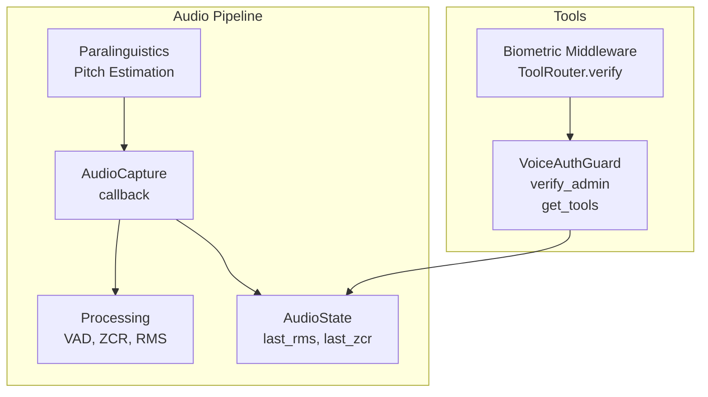
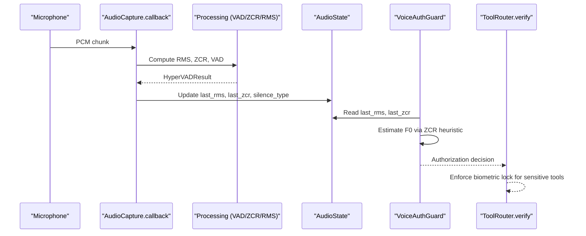
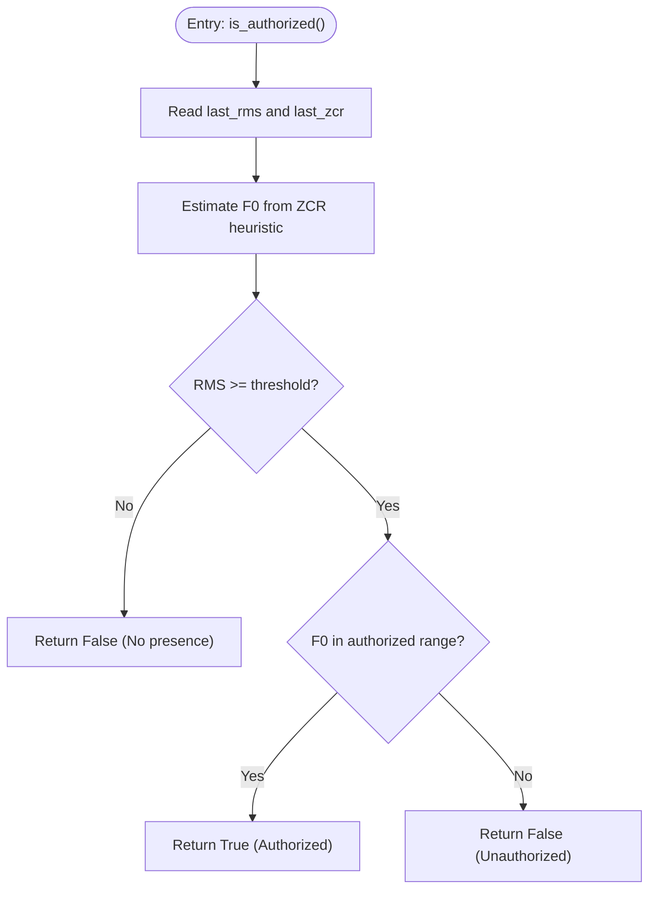
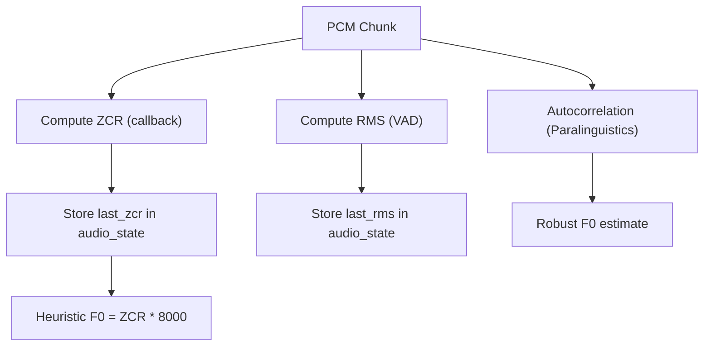
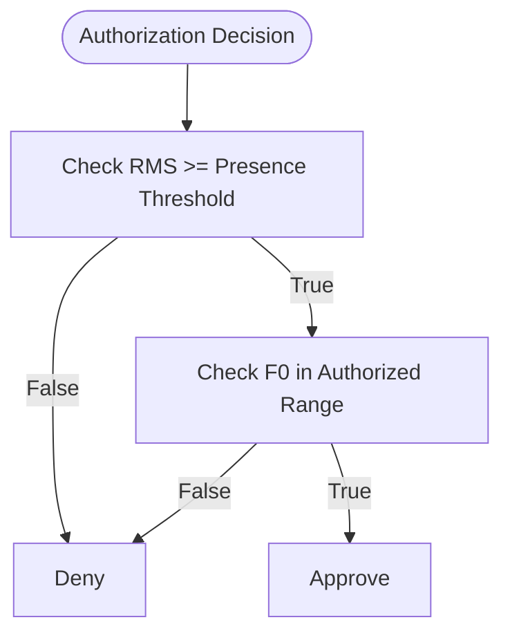
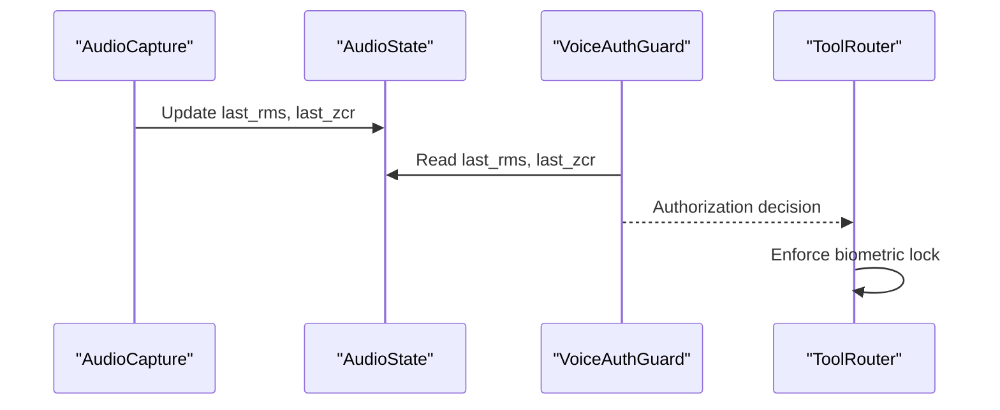
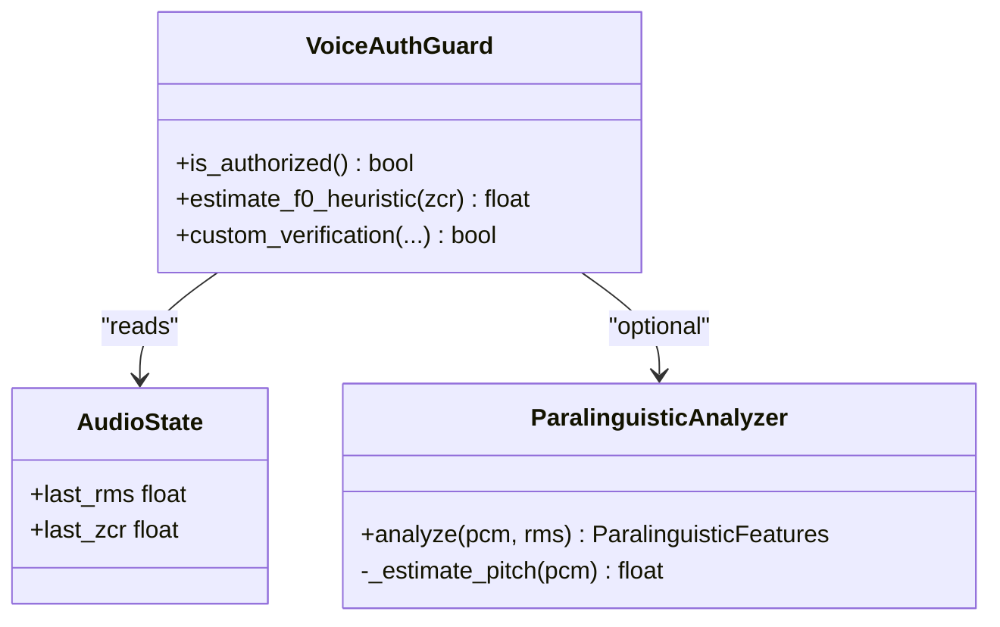
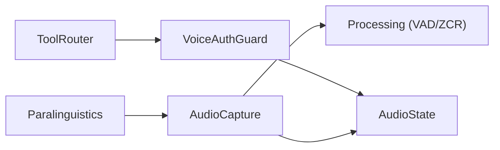

# Voice Authentication

<cite>
**Referenced Files in This Document**
- [voice_auth.py](file://core/tools/voice_auth.py)
- [state.py](file://core/audio/state.py)
- [capture.py](file://core/audio/capture.py)
- [processing.py](file://core/audio/processing.py)
- [paralinguistics.py](file://core/audio/paralinguistics.py)
- [router.py](file://core/tools/router.py)
- [test_cybernetic_core.py](file://tests/unit/test_cybernetic_core.py)
</cite>

## Table of Contents
1. [Introduction](#introduction)
2. [Project Structure](#project-structure)
3. [Core Components](#core-components)
4. [Architecture Overview](#architecture-overview)
5. [Detailed Component Analysis](#detailed-component-analysis)
6. [Dependency Analysis](#dependency-analysis)
7. [Performance Considerations](#performance-considerations)
8. [Troubleshooting Guide](#troubleshooting-guide)
9. [Conclusion](#conclusion)

## Introduction
This document explains the voice authentication system in Aether Voice OS. It focuses on the VoiceAuthGuard class that performs biometric verification using audio state metrics, the audio feature extraction pipeline using RMS energy and Zero Crossing Rate (ZCR) to estimate fundamental frequency (F0), and the authorization logic that validates pitch range and presence. It also documents the integration with audio_state for real-time biometric verification during tool execution, and provides guidance for extending the system with custom algorithms, tuning sensitivity thresholds, and optimizing performance across different voice types and recording conditions.

## Project Structure
The voice authentication system spans several modules:
- Tools: voice authentication tool definition and middleware integration
- Audio: shared audio state, capture pipeline, and processing utilities
- Paralinguistics: advanced audio feature extraction (pitch estimation, speech rate)
- Tests: unit tests validating voice biometrics logic

**Diagram sources**
- [voice_auth.py](file://core/tools/voice_auth.py#L19-L81)
- [router.py](file://core/tools/router.py#L55-L84)
- [capture.py](file://core/audio/capture.py#L329-L509)
- [processing.py](file://core/audio/processing.py#L389-L507)
- [state.py](file://core/audio/state.py#L36-L128)
- [paralinguistics.py](file://core/audio/paralinguistics.py#L31-L214)

**Section sources**
- [voice_auth.py](file://core/tools/voice_auth.py#L1-L82)
- [state.py](file://core/audio/state.py#L1-L129)
- [capture.py](file://core/audio/capture.py#L1-L575)
- [processing.py](file://core/audio/processing.py#L1-L508)
- [paralinguistics.py](file://core/audio/paralinguistics.py#L1-L214)
- [router.py](file://core/tools/router.py#L52-L92)

## Core Components
- VoiceAuthGuard: Stateless class that evaluates the current speaker’s biometric signature using RMS and ZCR from audio_state. It estimates F0 via a ZCR heuristic and enforces a pitch-range check along with a presence threshold.
- AudioState: Thread-safe singleton holding live audio metrics (RMS, ZCR, AEC state, silence classification) updated by the capture callback.
- AudioCapture: PyAudio callback that computes RMS, ZCR, and silence type, and updates audio_state for downstream consumers.
- Processing: Provides VAD utilities and multi-feature fusion used by capture and paralinguistics.
- Paralinguistics: Advanced F0 estimation using autocorrelation and speech rate estimation.
- ToolRouter: Middleware that enforces biometric verification for sensitive tools, checking a session context flag.

**Section sources**
- [voice_auth.py](file://core/tools/voice_auth.py#L19-L51)
- [state.py](file://core/audio/state.py#L36-L128)
- [capture.py](file://core/audio/capture.py#L442-L465)
- [processing.py](file://core/audio/processing.py#L389-L507)
- [paralinguistics.py](file://core/audio/paralinguistics.py#L68-L98)
- [router.py](file://core/tools/router.py#L55-L84)

## Architecture Overview
The voice authentication pipeline operates in real time:
- AudioCapture runs a high-priority callback that computes RMS and ZCR, updates audio_state, and classifies silence.
- VoiceAuthGuard reads audio_state to estimate F0 from ZCR and applies presence and pitch-range checks.
- ToolRouter enforces biometric verification for sensitive tools by inspecting a session context flag set by the audio capture layer.

**Diagram sources**
- [capture.py](file://core/audio/capture.py#L442-L465)
- [processing.py](file://core/audio/processing.py#L389-L507)
- [state.py](file://core/audio/state.py#L57-L58)
- [voice_auth.py](file://core/tools/voice_auth.py#L25-L51)
- [router.py](file://core/tools/router.py#L55-L84)

## Detailed Component Analysis

### VoiceAuthGuard: Biometric Signature Verification
- Inputs: audio_state.last_rms and audio_state.last_zcr
- Estimation: F0 ≈ ZCR × (sample_rate / 2) using a ZCR heuristic
- Presence check: rejects if RMS < threshold
- Authorization: accepts if estimated F0 falls within a configured pitch range
- Output: boolean authorization result

**Diagram sources**
- [voice_auth.py](file://core/tools/voice_auth.py#L25-L51)
- [state.py](file://core/audio/state.py#L57-L58)

**Section sources**
- [voice_auth.py](file://core/tools/voice_auth.py#L19-L51)

### Audio Feature Extraction: RMS, ZCR, and F0 Estimation
- RMS energy: computed by VAD engines and stored in audio_state for telemetry and verification.
- ZCR: computed in the capture callback using a low-allocation approach and stored in audio_state.
- F0 estimation: two complementary approaches
  - Heuristic: F0 ≈ ZCR × 8000 (used by VoiceAuthGuard)
  - Autocorrelation: robust pitch estimation used by paralinguistics

**Diagram sources**
- [capture.py](file://core/audio/capture.py#L446-L457)
- [processing.py](file://core/audio/processing.py#L389-L507)
- [paralinguistics.py](file://core/audio/paralinguistics.py#L68-L98)
- [voice_auth.py](file://core/tools/voice_auth.py#L34-L39)

**Section sources**
- [capture.py](file://core/audio/capture.py#L446-L457)
- [processing.py](file://core/audio/processing.py#L389-L507)
- [paralinguistics.py](file://core/audio/paralinguistics.py#L68-L98)
- [voice_auth.py](file://core/tools/voice_auth.py#L34-L39)

### Authorization Threshold Logic: Pitch Range Validation and Presence Detection
- Presence detection: rejects if RMS falls below a configured threshold
- Pitch range validation: compares estimated F0 to an authorized range
- Sensitivity tuning: adjust the authorized pitch range and presence threshold to match user voice characteristics

**Diagram sources**
- [voice_auth.py](file://core/tools/voice_auth.py#L45-L51)

**Section sources**
- [voice_auth.py](file://core/tools/voice_auth.py#L14-L16)
- [voice_auth.py](file://core/tools/voice_auth.py#L45-L51)

### Integration with audio_state for Real-Time Biometric Verification
- AudioCapture updates audio_state with last_rms and last_zcr on every callback.
- VoiceAuthGuard reads these values synchronously from the audio_state singleton.
- ToolRouter verifies a session context flag to enforce biometric locks for sensitive tools.

**Diagram sources**
- [capture.py](file://core/audio/capture.py#L442-L444)
- [state.py](file://core/audio/state.py#L57-L58)
- [voice_auth.py](file://core/tools/voice_auth.py#L31-L32)
- [router.py](file://core/tools/router.py#L69-L72)

**Section sources**
- [capture.py](file://core/audio/capture.py#L442-L444)
- [state.py](file://core/audio/state.py#L57-L58)
- [voice_auth.py](file://core/tools/voice_auth.py#L25-L51)
- [router.py](file://core/tools/router.py#L55-L84)

### Implementing Custom Voice Verification Algorithms
- Extend VoiceAuthGuard: add new methods to compute alternative biometric signatures (e.g., formant-based matching, cepstral features) and integrate with audio_state.
- Replace or complement the ZCR heuristic: use autocorrelation-based F0 from paralinguistics for more robust pitch estimation.
- Introduce multi-modal biometrics: combine RMS, ZCR, and spectral features with session context flags.

**Diagram sources**
- [voice_auth.py](file://core/tools/voice_auth.py#L19-L51)
- [paralinguistics.py](file://core/audio/paralinguistics.py#L31-L214)
- [state.py](file://core/audio/state.py#L57-L58)

**Section sources**
- [voice_auth.py](file://core/tools/voice_auth.py#L19-L51)
- [paralinguistics.py](file://core/audio/paralinguistics.py#L68-L98)

### Adjusting Sensitivity Thresholds and Extending the Authentication System
- Tune presence threshold: lower for faint voices, raise for noisy environments.
- Adjust authorized pitch range: widen for diverse voices, narrow for stricter security.
- Add session context flags: propagate biometric verification results to ToolRouter for sensitive tools.
- Incorporate adaptive thresholds: use AdaptiveVAD to refine presence detection under varying noise conditions.

**Section sources**
- [voice_auth.py](file://core/tools/voice_auth.py#L14-L16)
- [voice_auth.py](file://core/tools/voice_auth.py#L45-L49)
- [router.py](file://core/tools/router.py#L55-L84)
- [processing.py](file://core/audio/processing.py#L256-L323)

## Dependency Analysis
The voice authentication system exhibits clear separation of concerns:
- Tools depend on audio_state for runtime metrics.
- AudioCapture depends on processing utilities and updates audio_state.
- Paralinguistics provides robust F0 estimation for advanced use cases.
- ToolRouter enforces biometric locks using session context.

**Diagram sources**
- [voice_auth.py](file://core/tools/voice_auth.py#L10-L32)
- [capture.py](file://core/audio/capture.py#L442-L465)
- [processing.py](file://core/audio/processing.py#L389-L507)
- [paralinguistics.py](file://core/audio/paralinguistics.py#L31-L214)
- [router.py](file://core/tools/router.py#L55-L84)

**Section sources**
- [voice_auth.py](file://core/tools/voice_auth.py#L10-L32)
- [capture.py](file://core/audio/capture.py#L442-L465)
- [processing.py](file://core/audio/processing.py#L389-L507)
- [paralinguistics.py](file://core/audio/paralinguistics.py#L31-L214)
- [router.py](file://core/tools/router.py#L55-L84)

## Performance Considerations
- Real-time constraints: The capture callback must remain lightweight; avoid heavy computations on the hot path.
- ZCR computation: The callback uses a vectorized, low-allocation approach to compute ZCR efficiently.
- Backend acceleration: When available, the Rust backend accelerates DSP operations; otherwise, NumPy fallbacks are used.
- Adaptive thresholds: Using AdaptiveVAD reduces false positives in varying environments.
- Latency targets: The system aims for end-to-end latency under 200 ms; ensure AEC and VAD parameters are tuned accordingly.

[No sources needed since this section provides general guidance]

## Troubleshooting Guide
Common issues and resolutions:
- Authentication fails due to low presence: Increase the presence threshold or improve microphone placement and recording conditions.
- Frequent false positives: Narrow the authorized pitch range or add additional checks (e.g., RMS variance).
- Noisy environments: Enable or tune AdaptiveVAD thresholds; consider increasing AEC convergence parameters.
- Testing voice biometrics: Use unit tests to simulate authorized and unauthorized ZCR/RMS combinations.

Validation references:
- Unit test verifying pitch-based signature detection
- Unit test covering silence classification and RMS thresholds

**Section sources**
- [test_cybernetic_core.py](file://tests/unit/test_cybernetic_core.py#L41-L52)
- [test_cybernetic_core.py](file://tests/unit/test_cybernetic_core.py#L18-L31)

## Conclusion
The voice authentication system in Aether Voice OS leverages real-time audio metrics (RMS and ZCR) to perform efficient, low-latency biometric verification. VoiceAuthGuard integrates seamlessly with audio_state and ToolRouter to protect sensitive tools. By tuning thresholds, adopting robust F0 estimation, and incorporating adaptive mechanisms, the system can be optimized for diverse voice types and recording conditions while maintaining strong security posture.