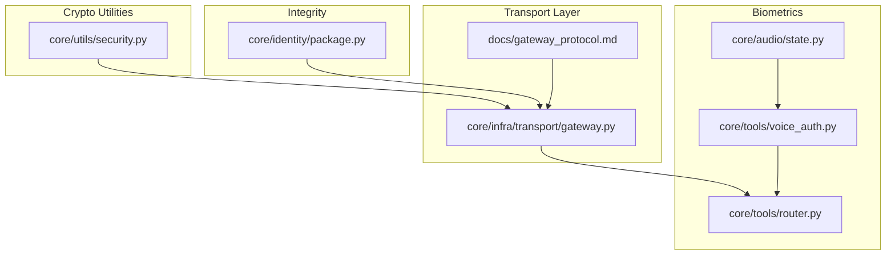
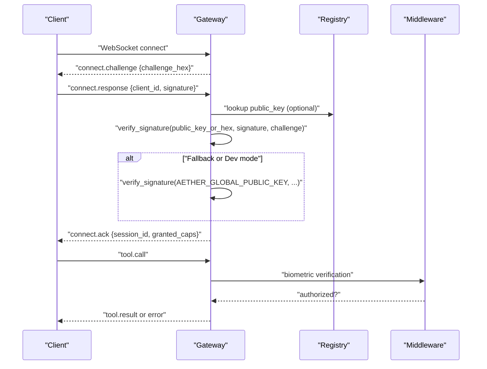
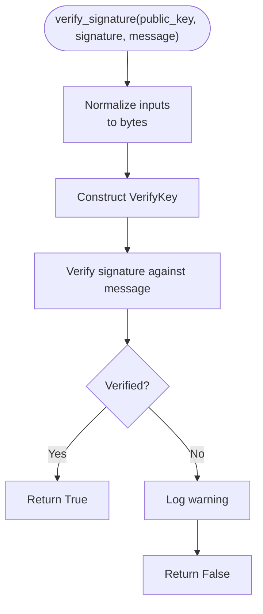
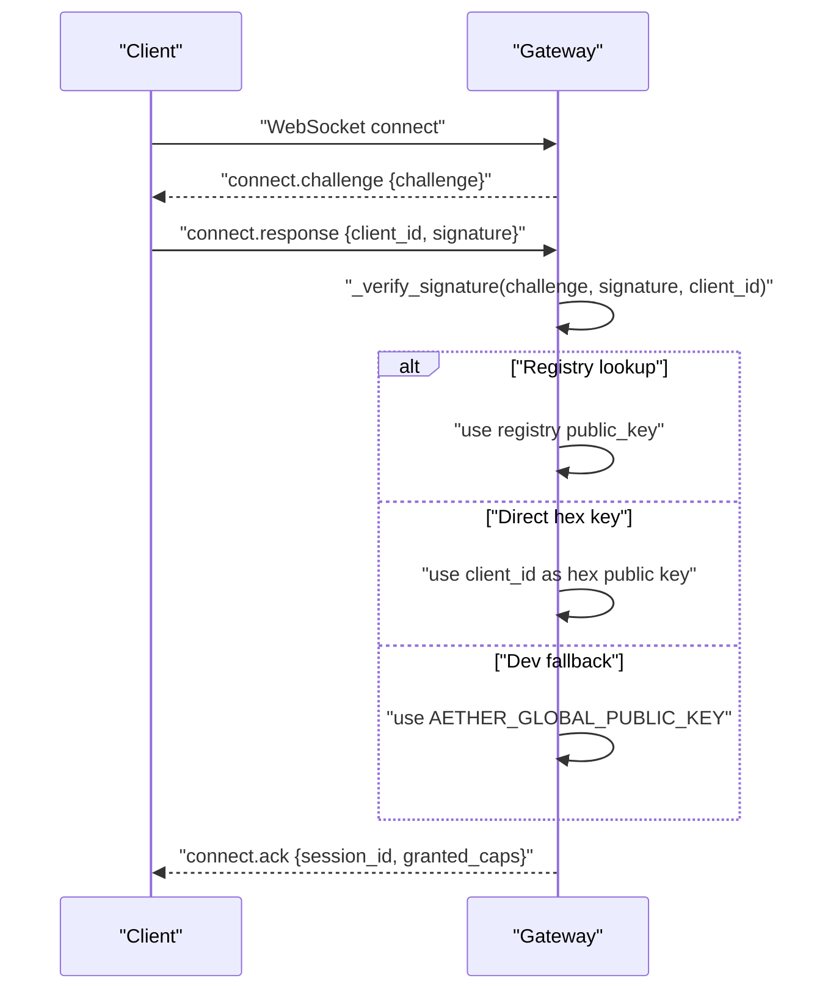
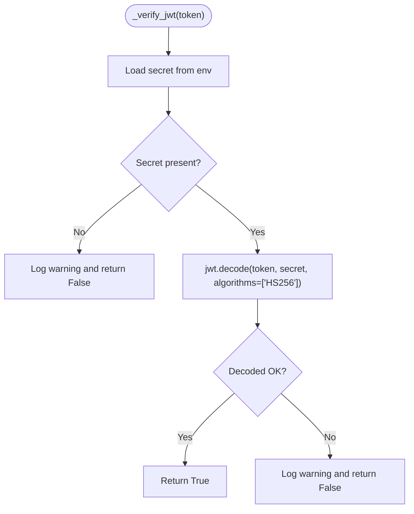
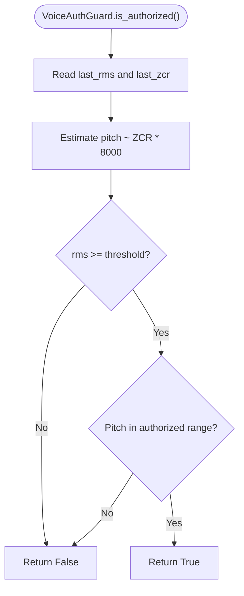
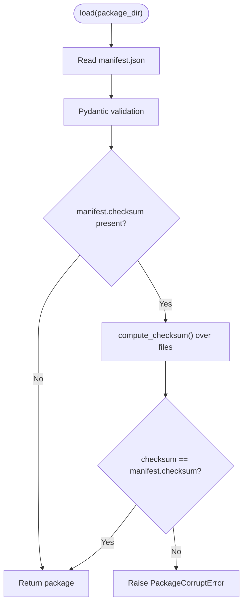
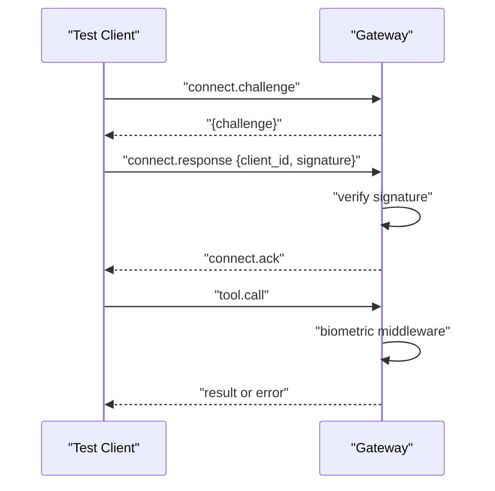
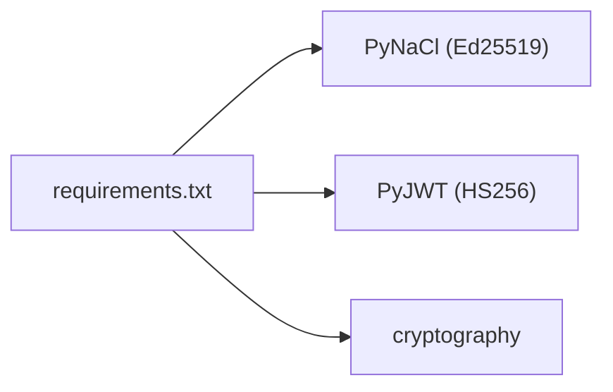

# Cryptographic Foundations

<cite>
**Referenced Files in This Document**
- [security.py](file://core/utils/security.py)
- [gateway.py](file://core/infra/transport/gateway.py)
- [voice_auth.py](file://core/tools/voice_auth.py)
- [state.py](file://core/audio/state.py)
- [router.py](file://core/tools/router.py)
- [package.py](file://core/identity/package.py)
- [gateway_protocol.md](file://docs/gateway_protocol.md)
- [requirements.txt](file://requirements.txt)
- [test_performance_stress.py](file://tests/e2e/test_performance_stress.py)
- [test_system_alpha_e2e.py](file://tests/e2e/test_system_alpha_e2e.py)
- [test_gateway_e2e.py](file://tests/integration/test_gateway_e2e.py)
</cite>

## Table of Contents
1. [Introduction](#introduction)
2. [Project Structure](#project-structure)
3. [Core Components](#core-components)
4. [Architecture Overview](#architecture-overview)
5. [Detailed Component Analysis](#detailed-component-analysis)
6. [Dependency Analysis](#dependency-analysis)
7. [Performance Considerations](#performance-considerations)
8. [Troubleshooting Guide](#troubleshooting-guide)
9. [Conclusion](#conclusion)
10. [Appendices](#appendices)

## Introduction
This document explains the cryptographic foundations of Aether Voice OS security, focusing on Ed25519 elliptic curve digital signatures, JWT token verification, and biometric voice authentication. It documents how these primitives integrate with the gateway protocol and tool execution middleware, and provides guidance on secure key management, rotation, auditing, performance optimization, and security testing.

## Project Structure
The cryptographic stack spans several modules:
- Ed25519 signature utilities and key generation
- Gateway handshake and authentication using Ed25519
- JWT verification for internal communications
- Biometric voice authentication middleware
- Package integrity verification using SHA-256
- Protocol-level handshake and messaging semantics

**Diagram sources**
- [security.py](file://core/utils/security.py#L1-L71)
- [gateway.py](file://core/infra/transport/gateway.py#L619-L670)
- [gateway_protocol.md](file://docs/gateway_protocol.md#L1-L125)
- [voice_auth.py](file://core/tools/voice_auth.py#L1-L82)
- [state.py](file://core/audio/state.py#L1-L129)
- [router.py](file://core/tools/router.py#L52-L84)
- [package.py](file://core/identity/package.py#L1-L166)

**Section sources**
- [security.py](file://core/utils/security.py#L1-L71)
- [gateway.py](file://core/infra/transport/gateway.py#L619-L670)
- [gateway_protocol.md](file://docs/gateway_protocol.md#L1-L125)
- [voice_auth.py](file://core/tools/voice_auth.py#L1-L82)
- [state.py](file://core/audio/state.py#L1-L129)
- [router.py](file://core/tools/router.py#L52-L84)
- [package.py](file://core/identity/package.py#L1-L166)

## Core Components
- Ed25519 signature verification and keypair generation
- Gateway Ed25519 handshake and fallback verification paths
- JWT HS256 verification for internal service communication
- Biometric voice authentication middleware
- Package integrity verification via SHA-256
- Protocol-level handshake and message semantics

**Section sources**
- [security.py](file://core/utils/security.py#L18-L70)
- [gateway.py](file://core/infra/transport/gateway.py#L619-L670)
- [gateway_protocol.md](file://docs/gateway_protocol.md#L37-L71)
- [voice_auth.py](file://core/tools/voice_auth.py#L19-L52)
- [package.py](file://core/identity/package.py#L140-L152)

## Architecture Overview
The system enforces zero-trust authentication and integrity:
- Clients receive a random 32-byte challenge and sign it with Ed25519 to authenticate.
- The gateway verifies the signature against a registry-managed public key, a direct hex key, or a development fallback.
- Internal service-to-service tokens are validated using HS256 with environment-provided secrets.
- Sensitive tools require biometric verification via voice-auth middleware.
- Agent packages are validated for integrity using SHA-256.

**Diagram sources**
- [gateway.py](file://core/infra/transport/gateway.py#L619-L670)
- [gateway_protocol.md](file://docs/gateway_protocol.md#L10-L33)
- [router.py](file://core/tools/router.py#L52-L84)

## Detailed Component Analysis

### Ed25519 Signature Utilities
- Provides signature verification and keypair generation using PyNaCl.
- Accepts hex-encoded or raw bytes for keys and messages.
- Returns boolean outcomes with logging on failures.

**Diagram sources**
- [security.py](file://core/utils/security.py#L18-L55)

**Section sources**
- [security.py](file://core/utils/security.py#L18-L70)

### Gateway Ed25519 Handshake and Verification
- Issues a 32-byte random challenge in hex.
- Accepts client_id and signature in the response.
- Verification paths:
  - Lookup public key from registry by client_id.
  - Treat client_id as a 64-character hex public key (ephemeral/direct mode).
  - Use development fallback via environment variable.
- On success, responds with connect.ack and grants capabilities.

**Diagram sources**
- [gateway.py](file://core/infra/transport/gateway.py#L619-L670)
- [gateway_protocol.md](file://docs/gateway_protocol.md#L41-L71)

**Section sources**
- [gateway.py](file://core/infra/transport/gateway.py#L619-L670)
- [gateway_protocol.md](file://docs/gateway_protocol.md#L37-L71)

### JWT Token System (HS256)
- Validates HS256 tokens using a secret from environment variables.
- Supports AETHER_JWT_SECRET or GOOGLE_API_KEY as the shared secret.
- Returns boolean outcome with warnings on failures.

**Diagram sources**
- [gateway.py](file://core/infra/transport/gateway.py#L619-L635)

**Section sources**
- [gateway.py](file://core/infra/transport/gateway.py#L619-L635)

### Biometric Voice Authentication and Middleware
- VoiceAuthGuard estimates speaker pitch from audio state telemetry and compares to an authorized range.
- ToolRouter enforces biometric verification for sensitive tools and supports a development fallback.
- The middleware integrates with tool dispatch to guard high-risk operations.

**Diagram sources**
- [voice_auth.py](file://core/tools/voice_auth.py#L25-L51)
- [state.py](file://core/audio/state.py#L31-L49)
- [router.py](file://core/tools/router.py#L52-L84)

**Section sources**
- [voice_auth.py](file://core/tools/voice_auth.py#L19-L52)
- [state.py](file://core/audio/state.py#L31-L49)
- [router.py](file://core/tools/router.py#L52-L84)

### Package Integrity and SHA-256 Verification
- Packages include a checksum field for integrity.
- The loader computes SHA-256 over all files excluding manifest.json and compares to the declared checksum.
- Validation raises explicit errors on mismatch.

**Diagram sources**
- [package.py](file://core/identity/package.py#L86-L138)
- [package.py](file://core/identity/package.py#L140-L152)

**Section sources**
- [package.py](file://core/identity/package.py#L86-L152)

### Integration with Gateway Protocol and Tool Execution
- The handshake uses Ed25519 to establish authenticated sessions.
- Tool execution routes enforce biometric verification for sensitive operations.
- Tests demonstrate end-to-end handshake and signature verification.

**Diagram sources**
- [test_system_alpha_e2e.py](file://tests/e2e/test_system_alpha_e2e.py#L124-L144)
- [test_gateway_e2e.py](file://tests/integration/test_gateway_e2e.py#L115-L134)
- [router.py](file://core/tools/router.py#L287-L301)

**Section sources**
- [test_system_alpha_e2e.py](file://tests/e2e/test_system_alpha_e2e.py#L124-L144)
- [test_gateway_e2e.py](file://tests/integration/test_gateway_e2e.py#L115-L134)
- [router.py](file://core/tools/router.py#L287-L301)

## Dependency Analysis
External libraries used for cryptography and JWT:
- PyNaCl for Ed25519 signature operations
- PyJWT for HS256 token decoding
- cryptography for general crypto utilities

**Diagram sources**
- [requirements.txt](file://requirements.txt#L13-L16)

**Section sources**
- [requirements.txt](file://requirements.txt#L13-L16)

## Performance Considerations
- Ed25519 verification is fast and constant-time; ensure inputs are normalized to bytes to avoid overhead.
- Prefer direct hex public keys for ephemeral clients to bypass registry lookups.
- Keep JWT secret management efficient; avoid repeated environment reads.
- Use asynchronous broadcasting and batched operations in the gateway to minimize handshake latency.
- Tests demonstrate handshake latency targets suitable for local environments.

**Section sources**
- [test_performance_stress.py](file://tests/e2e/test_performance_stress.py#L98-L128)
- [test_system_alpha_e2e.py](file://tests/e2e/test_system_alpha_e2e.py#L124-L144)
- [test_gateway_e2e.py](file://tests/integration/test_gateway_e2e.py#L115-L134)

## Troubleshooting Guide
Common issues and resolutions:
- Signature verification failures:
  - Ensure challenge is signed as raw bytes, not hex, before sending.
  - Confirm client_id matches registry-managed public key or is a valid 64-character hex key.
  - Verify environment variable for development fallback is set if using that path.
- JWT verification failures:
  - Confirm AETHER_JWT_SECRET or GOOGLE_API_KEY is set and correct.
  - Ensure token uses HS256 algorithm.
- Biometric verification failures:
  - Validate audio telemetry is populated and RMS threshold is met.
  - Adjust authorized pitch range according to speaker characteristics.
- Package integrity errors:
  - Recompute checksum and update manifest.json accordingly.

**Section sources**
- [gateway.py](file://core/infra/transport/gateway.py#L619-L670)
- [voice_auth.py](file://core/tools/voice_auth.py#L25-L51)
- [package.py](file://core/identity/package.py#L123-L135)

## Conclusion
Aether Voice OS employs strong cryptographic primitives—Ed25519 for identity and integrity, JWT HS256 for internal service trust, and SHA-256 for package integrity—combined with biometric middleware to enforce zero-trust access control. The gateway protocol formalizes secure, low-latency handshakes, while tests and documentation guide secure deployment and operation.

## Appendices

### Implementing Custom Cryptographic Operations
- To add a new Ed25519 operation, reuse the existing verification and key generation helpers.
- For JWT operations, ensure algorithm lists are constrained and secrets are managed via environment variables.
- For integrity checks, mirror the package checksum computation pattern.

**Section sources**
- [security.py](file://core/utils/security.py#L18-L70)
- [gateway.py](file://core/infra/transport/gateway.py#L619-L635)
- [package.py](file://core/identity/package.py#L140-L152)

### Key Rotation Procedures
- Rotate Ed25519 keys by generating a new keypair and updating the registry-managed public key for the client identity.
- For JWT, rotate secrets by updating environment variables and reissuing tokens with the new secret.
- Maintain backward compatibility during transitions by supporting both old and new keys/secrets temporarily.

**Section sources**
- [security.py](file://core/utils/security.py#L58-L70)
- [gateway.py](file://core/infra/transport/gateway.py#L619-L670)

### Security Audit Trails
- All handshakes and tool calls are traceable via telemetry; ensure audit logs capture challenge/response exchanges and biometric decisions.
- Monitor signature verification failures and JWT decode errors for anomaly detection.

**Section sources**
- [gateway_protocol.md](file://docs/gateway_protocol.md#L120-L125)
- [router.py](file://core/tools/router.py#L52-L84)

### Best Practices and Compliance
- Enforce environment-based secret management for JWT and development fallbacks.
- Use immutable manifests with checksums for all distributed artifacts.
- Limit capabilities per session and gate sensitive tools behind biometric middleware.
- Regularly review and rotate cryptographic keys and secrets.

**Section sources**
- [gateway.py](file://core/infra/transport/gateway.py#L619-L670)
- [package.py](file://core/identity/package.py#L123-L135)
- [router.py](file://core/tools/router.py#L52-L84)

### Security Testing Methodologies
- End-to-end tests validate handshake flows and signature verification.
- Stress tests measure handshake latency under load.
- Unit tests mock verification to isolate middleware behavior.

**Section sources**
- [test_system_alpha_e2e.py](file://tests/e2e/test_system_alpha_e2e.py#L124-L144)
- [test_performance_stress.py](file://tests/e2e/test_performance_stress.py#L98-L128)
- [test_gateway_e2e.py](file://tests/integration/test_gateway_e2e.py#L115-L134)