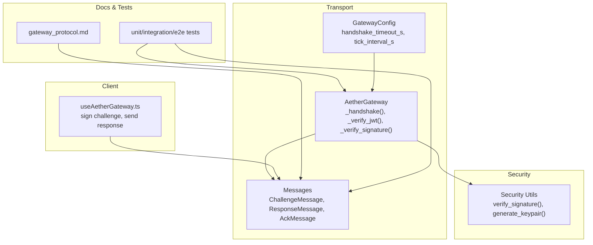
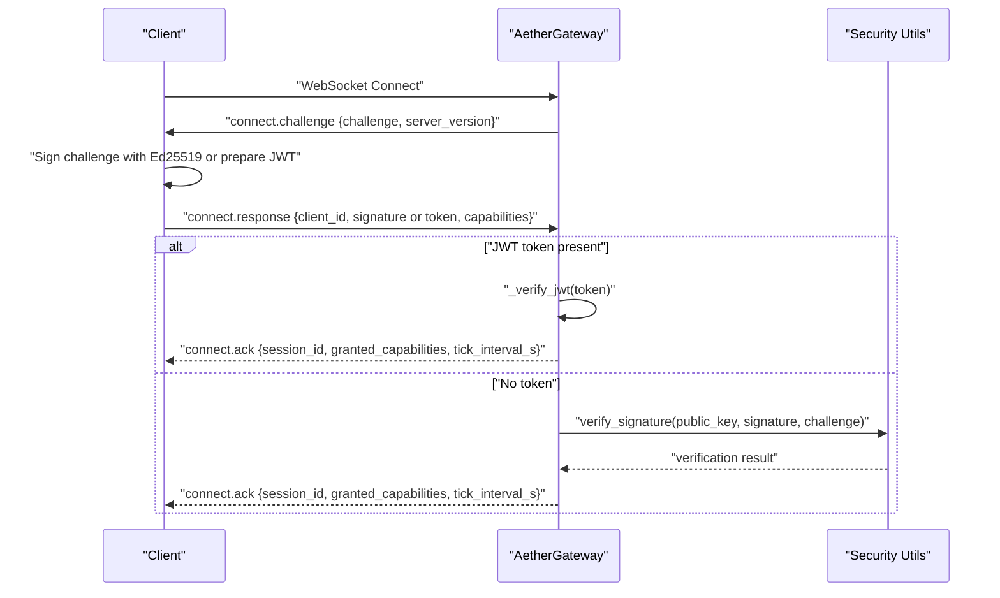
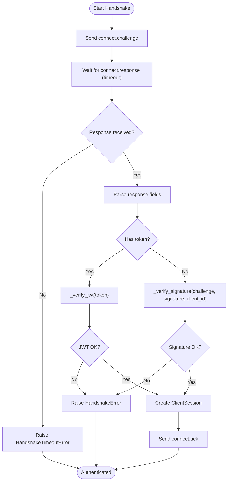
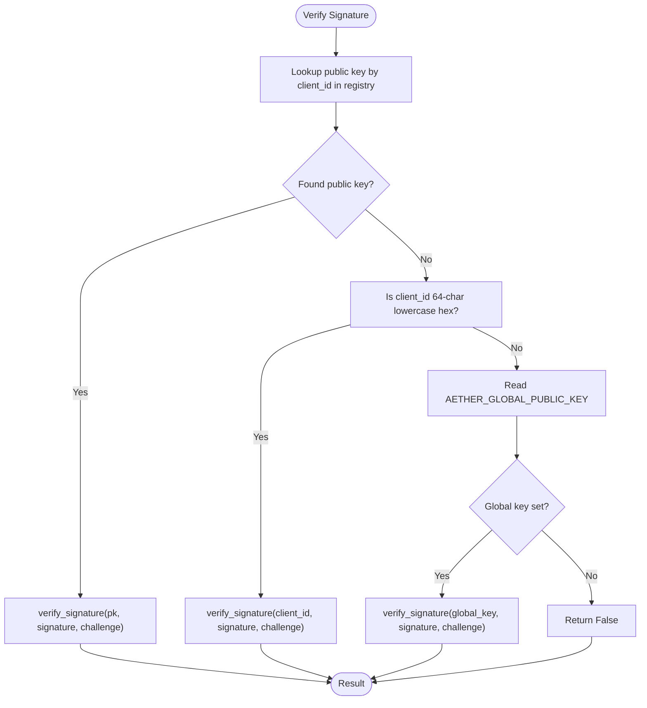
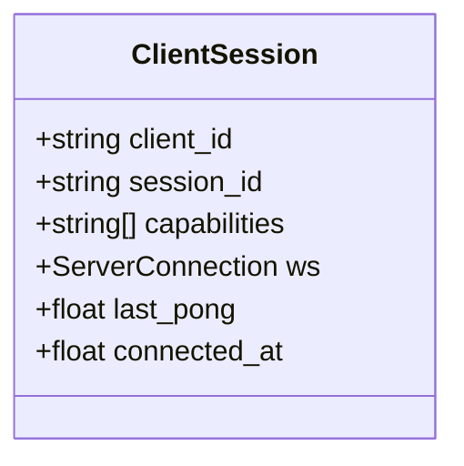
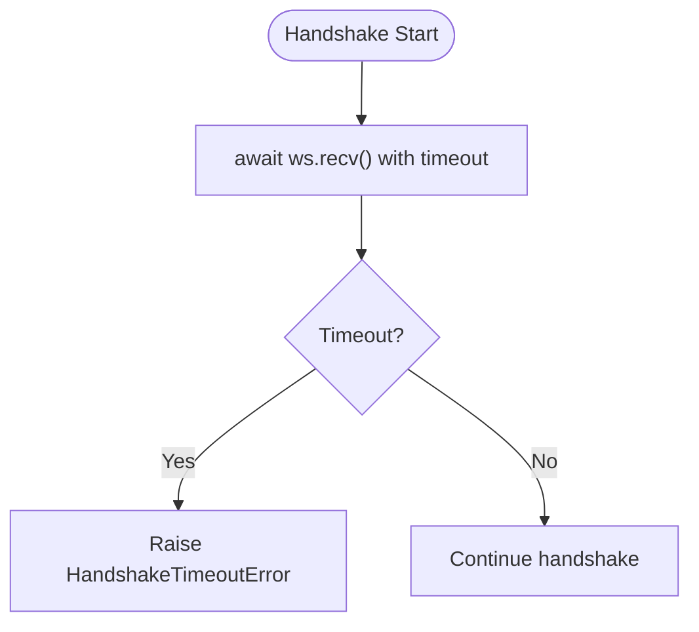
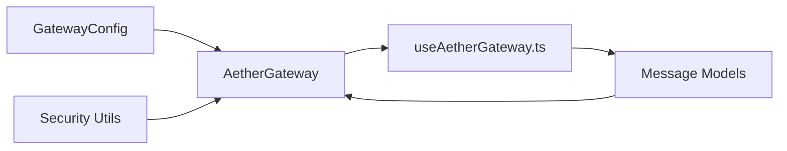

# Authentication & Handshake

<cite>
**Referenced Files in This Document**
- [gateway.py](file://core/infra/transport/gateway.py)
- [messages.py](file://core/infra/transport/messages.py)
- [security.py](file://core/utils/security.py)
- [errors.py](file://core/utils/errors.py)
- [config.py](file://core/infra/config.py)
- [useAetherGateway.ts](file://apps/portal/src/hooks/useAetherGateway.ts)
- [gateway_protocol.md](file://docs/gateway_protocol.md)
- [SECURITY_UI.md](file://docs/SECURITY_UI.md)
- [ops_survival_kit.md](file://docs/ops_survival_kit.md)
- [test_gateway.py](file://tests/unit/test_gateway.py)
- [test_system_alpha_e2e.py](file://tests/e2e/test_system_alpha_e2e.py)
- [test_performance_stress.py](file://tests/e2e/test_performance_stress.py)
</cite>

## Table of Contents
1. [Introduction](#introduction)
2. [Project Structure](#project-structure)
3. [Core Components](#core-components)
4. [Architecture Overview](#architecture-overview)
5. [Detailed Component Analysis](#detailed-component-analysis)
6. [Dependency Analysis](#dependency-analysis)
7. [Performance Considerations](#performance-considerations)
8. [Troubleshooting Guide](#troubleshooting-guide)
9. [Conclusion](#conclusion)

## Introduction
This document explains the Aether Voice OS three-phase Ed25519 cryptographic handshake used to authenticate clients and establish secure sessions over WebSocket. It covers:
- connect.challenge (server generates a 32-byte random challenge)
- connect.response (client responds with Ed25519 signature or JWT token)
- connect.ack (server acknowledges and grants capabilities)

It also documents the dual authentication mechanism (JWT HS256 and Ed25519), the signature verification process (public key registry lookup, ephemeral mode fallback, global auth fallback), the ClientSession class, timeouts, error handling, and security considerations. Examples of successful flows, authentication failures, and troubleshooting steps are included.

## Project Structure
The handshake logic spans several modules:
- Transport gateway and message models define the protocol and session lifecycle
- Security utilities provide Ed25519 verification and key generation
- Configuration defines timeouts and intervals
- Client-side hook demonstrates a typical client implementation
- Tests and docs provide examples and operational guidance

**Diagram sources**
- [gateway.py](file://core/infra/transport/gateway.py#L529-L670)
- [messages.py](file://core/infra/transport/messages.py#L47-L80)
- [security.py](file://core/utils/security.py#L18-L70)
- [config.py](file://core/infra/config.py#L88-L100)
- [useAetherGateway.ts](file://apps/portal/src/hooks/useAetherGateway.ts#L77-L111)
- [gateway_protocol.md](file://docs/gateway_protocol.md#L10-L33)

**Section sources**
- [gateway.py](file://core/infra/transport/gateway.py#L529-L670)
- [messages.py](file://core/infra/transport/messages.py#L47-L80)
- [security.py](file://core/utils/security.py#L18-L70)
- [config.py](file://core/infra/config.py#L88-L100)
- [useAetherGateway.ts](file://apps/portal/src/hooks/useAetherGateway.ts#L77-L111)
- [gateway_protocol.md](file://docs/gateway_protocol.md#L10-L33)

## Core Components
- AetherGateway: Implements the handshake, authentication, session creation, and ACK emission. Manages client sessions and heartbeat loops.
- ClientSession: Tracks per-client state including client_id, session_id, capabilities, and connection timestamps.
- Message models: Define connect.challenge, connect.response, connect.ack, and error messages.
- Security utilities: Provide Ed25519 signature verification and keypair generation.
- Configuration: Defines handshake timeout and heartbeat interval.

Key responsibilities:
- Challenge generation with a 32-byte random hex string
- Response parsing and dual-authentication (JWT HS256 or Ed25519)
- Signature verification with registry/public key fallbacks
- Session creation and ACK emission with granted capabilities
- Timeout handling and error propagation

**Section sources**
- [gateway.py](file://core/infra/transport/gateway.py#L52-L120)
- [messages.py](file://core/infra/transport/messages.py#L47-L80)
- [security.py](file://core/utils/security.py#L18-L70)
- [config.py](file://core/infra/config.py#L88-L100)

## Architecture Overview
The handshake follows a strict three-phase flow with explicit timeouts and error signaling.

**Diagram sources**
- [gateway.py](file://core/infra/transport/gateway.py#L559-L617)
- [messages.py](file://core/infra/transport/messages.py#L47-L80)
- [security.py](file://core/utils/security.py#L18-L56)

**Section sources**
- [gateway.py](file://core/infra/transport/gateway.py#L559-L617)
- [messages.py](file://core/infra/transport/messages.py#L47-L80)
- [gateway_protocol.md](file://docs/gateway_protocol.md#L10-L33)

## Detailed Component Analysis

### Handshake Phases and Protocol Messages
- connect.challenge: Server sends a 32-byte random challenge as a hex string and server version.
- connect.response: Client responds with client_id, either:
  - signature (Ed25519) for registry-managed identities or ephemeral mode, or
  - token (JWT HS256) for service-to-service or ephemeral sessions.
- connect.ack: Server replies with session_id, granted_capabilities, and tick_interval_s.

**Diagram sources**
- [gateway.py](file://core/infra/transport/gateway.py#L559-L617)
- [messages.py](file://core/infra/transport/messages.py#L47-L80)

**Section sources**
- [gateway.py](file://core/infra/transport/gateway.py#L559-L617)
- [messages.py](file://core/infra/transport/messages.py#L47-L80)
- [gateway_protocol.md](file://docs/gateway_protocol.md#L41-L71)

### Dual Authentication Mechanism
- JWT HS256:
  - Secret is drawn from environment variables (AETHER_JWT_SECRET or GOOGLE_API_KEY).
  - Verified using HS256 algorithm.
- Ed25519:
  - Signature verified against a public key resolved via:
    1) Registry lookup by client_id
    2) Ephemeral/direct mode: if client_id is a 64-character lowercase hex string, treat as public key
    3) Global auth fallback: AETHER_GLOBAL_PUBLIC_KEY environment variable

**Diagram sources**
- [gateway.py](file://core/infra/transport/gateway.py#L637-L670)
- [security.py](file://core/utils/security.py#L18-L56)

**Section sources**
- [gateway.py](file://core/infra/transport/gateway.py#L619-L670)
- [SECURITY_UI.md](file://docs/SECURITY_UI.md#L13-L27)

### ClientSession Class
The ClientSession object tracks:
- client_id: Identity or public key hex
- session_id: Unique session identifier
- capabilities: Granted capabilities negotiated during handshake
- ws: WebSocket connection handle
- last_pong: Timestamp of last pong received
- connected_at: Connection timestamp

**Diagram sources**
- [gateway.py](file://core/infra/transport/gateway.py#L52-L67)

**Section sources**
- [gateway.py](file://core/infra/transport/gateway.py#L52-L67)

### Timeout Handling and Heartbeat
- Handshake timeout: Controlled by GatewayConfig.handshake_timeout_s; default 10 seconds.
- Heartbeat: Gateway periodically sends tick messages and prunes dead clients after max_missed_ticks * tick_interval_s.
- On timeout, the server raises HandshakeTimeoutError and closes the connection.

**Diagram sources**
- [gateway.py](file://core/infra/transport/gateway.py#L569-L580)
- [config.py](file://core/infra/config.py#L98)

**Section sources**
- [gateway.py](file://core/infra/transport/gateway.py#L569-L580)
- [config.py](file://core/infra/config.py#L98)

### Error Scenarios and Propagation
Common failure modes:
- Missing client_id in response
- Invalid JSON response format
- JWT verification failure
- Ed25519 signature verification failure
- Handshake timeout

On handshake errors, the server sends an error message with code 401 and closes the connection.

**Section sources**
- [gateway.py](file://core/infra/transport/gateway.py#L581-L601)
- [errors.py](file://core/utils/errors.py#L65-L71)
- [test_gateway.py](file://tests/unit/test_gateway.py#L110-L125)

### Successful Handshake Example
- Client connects and receives connect.challenge
- Client signs the challenge bytes with its Ed25519 key and sends connect.response with client_id and signature
- Server verifies signature, creates ClientSession, and replies with connect.ack

**Section sources**
- [test_system_alpha_e2e.py](file://tests/e2e/test_system_alpha_e2e.py#L115-L144)
- [test_performance_stress.py](file://tests/e2e/test_performance_stress.py#L93-L138)

### Authentication Failure Examples
- JWT failure: Missing or invalid AETHER_JWT_SECRET or GOOGLE_API_KEY, or malformed token
- Ed25519 failure: Wrong client_id, invalid signature, or public key not found in registry and not provided as 64-char hex

**Section sources**
- [gateway.py](file://core/infra/transport/gateway.py#L592-L601)
- [SECURITY_UI.md](file://docs/SECURITY_UI.md#L13-L27)

## Dependency Analysis
The handshake depends on:
- GatewayConfig for timing parameters
- Message models for protocol framing
- Security utilities for Ed25519 verification
- Client-side implementation for challenge signing

**Diagram sources**
- [config.py](file://core/infra/config.py#L88-L100)
- [gateway.py](file://core/infra/transport/gateway.py#L529-L670)
- [messages.py](file://core/infra/transport/messages.py#L47-L80)
- [security.py](file://core/utils/security.py#L18-L70)
- [useAetherGateway.ts](file://apps/portal/src/hooks/useAetherGateway.ts#L77-L111)

**Section sources**
- [config.py](file://core/infra/config.py#L88-L100)
- [gateway.py](file://core/infra/transport/gateway.py#L529-L670)
- [messages.py](file://core/infra/transport/messages.py#L47-L80)
- [security.py](file://core/utils/security.py#L18-L70)
- [useAetherGateway.ts](file://apps/portal/src/hooks/useAetherGateway.ts#L77-L111)

## Performance Considerations
- Handshake latency targets under 200 ms for local environments, validated by performance tests
- Keep handshake timeout reasonable to avoid prolonged resource holding
- Minimize unnecessary logging during handshake to reduce overhead

**Section sources**
- [test_performance_stress.py](file://tests/e2e/test_performance_stress.py#L124-L128)

## Troubleshooting Guide
Common issues and resolutions:
- AUTH_FAILED or signature verification failures:
  - Ensure the client_id matches the public key used for signing
  - For ephemeral mode, confirm client_id is a 64-character lowercase hex string
  - For registry mode, ensure the identity exists and has a public key
  - For development fallback, set AETHER_GLOBAL_PUBLIC_KEY appropriately
- JWT authentication failures:
  - Set AETHER_JWT_SECRET or GOOGLE_API_KEY
  - Ensure token uses HS256 algorithm
- Handshake timeouts:
  - Increase handshake_timeout_s in GatewayConfig if clients are slow
  - Verify network connectivity and firewall rules
- Operational diagnostics:
  - Use the Ops Survival Kit guidance for port conflicts, Redis connectivity, and audio device issues

**Section sources**
- [gateway.py](file://core/infra/transport/gateway.py#L569-L601)
- [SECURITY_UI.md](file://docs/SECURITY_UI.md#L13-L27)
- [ops_survival_kit.md](file://docs/ops_survival_kit.md#L38-L53)
- [test_gateway.py](file://tests/unit/test_gateway.py#L110-L125)

## Conclusion
The Aether Voice OS handshake provides a robust, zero-trust authentication mechanism combining Ed25519 challenge-response with optional JWT HS256 support. The implementation includes layered verification, clear timeouts, and practical fallbacks for development and ephemeral deployments. Following the documented flows, error handling, and troubleshooting steps ensures reliable and secure client-server sessions.