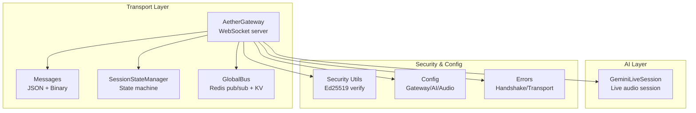
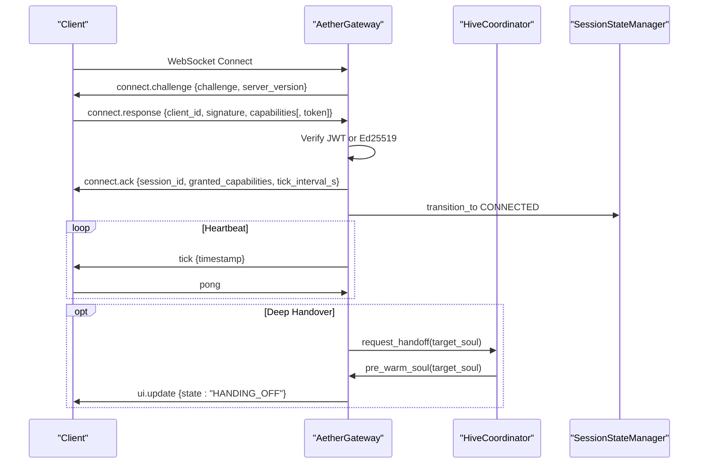
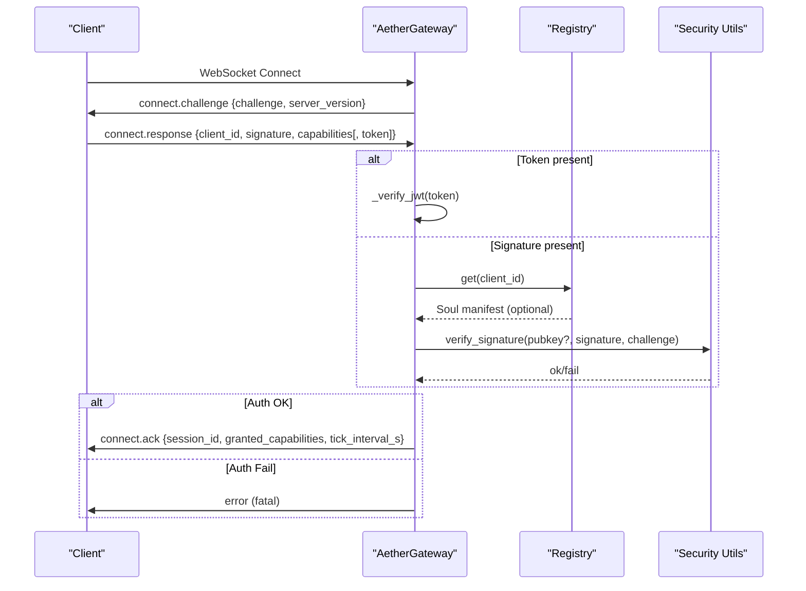
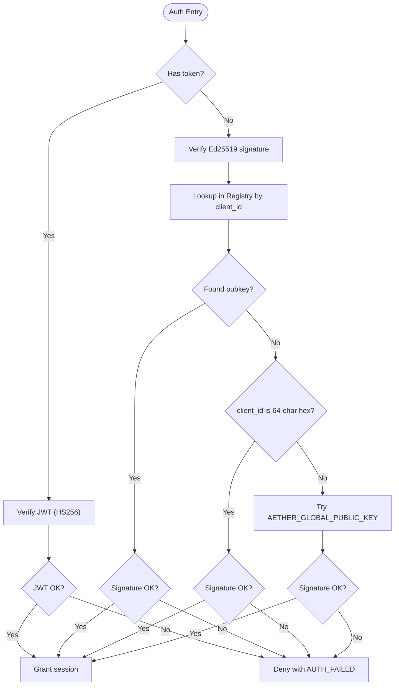
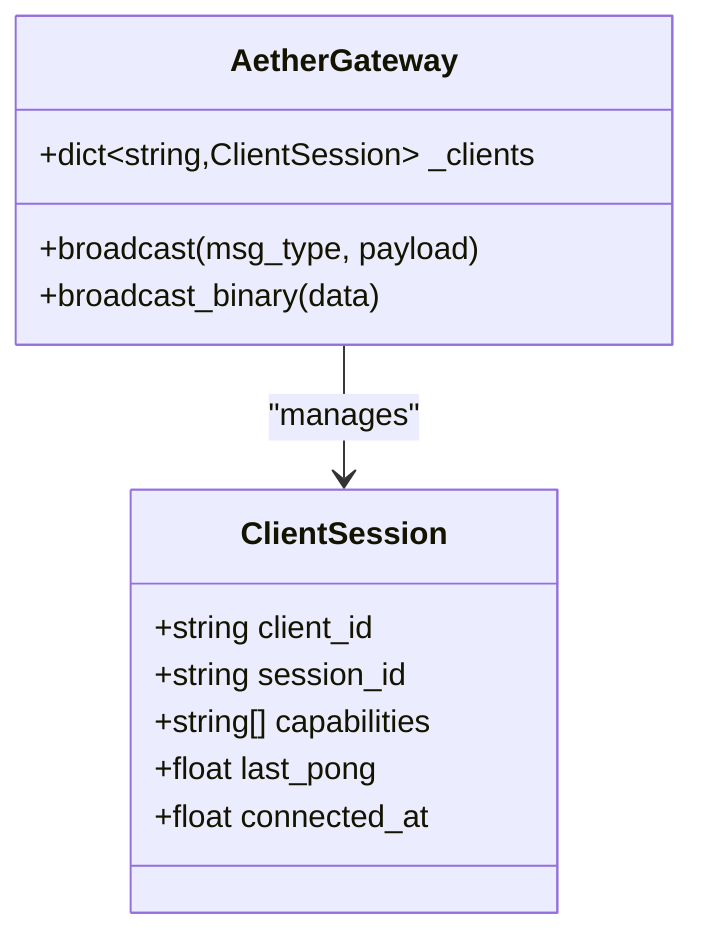
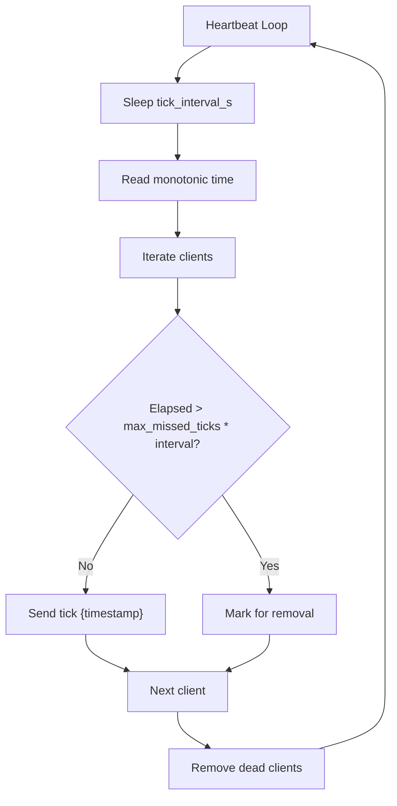
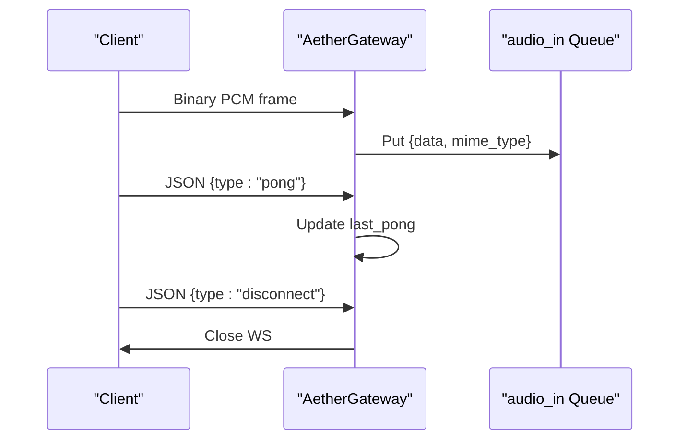
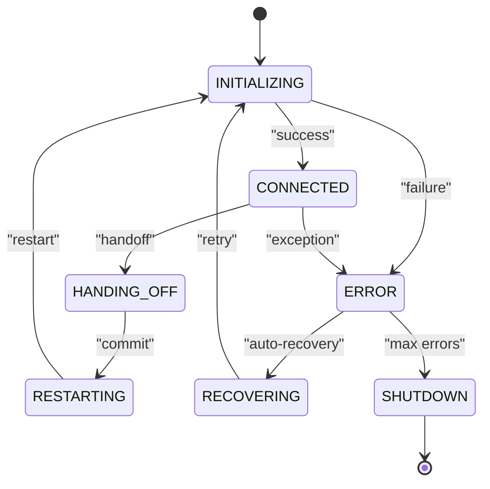
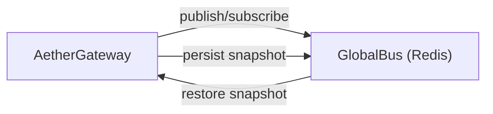
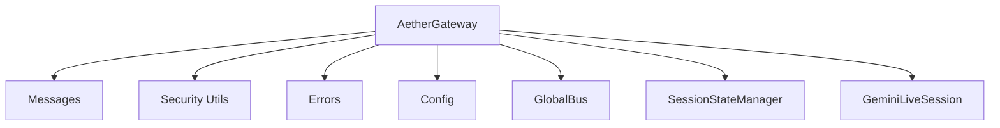

# Gateway Protocol

<cite>
**Referenced Files in This Document**
- [gateway.py](file://core/infra/transport/gateway.py)
- [messages.py](file://core/infra/transport/messages.py)
- [session_state.py](file://core/infra/transport/session_state.py)
- [bus.py](file://core/infra/transport/bus.py)
- [config.py](file://core/infra/config.py)
- [security.py](file://core/utils/security.py)
- [errors.py](file://core/utils/errors.py)
- [session.py](file://core/ai/session.py)
- [gateway_protocol.md](file://docs/gateway_protocol.md)
- [test_gateway.py](file://tests/unit/test_gateway.py)
- [test_gateway_e2e.py](file://tests/integration/test_gateway_e2e.py)
</cite>

## Table of Contents
1. [Introduction](#introduction)
2. [Project Structure](#project-structure)
3. [Core Components](#core-components)
4. [Architecture Overview](#architecture-overview)
5. [Detailed Component Analysis](#detailed-component-analysis)
6. [Dependency Analysis](#dependency-analysis)
7. [Performance Considerations](#performance-considerations)
8. [Troubleshooting Guide](#troubleshooting-guide)
9. [Conclusion](#conclusion)
10. [Appendices](#appendices)

## Introduction
This document describes the Aether Voice OS WebSocket Gateway Protocol. It covers the three-phase Ed25519 cryptographic handshake, authentication flows (JWT and Ed25519), session management, capability negotiation, heartbeat and pruning, message routing for audio and control messages, and the integration with the transport layer and state management. It also includes security considerations, timeout configurations, and troubleshooting guidance.

## Project Structure
The Gateway Protocol is implemented primarily in the transport layer and integrates with session state management, configuration, and security utilities.

**Diagram sources**
- [gateway.py](file://core/infra/transport/gateway.py#L69-L124)
- [messages.py](file://core/infra/transport/messages.py#L16-L36)
- [session_state.py](file://core/infra/transport/session_state.py#L71-L120)
- [bus.py](file://core/infra/transport/bus.py#L25-L95)
- [config.py](file://core/infra/config.py#L71-L83)
- [security.py](file://core/utils/security.py#L18-L56)
- [errors.py](file://core/utils/errors.py#L61-L75)
- [session.py](file://core/ai/session.py#L43-L95)

**Section sources**
- [gateway.py](file://core/infra/transport/gateway.py#L69-L124)
- [messages.py](file://core/infra/transport/messages.py#L16-L36)
- [session_state.py](file://core/infra/transport/session_state.py#L71-L120)
- [bus.py](file://core/infra/transport/bus.py#L25-L95)
- [config.py](file://core/infra/config.py#L71-L83)
- [security.py](file://core/utils/security.py#L18-L56)
- [errors.py](file://core/utils/errors.py#L61-L75)
- [session.py](file://core/ai/session.py#L43-L95)

## Core Components
- AetherGateway: WebSocket server that manages connections, performs Ed25519/JWT authentication, capability negotiation, heartbeat, and routes audio/control messages.
- ClientSession: Tracks per-client state (session_id, capabilities, last pong, connected time).
- SessionStateManager: Centralized state machine for the Gemini Live session with atomic transitions, persistence, and broadcasting.
- GlobalBus: Redis-backed pub/sub and KV for distributed state and cross-node synchronization.
- Messages: Typed JSON message models for handshake, lifecycle, audio, tooling, UI, and error notifications.
- Security: Ed25519 signature verification utilities.
- Errors: Structured exceptions for handshake and transport errors.
- GeminiLiveSession: Bidirectional audio session with tool call handling and deep handover support.

**Section sources**
- [gateway.py](file://core/infra/transport/gateway.py#L52-L124)
- [session_state.py](file://core/infra/transport/session_state.py#L71-L120)
- [bus.py](file://core/infra/transport/bus.py#L25-L95)
- [messages.py](file://core/infra/transport/messages.py#L16-L80)
- [security.py](file://core/utils/security.py#L18-L56)
- [errors.py](file://core/utils/errors.py#L61-L75)
- [session.py](file://core/ai/session.py#L43-L95)

## Architecture Overview
The Gateway enforces a secure, low-latency handshake, establishes a session, and maintains steady-state heartbeats. It supports speculative pre-warming and deep handover for seamless expert transitions.

**Diagram sources**
- [gateway.py](file://core/infra/transport/gateway.py#L529-L617)
- [gateway.py](file://core/infra/transport/gateway.py#L704-L743)
- [gateway.py](file://core/infra/transport/gateway.py#L240-L276)
- [session_state.py](file://core/infra/transport/session_state.py#L197-L272)
- [messages.py](file://core/infra/transport/messages.py#L16-L36)

**Section sources**
- [gateway.py](file://core/infra/transport/gateway.py#L529-L617)
- [gateway.py](file://core/infra/transport/gateway.py#L704-L743)
- [gateway.py](file://core/infra/transport/gateway.py#L240-L276)
- [session_state.py](file://core/infra/transport/session_state.py#L197-L272)
- [messages.py](file://core/infra/transport/messages.py#L16-L36)

## Detailed Component Analysis

### Three-Phase Ed25519 Cryptographic Handshake
- Phase 1: Challenge
  - Server generates a 32-byte random challenge and sends connect.challenge with server_version.
- Phase 2: Response
  - Client responds with connect.response containing client_id, signature, and capabilities. The server accepts either:
    - JWT token (HS256) validated against AETHER_JWT_SECRET or GOOGLE_API_KEY, or
    - Ed25519 signature verified via public key registry lookup, ephemeral hex key, or global fallback.
- Phase 3: Ack
  - On success, server replies with connect.ack including session_id, granted_capabilities, and tick_interval_s.

**Diagram sources**
- [gateway.py](file://core/infra/transport/gateway.py#L559-L617)
- [gateway.py](file://core/infra/transport/gateway.py#L619-L670)
- [security.py](file://core/utils/security.py#L18-L56)

**Section sources**
- [gateway.py](file://core/infra/transport/gateway.py#L559-L617)
- [gateway.py](file://core/infra/transport/gateway.py#L619-L670)
- [security.py](file://core/utils/security.py#L18-L56)
- [messages.py](file://core/infra/transport/messages.py#L47-L71)
- [errors.py](file://core/utils/errors.py#L65-L71)

### Authentication Flow: JWT vs Ed25519
- JWT verification:
  - Uses HS256 with AETHER_JWT_SECRET or GOOGLE_API_KEY environment variable.
- Ed25519 verification:
  - Public key registry lookup by client_id.
  - Fallback to treating client_id as a 64-character hex public key.
  - Development fallback to AETHER_GLOBAL_PUBLIC_KEY.

**Diagram sources**
- [gateway.py](file://core/infra/transport/gateway.py#L592-L670)
- [security.py](file://core/utils/security.py#L18-L56)

**Section sources**
- [gateway.py](file://core/infra/transport/gateway.py#L592-L670)
- [security.py](file://core/utils/security.py#L18-L56)

### Session Management and Capability Negotiation
- ClientSession tracks client_id, session_id, capabilities, last_pong, and connected_at.
- Capability negotiation occurs in connect.response; granted_capabilities are returned in connect.ack.
- The gateway stores active sessions in a dictionary keyed by client_id.

**Diagram sources**
- [gateway.py](file://core/infra/transport/gateway.py#L52-L67)
- [gateway.py](file://core/infra/transport/gateway.py#L118-L119)

**Section sources**
- [gateway.py](file://core/infra/transport/gateway.py#L52-L67)
- [gateway.py](file://core/infra/transport/gateway.py#L118-L119)

### Heartbeat Mechanism and Connection Pruning
- Heartbeat:
  - Server periodically sends tick {timestamp}.
  - Client responds with pong; last_pong is updated.
- Pruning:
  - Dead clients are pruned when elapsed since last_pong exceeds max_missed_ticks × tick_interval_s.

**Diagram sources**
- [gateway.py](file://core/infra/transport/gateway.py#L704-L743)

**Section sources**
- [gateway.py](file://core/infra/transport/gateway.py#L704-L743)

### Message Routing: Binary Audio and Control Messages
- Binary audio:
  - Incoming raw 16kHz 16-bit Mono PCM bytes are enqueued into audio_in_queue.
- Control plane:
  - JSON messages are routed by type:
    - pong updates last_pong.
    - disconnect closes the session.
  - Broadcast supports both JSON and raw binary.

**Diagram sources**
- [gateway.py](file://core/infra/transport/gateway.py#L672-L703)
- [messages.py](file://core/infra/transport/messages.py#L16-L36)

**Section sources**
- [gateway.py](file://core/infra/transport/gateway.py#L672-L703)
- [messages.py](file://core/infra/transport/messages.py#L16-L36)

### Session State Management with SessionStateManager
- States: INITIALIZING, CONNECTED, HANDING_OFF, RESTARTING, ERROR, RECOVERING, SHUTDOWN.
- Atomic transitions with validation and broadcasting to clients and GlobalBus.
- Health monitoring and automatic recovery thresholds.
- Persistence to Redis via GlobalBus with TTL.

**Diagram sources**
- [session_state.py](file://core/infra/transport/session_state.py#L25-L101)
- [session_state.py](file://core/infra/transport/session_state.py#L197-L272)

**Section sources**
- [session_state.py](file://core/infra/transport/session_state.py#L25-L101)
- [session_state.py](file://core/infra/transport/session_state.py#L197-L272)

### Integration with Transport Layer and GlobalBus
- GlobalBus provides:
  - Redis pub/sub for state_change events.
  - KV store for session snapshots with TTL.
- AetherGateway subscribes to frontend_events and bridges them to clients.

**Diagram sources**
- [bus.py](file://core/infra/transport/bus.py#L96-L129)
- [bus.py](file://core/infra/transport/bus.py#L161-L187)
- [session_state.py](file://core/infra/transport/session_state.py#L273-L292)

**Section sources**
- [bus.py](file://core/infra/transport/bus.py#L96-L129)
- [bus.py](file://core/infra/transport/bus.py#L161-L187)
- [session_state.py](file://core/infra/transport/session_state.py#L273-L292)

### Timeout and Configuration
- GatewayConfig controls:
  - Host/port, tick_interval_s, max_missed_ticks, handshake_timeout_s, receive_sample_rate.
- AudioConfig controls audio I/O characteristics and queue sizes.

**Section sources**
- [config.py](file://core/infra/config.py#L71-L83)
- [config.py](file://core/infra/config.py#L11-L27)

## Dependency Analysis

**Diagram sources**
- [gateway.py](file://core/infra/transport/gateway.py#L34-L46)
- [messages.py](file://core/infra/transport/messages.py#L16-L36)
- [security.py](file://core/utils/security.py#L18-L56)
- [errors.py](file://core/utils/errors.py#L61-L75)
- [config.py](file://core/infra/config.py#L71-L83)
- [bus.py](file://core/infra/transport/bus.py#L25-L95)
- [session_state.py](file://core/infra/transport/session_state.py#L71-L120)
- [session.py](file://core/ai/session.py#L43-L95)

**Section sources**
- [gateway.py](file://core/infra/transport/gateway.py#L34-L46)
- [messages.py](file://core/infra/transport/messages.py#L16-L36)
- [security.py](file://core/utils/security.py#L18-L56)
- [errors.py](file://core/utils/errors.py#L61-L75)
- [config.py](file://core/infra/config.py#L71-L83)
- [bus.py](file://core/infra/transport/bus.py#L25-L95)
- [session_state.py](file://core/infra/transport/session_state.py#L71-L120)
- [session.py](file://core/ai/session.py#L43-L95)

## Performance Considerations
- Speculative pre-warming: Background initialization of the next soul to reduce handoff latency.
- Queue sizing: Small audio queues bound latency; overflow handled by dropping oldest items with telemetry.
- Heartbeat interval: Configurable tick_interval_s balances responsiveness and overhead.
- Broadcast timeouts: Asynchronous broadcast with bounded timeout to avoid blocking.

[No sources needed since this section provides general guidance]

## Troubleshooting Guide
Common issues and resolutions:
- Handshake failures:
  - Invalid JWT: Ensure AETHER_JWT_SECRET or GOOGLE_API_KEY is set and correct.
  - Invalid Ed25519 signature: Verify client_id matches registered public key or is a valid 64-char hex key; confirm challenge signing and encoding.
  - Timeout during handshake: Increase handshake_timeout_s or improve client responsiveness.
- Heartbeat pruning:
  - Clients pruned due to missed ticks: Ensure client sends pong within max_missed_ticks × tick_interval_s.
- Broadcast failures:
  - Redis connectivity: Confirm GlobalBus Redis connection; monitor logs for connection errors.
- Session errors:
  - Gemini session termination: Review AIConnectionError and AISessionExpiredError contexts; check API key and model configuration.

**Section sources**
- [errors.py](file://core/utils/errors.py#L65-L71)
- [gateway.py](file://core/infra/transport/gateway.py#L704-L743)
- [bus.py](file://core/infra/transport/bus.py#L53-L79)
- [session.py](file://core/ai/session.py#L50-L56)

## Conclusion
The Aether Voice OS WebSocket Gateway Protocol provides a secure, low-latency foundation for voice-enabled clients. Its Ed25519/JWT authentication, robust session state management, heartbeat and pruning, and integration with GlobalBus and Gemini Live ensure reliable operation and smooth expert transitions.

[No sources needed since this section summarizes without analyzing specific files]

## Appendices

### Message Schema Reference
- connect.challenge: challenge (hex), server_version.
- connect.response: client_id, signature (hex), capabilities, optional token.
- connect.ack: session_id, granted_capabilities, tick_interval_s.
- tick: timestamp.
- pong: none.
- audio.chunk: data (base64), mime.
- tool.call: name, args.
- ui.update: state, soul.
- error: code, message, fatal.

**Section sources**
- [messages.py](file://core/infra/transport/messages.py#L16-L80)
- [gateway_protocol.md](file://docs/gateway_protocol.md#L91-L105)

### Examples and Tests
- Unit tests demonstrate handshake success, timeout, heartbeat, and client pruning.
- End-to-end test validates Ed25519 handshake with real keys.

**Section sources**
- [test_gateway.py](file://tests/unit/test_gateway.py#L84-L198)
- [test_gateway_e2e.py](file://tests/integration/test_gateway_e2e.py#L66-L168)