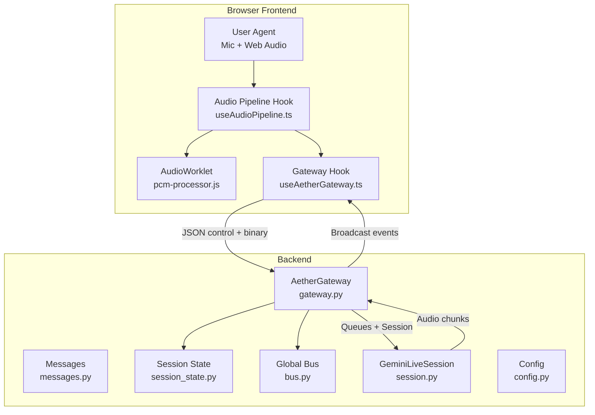
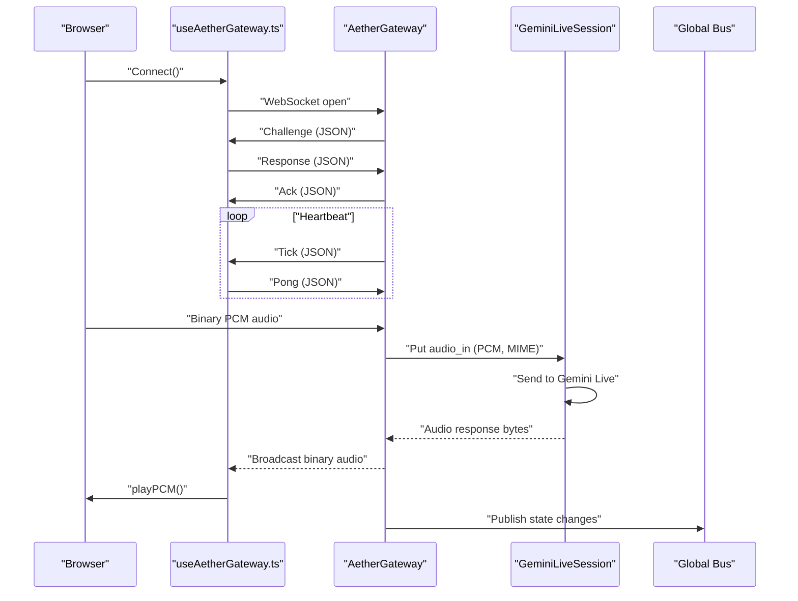
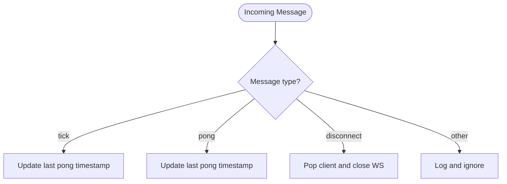
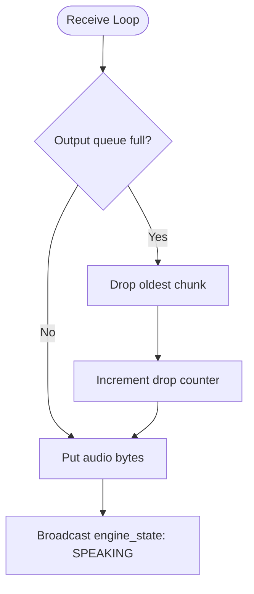
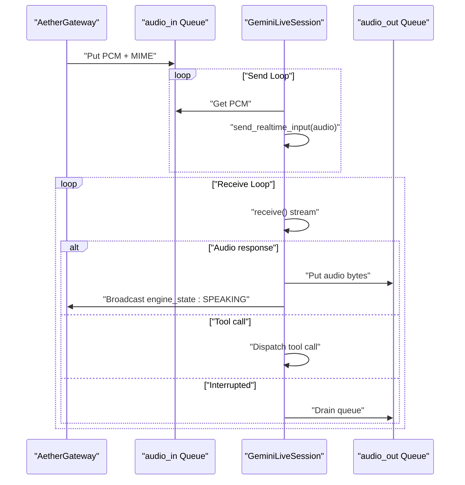
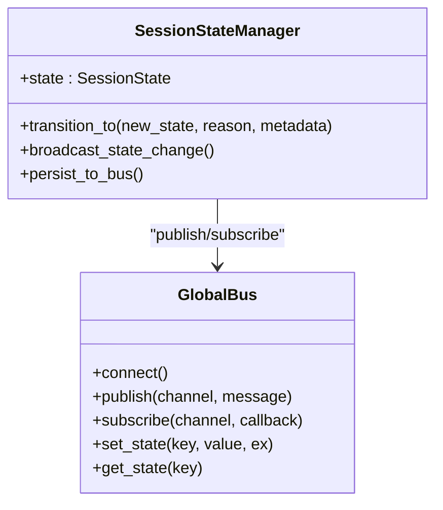
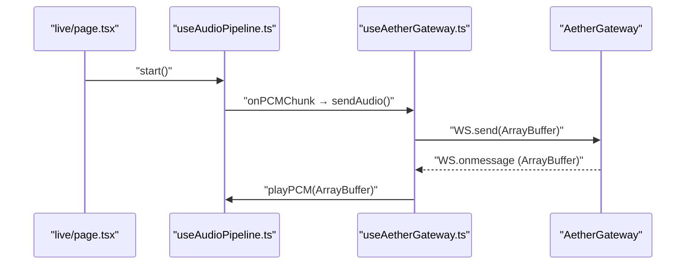
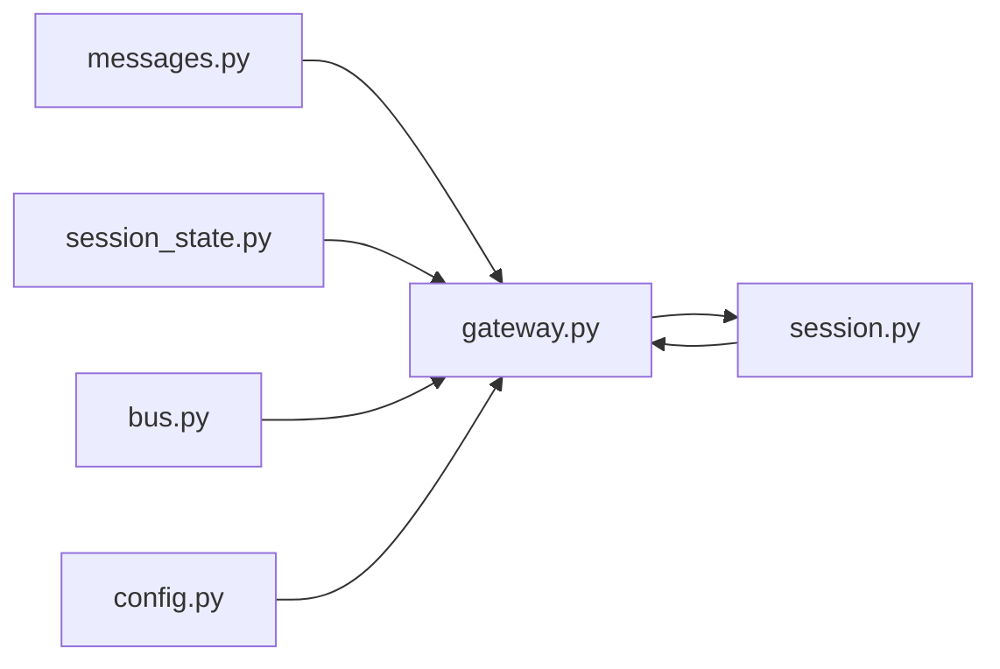

# Message Routing & Binary Data

<cite>
**Referenced Files in This Document**
- [messages.py](file://core/infra/transport/messages.py)
- [gateway.py](file://core/infra/transport/gateway.py)
- [bus.py](file://core/infra/transport/bus.py)
- [session_state.py](file://core/infra/transport/session_state.py)
- [config.py](file://core/infra/config.py)
- [session.py](file://core/ai/session.py)
- [pcm-processor.js](file://apps/portal/public/pcm-processor.js)
- [useAetherGateway.ts](file://apps/portal/src/hooks/useAetherGateway.ts)
- [useAudioPipeline.ts](file://apps/portal/src/hooks/useAudioPipeline.ts)
- [page.tsx](file://apps/portal/src/app/live/page.tsx)
</cite>

## Table of Contents
1. [Introduction](#introduction)
2. [Project Structure](#project-structure)
3. [Core Components](#core-components)
4. [Architecture Overview](#architecture-overview)
5. [Detailed Component Analysis](#detailed-component-analysis)
6. [Dependency Analysis](#dependency-analysis)
7. [Performance Considerations](#performance-considerations)
8. [Troubleshooting Guide](#troubleshooting-guide)
9. [Conclusion](#conclusion)

## Introduction
This document explains the Aether Voice OS message routing and binary data handling system. It covers the MessageType enumeration and supported message types, including control messages (TICK, PONG, DISCONNECT) and their processing logic. It documents how binary audio data flows from WebSocket clients to the audio input queue using PCM format and MIME type specification, and details audio queue management with size limits, buffering strategies, and quality-of-service considerations. It also describes the bidirectional data flow between audio input/output queues and the Gemini Live session, including error handling for malformed messages, queue overflow conditions, and connection interruptions. Finally, it outlines integration with the audio processing pipeline and real-time streaming requirements, with examples of message routing patterns and troubleshooting guidance.

## Project Structure
The system spans Python backend transport and session management, and a browser-based audio pipeline:
- Transport layer: WebSocket gateway, message models, session state manager, and global bus
- AI session: bidirectional audio streaming to Gemini Live
- Frontend: audio capture and playback pipeline with PCM encoding and WebSocket integration



**Diagram sources**
- [gateway.py](file://core/infra/transport/gateway.py#L52-L139)
- [messages.py](file://core/infra/transport/messages.py#L16-L36)
- [session_state.py](file://core/infra/transport/session_state.py#L25-L42)
- [bus.py](file://core/infra/transport/bus.py#L25-L48)
- [session.py](file://core/ai/session.py#L43-L95)
- [config.py](file://core/infra/config.py#L88-L100)
- [useAetherGateway.ts](file://apps/portal/src/hooks/useAetherGateway.ts#L69-L299)
- [useAudioPipeline.ts](file://apps/portal/src/hooks/useAudioPipeline.ts#L27-L248)
- [pcm-processor.js](file://apps/portal/public/pcm-processor.js#L18-L82)

**Section sources**
- [gateway.py](file://core/infra/transport/gateway.py#L1-L828)
- [messages.py](file://core/infra/transport/messages.py#L1-L80)
- [session_state.py](file://core/infra/transport/session_state.py#L1-L463)
- [bus.py](file://core/infra/transport/bus.py#L1-L200)
- [session.py](file://core/ai/session.py#L1-L922)
- [config.py](file://core/infra/config.py#L1-L175)
- [useAetherGateway.ts](file://apps/portal/src/hooks/useAetherGateway.ts#L1-L299)
- [useAudioPipeline.ts](file://apps/portal/src/hooks/useAudioPipeline.ts#L1-L248)
- [pcm-processor.js](file://apps/portal/public/pcm-processor.js#L1-L82)

## Core Components
- MessageType enumeration defines all known gateway message types, including handshake, lifecycle, data, UI, and error categories.
- GatewayMessage and typed message models encapsulate handshake, acknowledgment, and error notifications.
- AetherGateway manages WebSocket connections, authentication, heartbeat, routing of binary audio to the input queue, and broadcasting to clients.
- SessionStateManager enforces atomic state transitions and synchronizes state across nodes via the Global Bus.
- GeminiLiveSession implements bidirectional audio streaming to Gemini Live, including send/receive loops, tool call handling, and interruption logic.
- Frontend audio pipeline captures PCM via AudioWorklet, converts Float32 to Int16, and streams binary audio to the gateway.

**Section sources**
- [messages.py](file://core/infra/transport/messages.py#L16-L80)
- [gateway.py](file://core/infra/transport/gateway.py#L52-L139)
- [session_state.py](file://core/infra/transport/session_state.py#L25-L120)
- [session.py](file://core/ai/session.py#L43-L155)
- [useAudioPipeline.ts](file://apps/portal/src/hooks/useAudioPipeline.ts#L27-L134)
- [pcm-processor.js](file://apps/portal/public/pcm-processor.js#L18-L82)

## Architecture Overview
The system routes control and binary messages through a central gateway that maintains session state and queues for audio I/O. The Gemini Live session consumes PCM audio from the input queue and produces audio responses that are placed into the output queue and broadcast to clients.



**Diagram sources**
- [gateway.py](file://core/infra/transport/gateway.py#L529-L743)
- [session.py](file://core/ai/session.py#L174-L236)
- [useAetherGateway.ts](file://apps/portal/src/hooks/useAetherGateway.ts#L77-L266)
- [bus.py](file://core/infra/transport/bus.py#L96-L129)

## Detailed Component Analysis

### MessageType Enumeration and Control Messages
MessageType enumerates all gateway message types, including:
- Handshake: connect.challenge, connect.response, connect.ack
- Lifecycle: tick, pong, disconnect
- Data: audio.chunk, tool.call, tool.result
- UI: ui.update, vad.event
- Error: error

Control message processing:
- TICK: Heartbeat sent by the gateway; clients respond with PONG to keep the connection alive.
- PONG: Clients update last pong timestamp upon receipt.
- DISCONNECT: Clients can request disconnection; the gateway closes the session.



**Diagram sources**
- [messages.py](file://core/infra/transport/messages.py#L16-L36)
- [gateway.py](file://core/infra/transport/gateway.py#L686-L703)

**Section sources**
- [messages.py](file://core/infra/transport/messages.py#L16-L36)
- [gateway.py](file://core/infra/transport/gateway.py#L686-L703)

### Binary Audio Data Routing and PCM Handling
Binary audio routing:
- The gateway routes incoming binary frames to the audio input queue with a structured payload containing raw bytes and a MIME type.
- The MIME type encodes the PCM format and sample rate for downstream consumption.

PCM format and MIME type:
- The frontend AudioWorklet converts Float32 mono samples to Int16 PCM and emits 256 ms chunks (4096 samples at 16 kHz).
- The gateway constructs the MIME type using the configured receive sample rate.

```mermaid
sequenceDiagram
participant Mic as "Microphone"
participant Worklet as "AudioWorklet (pcm-processor.js)"
participant Hook as "useAudioPipeline.ts"
participant GW as "AetherGateway"
participant Queue as "audio_in Queue"
Mic->>Worklet : "Float32 mono samples"
Worklet->>Worklet : "Convert to Int16 PCM"
Worklet-->>Hook : "ArrayBuffer (256ms chunk)"
Hook->>GW : "sendAudio(ArrayBuffer)"
GW->>Queue : "Put {data : bytes, mime_type : audio/pcm;rate=16000}"
```

**Diagram sources**
- [pcm-processor.js](file://apps/portal/public/pcm-processor.js#L27-L78)
- [useAudioPipeline.ts](file://apps/portal/src/hooks/useAudioPipeline.ts#L104-L110)
- [useAetherGateway.ts](file://apps/portal/src/hooks/useAetherGateway.ts#L268-L272)
- [gateway.py](file://core/infra/transport/gateway.py#L672-L685)
- [config.py](file://core/infra/config.py#L88-L100)

**Section sources**
- [gateway.py](file://core/infra/transport/gateway.py#L672-L685)
- [pcm-processor.js](file://apps/portal/public/pcm-processor.js#L18-L82)
- [useAudioPipeline.ts](file://apps/portal/src/hooks/useAudioPipeline.ts#L97-L110)
- [config.py](file://core/infra/config.py#L88-L100)

### Audio Queue Management and Quality of Service
Queue characteristics:
- Input queue (mic → Gemini): bounded by mic_queue_max; designed to limit latency and memory footprint.
- Output queue (Gemini → speaker): bounded; overflow protection drops the oldest chunk to maintain forward progress.

Quality of service:
- Overflow detection and telemetry: the receive loop detects when the output queue is full and drops the oldest item, incrementing a drop counter for observability.
- Interrupt handling: on barge-in, the output queue is drained to achieve instant silence.



**Diagram sources**
- [session.py](file://core/ai/session.py#L426-L461)

**Section sources**
- [session.py](file://core/ai/session.py#L426-L461)
- [gateway.py](file://core/infra/transport/gateway.py#L112-L115)

### Bidirectional Data Flow Between Queues and Gemini Live Session
The GeminiLiveSession coordinates:
- Send loop: reads from audio_in_queue and sends PCM audio to Gemini Live with the specified MIME type.
- Receive loop: extracts audio responses, handles tool calls, and manages interruptions by draining the output queue.



**Diagram sources**
- [gateway.py](file://core/infra/transport/gateway.py#L112-L115)
- [session.py](file://core/ai/session.py#L237-L261)
- [session.py](file://core/ai/session.py#L383-L478)

**Section sources**
- [gateway.py](file://core/infra/transport/gateway.py#L112-L115)
- [session.py](file://core/ai/session.py#L237-L261)
- [session.py](file://core/ai/session.py#L383-L478)

### Session State Management and Global Bus
SessionStateManager:
- Defines valid state transitions and ensures atomic updates.
- Broadcasts state changes to clients and publishes snapshots to the Global Bus.
- Tracks metadata such as message counts, handoffs, and error counts.

Global Bus:
- Provides Redis-backed pub/sub and key-value storage for distributed state synchronization across gateway nodes.



**Diagram sources**
- [session_state.py](file://core/infra/transport/session_state.py#L71-L120)
- [bus.py](file://core/infra/transport/bus.py#L25-L95)

**Section sources**
- [session_state.py](file://core/infra/transport/session_state.py#L71-L120)
- [bus.py](file://core/infra/transport/bus.py#L25-L95)

### Frontend Integration and Real-Time Streaming
Frontend audio pipeline:
- Captures mono audio at 16 kHz, converts to Int16 PCM in the AudioWorklet, and streams chunks to the gateway.
- Plays back audio responses gaplessly using scheduled AudioBufferSourceNodes to avoid gaps.

Gateway hook:
- Manages WebSocket lifecycle, handshake, and heartbeat synchronization.
- Routes incoming binary audio responses to the audio pipeline for playback.



**Diagram sources**
- [page.tsx](file://apps/portal/src/app/live/page.tsx#L68-L79)
- [useAudioPipeline.ts](file://apps/portal/src/hooks/useAudioPipeline.ts#L168-L212)
- [useAetherGateway.ts](file://apps/portal/src/hooks/useAetherGateway.ts#L268-L272)
- [gateway.py](file://core/infra/transport/gateway.py#L529-L548)

**Section sources**
- [useAudioPipeline.ts](file://apps/portal/src/hooks/useAudioPipeline.ts#L27-L134)
- [useAetherGateway.ts](file://apps/portal/src/hooks/useAetherGateway.ts#L69-L299)
- [page.tsx](file://apps/portal/src/app/live/page.tsx#L43-L87)

## Dependency Analysis
The gateway depends on:
- Transport messages for type discrimination and routing
- Session state manager for lifecycle control
- Global Bus for distributed state synchronization
- GeminiLiveSession for audio I/O coordination



**Diagram sources**
- [gateway.py](file://core/infra/transport/gateway.py#L34-L44)
- [messages.py](file://core/infra/transport/messages.py#L16-L45)
- [session_state.py](file://core/infra/transport/session_state.py#L71-L120)
- [bus.py](file://core/infra/transport/bus.py#L25-L95)
- [config.py](file://core/infra/config.py#L88-L100)
- [session.py](file://core/ai/session.py#L43-L95)

**Section sources**
- [gateway.py](file://core/infra/transport/gateway.py#L34-L44)
- [session_state.py](file://core/infra/transport/session_state.py#L71-L120)
- [bus.py](file://core/infra/transport/bus.py#L25-L95)
- [session.py](file://core/ai/session.py#L43-L95)

## Performance Considerations
- Queue sizing: input queue is bounded by mic_queue_max to cap latency and memory usage; output queue is bounded to prevent unbounded growth.
- Chunk size: 256 ms PCM chunks reduce WebSocket overhead and align with Gemini Live’s real-time audio expectations.
- Zero-copy transfers: the AudioWorklet posts PCM buffers with transferable array buffers to minimize copies.
- Gapless playback: scheduled buffer sources eliminate gaps between audio chunks for natural speech.
- Heartbeat and pruning: periodic ticks detect dead clients and prune stale connections to maintain throughput.

[No sources needed since this section provides general guidance]

## Troubleshooting Guide
Common issues and resolutions:
- Malformed messages: The gateway logs and responds with an error for invalid JSON or unexpected message types.
- Queue overflow: The receive loop drops the oldest output chunk when full; monitor the drop counter for downstream pressure.
- Connection interruptions: On PONG timeouts, the gateway prunes dead clients; ensure clients send timely PONG responses.
- Authentication failures: JWT or Ed25519 signature verification failures lead to handshake errors; verify secrets and signatures.
- Session termination: Exceptions in the session loop trigger transitions to error states; check logs and consider reconnection.

**Section sources**
- [gateway.py](file://core/infra/transport/gateway.py#L549-L558)
- [gateway.py](file://core/infra/transport/gateway.py#L686-L703)
- [gateway.py](file://core/infra/transport/gateway.py#L712-L742)
- [session.py](file://core/ai/session.py#L426-L461)

## Conclusion
The Aether Voice OS message routing and binary data handling system integrates a robust WebSocket gateway, strict session state management, and efficient audio queues to deliver low-latency, real-time audio streaming. Control messages (TICK, PONG, DISCONNECT) maintain connection health, while PCM audio is routed reliably with MIME type specifications. The Gemini Live session orchestrates bidirectional audio I/O, tool calls, and interruptions, with overflow protection and telemetry. The frontend audio pipeline ensures high-quality capture and playback aligned with backend expectations. Together, these components form a cohesive, observable, and resilient audio streaming platform.