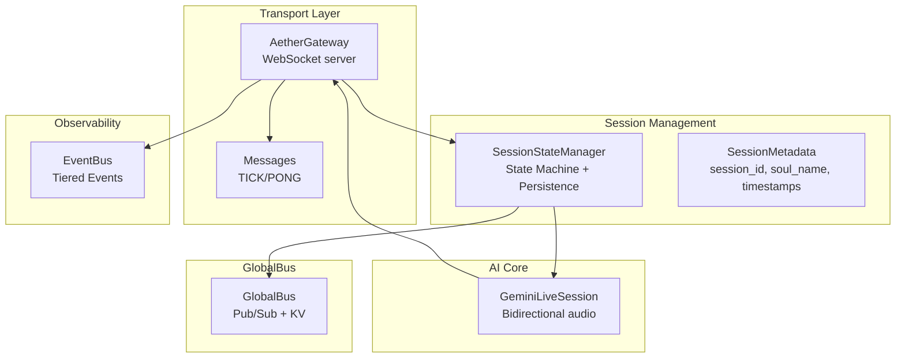
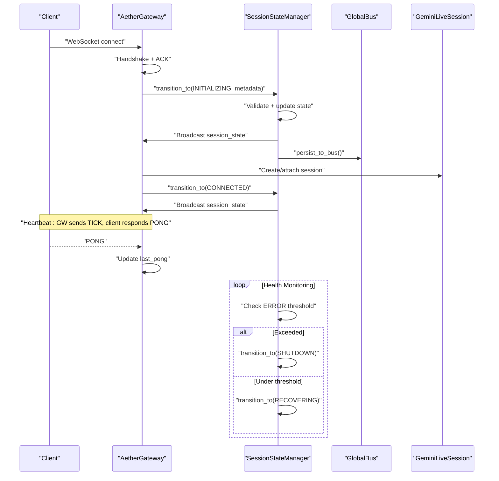
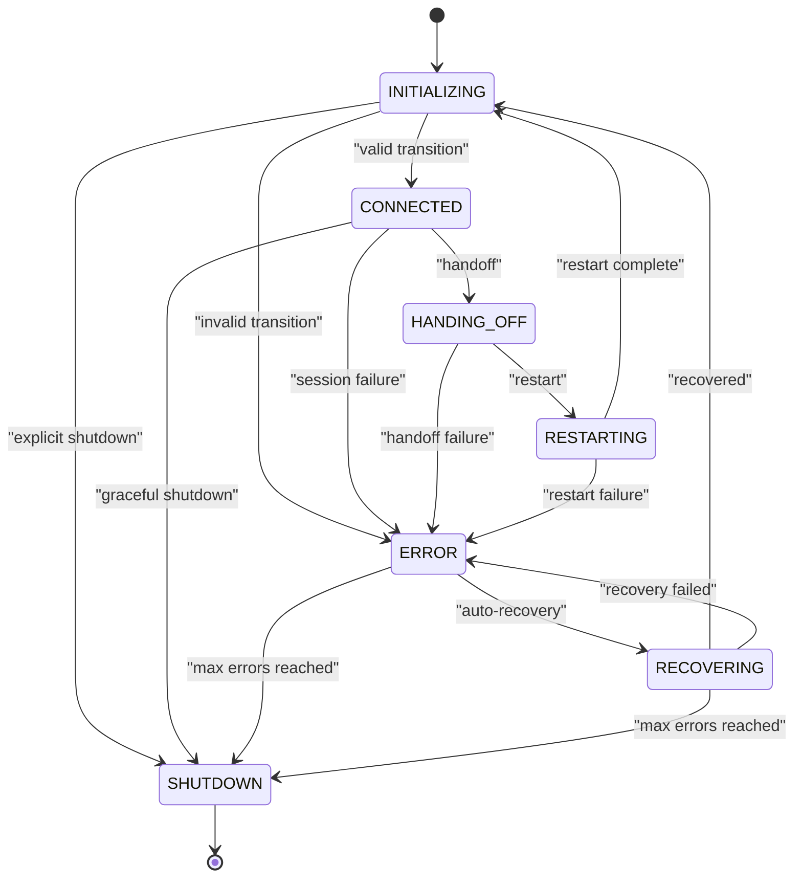
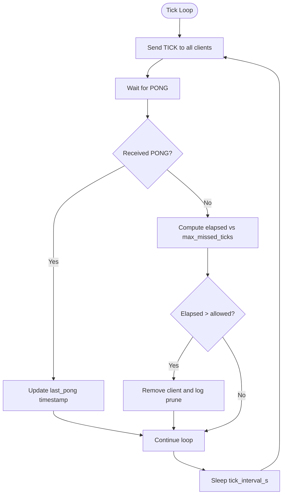
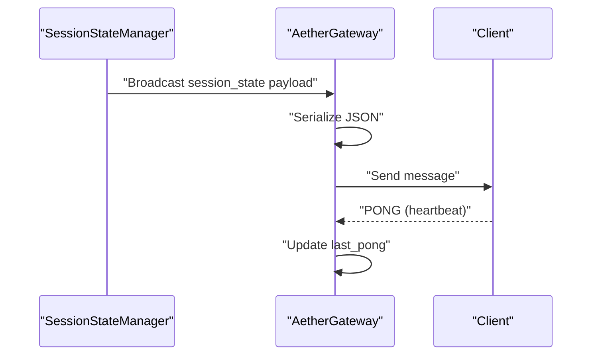
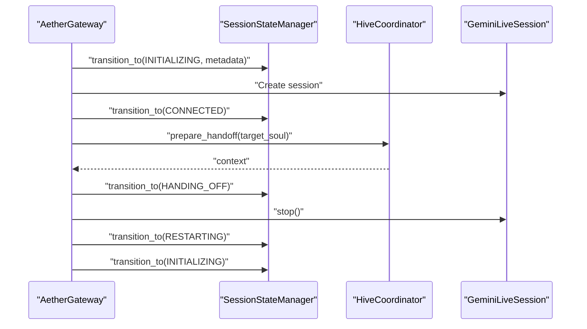
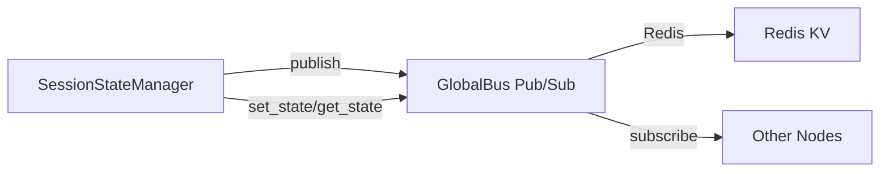
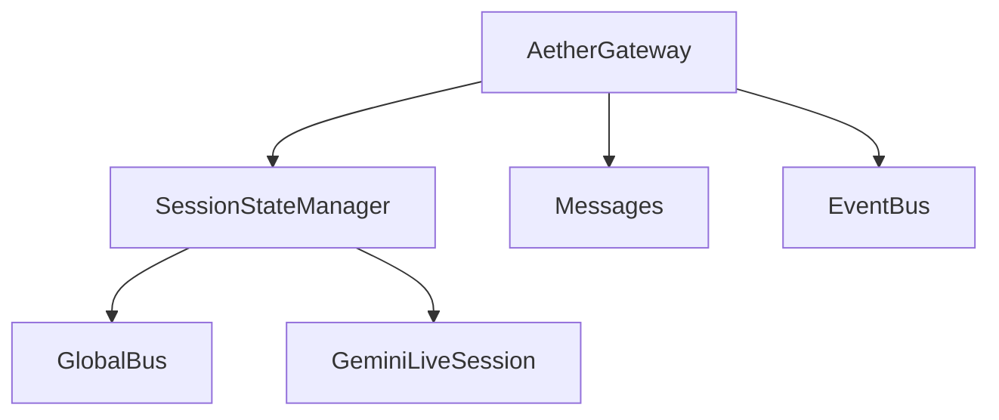

# Session Management

<cite>
**Referenced Files in This Document**
- [session_state.py](file://core/infra/transport/session_state.py)
- [gateway.py](file://core/infra/transport/gateway.py)
- [messages.py](file://core/infra/transport/messages.py)
- [bus.py](file://core/infra/transport/bus.py)
- [session.py](file://core/ai/session.py)
- [event_bus.py](file://core/infra/event_bus.py)
- [lifecycle.py](file://core/infra/lifecycle.py)
- [config.py](file://core/infra/config.py)
- [test_session_state.py](file://tests/unit/test_session_state.py)
- [test_bus_sync.py](file://tests/unit/test_bus_sync.py)
- [verify_persistence.py](file://tests/verify_persistence.py)
- [test_persistence.py](file://tests/test_persistence.py)
- [test_gateway.py](file://tests/unit/test_gateway.py)
</cite>

## Table of Contents
1. [Introduction](#introduction)
2. [Project Structure](#project-structure)
3. [Core Components](#core-components)
4. [Architecture Overview](#architecture-overview)
5. [Detailed Component Analysis](#detailed-component-analysis)
6. [Dependency Analysis](#dependency-analysis)
7. [Performance Considerations](#performance-considerations)
8. [Troubleshooting Guide](#troubleshooting-guide)
9. [Conclusion](#conclusion)

## Introduction
This document describes the Aether Voice OS session management system. It covers the SessionStateManager architecture, session lifecycle states, state transitions, persistence, heartbeat and client pruning, broadcast mechanisms, session state monitoring, health checks, and integration with the GlobalBus and Redis-backed state storage. It also provides examples of state transitions, broadcast patterns, and troubleshooting guidance.

## Project Structure
The session management system spans several modules:
- Transport and gateway orchestration: WebSocket gateway, heartbeat, and client lifecycle
- Session state machine: centralized state transitions and persistence
- GlobalBus: distributed pub/sub and KV store for cross-node synchronization
- AI session: bidirectional audio session with Gemini Live API
- Event bus: tiered event routing for telemetry and control
- Configuration and lifecycle: runtime configuration and boot/shutdown sequencing

**Diagram sources**
- [gateway.py](file://core/infra/transport/gateway.py#L69-L144)
- [session_state.py](file://core/infra/transport/session_state.py#L71-L119)
- [bus.py](file://core/infra/transport/bus.py#L25-L95)
- [session.py](file://core/ai/session.py#L43-L95)
- [event_bus.py](file://core/infra/event_bus.py#L69-L152)

**Section sources**
- [gateway.py](file://core/infra/transport/gateway.py#L69-L144)
- [session_state.py](file://core/infra/transport/session_state.py#L71-L119)
- [bus.py](file://core/infra/transport/bus.py#L25-L95)
- [session.py](file://core/ai/session.py#L43-L95)
- [event_bus.py](file://core/infra/event_bus.py#L69-L152)

## Core Components
- SessionStateManager: central orchestrator for session state transitions, broadcasting, persistence, and health monitoring
- SessionMetadata: immutable session metadata for tracking and persistence
- AetherGateway: WebSocket server managing clients, heartbeat, and session lifecycle
- GlobalBus: Redis-backed pub/sub and KV store enabling cross-node synchronization
- GeminiLiveSession: bidirectional audio session with Gemini Live API
- EventBus: tiered event bus for telemetry and control routing

**Section sources**
- [session_state.py](file://core/infra/transport/session_state.py#L25-L119)
- [session.py](file://core/ai/session.py#L43-L95)
- [gateway.py](file://core/infra/transport/gateway.py#L69-L144)
- [bus.py](file://core/infra/transport/bus.py#L25-L95)
- [event_bus.py](file://core/infra/event_bus.py#L69-L152)

## Architecture Overview
The system follows a centralized state machine pattern:
- SessionStateManager validates and performs atomic transitions
- On each transition, it broadcasts state changes to clients and publishes to GlobalBus
- Persistence is performed asynchronously to Redis via GlobalBus
- AetherGateway coordinates client connections, heartbeat, and session lifecycle
- GeminiLiveSession runs the audio pipeline and triggers state changes via callbacks

**Diagram sources**
- [gateway.py](file://core/infra/transport/gateway.py#L320-L506)
- [session_state.py](file://core/infra/transport/session_state.py#L197-L271)
- [bus.py](file://core/infra/transport/bus.py#L96-L128)
- [messages.py](file://core/infra/transport/messages.py#L16-L36)

## Detailed Component Analysis

### SessionStateManager
- Responsibilities:
  - Atomic state transitions with validation
  - Broadcasting state changes to clients
  - Publishing state changes to GlobalBus
  - Persisting session snapshots to Redis
  - Health monitoring and automatic recovery
- State machine:
  - States: INITIALIZING, CONNECTED, HANDING_OFF, RESTARTING, ERROR, RECOVERING, SHUTDOWN
  - Valid transitions enforced by a transition matrix
- Persistence:
  - Snapshots include state, metadata, error counters, and timestamp
  - Stored under keys like "session:{session_id}" with TTL
  - Active session discovery via "active_session_id"
- Health monitoring:
  - Background task periodically checks state and triggers recovery or shutdown thresholds

**Diagram sources**
- [session_state.py](file://core/infra/transport/session_state.py#L25-L101)

**Section sources**
- [session_state.py](file://core/infra/transport/session_state.py#L71-L463)

### SessionMetadata
- Fields:
  - session_id, soul_name, started_at, message_count, last_activity, handoff_count, error_count, compressed_seed
- Serialization:
  - to_dict() produces a dictionary suitable for WebSocket broadcast and persistence
- Usage:
  - Created per session lifecycle and updated on transitions and activity

**Section sources**
- [session_state.py](file://core/infra/transport/session_state.py#L44-L68)

### Heartbeat Mechanism and Client Pruning
- TICK/PONG protocol:
  - Gateway sends periodic TICK messages at tick_interval_s
  - Clients respond with PONG; last_pong timestamps are updated
- Client pruning:
  - If max_missed_ticks * tick_interval_s elapses without PONG, client is pruned
- Message types:
  - MessageType.TICK and MessageType.PONG define the protocol

**Diagram sources**
- [gateway.py](file://core/infra/transport/gateway.py#L704-L743)
- [messages.py](file://core/infra/transport/messages.py#L16-L36)

**Section sources**
- [gateway.py](file://core/infra/transport/gateway.py#L704-L743)
- [messages.py](file://core/infra/transport/messages.py#L16-L36)

### Broadcast System
- Real-time telemetry and events:
  - Gateway broadcasts messages to all connected clients
  - Binary and structured payloads supported
- Integration:
  - SessionStateManager broadcasts session_state changes
  - GlobalBus bridges frontend events to WebSocket clients
- Example patterns:
  - Broadcasting "engine_state" during state transitions
  - Broadcasting "session_state" with metadata on changes

**Diagram sources**
- [session_state.py](file://core/infra/transport/session_state.py#L313-L333)
- [gateway.py](file://core/infra/transport/gateway.py#L744-L776)

**Section sources**
- [session_state.py](file://core/infra/transport/session_state.py#L313-L333)
- [gateway.py](file://core/infra/transport/gateway.py#L744-L776)

### Session Lifecycle Management
- Gateway orchestrates:
  - Creating SessionMetadata
  - Transitioning to INITIALIZING
  - Establishing GeminiLiveSession
  - Transitioning to CONNECTED
  - Handling restarts and handoffs
- Handoff:
  - Deep handover via Hive coordinator
  - Metadata tracks active handover_id
  - Triggers HANDING_OFF → RESTARTING → INITIALIZING

**Diagram sources**
- [gateway.py](file://core/infra/transport/gateway.py#L353-L504)

**Section sources**
- [gateway.py](file://core/infra/transport/gateway.py#L353-L504)

### Integration with GlobalBus and Redis-backed State Storage
- GlobalBus provides:
  - Pub/Sub channels for cross-node state synchronization
  - KV store for session snapshots and active session discovery
- SessionStateManager:
  - Persists snapshots on transitions and activity
  - Restores metadata from Redis on demand
  - Publishes "state_change" events for synchronization

**Diagram sources**
- [session_state.py](file://core/infra/transport/session_state.py#L252-L291)
- [bus.py](file://core/infra/transport/bus.py#L96-L200)

**Section sources**
- [session_state.py](file://core/infra/transport/session_state.py#L252-L304)
- [bus.py](file://core/infra/transport/bus.py#L96-L200)

### Session State Monitoring and Health Checks
- Health monitoring:
  - Background task checks for stuck ERROR states
  - Auto-recovery transitions to RECOVERING
  - Threshold-based shutdown on repeated failures
- Waiters:
  - wait_for_state() enables components to await specific states

**Section sources**
- [session_state.py](file://core/infra/transport/session_state.py#L378-L427)
- [session_state.py](file://core/infra/transport/session_state.py#L334-L359)

### Examples

#### Example: Session State Transition Sequence
- INITIALIZING → CONNECTED → HANDING_OFF → RESTARTING → INITIALIZING
- Each transition updates metadata, broadcasts, persists, and may trigger recovery or shutdown

**Section sources**
- [session_state.py](file://core/infra/transport/session_state.py#L197-L271)
- [gateway.py](file://core/infra/transport/gateway.py#L447-L492)

#### Example: Broadcast Pattern for Telemetry
- Broadcasting structured telemetry to clients via Gateway
- Binary audio data broadcast for real-time playback

**Section sources**
- [gateway.py](file://core/infra/transport/gateway.py#L744-L799)

#### Example: Persistence and Restoration
- Persisting session snapshot to Redis and restoring on another node
- Verifying message_count and metadata after restore

**Section sources**
- [verify_persistence.py](file://tests/verify_persistence.py#L16-L50)
- [test_persistence.py](file://tests/test_persistence.py#L18-L51)

## Dependency Analysis
- Coupling:
  - AetherGateway depends on SessionStateManager for state control
  - SessionStateManager depends on GlobalBus for persistence and synchronization
  - GeminiLiveSession is owned and controlled by SessionStateManager
- Cohesion:
  - SessionStateManager encapsulates state logic, persistence, and health
  - Gateway encapsulates transport, heartbeat, and client lifecycle
- External dependencies:
  - Redis via GlobalBus for pub/sub and KV
  - WebSocket server for client transport
  - EventBus for internal telemetry/control routing

**Diagram sources**
- [gateway.py](file://core/infra/transport/gateway.py#L69-L144)
- [session_state.py](file://core/infra/transport/session_state.py#L71-L119)
- [bus.py](file://core/infra/transport/bus.py#L25-L95)
- [event_bus.py](file://core/infra/event_bus.py#L69-L152)

**Section sources**
- [gateway.py](file://core/infra/transport/gateway.py#L69-L144)
- [session_state.py](file://core/infra/transport/session_state.py#L71-L119)
- [bus.py](file://core/infra/transport/bus.py#L25-L95)
- [event_bus.py](file://core/infra/event_bus.py#L69-L152)

## Performance Considerations
- Heartbeat intervals and pruning thresholds balance responsiveness and overhead
- Broadcast operations are fire-and-forget with timeouts to avoid blocking
- Persistence uses background tasks and TTL to minimize latency impact
- EventBus lanes isolate high-priority audio from lower-priority telemetry to prevent starvation

[No sources needed since this section provides general guidance]

## Troubleshooting Guide
- Invalid state transitions:
  - Symptom: Transition rejected with error logs
  - Action: Verify allowed transitions and ensure metadata is set before CONNECTED
- Session not connecting:
  - Symptom: ERROR after handshake or connection timeout
  - Action: Check API key, model configuration, and network connectivity
- Client pruning:
  - Symptom: Clients disconnected due to missed PONG
  - Action: Adjust tick_interval_s and max_missed_ticks; verify client responsiveness
- Persistence failures:
  - Symptom: Restore fails or TTL issues
  - Action: Confirm Redis availability and keys; validate snapshot format
- Cross-node sync:
  - Symptom: State not reflected on other nodes
  - Action: Ensure GlobalBus is connected and subscribed to "state_change"

**Section sources**
- [session_state.py](file://core/infra/transport/session_state.py#L214-L222)
- [gateway.py](file://core/infra/transport/gateway.py#L422-L445)
- [gateway.py](file://core/infra/transport/gateway.py#L704-L743)
- [bus.py](file://core/infra/transport/bus.py#L53-L95)
- [test_bus_sync.py](file://tests/unit/test_bus_sync.py#L53-L73)

## Conclusion
The Aether Voice OS session management system centers on a robust, centralized SessionStateManager that enforces atomic state transitions, broadcasts changes, persists snapshots to Redis, and monitors health. The AetherGateway coordinates client lifecycle and heartbeat, while GlobalBus enables cross-node synchronization. Together, these components provide a resilient, observable, and scalable session lifecycle for the Gemini Live audio pipeline.