# Security and Authentication

<cite>
**Referenced Files in This Document**
- [security.py](file://core/utils/security.py)
- [gateway.py](file://core/infra/transport/gateway.py)
- [messages.py](file://core/infra/transport/messages.py)
- [session_state.py](file://core/infra/transport/session_state.py)
- [errors.py](file://core/utils/errors.py)
- [gateway_protocol.md](file://docs/gateway_protocol.md)
- [SECURITY_UI.md](file://docs/SECURITY_UI.md)
- [voice_auth.py](file://core/tools/voice_auth.py)
- [router.py](file://core/tools/router.py)
- [session.py](file://core/ai/session.py)
- [telemetry.py](file://core/infra/telemetry.py)
- [handover_telemetry.py](file://core/ai/handover_telemetry.py)
</cite>

## Table of Contents
1. [Introduction](#introduction)
2. [Project Structure](#project-structure)
3. [Core Components](#core-components)
4. [Architecture Overview](#architecture-overview)
5. [Detailed Component Analysis](#detailed-component-analysis)
6. [Dependency Analysis](#dependency-analysis)
7. [Performance Considerations](#performance-considerations)
8. [Troubleshooting Guide](#troubleshooting-guide)
9. [Conclusion](#conclusion)
10. [Appendices](#appendices)

## Introduction
This document describes the security and authentication system of Aether Voice OS with a focus on:
- The gateway protocol and the 3-step Ed25519 cryptographic handshake for secure WebSocket communication
- Biometric security mechanisms including Soul-Lock verification and voice authentication for sensitive operations
- Cryptographic foundations, session management, and secure communication protocols
- Middleware patterns enforcing security and integration with the transport layer
- Authentication flows for different user roles and permission levels
- Protection mechanisms for sensitive operations and audit trail capabilities
- Examples for implementing custom security policies and extending the authentication system
- Threat modeling, best practices, and vulnerability mitigation strategies
- Troubleshooting guidance and monitoring recommendations

## Project Structure
Security-critical components are distributed across transport, tools, AI session, and telemetry layers:
- Transport layer: WebSocket gateway, handshake messages, session state machine
- Tools layer: Biometric middleware and voice authentication utilities
- AI session: Tool routing and execution with biometric enforcement
- Utilities: Ed25519 cryptography helpers
- Docs: Gateway protocol specification and security UI overview

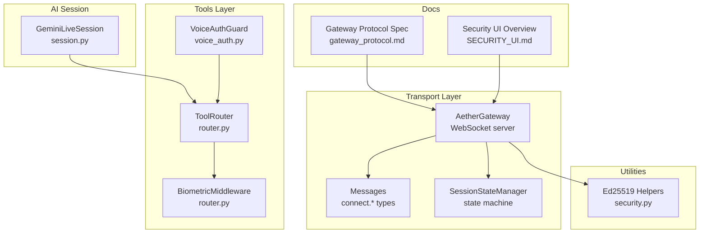

**Diagram sources**
- [gateway.py](file://core/infra/transport/gateway.py#L69-L120)
- [messages.py](file://core/infra/transport/messages.py#L16-L80)
- [session_state.py](file://core/infra/transport/session_state.py#L25-L101)
- [router.py](file://core/tools/router.py#L46-L85)
- [voice_auth.py](file://core/tools/voice_auth.py#L19-L52)
- [session.py](file://core/ai/session.py#L43-L95)
- [security.py](file://core/utils/security.py#L18-L71)
- [gateway_protocol.md](file://docs/gateway_protocol.md#L1-L125)
- [SECURITY_UI.md](file://docs/SECURITY_UI.md#L1-L70)

**Section sources**
- [gateway.py](file://core/infra/transport/gateway.py#L1-L120)
- [messages.py](file://core/infra/transport/messages.py#L1-L80)
- [session_state.py](file://core/infra/transport/session_state.py#L1-L120)
- [router.py](file://core/tools/router.py#L1-L120)
- [voice_auth.py](file://core/tools/voice_auth.py#L1-L81)
- [session.py](file://core/ai/session.py#L1-L120)
- [security.py](file://core/utils/security.py#L1-L71)
- [gateway_protocol.md](file://docs/gateway_protocol.md#L1-L125)
- [SECURITY_UI.md](file://docs/SECURITY_UI.md#L1-L70)

## Core Components
- Ed25519 cryptographic utilities for signature verification and key generation
- AetherGateway: WebSocket server implementing the 3-step handshake and capability negotiation
- Messages: Typed WebSocket message models for connect.challenge, connect.response, connect.ack, and others
- SessionStateManager: Atomic state transitions and persistence for session lifecycle
- BiometricMiddleware and VoiceAuthGuard: Enforce Soul-Lock verification and voice authentication for sensitive tools
- ToolRouter: Central dispatcher with biometric enforcement for sensitive operations
- GeminiLiveSession: Orchestrates tool calls and integrates with ToolRouter and biometric checks
- Telemetry: Usage recording and tracing for auditability

**Section sources**
- [security.py](file://core/utils/security.py#L18-L71)
- [gateway.py](file://core/infra/transport/gateway.py#L529-L618)
- [messages.py](file://core/infra/transport/messages.py#L16-L80)
- [session_state.py](file://core/infra/transport/session_state.py#L71-L272)
- [router.py](file://core/tools/router.py#L46-L85)
- [voice_auth.py](file://core/tools/voice_auth.py#L19-L52)
- [session.py](file://core/ai/session.py#L493-L603)
- [telemetry.py](file://core/infra/telemetry.py#L77-L129)

## Architecture Overview
The security architecture combines:
- Transport-level Ed25519 challenge-response handshake
- Capability negotiation during handshake
- Biometric middleware for sensitive tool execution
- Session state machine ensuring Single Source of Truth
- Audit-ready telemetry and tracing

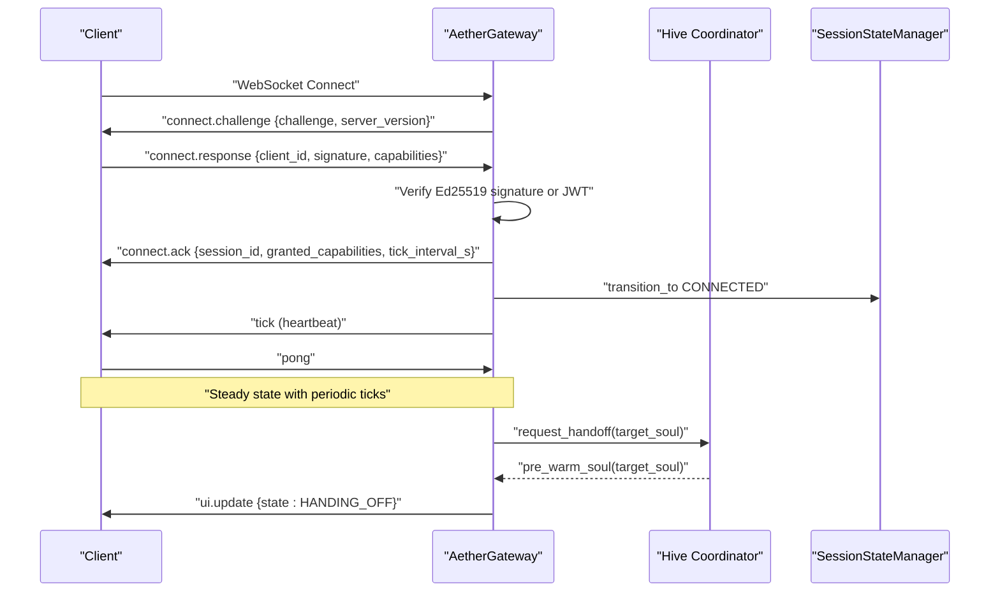

**Diagram sources**
- [gateway_protocol.md](file://docs/gateway_protocol.md#L10-L33)
- [gateway.py](file://core/infra/transport/gateway.py#L529-L618)
- [session_state.py](file://core/infra/transport/session_state.py#L197-L272)

**Section sources**
- [gateway_protocol.md](file://docs/gateway_protocol.md#L10-L33)
- [gateway.py](file://core/infra/transport/gateway.py#L529-L618)
- [session_state.py](file://core/infra/transport/session_state.py#L197-L272)

## Detailed Component Analysis

### Ed25519 Cryptographic Foundation
- Signature verification supports hex-encoded or raw inputs and handles decoding automatically
- Key generation produces Ed25519 keypairs for new Souls
- Gateway verifies signatures against:
  - Public key from the Soul registry
  - Direct hex public key (ephemeral mode)
  - Global fallback public key (development)

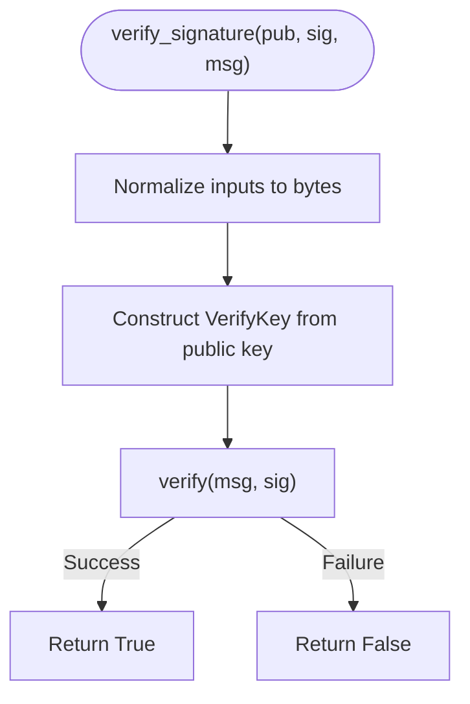

**Diagram sources**
- [security.py](file://core/utils/security.py#L18-L56)

**Section sources**
- [security.py](file://core/utils/security.py#L18-L71)
- [gateway.py](file://core/infra/transport/gateway.py#L637-L671)

### Gateway Handshake Protocol (connect.challenge → connect.response → connect.ack)
- The server generates a 32-byte random challenge and sends connect.challenge
- The client responds with connect.response containing client_id, signature, and capabilities
- The server validates the Ed25519 signature or JWT and accepts the client
- The server replies with connect.ack including session_id, granted capabilities, and tick interval

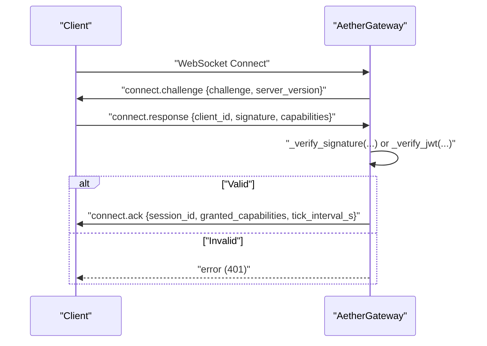

**Diagram sources**
- [gateway.py](file://core/infra/transport/gateway.py#L559-L618)
- [messages.py](file://core/infra/transport/messages.py#L47-L71)
- [errors.py](file://core/utils/errors.py#L65-L71)

**Section sources**
- [gateway.py](file://core/infra/transport/gateway.py#L559-L618)
- [messages.py](file://core/infra/transport/messages.py#L47-L71)
- [errors.py](file://core/utils/errors.py#L65-L71)
- [gateway_protocol.md](file://docs/gateway_protocol.md#L37-L71)

### Capability Negotiation and Heartbeat
- During handshake, clients specify requested capabilities; server grants a subset
- The gateway periodically sends tick messages and expects pong responses
- Dead clients are pruned based on missed ticks

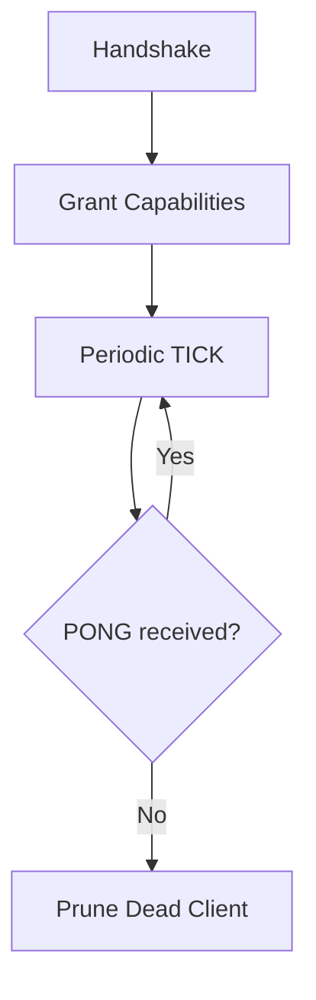

**Diagram sources**
- [gateway.py](file://core/infra/transport/gateway.py#L590-L618)
- [gateway.py](file://core/infra/transport/gateway.py#L704-L743)

**Section sources**
- [gateway.py](file://core/infra/transport/gateway.py#L590-L618)
- [gateway.py](file://core/infra/transport/gateway.py#L704-L743)

### Session State Management and Persistence
- SessionStateManager enforces atomic transitions and publishes state changes
- State snapshots are persisted to the Global Bus (Redis) with TTL
- Health monitoring triggers recovery on repeated errors

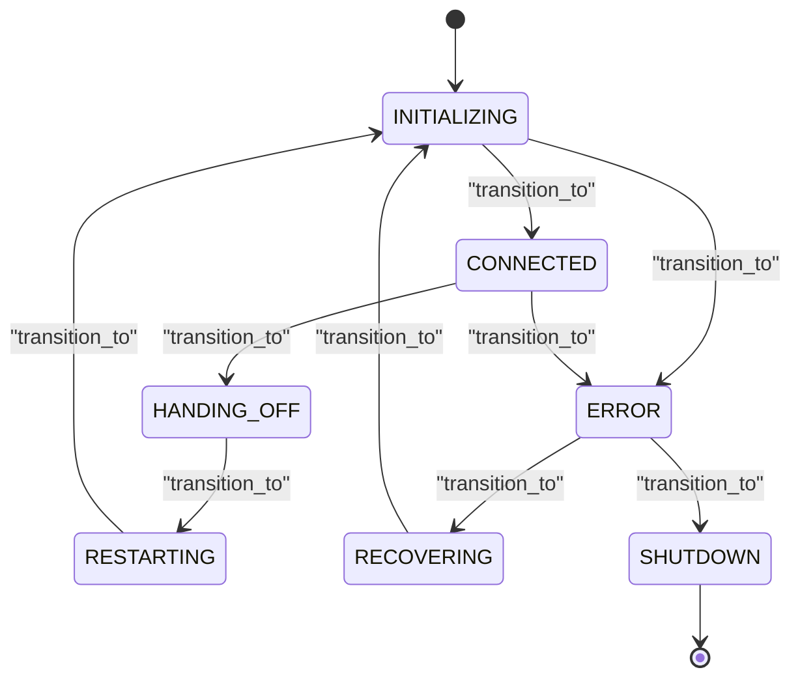

**Diagram sources**
- [session_state.py](file://core/infra/transport/session_state.py#L25-L101)
- [session_state.py](file://core/infra/transport/session_state.py#L197-L272)

**Section sources**
- [session_state.py](file://core/infra/transport/session_state.py#L71-L272)

### Biometric Security: Soul-Lock and Voice Authentication
- BiometricMiddleware enforces verification for sensitive tools
- VoiceAuthGuard performs a simple heuristic on live audio features to gate sensitive operations
- ToolRouter registers sensitive tools and applies middleware during dispatch

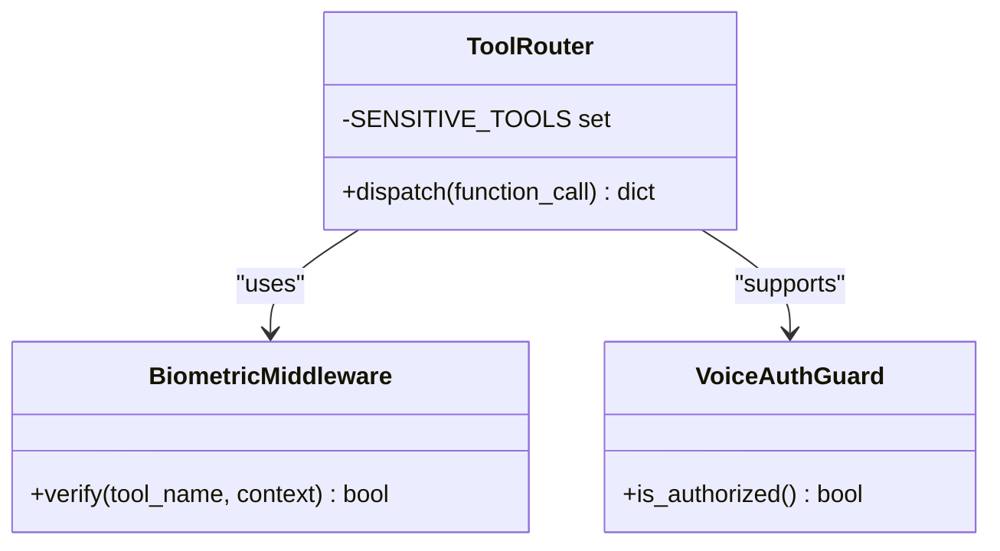

**Diagram sources**
- [router.py](file://core/tools/router.py#L46-L85)
- [voice_auth.py](file://core/tools/voice_auth.py#L19-L52)
- [router.py](file://core/tools/router.py#L120-L140)

**Section sources**
- [router.py](file://core/tools/router.py#L46-L85)
- [voice_auth.py](file://core/tools/voice_auth.py#L19-L52)
- [router.py](file://core/tools/router.py#L120-L140)

### Tool Execution Pipeline with Biometric Enforcement
- GeminiLiveSession receives tool calls and delegates to ToolRouter
- ToolRouter applies BiometricMiddleware for sensitive tools
- Results are standardized and broadcast to clients

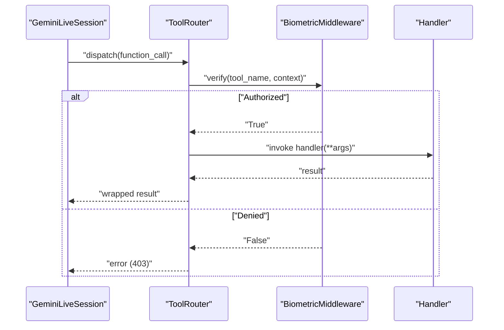

**Diagram sources**
- [session.py](file://core/ai/session.py#L493-L603)
- [router.py](file://core/tools/router.py#L234-L308)
- [router.py](file://core/tools/router.py#L46-L85)

**Section sources**
- [session.py](file://core/ai/session.py#L493-L603)
- [router.py](file://core/tools/router.py#L234-L308)
- [router.py](file://core/tools/router.py#L46-L85)

### JWT-Based Authentication Path
- If present, the gateway validates a JWT token using HS256 with a configured secret
- This enables ephemeral frontend sessions and intra-service communication

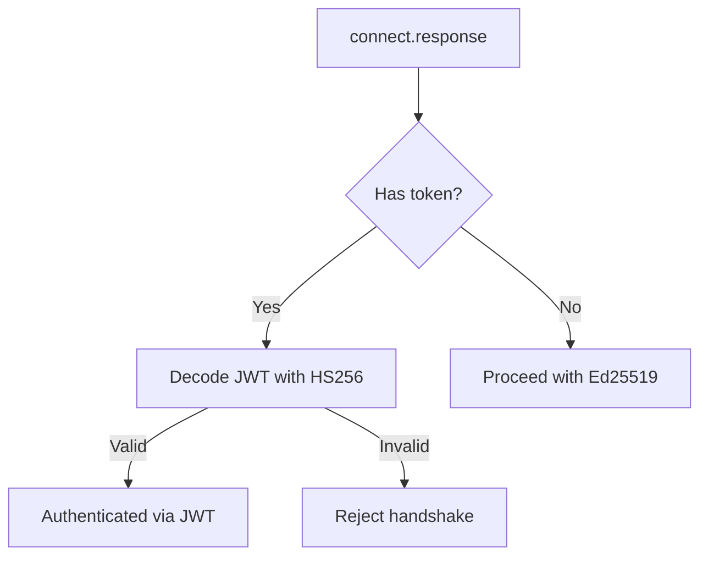

**Diagram sources**
- [gateway.py](file://core/infra/transport/gateway.py#L592-L636)

**Section sources**
- [gateway.py](file://core/infra/transport/gateway.py#L592-L636)
- [SECURITY_UI.md](file://docs/SECURITY_UI.md#L13-L27)

### Audit Trail and Telemetry
- Token usage and cost are recorded and associated with traces
- Handover telemetry tracks success/failure and performance metrics
- Session state changes are broadcast and persisted for auditability

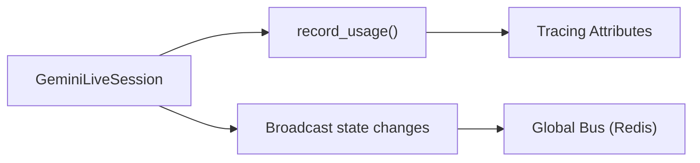

**Diagram sources**
- [session.py](file://core/ai/session.py#L479-L492)
- [telemetry.py](file://core/infra/telemetry.py#L77-L129)
- [session_state.py](file://core/infra/transport/session_state.py#L273-L292)

**Section sources**
- [session.py](file://core/ai/session.py#L479-L492)
- [telemetry.py](file://core/infra/telemetry.py#L77-L129)
- [session_state.py](file://core/infra/transport/session_state.py#L273-L292)
- [handover_telemetry.py](file://core/ai/handover_telemetry.py#L295-L314)

## Dependency Analysis
- AetherGateway depends on:
  - Messages for typed WebSocket payloads
  - SessionStateManager for lifecycle control
  - Security utilities for Ed25519 verification
  - JWT library for token validation
- ToolRouter depends on:
  - BiometricMiddleware for sensitive tool gating
  - VoiceAuthGuard for voice-based checks
  - GeminiLiveSession for tool execution orchestration
- SessionStateManager integrates with the Global Bus for persistence and synchronization

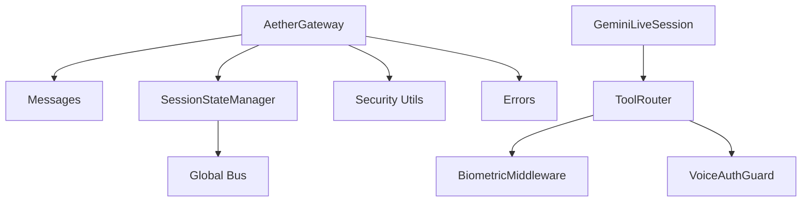

**Diagram sources**
- [gateway.py](file://core/infra/transport/gateway.py#L30-L46)
- [session_state.py](file://core/infra/transport/session_state.py#L103-L116)
- [router.py](file://core/tools/router.py#L135-L140)
- [voice_auth.py](file://core/tools/voice_auth.py#L1-L81)

**Section sources**
- [gateway.py](file://core/infra/transport/gateway.py#L30-L46)
- [session_state.py](file://core/infra/transport/session_state.py#L103-L116)
- [router.py](file://core/tools/router.py#L135-L140)
- [voice_auth.py](file://core/tools/voice_auth.py#L1-L81)

## Performance Considerations
- The handshake uses non-interactive Ed25519 challenge-response to minimize latency
- Speculative pre-warming reduces handover latency by initializing the next session in advance
- Heartbeat intervals balance liveness detection with network overhead
- Biometric checks are lightweight and applied only for sensitive tools

[No sources needed since this section provides general guidance]

## Troubleshooting Guide
Common issues and resolutions:
- Handshake failures
  - Symptom: 401 AUTH_FAILED during connect.ack
  - Causes: Invalid Ed25519 signature, missing client_id, or JWT verification failure
  - Resolution: Verify client_id matches the registered public key, ensure correct challenge signing, and confirm JWT secret configuration
- Capability denied
  - Symptom: 403 CAP_DENIED when requesting restricted operations
  - Causes: Client requested capability not granted during handshake
  - Resolution: Adjust client capabilities during handshake negotiation
- Handshake timeout
  - Symptom: 408 TIMEOUT during handshake
  - Causes: Client did not respond within the configured timeout
  - Resolution: Increase handshake timeout or investigate client connectivity
- Biometric lock failures
  - Symptom: 403 Forbidden for sensitive tools
  - Causes: VoiceAuthGuard did not detect a matching voice signature
  - Resolution: Ensure proper audio capture and that the speaker’s voice matches the authorized range; temporarily enable fallback for development if needed

**Section sources**
- [errors.py](file://core/utils/errors.py#L65-L75)
- [gateway.py](file://core/infra/transport/gateway.py#L569-L584)
- [router.py](file://core/tools/router.py#L287-L302)
- [voice_auth.py](file://core/tools/voice_auth.py#L25-L52)

## Conclusion
Aether Voice OS implements a layered security model:
- Transport-level Ed25519 challenge-response handshake with optional JWT support
- Capability negotiation and heartbeat-based liveness detection
- Biometric middleware and voice authentication for protecting sensitive operations
- Centralized session state management with persistence and health monitoring
- Comprehensive telemetry and audit trails for compliance and observability

This design balances strong security with low-latency neural handoff and responsive biometric verification.

[No sources needed since this section summarizes without analyzing specific files]

## Appendices

### Authentication Flows by Role and Permission
- Unauthenticated client: Must complete Ed25519 challenge-response or JWT verification
- Authenticated client: Granted capabilities negotiated during handshake
- Administrator (voice-verified): Authorized to perform sensitive operations gated by BiometricMiddleware

**Section sources**
- [gateway.py](file://core/infra/transport/gateway.py#L590-L618)
- [router.py](file://core/tools/router.py#L126-L133)
- [voice_auth.py](file://core/tools/voice_auth.py#L54-L67)

### Extending the Authentication System
- Adding a new capability:
  - Extend capability negotiation in the handshake and grant logic
  - Define a new capability constant and update client capability lists
- Implementing custom biometric checks:
  - Extend VoiceAuthGuard with additional heuristics or integrate with external biometric APIs
  - Update ToolRouter to mark tools as requiring biometric verification
- Custom middleware:
  - Create a new middleware class similar to BiometricMiddleware and integrate into ToolRouter

**Section sources**
- [gateway.py](file://core/infra/transport/gateway.py#L590-L618)
- [router.py](file://core/tools/router.py#L46-L85)
- [voice_auth.py](file://core/tools/voice_auth.py#L19-L52)

### Threat Modeling and Mitigations
- Man-in-the-middle attacks on WebSocket:
  - Mitigation: Use TLS termination in front of the gateway; enforce strict certificate validation
- Replay attacks on challenge-response:
  - Mitigation: Use fresh 32-byte challenges per connection; reject reused challenges
- Privilege escalation via tool execution:
  - Mitigation: Enforce BiometricMiddleware for sensitive tools; audit tool invocations
- Denial-of-Service via heartbeat starvation:
  - Mitigation: Configure maxMissedTicks and prune dead clients promptly
- JWT abuse:
  - Mitigation: Rotate secrets regularly; restrict token audiences and lifetimes

[No sources needed since this section provides general guidance]

### Monitoring Recommendations
- Metrics to track:
  - Handshake success/failure rates
  - Heartbeat loss and client pruning counts
  - Biometric verification success rates
  - Tool execution latency percentiles and error rates
- Logs to monitor:
  - Handshake errors, capability denials, and biometric lock failures
  - Session state transitions and persistence events
- Auditing:
  - Enable OTLP tracing for all handshake and tool-call flows
  - Retain session snapshots and state change logs for forensic analysis

**Section sources**
- [session_state.py](file://core/infra/transport/session_state.py#L273-L292)
- [telemetry.py](file://core/infra/telemetry.py#L77-L129)
- [handover_telemetry.py](file://core/ai/handover_telemetry.py#L295-L314)