# Component Interactions

<cite>
**Referenced Files in This Document**
- [engine.py](file://core/engine.py)
- [event_bus.py](file://core/infra/event_bus.py)
- [capture.py](file://core/audio/capture.py)
- [router.py](file://core/tools/router.py)
- [session.py](file://core/ai/session.py)
- [interface.py](file://core/infra/cloud/firebase/interface.py)
- [AetherBrain.tsx](file://apps/portal/src/components/AetherBrain.tsx)
- [gateway.py](file://core/infra/transport/gateway.py)
- [audio.py](file://core/logic/managers/audio.py)
- [infra.py](file://core/logic/managers/infra.py)
- [hive.py](file://core/ai/hive.py)
- [bus.py](file://core/infra/transport/bus.py)
- [messages.py](file://core/infra/transport/messages.py)
- [useAetherGateway.ts](file://apps/portal/src/hooks/useAetherGateway.ts)
- [useAudioPipeline.ts](file://apps/portal/src/hooks/useAudioPipeline.ts)
</cite>

## Table of Contents
1. [Introduction](#introduction)
2. [Project Structure](#project-structure)
3. [Core Components](#core-components)
4. [Architecture Overview](#architecture-overview)
5. [Detailed Component Analysis](#detailed-component-analysis)
6. [Dependency Analysis](#dependency-analysis)
7. [Performance Considerations](#performance-considerations)
8. [Troubleshooting Guide](#troubleshooting-guide)
9. [Conclusion](#conclusion)

## Introduction
This document explains how the Aether system coordinates audio processing, AI integration, and tool execution through the EventBus pattern. It documents the bidirectional WebSocket communication, event propagation, and state synchronization among AudioCapture, AetherEngine, Gemini Live session, ToolRouter, and Firebase connector. It also describes the role of the AetherBrain frontend component in controlling the audio pipeline and gateway communication, and outlines lifecycle management, initialization, and error handling strategies.

## Project Structure
The Aether system is organized around a backend orchestrator (AetherEngine) that wires audio capture, AI sessions, tool routing, and infrastructure services. The frontend (AetherBrain) connects to the backend via a WebSocket gateway and controls the browser audio pipeline.

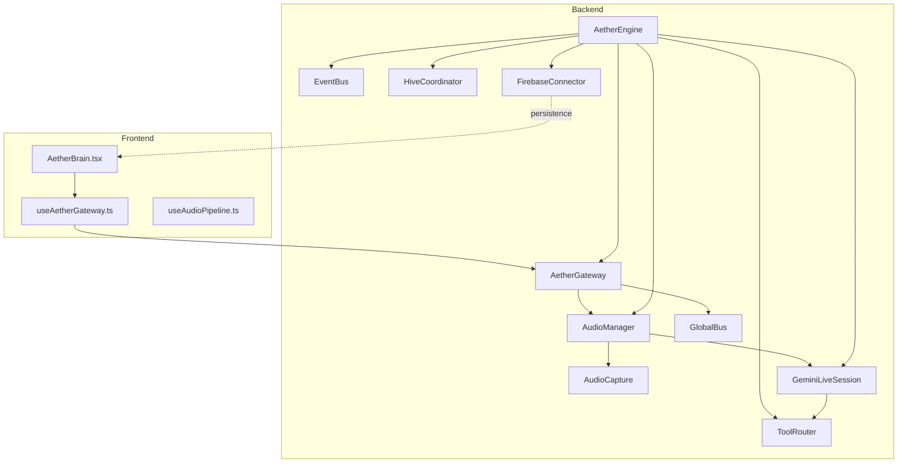

**Diagram sources**
- [engine.py](file://core/engine.py#L26-L120)
- [event_bus.py](file://core/infra/event_bus.py#L69-L152)
- [audio.py](file://core/logic/managers/audio.py#L18-L98)
- [capture.py](file://core/audio/capture.py#L193-L550)
- [session.py](file://core/ai/session.py#L43-L236)
- [router.py](file://core/tools/router.py#L120-L360)
- [hive.py](file://core/ai/hive.py#L47-L124)
- [gateway.py](file://core/infra/transport/gateway.py#L69-L828)
- [interface.py](file://core/infra/cloud/firebase/interface.py#L15-L259)
- [bus.py](file://core/infra/transport/bus.py#L25-L200)
- [AetherBrain.tsx](file://apps/portal/src/components/AetherBrain.tsx#L35-L227)
- [useAetherGateway.ts](file://apps/portal/src/hooks/useAetherGateway.ts#L69-L299)
- [useAudioPipeline.ts](file://apps/portal/src/hooks/useAudioPipeline.ts#L27-L248)

**Section sources**
- [engine.py](file://core/engine.py#L26-L120)
- [gateway.py](file://core/infra/transport/gateway.py#L69-L153)
- [audio.py](file://core/logic/managers/audio.py#L18-L98)
- [session.py](file://core/ai/session.py#L43-L155)
- [router.py](file://core/tools/router.py#L120-L232)
- [hive.py](file://core/ai/hive.py#L47-L124)
- [interface.py](file://core/infra/cloud/firebase/interface.py#L15-L84)
- [bus.py](file://core/infra/transport/bus.py#L25-L108)
- [AetherBrain.tsx](file://apps/portal/src/components/AetherBrain.tsx#L35-L120)
- [useAetherGateway.ts](file://apps/portal/src/hooks/useAetherGateway.ts#L69-L140)
- [useAudioPipeline.ts](file://apps/portal/src/hooks/useAudioPipeline.ts#L27-L134)

## Core Components
- AetherEngine: High-level orchestrator that initializes EventBus, managers, gateway, audio, infrastructure, admin API, pulse, and scheduler; starts and supervises subsystems.
- EventBus: Tiered event bus with three lanes (Audio, Control, Telemetry) supporting strict deadlines and concurrent subscriber delivery.
- AudioCapture: Microphone capture with Thalamic Gate AEC, VAD, and affective analytics; pushes PCM frames to the gateway queue.
- AudioManager: Coordinates capture, playback, and affective telemetry; bridges to EventBus and Gateway.
- GeminiLiveSession: Bidirectional audio session with Gemini; handles tool calls, interruptions, proactive vision pulses, and backchannels.
- ToolRouter: Dispatches Gemini tool calls to registered handlers; supports biometric middleware and performance profiling.
- HiveCoordinator: Manages expert souls, deep handover protocol, pre-warming, and context preservation.
- AetherGateway: WebSocket gateway owning audio queues, session lifecycle, state transitions, and broadcasting to clients.
- FirebaseConnector: Cloud persistence layer for sessions, messages, metrics, and knowledge.
- GlobalBus: Distributed pub/sub/state layer using Redis for multi-node synchronization.
- AetherBrain: Frontend “invisible conductor” that connects to the gateway, streams audio, plays responses, and reacts to telemetry.

**Section sources**
- [engine.py](file://core/engine.py#L26-L120)
- [event_bus.py](file://core/infra/event_bus.py#L69-L152)
- [capture.py](file://core/audio/capture.py#L193-L550)
- [audio.py](file://core/logic/managers/audio.py#L18-L98)
- [session.py](file://core/ai/session.py#L43-L236)
- [router.py](file://core/tools/router.py#L120-L360)
- [hive.py](file://core/ai/hive.py#L47-L124)
- [gateway.py](file://core/infra/transport/gateway.py#L69-L153)
- [interface.py](file://core/infra/cloud/firebase/interface.py#L15-L84)
- [bus.py](file://core/infra/transport/bus.py#L25-L108)
- [AetherBrain.tsx](file://apps/portal/src/components/AetherBrain.tsx#L35-L120)

## Architecture Overview
The backend uses structured concurrency to start the EventBus, gateway, audio tasks, and admin sync loop. The gateway owns the Gemini session and audio queues, while the engine coordinates managers and services. The frontend connects via WebSocket, authenticates with a challenge-response handshake, and streams audio while receiving telemetry and tool results.

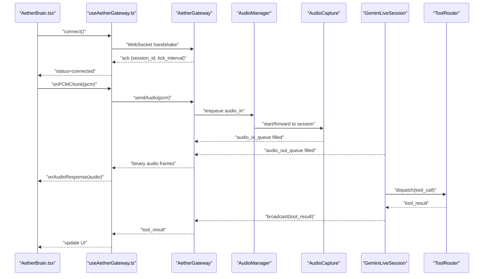

**Diagram sources**
- [AetherBrain.tsx](file://apps/portal/src/components/AetherBrain.tsx#L52-L156)
- [useAetherGateway.ts](file://apps/portal/src/hooks/useAetherGateway.ts#L77-L140)
- [gateway.py](file://core/infra/transport/gateway.py#L529-L558)
- [audio.py](file://core/logic/managers/audio.py#L51-L64)
- [capture.py](file://core/audio/capture.py#L486-L529)
- [session.py](file://core/ai/session.py#L383-L478)
- [router.py](file://core/tools/router.py#L234-L356)

**Section sources**
- [AetherBrain.tsx](file://apps/portal/src/components/AetherBrain.tsx#L52-L156)
- [useAetherGateway.ts](file://apps/portal/src/hooks/useAetherGateway.ts#L77-L140)
- [gateway.py](file://core/infra/transport/gateway.py#L529-L558)
- [audio.py](file://core/logic/managers/audio.py#L51-L64)
- [capture.py](file://core/audio/capture.py#L486-L529)
- [session.py](file://core/ai/session.py#L383-L478)
- [router.py](file://core/tools/router.py#L234-L356)

## Detailed Component Analysis

### AetherEngine Orchestration
- Initializes EventBus, managers, gateway, audio, infrastructure, admin API, pulse, and scheduler.
- Registers tools with ToolRouter and injects Firebase connectors.
- Starts managers and subsystems concurrently; handles shutdown gracefully.

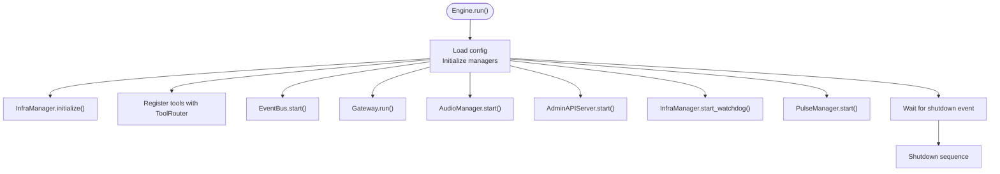

**Diagram sources**
- [engine.py](file://core/engine.py#L189-L240)

**Section sources**
- [engine.py](file://core/engine.py#L26-L120)
- [engine.py](file://core/engine.py#L189-L240)

### EventBus Pattern and Event Propagation
- Three-tier queues: AudioFrameEvent (PCM), ControlEvent (state), TelemetryEvent (metrics).
- Strict deadlines enforced; expired events dropped on high-priority lanes.
- Subscribers registered per event type; concurrent fan-out to callbacks.

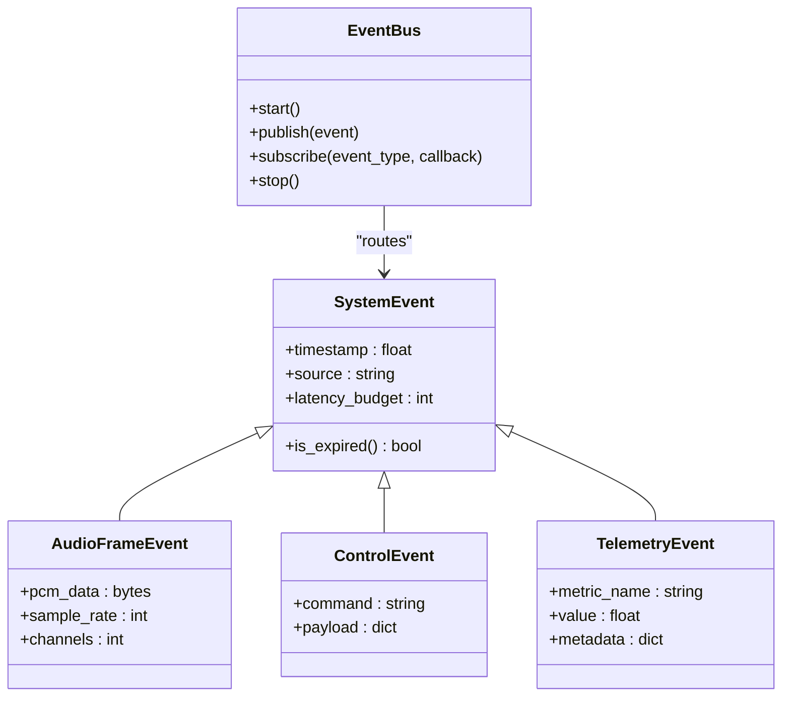

**Diagram sources**
- [event_bus.py](file://core/infra/event_bus.py#L15-L152)

**Section sources**
- [event_bus.py](file://core/infra/event_bus.py#L69-L152)

### AudioCapture and Thalamic Gate
- Microphone capture with C-callback and direct async injection.
- Dynamic AEC, jitter buffer, VAD, and affective analytics.
- Smooth muting to avoid audio clicks; throttled telemetry broadcasts.
- Bridges affective features to EventBus and Gateway.

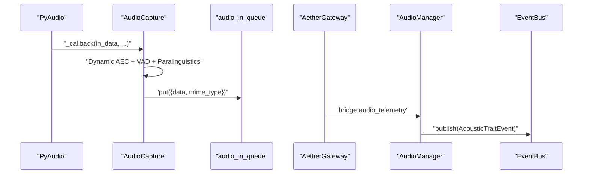

**Diagram sources**
- [capture.py](file://core/audio/capture.py#L304-L484)
- [gateway.py](file://core/infra/transport/gateway.py#L672-L685)
- [audio.py](file://core/logic/managers/audio.py#L72-L98)
- [event_bus.py](file://core/infra/event_bus.py#L52-L62)

**Section sources**
- [capture.py](file://core/audio/capture.py#L193-L550)
- [audio.py](file://core/logic/managers/audio.py#L72-L98)

### GeminiLiveSession and Tool Execution
- Bidirectional audio loop with structured concurrency.
- Handles tool calls in parallel, broadcasts results, and supports interruptions.
- Proactive vision pulses and backchannel loops for empathy.

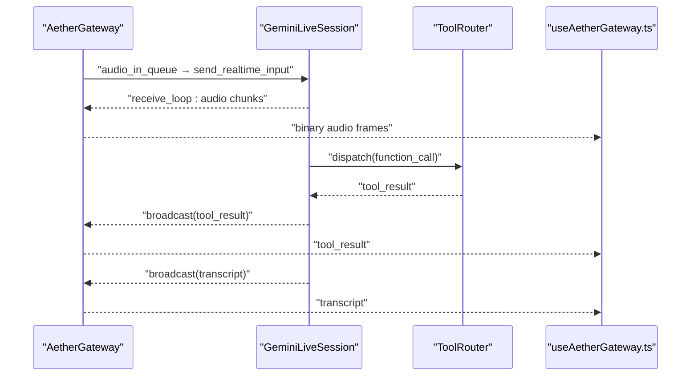

**Diagram sources**
- [session.py](file://core/ai/session.py#L237-L478)
- [session.py](file://core/ai/session.py#L493-L603)
- [router.py](file://core/tools/router.py#L234-L356)
- [useAetherGateway.ts](file://apps/portal/src/hooks/useAetherGateway.ts#L137-L214)

**Section sources**
- [session.py](file://core/ai/session.py#L174-L236)
- [session.py](file://core/ai/session.py#L383-L478)
- [session.py](file://core/ai/session.py#L493-L603)
- [router.py](file://core/tools/router.py#L234-L356)

### ToolRouter and Biometric Middleware
- Registers tools from modules and generates Gemini-compatible declarations.
- Middleware enforces biometric verification for sensitive tools.
- Profiling tracks latency percentiles; supports async/sync handlers.

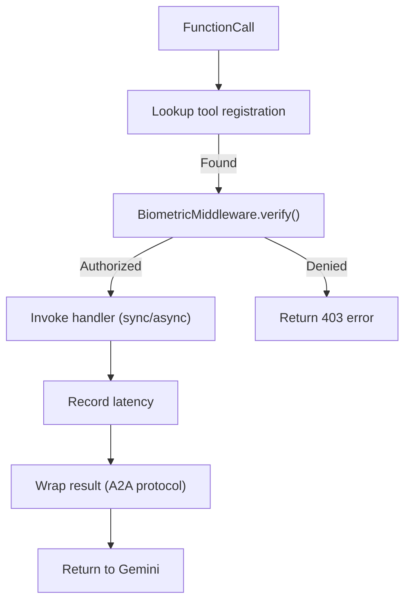

**Diagram sources**
- [router.py](file://core/tools/router.py#L234-L356)
- [router.py](file://core/tools/router.py#L46-L85)

**Section sources**
- [router.py](file://core/tools/router.py#L120-L360)

### AetherGateway and Session Lifecycle
- WebSocket server with Ed25519/JWT handshake and heartbeat ticks.
- Owns audio queues and routes binary and JSON messages.
- Manages session lifecycle, soul handoffs, and broadcasting.

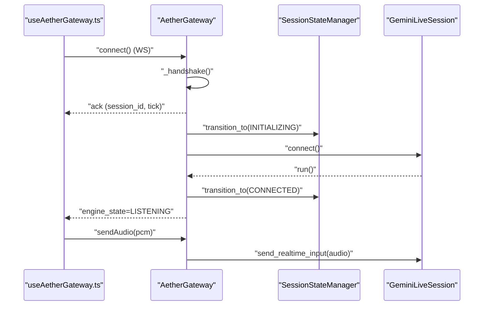

**Diagram sources**
- [gateway.py](file://core/infra/transport/gateway.py#L529-L558)
- [gateway.py](file://core/infra/transport/gateway.py#L353-L507)
- [messages.py](file://core/infra/transport/messages.py#L16-L80)

**Section sources**
- [gateway.py](file://core/infra/transport/gateway.py#L320-L507)
- [messages.py](file://core/infra/transport/messages.py#L16-L80)

### Firebase Connector and Persistence
- Initializes Firestore, starts session, logs messages and affective metrics.
- Provides repair logging and session end summaries.

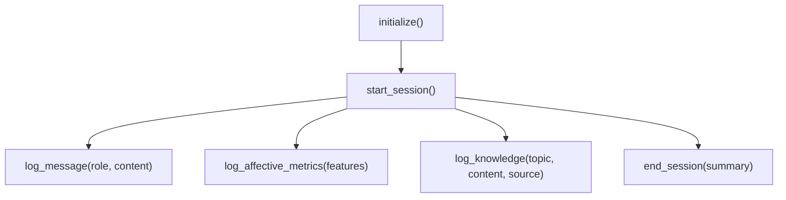

**Diagram sources**
- [interface.py](file://core/infra/cloud/firebase/interface.py#L31-L203)

**Section sources**
- [interface.py](file://core/infra/cloud/firebase/interface.py#L15-L259)

### AetherBrain Frontend Control
- Establishes gateway connection, streams PCM with client-side VAD gating, and plays audio.
- Reacts to telemetry, transcripts, tool results, and vision pulses.
- Manages emotion-triggered priority vision frames.

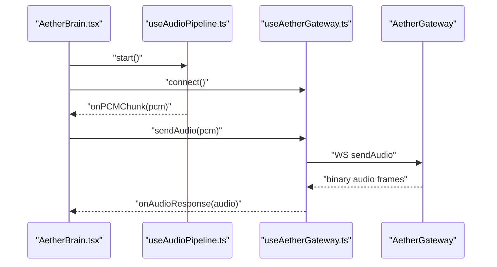

**Diagram sources**
- [AetherBrain.tsx](file://apps/portal/src/components/AetherBrain.tsx#L52-L156)
- [useAudioPipeline.ts](file://apps/portal/src/hooks/useAudioPipeline.ts#L48-L134)
- [useAetherGateway.ts](file://apps/portal/src/hooks/useAetherGateway.ts#L77-L140)

**Section sources**
- [AetherBrain.tsx](file://apps/portal/src/components/AetherBrain.tsx#L35-L227)
- [useAudioPipeline.ts](file://apps/portal/src/hooks/useAudioPipeline.ts#L27-L248)
- [useAetherGateway.ts](file://apps/portal/src/hooks/useAetherGateway.ts#L69-L299)

## Dependency Analysis
The backend components are loosely coupled via queues and events. The gateway centralizes audio queues and session ownership, while the engine coordinates managers and services. The frontend communicates exclusively via WebSocket messages and audio frames.

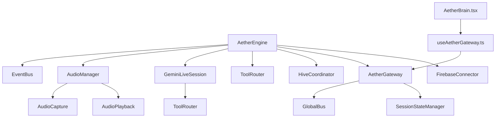

**Diagram sources**
- [engine.py](file://core/engine.py#L26-L120)
- [audio.py](file://core/logic/managers/audio.py#L18-L98)
- [session.py](file://core/ai/session.py#L43-L155)
- [router.py](file://core/tools/router.py#L120-L232)
- [hive.py](file://core/ai/hive.py#L47-L124)
- [gateway.py](file://core/infra/transport/gateway.py#L69-L153)
- [bus.py](file://core/infra/transport/bus.py#L25-L108)
- [AetherBrain.tsx](file://apps/portal/src/components/AetherBrain.tsx#L35-L120)
- [useAetherGateway.ts](file://apps/portal/src/hooks/useAetherGateway.ts#L69-L140)

**Section sources**
- [engine.py](file://core/engine.py#L26-L120)
- [gateway.py](file://core/infra/transport/gateway.py#L69-L153)
- [audio.py](file://core/logic/managers/audio.py#L18-L98)
- [session.py](file://core/ai/session.py#L43-L155)
- [router.py](file://core/tools/router.py#L120-L232)
- [hive.py](file://core/ai/hive.py#L47-L124)
- [bus.py](file://core/infra/transport/bus.py#L25-L108)
- [AetherBrain.tsx](file://apps/portal/src/components/AetherBrain.tsx#L35-L120)
- [useAetherGateway.ts](file://apps/portal/src/hooks/useAetherGateway.ts#L69-L140)

## Performance Considerations
- EventBus tiers prevent priority inversion; expired events are dropped on high-priority lanes to preserve deadlines.
- Audio capture avoids thread hops by injecting directly into the asyncio loop; jitter buffers and AEC reduce echo and latency.
- Gemini session uses structured concurrency to keep send/receive loops resilient; parallel tool execution reduces round-trips.
- Frontend uses gapless playback scheduling to eliminate audio gaps; client-side VAD gates transmission to save bandwidth.
- GlobalBus leverages Redis for distributed state and pub/sub; careful subscription management prevents callback overload.

[No sources needed since this section provides general guidance]

## Troubleshooting Guide
- Audio device errors: AudioCapture raises device-not-found exceptions; check device availability and permissions.
- Session termination: GeminiLiveSession wraps session errors and raises session-expired errors; verify API keys and network connectivity.
- Gateway handshake failures: AetherGateway validates JWT or Ed25519 signatures; confirm secrets and client identity.
- EventBus errors: Tier workers log exceptions and continue; inspect subscriber callbacks for misconfiguration.
- Firebase offline: FirebaseConnector falls back to offline mode; verify credentials and network.

**Section sources**
- [capture.py](file://core/audio/capture.py#L492-L498)
- [session.py](file://core/ai/session.py#L220-L230)
- [gateway.py](file://core/infra/transport/gateway.py#L549-L558)
- [event_bus.py](file://core/infra/event_bus.py#L126-L143)
- [interface.py](file://core/infra/cloud/firebase/interface.py#L36-L61)

## Conclusion
The Aether system achieves reliable, low-latency audio and AI orchestration through a layered architecture: a central EventBus for decoupled event propagation, a gateway that owns audio queues and session lifecycle, and a frontend that controls the audio pipeline and UI. The ToolRouter and HiveCoordinator provide robust tool execution and expert handoff capabilities, while Firebase ensures persistence and observability. The design emphasizes loose coupling, structured concurrency, and strict deadline enforcement to maintain responsive and dependable operation.