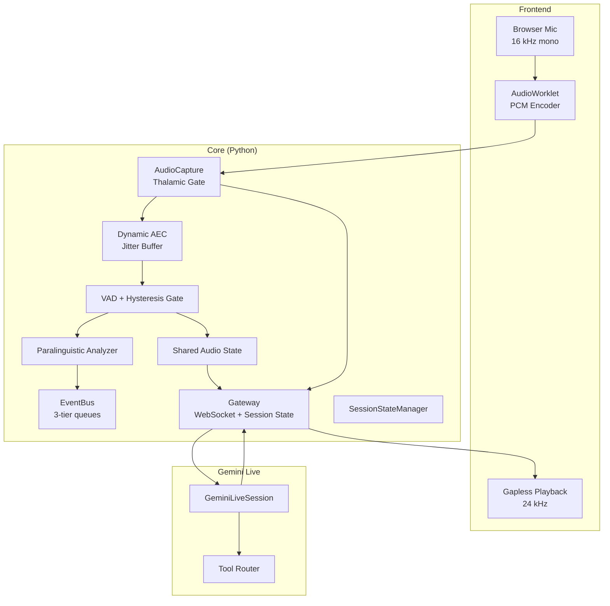
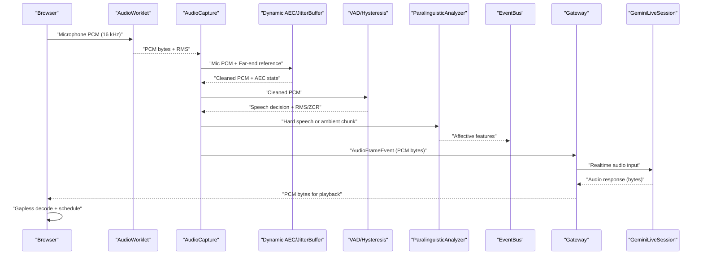
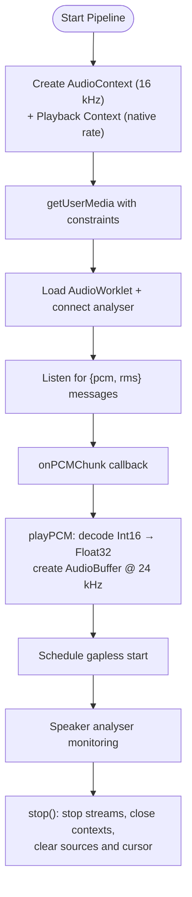
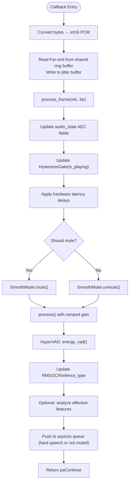
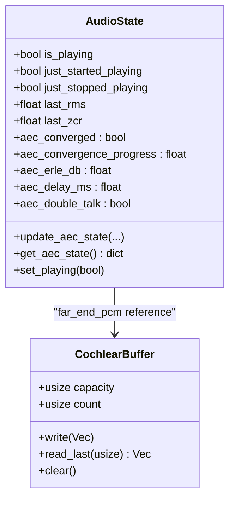
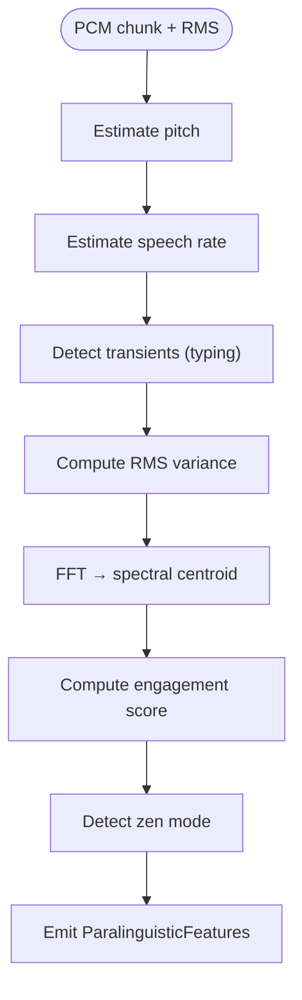
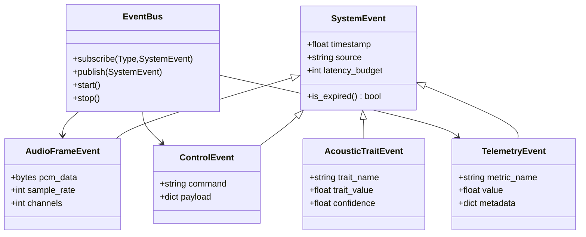
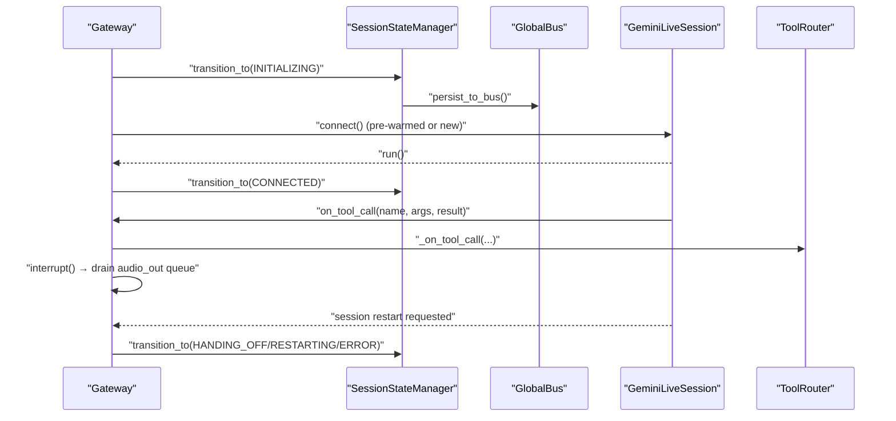
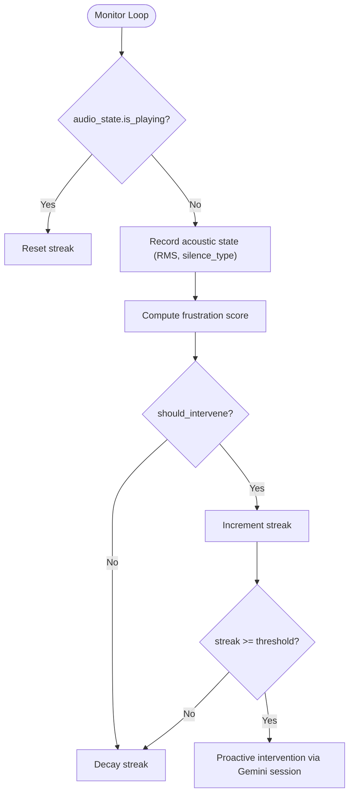
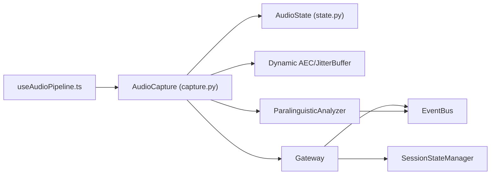

# Data Flow Design

<cite>
**Referenced Files in This Document**
- [useAudioPipeline.ts](file://apps/portal/src/hooks/useAudioPipeline.ts)
- [AetherBrain.tsx](file://apps/portal/src/components/AetherBrain.tsx)
- [pcm-processor.js](file://apps/portal/public/pcm-processor.js)
- [capture.py](file://core/audio/capture.py)
- [state.py](file://core/audio/state.py)
- [paralinguistics.py](file://core/audio/paralinguistics.py)
- [thalamic.py](file://core/ai/thalamic.py)
- [event_bus.py](file://core/infra/event_bus.py)
- [gateway.py](file://core/infra/transport/gateway.py)
- [session_state.py](file://core/infra/transport/session_state.py)
- [cochlea.rs](file://cortex/src/cochlea.rs)
- [test_thalamic_gate_benchmark.py](file://tests/benchmarks/test_thalamic_gate_benchmark.py)
</cite>

## Table of Contents
1. [Introduction](#introduction)
2. [Project Structure](#project-structure)
3. [Core Components](#core-components)
4. [Architecture Overview](#architecture-overview)
5. [Detailed Component Analysis](#detailed-component-analysis)
6. [Dependency Analysis](#dependency-analysis)
7. [Performance Considerations](#performance-considerations)
8. [Troubleshooting Guide](#troubleshooting-guide)
9. [Conclusion](#conclusion)

## Introduction
This document describes Aether’s end-to-end data flow design from microphone input to user output. It covers the complete journey of PCM audio chunks, affective features, tool parameters, and session state, detailing the transformation pipeline through Thalamic Gate processing, Gemini Live integration, and tool execution phases. It also documents real-time data structures used for audio buffering, event propagation, and state management, along with validation rules, serialization formats, zero-copy optimization techniques, lifecycle management, memory strategies, consistency across asynchronous operations, error handling, recovery mechanisms, and monitoring approaches.

## Project Structure
The data flow spans three primary domains:
- Frontend audio pipeline (browser): capture, encode, and playback
- Core audio capture and processing (Python): Thalamic Gate, AEC, VAD, affective features
- Transport and session management (Python): Gateway, session state machine, event bus

**Diagram sources**
- [useAudioPipeline.ts](file://apps/portal/src/hooks/useAudioPipeline.ts#L48-L134)
- [pcm-processor.js](file://apps/portal/public/pcm-processor.js)
- [capture.py](file://core/audio/capture.py#L329-L509)
- [paralinguistics.py](file://core/audio/paralinguistics.py#L132-L213)
- [state.py](file://core/audio/state.py#L36-L128)
- [event_bus.py](file://core/infra/event_bus.py#L69-L152)
- [gateway.py](file://core/infra/transport/gateway.py#L69-L153)
- [session_state.py](file://core/infra/transport/session_state.py#L71-L271)

**Section sources**
- [useAudioPipeline.ts](file://apps/portal/src/hooks/useAudioPipeline.ts#L1-L248)
- [capture.py](file://core/audio/capture.py#L193-L575)
- [gateway.py](file://core/infra/transport/gateway.py#L69-L153)
- [session_state.py](file://core/infra/transport/session_state.py#L71-L271)
- [event_bus.py](file://core/infra/event_bus.py#L69-L152)

## Core Components
- Frontend audio pipeline: captures microphone at 16 kHz, encodes PCM via AudioWorklet, and plays audio back at 24 kHz with gapless scheduling and instant barge-in.
- Thalamic Gate (Python): high-priority callback performing AEC, VAD, hysteresis gating, and optional affective feature extraction; pushes PCM frames to an asyncio queue.
- Shared audio state: thread-safe singleton storing AEC state, RMS/ZCR, gating flags, and telemetry counters.
- Paralinguistic analyzer: extracts pitch, speech rate, RMS variance, spectral centroid, and engagement score for affective feedback.
- Event bus: 3-tier queueing system for audio frames, control commands, and telemetry; enforces latency budgets and expiration.
- Gateway and session state: WebSocket gateway owning the Gemini session, managing audio queues, and enforcing atomic state transitions with persistence and recovery.
- Rust Cortex acceleration: optional spectral denoise applied in the Thalamic Gate path.

**Section sources**
- [useAudioPipeline.ts](file://apps/portal/src/hooks/useAudioPipeline.ts#L168-L247)
- [capture.py](file://core/audio/capture.py#L329-L509)
- [state.py](file://core/audio/state.py#L36-L128)
- [paralinguistics.py](file://core/audio/paralinguistics.py#L19-L213)
- [event_bus.py](file://core/infra/event_bus.py#L69-L152)
- [gateway.py](file://core/infra/transport/gateway.py#L69-L153)
- [session_state.py](file://core/infra/transport/session_state.py#L71-L271)

## Architecture Overview
The system is designed for minimal latency and robustness:
- Direct callback injection avoids thread hops and reduces latency.
- Jitter buffer stabilizes far-end reference for AEC convergence.
- Zero-copy and minimal-allocation paths in hot loops (e.g., smoothing muter, ring buffers).
- Atomic session state transitions with persistence and global bus synchronization.
- Tiered event bus prevents priority inversion and ensures observability.

**Diagram sources**
- [useAudioPipeline.ts](file://apps/portal/src/hooks/useAudioPipeline.ts#L48-L134)
- [capture.py](file://core/audio/capture.py#L329-L509)
- [paralinguistics.py](file://core/audio/paralinguistics.py#L132-L213)
- [event_bus.py](file://core/infra/event_bus.py#L35-L61)
- [gateway.py](file://core/infra/transport/gateway.py#L179-L204)

## Detailed Component Analysis

### Frontend Audio Pipeline (Browser)
- Microphone capture via MediaStream at 16 kHz, mono, with echo cancellation, noise suppression, and AGC.
- AudioWorklet encodes PCM and emits {pcm, rms} messages to the pipeline hook.
- Gapless playback: scheduled AudioBufferSource nodes with a playback cursor to eliminate gaps.
- Instant barge-in: stops all active sources and resets the playback cursor.
- Real-time level monitoring for visualization.

**Diagram sources**
- [useAudioPipeline.ts](file://apps/portal/src/hooks/useAudioPipeline.ts#L48-L134)
- [useAudioPipeline.ts](file://apps/portal/src/hooks/useAudioPipeline.ts#L168-L247)
- [pcm-processor.js](file://apps/portal/public/pcm-processor.js)

**Section sources**
- [useAudioPipeline.ts](file://apps/portal/src/hooks/useAudioPipeline.ts#L1-L248)

### Thalamic Gate Processing (Python)
- High-priority C-callback performs:
  - Reads far-end reference from a shared ring buffer and writes to a jitter buffer.
  - Applies Dynamic AEC with convergence metrics and optional Rust spectral denoise.
  - Updates shared audio state (AEC state, RMS, ZCR, silence classification).
  - Hysteresis-based gating to mute microphone when AI is playing and user is not speaking.
  - Optional VAD gating to suppress barge-in triggers during full mute.
  - Emits affective features when conditions are met.
  - Pushes PCM frames to an asyncio queue for downstream processing.

**Diagram sources**
- [capture.py](file://core/audio/capture.py#L329-L509)
- [state.py](file://core/audio/state.py#L36-L128)
- [paralinguistics.py](file://core/audio/paralinguistics.py#L132-L213)

**Section sources**
- [capture.py](file://core/audio/capture.py#L193-L575)
- [state.py](file://core/audio/state.py#L36-L128)
- [test_thalamic_gate_benchmark.py](file://tests/benchmarks/test_thalamic_gate_benchmark.py#L38-L82)

### Shared Audio State and Real-Time Buffers
- Thread-safe singleton tracks:
  - Playback flags and transition flags for atomic updates.
  - AEC convergence state and metrics.
  - Last RMS, ZCR, and silence classification.
  - Telemetry counters for capture queue drops.
- Cochlea (Rust) circular buffer:
  - Lock-free, power-of-two capacity, O(1) writes and contiguous reads.
  - Used for far-end PCM reference feeding AEC and jitter buffer.

**Diagram sources**
- [state.py](file://core/audio/state.py#L36-L128)
- [cochlea.rs](file://cortex/src/cochlea.rs#L17-L136)

**Section sources**
- [state.py](file://core/audio/state.py#L36-L128)
- [cochlea.rs](file://cortex/src/cochlea.rs#L1-L212)

### Paralinguistic Features and Affective Feedback
- Extracts pitch, speech rate, RMS variance, spectral centroid, and engagement score.
- Provides zen mode detection based on transient typing cadence and low RMS.
- Emits features to the event bus for downstream use.

**Diagram sources**
- [paralinguistics.py](file://core/audio/paralinguistics.py#L132-L213)

**Section sources**
- [paralinguistics.py](file://core/audio/paralinguistics.py#L1-L213)

### Event Bus and Data Validation
- Three-tier queues:
  - AudioFrameEvent: PCM frames with sample rate and channels.
  - ControlEvent and AcousticTraitEvent: commands and affective traits.
  - TelemetryEvent and VisionPulseEvent: observability and proactive pulses.
- SystemEvent base contract enforces timestamp, source, and latency budget; expired events are dropped in audio/control lanes.
- Subscribers are routed concurrently; errors do not crash the bus.

**Diagram sources**
- [event_bus.py](file://core/infra/event_bus.py#L15-L152)

**Section sources**
- [event_bus.py](file://core/infra/event_bus.py#L69-L152)

### Gateway, Session State, and Tool Execution
- Gateway owns audio queues, WebSocket connections, and the GeminiLiveSession.
- SessionStateManager enforces atomic state transitions with validation, broadcasts, persistence, and recovery.
- Supports pre-warming, handoff, and interrupt semantics; drains audio output on barge-in.
- Tools are executed via ToolRouter upon session callbacks.

**Diagram sources**
- [gateway.py](file://core/infra/transport/gateway.py#L353-L507)
- [session_state.py](file://core/infra/transport/session_state.py#L197-L271)

**Section sources**
- [gateway.py](file://core/infra/transport/gateway.py#L69-L507)
- [session_state.py](file://core/infra/transport/session_state.py#L71-L271)

### Thalamic Gate Proactive Interventions
- Monitors audio_state to compute frustration and triggers proactive barge-ins when appropriate.
- Integrates with emotion calibration and demo metrics.

**Diagram sources**
- [thalamic.py](file://core/ai/thalamic.py#L41-L80)

**Section sources**
- [thalamic.py](file://core/ai/thalamic.py#L11-L122)

## Dependency Analysis
- Frontend depends on AudioWorklet for encoding and uses gapless playback scheduling.
- Core AudioCapture depends on:
  - Dynamic AEC and jitter buffer for echo suppression and reference stabilization.
  - HysteresisGate and SmoothMuter for gating and ramped gain.
  - Shared AudioState for telemetry and gating decisions.
  - Optional ParalinguisticAnalyzer for affective features.
- Gateway depends on SessionStateManager and GlobalBus for persistence and synchronization.
- EventBus decouples producers/consumers with tiered queues and expiration policies.

**Diagram sources**
- [useAudioPipeline.ts](file://apps/portal/src/hooks/useAudioPipeline.ts#L1-L248)
- [capture.py](file://core/audio/capture.py#L193-L575)
- [state.py](file://core/audio/state.py#L36-L128)
- [paralinguistics.py](file://core/audio/paralinguistics.py#L19-L213)
- [gateway.py](file://core/infra/transport/gateway.py#L69-L153)
- [session_state.py](file://core/infra/transport/session_state.py#L71-L271)
- [event_bus.py](file://core/infra/event_bus.py#L69-L152)

**Section sources**
- [useAudioPipeline.ts](file://apps/portal/src/hooks/useAudioPipeline.ts#L1-L248)
- [capture.py](file://core/audio/capture.py#L193-L575)
- [gateway.py](file://core/infra/transport/gateway.py#L69-L153)

## Performance Considerations
- Zero-copy and minimal-allocation paths:
  - SmoothMuter applies ramped gain without unnecessary copies when gain is 0 or 1.
  - Cochlea buffer uses bitwise masking and split reads to avoid branches.
  - Direct call_soon_threadsafe injection avoids thread hops.
- Latency minimization:
  - Thalamic Gate in callback reduces AEC/VAD latency.
  - Jitter buffer stabilizes far-end reference to prevent AEC divergence.
  - Gapless playback scheduling prevents gaps between audio chunks.
- Throughput and backpressure:
  - Asynchronous queues with bounded sizes and overflow handling.
  - EventBus tiers prevent priority inversion and drop expired events in high-priority lanes.
- Monitoring and tuning:
  - AudioTelemetryLogger records AEC and VAD latencies.
  - Benchmarks validate AEC ERLE and affective feature accuracy.

[No sources needed since this section provides general guidance]

## Troubleshooting Guide
- Microphone not found or permission denied:
  - AudioDeviceNotFoundError raised with available devices list.
- Session errors and recovery:
  - SessionStateManager tracks consecutive errors and transitions to RECOVERING or SHUTDOWN as needed.
  - Health monitoring loop triggers recovery attempts and persists snapshots.
- Audio queue drops:
  - Shared telemetry counter increments when capture queue overflows; indicates CPU overload or misconfiguration.
- Interrupt and barge-in:
  - Gateway interrupt drains audio_out queue and logs dropped chunks; verify playback queue clearing.
- AEC instability:
  - Check jitter buffer parameters and hardware latency compensation; review AEC convergence metrics in shared state.

**Section sources**
- [capture.py](file://core/audio/capture.py#L511-L575)
- [session_state.py](file://core/infra/transport/session_state.py#L378-L427)
- [gateway.py](file://core/infra/transport/gateway.py#L206-L234)
- [state.py](file://core/audio/state.py#L60-L65)

## Conclusion
Aether’s data flow design balances ultra-low latency with robustness and observability. The Thalamic Gate callback performs critical audio preprocessing in the audio thread, while the event bus and session state manager coordinate asynchronous operations across the system. Real-time buffers, zero-copy optimizations, and strict latency budgets ensure responsive audio. Atomic state transitions, persistence, and proactive recovery mechanisms maintain consistency and resilience under load and failures.