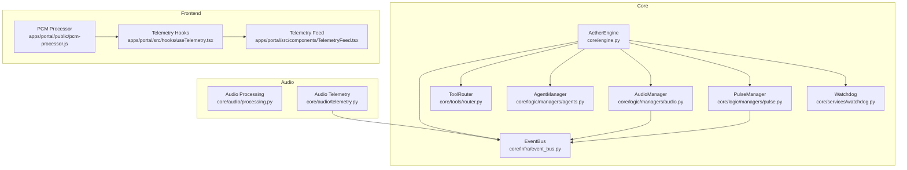
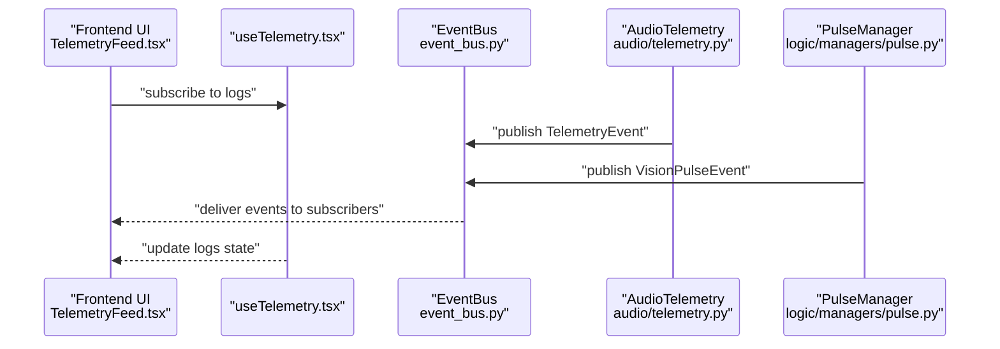
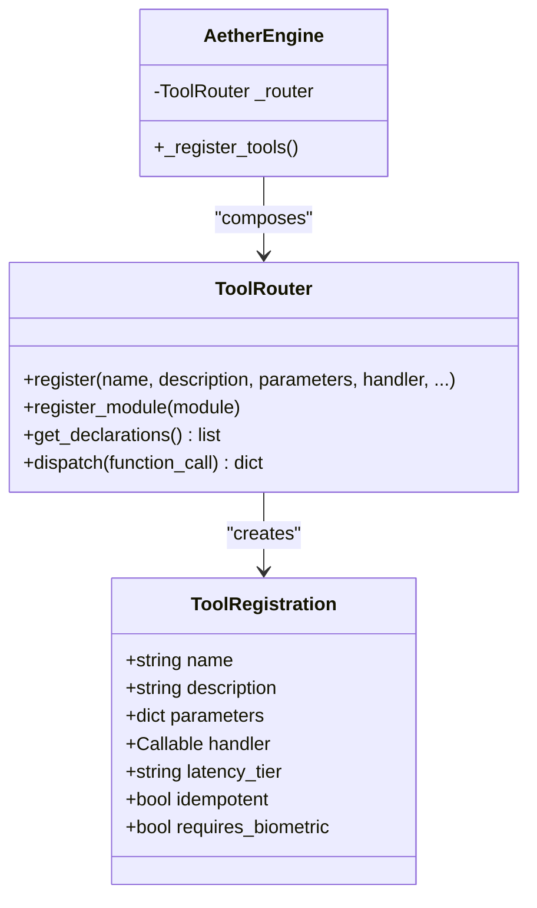
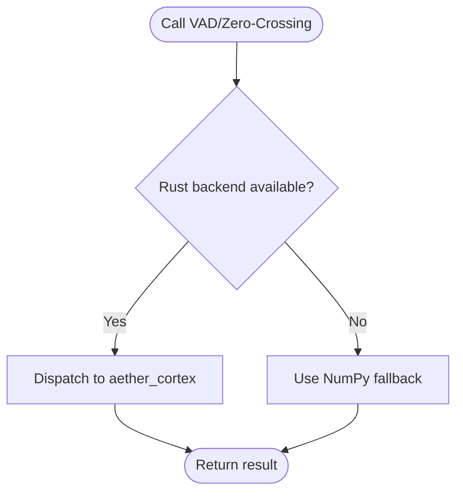
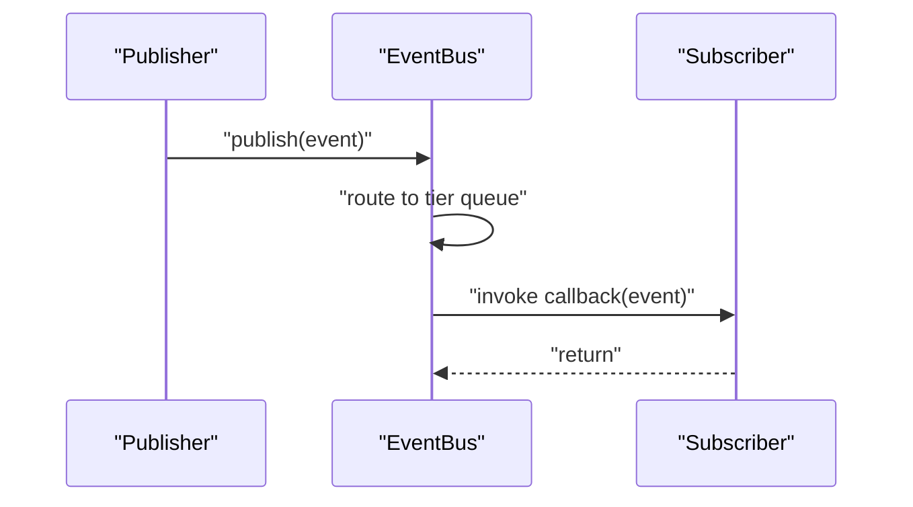
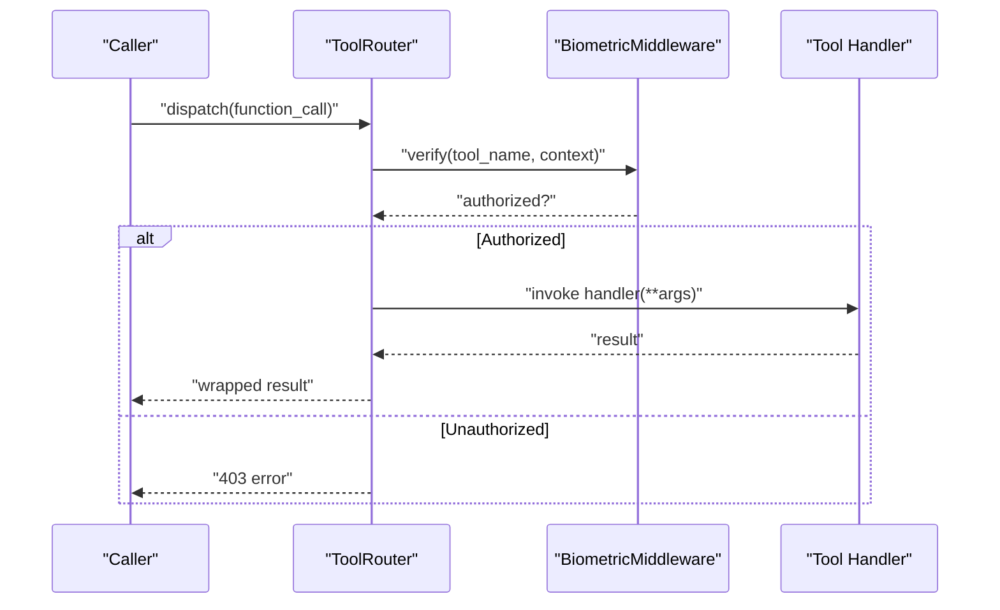
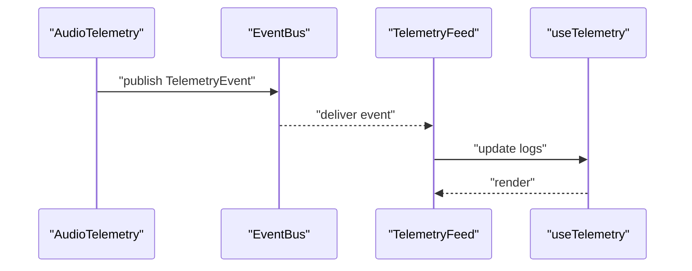
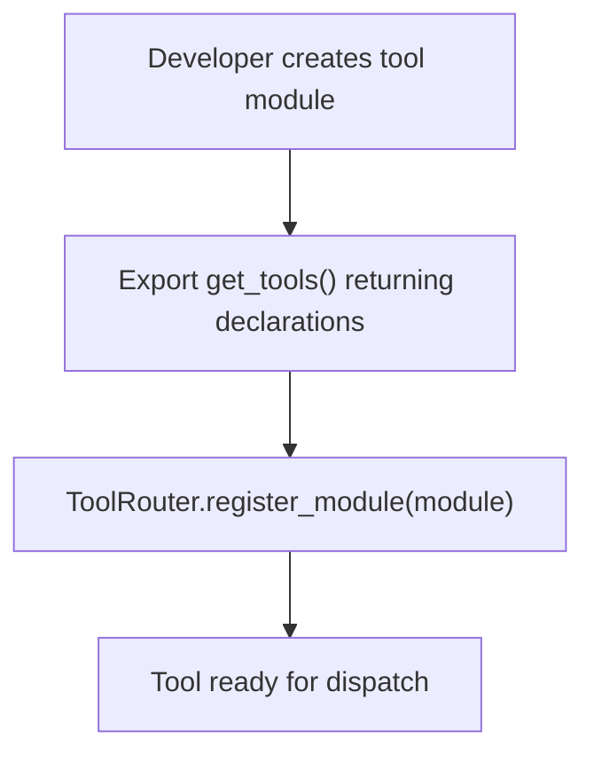
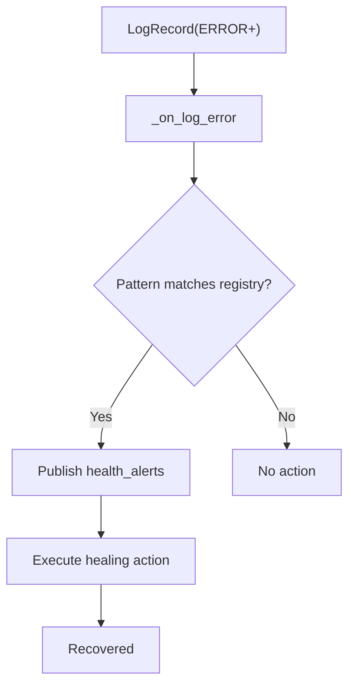
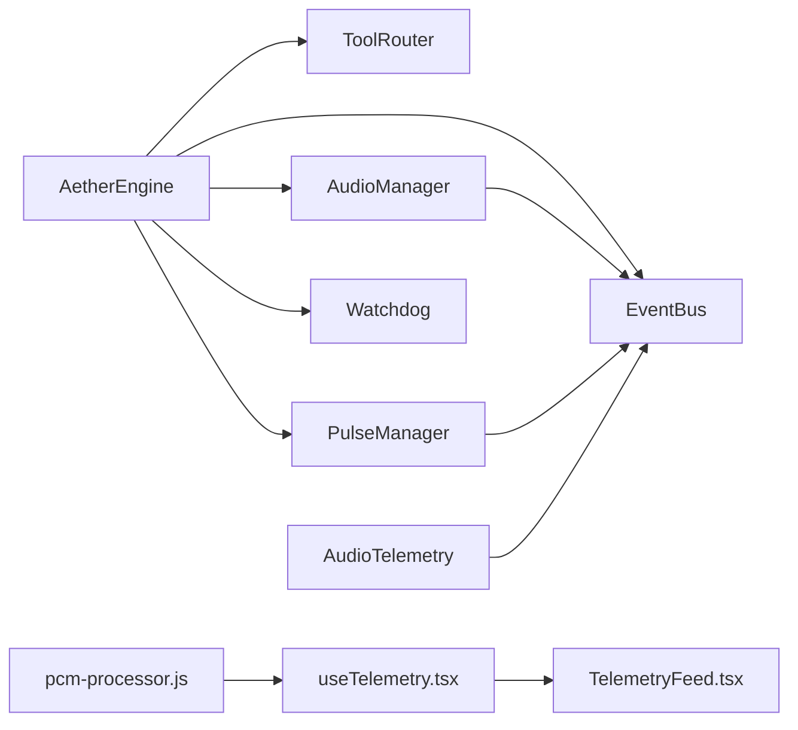

# Design Patterns

<cite>
**Referenced Files in This Document**
- [engine.py](file://core/engine.py)
- [router.py](file://core/tools/router.py)
- [security.py](file://core/utils/security.py)
- [event_bus.py](file://core/infra/event_bus.py)
- [telemetry.py](file://core/audio/telemetry.py)
- [pulse.py](file://core/logic/managers/pulse.py)
- [watchdog.py](file://core/services/watchdog.py)
- [sdk_guide.md](file://docs/sdk_guide.md)
- [pcm-processor.js](file://apps/portal/public/pcm-processor.js)
- [useTelemetry.tsx](file://apps/portal/src/hooks/useTelemetry.tsx)
- [TelemetryFeed.tsx](file://apps/portal/src/components/TelemetryFeed.tsx)
- [admin_api.py](file://core/services/admin_api.py)
</cite>

## Table of Contents
1. [Introduction](#introduction)
2. [Project Structure](#project-structure)
3. [Core Components](#core-components)
4. [Architecture Overview](#architecture-overview)
5. [Detailed Component Analysis](#detailed-component-analysis)
6. [Dependency Analysis](#dependency-analysis)
7. [Performance Considerations](#performance-considerations)
8. [Troubleshooting Guide](#troubleshooting-guide)
9. [Conclusion](#conclusion)

## Introduction
This document analyzes the design patterns implemented across Aether’s system architecture. It focuses on how Factory Pattern enables tool registration and agent instantiation, Strategy Pattern powers pluggable audio processing algorithms, Mediator Pattern coordinates the EventBus, Middleware Pattern secures and validates tool execution, Observer Pattern delivers real-time telemetry and state broadcasting, Plugin Pattern supports extensible tool development, and a form of Circuit Breaker Pattern contributes fault tolerance. The analysis includes concrete code references, diagrams, and practical insights into how these patterns improve modularity, maintainability, and scalability.

## Project Structure
Aether is organized into layered modules:
- Core orchestration and infrastructure (engine, infra, logic managers)
- AI subsystems (agents, scheduler, sessions)
- Audio processing and telemetry (DSP, VAD, telemetry)
- Tools and routers (dispatchers, middleware)
- Frontend telemetry and admin dashboards

**Diagram sources**
- [engine.py](file://core/engine.py#L26-L120)
- [event_bus.py](file://core/infra/event_bus.py#L69-L152)
- [router.py](file://core/tools/router.py#L120-L360)
- [telemetry.py](file://core/audio/telemetry.py#L21-L93)
- [pulse.py](file://core/logic/managers/pulse.py#L15-L44)
- [watchdog.py](file://core/services/watchdog.py#L43-L170)
- [useTelemetry.tsx](file://apps/portal/src/hooks/useTelemetry.tsx#L1-L54)
- [TelemetryFeed.tsx](file://apps/portal/src/components/TelemetryFeed.tsx#L1-L40)
- [pcm-processor.js](file://apps/portal/public/pcm-processor.js#L31-L81)

**Section sources**
- [engine.py](file://core/engine.py#L26-L120)
- [event_bus.py](file://core/infra/event_bus.py#L69-L152)

## Core Components
- AetherEngine orchestrates managers, initializes EventBus, ToolRouter, and subsystems.
- ToolRouter implements a neural dispatcher with middleware and performance profiling.
- EventBus mediates inter-module communication via typed events and tiered queues.
- AudioTelemetry and PulseManager exemplify Observer-style telemetry/state broadcasting.
- Watchdog implements a healing registry akin to a Circuit Breaker pattern for fault tolerance.
- Frontend telemetry hooks and components demonstrate real-time visualization of system state.

**Section sources**
- [engine.py](file://core/engine.py#L26-L120)
- [router.py](file://core/tools/router.py#L120-L360)
- [event_bus.py](file://core/infra/event_bus.py#L69-L152)
- [telemetry.py](file://core/audio/telemetry.py#L21-L93)
- [pulse.py](file://core/logic/managers/pulse.py#L15-L44)
- [watchdog.py](file://core/services/watchdog.py#L43-L170)
- [useTelemetry.tsx](file://apps/portal/src/hooks/useTelemetry.tsx#L1-L54)
- [TelemetryFeed.tsx](file://apps/portal/src/components/TelemetryFeed.tsx#L1-L40)

## Architecture Overview
Aether employs a layered, event-driven architecture:
- Managers (Engine, Audio, Infra, Pulse) coordinate specialized subsystems.
- EventBus decouples producers and consumers via typed events and lanes.
- ToolRouter centralizes function dispatch with middleware and recovery.
- Audio processing uses a Rust-first strategy with fallbacks.
- Telemetry and state updates propagate via observers and UI hooks.

**Diagram sources**
- [TelemetryFeed.tsx](file://apps/portal/src/components/TelemetryFeed.tsx#L1-L40)
- [useTelemetry.tsx](file://apps/portal/src/hooks/useTelemetry.tsx#L1-L54)
- [event_bus.py](file://core/infra/event_bus.py#L144-L152)
- [telemetry.py](file://core/audio/telemetry.py#L76-L88)
- [pulse.py](file://core/logic/managers/pulse.py#L10-L14)

## Detailed Component Analysis

### Factory Pattern: Tool Registration and Agent Instantiation
- ToolRouter registers tools declaratively and supports module-based registration, acting as a factory for handler functions.
- AetherEngine constructs managers and injects ToolRouter, acting as a composition factory.
- AgentRegistry stores AgentMetadata and supports discovery by capability, enabling agent factories for orchestration.

Benefits:
- Decouples tool definition from execution.
- Enables dynamic loading and recovery via semantic matching.
- Supports middleware and performance profiling.

**Diagram sources**
- [router.py](file://core/tools/router.py#L120-L360)
- [engine.py](file://core/engine.py#L124-L151)

Implementation highlights:
- Module-based registration and recovery logic.
- Biometric middleware enforcement and performance reporting.

**Section sources**
- [router.py](file://core/tools/router.py#L120-L360)
- [engine.py](file://core/engine.py#L124-L151)
- [sdk_guide.md](file://docs/sdk_guide.md#L1-L56)

### Strategy Pattern: Pluggable Audio Processing Algorithms
- Audio processing functions (e.g., VAD, zero-crossing detection) switch between Rust and Python backends based on availability.
- This strategy enables pluggable DSP engines without changing callers.

**Diagram sources**
- [processing.py](file://core/audio/processing.py#L40-L96)
- [processing.py](file://core/audio/processing.py#L410-L434)

Benefits:
- Transparent performance optimization.
- Graceful degradation and consistent API surface.

**Section sources**
- [processing.py](file://core/audio/processing.py#L40-L96)
- [processing.py](file://core/audio/processing.py#L410-L434)

### Mediator Pattern: EventBus Coordination
- EventBus mediates event publishing and routing across three tiers (Audio, Control, Telemetry).
- Subscribers receive events concurrently; expired events are dropped according to deadlines.

**Diagram sources**
- [event_bus.py](file://core/infra/event_bus.py#L90-L152)

Benefits:
- Loose coupling between producers and consumers.
- Priority isolation and latency guarantees via tiered queues.

**Section sources**
- [event_bus.py](file://core/infra/event_bus.py#L69-L152)

### Middleware Pattern: Security and Validation Layers
- ToolRouter integrates BiometricMiddleware to enforce soul-lock verification for sensitive tools.
- Middleware validates context and authorizes execution before invoking handlers.

**Diagram sources**
- [router.py](file://core/tools/router.py#L287-L301)
- [router.py](file://core/tools/router.py#L46-L84)

Benefits:
- Centralized, reusable security enforcement.
- Separation of concerns between authorization and business logic.

**Section sources**
- [router.py](file://core/tools/router.py#L46-L84)
- [router.py](file://core/tools/router.py#L287-L301)

### Observer Pattern: Real-Time Telemetry and State Broadcasting
- AudioTelemetry periodically publishes paralinguistic metrics to the Telemetry tier.
- PulseManager proactively emits vision pulses at intervals.
- Frontend hooks and components observe and render telemetry streams.

**Diagram sources**
- [telemetry.py](file://core/audio/telemetry.py#L53-L93)
- [event_bus.py](file://core/infra/event_bus.py#L144-L152)
- [TelemetryFeed.tsx](file://apps/portal/src/components/TelemetryFeed.tsx#L1-L40)
- [useTelemetry.tsx](file://apps/portal/src/hooks/useTelemetry.tsx#L1-L54)

Benefits:
- Reactive UI updates with minimal coupling.
- Scalable telemetry ingestion via concurrent subscriber delivery.

**Section sources**
- [telemetry.py](file://core/audio/telemetry.py#L21-L93)
- [pulse.py](file://core/logic/managers/pulse.py#L15-L44)
- [useTelemetry.tsx](file://apps/portal/src/hooks/useTelemetry.tsx#L1-L54)
- [TelemetryFeed.tsx](file://apps/portal/src/components/TelemetryFeed.tsx#L1-L40)

### Plugin Pattern: Extensible Tool Development
- Tools declare handlers and schemas; ToolRouter registers them via module scanning.
- The SDK guide documents the ADK standard for building plugins.

**Diagram sources**
- [sdk_guide.md](file://docs/sdk_guide.md#L1-L56)
- [router.py](file://core/tools/router.py#L183-L200)

Benefits:
- Encourages modular, testable tool development.
- Simplifies onboarding of new capabilities.

**Section sources**
- [sdk_guide.md](file://docs/sdk_guide.md#L1-L56)
- [router.py](file://core/tools/router.py#L183-L200)

### Circuit Breaker Pattern: Fault Tolerance
- Watchdog monitors logs and detects failure patterns, publishing health alerts and executing healing actions.
- Healing registry maps error patterns to corrective actions, preventing cascading failures.

**Diagram sources**
- [watchdog.py](file://core/services/watchdog.py#L119-L168)

Benefits:
- Autonomous recovery reduces downtime.
- Controlled alerting prevents alert fatigue.

**Section sources**
- [watchdog.py](file://core/services/watchdog.py#L43-L170)

## Dependency Analysis
- AetherEngine composes managers and injects ToolRouter and EventBus.
- ToolRouter depends on middleware and vector store for semantic recovery.
- Audio subsystems publish to EventBus; UI subscribes via hooks.
- Watchdog observes logs and interacts with global bus.

**Diagram sources**
- [engine.py](file://core/engine.py#L26-L120)
- [event_bus.py](file://core/infra/event_bus.py#L69-L152)
- [telemetry.py](file://core/audio/telemetry.py#L21-L93)
- [useTelemetry.tsx](file://apps/portal/src/hooks/useTelemetry.tsx#L1-L54)
- [TelemetryFeed.tsx](file://apps/portal/src/components/TelemetryFeed.tsx#L1-L40)
- [pcm-processor.js](file://apps/portal/public/pcm-processor.js#L31-L81)

**Section sources**
- [engine.py](file://core/engine.py#L26-L120)
- [event_bus.py](file://core/infra/event_bus.py#L69-L152)

## Performance Considerations
- Tiered queues in EventBus isolate latency-sensitive lanes (Audio/Control) from telemetry, preventing priority inversion.
- Hot-path separation and best-effort telemetry reduce overhead in audio callbacks.
- Rust-first DSP accelerates critical computations; fallback ensures resilience.
- Concurrency in EventBus subscribers avoids single-point bottlenecks.

[No sources needed since this section provides general guidance]

## Troubleshooting Guide
- Use Admin API endpoints to inspect system state and tools.
- Monitor telemetry logs and UI feed for real-time diagnostics.
- Watchdog publishes health alerts and attempts healing actions on recurring patterns.

**Section sources**
- [admin_api.py](file://core/services/admin_api.py#L26-L82)
- [useTelemetry.tsx](file://apps/portal/src/hooks/useTelemetry.tsx#L1-L54)
- [TelemetryFeed.tsx](file://apps/portal/src/components/TelemetryFeed.tsx#L1-L40)
- [watchdog.py](file://core/services/watchdog.py#L119-L168)

## Conclusion
Aether’s architecture leverages well-established design patterns to achieve modularity, maintainability, and scalability:
- Factory and Plugin patterns streamline tool and agent lifecycle.
- Strategy pattern enables pluggable DSP backends.
- Mediator (EventBus) decouples components and enforces latency budgets.
- Middleware centralizes security and validation.
- Observer pattern powers responsive telemetry and UI.
- Circuit Breaker-like mechanisms enhance reliability.

These choices collectively yield a robust, extensible system capable of evolving with new tools, algorithms, and operational requirements.