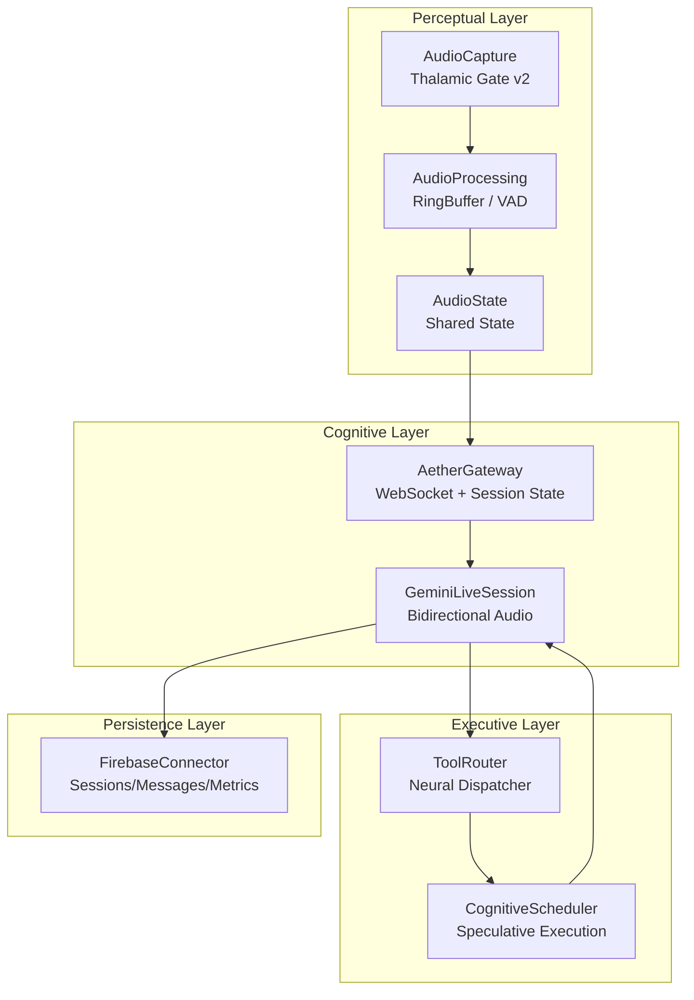
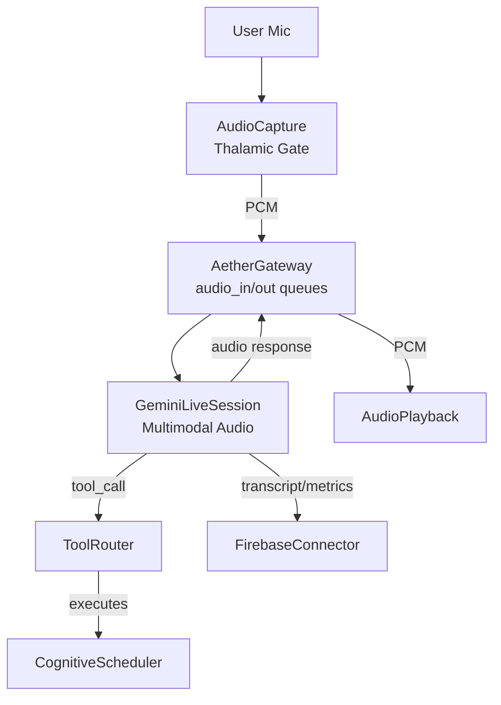
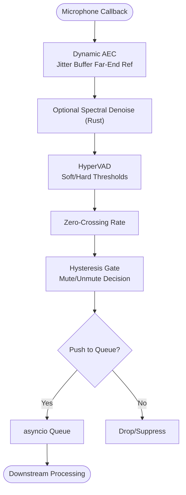
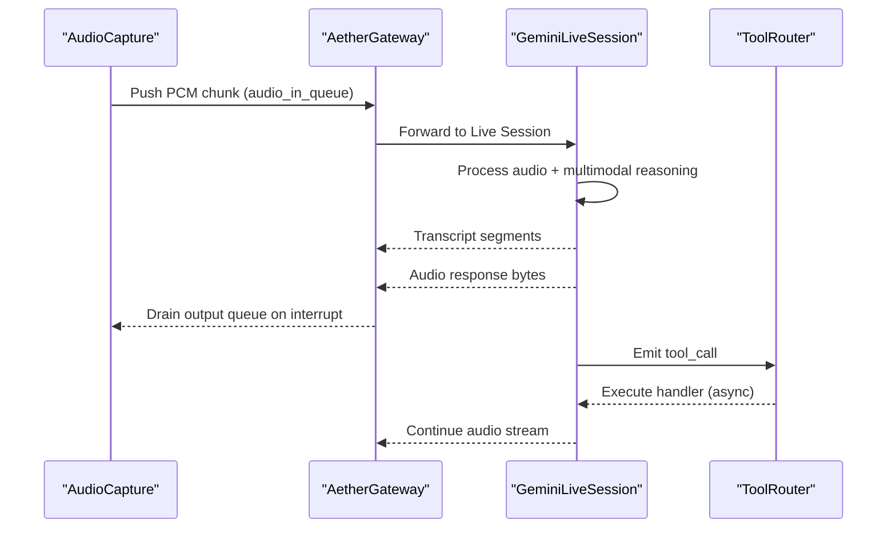
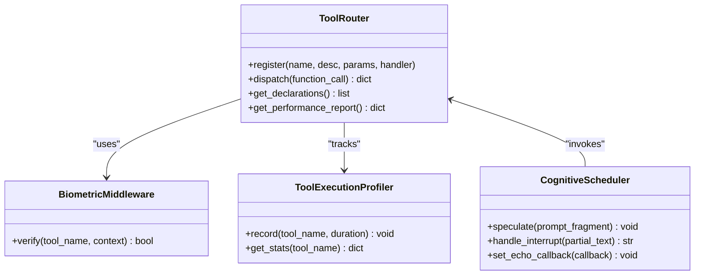
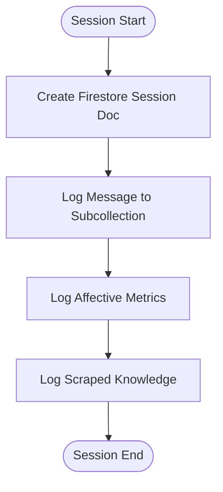
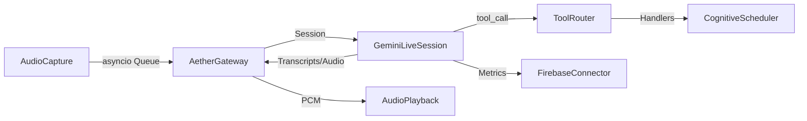

# Pipeline Architecture

<cite>
**Referenced Files in This Document**
- [README.md](file://README.md)
- [docs/architecture.md](file://docs/architecture.md)
- [core/engine.py](file://core/engine.py)
- [core/ai/session.py](file://core/ai/session.py)
- [core/ai/thalamic.py](file://core/ai/thalamic.py)
- [core/ai/scheduler.py](file://core/ai/scheduler.py)
- [core/infra/transport/gateway.py](file://core/infra/transport/gateway.py)
- [core/logic/managers/audio.py](file://core/logic/managers/audio.py)
- [core/audio/capture.py](file://core/audio/capture.py)
- [core/audio/processing.py](file://core/audio/processing.py)
- [core/audio/state.py](file://core/audio/state.py)
- [core/audio/playback.py](file://core/audio/playback.py)
- [core/tools/router.py](file://core/tools/router.py)
- [core/infra/cloud/firebase/interface.py](file://core/infra/cloud/firebase/interface.py)
- [cortex/src/cochlea.rs](file://cortex/src/cochlea.rs)
</cite>

## Table of Contents
1. [Introduction](#introduction)
2. [Project Structure](#project-structure)
3. [Core Components](#core-components)
4. [Architecture Overview](#architecture-overview)
5. [Detailed Component Analysis](#detailed-component-analysis)
6. [Dependency Analysis](#dependency-analysis)
7. [Performance Considerations](#performance-considerations)
8. [Troubleshooting Guide](#troubleshooting-guide)
9. [Conclusion](#conclusion)

## Introduction
This document explains Aether’s Single-Modal Unified Pipeline design centered on WhisperFlow 2.0. Instead of chaining separate STT → LLM → TTS components, Aether leverages Gemini 2.0 Multimodal Live to unify audio understanding, reasoning, and synthesis in a single neural context. The pipeline is organized into four layers:
- Perceptual Layer: Audio I/O and real-time preprocessing
- Cognitive Layer: Gemini Live session for multimodal audio reasoning
- Executive Layer: Tool routing and execution (ADK & Neural Dispatcher)
- Persistence Layer: Firebase/Aether for session memory and telemetry

The data flow begins at the microphone, traverses Thalamic Gate processing, real-time audio streaming to Gemini, tool execution, and response synthesis back to playback. The system targets sub-200 ms end-to-end latency using multithreading, structured concurrency, and zero-copy buffers.

## Project Structure
The pipeline spans multiple modules:
- Engine orchestration and lifecycle
- Audio capture, processing, and playback
- Gateway and session management
- Tool routing and execution
- Cognitive scheduling and proactive grounding
- Firebase persistence

**Diagram sources**
- [core/audio/capture.py](file://core/audio/capture.py#L193-L550)
- [core/audio/processing.py](file://core/audio/processing.py#L107-L202)
- [core/audio/state.py](file://core/audio/state.py#L36-L129)
- [core/infra/transport/gateway.py](file://core/infra/transport/gateway.py#L69-L153)
- [core/ai/session.py](file://core/ai/session.py#L43-L79)
- [core/tools/router.py](file://core/tools/router.py#L120-L360)
- [core/ai/scheduler.py](file://core/ai/scheduler.py#L10-L114)
- [core/infra/cloud/firebase/interface.py](file://core/infra/cloud/firebase/interface.py#L15-L259)

**Section sources**
- [README.md](file://README.md#L132-L161)
- [docs/architecture.md](file://docs/architecture.md#L1-L29)

## Core Components
- AetherEngine: Orchestrates managers, initializes subsystems, and runs tasks under structured concurrency.
- AudioCapture: Microphone capture with Thalamic Gate AEC, VAD, and zero-crossing-aware gating.
- AudioProcessing: RingBuffer, VAD, and zero-crossing utilities; Rust-accelerated when available.
- AudioState: Thread-safe singleton for shared audio state across threads.
- AetherGateway: WebSocket gateway owning session state, audio queues, and lifecycle.
- GeminiLiveSession: Bidirectional audio session with Gemini; handles transcripts and audio outputs.
- ToolRouter: Routes tool_calls to handlers, supports biometric middleware and performance profiling.
- CognitiveScheduler: Proactive grounding, temporal memory, and speculative tool pre-warming.
- FirebaseConnector: Cloud-native persistence for sessions, messages, and affective metrics.

**Section sources**
- [core/engine.py](file://core/engine.py#L26-L240)
- [core/logic/managers/audio.py](file://core/logic/managers/audio.py#L18-L98)
- [core/audio/capture.py](file://core/audio/capture.py#L193-L550)
- [core/audio/processing.py](file://core/audio/processing.py#L107-L202)
- [core/audio/state.py](file://core/audio/state.py#L36-L129)
- [core/infra/transport/gateway.py](file://core/infra/transport/gateway.py#L69-L153)
- [core/ai/session.py](file://core/ai/session.py#L43-L79)
- [core/tools/router.py](file://core/tools/router.py#L120-L360)
- [core/ai/scheduler.py](file://core/ai/scheduler.py#L10-L114)
- [core/infra/cloud/firebase/interface.py](file://core/infra/cloud/firebase/interface.py#L15-L259)

## Architecture Overview
The four-layer pipeline:
- Perceptual Layer: PyAudio capture, Thalamic Gate AEC, VAD, and zero-crossing detection; Rust-accelerated DSP where available.
- Cognitive Layer: WebSocket-based Gemini Live session for multimodal audio reasoning and synthesis.
- Executive Layer: ToolRouter dispatches function calls; CognitiveScheduler speculates and grounds actions.
- Persistence Layer: Firebase stores session metadata, chat logs, and affective telemetry.

**Diagram sources**
- [README.md](file://README.md#L132-L161)
- [core/audio/capture.py](file://core/audio/capture.py#L193-L550)
- [core/infra/transport/gateway.py](file://core/infra/transport/gateway.py#L69-L153)
- [core/ai/session.py](file://core/ai/session.py#L43-L79)
- [core/tools/router.py](file://core/tools/router.py#L120-L360)
- [core/ai/scheduler.py](file://core/ai/scheduler.py#L10-L114)
- [core/audio/playback.py](file://core/audio/playback.py#L113-L149)
- [core/infra/cloud/firebase/interface.py](file://core/infra/cloud/firebase/interface.py#L15-L259)

## Detailed Component Analysis

### Perceptual Layer: Audio I/O and Thalamic Gate
- AudioCapture runs a high-performance PyAudio callback, applying Dynamic AEC using a jitter buffer for the far-end reference, followed by optional Rust-accelerated spectral denoising. It computes VAD (soft/hard thresholds), zero-crossing rate, and classifies silence types. It pushes PCM chunks to the asyncio queue only when appropriate to reduce bandwidth and latency.
- AudioProcessing provides a RingBuffer for O(1) writes and zero-copy windowed reads, plus VAD utilities and zero-crossing detection. A Rust backend (aether-cortex) accelerates these operations when available.
- AudioState maintains thread-safe shared state including AEC metrics, RMS/ZCR, and playback flags with hysteresis to avoid rapid toggling.

**Diagram sources**
- [core/audio/capture.py](file://core/audio/capture.py#L304-L484)
- [core/audio/processing.py](file://core/audio/processing.py#L107-L202)
- [core/audio/state.py](file://core/audio/state.py#L36-L129)

**Section sources**
- [core/audio/capture.py](file://core/audio/capture.py#L193-L550)
- [core/audio/processing.py](file://core/audio/processing.py#L1-L508)
- [core/audio/state.py](file://core/audio/state.py#L1-L129)
- [cortex/src/cochlea.rs](file://cortex/src/cochlea.rs#L1-L212)

### Cognitive Layer: Gemini Live Session
- AetherGateway owns the session state and audio queues. It creates and manages a GeminiLiveSession, broadcasting engine state and handling interrupts. It also supports pre-warming sessions to reduce connection latency.
- GeminiLiveSession encapsulates the bidirectional audio WebSocket with Gemini. It extracts transcripts and audio outputs, enforces overflow protection on the output queue, and integrates with the scheduler for proactive prompts.

**Diagram sources**
- [core/infra/transport/gateway.py](file://core/infra/transport/gateway.py#L320-L507)
- [core/ai/session.py](file://core/ai/session.py#L43-L79)
- [core/ai/session.py](file://core/ai/session.py#L405-L429)
- [core/tools/router.py](file://core/tools/router.py#L234-L360)

**Section sources**
- [core/infra/transport/gateway.py](file://core/infra/transport/gateway.py#L69-L153)
- [core/ai/session.py](file://core/ai/session.py#L43-L79)
- [core/ai/session.py](file://core/ai/session.py#L405-L429)

### Executive Layer: ADK & Neural Dispatcher
- ToolRouter maps Gemini’s function_calls to registered handlers, enforcing biometric middleware for sensitive tools and recording performance metrics. It supports semantic recovery for unmatched tool names and wraps results with A2A metadata for interoperability.
- CognitiveScheduler speculates tool execution based on incoming cues, maintains temporal memory, and injects echo prompts to keep the user informed during long-running operations.

**Diagram sources**
- [core/tools/router.py](file://core/tools/router.py#L120-L360)
- [core/ai/scheduler.py](file://core/ai/scheduler.py#L10-L114)

**Section sources**
- [core/tools/router.py](file://core/tools/router.py#L1-L360)
- [core/ai/scheduler.py](file://core/ai/scheduler.py#L1-L114)

### Persistence Layer: Firebase/Aether
- FirebaseConnector provides cloud-native persistence for sessions, messages, and affective metrics. It initializes the Firestore client, starts and ends sessions, logs messages and metrics, and aggregates affective summaries for genetic optimization.

**Diagram sources**
- [core/infra/cloud/firebase/interface.py](file://core/infra/cloud/firebase/interface.py#L62-L203)

**Section sources**
- [core/infra/cloud/firebase/interface.py](file://core/infra/cloud/firebase/interface.py#L1-L259)

## Dependency Analysis
The pipeline exhibits loose coupling across layers with explicit queue-based communication and a central gateway controlling session state.

**Diagram sources**
- [core/audio/capture.py](file://core/audio/capture.py#L193-L550)
- [core/infra/transport/gateway.py](file://core/infra/transport/gateway.py#L69-L153)
- [core/ai/session.py](file://core/ai/session.py#L43-L79)
- [core/tools/router.py](file://core/tools/router.py#L120-L360)
- [core/ai/scheduler.py](file://core/ai/scheduler.py#L10-L114)
- [core/audio/playback.py](file://core/audio/playback.py#L113-L149)
- [core/infra/cloud/firebase/interface.py](file://core/infra/cloud/firebase/interface.py#L15-L259)

**Section sources**
- [core/engine.py](file://core/engine.py#L26-L240)
- [core/logic/managers/audio.py](file://core/logic/managers/audio.py#L18-L98)

## Performance Considerations
- Multithreading and zero-copy buffers:
  - PyAudio callbacks directly push to asyncio queues, minimizing thread hops.
  - RingBuffer and CochlearBuffer provide O(1) writes and zero-copy reads to avoid allocations in the hot path.
  - Rust-accelerated DSP (aether-cortex) reduces CPU overhead for VAD and zero-crossing.
- Structured concurrency:
  - Engine uses TaskGroup to coordinate subsystems, ensuring clean startup/shutdown.
  - Gateway uses TaskGroup to supervise session and lifecycle tasks.
- Backpressure and overflow control:
  - Output queue overflow protection drops oldest items to maintain bounded latency.
  - Jitter buffer stabilizes far-end reference for AEC convergence.
- Latency targets:
  - Sub-200 ms end-to-end achieved via Gemini 2.5 Flash Native Audio and minimized queueing.

**Section sources**
- [core/engine.py](file://core/engine.py#L212-L224)
- [core/infra/transport/gateway.py](file://core/infra/transport/gateway.py#L347-L351)
- [core/audio/processing.py](file://core/audio/processing.py#L107-L202)
- [cortex/src/cochlea.rs](file://cortex/src/cochlea.rs#L1-L212)
- [core/audio/capture.py](file://core/audio/capture.py#L273-L303)
- [README.md](file://README.md#L121-L127)

## Troubleshooting Guide
- Audio device errors:
  - AudioCapture raises a specific error when no default input device is found; ensure a valid microphone is selected.
- Session connectivity:
  - Gateway monitors health and transitions to error states on failures; verify network and credentials.
- Interrupt handling:
  - Gateway drains audio_out_queue and triggers interrupt callbacks; confirm playback interrupt logic is invoked.
- Tool execution:
  - ToolRouter records execution durations and returns standardized A2A responses; check profiler stats for slow tools.
- Firebase persistence:
  - FirebaseConnector logs warnings when offline; confirm credentials and network availability.

**Section sources**
- [core/audio/capture.py](file://core/audio/capture.py#L492-L498)
- [core/infra/transport/gateway.py](file://core/infra/transport/gateway.py#L358-L506)
- [core/ai/session.py](file://core/ai/session.py#L422-L429)
- [core/tools/router.py](file://core/tools/router.py#L310-L360)
- [core/infra/cloud/firebase/interface.py](file://core/infra/cloud/firebase/interface.py#L31-L61)

## Conclusion
Aether’s Single-Modal Unified Pipeline replaces traditional STT-LLM-TTS chaining with a seamless audio-first workflow powered by Gemini 2.0 Multimodal Live. The four-layer architecture—Perceptual, Cognitive, Executive, and Persistence—enforces modularity, concurrency, and resilience. Through multithreading, structured concurrency, and zero-copy buffers, the system achieves sub-200 ms latency while supporting proactive interventions, real-time tool execution, and cloud-backed persistence.