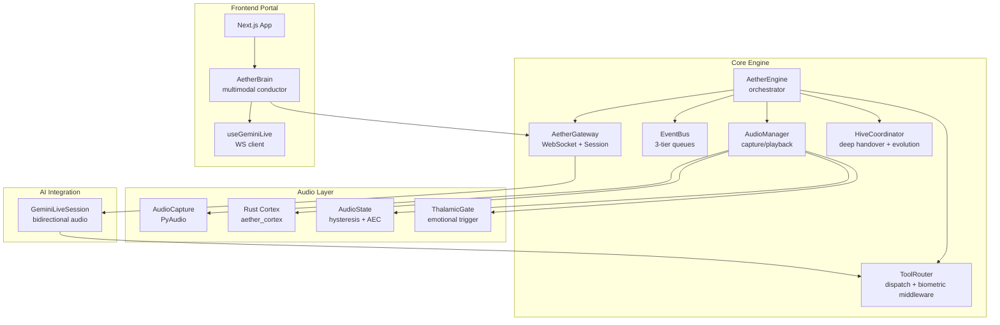
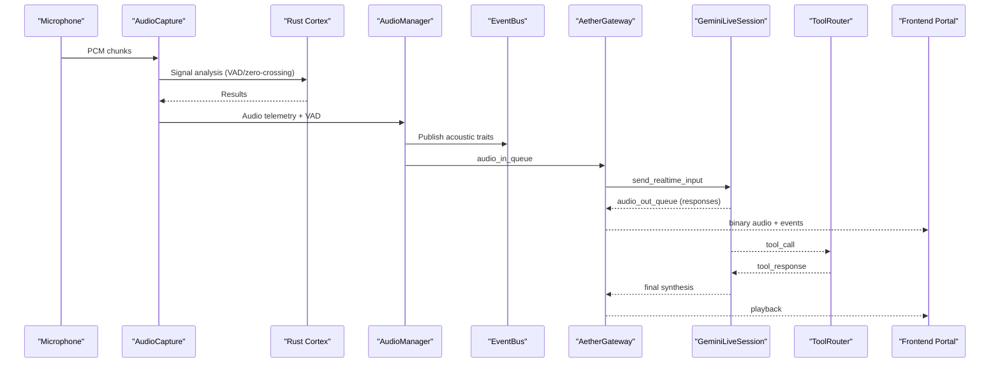
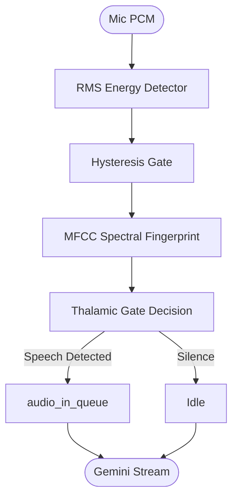
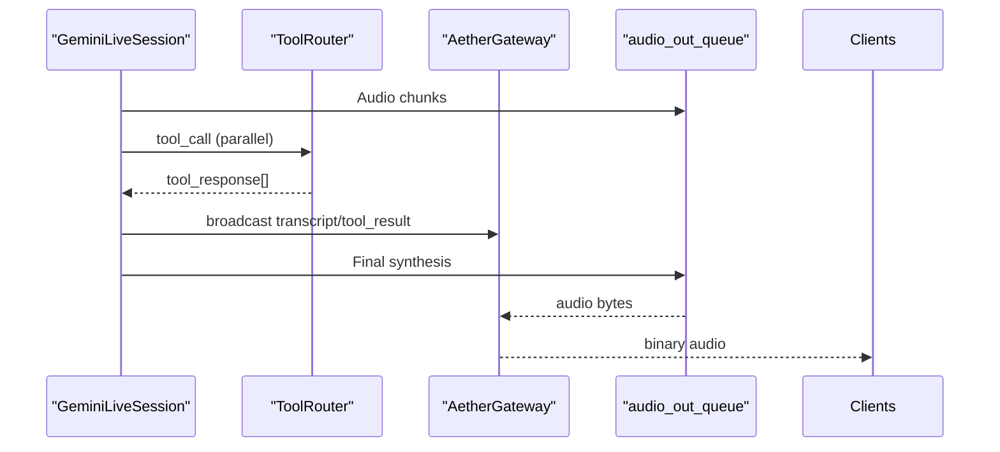
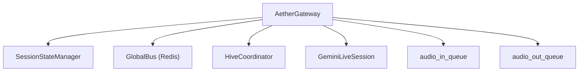
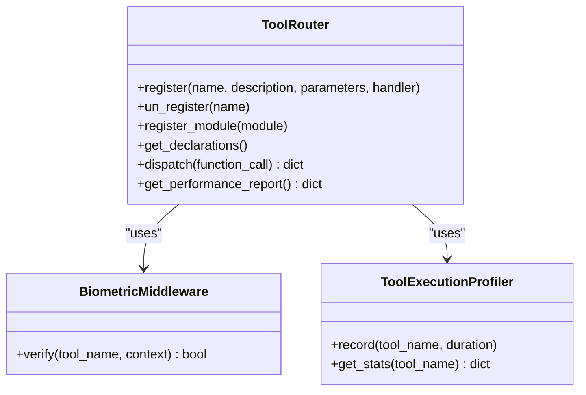
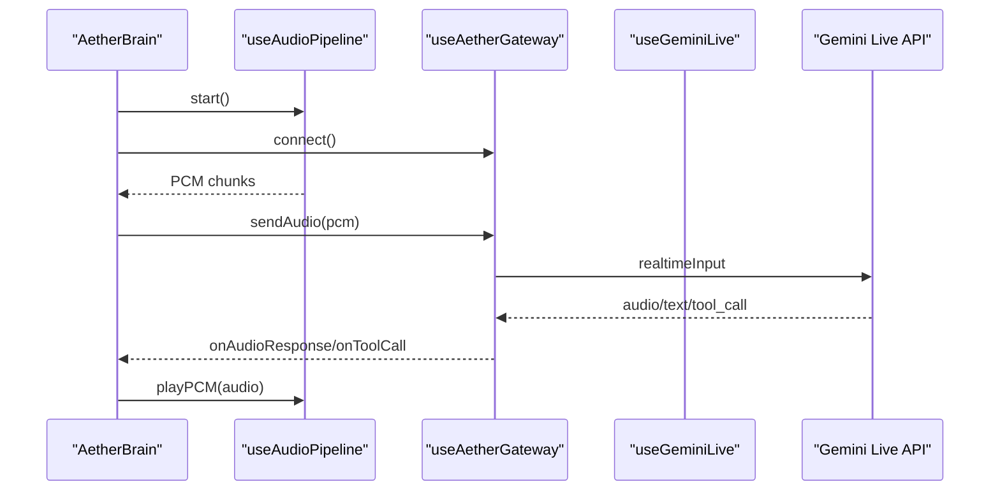
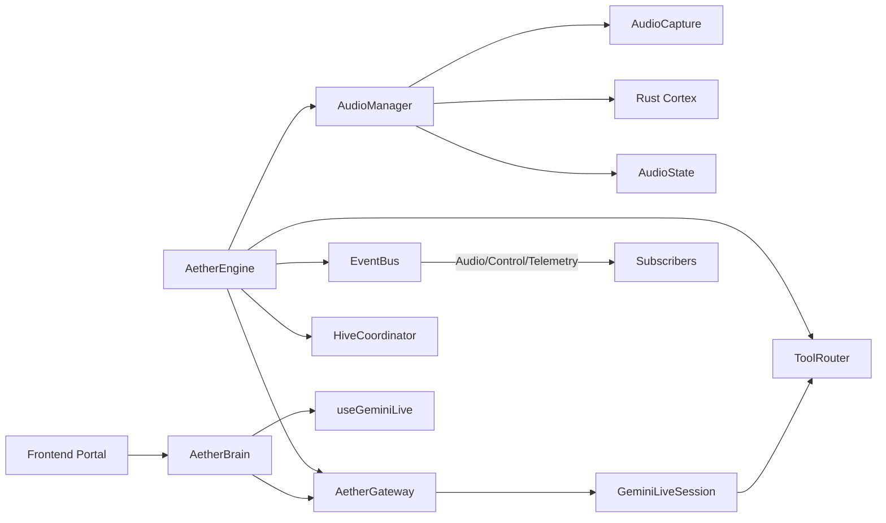

# System Architecture

<cite>
**Referenced Files in This Document**
- [README.md](file://README.md)
- [docs/architecture.md](file://docs/architecture.md)
- [core/server.py](file://core/server.py)
- [core/engine.py](file://core/engine.py)
- [core/audio/processing.py](file://core/audio/processing.py)
- [core/audio/state.py](file://core/audio/state.py)
- [core/ai/thalamic.py](file://core/ai/thalamic.py)
- [core/ai/session.py](file://core/ai/session.py)
- [core/tools/router.py](file://core/tools/router.py)
- [core/infra/event_bus.py](file://core/infra/event_bus.py)
- [core/infra/transport/gateway.py](file://core/infra/transport/gateway.py)
- [core/logic/managers/audio.py](file://core/logic/managers/audio.py)
- [core/ai/hive.py](file://core/ai/hive.py)
- [apps/portal/src/hooks/useGeminiLive.ts](file://apps/portal/src/hooks/useGeminiLive.ts)
- [apps/portal/src/components/AetherBrain.tsx](file://apps/portal/src/components/AetherBrain.tsx)
- [apps/portal/package.json](file://apps/portal/package.json)
- [cortex/src/lib.rs](file://cortex/src/lib.rs)
- [brain/personas/Skills.md](file://brain/personas/Skills.md)
</cite>

## Table of Contents
1. [Introduction](#introduction)
2. [Project Structure](#project-structure)
3. [Core Components](#core-components)
4. [Architecture Overview](#architecture-overview)
5. [Detailed Component Analysis](#detailed-component-analysis)
6. [Dependency Analysis](#dependency-analysis)
7. [Performance Considerations](#performance-considerations)
8. [Troubleshooting Guide](#troubleshooting-guide)
9. [Conclusion](#conclusion)
10. [Appendices](#appendices)

## Introduction
Aether Voice OS is a voice-native AI operating layer designed for real-time interaction with sub-200 ms latency. It integrates a Thalamic Gate Audio Layer, a Neural Switchboard Logic (Event-Driven Pipeline), and a Plugin System (Tool Router) to orchestrate multimodal audio processing, AI reasoning via Gemini Live, and a living voice portal frontend. The system emphasizes real-time responsiveness, acoustic self-awareness, proactive interventions, and seamless tool execution.

## Project Structure
The repository follows a monorepo layout with distinct areas:
- core: Backend engine, audio processing, AI orchestration, infrastructure, tools, and services
- apps/portal: Next.js frontend with React components and Tauri integration
- brain: Agent packages, personas, and skills hub
- cortex: Rust DSP library bridged to Python for zero-latency audio processing
- docs: Architecture and SDK documentation
- infra: Cloud and transport utilities
- tests: Benchmarks, integration, and unit tests



**Diagram sources**
- [core/engine.py](file://core/engine.py#L26-L110)
- [core/logic/managers/audio.py](file://core/logic/managers/audio.py#L18-L65)
- [core/infra/transport/gateway.py](file://core/infra/transport/gateway.py#L69-L153)
- [core/tools/router.py](file://core/tools/router.py#L120-L200)
- [core/ai/session.py](file://core/ai/session.py#L43-L100)
- [apps/portal/src/components/AetherBrain.tsx](file://apps/portal/src/components/AetherBrain.tsx#L35-L227)
- [apps/portal/src/hooks/useGeminiLive.ts](file://apps/portal/src/hooks/useGeminiLive.ts#L65-L228)

**Section sources**
- [README.md](file://README.md#L132-L160)
- [docs/architecture.md](file://docs/architecture.md#L1-L67)

## Core Components
- AetherEngine: High-level orchestrator initializing managers, event bus, gateway, audio, infrastructure, admin API, pulse, and cognitive scheduler.
- AudioManager: Coordinates capture, playback, VAD, and paralinguistic analysis; bridges affective telemetry to EventBus.
- AetherGateway: WebSocket gateway owning audio queues, managing session lifecycle, and broadcasting events to clients.
- GeminiLiveSession: Bidirectional audio session with Gemini Live, handling tool calls, barge-in, vision pulses, and multimodal context.
- ToolRouter: Central dispatcher for Gemini function calls with biometric middleware, performance profiling, and semantic recovery.
- EventBus: Three-tier event bus (Audio/Control/Telemetry) with expiration-aware routing and subscribers.
- ThalamicGate: Proactive intervention monitor using acoustic emotion indices to trigger help.
- Rust Cortex: High-performance DSP (VAD, zero-crossing, spectral denoise) bridged to Python.
- HiveCoordinator: Orchestrates expert souls, deep handover protocol, pre-warming, and rollback.

**Section sources**
- [core/engine.py](file://core/engine.py#L26-L110)
- [core/logic/managers/audio.py](file://core/logic/managers/audio.py#L18-L98)
- [core/infra/transport/gateway.py](file://core/infra/transport/gateway.py#L69-L153)
- [core/ai/session.py](file://core/ai/session.py#L43-L154)
- [core/tools/router.py](file://core/tools/router.py#L120-L200)
- [core/infra/event_bus.py](file://core/infra/event_bus.py#L69-L152)
- [core/ai/thalamic.py](file://core/ai/thalamic.py#L11-L40)
- [cortex/src/lib.rs](file://cortex/src/lib.rs#L28-L47)
- [core/ai/hive.py](file://core/ai/hive.py#L47-L124)

## Architecture Overview
Aether Voice OS employs:
- Pipeline Architecture: Staged processing through Thalamic Gate, Event Bus, and Neural Switchboard.
- Event-Driven Architecture: Typed events routed across three tiers with strict latency budgets.
- Plugin System: ToolRouter registers and dispatches function calls with biometric middleware and performance telemetry.



**Diagram sources**
- [core/audio/processing.py](file://core/audio/processing.py#L389-L434)
- [core/logic/managers/audio.py](file://core/logic/managers/audio.py#L51-L98)
- [core/infra/event_bus.py](file://core/infra/event_bus.py#L102-L152)
- [core/infra/transport/gateway.py](file://core/infra/transport/gateway.py#L320-L507)
- [core/ai/session.py](file://core/ai/session.py#L237-L478)
- [core/tools/router.py](file://core/tools/router.py#L234-L360)
- [apps/portal/src/components/AetherBrain.tsx](file://apps/portal/src/components/AetherBrain.tsx#L99-L156)

**Section sources**
- [docs/architecture.md](file://docs/architecture.md#L37-L67)
- [README.md](file://README.md#L142-L158)

## Detailed Component Analysis

### Thalamic Gate Audio Layer
The Thalamic Gate integrates RMS-based VAD with hysteresis and MFCC spectral fingerprinting to distinguish user speech from system audio, enabling acoustic self-awareness and preventing self-hearing loops.



**Diagram sources**
- [core/audio/processing.py](file://core/audio/processing.py#L389-L434)
- [core/audio/state.py](file://core/audio/state.py#L13-L34)
- [core/ai/thalamic.py](file://core/ai/thalamic.py#L11-L40)

**Section sources**
- [core/audio/processing.py](file://core/audio/processing.py#L389-L434)
- [core/audio/state.py](file://core/audio/state.py#L13-L34)
- [core/ai/thalamic.py](file://core/ai/thalamic.py#L11-L40)

### Neural Switchboard Logic
Neural Switchboard routes audio to Gemini Live, handles tool calls, and manages barge-in interrupts. It supports parallel tool execution, multimodal vision pulses, and proactive empathy triggers.



**Diagram sources**
- [core/ai/session.py](file://core/ai/session.py#L383-L603)
- [core/tools/router.py](file://core/tools/router.py#L234-L360)
- [core/infra/transport/gateway.py](file://core/infra/transport/gateway.py#L744-L800)

**Section sources**
- [core/ai/session.py](file://core/ai/session.py#L383-L603)
- [core/tools/router.py](file://core/tools/router.py#L234-L360)
- [core/infra/transport/gateway.py](file://core/infra/transport/gateway.py#L744-L800)

### Distributed Component Design
AetherGateway centralizes session ownership, audio queues, and client broadcasting. It coordinates with HiveCoordinator for expert selection and deep handover, and integrates with EventBus for observability.



**Diagram sources**
- [core/infra/transport/gateway.py](file://core/infra/transport/gateway.py#L69-L153)
- [core/ai/hive.py](file://core/ai/hive.py#L47-L124)

**Section sources**
- [core/infra/transport/gateway.py](file://core/infra/transport/gateway.py#L320-L507)
- [core/ai/hive.py](file://core/ai/hive.py#L181-L296)

### Plugin System (Tool Router)
The ToolRouter registers tools with metadata, enforces biometric middleware for sensitive tools, profiles execution latency, and recovers unmatched tools via semantic search.



**Diagram sources**
- [core/tools/router.py](file://core/tools/router.py#L120-L200)
- [core/tools/router.py](file://core/tools/router.py#L46-L85)
- [core/tools/router.py](file://core/tools/router.py#L87-L118)

**Section sources**
- [core/tools/router.py](file://core/tools/router.py#L120-L200)
- [core/tools/router.py](file://core/tools/router.py#L234-L360)

### Frontend Portal Integration
The frontend uses a WebSocket client to connect to Gemini Live, streams audio and vision frames, and displays transcripts and tool results. AetherBrain wires capture, VAD gating, playback, and emotion-triggered vision pulses.



**Diagram sources**
- [apps/portal/src/components/AetherBrain.tsx](file://apps/portal/src/components/AetherBrain.tsx#L52-L227)
- [apps/portal/src/hooks/useGeminiLive.ts](file://apps/portal/src/hooks/useGeminiLive.ts#L90-L228)
- [apps/portal/package.json](file://apps/portal/package.json#L16-L34)

**Section sources**
- [apps/portal/src/components/AetherBrain.tsx](file://apps/portal/src/components/AetherBrain.tsx#L35-L227)
- [apps/portal/src/hooks/useGeminiLive.ts](file://apps/portal/src/hooks/useGeminiLive.ts#L65-L228)
- [apps/portal/package.json](file://apps/portal/package.json#L16-L34)

## Dependency Analysis
Key dependencies and relationships:
- Engine depends on Gateway, EventBus, ToolRouter, HiveCoordinator, and AudioManager.
- AudioManager depends on AudioCapture, ParalinguisticAnalyzer, AudioPlayback, and VAD engines.
- Gateway owns audio queues and manages GeminiLiveSession lifecycle.
- EventBus decouples components via typed events and three-tier queues.
- Rust Cortex provides high-performance DSP primitives bridged to Python.
- Frontend Portal communicates via WebSocket and uses Gemini Live client hooks.



**Diagram sources**
- [core/engine.py](file://core/engine.py#L26-L110)
- [core/logic/managers/audio.py](file://core/logic/managers/audio.py#L18-L65)
- [core/infra/transport/gateway.py](file://core/infra/transport/gateway.py#L69-L153)
- [core/ai/session.py](file://core/ai/session.py#L43-L100)
- [core/infra/event_bus.py](file://core/infra/event_bus.py#L69-L152)
- [cortex/src/lib.rs](file://cortex/src/lib.rs#L28-L47)
- [apps/portal/src/components/AetherBrain.tsx](file://apps/portal/src/components/AetherBrain.tsx#L35-L227)
- [apps/portal/src/hooks/useGeminiLive.ts](file://apps/portal/src/hooks/useGeminiLive.ts#L65-L228)

**Section sources**
- [core/engine.py](file://core/engine.py#L26-L110)
- [core/infra/event_bus.py](file://core/infra/event_bus.py#L69-L152)
- [cortex/src/lib.rs](file://cortex/src/lib.rs#L28-L47)

## Performance Considerations
- Multithreading and structured concurrency prevent GIL blocking and ensure graceful shutdown.
- Zero-copy buffers and Rust-backed DSP minimize latency and CPU overhead.
- Adaptive VAD and hysteresis reduce false positives and UI churn.
- Parallel tool execution and speculative pre-warming reduce session-switch latency.
- Event bus tiers enforce latency budgets and drop expired events to maintain responsiveness.

[No sources needed since this section provides general guidance]

## Troubleshooting Guide
Common issues and remedies:
- Missing API keys or dependencies: The server entry point validates environment and dependencies before launching the engine.
- Audio device configuration: Adjust input device index and verify PyAudio compilation for optimal performance.
- Frontend visualizer FPS: Reduce FPS to lower CPU usage when experiencing high load.
- Firebase connectivity: The system degrades gracefully if persistent memory is unavailable.

**Section sources**
- [core/server.py](file://core/server.py#L62-L120)
- [README.md](file://README.md#L244-L249)

## Conclusion
Aether Voice OS delivers a real-time, multimodal voice interface through a cohesive architecture: Thalamic Gate Audio Layer for acoustic self-awareness, Neural Switchboard Logic for event-driven orchestration, and a Plugin System for extensible tooling. The backend-engine/frontend-portal boundary is cleanly separated via a WebSocket gateway, enabling scalable expert handoffs, proactive interventions, and seamless tool execution.

[No sources needed since this section summarizes without analyzing specific files]

## Appendices

### System Context Diagram
```mermaid
graph TB
subgraph "User"
SPEAKER["Speaker"]
MIC["Microphone"]
end
subgraph "Frontend"
PORTAL["Portal UI"]
BRAIN["AetherBrain"]
WS["useGeminiLive"]
end
subgraph "Backend"
ENGINE["AetherEngine"]
GW["AetherGateway"]
EB["EventBus"]
HIVE["HiveCoordinator"]
DSP["Rust Cortex"]
AM["AudioManager"]
GEMINI["GeminiLiveSession"]
TR["ToolRouter"]
end
subgraph "Infrastructure"
FIREBASE["Firebase"]
REDIS["Redis Bus"]
end
MIC --> AM
AM --> DSP
AM --> GW
GW --> GEMINI
GEMINI --> TR
TR --> GEMINI
GEMINI --> GW
GW --> PORTAL
PORTAL --> BRAIN
BRAIN --> WS
BRAIN --> GW
GW --> EB
GW --> HIVE
HIVE --> FIREBASE
GW --> REDIS
SPEAKER <-- GW <-- GEMINI
```

**Diagram sources**
- [core/engine.py](file://core/engine.py#L26-L110)
- [core/infra/transport/gateway.py](file://core/infra/transport/gateway.py#L69-L153)
- [core/ai/session.py](file://core/ai/session.py#L43-L154)
- [core/tools/router.py](file://core/tools/router.py#L120-L200)
- [apps/portal/src/components/AetherBrain.tsx](file://apps/portal/src/components/AetherBrain.tsx#L35-L227)
- [apps/portal/src/hooks/useGeminiLive.ts](file://apps/portal/src/hooks/useGeminiLive.ts#L65-L228)

### Technology Stack Choices
- Backend: Python with asyncio, websockets, NumPy, and PyAudio; Rust for DSP via PyO3.
- Frontend: Next.js, React, Tailwind CSS, and Tauri for desktop builds.
- AI: Gemini Live Native Audio for unified audio understanding and synthesis.
- Infrastructure: Redis for global bus, Firebase for persistence and telemetry.

**Section sources**
- [apps/portal/package.json](file://apps/portal/package.json#L16-L34)
- [README.md](file://README.md#L21-L24)

### Scalability Considerations
- Horizontal scaling: AetherGateway and HiveCoordinator enable expert handoffs and pre-warming to mitigate cold starts.
- Event-driven decoupling: EventBus tiers isolate hot-path audio from telemetry, improving throughput.
- Lightweight DSP: Rust Cortex reduces CPU usage and enables efficient resource-constrained deployments.

**Section sources**
- [core/infra/transport/gateway.py](file://core/infra/transport/gateway.py#L277-L319)
- [core/ai/hive.py](file://core/ai/hive.py#L177-L283)
- [core/infra/event_bus.py](file://core/infra/event_bus.py#L69-L152)

### Skills and Agent Packages
- Skills are packaged as .ath (Aether Pack) with manifests and capabilities.
- Registry and DNA handling support agent evolution and context preservation during handoffs.

**Section sources**
- [brain/personas/Skills.md](file://brain/personas/Skills.md#L1-L20)
- [core/ai/hive.py](file://core/ai/hive.py#L125-L142)