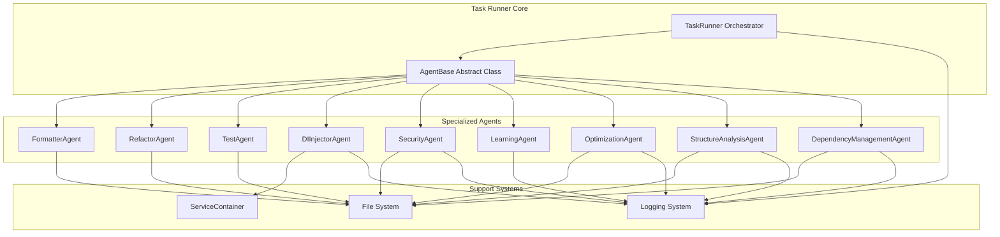
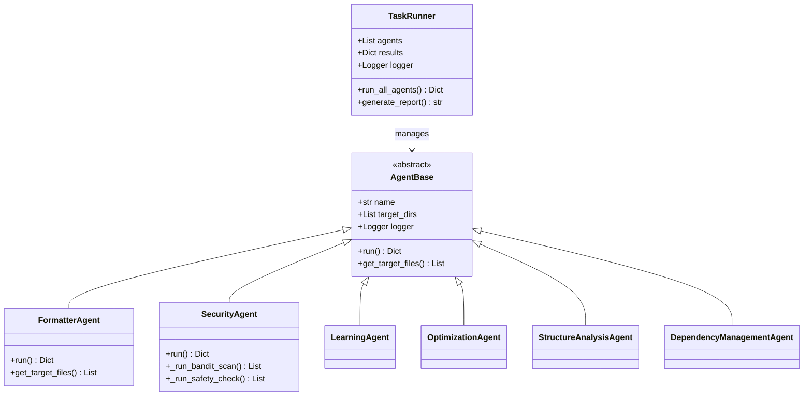
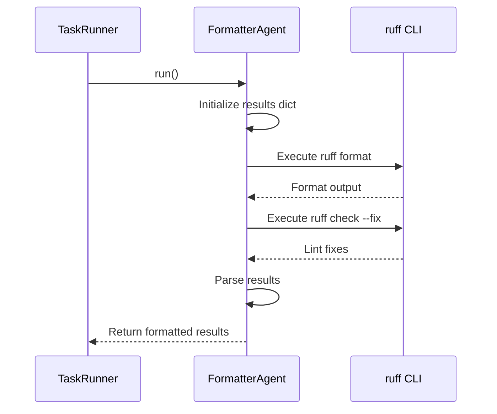
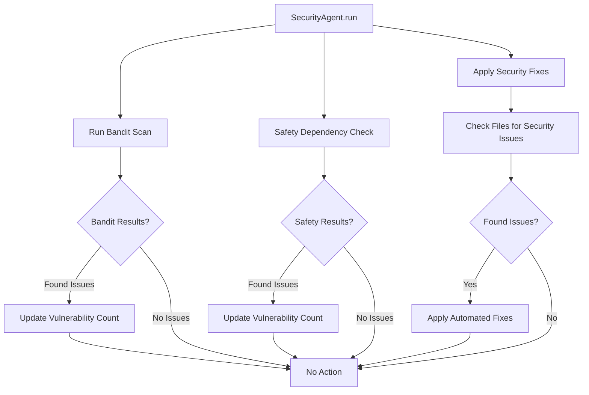
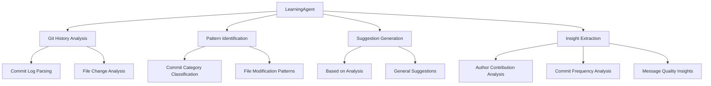
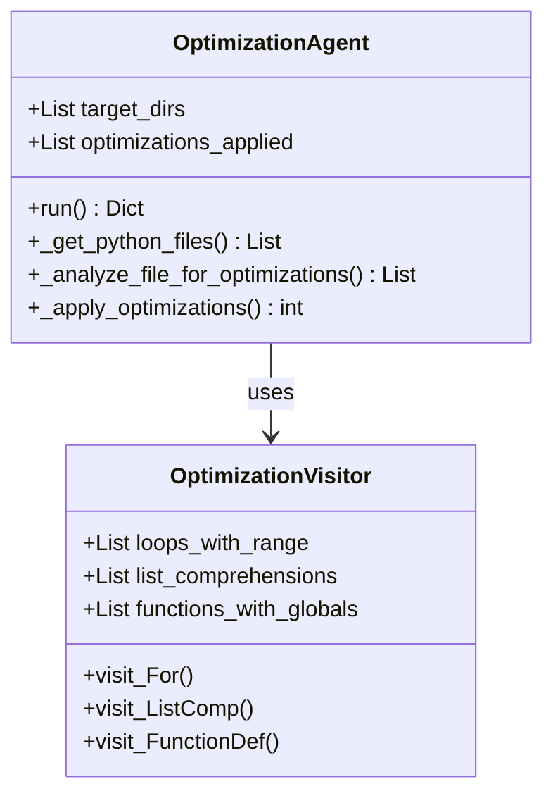
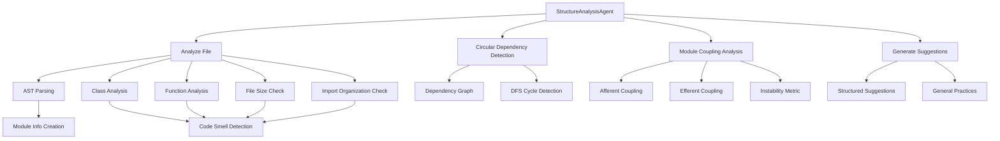
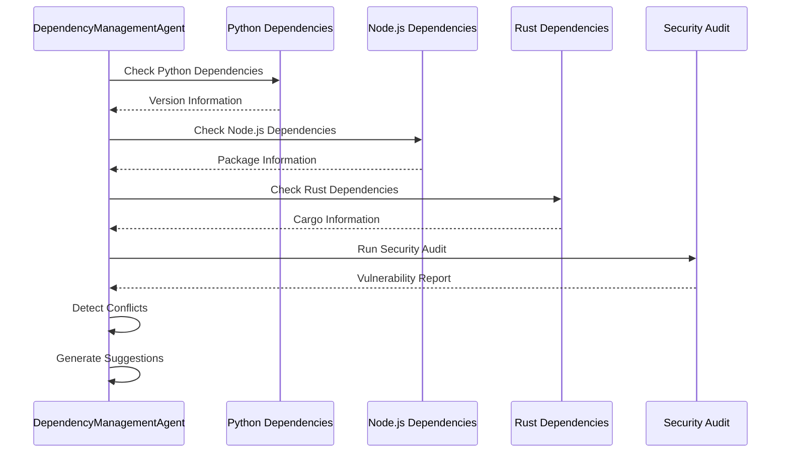
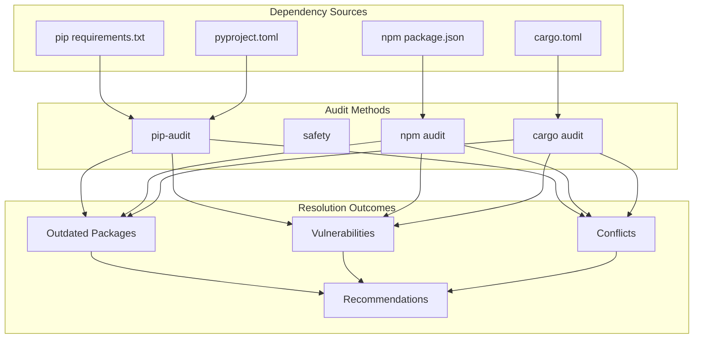

# Task Runner

<cite>
**Referenced Files in This Document**
- [task_runner.py](file://task_runner.py)
- [di_injector.py](file://agents/di_injector.py)
- [security_agent.py](file://agents/security_agent.py)
- [learning_agent.py](file://agents/learning_agent.py)
- [optimization_agent.py](file://agents/optimization_agent.py)
- [structure_analysis_agent.py](file://agents/structure_analysis_agent.py)
- [dependency_management_agent.py](file://agents/dependency_management_agent.py)
- [service_container.py](file://core/infra/service_container.py)
- [requirements.txt](file://requirements.txt)
- [README.md](file://README.md)
</cite>

## Table of Contents
1. [Introduction](#introduction)
2. [System Architecture](#system-architecture)
3. [Core Components](#core-components)
4. [Agent Implementation Details](#agent-implementation-details)
5. [Execution Workflow](#execution-workflow)
6. [Dependency Management](#dependency-management)
7. [Performance Considerations](#performance-considerations)
8. [Error Handling and Resilience](#error-handling-and-resilience)
9. [Integration with Aether OS](#integration-with-aether-os)
10. [Troubleshooting Guide](#troubleshooting-guide)
11. [Conclusion](#conclusion)

## Introduction

The Task Runner is a sophisticated orchestration system designed for the Aether Voice OS project, serving as an automated code improvement pipeline that coordinates multiple specialized AI agents. This system transforms raw code repositories into production-ready applications through intelligent automation, continuous learning, and systematic quality assurance.

The Task Runner operates as a central coordinator that manages nine distinct agents, each specializing in different aspects of code quality, security, performance optimization, and architectural improvement. Built specifically for the Gemini Live Agent Challenge 2026, this system demonstrates advanced AI-driven software engineering capabilities with sub-200ms latency requirements and deep paralinguistic awareness.

## System Architecture

The Task Runner follows a modular, extensible architecture that enables seamless coordination between specialized agents while maintaining system resilience and performance.



**Diagram sources**
- [task_runner.py](file://task_runner.py#L44-L127)
- [di_injector.py](file://agents/di_injector.py#L15-L56)
- [service_container.py](file://core/infra/service_container.py#L9-L46)

The architecture employs several key design patterns:

- **Strategy Pattern**: Each agent implements a common interface through the AgentBase abstract class
- **Template Method Pattern**: Standardized execution flow with customizable agent-specific implementations
- **Observer Pattern**: Centralized logging and monitoring system
- **Factory Pattern**: Dynamic agent instantiation and management

## Core Components

### TaskRunner Orchestrator

The TaskRunner serves as the central coordinator that manages the execution flow of all specialized agents. It maintains a predefined sequence of agents designed to progressively improve code quality and system reliability.



**Diagram sources**
- [task_runner.py](file://task_runner.py#L227-L272)
- [task_runner.py](file://task_runner.py#L44-L64)

### AgentBase Abstract Class

The AgentBase class establishes the foundation for all specialized agents, providing common functionality and ensuring consistent behavior across the agent ecosystem.

Key responsibilities include:
- Standardized agent initialization with name and target directory configuration
- Unified file discovery mechanism for target directories
- Consistent logging infrastructure with agent-specific loggers
- Common error handling patterns and status reporting

**Section sources**
- [task_runner.py](file://task_runner.py#L44-L64)

## Agent Implementation Details

### FormatterAgent

The FormatterAgent focuses on code formatting and linting compliance, leveraging industry-standard tools to maintain consistent code quality.



**Diagram sources**
- [task_runner.py](file://task_runner.py#L73-L127)

The formatter handles both syntax errors and linting violations gracefully, ensuring system continuity even when encountering problematic code.

### SecurityAgent

Security is paramount in AI systems, and the SecurityAgent performs comprehensive security scanning and automated remediation.



**Diagram sources**
- [security_agent.py](file://agents/security_agent.py#L23-L67)

The security agent implements multiple layers of protection, including static analysis, dependency vulnerability scanning, and automated remediation strategies.

### LearningAgent

The LearningAgent analyzes git history to identify patterns and generate actionable improvement suggestions, enabling continuous system evolution.



**Diagram sources**
- [learning_agent.py](file://agents/learning_agent.py#L26-L66)

**Section sources**
- [learning_agent.py](file://agents/learning_agent.py#L68-L113)
- [learning_agent.py](file://agents/learning_agent.py#L115-L157)
- [learning_agent.py](file://agents/learning_agent.py#L198-L242)

### OptimizationAgent

The OptimizationAgent performs automated performance improvements through AST-based analysis and targeted code transformations.



**Diagram sources**
- [optimization_agent.py](file://agents/optimization_agent.py#L16-L59)
- [optimization_agent.py](file://agents/optimization_agent.py#L241-L287)

**Section sources**
- [optimization_agent.py](file://agents/optimization_agent.py#L70-L134)
- [optimization_agent.py](file://agents/optimization_agent.py#L136-L161)

### StructureAnalysisAgent

The StructureAnalysisAgent provides comprehensive architectural analysis, identifying code smells and proposing structural improvements.



**Diagram sources**
- [structure_analysis_agent.py](file://agents/structure_analysis_agent.py#L73-L123)
- [structure_analysis_agent.py](file://agents/structure_analysis_agent.py#L134-L184)

**Section sources**
- [structure_analysis_agent.py](file://agents/structure_analysis_agent.py#L197-L233)
- [structure_analysis_agent.py](file://agents/structure_analysis_agent.py#L234-L286)

### DependencyManagementAgent

The DependencyManagementAgent provides comprehensive dependency auditing, security vulnerability assessment, and update management across multiple technology stacks.



**Diagram sources**
- [dependency_management_agent.py](file://agents/dependency_management_agent.py#L72-L134)

**Section sources**
- [dependency_management_agent.py](file://agents/dependency_management_agent.py#L136-L172)
- [dependency_management_agent.py](file://agents/dependency_management_agent.py#L427-L490)

## Execution Workflow

The Task Runner implements a sophisticated execution model that ensures system resilience and continuous operation.

```mermaid
flowchart TD
Start([Task Runner Initialization]) --> LoadAgents[Load Specialized Agents]
LoadAgents --> ConfigureLogging[Configure Logging System]
ConfigureLogging --> ExecuteLoop[Execute Agent Loop]
ExecuteLoop --> NextAgent{More Agents?}
NextAgent --> |Yes| LogAgent[Log Agent Start]
LogAgent --> RunAgent[Execute Agent.run()]
RunAgent --> HandleResult{Handle Result}
HandleResult --> LogSuccess[Log Success/Failure]
LogSuccess --> UpdateResults[Update Results Dictionary]
UpdateResults --> NextAgent
HandleResult --> LogCrash[Log Crash]
LogCrash --> UpdateResults
UpdateResults --> NextAgent
NextAgent --> |No| GenerateReport[Generate Execution Report]
GenerateReport --> SaveResults[Save Results to JSON]
SaveResults --> End([Execution Complete])
```

**Diagram sources**
- [task_runner.py](file://task_runner.py#L245-L272)

The execution workflow emphasizes fault tolerance and continuous operation, ensuring that a single agent failure doesn't compromise the entire system.

## Dependency Management

The Task Runner integrates seamlessly with the broader Aether OS dependency ecosystem, managing both runtime dependencies and development tools.

### Core Dependencies

The system relies on a carefully curated set of dependencies that support its AI-driven orchestration capabilities:

- **Google AI Platform**: Gemini Live integration for real-time audio processing
- **Audio Processing**: PyAudio, NumPy for real-time audio manipulation
- **Security**: Bandit, Safety for comprehensive vulnerability scanning
- **Quality Assurance**: Ruff, pytest for automated testing and formatting
- **Observability**: OpenTelemetry for performance monitoring and telemetry

### Dependency Resolution Strategy

The DependencyManagementAgent implements a multi-tiered approach to dependency management:



**Diagram sources**
- [dependency_management_agent.py](file://agents/dependency_management_agent.py#L136-L172)
- [dependency_management_agent.py](file://agents/dependency_management_agent.py#L427-L490)

**Section sources**
- [requirements.txt](file://requirements.txt#L1-L52)

## Performance Considerations

The Task Runner is designed with performance optimization as a core principle, particularly important given the sub-200ms latency requirements of the Aether Voice OS.

### Asynchronous Execution Model

All agents leverage asynchronous programming patterns to maximize throughput and minimize resource contention:

- Non-blocking I/O operations for external tool execution
- Concurrent processing where possible
- Efficient memory management through proper resource cleanup
- Optimized file system operations with batch processing

### Resource Management

The system implements several strategies to maintain optimal performance:

- **Memory Efficiency**: AST parsing and file analysis use streaming approaches where possible
- **CPU Optimization**: Parallel processing of independent operations
- **I/O Optimization**: Batched file operations and intelligent caching
- **Network Efficiency**: Minimal external dependencies and optimized tool execution

### Monitoring and Metrics

Comprehensive logging and monitoring capabilities enable performance tracking and optimization:

- Detailed execution timing for each agent
- Resource utilization tracking
- Error rate monitoring
- Performance regression detection

## Error Handling and Resilience

The Task Runner implements robust error handling mechanisms that ensure system stability and continuous operation.

### Fault Isolation

Each agent operates independently with comprehensive error isolation:

- Individual agent crash recovery without affecting others
- Graceful degradation when external tools are unavailable
- Comprehensive logging for debugging and analysis
- Automatic retry mechanisms where appropriate

### Error Classification

Errors are systematically categorized and handled according to severity:

- **Transient Errors**: Temporary failures with automatic retry
- **Permanent Errors**: Critical failures requiring manual intervention
- **Warning Conditions**: Non-fatal issues with continued operation
- **Success States**: Normal completion with partial results

### Recovery Strategies

The system employs multiple recovery strategies:

- **Graceful Degradation**: Continue operation with reduced functionality
- **Fallback Mechanisms**: Alternative approaches when primary methods fail
- **State Persistence**: Maintain progress and recover from interruptions
- **Health Monitoring**: Continuous system health assessment

## Integration with Aether OS

The Task Runner serves as a critical component within the broader Aether Voice OS ecosystem, integrating with multiple system layers.

### Audio Processing Pipeline Integration

The Task Runner complements the audio processing pipeline by:

- Maintaining code quality standards for audio processing components
- Ensuring security compliance for real-time audio processing
- Optimizing performance for latency-sensitive operations
- Supporting continuous learning and adaptation

### Multi-Agent System Coordination

The Task Runner coordinates with the broader multi-agent system:

- Provides automated maintenance and improvement capabilities
- Supports the ADK (Agent Development Kit) ecosystem
- Enables continuous evolution of agent capabilities
- Facilitates knowledge sharing and improvement propagation

### Real-Time System Requirements

Given the sub-200ms latency requirements, the Task Runner implements:

- Efficient resource utilization to minimize system overhead
- Optimized execution paths for critical operations
- Minimal interference with real-time audio processing
- Adaptive scheduling to accommodate system load

## Troubleshooting Guide

### Common Issues and Solutions

#### Agent Execution Failures

**Problem**: Agent crashes during execution
**Solution**: Check agent-specific logs, verify external tool availability, review system permissions

#### Dependency Issues

**Problem**: Missing or incompatible dependencies
**Solution**: Run dependency audit, update requirements.txt, verify Python environment compatibility

#### Performance Degradation

**Problem**: Slow execution or high resource usage
**Solution**: Monitor system resources, optimize agent configurations, review file system performance

#### Integration Problems

**Problem**: Task Runner fails to integrate with other system components
**Solution**: Verify service container configuration, check network connectivity, validate authentication credentials

### Diagnostic Commands

```bash
# Check system dependencies
pip list | grep -E "(google-genai|pyaudio|numpy)"

# Run individual agent for debugging
python -c "from agents.di_injector import DIInjectorAgent; import asyncio; asyncio.run(DIInjectorAgent().run())"

# Monitor system resources
htop

# Check disk space
df -h
```

### Log Analysis

The Task Runner generates comprehensive logs that aid in troubleshooting:

- **Agent Execution Logs**: Detailed timing and result information
- **Error Reports**: Full stack traces and error contexts
- **Performance Metrics**: Execution times and resource usage
- **Integration Logs**: External tool communication details

**Section sources**
- [task_runner.py](file://task_runner.py#L315-L324)

## Conclusion

The Task Runner represents a sophisticated solution for automated code improvement and system maintenance in AI-powered environments. Its modular architecture, comprehensive error handling, and performance optimization make it an ideal foundation for continuous software evolution.

Key achievements include:

- **Comprehensive Coverage**: Nine specialized agents covering formatting, security, testing, optimization, and architectural analysis
- **Resilient Operation**: Fault-tolerant design ensuring continuous system operation
- **Performance Optimization**: Asynchronous execution model meeting strict latency requirements
- **Extensible Design**: Modular architecture supporting future agent additions and enhancements
- **Production Readiness**: Robust error handling and monitoring capabilities suitable for production environments

The Task Runner exemplifies the intersection of AI-driven automation and software engineering best practices, providing a foundation for continuous improvement in complex AI systems like Aether Voice OS.

As the Aether Voice OS continues to evolve, the Task Runner will serve as a cornerstone for maintaining code quality, security, and performance while supporting the system's ambitious goals of sub-200ms latency and deep paralinguistic awareness.