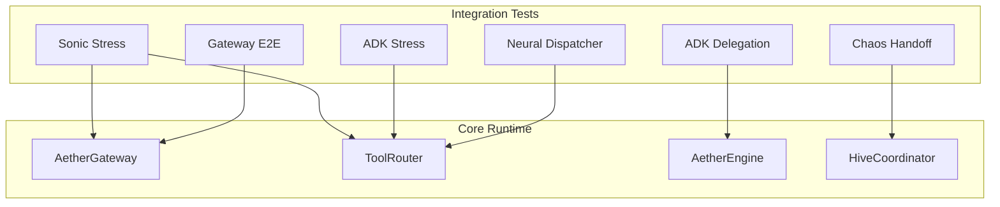
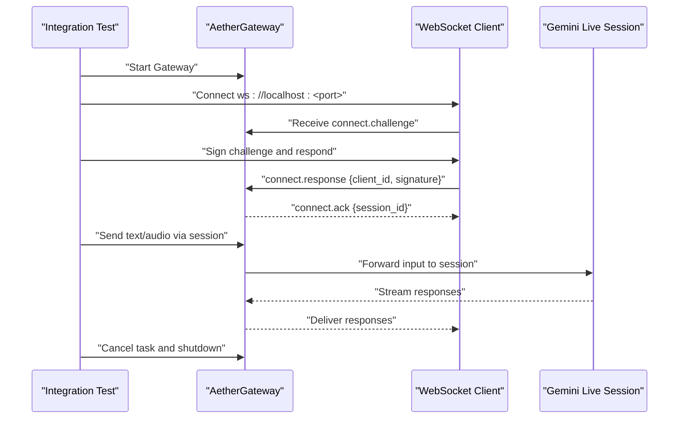
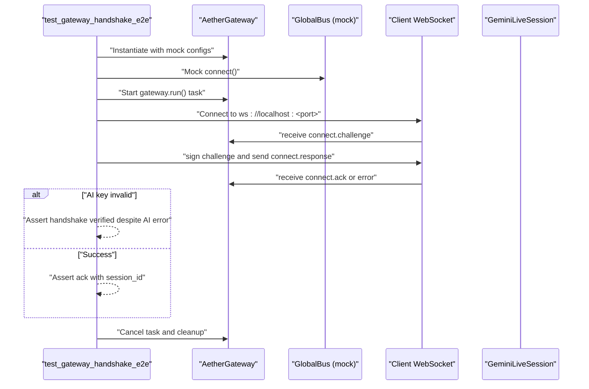
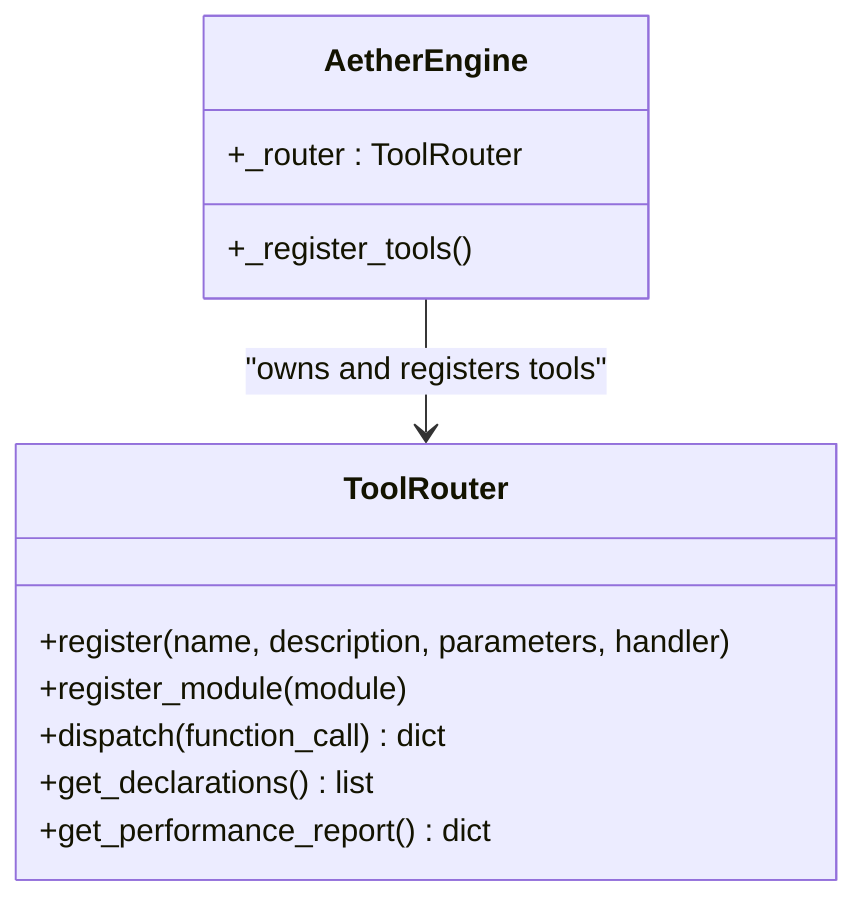
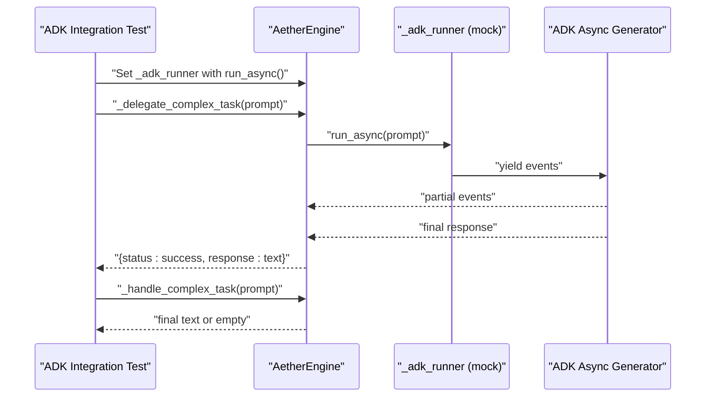
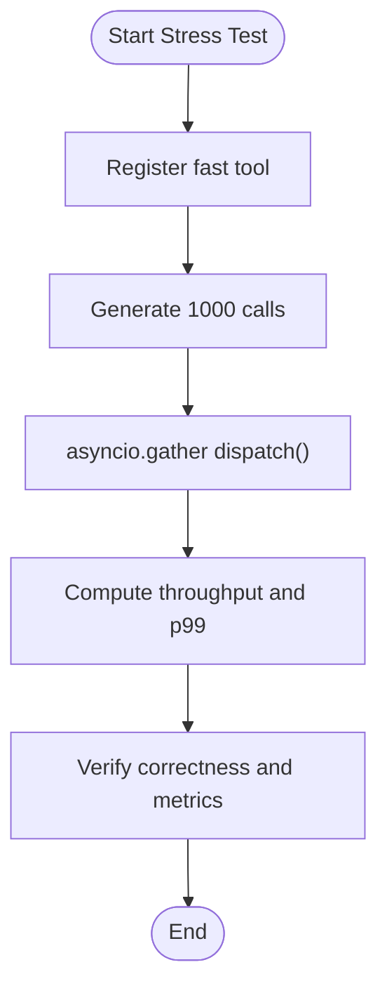
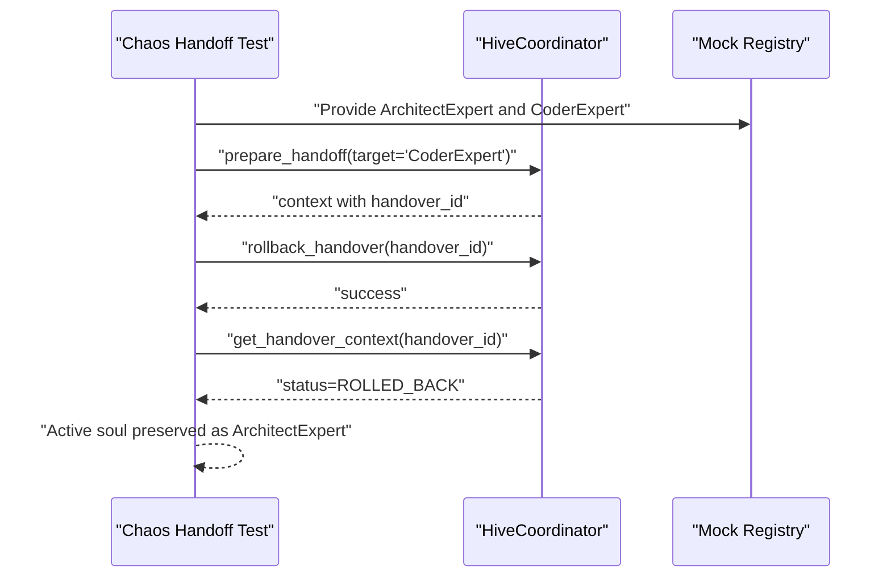
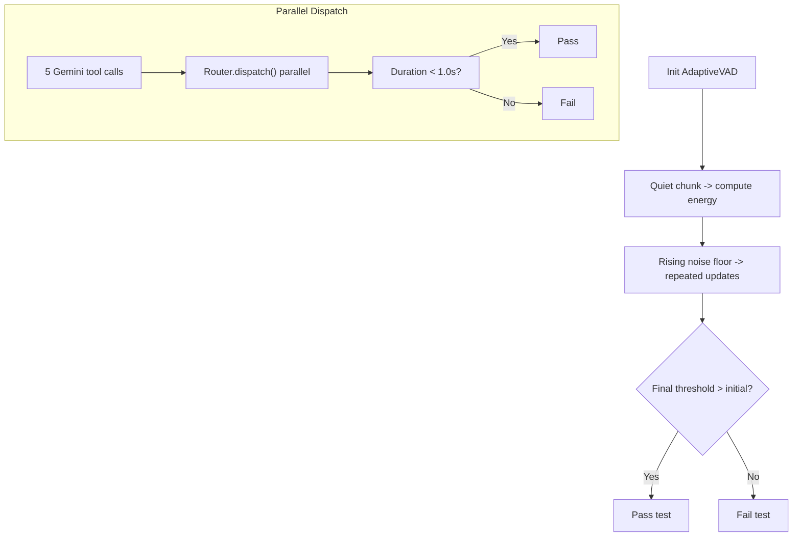
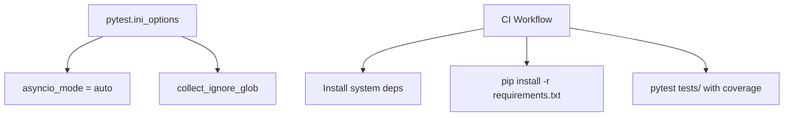
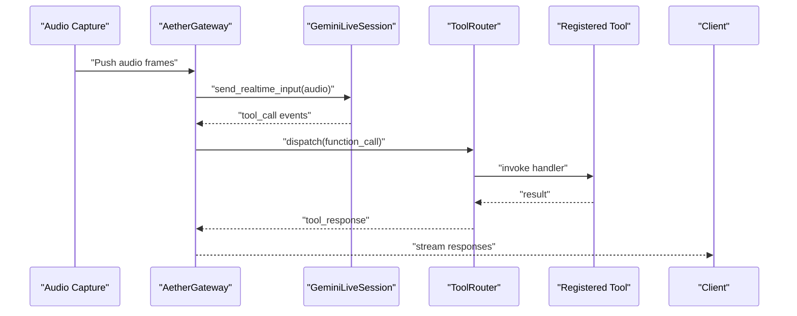

# Integration Testing

<cite>
**Referenced Files in This Document**
- [tests/integration/test_gateway_e2e.py](file://tests/integration/test_gateway_e2e.py)
- [tests/integration/test_neural_dispatcher.py](file://tests/integration/test_neural_dispatcher.py)
- [tests/integration/test_adk_delegation.py](file://tests/integration/test_adk_delegation.py)
- [tests/integration/test_adk_stress.py](file://tests/integration/test_adk_stress.py)
- [tests/integration/test_chaos_handoff.py](file://tests/integration/test_chaos_handoff.py)
- [tests/integration/test_sonic_stress.py](file://tests/integration/test_sonic_stress.py)
- [core/infra/transport/gateway.py](file://core/infra/transport/gateway.py)
- [core/tools/router.py](file://core/tools/router.py)
- [core/engine.py](file://core/engine.py)
- [core/ai/hive.py](file://core/ai/hive.py)
- [conftest.py](file://conftest.py)
- [pyproject.toml](file://pyproject.toml)
- [.github/workflows/aether_pipeline.yml](file://.github/workflows/aether_pipeline.yml)
- [requirements.txt](file://requirements.txt)
</cite>

## Table of Contents
1. [Introduction](#introduction)
2. [Project Structure](#project-structure)
3. [Core Components](#core-components)
4. [Architecture Overview](#architecture-overview)
5. [Detailed Component Analysis](#detailed-component-analysis)
6. [Dependency Analysis](#dependency-analysis)
7. [Performance Considerations](#performance-considerations)
8. [Troubleshooting Guide](#troubleshooting-guide)
9. [Conclusion](#conclusion)
10. [Appendices](#appendices)

## Introduction
This document explains how integration tests validate interactions across multiple system components and external services in Aether Voice OS. It focuses on:
- Gateway communication end-to-end validation
- Neural dispatcher coordination and tool execution
- ADK delegation workflows and reliability
- Environment setup and teardown for integration tests
- Cross-module communication boundaries and API integrations
- Strategies to mitigate flaky tests and improve reliability

The goal is to help contributors write robust, maintainable integration tests that exercise real component boundaries and realistic data flows.

## Project Structure
Integration tests reside under the tests/integration directory and exercise core runtime components:
- Gateway handshake and session lifecycle
- ToolRouter registration, dispatch, and performance
- ADK delegation and error handling
- Hive deep handover and rollback scenarios
- Audio/VAD behavior and parallel dispatch

**Diagram sources**
- [tests/integration/test_gateway_e2e.py](file://tests/integration/test_gateway_e2e.py#L66-L168)
- [tests/integration/test_neural_dispatcher.py](file://tests/integration/test_neural_dispatcher.py#L21-L294)
- [tests/integration/test_adk_delegation.py](file://tests/integration/test_adk_delegation.py#L25-L67)
- [tests/integration/test_adk_stress.py](file://tests/integration/test_adk_stress.py#L9-L80)
- [tests/integration/test_chaos_handoff.py](file://tests/integration/test_chaos_handoff.py#L22-L62)
- [tests/integration/test_sonic_stress.py](file://tests/integration/test_sonic_stress.py#L12-L77)
- [core/infra/transport/gateway.py](file://core/infra/transport/gateway.py#L69-L200)
- [core/tools/router.py](file://core/tools/router.py#L120-L200)
- [core/engine.py](file://core/engine.py#L26-L200)
- [core/ai/hive.py](file://core/ai/hive.py#L47-L200)

**Section sources**
- [tests/integration/test_gateway_e2e.py](file://tests/integration/test_gateway_e2e.py#L1-L168)
- [tests/integration/test_neural_dispatcher.py](file://tests/integration/test_neural_dispatcher.py#L1-L294)
- [tests/integration/test_adk_delegation.py](file://tests/integration/test_adk_delegation.py#L1-L67)
- [tests/integration/test_adk_stress.py](file://tests/integration/test_adk_stress.py#L1-L80)
- [tests/integration/test_chaos_handoff.py](file://tests/integration/test_chaos_handoff.py#L1-L66)
- [tests/integration/test_sonic_stress.py](file://tests/integration/test_sonic_stress.py#L1-L77)

## Core Components
- AetherGateway: WebSocket entrypoint with Ed25519 handshake, session lifecycle, and audio queues.
- ToolRouter: Central dispatcher for tool registrations, biometric middleware, and performance profiling.
- AetherEngine: Orchestrator that initializes Gateway, registers tools, and coordinates ADK delegation.
- HiveCoordinator: Manages expert souls, deep handover protocol, rollback, and telemetry.

These components form the backbone of integration tests that validate end-to-end flows and boundary interactions.

**Section sources**
- [core/infra/transport/gateway.py](file://core/infra/transport/gateway.py#L69-L200)
- [core/tools/router.py](file://core/tools/router.py#L120-L200)
- [core/engine.py](file://core/engine.py#L26-L200)
- [core/ai/hive.py](file://core/ai/hive.py#L47-L200)

## Architecture Overview
The integration test suite targets three primary workflows:
- Gateway E2E: Secure handshake and session initiation without mocks for the handshake phase.
- Neural Dispatcher: Registration, dispatch, error handling, and performance under concurrency.
- ADK Delegation: Complex task delegation via ADK runner with final response extraction and error handling.

**Diagram sources**
- [tests/integration/test_gateway_e2e.py](file://tests/integration/test_gateway_e2e.py#L66-L168)
- [core/infra/transport/gateway.py](file://core/infra/transport/gateway.py#L145-L200)

## Detailed Component Analysis

### Gateway Communication Integration
This test validates the Ed25519 handshake and WebSocket lifecycle end-to-end:
- Sets up a real Gateway instance with minimal dependencies
- Uses a mock GlobalBus to avoid Redis connectivity
- Generates an Ed25519 keypair and signs the challenge
- Asserts successful acknowledgment or handles AI key errors gracefully

**Diagram sources**
- [tests/integration/test_gateway_e2e.py](file://tests/integration/test_gateway_e2e.py#L66-L168)
- [core/infra/transport/gateway.py](file://core/infra/transport/gateway.py#L69-L200)

**Section sources**
- [tests/integration/test_gateway_e2e.py](file://tests/integration/test_gateway_e2e.py#L66-L168)

### Neural Dispatcher Coordination and Tool Execution
This suite validates ToolRouter behavior:
- Registration of tools and modules
- Dispatch of synchronous and asynchronous handlers
- Error handling for unknown tools and exceptions
- Performance reporting and concurrency stress
- Integration with AetherEngine’s tool registry

**Diagram sources**
- [core/tools/router.py](file://core/tools/router.py#L120-L200)
- [core/engine.py](file://core/engine.py#L124-L151)

**Section sources**
- [tests/integration/test_neural_dispatcher.py](file://tests/integration/test_neural_dispatcher.py#L21-L294)
- [core/tools/router.py](file://core/tools/router.py#L120-L200)
- [core/engine.py](file://core/engine.py#L124-L151)

### ADK Delegation Workflows
These tests validate complex task delegation via the ADK runner:
- Injection of a mock runner that yields partial and final events
- Extraction of final responses and error handling when no final response arrives
- Behavior when no session runner is present

**Diagram sources**
- [tests/integration/test_adk_delegation.py](file://tests/integration/test_adk_delegation.py#L25-L67)
- [core/engine.py](file://core/engine.py#L152-L188)

**Section sources**
- [tests/integration/test_adk_delegation.py](file://tests/integration/test_adk_delegation.py#L25-L67)
- [core/engine.py](file://core/engine.py#L152-L188)

### ADK Stress and Crash Isolation
This test validates high-concurrency dispatch and resilience:
- Registers a fast tool and dispatches thousands of calls concurrently
- Measures throughput and latency percentiles
- Ensures failing tools do not crash the router

**Diagram sources**
- [tests/integration/test_adk_stress.py](file://tests/integration/test_adk_stress.py#L9-L80)

**Section sources**
- [tests/integration/test_adk_stress.py](file://tests/integration/test_adk_stress.py#L9-L80)

### Chaos Handoff and Rollback
This test simulates a failed expert transition and verifies rollback:
- Mocks registry to simulate source and target experts
- Prepares handoff, triggers rollback, and asserts state preservation

**Diagram sources**
- [tests/integration/test_chaos_handoff.py](file://tests/integration/test_chaos_handoff.py#L22-L62)
- [core/ai/hive.py](file://core/ai/hive.py#L181-L200)

**Section sources**
- [tests/integration/test_chaos_handoff.py](file://tests/integration/test_chaos_handoff.py#L22-L62)
- [core/ai/hive.py](file://core/ai/hive.py#L181-L200)

### Sonic Stress: VAD Adaptation and Parallel Dispatch
Validates:
- AdaptiveVAD threshold adaptation under increasing noise
- Parallel dispatch of tool calls from Gemini Live session

**Diagram sources**
- [tests/integration/test_sonic_stress.py](file://tests/integration/test_sonic_stress.py#L12-L77)

**Section sources**
- [tests/integration/test_sonic_stress.py](file://tests/integration/test_sonic_stress.py#L12-L77)

## Dependency Analysis
Testing framework and environment:
- Pytest configuration and asyncio mode are set globally
- Collect ignore excludes certain directories
- CI pipeline installs system and Python dependencies, runs tests with coverage, and verifies core imports

**Diagram sources**
- [pyproject.toml](file://pyproject.toml#L1-L5)
- [conftest.py](file://conftest.py#L1-L10)
- [.github/workflows/aether_pipeline.yml](file://.github/workflows/aether_pipeline.yml#L61-L101)
- [requirements.txt](file://requirements.txt#L21-L25)

**Section sources**
- [pyproject.toml](file://pyproject.toml#L1-L5)
- [conftest.py](file://conftest.py#L1-L10)
- [.github/workflows/aether_pipeline.yml](file://.github/workflows/aether_pipeline.yml#L61-L101)
- [requirements.txt](file://requirements.txt#L21-L25)

## Performance Considerations
- Concurrency and throughput: Use asyncio.gather for high-throughput dispatch testing and measure p99 latency.
- Resource isolation: Mock external services (e.g., GlobalBus) to avoid flakiness while still exercising core logic.
- Profiling: Leverage ToolRouter’s performance reporter to track latency percentiles and counts.
- Audio/VAD behavior: Validate thresholds adapt under changing noise conditions to ensure robustness.

[No sources needed since this section provides general guidance]

## Troubleshooting Guide
Common issues and remedies:
- Redis connectivity: Mock GlobalBus in tests to bypass Redis timeouts.
- API keys: Set environment variables for external APIs to avoid failures during handshake or session initialization.
- Asynchronous teardown: Cancel gateway tasks and await cancellation to prevent lingering resources.
- Handshake errors: Distinguish between handshake failures and downstream AI errors; verify Ed25519 signature acceptance even if AI key is invalid.
- Rollback verification: Confirm active soul preservation and context status transitions after chaos scenarios.

**Section sources**
- [tests/integration/test_gateway_e2e.py](file://tests/integration/test_gateway_e2e.py#L77-L163)
- [tests/integration/test_chaos_handoff.py](file://tests/integration/test_chaos_handoff.py#L49-L61)

## Conclusion
Integration tests in Aether Voice OS validate real-world interactions across Gateway, ToolRouter, ADK delegation, and Hive handover. By combining end-to-end WebSocket flows, performance stress tests, and chaos scenarios, the suite ensures reliable component boundaries, resilient error handling, and predictable cross-module communication. Adopting the strategies outlined here will improve test reliability and maintainability.

[No sources needed since this section summarizes without analyzing specific files]

## Appendices

### End-to-End Workflow Example: Audio Capture to Tool Execution
A typical end-to-end flow validated by integration tests:
- Gateway binds and accepts a signed WebSocket connection
- Audio/text is forwarded to the active Gemini session
- Tool calls are dispatched through ToolRouter to registered handlers
- Responses are streamed back to the client
- Cleanup cancels tasks and shuts down the gateway

**Diagram sources**
- [core/infra/transport/gateway.py](file://core/infra/transport/gateway.py#L179-L200)
- [core/tools/router.py](file://core/tools/router.py#L120-L200)
- [tests/integration/test_gateway_e2e.py](file://tests/integration/test_gateway_e2e.py#L105-L157)

### Setup and Teardown Procedures
- Environment setup:
  - Configure environment variables for API keys and ports
  - Mock external services (e.g., GlobalBus) to avoid flaky dependencies
- Teardown:
  - Cancel background tasks and await completion
  - Ensure queues and sessions are released

**Section sources**
- [tests/integration/test_gateway_e2e.py](file://tests/integration/test_gateway_e2e.py#L77-L163)
- [tests/integration/test_adk_stress.py](file://tests/integration/test_adk_stress.py#L75-L80)

### Test Data Management and Environment Isolation
- Use temporary directories for package loading and local vector stores
- Patch environment variables per-test to isolate external service credentials
- Mock registries and runners to simulate component availability and failure modes

**Section sources**
- [tests/integration/test_adk_delegation.py](file://tests/integration/test_adk_delegation.py#L27-L66)
- [tests/integration/test_chaos_handoff.py](file://tests/integration/test_chaos_handoff.py#L7-L21)

### Writing Maintainable Integration Tests
- Prefer small, focused assertions and descriptive names
- Use fixtures and monkeypatching to manage environment state
- Separate concerns: handshake, dispatch, delegation, and rollback into distinct tests
- Document assumptions and environment prerequisites

[No sources needed since this section provides general guidance]