# Performance Benchmarks

<cite>
**Referenced Files in This Document**
- [tests/benchmarks/README.md](file://tests/benchmarks/README.md)
- [tests/benchmarks/bench_dsp.py](file://tests/benchmarks/bench_dsp.py)
- [tests/benchmarks/bench_latency.py](file://tests/benchmarks/bench_latency.py)
- [tests/benchmarks/bench_firebase_queries.py](file://tests/benchmarks/bench_firebase_queries.py)
- [tests/benchmarks/test_thalamic_gate_benchmark.py](file://tests/benchmarks/test_thalamic_gate_benchmark.py)
- [tests/benchmarks/voice_quality_benchmark.py](file://tests/benchmarks/voice_quality_benchmark.py)
- [tests/reports/benchmark_report.json](file://tests/reports/benchmark_report.json)
- [tests/reports/latency_report.json](file://tests/reports/latency_report.json)
- [tests/reports/stress_report.json](file://tests/reports/stress_report.json)
- [tests/reports/dna_report.json](file://tests/reports/dna_report.json)
- [tests/reports/cortex_report.json](file://tests/reports/cortex_report.json)
- [tests/reports/stability_report.json](file://tests/reports/stability_report.json)
- [tools/benchmark_runner.py](file://tools/benchmark_runner.py)
- [tools/dashboard_generator.py](file://tools/dashboard_generator.py)
- [infra/scripts/benchmark.py](file://infra/scripts/benchmark.py)
- [core/analytics/latency.py](file://core/analytics/latency.py)
- [core/audio/telemetry.py](file://core/audio/telemetry.py)
- [core/infra/telemetry.py](file://core/infra/telemetry.py)
</cite>

## Table of Contents
1. [Introduction](#introduction)
2. [Project Structure](#project-structure)
3. [Core Components](#core-components)
4. [Architecture Overview](#architecture-overview)
5. [Detailed Component Analysis](#detailed-component-analysis)
6. [Dependency Analysis](#dependency-analysis)
7. [Performance Considerations](#performance-considerations)
8. [Troubleshooting Guide](#troubleshooting-guide)
9. [Conclusion](#conclusion)
10. [Appendices](#appendices)

## Introduction
This document describes the performance benchmarking system in Aether Voice OS. It explains how the platform measures audio processing performance, latency metrics, and system throughput; documents the specific benchmarks (Thalamic Gate performance, DSP algorithm efficiency, Firebase query optimization); and outlines benchmark execution, statistical analysis, regression detection, and reporting. It also covers voice quality benchmarking, latency measurement techniques, real-time processing evaluation, result visualization, trend analysis, profiling tools, memory usage tracking, CPU/GPU utilization monitoring, and guidance for performance optimization and maintaining standards.

## Project Structure
The performance benchmarking system spans several directories and files:
- tests/benchmarks: Automated micro-benchmarks for DSP, latency, Firebase query optimization, and Thalamic Gate performance, plus a comprehensive voice quality benchmark suite.
- tests/reports: Consolidated benchmark reports produced by the expert benchmark runner.
- tools: Orchestration scripts to run multiple benchmarks and generate dashboards.
- core/audio/telemetry.py: Real-time audio telemetry and frame/session metrics collection.
- core/analytics/latency.py: Latency tracking and percentile computation.
- core/infra/telemetry.py: OpenTelemetry-based telemetry sink for tracing and usage recording.
- infra/scripts/benchmark.py: Real-world end-to-end latency audit with memory profiling.

```mermaid
graph TB
subgraph "Benchmark Orchestration"
BR["tools/benchmark_runner.py"]
DG["tools/dashboard_generator.py"]
end
subgraph "Unit Benchmarks"
BDSP["tests/benchmarks/bench_dsp.py"]
BLAT["tests/benchmarks/bench_latency.py"]
BFQ["tests/benchmarks/bench_firebase_queries.py"]
TGB["tests/benchmarks/test_thalamic_gate_benchmark.py"]
VQB["tests/benchmarks/voice_quality_benchmark.py"]
end
subgraph "Reports"
RPT["tests/reports/benchmark_report.json"]
RPT_LAT["tests/reports/latency_report.json"]
RPT_STRESS["tests/reports/stress_report.json"]
RPT_DNA["tests/reports/dna_report.json"]
RPT_CORTEX["tests/reports/cortex_report.json"]
RPT_STABILITY["tests/reports/stability_report.json"]
end
subgraph "Telemetry & Analytics"
AUDTELE["core/audio/telemetry.py"]
LATANALYTICS["core/analytics/latency.py"]
OTEL["core/infra/telemetry.py"]
REAL_AUDIT["infra/scripts/benchmark.py"]
end
BR --> RPT
DG --> RPT
BR --> RPT_LAT
BR --> RPT_STRESS
BR --> RPT_DNA
BR --> RPT_CORTEX
BR --> RPT_STABILITY
VQB --> OTEL
VQB --> AUDTELE
REAL_AUDIT --> OTEL
REAL_AUDIT --> LATANALYTICS
```

**Diagram sources**
- [tools/benchmark_runner.py](file://tools/benchmark_runner.py#L1-L88)
- [tools/dashboard_generator.py](file://tools/dashboard_generator.py#L1-L166)
- [tests/benchmarks/bench_dsp.py](file://tests/benchmarks/bench_dsp.py#L1-L135)
- [tests/benchmarks/bench_latency.py](file://tests/benchmarks/bench_latency.py#L1-L88)
- [tests/benchmarks/bench_firebase_queries.py](file://tests/benchmarks/bench_firebase_queries.py#L1-L110)
- [tests/benchmarks/test_thalamic_gate_benchmark.py](file://tests/benchmarks/test_thalamic_gate_benchmark.py#L1-L116)
- [tests/benchmarks/voice_quality_benchmark.py](file://tests/benchmarks/voice_quality_benchmark.py#L1-L906)
- [tests/reports/benchmark_report.json](file://tests/reports/benchmark_report.json#L1-L297)
- [core/audio/telemetry.py](file://core/audio/telemetry.py#L1-L441)
- [core/analytics/latency.py](file://core/analytics/latency.py#L1-L40)
- [core/infra/telemetry.py](file://core/infra/telemetry.py#L1-L130)
- [infra/scripts/benchmark.py](file://infra/scripts/benchmark.py#L1-L205)

**Section sources**
- [tests/benchmarks/README.md](file://tests/benchmarks/README.md#L1-L55)
- [tools/benchmark_runner.py](file://tools/benchmark_runner.py#L1-L88)
- [tools/dashboard_generator.py](file://tools/dashboard_generator.py#L1-L166)
- [core/audio/telemetry.py](file://core/audio/telemetry.py#L1-L441)
- [core/analytics/latency.py](file://core/analytics/latency.py#L1-L40)
- [core/infra/telemetry.py](file://core/infra/telemetry.py#L1-L130)
- [infra/scripts/benchmark.py](file://infra/scripts/benchmark.py#L1-L205)

## Core Components
- Micro-benchmarks for DSP and latency:
  - DSP benchmark compares Rust and NumPy implementations for core audio operations.
  - Latency benchmark measures internal processing overhead excluding external services.
  - Firebase query optimization benchmark compares streaming vs batch retrieval strategies.
  - Thalamic Gate performance benchmark evaluates callback processing time.
- Voice quality benchmark suite:
  - Round-trip latency via Gemini Live.
  - AEC effectiveness (ERLE) under various noise conditions.
  - Emotion detection F1-score and VAD accuracy.
  - Thalamic Gate latency measurement.
- Reporting and visualization:
  - Expert benchmark runner consolidates multiple reports into a single benchmark_report.json.
  - Dashboard generator produces an HTML dashboard from the consolidated report.
- Real-world auditing:
  - End-to-end latency audit with network RTT measurement and concurrent Firebase load test.
  - Memory profiling via tracemalloc snapshots.
- Telemetry and analytics:
  - AudioTelemetryLogger captures frame-level metrics and aggregates session metrics.
  - LatencyOptimizer computes p50/p95/p99 and logs performance.
  - OpenTelemetry sink exports traces and usage metrics.

**Section sources**
- [tests/benchmarks/bench_dsp.py](file://tests/benchmarks/bench_dsp.py#L1-L135)
- [tests/benchmarks/bench_latency.py](file://tests/benchmarks/bench_latency.py#L1-L88)
- [tests/benchmarks/bench_firebase_queries.py](file://tests/benchmarks/bench_firebase_queries.py#L1-L110)
- [tests/benchmarks/test_thalamic_gate_benchmark.py](file://tests/benchmarks/test_thalamic_gate_benchmark.py#L1-L116)
- [tests/benchmarks/voice_quality_benchmark.py](file://tests/benchmarks/voice_quality_benchmark.py#L1-L906)
- [tools/benchmark_runner.py](file://tools/benchmark_runner.py#L1-L88)
- [tools/dashboard_generator.py](file://tools/dashboard_generator.py#L1-L166)
- [infra/scripts/benchmark.py](file://infra/scripts/benchmark.py#L1-L205)
- [core/audio/telemetry.py](file://core/audio/telemetry.py#L1-L441)
- [core/analytics/latency.py](file://core/analytics/latency.py#L1-L40)
- [core/infra/telemetry.py](file://core/infra/telemetry.py#L1-L130)

## Architecture Overview
The benchmarking architecture integrates unit-level micro-benchmarks, a comprehensive voice quality suite, orchestration, reporting, and real-world auditing. It leverages telemetry for real-time metrics and OpenTelemetry for observability.

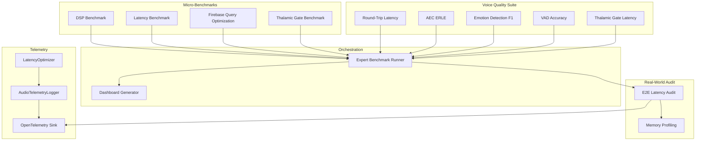

**Diagram sources**
- [tests/benchmarks/bench_dsp.py](file://tests/benchmarks/bench_dsp.py#L1-L135)
- [tests/benchmarks/bench_latency.py](file://tests/benchmarks/bench_latency.py#L1-L88)
- [tests/benchmarks/bench_firebase_queries.py](file://tests/benchmarks/bench_firebase_queries.py#L1-L110)
- [tests/benchmarks/test_thalamic_gate_benchmark.py](file://tests/benchmarks/test_thalamic_gate_benchmark.py#L1-L116)
- [tests/benchmarks/voice_quality_benchmark.py](file://tests/benchmarks/voice_quality_benchmark.py#L1-L906)
- [tools/benchmark_runner.py](file://tools/benchmark_runner.py#L1-L88)
- [tools/dashboard_generator.py](file://tools/dashboard_generator.py#L1-L166)
- [infra/scripts/benchmark.py](file://infra/scripts/benchmark.py#L1-L205)
- [core/audio/telemetry.py](file://core/audio/telemetry.py#L1-L441)
- [core/analytics/latency.py](file://core/analytics/latency.py#L1-L40)
- [core/infra/telemetry.py](file://core/infra/telemetry.py#L1-L130)

## Detailed Component Analysis

### DSP Benchmark: Rust vs NumPy
- Purpose: Compare performance of Rust (aether_cortex) versus NumPy for core DSP functions (energy VAD and zero-crossing detection).
- Execution: Generates synthetic PCM frames and runs a fixed number of iterations to compute average latency per call.
- Metrics: Reports average microseconds per call for each implementation and speedup ratio when Rust is available.
- Results interpretation: Substantial speedup indicates efficient hardware-accelerated audio processing.

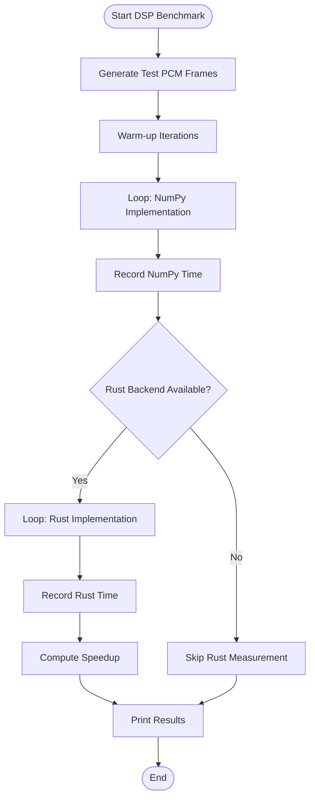

**Diagram sources**
- [tests/benchmarks/bench_dsp.py](file://tests/benchmarks/bench_dsp.py#L62-L135)

**Section sources**
- [tests/benchmarks/bench_dsp.py](file://tests/benchmarks/bench_dsp.py#L1-L135)

### Latency Benchmark: Internal Processing Budget
- Purpose: Measure internal audio processing latency excluding external services (Gemini, WebSocket, Firebase).
- Method: Builds VAD and paralinguistic analyzer, generates PCM frames, and measures per-iteration elapsed time over many iterations.
- Metrics: Average, p95, and p99 latency; processing budget percentage of the 180 ms E2E target.
- Targets: Sub-10 ms average internal latency to meet Zero-Friction goals.

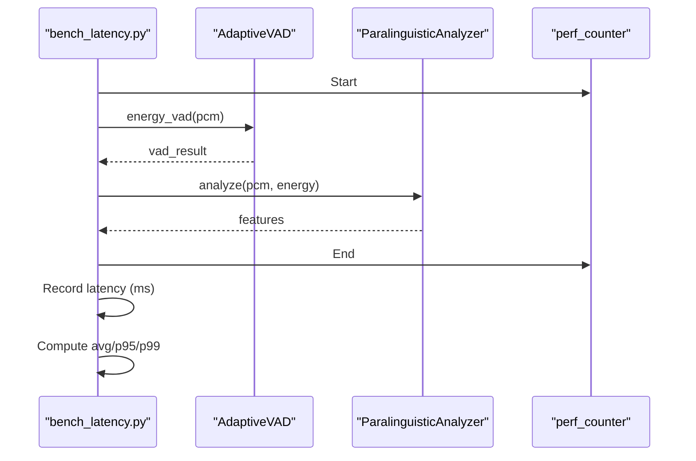

**Diagram sources**
- [tests/benchmarks/bench_latency.py](file://tests/benchmarks/bench_latency.py#L23-L83)

**Section sources**
- [tests/benchmarks/bench_latency.py](file://tests/benchmarks/bench_latency.py#L1-L88)

### Firebase Query Optimization Benchmark
- Purpose: Compare streaming vs batch retrieval strategies for Firestore queries and propose an optimized fetch pattern.
- Method: Simulates network delays and measures average time for both approaches over repeated runs.
- Metrics: Original vs optimized average time and improvement percentage.
- Recommendation: Prefer batch retrieval with offloaded parsing to a thread for reduced latency.

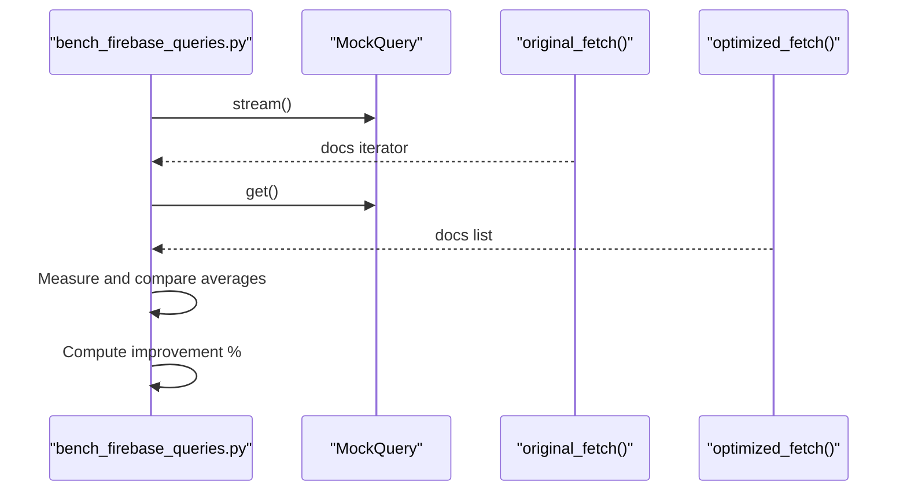

**Diagram sources**
- [tests/benchmarks/bench_firebase_queries.py](file://tests/benchmarks/bench_firebase_queries.py#L54-L106)

**Section sources**
- [tests/benchmarks/bench_firebase_queries.py](file://tests/benchmarks/bench_firebase_queries.py#L1-L110)

### Thalamic Gate Performance Benchmark
- Purpose: Benchmark the execution time of the Thalamic Gate callback used in audio capture.
- Method: Uses pytest-benchmark when available; otherwise falls back to a manual timing loop.
- Targets: Average processing time per frame below a specified threshold.

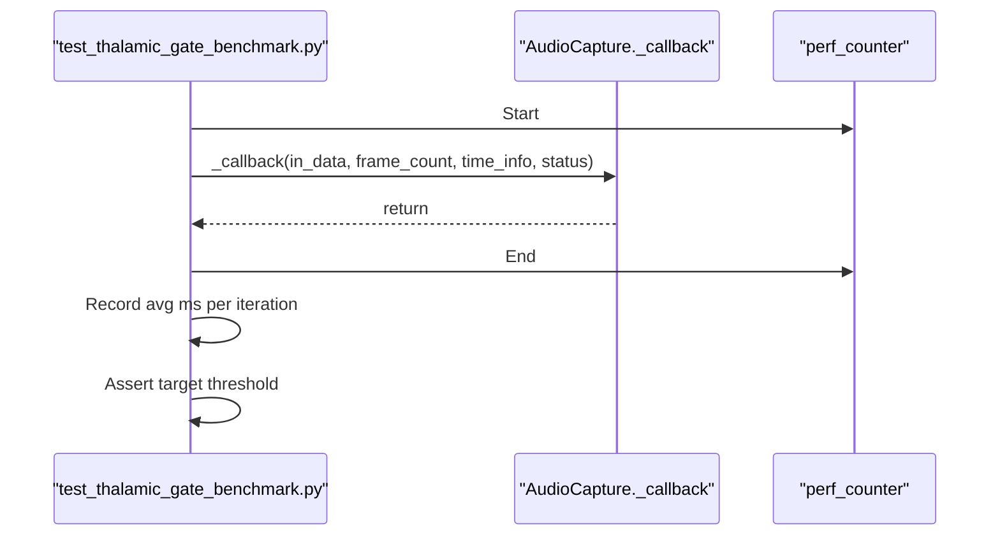

**Diagram sources**
- [tests/benchmarks/test_thalamic_gate_benchmark.py](file://tests/benchmarks/test_thalamic_gate_benchmark.py#L72-L108)

**Section sources**
- [tests/benchmarks/test_thalamic_gate_benchmark.py](file://tests/benchmarks/test_thalamic_gate_benchmark.py#L1-L116)

### Voice Quality Benchmark Suite
- Scope: Real-time voice quality tests using Gemini Live API.
- Tests:
  - Round-Trip Latency: Measures first-audio chunk latency.
  - AEC ERLE: Echo Return Loss Enhancement under café and keyboard noise at multiple SNRs.
  - Emotion Detection F1: Macro-averaged F1 across calm/alert/frustrated/flow_state.
  - VAD Accuracy: Classification accuracy on silence and speech-like signals.
  - Thalamic Gate Latency: Per-frame processing latency.
- Reporting: Produces a structured report with results, thresholds, and suggestions.

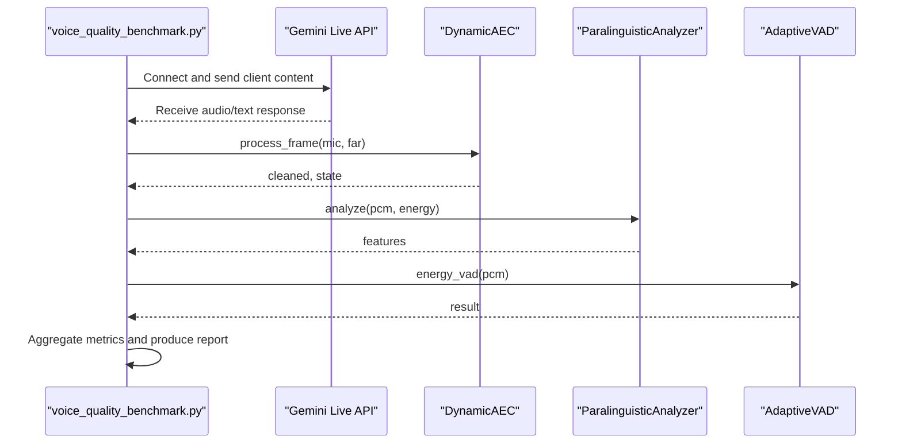

**Diagram sources**
- [tests/benchmarks/voice_quality_benchmark.py](file://tests/benchmarks/voice_quality_benchmark.py#L222-L766)

**Section sources**
- [tests/benchmarks/voice_quality_benchmark.py](file://tests/benchmarks/voice_quality_benchmark.py#L1-L906)

### Expert Benchmark Runner and Reporting
- Purpose: Orchestrates multiple benchmark suites, consolidates results, and generates a unified report and dashboard.
- Execution: Runs selected test files via pytest, collects individual reports, and merges them into a single benchmark_report.json.
- Output: Prints a summary and saves the consolidated report; dashboard generator renders an HTML dashboard.

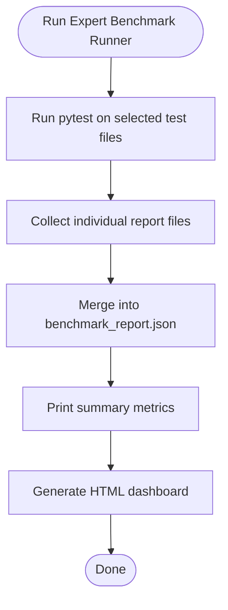

**Diagram sources**
- [tools/benchmark_runner.py](file://tools/benchmark_runner.py#L7-L87)
- [tools/dashboard_generator.py](file://tools/dashboard_generator.py#L4-L165)

**Section sources**
- [tools/benchmark_runner.py](file://tools/benchmark_runner.py#L1-L88)
- [tools/dashboard_generator.py](file://tools/dashboard_generator.py#L1-L166)
- [tests/reports/benchmark_report.json](file://tests/reports/benchmark_report.json#L1-L297)

### Real-World End-to-End Audit
- Purpose: Measure true network RTT via Gemini WebSocket ping, concurrent Firebase load test, and memory allocation trends.
- Method: Initializes AetherEngine, waits for stabilization, measures WebSocket ping RTT, performs concurrent Firebase writes, and computes memory stats using tracemalloc snapshots.
- Output: performance_audit.json with network RTT percentiles and optional Firebase write percentiles; prints a formatted summary.

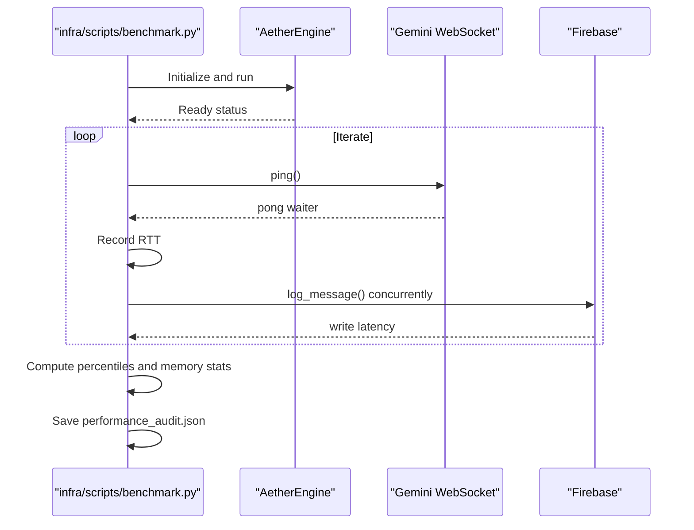

**Diagram sources**
- [infra/scripts/benchmark.py](file://infra/scripts/benchmark.py#L37-L140)

**Section sources**
- [infra/scripts/benchmark.py](file://infra/scripts/benchmark.py#L1-L205)

### Telemetry and Analytics
- AudioTelemetryLogger:
  - Records frame-level metrics (capture latency, AEC latency, VAD latency, total latency, ERLE, convergence, double-talk, queue sizes).
  - Aggregates session metrics (percentiles, averages, max, jitter).
  - Publishes metrics to the EventBus and optionally logs to JSON/CSV.
- LatencyOptimizer:
  - Maintains latency history and computes p50/p95/p99 and average.
- OpenTelemetry Sink:
  - Initializes OpenTelemetry tracer provider and exporter; records usage metrics and attaches them to current spans.

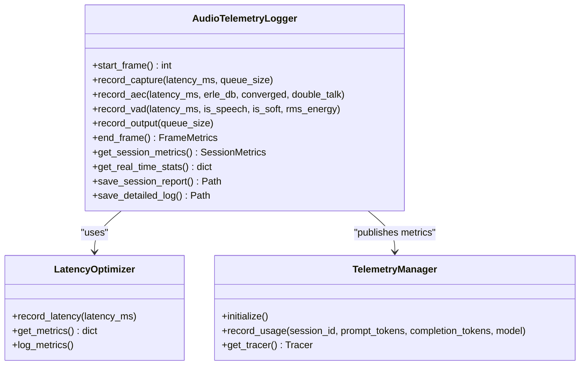

**Diagram sources**
- [core/audio/telemetry.py](file://core/audio/telemetry.py#L151-L441)
- [core/analytics/latency.py](file://core/analytics/latency.py#L7-L40)
- [core/infra/telemetry.py](file://core/infra/telemetry.py#L14-L130)

**Section sources**
- [core/audio/telemetry.py](file://core/audio/telemetry.py#L1-L441)
- [core/analytics/latency.py](file://core/analytics/latency.py#L1-L40)
- [core/infra/telemetry.py](file://core/infra/telemetry.py#L1-L130)

## Dependency Analysis
- Unit benchmarks depend on core audio modules (VAD, paralinguistics, AEC) and may rely on external libraries (NumPy, scikit-learn).
- Voice quality suite depends on the Gemini Live API and audio processing modules; it also interacts with OpenTelemetry for usage recording.
- Expert benchmark runner depends on pytest and reads individual report files to consolidate metrics.
- Dashboard generator depends on the consolidated benchmark_report.json.
- Real-world audit depends on AetherEngine, WebSocket connectivity, and Firebase availability; it uses tracemalloc for memory profiling.
- Telemetry stack integrates AudioTelemetryLogger, LatencyOptimizer, and OpenTelemetry sink.

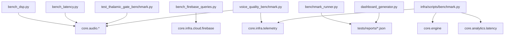

**Diagram sources**
- [tests/benchmarks/bench_dsp.py](file://tests/benchmarks/bench_dsp.py#L1-L135)
- [tests/benchmarks/bench_latency.py](file://tests/benchmarks/bench_latency.py#L1-L88)
- [tests/benchmarks/bench_firebase_queries.py](file://tests/benchmarks/bench_firebase_queries.py#L1-L110)
- [tests/benchmarks/test_thalamic_gate_benchmark.py](file://tests/benchmarks/test_thalamic_gate_benchmark.py#L1-L116)
- [tests/benchmarks/voice_quality_benchmark.py](file://tests/benchmarks/voice_quality_benchmark.py#L1-L906)
- [tools/benchmark_runner.py](file://tools/benchmark_runner.py#L1-L88)
- [tools/dashboard_generator.py](file://tools/dashboard_generator.py#L1-L166)
- [infra/scripts/benchmark.py](file://infra/scripts/benchmark.py#L1-L205)
- [core/infra/telemetry.py](file://core/infra/telemetry.py#L1-L130)
- [core/analytics/latency.py](file://core/analytics/latency.py#L1-L40)

**Section sources**
- [tests/benchmarks/README.md](file://tests/benchmarks/README.md#L1-L55)
- [tools/benchmark_runner.py](file://tools/benchmark_runner.py#L1-L88)
- [tools/dashboard_generator.py](file://tools/dashboard_generator.py#L1-L166)
- [infra/scripts/benchmark.py](file://infra/scripts/benchmark.py#L1-L205)
- [core/infra/telemetry.py](file://core/infra/telemetry.py#L1-L130)
- [core/analytics/latency.py](file://core/analytics/latency.py#L1-L40)

## Performance Considerations
- Latency targets:
  - Internal processing budget should remain under 10 ms average to preserve ~175 ms for network and inference within the 180 ms E2E target.
  - Thalamic Gate latency target is below 2 ms per frame.
- DSP efficiency:
  - Favor Rust implementations for computationally intensive operations to achieve significant speedups over NumPy.
- Firebase query patterns:
  - Prefer batch retrieval with offloaded parsing to reduce latency compared to streaming.
- Real-world auditing:
  - Use WebSocket ping to measure true network RTT; combine with concurrent load tests to assess throughput.
  - Track memory growth and allocation hotspots using tracemalloc snapshots.
- Telemetry-driven optimization:
  - Monitor p50/p95/p99 latencies and jitter; use AudioTelemetryLogger to capture frame-level regressions.
  - Export traces via OpenTelemetry for cross-service latency analysis.

[No sources needed since this section provides general guidance]

## Troubleshooting Guide
- Missing API key for voice quality benchmarks:
  - Ensure GOOGLE_API_KEY or GEMINI_API_KEY is set in the environment; otherwise, the voice quality analysis will fail.
- pytest-benchmark not installed:
  - Thalamic Gate manual benchmark will run, but pytest-benchmark-based measurements require installation.
- Engine readiness failures:
  - The real-world audit checks /api/status; if the engine does not stabilize within the timeout, the audit aborts early.
- Firebase connectivity:
  - If Firebase is not connected, the concurrent load test is skipped; verify credentials and connection status.
- Insufficient memory profiling:
  - tracemalloc snapshots must be enabled; ensure the audit runs with tracemalloc.start() and take snapshots before and after workload.

**Section sources**
- [tests/benchmarks/voice_quality_benchmark.py](file://tests/benchmarks/voice_quality_benchmark.py#L774-L780)
- [tests/benchmarks/test_thalamic_gate_benchmark.py](file://tests/benchmarks/test_thalamic_gate_benchmark.py#L69-L71)
- [infra/scripts/benchmark.py](file://infra/scripts/benchmark.py#L52-L82)
- [infra/scripts/benchmark.py](file://infra/scripts/benchmark.py#L112-L134)

## Conclusion
Aether Voice OS provides a comprehensive performance benchmarking system spanning micro-benchmarks, voice quality validation, real-world auditing, and telemetry-driven analytics. By leveraging unit-level DSP and latency benchmarks, Firebase optimization comparisons, and the voice quality suite, teams can establish baselines, detect regressions, and maintain sub-200 ms real-time performance. The expert runner and dashboard streamline reporting and visualization, while OpenTelemetry and memory profiling support deep diagnostics and optimization.

[No sources needed since this section summarizes without analyzing specific files]

## Appendices

### Benchmark Execution Procedures
- DSP Benchmark:
  - Run from project root with the appropriate Python path to locate aether_cortex and core modules.
- Latency Benchmark:
  - Execute the script to measure internal processing latency over many iterations.
- Firebase Query Optimization:
  - Execute the script to compare streaming vs batch retrieval strategies.
- Thalamic Gate Benchmark:
  - Install pytest-benchmark for automatic measurements; otherwise, the manual benchmark runs.
- Voice Quality Benchmark Suite:
  - Ensure API key is configured; run the script to execute all voice quality tests and produce a report.
- Expert Benchmark Runner:
  - Execute the runner to orchestrate multiple tests and consolidate reports.
- Dashboard Generation:
  - Generate an HTML dashboard from the consolidated benchmark report.

**Section sources**
- [tests/benchmarks/README.md](file://tests/benchmarks/README.md#L15-L43)
- [tests/benchmarks/bench_dsp.py](file://tests/benchmarks/bench_dsp.py#L7-L9)
- [tests/benchmarks/bench_latency.py](file://tests/benchmarks/bench_latency.py#L10-L11)
- [tests/benchmarks/bench_firebase_queries.py](file://tests/benchmarks/bench_firebase_queries.py#L76-L109)
- [tests/benchmarks/test_thalamic_gate_benchmark.py](file://tests/benchmarks/test_thalamic_gate_benchmark.py#L69-L108)
- [tests/benchmarks/voice_quality_benchmark.py](file://tests/benchmarks/voice_quality_benchmark.py#L12-L19)
- [tools/benchmark_runner.py](file://tools/benchmark_runner.py#L7-L20)
- [tools/dashboard_generator.py](file://tools/dashboard_generator.py#L4-L12)

### Statistical Analysis and Regression Detection
- Percentile metrics:
  - Use p50/p95/p99 latencies to capture tail behavior and avoid outliers skewing averages.
- Frame-level tracking:
  - AudioTelemetryLogger stores per-frame metrics enabling detection of spikes and jitter.
- Consolidated reporting:
  - Expert benchmark runner merges multiple reports; trends can be tracked across runs.
- Threshold-based pass/fail:
  - Many benchmarks define explicit thresholds; pass/fail flags indicate regressions.

**Section sources**
- [core/audio/telemetry.py](file://core/audio/telemetry.py#L280-L320)
- [tests/reports/benchmark_report.json](file://tests/reports/benchmark_report.json#L1-L297)

### Writing Custom Benchmarks
- Follow the existing patterns:
  - Use warm-up iterations, time a fixed number of runs, and compute average latency per call.
  - For real-time tests, measure per-frame latency and compute percentiles.
  - Integrate with pytest-benchmark for automatic statistics when available.
- Reporting:
  - Emit structured results similar to voice_quality_benchmark.py and consolidated reports.

**Section sources**
- [tests/benchmarks/bench_dsp.py](file://tests/benchmarks/bench_dsp.py#L62-L74)
- [tests/benchmarks/test_thalamic_gate_benchmark.py](file://tests/benchmarks/test_thalamic_gate_benchmark.py#L79-L82)
- [tests/benchmarks/voice_quality_benchmark.py](file://tests/benchmarks/voice_quality_benchmark.py#L57-L66)

### Interpreting Benchmark Results
- DSP:
  - Compare NumPy and Rust timings; compute speedup ratios to evaluate hardware acceleration benefits.
- Latency:
  - Ensure internal processing remains under 10 ms average; monitor p99 to guard against spikes.
- Firebase:
  - Favor batch retrieval with offloaded parsing to reduce latency.
- Voice Quality:
  - Evaluate round-trip latency, AEC ERLE, emotion detection F1, VAD accuracy, and Thalamic Gate latency against defined thresholds.

**Section sources**
- [tests/benchmarks/bench_dsp.py](file://tests/benchmarks/bench_dsp.py#L107-L108)
- [tests/benchmarks/bench_latency.py](file://tests/benchmarks/bench_latency.py#L75-L83)
- [tests/benchmarks/bench_firebase_queries.py](file://tests/benchmarks/bench_firebase_queries.py#L104-L105)
- [tests/benchmarks/voice_quality_benchmark.py](file://tests/benchmarks/voice_quality_benchmark.py#L273-L281)

### Establishing Performance Baselines
- Define targets for each benchmark category (e.g., internal latency, Thalamic Gate latency, AEC ERLE).
- Use consolidated reports to track progress over time and detect regressions.
- Maintain separate baselines for development, staging, and production environments.

**Section sources**
- [tests/benchmarks/README.md](file://tests/benchmarks/README.md#L7-L13)
- [tests/reports/benchmark_report.json](file://tests/reports/benchmark_report.json#L1-L297)

### Benchmark Reporting, Visualization, and Trend Analysis
- Consolidated report:
  - benchmark_report.json aggregates metrics from multiple tests.
- Dashboard:
  - HTML dashboard visualizes key metrics and trends.
- Trend analysis:
  - Compare successive runs of benchmark_report.json to identify drifts in latency, memory growth, or stability.

**Section sources**
- [tools/benchmark_runner.py](file://tools/benchmark_runner.py#L42-L84)
- [tools/dashboard_generator.py](file://tools/dashboard_generator.py#L1-L166)
- [tests/reports/benchmark_report.json](file://tests/reports/benchmark_report.json#L1-L297)

### Performance Profiling Tools, Memory Tracking, and CPU/GPU Monitoring
- Memory profiling:
  - tracemalloc snapshots in the real-world audit capture allocation deltas and peak memory usage.
- CPU/GPU utilization:
  - Use system-level profilers (e.g., perf, Instruments) alongside Python memory profiling to identify hotspots.
- Telemetry export:
  - OpenTelemetry sink exports traces for cross-service latency analysis and cost tracking.

**Section sources**
- [infra/scripts/benchmark.py](file://infra/scripts/benchmark.py#L42-L44)
- [infra/scripts/benchmark.py](file://infra/scripts/benchmark.py#L142-L154)
- [core/infra/telemetry.py](file://core/infra/telemetry.py#L35-L76)

### Guidance on Performance Optimization Based on Benchmark Insights
- DSP:
  - Prefer Rust implementations for heavy computations; validate speedup and correctness.
- Latency:
  - Reduce contention in audio capture and processing stages; optimize queue sizes and buffer management.
- Firebase:
  - Batch reads/writes and minimize parsing overhead in the main thread.
- Voice quality:
  - Improve AEC convergence and ERLE; refine VAD thresholds; enhance emotion detection features.
- Real-time processing:
  - Monitor p99 latencies and jitter; apply backpressure controls when necessary.

**Section sources**
- [tests/benchmarks/bench_dsp.py](file://tests/benchmarks/bench_dsp.py#L107-L108)
- [tests/benchmarks/bench_latency.py](file://tests/benchmarks/bench_latency.py#L75-L83)
- [tests/benchmarks/bench_firebase_queries.py](file://tests/benchmarks/bench_firebase_queries.py#L104-L105)
- [tests/benchmarks/voice_quality_benchmark.py](file://tests/benchmarks/voice_quality_benchmark.py#L462-L544)
- [core/audio/telemetry.py](file://core/audio/telemetry.py#L315-L319)