# Quality Metrics and Reporting

<cite>
**Referenced Files in This Document**
- [.github/workflows/aether_pipeline.yml](file://.github/workflows/aether_pipeline.yml)
- [infra/scripts/benchmark.py](file://infra/scripts/benchmark.py)
- [infra/scripts/stability_test.py](file://infra/scripts/stability_test.py)
- [infra/scripts/health_scanner.py](file://infra/scripts/health_scanner.py)
- [tests/benchmarks/voice_quality_benchmark.py](file://tests/benchmarks/voice_quality_benchmark.py)
- [tests/benchmarks/bench_latency.py](file://tests/benchmarks/bench_latency.py)
- [tests/reports/benchmark_report.json](file://tests/reports/benchmark_report.json)
- [tests/reports/stability_report.json](file://tests/reports/stability_report.json)
- [tests/reports/latency_report.json](file://tests/reports/latency_report.json)
- [core/analytics/latency.py](file://core/analytics/latency.py)
- [core/analytics/demo_metrics.py](file://core/analytics/demo_metrics.py)
- [core/audio/telemetry.py](file://core/audio/telemetry.py)
- [core/infra/telemetry.py](file://core/infra/telemetry.py)
- [apps/portal/src/components/HUD/SystemAnalytics.tsx](file://apps/portal/src/components/HUD/SystemAnalytics.tsx)
- [apps/portal/src/hooks/useTelemetry.tsx](file://apps/portal/src/hooks/useTelemetry.tsx)
- [tests/unit/test_latency.py](file://tests/unit/test_latency.py)
</cite>

## Table of Contents
1. [Introduction](#introduction)
2. [Project Structure](#project-structure)
3. [Core Components](#core-components)
4. [Architecture Overview](#architecture-overview)
5. [Detailed Component Analysis](#detailed-component-analysis)
6. [Dependency Analysis](#dependency-analysis)
7. [Performance Considerations](#performance-considerations)
8. [Troubleshooting Guide](#troubleshooting-guide)
9. [Conclusion](#conclusion)
10. [Appendices](#appendices)

## Introduction
This document describes the quality metrics collection and reporting framework in Aether Voice OS. It covers automated testing, performance monitoring, system health validation, and the reporting system for benchmark results, stability metrics, latency analysis, and system component health. It also documents the quality gates, continuous monitoring processes, CI/CD integration, dashboard visualization, and strategies for interpreting metrics, establishing thresholds, and driving quality improvements.

## Project Structure
Quality-related assets are distributed across CI workflows, scripts, tests, analytics modules, and the UI HUD:
- CI pipeline orchestrates linting, Python tests with coverage, portal checks, and security/Docker builds.
- Scripts implement latency, stability, and health scanning benchmarks.
- Tests define benchmark suites and unit tests for latency metrics.
- Analytics modules compute latency percentiles and demonstration metrics.
- Audio telemetry captures frame-level metrics and publishes them to the event bus.
- Infrastructure telemetry exports traces for observability.
- The portal HUD visualizes system analytics and telemetry logs.

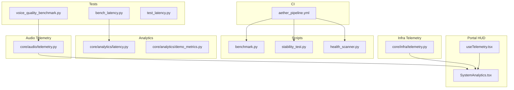

**Diagram sources**
- [.github/workflows/aether_pipeline.yml](file://.github/workflows/aether_pipeline.yml#L1-L160)
- [infra/scripts/benchmark.py](file://infra/scripts/benchmark.py#L1-L205)
- [infra/scripts/stability_test.py](file://infra/scripts/stability_test.py#L1-L129)
- [infra/scripts/health_scanner.py](file://infra/scripts/health_scanner.py#L1-L560)
- [tests/benchmarks/voice_quality_benchmark.py](file://tests/benchmarks/voice_quality_benchmark.py#L1-L906)
- [tests/benchmarks/bench_latency.py](file://tests/benchmarks/bench_latency.py#L1-L88)
- [core/analytics/latency.py](file://core/analytics/latency.py#L1-L40)
- [core/analytics/demo_metrics.py](file://core/analytics/demo_metrics.py#L1-L50)
- [core/audio/telemetry.py](file://core/audio/telemetry.py#L1-L441)
- [core/infra/telemetry.py](file://core/infra/telemetry.py#L1-L130)
- [apps/portal/src/components/HUD/SystemAnalytics.tsx](file://apps/portal/src/components/HUD/SystemAnalytics.tsx#L1-L88)
- [apps/portal/src/hooks/useTelemetry.tsx](file://apps/portal/src/hooks/useTelemetry.tsx#L1-L54)

**Section sources**
- [.github/workflows/aether_pipeline.yml](file://.github/workflows/aether_pipeline.yml#L1-L160)
- [infra/scripts/benchmark.py](file://infra/scripts/benchmark.py#L1-L205)
- [infra/scripts/stability_test.py](file://infra/scripts/stability_test.py#L1-L129)
- [infra/scripts/health_scanner.py](file://infra/scripts/health_scanner.py#L1-L560)
- [tests/benchmarks/voice_quality_benchmark.py](file://tests/benchmarks/voice_quality_benchmark.py#L1-L906)
- [tests/benchmarks/bench_latency.py](file://tests/benchmarks/bench_latency.py#L1-L88)
- [core/analytics/latency.py](file://core/analytics/latency.py#L1-L40)
- [core/analytics/demo_metrics.py](file://core/analytics/demo_metrics.py#L1-L50)
- [core/audio/telemetry.py](file://core/audio/telemetry.py#L1-L441)
- [core/infra/telemetry.py](file://core/infra/telemetry.py#L1-L130)
- [apps/portal/src/components/HUD/SystemAnalytics.tsx](file://apps/portal/src/components/HUD/SystemAnalytics.tsx#L1-L88)
- [apps/portal/src/hooks/useTelemetry.tsx](file://apps/portal/src/hooks/useTelemetry.tsx#L1-L54)

## Core Components
- CI/CD Quality Gates:
  - Rust check for Cortex.
  - Linting with Ruff.
  - Python tests with coverage and import verification.
  - Portal linting and tests.
  - Security checks (Bandit, Safety) and Docker build verification.
- Benchmarks:
  - Real-world network RTT and Firebase load test.
  - Stability tests for resource usage and bus throughput.
  - Voice quality benchmark suite (round-trip latency, AEC effectiveness, emotion detection, VAD accuracy, barge-in responsiveness).
  - Internal latency benchmark for processing budget.
- Analytics:
  - LatencyOptimizer for p50/p95/p99 metrics.
  - DemoMetrics for demonstration-grade latency and accuracy.
- Telemetry:
  - AudioTelemetry and AudioTelemetryLogger for frame-level metrics and session reports.
  - TelemetryManager for exporting traces via OTLP.
- Reporting:
  - JSON reports for benchmarks and stability.
  - Unit tests validating latency percentile calculations.
- Visualization:
  - SystemAnalytics HUD and TelemetryProvider for logs.

**Section sources**
- [.github/workflows/aether_pipeline.yml](file://.github/workflows/aether_pipeline.yml#L1-L160)
- [infra/scripts/benchmark.py](file://infra/scripts/benchmark.py#L1-L205)
- [infra/scripts/stability_test.py](file://infra/scripts/stability_test.py#L1-L129)
- [tests/benchmarks/voice_quality_benchmark.py](file://tests/benchmarks/voice_quality_benchmark.py#L1-L906)
- [tests/benchmarks/bench_latency.py](file://tests/benchmarks/bench_latency.py#L1-L88)
- [core/analytics/latency.py](file://core/analytics/latency.py#L1-L40)
- [core/analytics/demo_metrics.py](file://core/analytics/demo_metrics.py#L1-L50)
- [core/audio/telemetry.py](file://core/audio/telemetry.py#L1-L441)
- [core/infra/telemetry.py](file://core/infra/telemetry.py#L1-L130)
- [tests/reports/benchmark_report.json](file://tests/reports/benchmark_report.json#L1-L297)
- [tests/reports/stability_report.json](file://tests/reports/stability_report.json#L1-L210)
- [tests/reports/latency_report.json](file://tests/reports/latency_report.json#L1-L7)
- [tests/unit/test_latency.py](file://tests/unit/test_latency.py#L1-L69)
- [apps/portal/src/components/HUD/SystemAnalytics.tsx](file://apps/portal/src/components/HUD/SystemAnalytics.tsx#L1-L88)
- [apps/portal/src/hooks/useTelemetry.tsx](file://apps/portal/src/hooks/useTelemetry.tsx#L1-L54)

## Architecture Overview
The quality system integrates CI checks, scripted benchmarks, unit tests, telemetry, and visualization:

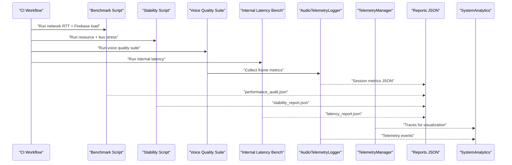

**Diagram sources**
- [.github/workflows/aether_pipeline.yml](file://.github/workflows/aether_pipeline.yml#L1-L160)
- [infra/scripts/benchmark.py](file://infra/scripts/benchmark.py#L1-L205)
- [infra/scripts/stability_test.py](file://infra/scripts/stability_test.py#L1-L129)
- [tests/benchmarks/voice_quality_benchmark.py](file://tests/benchmarks/voice_quality_benchmark.py#L1-L906)
- [tests/benchmarks/bench_latency.py](file://tests/benchmarks/bench_latency.py#L1-L88)
- [core/audio/telemetry.py](file://core/audio/telemetry.py#L1-L441)
- [core/infra/telemetry.py](file://core/infra/telemetry.py#L1-L130)
- [tests/reports/benchmark_report.json](file://tests/reports/benchmark_report.json#L1-L297)
- [tests/reports/stability_report.json](file://tests/reports/stability_report.json#L1-L210)
- [tests/reports/latency_report.json](file://tests/reports/latency_report.json#L1-L7)
- [apps/portal/src/components/HUD/SystemAnalytics.tsx](file://apps/portal/src/components/HUD/SystemAnalytics.tsx#L1-L88)

## Detailed Component Analysis

### CI/CD Quality Gates and Automated Checks
- Rust check validates Cortex code.
- Linting enforces style and formatting.
- Python tests run with coverage and import verification.
- Portal job ensures frontend linting and tests pass.
- Security checks scan for SAST and dependency issues.
- Docker build verifies image creation without pushing.

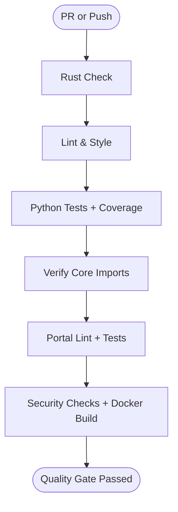

**Diagram sources**
- [.github/workflows/aether_pipeline.yml](file://.github/workflows/aether_pipeline.yml#L1-L160)

**Section sources**
- [.github/workflows/aether_pipeline.yml](file://.github/workflows/aether_pipeline.yml#L1-L160)

### Latency Benchmarking and Reporting
- Real-world network RTT measurement via Gemini WebSocket ping.
- Firebase concurrent write load test.
- Percentile computation and report generation.
- Internal processing latency benchmark for zero-friction budget.

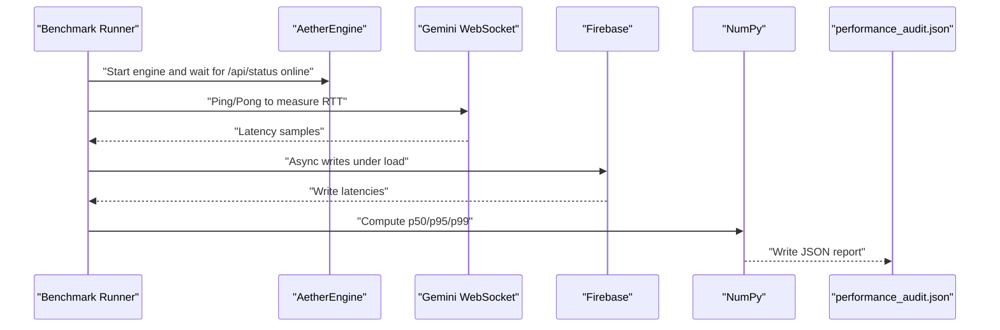

**Diagram sources**
- [infra/scripts/benchmark.py](file://infra/scripts/benchmark.py#L1-L205)
- [tests/reports/benchmark_report.json](file://tests/reports/benchmark_report.json#L1-L297)

**Section sources**
- [infra/scripts/benchmark.py](file://infra/scripts/benchmark.py#L1-L205)
- [tests/reports/benchmark_report.json](file://tests/reports/benchmark_report.json#L1-L297)

### Stability and Resource Monitoring
- Resource monitor tracks CPU and memory over a duration.
- Bus stress test measures throughput and latency under high-frequency messaging.
- Results saved to stability_report.json.

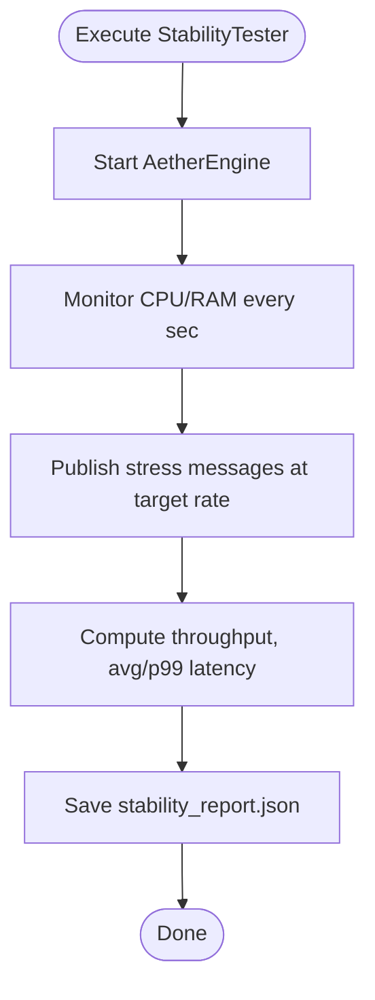

**Diagram sources**
- [infra/scripts/stability_test.py](file://infra/scripts/stability_test.py#L1-L129)
- [tests/reports/stability_report.json](file://tests/reports/stability_report.json#L1-L210)

**Section sources**
- [infra/scripts/stability_test.py](file://infra/scripts/stability_test.py#L1-L129)
- [tests/reports/stability_report.json](file://tests/reports/stability_report.json#L1-L210)

### Voice Quality Benchmark Suite
- Round-trip latency (text/audio).
- AI-assisted voice quality analysis and suggestions.
- AEC ERLE effectiveness under noise.
- Emotion detection F1-score.
- VAD classification accuracy.
- Thalamic gate latency.

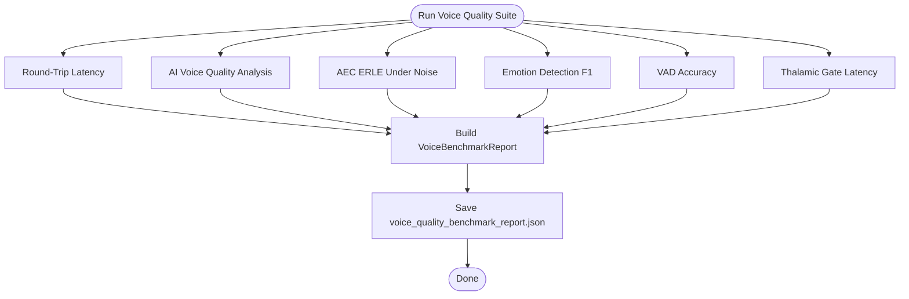

**Diagram sources**
- [tests/benchmarks/voice_quality_benchmark.py](file://tests/benchmarks/voice_quality_benchmark.py#L1-L906)
- [tests/reports/benchmark_report.json](file://tests/reports/benchmark_report.json#L1-L297)

**Section sources**
- [tests/benchmarks/voice_quality_benchmark.py](file://tests/benchmarks/voice_quality_benchmark.py#L1-L906)
- [tests/reports/benchmark_report.json](file://tests/reports/benchmark_report.json#L1-L297)

### Internal Latency Benchmark
- Measures internal processing budget excluding external network and inference latency.
- Provides percentile latency and remaining budget estimation.

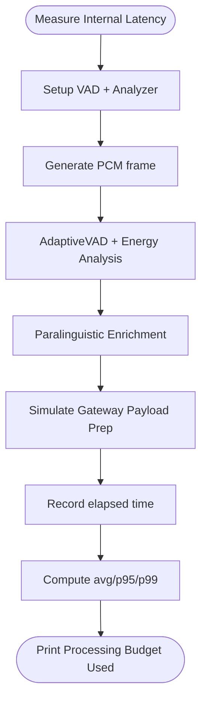

**Diagram sources**
- [tests/benchmarks/bench_latency.py](file://tests/benchmarks/bench_latency.py#L1-L88)

**Section sources**
- [tests/benchmarks/bench_latency.py](file://tests/benchmarks/bench_latency.py#L1-L88)

### Latency Analytics and Unit Tests
- LatencyOptimizer computes p50/p95/p99 and average latency.
- Unit tests validate edge cases and logging behavior.

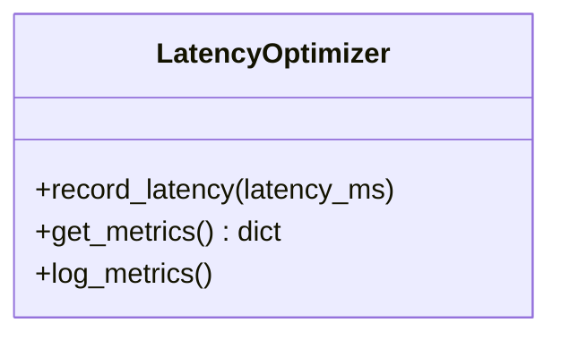

**Diagram sources**
- [core/analytics/latency.py](file://core/analytics/latency.py#L1-L40)

**Section sources**
- [core/analytics/latency.py](file://core/analytics/latency.py#L1-L40)
- [tests/unit/test_latency.py](file://tests/unit/test_latency.py#L1-L69)

### Audio Telemetry and Session Metrics
- AudioTelemetryLogger captures frame-level metrics and aggregates session metrics.
- Publishes telemetry events to the event bus and saves JSON reports.

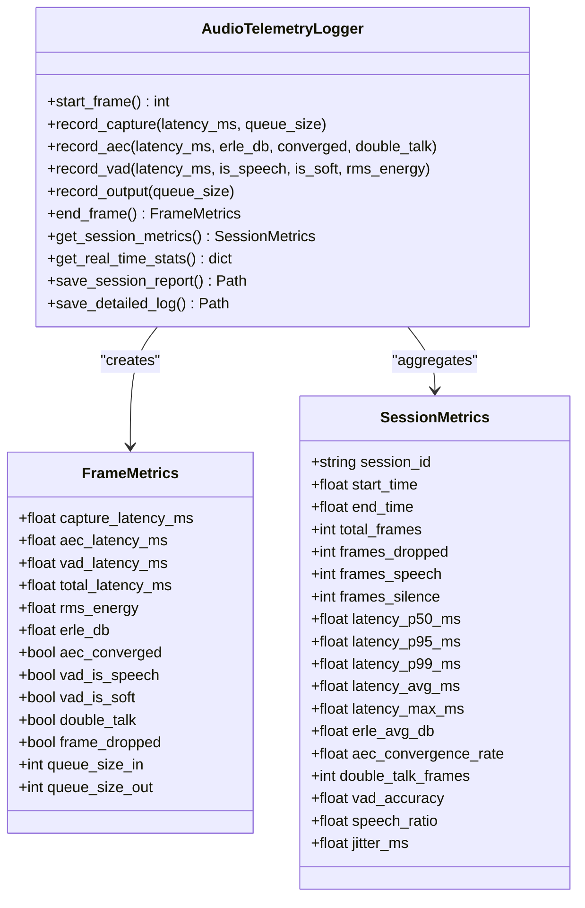

**Diagram sources**
- [core/audio/telemetry.py](file://core/audio/telemetry.py#L1-L441)

**Section sources**
- [core/audio/telemetry.py](file://core/audio/telemetry.py#L1-L441)

### Infrastructure Telemetry and Export
- TelemetryManager initializes OpenTelemetry TracerProvider and exports spans via OTLP.
- Records token usage and cost attributes.

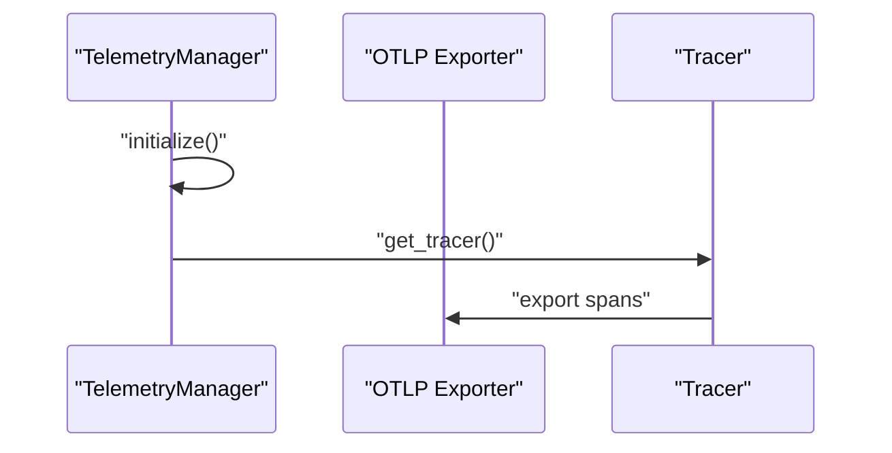

**Diagram sources**
- [core/infra/telemetry.py](file://core/infra/telemetry.py#L1-L130)

**Section sources**
- [core/infra/telemetry.py](file://core/infra/telemetry.py#L1-L130)

### Portal HUD and Telemetry Logs
- SystemAnalytics visualizes neural flux, signal integrity, pitch, and spectral centroid.
- TelemetryProvider manages a bounded log stream for UI display.

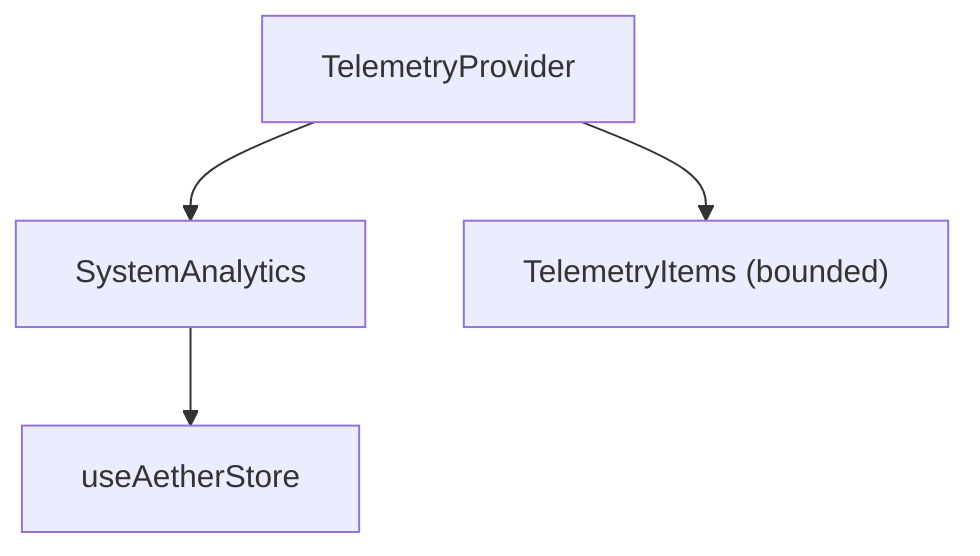

**Diagram sources**
- [apps/portal/src/components/HUD/SystemAnalytics.tsx](file://apps/portal/src/components/HUD/SystemAnalytics.tsx#L1-L88)
- [apps/portal/src/hooks/useTelemetry.tsx](file://apps/portal/src/hooks/useTelemetry.tsx#L1-L54)

**Section sources**
- [apps/portal/src/components/HUD/SystemAnalytics.tsx](file://apps/portal/src/components/HUD/SystemAnalytics.tsx#L1-L88)
- [apps/portal/src/hooks/useTelemetry.tsx](file://apps/portal/src/hooks/useTelemetry.tsx#L1-L54)

## Dependency Analysis
- CI depends on scripts and tests to enforce quality gates.
- Benchmarks depend on core engine and external services (Gemini, Firebase).
- Telemetry modules publish to the event bus and export to OTLP.
- Portal HUD consumes telemetry streams and displays metrics.

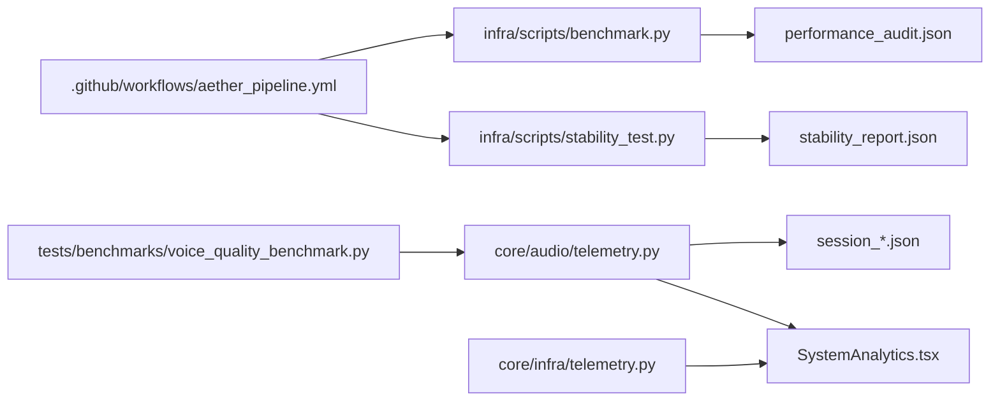

**Diagram sources**
- [.github/workflows/aether_pipeline.yml](file://.github/workflows/aether_pipeline.yml#L1-L160)
- [infra/scripts/benchmark.py](file://infra/scripts/benchmark.py#L1-L205)
- [infra/scripts/stability_test.py](file://infra/scripts/stability_test.py#L1-L129)
- [tests/benchmarks/voice_quality_benchmark.py](file://tests/benchmarks/voice_quality_benchmark.py#L1-L906)
- [core/audio/telemetry.py](file://core/audio/telemetry.py#L1-L441)
- [core/infra/telemetry.py](file://core/infra/telemetry.py#L1-L130)
- [apps/portal/src/components/HUD/SystemAnalytics.tsx](file://apps/portal/src/components/HUD/SystemAnalytics.tsx#L1-L88)

**Section sources**
- [.github/workflows/aether_pipeline.yml](file://.github/workflows/aether_pipeline.yml#L1-L160)
- [infra/scripts/benchmark.py](file://infra/scripts/benchmark.py#L1-L205)
- [infra/scripts/stability_test.py](file://infra/scripts/stability_test.py#L1-L129)
- [tests/benchmarks/voice_quality_benchmark.py](file://tests/benchmarks/voice_quality_benchmark.py#L1-L906)
- [core/audio/telemetry.py](file://core/audio/telemetry.py#L1-L441)
- [core/infra/telemetry.py](file://core/infra/telemetry.py#L1-L130)
- [apps/portal/src/components/HUD/SystemAnalytics.tsx](file://apps/portal/src/components/HUD/SystemAnalytics.tsx#L1-L88)

## Performance Considerations
- Latency targets:
  - Round-trip latency: < 500 ms (suite threshold).
  - Internal processing: < 10 ms (zero-friction).
  - Thalamic gate latency: < 2 ms per frame.
  - AEC ERLE: > 12 dB under noise.
  - Emotion detection F1: ≥ 0.75.
  - VAD accuracy: ≥ 85%.
- Percentile focus: p50/p95/p99 for tail latency visibility.
- Memory growth: monitor stability over long sessions; acceptable growth observed in reports.
- Throughput: bus stress test measures messages per second and latency percentiles.

[No sources needed since this section provides general guidance]

## Troubleshooting Guide
- CI failures:
  - Coverage below threshold aborts tests.
  - Import verification ensures core modules are importable.
  - Docker build step validates image creation.
- Benchmark issues:
  - Engine readiness timeout indicates startup problems; verify /api/status endpoint and environment.
  - Missing API keys cause Gemini-based tests to fail; ensure environment variables are set.
  - WebSocket ping failures imply network or service availability issues.
- Stability anomalies:
  - High CPU/RAM spikes indicate resource leaks or hot loops.
  - Bus throughput drops or increased latency suggest Redis connectivity or overload.
- Telemetry export:
  - Missing Arize credentials fall back to local Phoenix endpoint.
  - Debug mode switches to SimpleSpanProcessor for development.

**Section sources**
- [.github/workflows/aether_pipeline.yml](file://.github/workflows/aether_pipeline.yml#L90-L101)
- [infra/scripts/benchmark.py](file://infra/scripts/benchmark.py#L52-L82)
- [tests/benchmarks/voice_quality_benchmark.py](file://tests/benchmarks/voice_quality_benchmark.py#L774-L780)
- [core/infra/telemetry.py](file://core/infra/telemetry.py#L35-L76)

## Conclusion
Aether Voice OS employs a robust quality framework integrating CI quality gates, comprehensive benchmarks, latency analytics, audio telemetry, and visualization. The system generates actionable reports, monitors stability and performance, and supports continuous improvement through automated checks and dashboards.

[No sources needed since this section summarizes without analyzing specific files]

## Appendices

### Quality Report Interpretation and Thresholds
- Benchmark reports:
  - latency_report.json: interpret t3_t1_total_ms, t2_t1_signal_ms, t3_t2_kernel_ms; status indicates success.
  - stability_report.json: track memory growth and iteration history; look for plateaus indicating stabilization.
  - benchmark_report.json: review latency, stress, DNA chaos stability, cortex neural lead time, and long session stability metrics.
- Voice quality report:
  - Evaluate round-trip latency, AEC ERLE, emotion F1, VAD accuracy, and thalamic gate latency against thresholds.
- LatencyOptimizer:
  - Use p50/p95/p99 to identify tail latency regressions; compare averages across releases.

**Section sources**
- [tests/reports/latency_report.json](file://tests/reports/latency_report.json#L1-L7)
- [tests/reports/stability_report.json](file://tests/reports/stability_report.json#L1-L210)
- [tests/reports/benchmark_report.json](file://tests/reports/benchmark_report.json#L1-L297)
- [tests/benchmarks/voice_quality_benchmark.py](file://tests/benchmarks/voice_quality_benchmark.py#L273-L281)
- [tests/benchmarks/bench_latency.py](file://tests/benchmarks/bench_latency.py#L79-L83)
- [core/analytics/latency.py](file://core/analytics/latency.py#L19-L39)

### Continuous Monitoring and Alerting
- Dashboards:
  - SystemAnalytics HUD visualizes neural flux, signal integrity, pitch, and spectral centroid.
  - TelemetryProvider maintains a bounded log stream for UI display.
- Observability:
  - TelemetryManager exports traces to Arize/Phoenix; configure environment variables for cloud export.
- Alerts:
  - CI coverage failure threshold prevents merging low-quality changes.
  - Stability and latency benchmarks should be run regularly; regressions trigger manual reviews.

**Section sources**
- [apps/portal/src/components/HUD/SystemAnalytics.tsx](file://apps/portal/src/components/HUD/SystemAnalytics.tsx#L1-L88)
- [apps/portal/src/hooks/useTelemetry.tsx](file://apps/portal/src/hooks/useTelemetry.tsx#L1-L54)
- [core/infra/telemetry.py](file://core/infra/telemetry.py#L28-L76)
- [.github/workflows/aether_pipeline.yml](file://.github/workflows/aether_pipeline.yml#L92-L94)

### Release Qualification Criteria
- CI must pass:
  - Rust check, lint, Python tests with coverage, import verification, portal checks, security scans, and Docker build.
- Benchmarks must meet thresholds:
  - Voice quality suite thresholds for latency, AEC, emotion detection, VAD, and thalamic gate.
- Stability validated:
  - Long sessions show controlled memory growth and stable latencies.
- Telemetry enabled:
  - OTLP export configured for trace collection.

**Section sources**
- [.github/workflows/aether_pipeline.yml](file://.github/workflows/aether_pipeline.yml#L1-L160)
- [tests/benchmarks/voice_quality_benchmark.py](file://tests/benchmarks/voice_quality_benchmark.py#L273-L281)
- [tests/reports/stability_report.json](file://tests/reports/stability_report.json#L1-L210)
- [core/infra/telemetry.py](file://core/infra/telemetry.py#L28-L76)