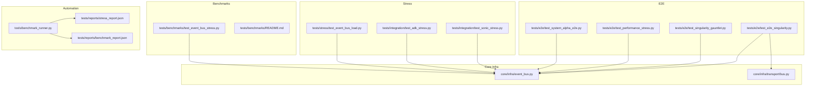
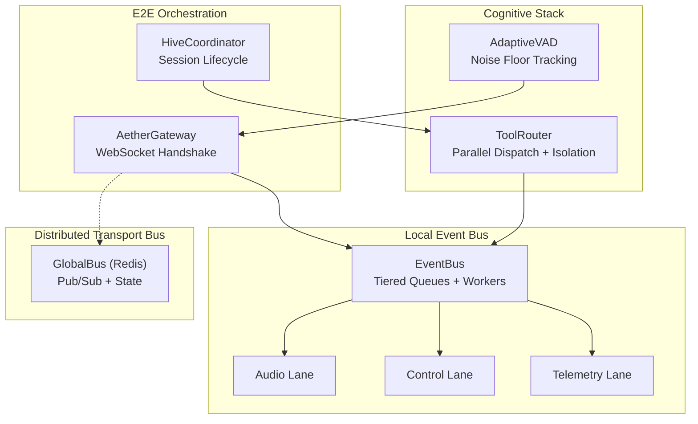
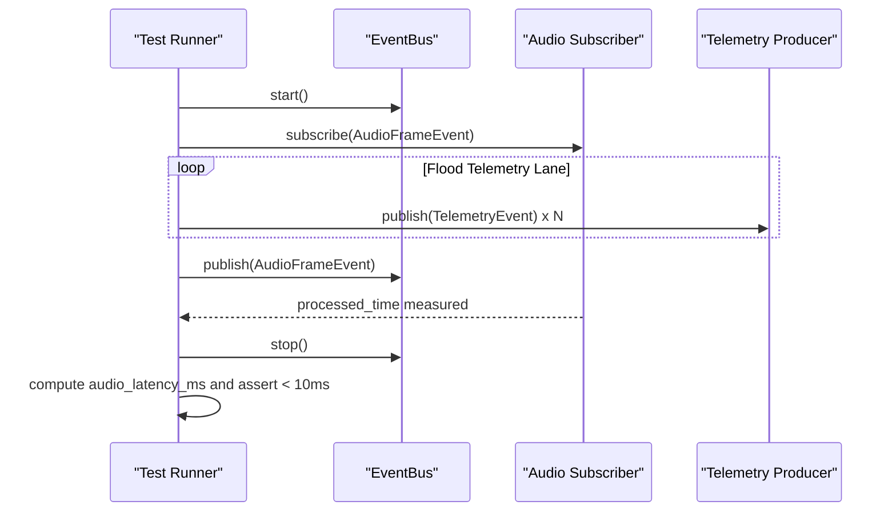
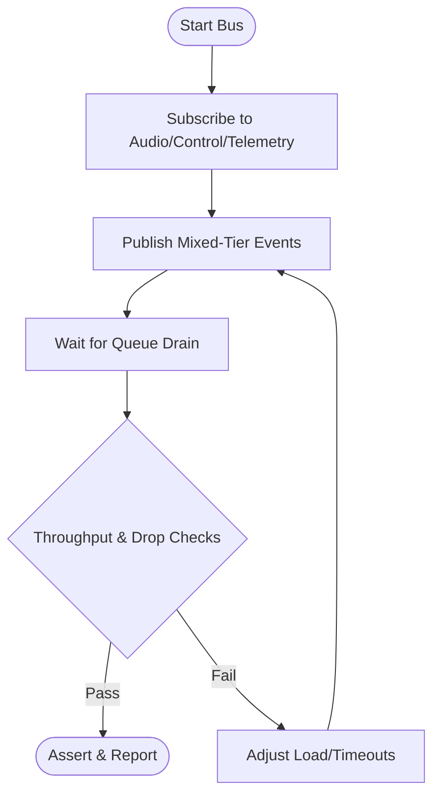
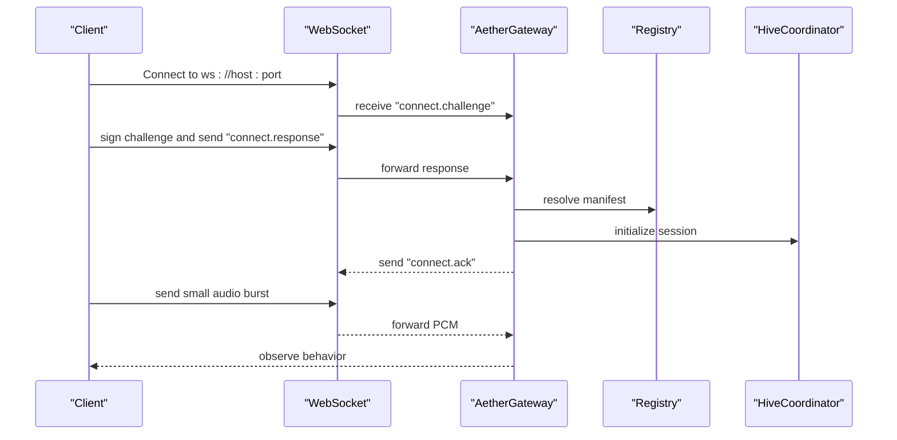
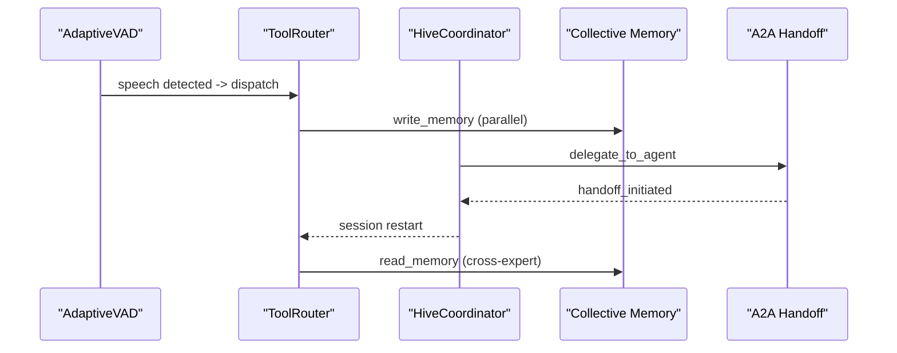

# Stress Testing

<cite>
**Referenced Files in This Document**
- [event_bus.py](file://core/infra/event_bus.py)
- [bus.py](file://core/infra/transport/bus.py)
- [test_event_bus_stress.py](file://tests/benchmarks/test_event_bus_stress.py)
- [test_event_bus_load.py](file://tests/stress/test_event_bus_load.py)
- [test_performance_stress.py](file://tests/e2e/test_performance_stress.py)
- [test_system_alpha_e2e.py](file://tests/e2e/test_system_alpha_e2e.py)
- [test_singularity_gauntlet.py](file://tests/e2e/test_singularity_gauntlet.py)
- [test_e2e_singularity.py](file://tests/e2e/test_e2e_singularity.py)
- [test_adk_stress.py](file://tests/integration/test_adk_stress.py)
- [test_sonic_stress.py](file://tests/integration/test_sonic_stress.py)
- [stress_report.json](file://tests/reports/stress_report.json)
- [benchmark_report.json](file://tests/reports/benchmark_report.json)
- [benchmark_runner.py](file://tools/benchmark_runner.py)
- [README.md](file://tests/benchmarks/README.md)
</cite>

## Table of Contents
1. [Introduction](#introduction)
2. [Project Structure](#project-structure)
3. [Core Components](#core-components)
4. [Architecture Overview](#architecture-overview)
5. [Detailed Component Analysis](#detailed-component-analysis)
6. [Dependency Analysis](#dependency-analysis)
7. [Performance Considerations](#performance-considerations)
8. [Troubleshooting Guide](#troubleshooting-guide)
9. [Conclusion](#conclusion)
10. [Appendices](#appendices)

## Introduction
This document describes stress testing methodologies for Aether Voice OS. It explains how the system behaves under extreme conditions and high load, focusing on:
- Event bus load testing and multi-lane isolation
- End-to-end system stress validations (System Alpha E2E and Singularity Gauntlet)
- Sustained load testing, concurrent user simulation, and resource exhaustion scenarios
- Automation, result analysis, and failure pattern identification
- Resilience testing, graceful degradation, and recovery mechanisms
- Practical guidance for planning, resource allocation, and interpreting outcomes

The goal is to enable reproducible, automated, and observable stress tests that reveal performance bottlenecks and validate system robustness across audio, transport, orchestration, and cognitive layers.

## Project Structure
Aether Voice OS organizes stress-related tests across three categories:
- Benchmarks: Focused micro-benchmarks for specific subsystems
- Stress: Intensive load tests against core components
- E2E: Full-system validations under realistic conditions



**Diagram sources**
- [test_event_bus_stress.py](file://tests/benchmarks/test_event_bus_stress.py#L1-L76)
- [test_event_bus_load.py](file://tests/stress/test_event_bus_load.py#L1-L70)
- [test_adk_stress.py](file://tests/integration/test_adk_stress.py#L1-L80)
- [test_sonic_stress.py](file://tests/integration/test_sonic_stress.py#L1-L77)
- [test_system_alpha_e2e.py](file://tests/e2e/test_system_alpha_e2e.py#L1-L187)
- [test_performance_stress.py](file://tests/e2e/test_performance_stress.py#L1-L139)
- [test_singularity_gauntlet.py](file://tests/e2e/test_singularity_gauntlet.py#L1-L112)
- [test_e2e_singularity.py](file://tests/e2e/test_e2e_singularity.py#L1-L213)
- [event_bus.py](file://core/infra/event_bus.py#L1-L152)
- [bus.py](file://core/infra/transport/bus.py#L1-L200)
- [stress_report.json](file://tests/reports/stress_report.json#L1-L6)
- [benchmark_report.json](file://tests/reports/benchmark_report.json#L1-L297)
- [benchmark_runner.py](file://tools/benchmark_runner.py#L41-L87)

**Section sources**
- [test_event_bus_stress.py](file://tests/benchmarks/test_event_bus_stress.py#L1-L76)
- [test_event_bus_load.py](file://tests/stress/test_event_bus_load.py#L1-L70)
- [test_adk_stress.py](file://tests/integration/test_adk_stress.py#L1-L80)
- [test_sonic_stress.py](file://tests/integration/test_sonic_stress.py#L1-L77)
- [test_system_alpha_e2e.py](file://tests/e2e/test_system_alpha_e2e.py#L1-L187)
- [test_performance_stress.py](file://tests/e2e/test_performance_stress.py#L1-L139)
- [test_singularity_gauntlet.py](file://tests/e2e/test_singularity_gauntlet.py#L1-L112)
- [test_e2e_singularity.py](file://tests/e2e/test_e2e_singularity.py#L1-L213)
- [event_bus.py](file://core/infra/event_bus.py#L1-L152)
- [bus.py](file://core/infra/transport/bus.py#L1-L200)
- [stress_report.json](file://tests/reports/stress_report.json#L1-L6)
- [benchmark_report.json](file://tests/reports/benchmark_report.json#L1-L297)
- [benchmark_runner.py](file://tools/benchmark_runner.py#L41-L87)
- [README.md](file://tests/benchmarks/README.md#L1-L55)

## Core Components
- Event Bus: Tiered, priority-aware event distribution with expiration and multi-worker lanes.
- Transport Bus: Global state and pub/sub layer using Redis for distributed coordination.
- Tool Router: Parallel dispatch and crash isolation for tool execution.
- Audio/VAD: Adaptive voice activity detection under noise ramps and stress.
- Gateway and Hive: End-to-end orchestration and session lifecycle under handshake and audio load.

Key implementation references:
- Event Bus model and workers: [event_bus.py](file://core/infra/event_bus.py#L69-L152)
- Transport Bus connectivity and pub/sub: [bus.py](file://core/infra/transport/bus.py#L53-L159)
- Tool Router stress and isolation: [test_adk_stress.py](file://tests/integration/test_adk_stress.py#L10-L80)
- VAD adaptation under noise: [test_sonic_stress.py](file://tests/integration/test_sonic_stress.py#L13-L31)

**Section sources**
- [event_bus.py](file://core/infra/event_bus.py#L1-L152)
- [bus.py](file://core/infra/transport/bus.py#L1-L200)
- [test_adk_stress.py](file://tests/integration/test_adk_stress.py#L1-L80)
- [test_sonic_stress.py](file://tests/integration/test_sonic_stress.py#L1-L77)

## Architecture Overview
The stress testing architecture spans local and distributed layers:
- Local event bus: Multi-lane queues with expiration and concurrency
- Distributed transport bus: Redis-backed pub/sub and state
- Cognitive stack: Tool router, VAD, and session orchestration
- E2E orchestration: Gateway handshake, audio ingestion, and telemetry



**Diagram sources**
- [event_bus.py](file://core/infra/event_bus.py#L69-L152)
- [bus.py](file://core/infra/transport/bus.py#L25-L200)
- [test_system_alpha_e2e.py](file://tests/e2e/test_system_alpha_e2e.py#L95-L103)
- [test_e2e_singularity.py](file://tests/e2e/test_e2e_singularity.py#L99-L101)

## Detailed Component Analysis

### Event Bus Load Testing and Lane Isolation
- Objective: Validate multi-lane isolation under high telemetry load and measure audio latency under pressure.
- Methodology:
  - Flood Telemetry lane with thousands of events while publishing a high-priority Audio frame mid-flood.
  - Measure end-to-end audio processing latency and ensure audio remains prioritized.
  - Assert sub-10ms audio latency under massive telemetry load.
- Key references:
  - Multi-lane isolation test: [test_event_bus_stress.py](file://tests/benchmarks/test_event_bus_stress.py#L8-L76)
  - Tiered event model and expiration: [event_bus.py](file://core/infra/event_bus.py#L69-L152)
  - Automated report generation: [stress_report.json](file://tests/reports/stress_report.json#L1-L6)



**Diagram sources**
- [test_event_bus_stress.py](file://tests/benchmarks/test_event_bus_stress.py#L9-L56)
- [event_bus.py](file://core/infra/event_bus.py#L102-L152)

**Section sources**
- [test_event_bus_stress.py](file://tests/benchmarks/test_event_bus_stress.py#L1-L76)
- [event_bus.py](file://core/infra/event_bus.py#L1-L152)
- [stress_report.json](file://tests/reports/stress_report.json#L1-L6)

### Sustained Load Testing and Throughput
- Objective: Validate sustained throughput and queue processing under extreme event rates.
- Methodology:
  - Publish mixed-tier events at high rate (e.g., 10k+ EPS) and measure actual EPS and drop rates.
  - Assert minimum throughput thresholds and near-zero drop counts in a clean environment.
- Key references:
  - 10k+ EPS stress: [test_event_bus_load.py](file://tests/stress/test_event_bus_load.py#L8-L67)
  - Event model and worker scheduling: [event_bus.py](file://core/infra/event_bus.py#L69-L152)



**Diagram sources**
- [test_event_bus_load.py](file://tests/stress/test_event_bus_load.py#L14-L54)
- [event_bus.py](file://core/infra/event_bus.py#L102-L152)

**Section sources**
- [test_event_bus_load.py](file://tests/stress/test_event_bus_load.py#L1-L70)
- [event_bus.py](file://core/infra/event_bus.py#L1-L152)

### Concurrent User Simulation and Handshake Latency
- Objective: Benchmark handshake latency and validate end-to-end audio ingestion under controlled load.
- Methodology:
  - Spin up a gateway with a temporary registry and mocked global bus to avoid external dependencies.
  - Perform repeated WebSocket handshake cycles and measure average latency.
  - Validate connect.ack reception and strict timeout handling.
- Key references:
  - Handshake latency benchmark: [test_performance_stress.py](file://tests/e2e/test_performance_stress.py#L51-L129)
  - E2E diagnostic probe: [test_system_alpha_e2e.py](file://tests/e2e/test_system_alpha_e2e.py#L61-L183)



**Diagram sources**
- [test_performance_stress.py](file://tests/e2e/test_performance_stress.py#L80-L122)
- [test_system_alpha_e2e.py](file://tests/e2e/test_system_alpha_e2e.py#L119-L167)

**Section sources**
- [test_performance_stress.py](file://tests/e2e/test_performance_stress.py#L1-L139)
- [test_system_alpha_e2e.py](file://tests/e2e/test_system_alpha_e2e.py#L1-L187)

### System Alpha Gauntlet Challenges
- Objective: Validate end-to-end protocol integrity and timing under diagnostic conditions.
- Coverage:
  - Protocol handshake and session establishment
  - Audio ingestion and VAD behavior
  - Strict timeouts and error propagation
- Key references:
  - Alpha E2E diagnostic: [test_system_alpha_e2e.py](file://tests/e2e/test_system_alpha_e2e.py#L61-L183)

**Section sources**
- [test_system_alpha_e2e.py](file://tests/e2e/test_system_alpha_e2e.py#L1-L187)

### Singularity Performance Tests
- Objective: Validate advanced system behaviors under expert-level integration stress.
- Coverage:
  - Parallel tool execution (System 2: Deliberative)
  - Semantic tool recovery (Neural Dispatcher V3)
  - A2A handoff protocol (ADK V3)
  - Adaptive VAD stability (System 1: Reflex)
- Key references:
  - Gauntlet tests: [test_singularity_gauntlet.py](file://tests/e2e/test_singularity_gauntlet.py#L24-L112)
  - E2E Singularity: [test_e2e_singularity.py](file://tests/e2e/test_e2e_singularity.py#L30-L213)



**Diagram sources**
- [test_singularity_gauntlet.py](file://tests/e2e/test_singularity_gauntlet.py#L24-L112)
- [test_e2e_singularity.py](file://tests/e2e/test_e2e_singularity.py#L109-L208)

**Section sources**
- [test_singularity_gauntlet.py](file://tests/e2e/test_singularity_gauntlet.py#L1-L112)
- [test_e2e_singularity.py](file://tests/e2e/test_e2e_singularity.py#L1-L213)

### Tool Router Stress and Crash Isolation
- Objective: Validate high-concurrency tool dispatch and resilience to individual failures.
- Methodology:
  - Register a fast tool and simulate 1000 concurrent calls.
  - Assert throughput, p99 latency, and correctness.
  - Verify crash isolation: a failing tool does not crash the router.
- Key references:
  - Router stress: [test_adk_stress.py](file://tests/integration/test_adk_stress.py#L10-L80)

**Section sources**
- [test_adk_stress.py](file://tests/integration/test_adk_stress.py#L1-L80)

### Adaptive VAD Noise Climb and Parallel Dispatch
- Objective: Validate VAD adaptation under noise ramps and parallel tool dispatch performance.
- Methodology:
  - Simulate rising noise floor and assert threshold increases.
  - Execute multiple tool calls in parallel and compare to sequential duration.
- Key references:
  - VAD adaptation: [test_sonic_stress.py](file://tests/integration/test_sonic_stress.py#L13-L31)
  - Parallel dispatch: [test_sonic_stress.py](file://tests/integration/test_sonic_stress.py#L34-L77)

**Section sources**
- [test_sonic_stress.py](file://tests/integration/test_sonic_stress.py#L1-L77)

## Dependency Analysis
Stress tests depend on core infrastructure components and produce consolidated reports.

```mermaid
graph LR
TEB["test_event_bus_stress.py"] --> EB["event_bus.py"]
TEL["test_event_bus_load.py"] --> EB
TAS["test_adk_stress.py"] --> EB
TSS["test_sonic_stress.py"] --> EB
TSA["test_system_alpha_e2e.py"] --> EB
TPS["test_performance_stress.py"] --> EB
TSG["test_singularity_gauntlet.py"] --> EB
TES["test_e2e_singularity.py"] --> EB
TES --> GB["bus.py"]
BR["benchmark_report.json"] <-- RUN["benchmark_runner.py"] --> SR["stress_report.json"]
```

**Diagram sources**
- [test_event_bus_stress.py](file://tests/benchmarks/test_event_bus_stress.py#L1-L76)
- [test_event_bus_load.py](file://tests/stress/test_event_bus_load.py#L1-L70)
- [test_adk_stress.py](file://tests/integration/test_adk_stress.py#L1-L80)
- [test_sonic_stress.py](file://tests/integration/test_sonic_stress.py#L1-L77)
- [test_system_alpha_e2e.py](file://tests/e2e/test_system_alpha_e2e.py#L1-L187)
- [test_performance_stress.py](file://tests/e2e/test_performance_stress.py#L1-L139)
- [test_singularity_gauntlet.py](file://tests/e2e/test_singularity_gauntlet.py#L1-L112)
- [test_e2e_singularity.py](file://tests/e2e/test_e2e_singularity.py#L1-L213)
- [event_bus.py](file://core/infra/event_bus.py#L1-L152)
- [bus.py](file://core/infra/transport/bus.py#L1-L200)
- [benchmark_report.json](file://tests/reports/benchmark_report.json#L1-L297)
- [benchmark_runner.py](file://tools/benchmark_runner.py#L41-L87)
- [stress_report.json](file://tests/reports/stress_report.json#L1-L6)

**Section sources**
- [benchmark_runner.py](file://tools/benchmark_runner.py#L41-L87)
- [benchmark_report.json](file://tests/reports/benchmark_report.json#L1-L297)
- [stress_report.json](file://tests/reports/stress_report.json#L1-L6)

## Performance Considerations
- Event Bus
  - Tiered queues prevent priority inversion; ensure workers are alive and callbacks are non-blocking.
  - Use expiration to drop stale events in Telemetry lane; monitor dropped counts under load.
- Transport Bus
  - Redis connectivity is optional in tests; mock or skip when unavailable to keep tests deterministic.
- Tool Router
  - Parallel dispatch improves throughput; isolate failures to avoid cascading errors.
- Audio/VAD
  - Adaptive thresholds must track noise floors; validate under simulated environmental changes.
- E2E Orchestration
  - Strict timeouts protect against protocol hangs; ensure cleanup tasks cancel cleanly.

[No sources needed since this section provides general guidance]

## Troubleshooting Guide
Common issues and remedies:
- Redis Unavailable
  - Symptom: GlobalBus connect fails.
  - Action: Skip distributed tests or mock connector; see transport bus connectivity checks.
  - Reference: [bus.py](file://core/infra/transport/bus.py#L53-L79)
- Excessive Event Drops
  - Symptom: Telemetry drops increase under load.
  - Action: Increase worker capacity, reduce event size, or tune latency budgets.
  - Reference: [event_bus.py](file://core/infra/event_bus.py#L126-L143)
- Router Crashes Under Failure
  - Symptom: Single failing tool crashes router.
  - Action: Use crash isolation assertions and error wrapping.
  - Reference: [test_adk_stress.py](file://tests/integration/test_adk_stress.py#L56-L80)
- Protocol Hangs
  - Symptom: WebSocket handshake or session stalls.
  - Action: Enforce timeouts and validate connect.ack/error messages.
  - Reference: [test_system_alpha_e2e.py](file://tests/e2e/test_system_alpha_e2e.py#L119-L174)

**Section sources**
- [bus.py](file://core/infra/transport/bus.py#L53-L79)
- [event_bus.py](file://core/infra/event_bus.py#L126-L143)
- [test_adk_stress.py](file://tests/integration/test_adk_stress.py#L56-L80)
- [test_system_alpha_e2e.py](file://tests/e2e/test_system_alpha_e2e.py#L119-L174)

## Conclusion
Aether Voice OS employs a layered stress testing strategy:
- Micro-benchmarks validate event bus isolation and throughput
- Integration tests stress tool dispatch and VAD adaptation
- E2E tests validate end-to-end protocols and session lifecycles
- Automation consolidates results into unified reports for analysis

This approach enables reproducible, observable, and actionable insights into system behavior under pressure, supporting optimization and resilience hardening.

[No sources needed since this section summarizes without analyzing specific files]

## Appendices

### Stress Test Execution Examples
- Run event bus lane isolation:
  - Command: pytest tests/benchmarks/test_event_bus_stress.py -v
  - Expected: Audio latency under 10ms; report written to tests/reports/stress_report.json
  - References: [test_event_bus_stress.py](file://tests/benchmarks/test_event_bus_stress.py#L8-L76), [stress_report.json](file://tests/reports/stress_report.json#L1-L6)
- Run sustained load test:
  - Command: pytest tests/stress/test_event_bus_load.py -v
  - Expected: Throughput > 1000 EPS and minimal drops; inspect printed metrics
  - References: [test_event_bus_load.py](file://tests/stress/test_event_bus_load.py#L8-L67)
- Run handshake latency benchmark:
  - Command: pytest tests/e2e/test_performance_stress.py::test_handshake_latency -v
  - Expected: Average handshake latency < 200ms
  - References: [test_performance_stress.py](file://tests/e2e/test_performance_stress.py#L51-L129)
- Run Singularity Gauntlet:
  - Command: pytest tests/e2e/test_singularity_gauntlet.py -v
  - Expected: Parallel tool execution, semantic recovery, and VAD stability passes
  - References: [test_singularity_gauntlet.py](file://tests/e2e/test_singularity_gauntlet.py#L24-L112)
- Run E2E Singularity:
  - Command: pytest tests/e2e/test_e2e_singularity.py -v
  - Expected: Handoff and cross-expert memory retrieval succeed
  - References: [test_e2e_singularity.py](file://tests/e2e/test_e2e_singularity.py#L30-L213)

### Monitoring and Result Analysis
- Consolidated benchmark report:
  - Script: tools/benchmark_runner.py
  - Output: tests/reports/benchmark_report.json
  - References: [benchmark_runner.py](file://tools/benchmark_runner.py#L41-L87), [benchmark_report.json](file://tests/reports/benchmark_report.json#L1-L297)
- Benchmark guidance:
  - Benchmarks README outlines targets and execution steps
  - References: [README.md](file://tests/benchmarks/README.md#L1-L55)

### Resilience and Recovery
- Crash isolation in ToolRouter ensures single failures do not bring down the system
  - References: [test_adk_stress.py](file://tests/integration/test_adk_stress.py#L56-L80)
- Transport Bus fallback: Redis availability is optional; tests can be adapted accordingly
  - References: [bus.py](file://core/infra/transport/bus.py#L53-L79)

**Section sources**
- [test_event_bus_stress.py](file://tests/benchmarks/test_event_bus_stress.py#L1-L76)
- [test_event_bus_load.py](file://tests/stress/test_event_bus_load.py#L1-L70)
- [test_performance_stress.py](file://tests/e2e/test_performance_stress.py#L1-L139)
- [test_singularity_gauntlet.py](file://tests/e2e/test_singularity_gauntlet.py#L1-L112)
- [test_e2e_singularity.py](file://tests/e2e/test_e2e_singularity.py#L1-L213)
- [benchmark_runner.py](file://tools/benchmark_runner.py#L41-L87)
- [benchmark_report.json](file://tests/reports/benchmark_report.json#L1-L297)
- [README.md](file://tests/benchmarks/README.md#L1-L55)
- [bus.py](file://core/infra/transport/bus.py#L53-L79)
- [test_adk_stress.py](file://tests/integration/test_adk_stress.py#L1-L80)