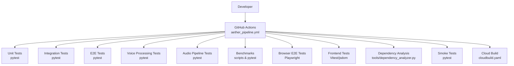
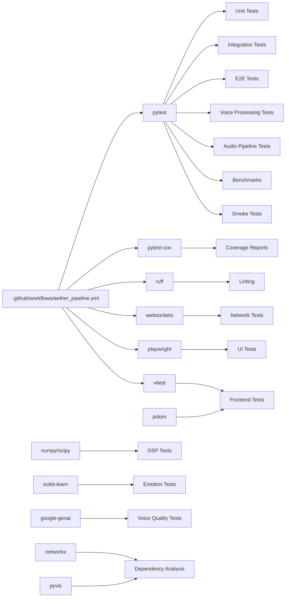

# Testing Strategy and Framework

<cite>
**Referenced Files in This Document**
- [conftest.py](file://conftest.py)
- [pyproject.toml](file://pyproject.toml)
- [requirements.txt](file://requirements.txt)
- [.github/workflows/aether_pipeline.yml](file://.github/workflows/aether_pipeline.yml)
- [cloudbuild.yaml](file://cloudbuild.yaml)
- [tests/unit/test_core.py](file://tests/unit/test_core.py)
- [tests/unit/test_gateway.py](file://tests/unit/test_gateway.py)
- [tests/benchmarks/bench_dsp.py](file://tests/benchmarks/bench_dsp.py)
- [tests/e2e/test_system_alpha_e2e.py](file://tests/e2e/test_system_alpha_e2e.py)
- [tests/e2e/test_browser_voice_e2e.py](file://tests/e2e/test_browser_voice_e2e.py)
- [tests/integration/test_gateway_e2e.py](file://tests/integration/test_gateway_e2e.py)
- [tests/unit/test_voice_processing_comprehensive.py](file://tests/unit/test_voice_processing_comprehensive.py)
- [tests/benchmarks/voice_quality_benchmark.py](file://tests/benchmarks/voice_quality_benchmark.py)
- [tests/unit/test_vad.py](file://tests/unit/test_vad.py)
- [tests/unit/test_dynamic_aec.py](file://tests/unit/test_dynamic_aec.py)
- [tests/unit/test_paralinguistics.py](file://tests/unit/test_paralinguistics.py)
- [tests/unit/test_jitter_buffer.py](file://tests/unit/test_jitter_buffer.py)
- [tests/unit/test_smooth_muter.py](file://tests/unit/test_smooth_muter.py)
- [tests/test_benchmark_framework.py](file://tests/test_benchmark_framework.py)
- [apps/portal/src/__tests__/smoke.test.ts](file://apps/portal/src/__tests__/smoke.test.ts)
- [apps/portal/src/__tests__/benchmark.test.ts](file://apps/portal/src/__tests__/benchmark.test.ts)
- [apps/portal/src/__tests__/geminiLive.integration.test.ts](file://apps/portal/src/__tests__/geminiLive.integration.test.ts)
- [apps/portal/src/__tests__/orbRender.test.tsx](file://apps/portal/src/__tests__/orbRender.test.tsx)
- [apps/portal/src/__tests__/useAetherStore.test.ts](file://apps/portal/src/__tests__/useAetherStore.test.ts)
- [apps/portal/src/__tests__/utils/TestAudioGenerator.ts](file://apps/portal/src/__tests__/utils/TestAudioGenerator.ts)
- [apps/portal/package.json](file://apps/portal/package.json)
- [apps/portal/vitest.config.ts](file://apps/portal/vitest.config.ts)
- [core/audio/vad.py](file://core/audio/vad.py)
- [core/audio/dynamic_aec.py](file://core/audio/dynamic_aec.py)
- [core/audio/echo_guard.py](file://core/audio/echo_guard.py)
- [core/audio/paralinguistics.py](file://core/audio/paralinguistics.py)
- [core/audio/jitter_buffer.py](file://core/audio/jitter_buffer.py)
- [core/audio/capture.py](file://core/audio/capture.py)
- [tools/dependency_analyzer.py](file://tools/dependency_analyzer.py)
</cite>

## Update Summary
**Changes Made**
- Added comprehensive browser testing infrastructure with Playwright for end-to-end UI validation
- Expanded testing coverage to include full Next.js portal browser validation with screen recording
- Enhanced testing framework with new TypeScript/React test suites for UI components
- Integrated Vitest with jsdom environment for frontend component testing
- Added specialized audio pipeline testing utilities for browser environments
- Updated CI pipeline to support browser testing infrastructure

## Table of Contents
1. [Introduction](#introduction)
2. [Project Structure](#project-structure)
3. [Core Components](#core-components)
4. [Architecture Overview](#architecture-overview)
5. [Detailed Component Analysis](#detailed-component-analysis)
6. [Enhanced Audio Pipeline Testing](#enhanced-audio-pipeline-testing)
7. [Advanced AEC Convergence Testing](#advanced-aec-convergence-testing)
8. [Voice Processing Testing Infrastructure](#voice-processing-testing-infrastructure)
9. [Browser Testing Infrastructure](#browser-testing-infrastructure)
10. [Frontend Testing Framework](#frontend-testing-framework)
11. [Benchmarking Strategy](#benchmarking-strategy)
12. [Smoke Testing Framework](#smoke-testing-framework)
13. [Dependency Analysis](#dependency-analysis)
14. [Performance Considerations](#performance-considerations)
15. [Troubleshooting Guide](#troubleshooting-guide)
16. [Conclusion](#conclusion)
17. [Appendices](#appendices)

## Introduction
This document describes the Aether Voice OS testing strategy and framework. It explains the overall testing philosophy, the test pyramid approach, and how unit, integration, end-to-end (E2E), and benchmark tests collaborate. The framework has been significantly enhanced with comprehensive voice processing testing infrastructure covering VAD, AEC, EchoGuard, and paralinguistic emotion detection, advanced benchmarking capabilities, specialized audio pipeline testing, architectural dependency analysis tools, and comprehensive browser testing infrastructure with Playwright for end-to-end UI validation.

## Project Structure
The repository organizes tests by type and domain with expanded coverage:
- Unit tests under tests/unit/, covering core modules, audio processing, tools, and transports
- Integration tests under tests/integration/, validating cross-module behavior and protocols
- End-to-end tests under tests/e2e/, exercising full system flows with minimal mocking
- Benchmarks under tests/benchmarks/, measuring performance for DSP and system components
- Voice processing tests under tests/unit/test_voice_processing_comprehensive.py for expert-level testing
- Audio pipeline tests for jitter buffer and smooth muter functionality
- Browser testing infrastructure under tests/e2e/test_browser_voice_e2e.py for comprehensive UI validation
- Frontend test suites under apps/portal/src/__tests__/ for React/TypeScript component testing
- Benchmark framework tests under tests/test_benchmark_framework.py for interactive benchmark validation
- Dependency analysis tools under tools/ for architectural validation
- Additional focused tests under the root of tests/ for specialized scenarios
- UI smoke tests under apps/portal/src/__tests__/ for component validation

```mermaid
graph TB
subgraph "Tests"
U["Unit Tests<br/>tests/unit/*.py"]
I["Integration Tests<br/>tests/integration/*.py"]
E["E2E Tests<br/>tests/e2e/*.py"]
B["Benchmarks<br/>tests/benchmarks/*.py"]
VP["Voice Processing<br/>tests/unit/test_voice_processing_comprehensive.py"]
AP["Audio Pipeline<br/>tests/unit/test_jitter_buffer.py & test_smooth_muter.py"]
BF["Benchmark Framework<br/>tests/test_benchmark_framework.py"]
DA["Dependency Analysis<br/>tools/dependency_analyzer.py"]
BE["Browser E2E<br/>tests/e2e/test_browser_voice_e2e.py"]
FT["Frontend Tests<br/>apps/portal/src/__tests__/*.ts"]
SM["Smoke Tests<br/>apps/portal/src/__tests__/*.ts"]
R["Reports<br/>tests/reports/*.json"]
end
subgraph "Core Audio Modules"
VAD["VAD<br/>core/audio/vad.py"]
AEC["AEC<br/>core/audio/dynamic_aec.py"]
JB["Jitter Buffer<br/>core/audio/jitter_buffer.py"]
SMU["Smooth Muter<br/>core/audio/capture.py"]
EG["EchoGuard<br/>core/audio/echo_guard.py"]
PA["Paralinguistics<br/>core/audio/paralinguistics.py"]
end
U --> VAD
U --> AEC
U --> JB
U --> SMU
U --> EG
U --> PA
VP --> VAD
VP --> AEC
VP --> EG
VP --> PA
AP --> JB
AP --> SMU
B --> VAD
B --> AEC
B --> PA
BE --> FT
FT --> BE
```

**Diagram sources**
- [tests/unit/test_voice_processing_comprehensive.py](file://tests/unit/test_voice_processing_comprehensive.py#L1-L922)
- [tests/unit/test_jitter_buffer.py](file://tests/unit/test_jitter_buffer.py#L1-L56)
- [tests/unit/test_smooth_muter.py](file://tests/unit/test_smooth_muter.py#L1-L193)
- [tests/benchmarks/voice_quality_benchmark.py](file://tests/benchmarks/voice_quality_benchmark.py#L1-L906)
- [tests/e2e/test_browser_voice_e2e.py](file://tests/e2e/test_browser_voice_e2e.py#L1-L333)
- [apps/portal/src/__tests__/benchmark.test.ts](file://apps/portal/src/__tests__/benchmark.test.ts#L1-L130)
- [apps/portal/src/__tests__/useAetherStore.test.ts](file://apps/portal/src/__tests__/useAetherStore.test.ts#L1-L205)
- [core/audio/vad.py](file://core/audio/vad.py#L1-L89)
- [core/audio/dynamic_aec.py](file://core/audio/dynamic_aec.py#L1-L861)
- [core/audio/jitter_buffer.py](file://core/audio/jitter_buffer.py#L1-L67)
- [core/audio/capture.py](file://core/audio/capture.py#L108-L193)
- [core/audio/echo_guard.py](file://core/audio/echo_guard.py#L1-L111)
- [core/audio/paralinguistics.py](file://core/audio/paralinguistics.py#L1-L214)

**Section sources**
- [tests/unit/test_voice_processing_comprehensive.py](file://tests/unit/test_voice_processing_comprehensive.py#L1-L922)
- [tests/unit/test_jitter_buffer.py](file://tests/unit/test_jitter_buffer.py#L1-L56)
- [tests/unit/test_smooth_muter.py](file://tests/unit/test_smooth_muter.py#L1-L193)
- [tests/benchmarks/voice_quality_benchmark.py](file://tests/benchmarks/voice_quality_benchmark.py#L1-L906)
- [tests/test_benchmark_framework.py](file://tests/test_benchmark_framework.py#L1-L147)
- [apps/portal/src/__tests__/smoke.test.ts](file://apps/portal/src/__tests__/smoke.test.ts#L1-L13)
- [apps/portal/src/__tests__/benchmark.test.ts](file://apps/portal/src/__tests__/benchmark.test.ts#L1-L130)
- [apps/portal/src/__tests__/geminiLive.integration.test.ts](file://apps/portal/src/__tests__/geminiLive.integration.test.ts#L1-L263)
- [apps/portal/src/__tests__/orbRender.test.tsx](file://apps/portal/src/__tests__/orbRender.test.tsx#L1-L46)
- [apps/portal/src/__tests__/useAetherStore.test.ts](file://apps/portal/src/__tests__/useAetherStore.test.ts#L1-L205)
- [apps/portal/src/__tests__/utils/TestAudioGenerator.ts](file://apps/portal/src/__tests__/utils/TestAudioGenerator.ts#L1-L192)
- [tools/dependency_analyzer.py](file://tools/dependency_analyzer.py#L1-L179)

## Core Components
- Pytest configuration and collection:
  - Root collection ignores non-Python artifacts and excludes large subtrees to keep test runs fast and focused
  - Project-wide pytest settings define test paths, async mode, and ignored directories
- Continuous Integration:
  - GitHub Actions pipeline runs linting, installs system dependencies, installs Python dependencies, executes tests with coverage, and validates core imports
  - Cloud Build deploys images and runs optional security checks in parallel stages
- Test Infrastructure:
  - Unit tests extensively use pytest fixtures and mocks to isolate components and simulate external systems
  - Integration and E2E tests exercise real protocols and network stacks while controlling environment variables and dependencies
  - Voice processing tests implement expert-level comprehensive testing with synthetic signal generation and performance benchmarking
  - Audio pipeline tests validate jitter buffer stability and smooth muter functionality with precise timing control
  - Browser testing infrastructure uses Playwright for comprehensive end-to-end UI validation with screen recording
  - Frontend testing framework uses Vitest with jsdom for React/TypeScript component testing
  - Benchmark framework tests validate interactive benchmark components without requiring real audio hardware
  - Dependency analyzer tool provides architectural insights and circular dependency detection

**Section sources**
- [conftest.py](file://conftest.py#L1-L10)
- [pyproject.toml](file://pyproject.toml#L1-L21)
- [.github/workflows/aether_pipeline.yml](file://.github/workflows/aether_pipeline.yml#L1-L160)
- [requirements.txt](file://requirements.txt#L1-L52)
- [cloudbuild.yaml](file://cloudbuild.yaml#L1-L55)

## Architecture Overview
The testing architecture aligns with a layered test pyramid expanded to include comprehensive voice processing validation, specialized audio pipeline testing, browser testing infrastructure, and frontend component testing:
- Unit tests: Fast, deterministic, and isolated. They validate individual modules (config, audio processing, tools, transport)
- Integration tests: Validate interactions between modules and protocols (e.g., gateway handshake, tool routing)
- E2E tests: Exercise full system flows with real clients and servers, focusing on protocol correctness and observable behavior
- Voice processing tests: Expert-level comprehensive testing covering VAD accuracy, AEC effectiveness, EchoGuard performance, and emotion detection reliability
- Audio pipeline tests: Specialized validation of jitter buffer stability, smooth muter functionality, and real-time audio processing
- Browser testing: Comprehensive end-to-end validation of the Next.js portal UI with Playwright, including screen recording and performance metrics
- Frontend testing: React/TypeScript component testing with Vitest and jsdom for UI validation and performance benchmarking
- Benchmark tests: Measure performance of critical paths (DSP, system latency) and inform optimization decisions using both synthetic and real-world scenarios
- Dependency analysis: Architectural validation and circular dependency detection for system-wide health assessment
- Smoke tests: Validate basic functionality and component health without extensive resource requirements

**Diagram sources**
- [.github/workflows/aether_pipeline.yml](file://.github/workflows/aether_pipeline.yml#L61-L101)
- [cloudbuild.yaml](file://cloudbuild.yaml#L1-L55)

## Detailed Component Analysis

### Pytest Configuration and Fixtures
- Configuration:
  - Root conftest sets sys.path and ignores non-relevant directories to streamline collection
  - pyproject.toml defines test paths, async mode, and norecursedirs to exclude large subtrees
- Fixtures:
  - Unit tests commonly use module-level imports and mocks to isolate dependencies
  - Integration/E2E tests define fixtures to construct and manage server lifecycles, mock external services, and inject deterministic configurations
  - Voice processing tests implement custom fixtures for audio signal generation and analysis components
  - Audio pipeline tests use precise timing fixtures and synthetic signal generators for jitter buffer and smooth muter validation
  - Browser testing fixtures manage Playwright browser contexts and Next.js server lifecycle
  - Frontend test fixtures use jsdom environment for React component testing

Examples of fixture usage and patterns:
- Gateway fixture constructs a configured gateway instance, injects a mock bus, and manages lifecycle tasks
- Mocked signatures and tool routers enable handshake and routing validations without external dependencies
- Voice processing fixtures create audio analyzers, AEC instances, and synthetic signal generators
- Audio pipeline fixtures provide controlled timing and signal generation for real-time validation
- Browser testing fixtures launch Chromium with video recording and fake media permissions
- Frontend test fixtures use jsdom for React component rendering and testing

**Section sources**
- [conftest.py](file://conftest.py#L1-L10)
- [pyproject.toml](file://pyproject.toml#L1-L21)
- [tests/unit/test_gateway.py](file://tests/unit/test_gateway.py#L31-L81)
- [tests/unit/test_voice_processing_comprehensive.py](file://tests/unit/test_voice_processing_comprehensive.py#L183-L301)
- [tests/unit/test_jitter_buffer.py](file://tests/unit/test_jitter_buffer.py#L8-L25)
- [tests/unit/test_smooth_muter.py](file://tests/unit/test_smooth_muter.py#L12-L16)
- [tests/e2e/test_browser_voice_e2e.py](file://tests/e2e/test_browser_voice_e2e.py#L64-L107)
- [apps/portal/vitest.config.ts](file://apps/portal/vitest.config.ts#L4-L10)

### Unit Testing Strategy
- Coverage focus:
  - CI enforces coverage over core/, ensuring critical modules are tested
- Typical patterns:
  - Class-per-feature with method-per-scenario
  - Extensive use of assertions on defaults, enums, and edge cases
  - Mocking external libraries (e.g., firebase, audio devices) to avoid flakiness
- Voice processing unit tests:
  - Specialized tests for VAD components including adaptive behavior and threshold detection
  - AEC tests validating convergence, double-talk detection, and echo suppression effectiveness
  - Paralinguistic analysis tests for pitch estimation and feature extraction accuracy
- Audio pipeline unit tests:
  - Jitter buffer tests validating burst handling, underrun protection, and overflow management
  - Smooth muter tests ensuring click-free transitions and precise timing control
- Browser testing unit tests:
  - Playwright integration tests for UI component validation
  - Next.js server lifecycle management during testing
  - Screen recording and video capture validation

Example patterns:
- Configuration validation and defaults
- Audio processing correctness (ring buffers, VAD, zero-crossing)
- Tool declarations and handlers
- Offline behavior for cloud-dependent components
- State machine transitions and tool router registration
- VAD accuracy testing with synthetic silence and speech signals
- AEC effectiveness testing with echo simulation and noise injection
- Jitter buffer stability under bursty network conditions
- Smooth muter functionality with precise ramp control
- Browser UI validation and performance metrics
- Frontend component rendering and state management

**Section sources**
- [tests/unit/test_core.py](file://tests/unit/test_core.py#L28-L502)
- [tests/unit/test_gateway.py](file://tests/unit/test_gateway.py#L31-L81)
- [tests/unit/test_vad.py](file://tests/unit/test_vad.py#L1-L141)
- [tests/unit/test_dynamic_aec.py](file://tests/unit/test_dynamic_aec.py#L1-L200)
- [tests/unit/test_paralinguistics.py](file://tests/unit/test_paralinguistics.py#L1-L87)
- [tests/unit/test_jitter_buffer.py](file://tests/unit/test_jitter_buffer.py#L8-L56)
- [tests/unit/test_smooth_muter.py](file://tests/unit/test_smooth_muter.py#L12-L193)
- [tests/e2e/test_browser_voice_e2e.py](file://tests/e2e/test_browser_voice_e2e.py#L109-L285)

### Integration Testing Strategy
- Focus areas:
  - Protocol-level validation (handshake, heartbeat, pruning, broadcasting)
  - Cross-module interactions (gateway, hive, tool router)
- Techniques:
  - Real WebSocket connections with controlled timeouts
  - Deterministic configurations and mocked external dependencies to stabilize outcomes

Example patterns:
- Ed25519 handshake verification
- Heartbeat tick and pong handling
- Client pruning after missed ticks
- Broadcast delivery to multiple clients

**Section sources**
- [tests/unit/test_gateway.py](file://tests/unit/test_gateway.py#L83-L198)
- [tests/integration/test_gateway_e2e.py](file://tests/integration/test_gateway_e2e.py#L66-L163)

### End-to-End (E2E) Testing Strategy
- Goals:
  - Validate full system behavior with real clients and servers
  - Detect protocol hangs and timing issues with granular logging and timeouts
- Techniques:
  - Minimal mocking to surface real failures
  - Strict timeouts per stage and structured logs for diagnosis
- Browser E2E Testing:
  - Comprehensive validation of Next.js portal UI lifecycle
  - Screen recording and video capture for visual regression testing
  - Performance metrics collection and analysis
  - Audio pipeline validation in browser environment

Example patterns:
- Full diagnostic cycle with registry, hive, and gateway
- Neural link probe verifying handshake and session establishment
- Browser UI navigation and component validation
- Audio context and media device capability testing
- Performance monitoring and error detection

**Section sources**
- [tests/e2e/test_system_alpha_e2e.py](file://tests/e2e/test_system_alpha_e2e.py#L60-L182)
- [tests/e2e/test_browser_voice_e2e.py](file://tests/e2e/test_browser_voice_e2e.py#L64-L333)
- [tests/integration/test_gateway_e2e.py](file://tests/integration/test_gateway_e2e.py#L66-L163)

## Enhanced Audio Pipeline Testing

### Jitter Buffer Testing
The framework now includes comprehensive jitter buffer testing that validates audio stream stability under bursty network conditions:

#### Test Categories and Coverage
- **Burst Stability**: Tests jitter buffer's ability to smooth out irregular packet arrivals while maintaining continuous audio output
- **Underrun Handling**: Validates proper silence generation when buffer runs dry
- **Overflow Management**: Ensures graceful handling of excessive data beyond maximum capacity
- **Latency Control**: Tests target and maximum latency configurations for optimal audio quality

#### Advanced Testing Features
- **Synthetic Burst Generation**: Creates realistic network jitter scenarios with varying arrival patterns
- **Timing Precision**: Validates exact sample-level processing without drift or accumulation errors
- **Memory Efficiency**: Tests buffer management without memory leaks or excessive allocations
- **Real-time Constraints**: Ensures deterministic behavior suitable for audio callback contexts

#### Test Data Models and Validation
- **AdaptiveJitterBuffer**: Core implementation validated through comprehensive test scenarios
- **Packet-level Processing**: Validates byte-level integrity and timing consistency
- **Buffer State Management**: Tests transition between buffering and streaming states

**Section sources**
- [tests/unit/test_jitter_buffer.py](file://tests/unit/test_jitter_buffer.py#L1-L56)
- [core/audio/capture.py](file://core/audio/capture.py#L37-L106)

### Smooth Muter Testing
The framework includes specialized testing for the smooth muter functionality that ensures click-free audio transitions:

#### Test Categories and Coverage
- **Initial State Validation**: Confirms pass-through operation when unmuted
- **Mute Ramp Testing**: Validates fade-out ramp with precise timing control
- **Unmute Ramp Testing**: Ensures smooth fade-in without audio artifacts
- **Ramp Parameter Effects**: Tests how ramp_samples affects transition speed
- **Click Prevention**: Validates smooth gain transitions to prevent audio pops/clicks

#### Advanced Testing Features
- **Precision Timing**: Uses exact sample counts for deterministic ramp validation
- **Signal Analysis**: Employs first-difference analysis to detect discontinuities
- **Parameter Sensitivity**: Tests ramp duration effects on transition quality
- **Boundary Condition Testing**: Validates edge cases at zero and full gain states

#### Test Data Models and Metrics
- **RAMP_SAMPLES Constant**: Defines precise ramp duration for deterministic testing
- **CHUNK_SIZE Optimization**: Uses smaller chunks for multi-step ramp validation
- **DC Signal Generation**: Creates controlled test signals for ramp analysis
- **Gain Transition Validation**: Ensures smooth exponential decay/increase curves

**Section sources**
- [tests/unit/test_smooth_muter.py](file://tests/unit/test_smooth_muter.py#L1-L193)
- [core/audio/capture.py](file://core/audio/capture.py#L108-L193)

## Advanced AEC Convergence Testing

### Enhanced AEC Convergence Validation
The framework provides comprehensive AEC convergence testing with improved synthetic signal validation:

#### Test Categories and Coverage
- **ERLE Improvement**: Validates echo return loss enhancement on synthetic echo signals
- **Convergence Timing**: Tests convergence within expected timeframes using controlled synthetic inputs
- **Double-talk Detection**: Validates simultaneous user and AI speech detection during overlap periods
- **Edge Case Handling**: Tests silence, clipping, and minimal frame processing without crashes
- **Step-size Adaptation**: Validates NLMS effective step-size behavior with varying input power

#### Advanced Testing Features
- **Synthetic Signal Generation**: Creates controlled echo scenarios with precise delay and attenuation parameters
- **Convergence Metrics**: Implements sophisticated convergence detection with progress tracking
- **Power-based Step-size**: Validates adaptive step-size behavior based on input signal characteristics
- **Frame Boundary Processing**: Ensures proper block processing aligned with filter length requirements

#### Test Data Models and Reporting
- **DynamicAEC Fixture**: Provides configurable AEC instance with adjustable parameters
- **Signal Generation Utilities**: Creates sine waves, delayed echoes, and mixed audio scenarios
- **State Tracking**: Monitors convergence progress, ERLE values, and double-talk detection
- **Performance Metrics**: Records processing latency and convergence timing statistics

**Section sources**
- [tests/unit/test_dynamic_aec.py](file://tests/unit/test_dynamic_aec.py#L1-L200)
- [core/audio/dynamic_aec.py](file://core/audio/dynamic_aec.py#L1-L861)

## Voice Processing Testing Infrastructure

### Comprehensive Voice Processing Tests
The framework now includes expert-level comprehensive voice processing tests that validate the entire audio pipeline:

#### Test Categories and Coverage
- **VAD (Voice Activity Detection)**: Tests accuracy on silence detection, speech detection, noisy environments, and latency requirements
- **AEC (Acoustic Echo Cancellation)**: Validates echo suppression effectiveness, double-talk detection, convergence behavior, and processing latency
- **EchoGuard (Thalamic Gate)**: Tests self-recognition, user recognition, and processing latency
- **Paralinguistic Emotion Detection**: Validates emotion classification accuracy across calm, alert, frustrated, and flow_state states
- **Performance and Memory**: Tests memory usage, sustained processing without leaks, and pipeline latency budgets
- **End-to-End Pipeline**: Validates complete audio processing chain performance and reliability

#### Advanced Testing Features
- **Synthetic Signal Generation**: Comprehensive utilities for generating speech-like signals, noise, echoes, and mixed audio scenarios
- **Performance Benchmarking**: Built-in latency measurement and statistical analysis for all components
- **Memory Profiling**: Tracemalloc integration for detecting memory leaks and optimizing resource usage
- **Recommendation Engine**: Automated suggestions for performance improvements based on test results
- **Real-time Processing Validation**: Tests for sustained processing loads and memory leak prevention

#### Test Data Models and Reporting
- **VoiceTestResult**: Structured results for individual test metrics with pass/fail status
- **VoiceTestSuite**: Aggregated results for complete test suites with pass rates and recommendations
- **Comprehensive Reporting**: Formatted test reports with detailed metrics and optimization suggestions

**Section sources**
- [tests/unit/test_voice_processing_comprehensive.py](file://tests/unit/test_voice_processing_comprehensive.py#L1-L922)

### Voice Quality Benchmark Suite
The benchmark suite provides comprehensive real-world voice quality assessment:

#### Benchmark Categories
- **Round-Trip Latency**: Measures end-to-end audio processing latency using Gemini Live API
- **Voice Quality Analysis**: Requests AI analysis of pipeline architecture and provides improvement suggestions
- **AEC Effectiveness**: Tests echo return loss enhancement under various noise conditions and SNR levels
- **Double-Talk Performance**: Validates simultaneous user and AI speech handling
- **Emotion Detection Accuracy**: Measures paralinguistic emotion classification F1-score
- **VAD Accuracy**: Tests voice activity detection classification accuracy
- **Thalamic Gate Latency**: Measures processing latency for echo cancellation

#### Real Audio Integration
- **Gemini Live API Integration**: Uses Google's Gemini API for real-time audio processing evaluation
- **Background Noise Simulation**: Generates cafe noise and keyboard noise for realistic testing scenarios
- **Multi-condition Testing**: Tests across different noise types, SNR levels, and environmental conditions
- **Automated Analysis**: Provides AI-generated suggestions for voice quality improvements

**Section sources**
- [tests/benchmarks/voice_quality_benchmark.py](file://tests/benchmarks/voice_quality_benchmark.py#L1-L906)

### Audio Processing Module Validation
Individual audio processing modules are validated through specialized unit tests:

#### VAD Testing
- **Adaptive Behavior**: Tests baseline adaptation and accuracy targets for silence and speech detection
- **Threshold Management**: Validates soft and hard thresholding with adaptive VAD
- **Silent Analysis**: Tests classification of different silence types (void, thinking, breathing)

#### AEC Testing
- **Convergence Validation**: Tests ERLE improvement and convergence behavior on synthetic echo signals
- **Double-talk Detection**: Validates simultaneous user and AI speech detection
- **Edge Case Handling**: Tests silence, clipping, and minimal frame processing without crashes

#### Paralinguistic Analysis Testing
- **Pitch Estimation**: Validates accuracy of fundamental frequency estimation on known sine waves
- **Feature Extraction**: Tests spectral centroid calculation and multi-harmonic signal behavior
- **Edge Cases**: Validates behavior on zero signals, maximum amplitude, and very short frames

**Section sources**
- [tests/unit/test_vad.py](file://tests/unit/test_vad.py#L1-L141)
- [tests/unit/test_dynamic_aec.py](file://tests/unit/test_dynamic_aec.py#L1-L200)
- [tests/unit/test_paralinguistics.py](file://tests/unit/test_paralinguistics.py#L1-L87)

## Browser Testing Infrastructure

### Comprehensive Browser E2E Testing
The framework now includes comprehensive browser testing infrastructure using Playwright for end-to-end validation of the Next.js portal UI:

#### Test Categories and Coverage
- **Portal Page Loading**: Validates main portal page (/) rendering and initial state
- **Live Voice Interface**: Tests /live route with quantum avatar and voice interface
- **Admin Dashboard**: Validates /admin route functionality and navigation
- **Audio Pipeline Initialization**: Tests Web Audio API and MediaDevices capabilities
- **UI Responsiveness**: Measures performance metrics and detects console errors
- **Navigation Flow**: Validates complete navigation sequence with screen recording
- **Screen Recording**: Captures video of entire browser interaction for visual regression testing

#### Advanced Testing Features
- **Playwright Integration**: Uses Chromium browser with headless mode and video recording
- **Fake Media Support**: Configures microphone permissions and fake media streams
- **Performance Monitoring**: Collects DOMContentLoaded, loadComplete, and transferSize metrics
- **Console Error Detection**: Automatically captures and reports JavaScript console errors
- **Screenshot Capture**: Saves visual snapshots at key testing stages
- **Server Lifecycle Management**: Starts/stops Next.js development server during tests

#### Test Data Models and Validation
- **Browser Context**: Manages Playwright browser sessions with recording capabilities
- **Performance Metrics**: Structured data collection for page load and interaction performance
- **Video Reports**: Generated video recordings with timestamps for debugging
- **Screenshot Archives**: Visual documentation of UI states and interactions

#### Browser Testing Workflow
- **Server Startup**: Launches Next.js dev server on dedicated port (3111)
- **Page Navigation**: Sequential navigation through main portal, live voice, and admin routes
- **Capability Testing**: Validates AudioContext and MediaDevices API support
- **Performance Measurement**: Collects and logs performance metrics for each page
- **Visual Documentation**: Captures screenshots and records video of complete flow
- **Results Reporting**: Generates JSON report with test results and artifact locations

**Section sources**
- [tests/e2e/test_browser_voice_e2e.py](file://tests/e2e/test_browser_voice_e2e.py#L1-L333)

### Browser Testing Dependencies and Configuration
The browser testing infrastructure relies on specific dependencies and configurations:

#### Dependencies
- **Playwright**: Core browser automation framework for Chromium
- **Next.js**: Development server for hosting the portal UI during testing
- **Node.js**: Runtime environment for running browser tests
- **Chromium**: Headless browser for automated testing

#### Configuration
- **Port Management**: Uses non-standard port (3111) to avoid conflicts with existing services
- **Video Recording**: Configured with 1280x720 resolution and dark color scheme
- **Permissions**: Grants microphone access for audio testing scenarios
- **Viewport Settings**: Sets consistent 1280x720 viewport for reproducible testing

**Section sources**
- [tests/e2e/test_browser_voice_e2e.py](file://tests/e2e/test_browser_voice_e2e.py#L34-L104)
- [requirements.txt](file://requirements.txt#L21-L41)

## Frontend Testing Framework

### React/TypeScript Component Testing
The framework includes comprehensive frontend testing using Vitest with jsdom for React/TypeScript component validation:

#### Test Categories and Coverage
- **Component Rendering**: Validates React component rendering and lifecycle
- **Store Integration**: Tests Zustand store integration and state management
- **Performance Benchmarking**: Measures component rendering and state update performance
- **Integration Testing**: Validates WebSocket connections and Gemini Live API integration
- **Audio Pipeline Testing**: Tests Web Audio API integration and mock utilities

#### Advanced Testing Features
- **jsdom Environment**: Provides DOM APIs for React component testing
- **Mock Utilities**: Comprehensive mock generation for Web Audio API and Three.js
- **Performance Metrics**: Built-in benchmarking for component performance
- **State Management Testing**: Validates Zustand store operations and state transitions
- **Integration Validation**: Tests real WebSocket connections with Gemini API

#### Test Data Models and Utilities
- **MockAudioContext**: Complete Web Audio API mock implementation
- **AudioLevelSimulator**: Simulates audio level changes over time
- **MockTranscript**: Generates realistic transcript message data
- **TestAudioGenerator**: Utility for creating synthetic audio test data
- **Store State Utilities**: Helper functions for testing Zustand store state

#### Frontend Testing Examples
- **AetherOrb Performance**: Tests component rendering and re-render optimization
- **useAetherStore Operations**: Validates store CRUD operations and state management
- **Gemini Live Integration**: Tests real WebSocket connections and message handling
- **Performance Benchmarks**: Measures encoding throughput and state mutation performance

**Section sources**
- [apps/portal/src/__tests__/benchmark.test.ts](file://apps/portal/src/__tests__/benchmark.test.ts#L1-L130)
- [apps/portal/src/__tests__/geminiLive.integration.test.ts](file://apps/portal/src/__tests__/geminiLive.integration.test.ts#L1-L263)
- [apps/portal/src/__tests__/orbRender.test.tsx](file://apps/portal/src/__tests__/orbRender.test.tsx#L1-L46)
- [apps/portal/src/__tests__/useAetherStore.test.ts](file://apps/portal/src/__tests__/useAetherStore.test.ts#L1-L205)
- [apps/portal/src/__tests__/utils/TestAudioGenerator.ts](file://apps/portal/src/__tests__/utils/TestAudioGenerator.ts#L1-L192)

### Frontend Testing Configuration
The frontend testing framework uses Vitest with specific configuration for optimal testing experience:

#### Configuration Details
- **Environment**: jsdom for DOM API support
- **Test Patterns**: Includes TypeScript and TSX files
- **Aliases**: Maps @ to src directory for clean imports
- **Global Setup**: Enables global test functions and utilities

#### Package Dependencies
- **Vitest**: Core testing framework with browser support
- **jsdom**: DOM environment for React component testing
- **@testing-library/react**: React testing utilities
- **@testing-library/jest-dom**: DOM testing matchers

**Section sources**
- [apps/portal/vitest.config.ts](file://apps/portal/vitest.config.ts#L1-L17)
- [apps/portal/package.json](file://apps/portal/package.json#L37-L54)

## Benchmarking Strategy
The testing framework includes comprehensive benchmarking capabilities:

### Benchmark Categories
- **DSP Performance**: Compares implementations between NumPy and Rust backends for audio processing functions
- **System Latency**: Measures critical path latencies for voice processing components
- **Voice Quality**: Real-world assessment using Gemini Live API for round-trip latency and quality metrics
- **Memory Usage**: Tracks peak memory consumption and leak detection for audio processing components
- **Frontend Performance**: Measures React component rendering and state management performance
- **Browser Performance**: Tests Next.js portal UI loading and interaction performance

### Benchmark Execution
- **Standalone Scripts**: Dedicated scripts for specific benchmark categories
- **Pytest Integration**: Benchmark tests can be executed through pytest for unified test management
- **Performance Regression Tracking**: Historical tracking of performance metrics to detect regressions
- **Statistical Analysis**: Comprehensive statistical analysis including averages, percentiles, and confidence intervals
- **Frontend Benchmarking**: Real performance measurements for React components and state operations

### Interactive Benchmark Framework
- **Dashboard Visualization**: Real-time performance monitoring and visualization
- **Parameter Control**: Dynamic adjustment of audio processing parameters during benchmarking
- **Scenario Testing**: Multiple predefined scenarios for different use cases and environments
- **Framework Validation**: Tests the benchmark framework itself to ensure reliability

**Section sources**
- [tests/benchmarks/bench_dsp.py](file://tests/benchmarks/bench_dsp.py#L76-L134)
- [tests/test_benchmark_framework.py](file://tests/test_benchmark_framework.py#L1-L147)
- [apps/portal/src/__tests__/benchmark.test.ts](file://apps/portal/src/__tests__/benchmark.test.ts#L14-L128)

## Smoke Testing Framework
The framework includes smoke testing for basic functionality validation:

### UI Smoke Tests
- **Component Rendering**: Basic validation that new UI components render correctly
- **Test Structure Validation**: Ensures testing framework is properly configured
- **Minimal Resource Usage**: Quick validation that doesn't require extensive resources

### Benchmark Framework Smoke Tests
- **Dashboard Functionality**: Validates interactive dashboard rendering and data display
- **Parameter Controller**: Tests dynamic parameter adjustment capabilities
- **Scenario Validation**: Ensures test scenarios are properly defined and accessible

### Browser Smoke Tests
- **Portal Navigation**: Validates basic navigation through main portal routes
- **Audio Capability Testing**: Tests Web Audio API and MediaDevices availability
- **Performance Baseline**: Establishes baseline performance metrics for UI components

**Section sources**
- [apps/portal/src/__tests__/smoke.test.ts](file://apps/portal/src/__tests__/smoke.test.ts#L1-L13)
- [tests/test_benchmark_framework.py](file://tests/test_benchmark_framework.py#L26-L98)
- [tests/e2e/test_browser_voice_e2e.py](file://tests/e2e/test_browser_voice_e2e.py#L109-L174)

## Dependency Analysis
The testing stack depends on:
- pytest and pytest-asyncio for test execution and async support
- pytest-cov for coverage reporting and gating
- playwright and websockets for browser and network tests
- ruff for linting/formatting
- bandit and safety for security checks
- numpy and scipy for audio signal processing and mathematical operations
- scikit-learn for machine learning-based emotion detection validation
- google-genai for real-world voice quality assessment integration
- networkx and pyvis for dependency graph visualization and analysis
- vitest and jsdom for frontend React/TypeScript component testing
- next.js for hosting the portal UI during browser testing

**Diagram sources**
- [requirements.txt](file://requirements.txt#L21-L41)
- [.github/workflows/aether_pipeline.yml](file://.github/workflows/aether_pipeline.yml#L47-L101)
- [tests/unit/test_voice_processing_comprehensive.py](file://tests/unit/test_voice_processing_comprehensive.py#L26-L27)
- [tests/benchmarks/voice_quality_benchmark.py](file://tests/benchmarks/voice_quality_benchmark.py#L32-L46)
- [tools/dependency_analyzer.py](file://tools/dependency_analyzer.py#L11-L18)
- [apps/portal/package.json](file://apps/portal/package.json#L37-L54)

**Section sources**
- [requirements.txt](file://requirements.txt#L1-L52)
- [.github/workflows/aether_pipeline.yml](file://.github/workflows/aether_pipeline.yml#L47-L101)

## Performance Considerations
- Benchmark-first mindset:
  - Use dedicated benchmark suites to compare implementations and track regressions
  - Control warm-up, iteration counts, and input sizes for reproducible results
- Profiling during tests:
  - Add timing instrumentation around hot paths using built-in latency measurement
  - Use perf counters and structured logs to isolate bottlenecks
  - Leverage tracemalloc for memory profiling in voice processing tests
- Asynchronous test design:
  - Favor asyncio-friendly designs to avoid artificial delays and flaky sleeps
  - Use timeouts and structured waits to keep tests responsive
- Voice-specific optimizations:
  - Synthetic signal generation for deterministic testing without external dependencies
  - Memory-efficient processing with bounded buffers and pre-allocation
  - Real-time processing validation with sustained load testing
- Audio pipeline optimizations:
  - Jitter buffer testing ensures stable audio delivery under network variability
  - Smooth muter validation prevents audio artifacts during state transitions
  - Precise timing control for real-time audio processing requirements
- Browser testing considerations:
  - Manage server lifecycle carefully to avoid port conflicts
  - Configure appropriate timeouts for browser startup and navigation
  - Use fake media streams to avoid hardware dependency in testing
- Frontend performance:
  - Use jsdom for efficient React component testing without browser overhead
  - Implement performance benchmarks for critical UI components
  - Validate state management performance with realistic data loads

## Troubleshooting Guide
Common issues and remedies:
- Collection ignores:
  - If tests are missing, confirm conftest ignores and pyproject.toml norecursedirs are appropriate for your environment
- Async test hangs:
  - Ensure fixtures properly manage task lifecycles and cancellations
  - Use explicit timeouts around network operations
- External dependency failures:
  - Mock or stub external services in unit tests to avoid flakiness
  - For integration/E2E, validate environment variables and ports
  - For voice quality benchmarks, ensure API keys are properly configured
  - For dependency analysis, ensure networkx and pyvis are installed for full functionality
  - For browser tests, ensure Playwright is properly installed and Chromium is available
  - For frontend tests, verify Vitest and jsdom dependencies are correctly configured
- Coverage failures:
  - Increase coverage for untested modules and ensure core imports remain valid
- Voice processing test failures:
  - Verify audio device availability for real audio tests
  - Check synthetic signal generation parameters for appropriate test conditions
  - Validate memory constraints for sustained processing tests
- Audio pipeline test failures:
  - Verify jitter buffer parameters match expected latency requirements
  - Check smooth muter ramp calculations for timing precision
  - Validate synthetic signal generation for audio callback testing
- Browser testing failures:
  - Ensure Next.js development server starts successfully on port 3111
  - Verify Playwright installation and Chromium availability
  - Check video recording permissions and disk space for artifact storage
  - Validate browser context configuration and viewport settings
- Frontend testing failures:
  - Ensure jsdom environment is properly configured for React testing
  - Verify Vitest configuration matches test file patterns
  - Check mock utilities for Web Audio API compatibility
  - Validate component imports and TypeScript configuration

**Section sources**
- [conftest.py](file://conftest.py#L6-L10)
- [pyproject.toml](file://pyproject.toml#L4-L4)
- [tests/unit/test_gateway.py](file://tests/unit/test_gateway.py#L71-L80)
- [tests/unit/test_voice_processing_comprehensive.py](file://tests/unit/test_voice_processing_comprehensive.py#L705-L846)
- [tests/unit/test_jitter_buffer.py](file://tests/unit/test_jitter_buffer.py#L8-L56)
- [tests/unit/test_smooth_muter.py](file://tests/unit/test_smooth_muter.py#L140-L193)
- [tests/e2e/test_browser_voice_e2e.py](file://tests/e2e/test_browser_voice_e2e.py#L70-L88)
- [apps/portal/vitest.config.ts](file://apps/portal/vitest.config.ts#L4-L10)
- [.github/workflows/aether_pipeline.yml](file://.github/workflows/aether_pipeline.yml#L90-L101)

## Conclusion
Aether Voice OS employs a robust, layered testing strategy that combines fast unit tests, reliable integration validations, realistic E2E probes, comprehensive voice processing validation, specialized audio pipeline testing, browser testing infrastructure, frontend component testing, and performance benchmarks. The enhanced framework now includes expert-level voice processing testing infrastructure covering VAD, AEC, EchoGuard, and paralinguistic emotion detection, advanced benchmarking capabilities, audio pipeline validation for jitter buffer and smooth muter functionality, architectural dependency analysis tools, comprehensive browser testing infrastructure with Playwright for end-to-end UI validation, and specialized frontend testing framework using Vitest and jsdom. The CI pipeline enforces quality gates, while fixtures and mocks enable deterministic, maintainable tests. By following the patterns and practices outlined here, contributors can write effective tests, debug efficiently, and sustain high-quality releases with comprehensive voice processing validation, architectural health monitoring, and robust browser testing infrastructure.

## Appendices

### How to Run Specific Test Suites
- Run all tests:
  - From the repository root, execute the pytest command configured in CI
- Run unit tests:
  - Target tests/unit/ to validate core modules and audio processing
- Run audio pipeline tests:
  - Execute tests/unit/test_jitter_buffer.py and tests/unit/test_smooth_muter.py for specialized audio pipeline validation
- Run voice processing tests:
  - Execute tests/unit/test_voice_processing_comprehensive.py for expert-level voice validation
- Run benchmark tests:
  - Execute tests/benchmarks/voice_quality_benchmark.py for real-world voice quality assessment
- Run smoke tests:
  - Execute apps/portal/src/__tests__/smoke.test.ts for UI component validation
- Run benchmark framework tests:
  - Execute tests/test_benchmark_framework.py for interactive benchmark validation
- Run browser E2E tests:
  - Execute tests/e2e/test_browser_voice_e2e.py for comprehensive UI validation
- Run frontend tests:
  - Execute apps/portal/src/__tests__/ for React/TypeScript component testing
- Run dependency analysis:
  - Execute tools/dependency_analyzer.py for architectural dependency analysis

**Section sources**
- [.github/workflows/aether_pipeline.yml](file://.github/workflows/aether_pipeline.yml#L90-L92)
- [pyproject.toml](file://pyproject.toml#L2-L2)
- [tests/unit/test_voice_processing_comprehensive.py](file://tests/unit/test_voice_processing_comprehensive.py#L919-L922)
- [tests/benchmarks/voice_quality_benchmark.py](file://tests/benchmarks/voice_quality_benchmark.py#L904-L906)
- [apps/portal/src/__tests__/smoke.test.ts](file://apps/portal/src/__tests__/smoke.test.ts#L9-L13)
- [tests/e2e/test_browser_voice_e2e.py](file://tests/e2e/test_browser_voice_e2e.py#L330-L333)
- [apps/portal/package.json](file://apps/portal/package.json#L10-L14)
- [tools/dependency_analyzer.py](file://tools/dependency_analyzer.py#L177-L179)

### Filtering Tests by Markers
- Async tests:
  - Use the asyncio marker to run async tests consistently
- Voice processing tests:
  - Use pytest.mark.voice to run comprehensive voice processing tests
- Audio pipeline tests:
  - Use pytest.mark.audio to run jitter buffer and smooth muter validation
- Browser tests:
  - Use pytest.mark.browser to run Playwright browser validation tests
- Frontend tests:
  - Use pytest.mark.frontend to run React/TypeScript component tests
- Benchmark tests:
  - Use pytest.mark.benchmark to run performance and quality benchmarks
- Example marker usage:
  - Apply pytest.mark.asyncio to async test functions and fixtures
  - Apply pytest.mark.browser to browser-specific test functions
  - Apply pytest.mark.frontend to frontend component tests

**Section sources**
- [tests/unit/test_gateway.py](file://tests/unit/test_gateway.py#L83-L83)
- [tests/unit/test_core.py](file://tests/unit/test_core.py#L333-L342)
- [tests/unit/test_voice_processing_comprehensive.py](file://tests/unit/test_voice_processing_comprehensive.py#L183-L184)
- [tests/unit/test_jitter_buffer.py](file://tests/unit/test_jitter_buffer.py#L8-L8)
- [tests/unit/test_smooth_muter.py](file://tests/unit/test_smooth_muter.py#L12-L12)
- [tests/e2e/test_browser_voice_e2e.py](file://tests/e2e/test_browser_voice_e2e.py#L64-L64)
- [apps/portal/src/__tests__/benchmark.test.ts](file://apps/portal/src/__tests__/benchmark.test.ts#L13-L13)

### Writing Effective Unit Tests
- Structure:
  - One class per feature area with focused methods per scenario
  - Use pytest fixtures for complex setup and teardown logic
- Assertions:
  - Validate defaults, enums, and edge cases
  - Use tolerance-based assertions for floating-point comparisons
- Mocking:
  - Replace external dependencies with mocks to ensure determinism
  - Use synthetic signal generation for audio processing tests
  - Use jsdom for React component testing without browser overhead
- Fixtures:
  - Encapsulate setup/teardown logic for reusable environments
  - Use parametrize for testing multiple scenarios and configurations
- Audio pipeline testing:
  - Use precise timing fixtures for jitter buffer validation
  - Employ controlled signal generation for smooth muter testing
  - Validate boundary conditions and edge cases systematically
- Browser testing:
  - Use Playwright fixtures for browser context management
  - Validate server lifecycle and cleanup procedures
  - Test performance metrics and error detection
- Frontend testing:
  - Use jsdom environment for React component testing
  - Mock Web Audio API and Three.js for consistent testing
  - Validate store operations and state management

**Section sources**
- [tests/unit/test_core.py](file://tests/unit/test_core.py#L28-L502)
- [tests/unit/test_gateway.py](file://tests/unit/test_gateway.py#L31-L81)
- [tests/unit/test_voice_processing_comprehensive.py](file://tests/unit/test_voice_processing_comprehensive.py#L183-L301)
- [tests/unit/test_jitter_buffer.py](file://tests/unit/test_jitter_buffer.py#L8-L56)
- [tests/unit/test_smooth_muter.py](file://tests/unit/test_smooth_muter.py#L12-L193)
- [tests/e2e/test_browser_voice_e2e.py](file://tests/e2e/test_browser_voice_e2e.py#L64-L107)
- [apps/portal/src/__tests__/benchmark.test.ts](file://apps/portal/src/__tests__/benchmark.test.ts#L13-L13)
- [apps/portal/src/__tests__/useAetherStore.test.ts](file://apps/portal/src/__tests__/useAetherStore.test.ts#L11-L20)

### Debugging Techniques
- Logging:
  - Add structured logs around critical stages in E2E tests
  - Use detailed logging in voice processing tests for performance analysis
  - Implement comprehensive logging in browser tests for debugging
- Timeouts:
  - Use explicit timeouts to detect hangs and narrow failure windows
  - Configure appropriate timeouts for browser startup and navigation
- Isolation:
  - Reduce scope to a single failing test and minimize external dependencies
  - Use browser context isolation for UI testing
  - Validate frontend component isolation with jsdom
- Performance Profiling:
  - Use built-in latency measurement in voice processing tests
  - Leverage tracemalloc for memory leak detection
  - Monitor GC pressure in sustained processing scenarios
  - Use browser developer tools for UI performance analysis
- Audio pipeline debugging:
  - Use first-difference analysis to detect discontinuities in smooth muter tests
  - Validate jitter buffer state transitions and timing precision
  - Monitor ramp calculations for precision requirements
- Browser debugging:
  - Enable browser developer tools for UI inspection
  - Use video recordings for visual regression analysis
  - Validate performance metrics collection and reporting
- Frontend debugging:
  - Use React DevTools for component inspection
  - Validate store state and component re-rendering
  - Test mock utilities and Web Audio API integration

**Section sources**
- [tests/e2e/test_system_alpha_e2e.py](file://tests/e2e/test_system_alpha_e2e.py#L119-L171)
- [tests/integration/test_gateway_e2e.py](file://tests/integration/test_gateway_e2e.py#L132-L156)
- [tests/unit/test_voice_processing_comprehensive.py](file://tests/unit/test_voice_processing_comprehensive.py#L574-L638)
- [tests/unit/test_smooth_muter.py](file://tests/unit/test_smooth_muter.py#L102-L135)
- [tests/unit/test_jitter_buffer.py](file://tests/unit/test_jitter_buffer.py#L26-L56)
- [tests/e2e/test_browser_voice_e2e.py](file://tests/e2e/test_browser_voice_e2e.py#L291-L302)
- [apps/portal/src/__tests__/orbRender.test.tsx](file://apps/portal/src/__tests__/orbRender.test.tsx#L22-L44)

### Performance Profiling During Tests
- Benchmark scripts:
  - Use existing scripts to compare implementations and measure latency
  - Leverage built-in statistical analysis for comprehensive performance evaluation
  - Implement performance benchmarks for React components and state operations
- Instrumentation:
  - Add timers around hot paths and log averages for regression tracking
- Voice-specific Profiling:
  - Monitor processing latency for VAD, AEC, and EchoGuard components
  - Track memory usage during sustained audio processing
  - Analyze convergence behavior in AEC testing
- Audio pipeline Profiling:
  - Measure jitter buffer processing latency and burst handling performance
  - Validate smooth muter ramp timing and click prevention effectiveness
  - Test buffer overflow and underrun handling under stress conditions
- Browser Performance Profiling:
  - Monitor Next.js portal loading performance and navigation metrics
  - Track video recording overhead and artifact generation
  - Validate audio pipeline performance in browser environment
- Frontend Performance Profiling:
  - Measure React component rendering performance and re-render optimization
  - Test Zustand store performance with realistic data loads
  - Validate Web Audio API performance and memory usage

**Section sources**
- [tests/benchmarks/bench_dsp.py](file://tests/benchmarks/bench_dsp.py#L62-L73)
- [tests/unit/test_voice_processing_comprehensive.py](file://tests/unit/test_voice_processing_comprehensive.py#L574-L638)
- [tests/unit/test_jitter_buffer.py](file://tests/unit/test_jitter_buffer.py#L8-L56)
- [tests/unit/test_smooth_muter.py](file://tests/unit/test_smooth_muter.py#L102-L193)
- [tests/e2e/test_browser_voice_e2e.py](file://tests/e2e/test_browser_voice_e2e.py#L225-L235)
- [apps/portal/src/__tests__/benchmark.test.ts](file://apps/portal/src/__tests__/benchmark.test.ts#L14-L128)

### Best Practices for Maintainable Test Code
- Naming and organization:
  - Keep tests organized by type and feature; use descriptive filenames and class/method names
  - Separate voice processing tests from general unit tests for clarity
  - Organize audio pipeline tests separately for specialized validation
  - Group browser tests separately from backend tests for clear separation
  - Organize frontend tests separately from backend tests for environment-specific validation
- Determinism:
  - Use mocks, deterministic seeds, and controlled configurations
  - Leverage synthetic signal generation for reproducible audio testing
  - Use precise timing fixtures for real-time audio processing validation
  - Use jsdom for consistent React component testing environment
  - Configure Playwright for reproducible browser testing scenarios
- Coverage:
  - Aim for high coverage in core modules and ensure imports remain valid
  - Include both unit-level and integration-level voice processing validation
  - Add specialized audio pipeline testing alongside core functionality
  - Include browser testing for UI validation and performance monitoring
  - Add frontend testing for React component and state management validation
- Performance:
  - Include performance benchmarks alongside functional tests
  - Use appropriate timeouts and resource limits for audio processing tests
  - Validate architectural dependencies regularly with dependency analyzer tool
  - Monitor browser testing performance and optimize test execution
  - Validate frontend performance with realistic data loads and component complexity
- Audio-specific practices:
  - Use exact sample counts for timing-sensitive audio processing tests
  - Validate boundary conditions and edge cases systematically
  - Employ first-difference analysis for click detection in audio transitions
  - Use browser testing for real-world audio pipeline validation
- Browser testing practices:
  - Use proper server lifecycle management to avoid port conflicts
  - Configure appropriate browser context settings for testing
  - Validate video recording and artifact generation
  - Monitor performance metrics and error detection
- Frontend testing practices:
  - Use jsdom for efficient React component testing
  - Mock Web Audio API and Three.js for consistent testing
  - Validate store operations and state management performance
  - Test component rendering and re-render optimization

**Section sources**
- [tests/unit/test_core.py](file://tests/unit/test_core.py#L1-L12)
- [.github/workflows/aether_pipeline.yml](file://.github/workflows/aether_pipeline.yml#L90-L101)
- [tests/unit/test_voice_processing_comprehensive.py](file://tests/unit/test_voice_processing_comprehensive.py#L1-L13)
- [tests/e2e/test_browser_voice_e2e.py](file://tests/e2e/test_browser_voice_e2e.py#L41-L45)
- [apps/portal/src/__tests__/utils/TestAudioGenerator.ts](file://apps/portal/src/__tests__/utils/TestAudioGenerator.ts#L10-L64)
- [tools/dependency_analyzer.py](file://tools/dependency_analyzer.py#L134-L179)