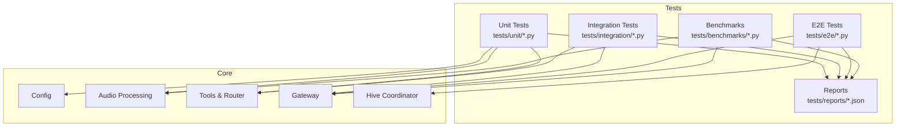
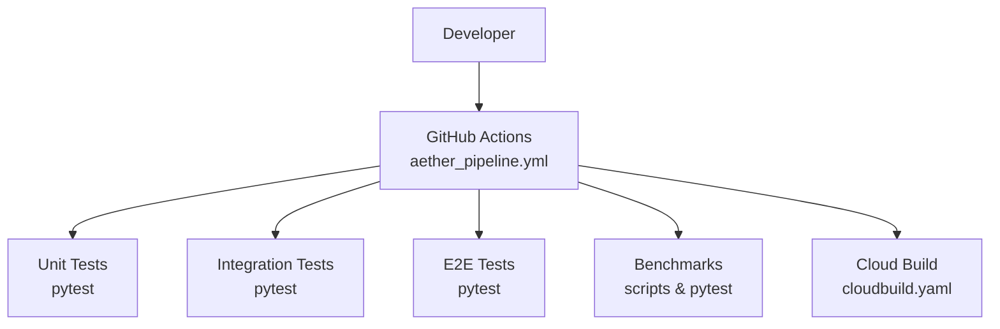
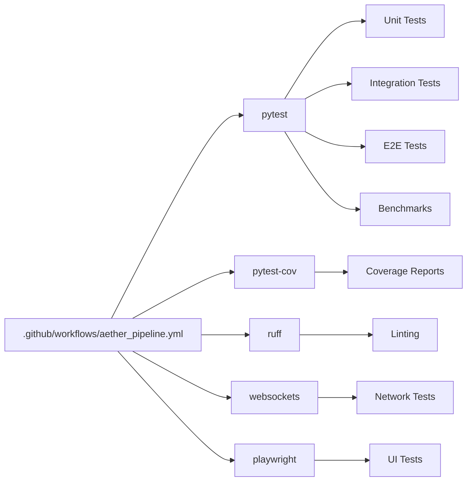

# Testing Strategy and Framework

<cite>
**Referenced Files in This Document**
- [conftest.py](file://conftest.py)
- [pyproject.toml](file://pyproject.toml)
- [requirements.txt](file://requirements.txt)
- [.github/workflows/aether_pipeline.yml](file://.github/workflows/aether_pipeline.yml)
- [cloudbuild.yaml](file://cloudbuild.yaml)
- [tests/unit/test_core.py](file://tests/unit/test_core.py)
- [tests/unit/test_gateway.py](file://tests/unit/test_gateway.py)
- [tests/benchmarks/bench_dsp.py](file://tests/benchmarks/bench_dsp.py)
- [tests/e2e/test_system_alpha_e2e.py](file://tests/e2e/test_system_alpha_e2e.py)
- [tests/integration/test_gateway_e2e.py](file://tests/integration/test_gateway_e2e.py)
</cite>

## Table of Contents
1. [Introduction](#introduction)
2. [Project Structure](#project-structure)
3. [Core Components](#core-components)
4. [Architecture Overview](#architecture-overview)
5. [Detailed Component Analysis](#detailed-component-analysis)
6. [Dependency Analysis](#dependency-analysis)
7. [Performance Considerations](#performance-considerations)
8. [Troubleshooting Guide](#troubleshooting-guide)
9. [Conclusion](#conclusion)
10. [Appendices](#appendices)

## Introduction
This document describes the Aether Voice OS testing strategy and framework. It explains the overall testing philosophy, the test pyramid approach, and how unit, integration, end-to-end (E2E), and benchmark tests collaborate. It documents pytest configuration, fixtures, and infrastructure setup, outlines test organization and naming conventions, and provides practical guidance for running targeted suites, filtering by markers, and using parameters. It also covers continuous integration, automated pipelines, quality gates, debugging techniques, performance profiling during tests, and best practices for maintainable test code.

## Project Structure
The repository organizes tests by type and domain:
- Unit tests under tests/unit/, covering core modules, audio processing, tools, and transports.
- Integration tests under tests/integration/, validating cross-module behavior and protocols.
- End-to-end tests under tests/e2e/, exercising full system flows with minimal mocking.
- Benchmarks under tests/benchmarks/, measuring performance for DSP and system components.
- Additional focused tests under the root of tests/ for specialized scenarios.

**Diagram sources**
- [tests/unit/test_core.py](file://tests/unit/test_core.py#L1-L503)
- [tests/unit/test_gateway.py](file://tests/unit/test_gateway.py#L1-L198)
- [tests/benchmarks/bench_dsp.py](file://tests/benchmarks/bench_dsp.py#L1-L135)
- [tests/e2e/test_system_alpha_e2e.py](file://tests/e2e/test_system_alpha_e2e.py#L1-L187)
- [tests/integration/test_gateway_e2e.py](file://tests/integration/test_gateway_e2e.py#L1-L168)

**Section sources**
- [tests/unit/test_core.py](file://tests/unit/test_core.py#L1-L503)
- [tests/unit/test_gateway.py](file://tests/unit/test_gateway.py#L1-L198)
- [tests/benchmarks/bench_dsp.py](file://tests/benchmarks/bench_dsp.py#L1-L135)
- [tests/e2e/test_system_alpha_e2e.py](file://tests/e2e/test_system_alpha_e2e.py#L1-L187)
- [tests/integration/test_gateway_e2e.py](file://tests/integration/test_gateway_e2e.py#L1-L168)

## Core Components
- Pytest configuration and collection:
  - Root collection ignores non-Python artifacts and excludes large subtrees to keep test runs fast and focused.
  - Project-wide pytest settings define test paths, async mode, and ignored directories.
- Continuous Integration:
  - GitHub Actions pipeline runs linting, installs system dependencies, installs Python dependencies, executes tests with coverage, and validates core imports.
  - Cloud Build deploys images and runs optional security checks in parallel stages.
- Test Infrastructure:
  - Unit tests extensively use pytest fixtures and mocks to isolate components and simulate external systems.
  - Integration and E2E tests exercise real protocols and network stacks while controlling environment variables and dependencies.

**Section sources**
- [conftest.py](file://conftest.py#L1-L10)
- [pyproject.toml](file://pyproject.toml#L1-L21)
- [.github/workflows/aether_pipeline.yml](file://.github/workflows/aether_pipeline.yml#L1-L160)
- [requirements.txt](file://requirements.txt#L1-L52)
- [cloudbuild.yaml](file://cloudbuild.yaml#L1-L55)

## Architecture Overview
The testing architecture aligns with a layered test pyramid:
- Unit tests: Fast, deterministic, and isolated. They validate individual modules (config, audio processing, tools, transport).
- Integration tests: Validate interactions between modules and protocols (e.g., gateway handshake, tool routing).
- E2E tests: Exercise full system flows with real clients and servers, focusing on protocol correctness and observable behavior.
- Benchmarks: Measure performance of critical paths (DSP, system latency) and inform optimization decisions.

**Diagram sources**
- [.github/workflows/aether_pipeline.yml](file://.github/workflows/aether_pipeline.yml#L61-L101)
- [cloudbuild.yaml](file://cloudbuild.yaml#L1-L55)

## Detailed Component Analysis

### Pytest Configuration and Fixtures
- Configuration:
  - Root conftest sets sys.path and ignores non-relevant directories to streamline collection.
  - pyproject.toml defines test paths, async mode, and norecursedirs to exclude large subtrees.
- Fixtures:
  - Unit tests commonly use module-level imports and mocks to isolate dependencies.
  - Integration/E2E tests define fixtures to construct and manage server lifecycles, mock external services, and inject deterministic configurations.

Examples of fixture usage and patterns:
- Gateway fixture constructs a configured gateway instance, injects a mock bus, and manages lifecycle tasks.
- Mocked signatures and tool routers enable handshake and routing validations without external dependencies.

**Section sources**
- [conftest.py](file://conftest.py#L1-L10)
- [pyproject.toml](file://pyproject.toml#L1-L21)
- [tests/unit/test_gateway.py](file://tests/unit/test_gateway.py#L31-L81)

### Unit Testing Strategy
- Coverage focus:
  - CI enforces coverage over core/, ensuring critical modules are tested.
- Typical patterns:
  - Class-per-feature with method-per-scenario.
  - Extensive use of assertions on defaults, enums, and edge cases.
  - Mocking external libraries (e.g., firebase, audio devices) to avoid flakiness.

Example patterns:
- Configuration validation and defaults.
- Audio processing correctness (ring buffers, VAD, zero-crossing).
- Tool declarations and handlers.
- Offline behavior for cloud-dependent components.
- State machine transitions and tool router registration.

**Section sources**
- [tests/unit/test_core.py](file://tests/unit/test_core.py#L28-L502)
- [tests/unit/test_gateway.py](file://tests/unit/test_gateway.py#L31-L81)

### Integration Testing Strategy
- Focus areas:
  - Protocol-level validation (handshake, heartbeat, pruning, broadcasting).
  - Cross-module interactions (gateway, hive, tool router).
- Techniques:
  - Real WebSocket connections with controlled timeouts.
  - Deterministic configurations and mocked external dependencies to stabilize outcomes.

Example patterns:
- Ed25519 handshake verification.
- Heartbeat tick and pong handling.
- Client pruning after missed ticks.
- Broadcast delivery to multiple clients.

**Section sources**
- [tests/unit/test_gateway.py](file://tests/unit/test_gateway.py#L83-L198)
- [tests/integration/test_gateway_e2e.py](file://tests/integration/test_gateway_e2e.py#L66-L163)

### End-to-End (E2E) Testing Strategy
- Goals:
  - Validate full system behavior with real clients and servers.
  - Detect protocol hangs and timing issues with granular logging and timeouts.
- Techniques:
  - Minimal mocking to surface real failures.
  - Strict timeouts per stage and structured logs for diagnosis.

Example patterns:
- Full diagnostic cycle with registry, hive, and gateway.
- Neural link probe verifying handshake and session establishment.

**Section sources**
- [tests/e2e/test_system_alpha_e2e.py](file://tests/e2e/test_system_alpha_e2e.py#L60-L182)
- [tests/integration/test_gateway_e2e.py](file://tests/integration/test_gateway_e2e.py#L66-L163)

### Benchmarking Strategy
- Scope:
  - Performance comparisons for DSP functions between NumPy and Rust backends.
  - Latency measurements for critical paths to guide optimization.
- Execution:
  - Standalone scripts and pytest-based benchmarks measure warm-up, iteration counts, and averages.

Example patterns:
- Energy VAD and zero-crossing comparisons.
- Controlled frame sizes and iteration counts for reproducibility.

**Section sources**
- [tests/benchmarks/bench_dsp.py](file://tests/benchmarks/bench_dsp.py#L76-L134)

### Continuous Integration and Quality Gates
- GitHub Actions pipeline:
  - Rust check for Cortex.
  - Linting with ruff.
  - Python tests across multiple Python versions with coverage thresholds.
  - Import verification for core modules.
  - Portal checks for frontend.
  - Security checks (Bandit, Safety) and Docker image build.
- Cloud Build:
  - Builds and pushes Docker images.
  - Deploys to Cloud Run with environment and secret configuration.

Quality gates:
- Coverage minimum enforced by pytest-cov.
- Import checks to prevent regressions in core APIs.
- Security scans to catch issues early.

**Section sources**
- [.github/workflows/aether_pipeline.yml](file://.github/workflows/aether_pipeline.yml#L20-L160)
- [requirements.txt](file://requirements.txt#L21-L41)
- [cloudbuild.yaml](file://cloudbuild.yaml#L1-L55)

## Dependency Analysis
The testing stack depends on:
- pytest and pytest-asyncio for test execution and async support.
- pytest-cov for coverage reporting and gating.
- playwright and websockets for browser and network tests.
- ruff for linting/formatting.
- bandit and safety for security checks.

**Diagram sources**
- [requirements.txt](file://requirements.txt#L21-L41)
- [.github/workflows/aether_pipeline.yml](file://.github/workflows/aether_pipeline.yml#L47-L101)

**Section sources**
- [requirements.txt](file://requirements.txt#L1-L52)
- [.github/workflows/aether_pipeline.yml](file://.github/workflows/aether_pipeline.yml#L47-L101)

## Performance Considerations
- Benchmark-first mindset:
  - Use dedicated benchmark suites to compare implementations and track regressions.
  - Control warm-up, iteration counts, and input sizes for reproducible results.
- Profiling during tests:
  - Add timing instrumentation around hot paths.
  - Use perf counters and structured logs to isolate bottlenecks.
- Asynchronous test design:
  - Favor asyncio-friendly designs to avoid artificial delays and flaky sleeps.
  - Use timeouts and structured waits to keep tests responsive.

[No sources needed since this section provides general guidance]

## Troubleshooting Guide
Common issues and remedies:
- Collection ignores:
  - If tests are missing, confirm conftest ignores and pyproject.toml norecursedirs are appropriate for your environment.
- Async test hangs:
  - Ensure fixtures properly manage task lifecycles and cancellations.
  - Use explicit timeouts around network operations.
- External dependency failures:
  - Mock or stub external services in unit tests to avoid flakiness.
  - For integration/E2E, validate environment variables and ports.
- Coverage failures:
  - Increase coverage for untested modules and ensure core imports remain valid.

**Section sources**
- [conftest.py](file://conftest.py#L6-L9)
- [pyproject.toml](file://pyproject.toml#L4-L4)
- [tests/unit/test_gateway.py](file://tests/unit/test_gateway.py#L71-L80)
- [.github/workflows/aether_pipeline.yml](file://.github/workflows/aether_pipeline.yml#L90-L101)

## Conclusion
Aether Voice OS employs a robust, layered testing strategy that combines fast unit tests, reliable integration validations, realistic E2E probes, and performance benchmarks. The CI pipeline enforces quality gates, while fixtures and mocks enable deterministic, maintainable tests. By following the patterns and practices outlined here, contributors can write effective tests, debug efficiently, and sustain high-quality releases.

[No sources needed since this section summarizes without analyzing specific files]

## Appendices

### How to Run Specific Test Suites
- Run all tests:
  - From the repository root, execute the pytest command configured in CI.
- Run unit tests:
  - Target tests/unit/ to validate core modules and audio processing.
- Run integration tests:
  - Target tests/integration/ to validate gateway and tool router interactions.
- Run E2E tests:
  - Target tests/e2e/ to exercise full system flows with real clients.
- Run benchmarks:
  - Execute scripts under tests/benchmarks/ to compare implementations and measure latency.

**Section sources**
- [.github/workflows/aether_pipeline.yml](file://.github/workflows/aether_pipeline.yml#L90-L92)
- [pyproject.toml](file://pyproject.toml#L2-L2)

### Filtering Tests by Markers
- Async tests:
  - Use the asyncio marker to run async tests consistently.
- Example marker usage:
  - Apply pytest.mark.asyncio to async test functions and fixtures.

**Section sources**
- [tests/unit/test_gateway.py](file://tests/unit/test_gateway.py#L83-L83)
- [tests/unit/test_core.py](file://tests/unit/test_core.py#L333-L342)

### Writing Effective Unit Tests
- Structure:
  - One class per feature area with focused methods per scenario.
- Assertions:
  - Validate defaults, enums, and edge cases.
- Mocking:
  - Replace external dependencies with mocks to ensure determinism.
- Fixtures:
  - Encapsulate setup/teardown logic for reusable environments.

**Section sources**
- [tests/unit/test_core.py](file://tests/unit/test_core.py#L28-L502)
- [tests/unit/test_gateway.py](file://tests/unit/test_gateway.py#L31-L81)

### Debugging Techniques
- Logging:
  - Add structured logs around critical stages in E2E tests.
- Timeouts:
  - Use explicit timeouts to detect hangs and narrow failure windows.
- Isolation:
  - Reduce scope to a single failing test and minimize external dependencies.

**Section sources**
- [tests/e2e/test_system_alpha_e2e.py](file://tests/e2e/test_system_alpha_e2e.py#L119-L171)
- [tests/integration/test_gateway_e2e.py](file://tests/integration/test_gateway_e2e.py#L132-L156)

### Performance Profiling During Tests
- Benchmark scripts:
  - Use existing scripts to compare implementations and measure latency.
- Instrumentation:
  - Add timers around hot paths and log averages for regression tracking.

**Section sources**
- [tests/benchmarks/bench_dsp.py](file://tests/benchmarks/bench_dsp.py#L62-L73)

### Best Practices for Maintainable Test Code
- Naming and organization:
  - Keep tests organized by type and feature; use descriptive filenames and class/method names.
- Determinism:
  - Use mocks, deterministic seeds, and controlled configurations.
- Coverage:
  - Aim for high coverage in core modules and ensure imports remain valid.

**Section sources**
- [tests/unit/test_core.py](file://tests/unit/test_core.py#L1-L12)
- [.github/workflows/aether_pipeline.yml](file://.github/workflows/aether_pipeline.yml#L90-L101)