# Testing and Quality Assurance

<cite>
**Referenced Files in This Document**
- [testing_matrix.md](file://docs/testing_matrix.md)
- [aether_pipeline.yml](file://.github/workflows/aether_pipeline.yml)
- [conftest.py](file://conftest.py)
- [bench_latency.py](file://tests/benchmarks/bench_latency.py)
- [bench_focus.py](file://tests/benchmarks/bench_focus.py)
- [bench_dsp.py](file://tests/benchmarks/bench_dsp.py)
- [test_event_bus_stress.py](file://tests/benchmarks/test_event_bus_stress.py)
- [test_event_bus_load.py](file://tests/stress/test_event_bus_load.py)
- [test_system_alpha_e2e.py](file://tests/e2e/test_system_alpha_e2e.py)
- [benchmark_report.json](file://tests/reports/benchmark_report.json)
- [stability_report.json](file://tests/reports/stability_report.json)
- [latency_report.json](file://tests/reports/latency_report.json)
- [stress_report.json](file://tests/reports/stress_report.json)
- [accuracy_benchmark.py](file://infra/scripts/accuracy_benchmark.py)
- [health_scanner.py](file://infra/scripts/health_scanner.py)
- [stability_test.py](file://infra/scripts/stability_test.py)
- [dashboard_generator.py](file://tools/dashboard_generator.py)
- [benchmark_runner.py](file://tools/benchmark_runner.py)
- [FluidThoughtParticles.basic.test.tsx](file://apps/portal/src/__tests__/FluidThoughtParticles.basic.test.tsx)
- [QuantumNeuralAvatar.basic.test.tsx](file://apps/portal/src/__tests__/QuantumNeuralAvatar.basic.test.tsx)
- [FluidThoughtParticles.test.tsx](file://apps/portal/src/__tests__/FluidThoughtParticles.test.tsx)
- [QuantumNeuralAvatar.test.tsx](file://apps/portal/src/__tests__/QuantumNeuralAvatar.test.tsx)
- [FluidThoughtParticles.tsx](file://apps/portal/src/components/FluidThoughtParticles.tsx)
- [QuantumNeuralAvatar.tsx](file://apps/portal/src/components/QuantumNeuralAvatar.tsx)
- [vitest.config.ts](file://apps/portal/vitest.config.ts)
- [package.json](file://apps/portal/package.json)
- [test_interrupts.py](file://tests/benchmarks/test_interrupts.py)
- [test_long_session.py](file://tests/benchmarks/test_long_session.py)
- [test_cortex_prediction.py](file://tests/benchmarks/test_cortex_prediction.py)
- [test_dna_stability.py](file://tests/benchmarks/test_dna_stability.py)
- [test_thalamic_gate_benchmark.py](file://tests/benchmarks/test_thalamic_gate_benchmark.py)
- [di_injector.py](file://agents/di_injector.py)
- [learning_agent.py](file://agents/learning_agent.py)
- [optimization_agent.py](file://agents/optimization_agent.py)
</cite>

## Update Summary
**Changes Made**
- Added comprehensive interrupt latency testing framework with T3-T1 measurement capabilities
- Enhanced long session stability testing with memory growth monitoring
- Integrated neural lead time prediction benchmark for cognitive scheduling
- Added DNA chaos stability testing for agent personality management
- Expanded benchmark runner with consolidated reporting system
- Enhanced testing matrix to support new agent system infrastructure
- Added specialized audio processing benchmarks for thalamic gate performance

## Table of Contents
1. [Introduction](#introduction)
2. [Project Structure](#project-structure)
3. [Core Components](#core-components)
4. [Architecture Overview](#architecture-overview)
5. [Detailed Component Analysis](#detailed-component-analysis)
6. [Dependency Analysis](#dependency-analysis)
7. [Performance Considerations](#performance-considerations)
8. [Troubleshooting Guide](#troubleshooting-guide)
9. [Conclusion](#conclusion)
10. [Appendices](#appendices)

## Introduction
This document describes the testing and quality assurance framework for Aether Voice OS. It covers the testing strategy across unit, integration, performance, and end-to-end categories; the benchmarking system for audio processing, latency, and system performance; stress testing approaches for event bus load and system resilience; the testing infrastructure and continuous integration setup; and guidance for contributors on writing custom tests, extending the test suite, and maintaining quality metrics.

**Updated** Enhanced with expanded testing infrastructure featuring new benchmark frameworks, specialized interrupt handling tests, long session stability validation, and comprehensive agent system testing capabilities.

## Project Structure
The testing and QA system is organized into distinct layers and directories:
- Unit tests: located under tests/unit
- Integration tests: tests/integration
- Benchmarks: tests/benchmarks (expanded with new specialized tests)
- Stress tests: tests/stress
- End-to-end tests: tests/e2e
- Reports: tests/reports
- CI pipeline: .github/workflows/aether_pipeline.yml
- Pytest configuration: conftest.py
- Documentation: docs/testing_matrix.md
- Infrastructure scripts: infra/scripts/*
- Tools: tools/*
- **Portal component tests**: apps/portal/src/__tests__/* (enhanced with Three.js component testing)
- **Agent system**: agents/* (automated testing agents for dependency injection, learning, and optimization)

```mermaid
graph TB
subgraph "Tests"
U["Unit Tests<br/>tests/unit"]
I["Integration Tests<br/>tests/integration"]
B["Benchmarks<br/>tests/benchmarks"]
S["Stress Tests<br/>tests/stress"]
E["E2E Tests<br/>tests/e2e"]
R["Reports<br/>tests/reports"]
PT["Portal Tests<br/>apps/portal/src/__tests__"]
AG["Agent System<br/>agents/*"]
end
subgraph "CI"
W["GitHub Actions<br/>.github/workflows/aether_pipeline.yml"]
end
subgraph "Docs"
M["Testing Matrix<br/>docs/testing_matrix.md"]
C["Pytest Config<br/>conftest.py"]
end
subgraph "Infra Scripts"
ACC["Accuracy Benchmark<br/>infra/scripts/accuracy_benchmark.py"]
HSCN["Health Scanner<br/>infra/scripts/health_scanner.py"]
STAB["Stability Test<br/>infra/scripts/stability_test.py"]
end
subgraph "Tools"
DASH["Dashboard Generator<br/>tools/dashboard_generator.py"]
RUN["Benchmark Runner<br/>tools/benchmark_runner.py"]
end
subgraph "Portal Test Infrastructure"
VT["Vitest Config<br/>vitest.config.ts"]
PKG["Package Scripts<br/>package.json"]
end
M --> U
M --> I
M --> B
M --> S
M --> E
M --> PT
M --> AG
C --> U
C --> I
C --> B
C --> S
C --> E
C --> PT
C --> AG
W --> U
W --> I
W --> B
W --> S
W --> E
W --> PT
W --> AG
ACC --> B
HSCN --> B
STAB --> S
DASH --> R
RUN --> B
VT --> PT
PKG --> PT
```

**Diagram sources**
- [aether_pipeline.yml](file://.github/workflows/aether_pipeline.yml#L1-L160)
- [testing_matrix.md](file://docs/testing_matrix.md#L1-L79)
- [conftest.py](file://conftest.py#L1-L10)
- [accuracy_benchmark.py](file://infra/scripts/accuracy_benchmark.py)
- [health_scanner.py](file://infra/scripts/health_scanner.py)
- [stability_test.py](file://infra/scripts/stability_test.py)
- [dashboard_generator.py](file://tools/dashboard_generator.py)
- [benchmark_runner.py](file://tools/benchmark_runner.py)
- [vitest.config.ts](file://apps/portal/vitest.config.ts#L1-L17)
- [package.json](file://apps/portal/package.json#L1-L53)
- [di_injector.py](file://agents/di_injector.py#L1-L180)
- [learning_agent.py](file://agents/learning_agent.py#L1-L281)
- [optimization_agent.py](file://agents/optimization_agent.py#L1-L287)

**Section sources**
- [aether_pipeline.yml](file://.github/workflows/aether_pipeline.yml#L1-L160)
- [testing_matrix.md](file://docs/testing_matrix.md#L1-L79)
- [conftest.py](file://conftest.py#L1-L10)
- [vitest.config.ts](file://apps/portal/vitest.config.ts#L1-L17)
- [package.json](file://apps/portal/package.json#L1-L53)

## Core Components
- Testing strategy tiers:
  - Unit: Core logic and math validations using pytest
  - Integration: Bus and cloud connectivity checks
  - E2E Audit: User-perceived latency and end-to-end flows
  - Stress: Stability and memory pressure under load
- **Enhanced Visual Component Testing**: Comprehensive test coverage for Three.js-based visual components
- **Expanded Benchmarking System**: Specialized tests for interrupt latency, long session stability, neural lead time prediction, and DNA chaos stability
- **Advanced Stress Testing**: Event bus performance under extreme loads, memory growth monitoring, and system alpha gauntlet scenarios
- **Agent System Testing**: Automated testing agents for dependency injection conversion, learning from commit history, and performance optimization
- **Specialized Audio Processing**: Thalamic gate performance benchmarking and adaptive echo cancellation testing
- Continuous integration:
  - Rust check, lint/style, Python tests with coverage, portal checks, security, and Docker build
- Reporting:
  - JSON reports for latency, stress, stability, benchmark summaries, and consolidated performance analysis

**Updated** Added comprehensive interrupt latency testing, long session stability validation, neural lead time prediction, DNA chaos stability, and agent system testing capabilities.

**Section sources**
- [testing_matrix.md](file://docs/testing_matrix.md#L8-L18)
- [bench_latency.py](file://tests/benchmarks/bench_latency.py#L1-L88)
- [bench_focus.py](file://tests/benchmarks/bench_focus.py#L1-L164)
- [bench_dsp.py](file://tests/benchmarks/bench_dsp.py#L1-L135)
- [test_event_bus_stress.py](file://tests/benchmarks/test_event_bus_stress.py#L1-L83)
- [test_event_bus_load.py](file://tests/stress/test_event_bus_load.py#L1-L70)
- [benchmark_report.json](file://tests/reports/benchmark_report.json#L1-L297)
- [stability_report.json](file://tests/reports/stability_report.json#L1-L210)
- [latency_report.json](file://tests/reports/latency_report.json#L1-L7)
- [stress_report.json](file://tests/reports/stress_report.json#L1-L6)
- [FluidThoughtParticles.basic.test.tsx](file://apps/portal/src/__tests__/FluidThoughtParticles.basic.test.tsx#L1-L131)
- [QuantumNeuralAvatar.basic.test.tsx](file://apps/portal/src/__tests__/QuantumNeuralAvatar.basic.test.tsx#L1-L109)
- [test_interrupts.py](file://tests/benchmarks/test_interrupts.py#L1-L84)
- [test_long_session.py](file://tests/benchmarks/test_long_session.py#L1-L74)
- [test_cortex_prediction.py](file://tests/benchmarks/test_cortex_prediction.py#L1-L81)
- [test_dna_stability.py](file://tests/benchmarks/test_dna_stability.py#L1-L74)
- [test_thalamic_gate_benchmark.py](file://tests/benchmarks/test_thalamic_gate_benchmark.py#L1-L116)

## Architecture Overview
The testing architecture integrates pytest-driven unit and integration tests, specialized benchmarking scripts, and CI-driven quality gates. **Enhanced with comprehensive Three.js component testing infrastructure** that includes both basic and comprehensive test suites for visual components. **Expanded with new specialized benchmarking capabilities** for interrupt handling, session stability, and neural prediction. **Enhanced with automated agent system testing** for dependency injection, learning, and optimization. Benchmarks produce structured JSON reports consumed by dashboard tools and consolidated by the benchmark runner.

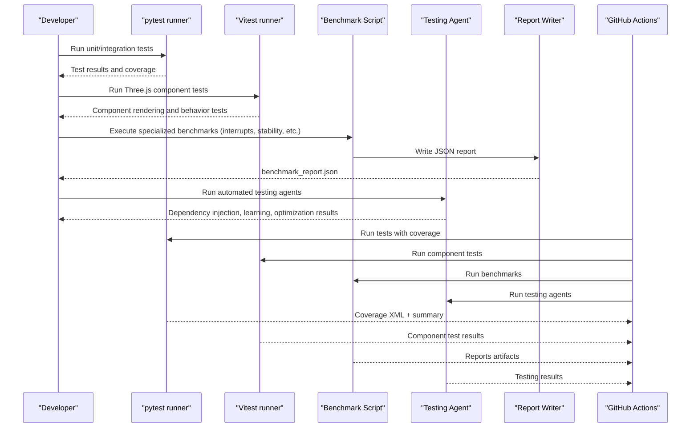

**Diagram sources**
- [aether_pipeline.yml](file://.github/workflows/aether_pipeline.yml#L61-L101)
- [bench_latency.py](file://tests/benchmarks/bench_latency.py#L23-L87)
- [bench_focus.py](file://tests/benchmarks/bench_focus.py#L83-L163)
- [bench_dsp.py](file://tests/benchmarks/bench_dsp.py#L76-L134)
- [benchmark_report.json](file://tests/reports/benchmark_report.json#L1-L297)
- [vitest.config.ts](file://apps/portal/vitest.config.ts#L1-L17)
- [benchmark_runner.py](file://tools/benchmark_runner.py#L1-L88)
- [di_injector.py](file://agents/di_injector.py#L24-L56)
- [learning_agent.py](file://agents/learning_agent.py#L26-L66)
- [optimization_agent.py](file://agents/optimization_agent.py#L25-L59)

## Detailed Component Analysis

### Interrupt Latency Testing (T3-T1 Measurement)
Purpose: Measure actual end-to-end barge-in latency from user speech detection to AI playback interruption.

Key behaviors:
- Simulates user speech start detection (T1)
- Triggers flash_interrupt() signal (T2)
- Measures AI playback interruption (T3)
- Calculates total latency and individual stage timings
- Validates interrupt response under 50ms target

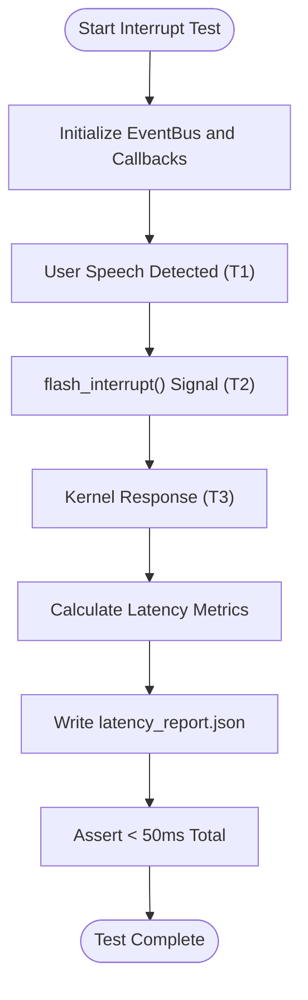

**Diagram sources**
- [test_interrupts.py](file://tests/benchmarks/test_interrupts.py#L12-L83)

**Section sources**
- [test_interrupts.py](file://tests/benchmarks/test_interrupts.py#L1-L84)

### Long Session Stability Testing
Purpose: Validate system stability over extended periods with high event throughput and memory growth monitoring.

Key behaviors:
- Simulates 50,000+ events distributed across 50 iterations
- Monitors memory consumption throughout the test
- Validates memory growth remains within acceptable limits (< 100MB)
- Tests event bus performance under sustained load
- Generates detailed stability report with memory history

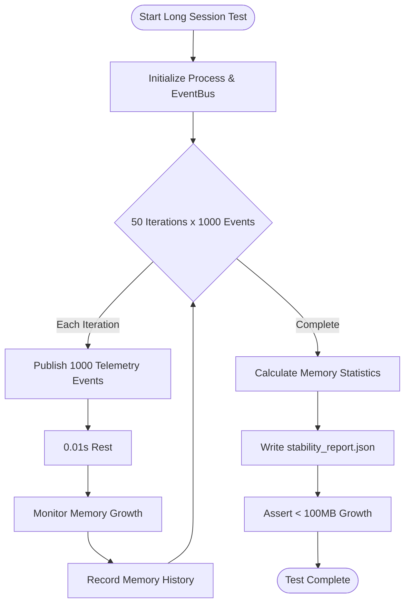

**Diagram sources**
- [test_long_session.py](file://tests/benchmarks/test_long_session.py#L14-L73)

**Section sources**
- [test_long_session.py](file://tests/benchmarks/test_long_session.py#L1-L74)

### Neural Lead Time Prediction Benchmark
Purpose: Measure cognitive scheduler's ability to predict and pre-warm tools before user request.

Key behaviors:
- Simulates natural conversation with progressive sentence fragments
- Monitors tool pre-warming triggers during speech
- Measures time elapsed between sentence start and tool pre-warming
- Validates prediction accuracy for system tools
- Generates cortex performance report

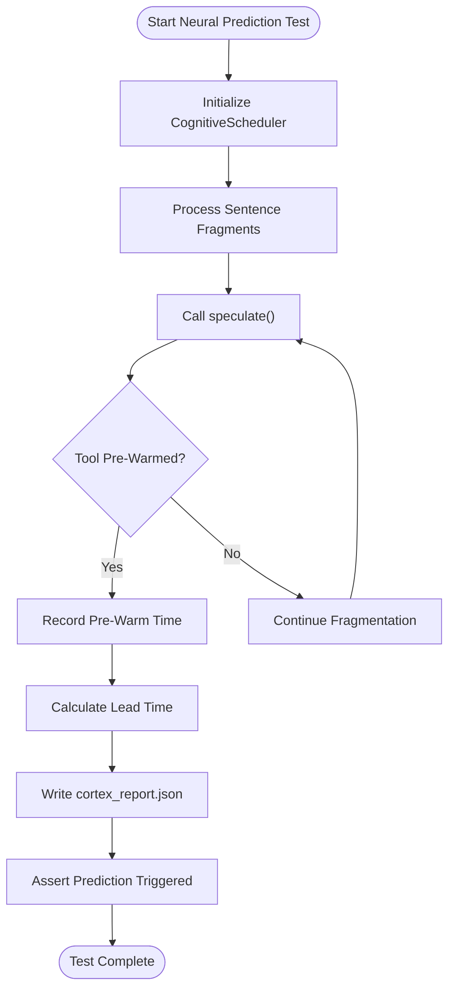

**Diagram sources**
- [test_cortex_prediction.py](file://tests/benchmarks/test_cortex_prediction.py#L21-L80)

**Section sources**
- [test_cortex_prediction.py](file://tests/benchmarks/test_cortex_prediction.py#L1-L81)

### DNA Chaos Stability Testing
Purpose: Validate agent personality stability under rapid emotional state changes and genetic optimization.

Key behaviors:
- Applies alternating high/low arousal stimuli to agent DNA
- Monitors verbosity and empathy parameter evolution
- Calculates maximum step drift between consecutive mutations
- Validates EMA smoothing prevents personality whiplash
- Tests genetic optimizer's stability under chaos conditions

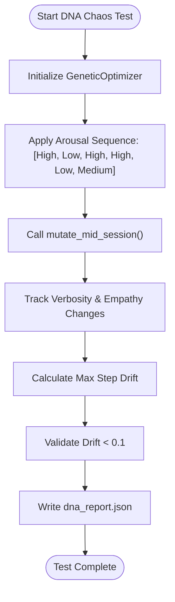

**Diagram sources**
- [test_dna_stability.py](file://tests/benchmarks/test_dna_stability.py#L22-L73)

**Section sources**
- [test_dna_stability.py](file://tests/benchmarks/test_dna_stability.py#L1-L74)

### Thalamic Gate Performance Benchmark
Purpose: Measure audio processing callback performance for real-time voice processing.

Key behaviors:
- Mocks audio capture components and state management
- Benchmarks callback execution time under various conditions
- Validates processing time remains below 2.5ms target
- Supports both automatic pytest-benchmark and manual timing modes
- Tests adaptive echo cancellation performance

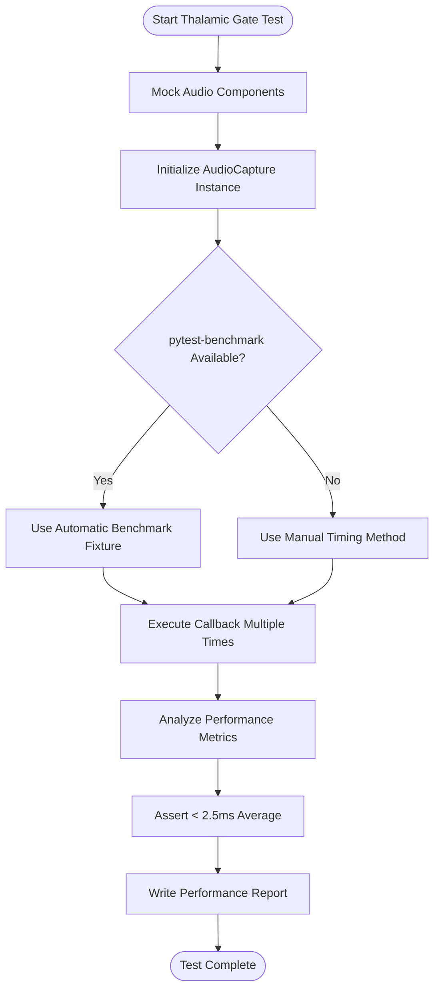

**Diagram sources**
- [test_thalamic_gate_benchmark.py](file://tests/benchmarks/test_thalamic_gate_benchmark.py#L72-L108)

**Section sources**
- [test_thalamic_gate_benchmark.py](file://tests/benchmarks/test_thalamic_gate_benchmark.py#L1-L116)

### Enhanced Three.js Component Testing Infrastructure

**Updated** Added comprehensive testing infrastructure for Three.js-based visual components.

#### FluidThoughtParticles Testing
Purpose: Test the immersive 3D conversation experience component with comprehensive rendering, store integration, and performance validation.

Key behaviors:
- Renders without crashing using Canvas mock
- Integrates with Aether store for transcript and audio state
- Handles empty and populated transcript arrays
- Validates particle generation and physics calculations
- Tests performance with large datasets
- Ensures proper memory cleanup

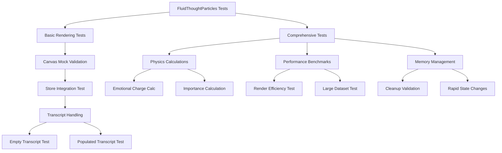

**Diagram sources**
- [FluidThoughtParticles.basic.test.tsx](file://apps/portal/src/__tests__/FluidThoughtParticles.basic.test.tsx#L69-L130)
- [FluidThoughtParticles.test.tsx](file://apps/portal/src/__tests__/FluidThoughtParticles.test.tsx#L127-L354)

#### QuantumNeuralAvatar Testing
Purpose: Test the 3D avatar component with size variants, state handling, and visual styling validation.

Key behaviors:
- Renders all size variants (icon, small, medium, large, fullscreen)
- Handles different avatar variants (minimal, standard, detailed)
- Validates engine state transitions and audio reactivity
- Tests carbon fiber styling and status indicators
- Ensures proper cleanup and performance optimization

```mermaid
flowchart TD
QNA["QuantumNeuralAvatar Tests"] --> SizeTests["Size Variant Tests"]
SizeTests --> IconSize["Icon Size Test"]
SizeTests --> SmallSize["Small Size Test"]
SizeTests --> MediumSize["Medium Size Test"]
SizeTests --> LargeSize["Large Size Test"]
SizeTests --> Fullscreen["Fullscreen Test"]
QNA --> VariantTests["Variant Tests"]
VariantTests --> Minimal["Minimal Variant"]
VariantTests --> Standard["Standard Variant"]
VariantTests --> Detailed["Detailed Variant"]
QNA --> StateTests["State Transition Tests"]
StateTests --> IdleState["IDLE State"]
StateTests --> Listening["LISTENING State"]
StateTests --> Thinking["THINKING State"]
StateTests --> Speaking["SPEAKING State"]
StateTests --> Interrupting["INTERRUPTING State"]
QNA --> StylingTests["Styling Tests"]
StylingTests --> CarbonFiber["Carbon Fiber Background"]
StylingTests --> TextureOverlay["Texture Overlay"]
StylingTests --> StatusIndicator["Status Indicator"]
```

**Diagram sources**
- [QuantumNeuralAvatar.basic.test.tsx](file://apps/portal/src/__tests__/QuantumNeuralAvatar.basic.test.tsx#L59-L108)
- [QuantumNeuralAvatar.test.tsx](file://apps/portal/src/__tests__/QuantumNeuralAvatar.test.tsx#L140-L476)

**Section sources**
- [FluidThoughtParticles.basic.test.tsx](file://apps/portal/src/__tests__/FluidThoughtParticles.basic.test.tsx#L1-L131)
- [QuantumNeuralAvatar.basic.test.tsx](file://apps/portal/src/__tests__/QuantumNeuralAvatar.basic.test.tsx#L1-L109)
- [FluidThoughtParticles.test.tsx](file://apps/portal/src/__tests__/FluidThoughtParticles.test.tsx#L1-L355)
- [QuantumNeuralAvatar.test.tsx](file://apps/portal/src/__tests__/QuantumNeuralAvatar.test.tsx#L1-L477)

### Automated Testing Agents

**New** Added comprehensive automated testing agents for dependency injection, learning, and optimization.

#### DIInjectorAgent
Purpose: Automatically convert direct dependencies to dependency injection pattern for improved testability.

Key behaviors:
- Scans core modules for direct instantiations
- Creates service container implementation if not exists
- Converts direct class instantiation to container.get() pattern
- Maintains thread-safe singleton service registration
- Logs conversion statistics and errors

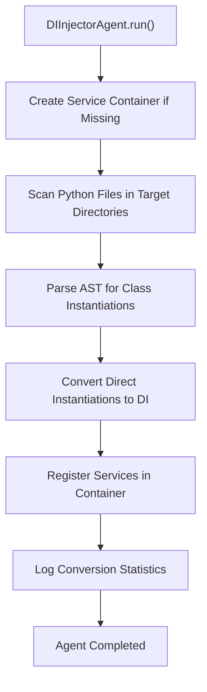

**Diagram sources**
- [di_injector.py](file://agents/di_injector.py#L24-L56)

#### LearningAgent
Purpose: Analyze git history and learn from previous commits to suggest improvements and identify testing gaps.

Key behaviors:
- Analyzes recent git commits for patterns and trends
- Identifies recurring bug fixes, features, and refactoring patterns
- Detects frequently modified files and hotspot components
- Generates improvement suggestions for testing coverage
- Extracts learning insights from development patterns

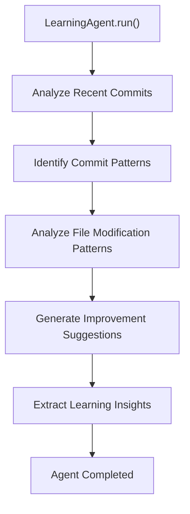

**Diagram sources**
- [learning_agent.py](file://agents/learning_agent.py#L26-L66)

#### OptimizationAgent
Purpose: Automatically identify and apply performance optimizations to improve testing efficiency.

Key behaviors:
- Scans Python files for optimization opportunities
- Identifies inefficient string concatenation and list operations
- Suggests and applies performance improvements
- Converts range-based loops to more efficient patterns
- Optimizes nested list comprehensions and global variable access

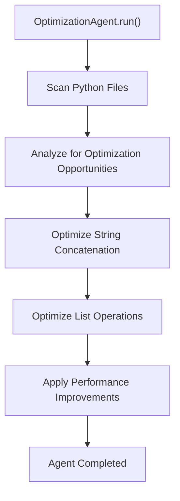

**Diagram sources**
- [optimization_agent.py](file://agents/optimization_agent.py#L25-L59)

**Section sources**
- [di_injector.py](file://agents/di_injector.py#L1-L180)
- [learning_agent.py](file://agents/learning_agent.py#L1-L281)
- [optimization_agent.py](file://agents/optimization_agent.py#L1-L287)

### Continuous Integration and Quality Gates
The CI pipeline enforces:
- Rust check for Cortex
- Linting and formatting with ruff
- Python tests with coverage and import verification
- Next.js portal linting and testing with Vitest
- Security scanning with bandit and safety
- Docker image build check
- **Enhanced testing with automated agents**: Dependency injection conversion, learning analysis, and optimization suggestions

**Updated** Enhanced with automated testing agents that improve code quality and testability.

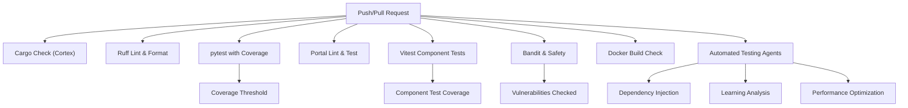

**Diagram sources**
- [aether_pipeline.yml](file://.github/workflows/aether_pipeline.yml#L20-L159)
- [vitest.config.ts](file://apps/portal/vitest.config.ts#L1-L17)
- [di_injector.py](file://agents/di_injector.py#L24-L56)
- [learning_agent.py](file://agents/learning_agent.py#L26-L66)
- [optimization_agent.py](file://agents/optimization_agent.py#L25-L59)

**Section sources**
- [aether_pipeline.yml](file://.github/workflows/aether_pipeline.yml#L1-L160)
- [vitest.config.ts](file://apps/portal/vitest.config.ts#L1-L17)

## Dependency Analysis
- Test discovery and filtering:
  - conftest.py excludes certain directories and ensures project root is in path
  - **Vitest configuration for portal component testing**
- **Enhanced Benchmark Orchestration**:
  - benchmark_runner.py coordinates multiple specialized benchmarks
  - Consolidates reports from latency, stress, DNA, cortex, and stability tests
  - Provides unified performance summary and metrics aggregation
- **Agent System Dependencies**:
  - Automated testing agents depend on AST parsing and file system operations
  - Learning agent requires git command availability
  - Optimization agent uses AST visitors for code analysis
- Benchmark outputs:
  - Benchmarks write structured JSON reports consumed by dashboard tools
- CI orchestration:
  - GitHub Actions coordinates multi-stage jobs with dependencies
- **Enhanced Three.js component dependencies**:
  - React Three Fiber and Drei for 3D rendering
  - Three.js core library for 3D geometries and materials
  - Zustand for state management integration

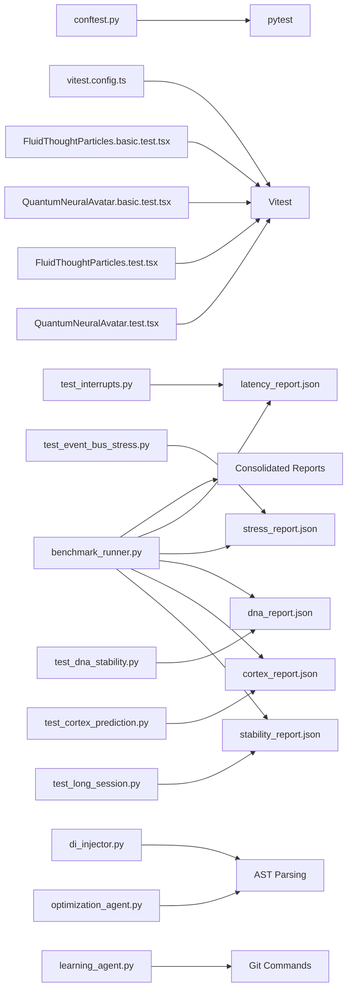

**Diagram sources**
- [conftest.py](file://conftest.py#L1-L10)
- [vitest.config.ts](file://apps/portal/vitest.config.ts#L1-L17)
- [benchmark_runner.py](file://tools/benchmark_runner.py#L7-L87)
- [di_injector.py](file://agents/di_injector.py#L125-L154)
- [learning_agent.py](file://agents/learning_agent.py#L68-L113)
- [optimization_agent.py](file://agents/optimization_agent.py#L70-L134)
- [test_interrupts.py](file://tests/benchmarks/test_interrupts.py#L1-L84)
- [test_event_bus_stress.py](file://tests/benchmarks/test_event_bus_stress.py#L1-L83)
- [test_long_session.py](file://tests/benchmarks/test_long_session.py#L1-L74)
- [test_cortex_prediction.py](file://tests/benchmarks/test_cortex_prediction.py#L1-L81)
- [test_dna_stability.py](file://tests/benchmarks/test_dna_stability.py#L1-L74)
- [FluidThoughtParticles.basic.test.tsx](file://apps/portal/src/__tests__/FluidThoughtParticles.basic.test.tsx#L1-L131)
- [QuantumNeuralAvatar.basic.test.tsx](file://apps/portal/src/__tests__/QuantumNeuralAvatar.basic.test.tsx#L1-L109)
- [FluidThoughtParticles.test.tsx](file://apps/portal/src/__tests__/FluidThoughtParticles.test.tsx#L1-L355)
- [QuantumNeuralAvatar.test.tsx](file://apps/portal/src/__tests__/QuantumNeuralAvatar.test.tsx#L1-L477)

**Section sources**
- [conftest.py](file://conftest.py#L1-L10)
- [vitest.config.ts](file://apps/portal/vitest.config.ts#L1-L17)
- [benchmark_report.json](file://tests/reports/benchmark_report.json#L1-L297)
- [latency_report.json](file://tests/reports/latency_report.json#L1-L7)
- [stress_report.json](file://tests/reports/stress_report.json#L1-L6)
- [benchmark_runner.py](file://tools/benchmark_runner.py#L1-L88)
- [di_injector.py](file://agents/di_injector.py#L1-L180)
- [learning_agent.py](file://agents/learning_agent.py#L1-L281)
- [optimization_agent.py](file://agents/optimization_agent.py#L1-L287)

## Performance Considerations
- Latency targets:
  - Internal processing budget should remain under 10 ms average to preserve ~175 ms for network and inference within the 180 ms total turnaround goal
  - **Interrupt latency (T3-T1) should remain under 50ms for responsive barge-in capability**
- Throughput targets:
  - Expect 10k+ EPS in a clean environment with sub-10 ms per burst processing
  - **Long session stability requires memory growth < 100MB over 50k+ events**
- Accuracy targets:
  - Focus detection should meet competitive-edge thresholds (accuracy and F1 scores)
- **Neural prediction targets**:
  - Cognitive scheduler should trigger tool pre-warming during natural conversation flow
  - **Neural lead time should demonstrate measurable pre-warming before user requests**
- **DNA stability targets**:
  - Maximum step drift should remain below 0.1 for personality stability
  - **EMA smoothing should prevent personality whiplash under rapid emotional changes**
- **Audio processing targets**:
  - Thalamic gate processing time should remain below 2.5ms per callback
  - **Adaptive echo cancellation should maintain convergence during high-load scenarios**
- **Enhanced Visual Component Performance**:
  - Three.js components should render efficiently under 100ms
  - Particle systems handle large datasets without performance degradation
  - Avatar components support rapid state transitions without memory leaks

**Updated** Added performance considerations for interrupt latency, long session stability, neural prediction, DNA stability, and audio processing benchmarks.

## Troubleshooting Guide
Common issues and techniques:
- Port conflicts:
  - If binding fails, the system should detect OSError and switch to a backup port without crashing
- Redis disconnects:
  - The global bus should log failures and enter a retry state without interrupting the primary audio stream
- Protocol hangs:
  - Use E2E tests with timeouts to detect stalls during handshake or session establishment
- Coverage failures:
  - Ensure coverage threshold is met and investigate missing modules
- TCC sandbox issues:
  - conftest.py adjusts collection paths to avoid TCC sandbox problems
- **Three.js Component Issues**:
  - Canvas mock failures indicate missing Three.js dependency mocking
  - Store integration issues suggest Zustand state management problems
  - Performance bottlenecks in particle systems require optimization of geometry and material usage
- **Interrupt Latency Issues**:
  - Check event bus priority handling for control events
  - Validate interrupt signal propagation through the system
  - Monitor kernel response timing for playback interruption
- **Long Session Stability Problems**:
  - Investigate memory leak patterns in event handlers
  - Monitor garbage collection effectiveness under sustained load
  - Check for resource handle accumulation in audio processing
- **Neural Prediction Failures**:
  - Verify cognitive scheduler initialization and configuration
  - Check tool pre-warming triggers during conversation flow
  - Validate prediction accuracy with real-world speech patterns
- **DNA Stability Concerns**:
  - Review genetic optimizer configuration and EMA parameters
  - Monitor parameter drift rates during chaos testing
  - Validate mutation boundaries and smoothing effects
- **Audio Processing Bottlenecks**:
  - Profile thalamic gate callback execution time
  - Check adaptive echo cancellation convergence under load
  - Monitor CPU utilization during high-frequency processing

**Updated** Added troubleshooting guidance for interrupt latency, long session stability, neural prediction, DNA stability, and audio processing benchmarks.

**Section sources**
- [testing_matrix.md](file://docs/testing_matrix.md#L68-L79)
- [test_system_alpha_e2e.py](file://tests/e2e/test_system_alpha_e2e.py#L169-L174)
- [aether_pipeline.yml](file://.github/workflows/aether_pipeline.yml#L90-L101)
- [conftest.py](file://conftest.py#L1-L10)
- [FluidThoughtParticles.basic.test.tsx](file://apps/portal/src/__tests__/FluidThoughtParticles.basic.test.tsx#L13-L67)
- [QuantumNeuralAvatar.basic.test.tsx](file://apps/portal/src/__tests__/QuantumNeuralAvatar.basic.test.tsx#L17-L57)
- [test_interrupts.py](file://tests/benchmarks/test_interrupts.py#L52-L61)
- [test_long_session.py](file://tests/benchmarks/test_long_session.py#L22-L53)
- [test_cortex_prediction.py](file://tests/benchmarks/test_cortex_prediction.py#L44-L55)
- [test_dna_stability.py](file://tests/benchmarks/test_dna_stability.py#L36-L48)
- [test_thalamic_gate_benchmark.py](file://tests/benchmarks/test_thalamic_gate_benchmark.py#L89-L108)

## Conclusion
Aether Voice OS employs a rigorous, tiered testing strategy supported by dedicated benchmarks, stress tests, and a robust CI pipeline. **Enhanced with comprehensive Three.js component testing infrastructure**, specialized interrupt latency testing, long session stability validation, neural prediction benchmarks, DNA chaos stability testing, and automated agent system testing. The framework validates latency budgets, accuracy thresholds, and system stability under load, while ensuring code quality through linting, security scanning, and coverage requirements. **The expanded testing matrix now supports the new agent system** with automated dependency injection, learning analysis, and optimization capabilities. Contributors can extend the suite by adding new benchmarks, stress scenarios, E2E probes, enhanced visual component tests, and specialized agent testing capabilities aligned with the documented matrix and CI expectations.

**Updated** Enhanced conclusion to reflect the improved testing infrastructure for visual components, interrupt handling, session stability, neural prediction, DNA stability, and automated agent system testing.

## Appendices

### Writing Custom Benchmarks
- Follow the pattern of existing benchmarks:
  - Initialize core components
  - Generate synthetic or real data
  - Measure and record metrics
  - Write a structured JSON report to tests/reports
- **New specialized benchmark types**:
  - Interrupt latency testing with T1/T2/T3 timing measurements
  - Long session stability with memory growth monitoring
  - Neural prediction benchmarks for cognitive scheduling
  - DNA stability testing for agent personality management
  - Audio processing benchmarks for thalamic gate performance
- Example reference paths:
  - [test_interrupts.py](file://tests/benchmarks/test_interrupts.py#L12-L83)
  - [test_long_session.py](file://tests/benchmarks/test_long_session.py#L14-L73)
  - [test_cortex_prediction.py](file://tests/benchmarks/test_cortex_prediction.py#L21-L80)
  - [test_dna_stability.py](file://tests/benchmarks/test_dna_stability.py#L22-L73)
  - [test_thalamic_gate_benchmark.py](file://tests/benchmarks/test_thalamic_gate_benchmark.py#L72-L108)

**Section sources**
- [test_interrupts.py](file://tests/benchmarks/test_interrupts.py#L1-L84)
- [test_long_session.py](file://tests/benchmarks/test_long_session.py#L1-L74)
- [test_cortex_prediction.py](file://tests/benchmarks/test_cortex_prediction.py#L1-L81)
- [test_dna_stability.py](file://tests/benchmarks/test_dna_stability.py#L1-L74)
- [test_thalamic_gate_benchmark.py](file://tests/benchmarks/test_thalamic_gate_benchmark.py#L1-L116)

### Extending the Test Suite
- Add unit tests under tests/unit
- Add integration tests under tests/integration
- Add stress tests under tests/stress
- Add E2E tests under tests/e2e
- **Add specialized benchmark tests under tests/benchmarks**:
  - Interrupt latency tests for barge-in responsiveness
  - Long session stability tests for memory management
  - Neural prediction tests for cognitive scheduling
  - DNA stability tests for agent personality management
  - Audio processing tests for thalamic gate performance
- **Add automated testing agents under agents/**:
  - Dependency injection conversion for improved testability
  - Learning analysis for commit pattern recognition
  - Performance optimization for code quality improvements
- Add Three.js component tests under apps/portal/src/__tests__:
  - Use basic.test.tsx for simplified component structure validation
  - Use test.tsx for comprehensive functionality testing
  - Follow existing patterns for React Three Fiber and Three.js mocking
- Use pytest markers and async fixtures as demonstrated in existing tests
- Reference:
  - [test_event_bus_load.py](file://tests/stress/test_event_bus_load.py#L6-L67)
  - [test_system_alpha_e2e.py](file://tests/e2e/test_system_alpha_e2e.py#L60-L103)
  - [FluidThoughtParticles.basic.test.tsx](file://apps/portal/src/__tests__/FluidThoughtParticles.basic.test.tsx#L69-L130)
  - [QuantumNeuralAvatar.basic.test.tsx](file://apps/portal/src/__tests__/QuantumNeuralAvatar.basic.test.tsx#L59-L108)
  - [di_injector.py](file://agents/di_injector.py#L24-L56)
  - [learning_agent.py](file://agents/learning_agent.py#L26-L66)
  - [optimization_agent.py](file://agents/optimization_agent.py#L25-L59)

**Updated** Added guidance for extending Three.js component testing infrastructure and specialized benchmark testing capabilities.

**Section sources**
- [test_event_bus_load.py](file://tests/stress/test_event_bus_load.py#L1-L70)
- [test_system_alpha_e2e.py](file://tests/e2e/test_system_alpha_e2e.py#L1-L187)
- [FluidThoughtParticles.basic.test.tsx](file://apps/portal/src/__tests__/FluidThoughtParticles.basic.test.tsx#L1-L131)
- [QuantumNeuralAvatar.basic.test.tsx](file://apps/portal/src/__tests__/QuantumNeuralAvatar.basic.test.tsx#L1-L109)
- [di_injector.py](file://agents/di_injector.py#L1-L180)
- [learning_agent.py](file://agents/learning_agent.py#L1-L281)
- [optimization_agent.py](file://agents/optimization_agent.py#L1-L287)

### Running Specific Test Suites
- Unit tests: pytest tests/unit
- Integration tests: pytest tests/integration
- Benchmarks: python tests/benchmarks/<benchmark_script>.py
- **Specialized benchmarks**: pytest tests/benchmarks/test_interrupts.py, tests/benchmarks/test_long_session.py, tests/benchmarks/test_cortex_prediction.py, tests/benchmarks/test_dna_stability.py, tests/benchmarks/test_thalamic_gate_benchmark.py
- Stress tests: pytest tests/stress
- E2E tests: pytest tests/e2e
- **Portal component tests**: vitest run apps/portal/src/__tests__/*
- **Agent system tests**: python agents/<agent_name>.py
- **Benchmark consolidation**: python tools/benchmark_runner.py
- CI coverage threshold enforcement is configured in the pipeline

**Updated** Added guidance for running specialized benchmark tests, agent system tests, and consolidated benchmark reporting.

**Section sources**
- [aether_pipeline.yml](file://.github/workflows/aether_pipeline.yml#L90-L101)
- [testing_matrix.md](file://docs/testing_matrix.md#L14-L17)
- [vitest.config.ts](file://apps/portal/vitest.config.ts#L1-L17)
- [benchmark_runner.py](file://tools/benchmark_runner.py#L1-L88)
- [di_injector.py](file://agents/di_injector.py#L24-L56)
- [learning_agent.py](file://agents/learning_agent.py#L26-L66)
- [optimization_agent.py](file://agents/optimization_agent.py#L25-L59)

### Quality Metrics and Coverage
- Coverage threshold: configured to fail under 60%
- Import verification: core modules are checked after installation
- Security scanning: bandit and safety checks are part of CI
- Linting: ruff for style and correctness
- **Component test coverage**: Vitest-based testing for Three.js components with comprehensive rendering and behavior validation
- **Specialized benchmark coverage**: Interrupt latency, long session stability, neural prediction, DNA stability, and audio processing metrics
- **Agent system coverage**: Automated testing agents for dependency injection, learning, and optimization
- **Consolidated reporting**: benchmark_runner.py aggregates metrics from all specialized benchmarks

**Updated** Added quality metrics for enhanced component testing infrastructure, specialized benchmark testing, and agent system testing.

**Section sources**
- [aether_pipeline.yml](file://.github/workflows/aether_pipeline.yml#L90-L101)
- [aether_pipeline.yml](file://.github/workflows/aether_pipeline.yml#L140-L147)
- [aether_pipeline.yml](file://.github/workflows/aether_pipeline.yml#L52-L56)
- [vitest.config.ts](file://apps/portal/vitest.config.ts#L1-L17)
- [benchmark_runner.py](file://tools/benchmark_runner.py#L41-L84)

### Test Debugging and Profiling
- Use E2E tests with timeouts to isolate protocol stalls
- Enable debug mode in AI configurations for additional logs
- Inspect JSON reports for detailed metrics and trends
- Validate event bus behavior under load with stress tests
- **Debug Three.js component rendering issues**:
  - Verify Canvas mock configuration in test files
  - Check React Three Fiber and Three.js dependency mocking
  - Validate store integration with Zustand state management
  - Monitor performance with built-in render time benchmarks
- **Debug interrupt latency issues**:
  - Verify event bus priority handling for control events
  - Check signal propagation timing through the system
  - Monitor kernel response delays for playback interruption
- **Debug long session stability problems**:
  - Monitor memory allocation patterns during sustained load
  - Check for resource handle leaks in event handlers
  - Validate garbage collection effectiveness under stress
- **Debug neural prediction failures**:
  - Verify cognitive scheduler configuration and initialization
  - Check tool pre-warming triggers during conversation flow
  - Validate prediction accuracy with real-world speech samples
- **Debug DNA stability concerns**:
  - Review genetic optimizer parameters and EMA settings
  - Monitor parameter drift rates during chaos testing scenarios
  - Validate mutation boundaries and smoothing effectiveness
- **Debug audio processing bottlenecks**:
  - Profile thalamic gate callback execution time
  - Check adaptive echo cancellation convergence under load
  - Monitor CPU utilization during high-frequency audio processing

**Updated** Added debugging guidance for interrupt latency, long session stability, neural prediction, DNA stability, and audio processing benchmarks.

**Section sources**
- [test_system_alpha_e2e.py](file://tests/e2e/test_system_alpha_e2e.py#L169-L174)
- [test_event_bus_stress.py](file://tests/benchmarks/test_event_bus_stress.py#L58-L75)
- [benchmark_report.json](file://tests/reports/benchmark_report.json#L1-L297)
- [FluidThoughtParticles.test.tsx](file://apps/portal/src/__tests__/FluidThoughtParticles.test.tsx#L296-L354)
- [QuantumNeuralAvatar.test.tsx](file://apps/portal/src/__tests__/QuantumNeuralAvatar.test.tsx#L431-L476)
- [test_interrupts.py](file://tests/benchmarks/test_interrupts.py#L52-L61)
- [test_long_session.py](file://tests/benchmarks/test_long_session.py#L22-L53)
- [test_cortex_prediction.py](file://tests/benchmarks/test_cortex_prediction.py#L44-L55)
- [test_dna_stability.py](file://tests/benchmarks/test_dna_stability.py#L36-L48)
- [test_thalamic_gate_benchmark.py](file://tests/benchmarks/test_thalamic_gate_benchmark.py#L89-L108)