# Testing and Quality Assurance

<cite>
**Referenced Files in This Document**
- [testing_matrix.md](file://docs/testing_matrix.md)
- [aether_pipeline.yml](file://.github/workflows/aether_pipeline.yml)
- [conftest.py](file://conftest.py)
- [bench_latency.py](file://tests/benchmarks/bench_latency.py)
- [bench_focus.py](file://tests/benchmarks/bench_focus.py)
- [bench_dsp.py](file://tests/benchmarks/bench_dsp.py)
- [test_event_bus_stress.py](file://tests/benchmarks/test_event_bus_stress.py)
- [test_event_bus_load.py](file://tests/stress/test_event_bus_load.py)
- [test_system_alpha_e2e.py](file://tests/e2e/test_system_alpha_e2e.py)
- [benchmark_report.json](file://tests/reports/benchmark_report.json)
- [stability_report.json](file://tests/reports/stability_report.json)
- [latency_report.json](file://tests/reports/latency_report.json)
- [stress_report.json](file://tests/reports/stress_report.json)
- [accuracy_benchmark.py](file://infra/scripts/accuracy_benchmark.py)
- [health_scanner.py](file://infra/scripts/health_scanner.py)
- [stability_test.py](file://infra/scripts/stability_test.py)
- [dashboard_generator.py](file://tools/dashboard_generator.py)
- [benchmark_runner.py](file://tools/benchmark_runner.py)
- [FluidThoughtParticles.basic.test.tsx](file://apps/portal/src/__tests__/FluidThoughtParticles.basic.test.tsx)
- [QuantumNeuralAvatar.basic.test.tsx](file://apps/portal/src/__tests__/QuantumNeuralAvatar.basic.test.tsx)
- [FluidThoughtParticles.test.tsx](file://apps/portal/src/__tests__/FluidThoughtParticles.test.tsx)
- [QuantumNeuralAvatar.test.tsx](file://apps/portal/src/__tests__/QuantumNeuralAvatar.test.tsx)
- [FluidThoughtParticles.tsx](file://apps/portal/src/components/FluidThoughtParticles.tsx)
- [QuantumNeuralAvatar.tsx](file://apps/portal/src/components/QuantumNeuralAvatar.tsx)
- [vitest.config.ts](file://apps/portal/vitest.config.ts)
- [package.json](file://apps/portal/package.json)
</cite>

## Table of Contents
1. [Introduction](#introduction)
2. [Project Structure](#project-structure)
3. [Core Components](#core-components)
4. [Architecture Overview](#architecture-overview)
5. [Detailed Component Analysis](#detailed-component-analysis)
6. [Dependency Analysis](#dependency-analysis)
7. [Performance Considerations](#performance-considerations)
8. [Troubleshooting Guide](#troubleshooting-guide)
9. [Conclusion](#conclusion)
10. [Appendices](#appendices)

## Introduction
This document describes the testing and quality assurance framework for Aether Voice OS. It covers the testing strategy across unit, integration, performance, and end-to-end categories; the benchmarking system for audio processing, latency, and system performance; stress testing approaches for event bus load and system resilience; the testing infrastructure and continuous integration setup; and guidance for contributors on writing custom tests, extending the test suite, and maintaining quality metrics.

**Updated** Enhanced with improved Three.js component testing infrastructure featuring comprehensive test coverage for visual components including FluidThoughtParticles and QuantumNeuralAvatar.

## Project Structure
The testing and QA system is organized into distinct layers and directories:
- Unit tests: located under tests/unit
- Integration tests: tests/integration
- Benchmarks: tests/benchmarks
- Stress tests: tests/stress
- End-to-end tests: tests/e2e
- Reports: tests/reports
- CI pipeline: .github/workflows/aether_pipeline.yml
- Pytest configuration: conftest.py
- Documentation: docs/testing_matrix.md
- Infrastructure scripts: infra/scripts/*
- Tools: tools/*
- **Portal component tests**: apps/portal/src/__tests__/* (enhanced with Three.js component testing)

```mermaid
graph TB
subgraph "Tests"
U["Unit Tests<br/>tests/unit"]
I["Integration Tests<br/>tests/integration"]
B["Benchmarks<br/>tests/benchmarks"]
S["Stress Tests<br/>tests/stress"]
E["E2E Tests<br/>tests/e2e"]
R["Reports<br/>tests/reports"]
PT["Portal Tests<br/>apps/portal/src/__tests__"]
end
subgraph "CI"
W["GitHub Actions<br/>.github/workflows/aether_pipeline.yml"]
end
subgraph "Docs"
M["Testing Matrix<br/>docs/testing_matrix.md"]
C["Pytest Config<br/>conftest.py"]
end
subgraph "Infra Scripts"
ACC["Accuracy Benchmark<br/>infra/scripts/accuracy_benchmark.py"]
HSCN["Health Scanner<br/>infra/scripts/health_scanner.py"]
STAB["Stability Test<br/>infra/scripts/stability_test.py"]
end
subgraph "Tools"
DASH["Dashboard Generator<br/>tools/dashboard_generator.py"]
RUN["Benchmark Runner<br/>tools/benchmark_runner.py"]
end
subgraph "Portal Test Infrastructure"
VT["Vitest Config<br/>vitest.config.ts"]
PKG["Package Scripts<br/>package.json"]
end
M --> U
M --> I
M --> B
M --> S
M --> E
M --> PT
C --> U
C --> I
C --> B
C --> S
C --> E
C --> PT
W --> U
W --> I
W --> B
W --> S
W --> E
W --> PT
ACC --> B
HSCN --> B
STAB --> S
DASH --> R
RUN --> B
VT --> PT
PKG --> PT
```

**Diagram sources**
- [aether_pipeline.yml](file://.github/workflows/aether_pipeline.yml#L1-L160)
- [testing_matrix.md](file://docs/testing_matrix.md#L1-L79)
- [conftest.py](file://conftest.py#L1-L10)
- [accuracy_benchmark.py](file://infra/scripts/accuracy_benchmark.py)
- [health_scanner.py](file://infra/scripts/health_scanner.py)
- [stability_test.py](file://infra/scripts/stability_test.py)
- [dashboard_generator.py](file://tools/dashboard_generator.py)
- [benchmark_runner.py](file://tools/benchmark_runner.py)
- [vitest.config.ts](file://apps/portal/vitest.config.ts#L1-L17)
- [package.json](file://apps/portal/package.json#L1-L53)

**Section sources**
- [aether_pipeline.yml](file://.github/workflows/aether_pipeline.yml#L1-L160)
- [testing_matrix.md](file://docs/testing_matrix.md#L1-L79)
- [conftest.py](file://conftest.py#L1-L10)
- [vitest.config.ts](file://apps/portal/vitest.config.ts#L1-L17)
- [package.json](file://apps/portal/package.json#L1-L53)

## Core Components
- Testing strategy tiers:
  - Unit: Core logic and math validations using pytest
  - Integration: Bus and cloud connectivity checks
  - E2E Audit: User-perceived latency and end-to-end flows
  - Stress: Stability and memory pressure under load
- **Enhanced Visual Component Testing**: Comprehensive test coverage for Three.js-based visual components
- Benchmarking system:
  - Latency benchmark for internal processing budget
  - Focus detection benchmark for paralinguistic accuracy
  - DSP performance comparison between Rust and NumPy
  - Long session stability and DNA chaos stability reports
- Stress testing:
  - Event bus lane isolation and 10k+ EPS throughput
- Continuous integration:
  - Rust check, lint/style, Python tests with coverage, portal checks, security, and Docker build
- Reporting:
  - JSON reports for latency, stress, stability, and benchmark summaries

**Updated** Added enhanced visual component testing infrastructure with comprehensive test coverage for Three.js-based components.

**Section sources**
- [testing_matrix.md](file://docs/testing_matrix.md#L8-L18)
- [bench_latency.py](file://tests/benchmarks/bench_latency.py#L1-L88)
- [bench_focus.py](file://tests/benchmarks/bench_focus.py#L1-L164)
- [bench_dsp.py](file://tests/benchmarks/bench_dsp.py#L1-L135)
- [test_event_bus_stress.py](file://tests/benchmarks/test_event_bus_stress.py#L1-L76)
- [test_event_bus_load.py](file://tests/stress/test_event_bus_load.py#L1-L70)
- [benchmark_report.json](file://tests/reports/benchmark_report.json#L1-L297)
- [stability_report.json](file://tests/reports/stability_report.json#L1-L210)
- [latency_report.json](file://tests/reports/latency_report.json#L1-L7)
- [stress_report.json](file://tests/reports/stress_report.json#L1-L6)
- [FluidThoughtParticles.basic.test.tsx](file://apps/portal/src/__tests__/FluidThoughtParticles.basic.test.tsx#L1-L131)
- [QuantumNeuralAvatar.basic.test.tsx](file://apps/portal/src/__tests__/QuantumNeuralAvatar.basic.test.tsx#L1-L109)

## Architecture Overview
The testing architecture integrates pytest-driven unit and integration tests, specialized benchmarking scripts, and CI-driven quality gates. **Enhanced with comprehensive Three.js component testing infrastructure** that includes both basic and comprehensive test suites for visual components. Benchmarks produce structured JSON reports consumed by dashboard tools. Stress tests validate event bus behavior under extreme conditions. E2E tests exercise the full protocol stack with realistic timeouts and diagnostics.

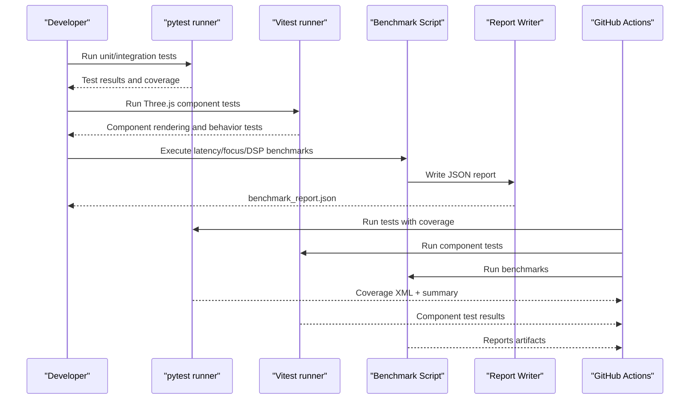

**Diagram sources**
- [aether_pipeline.yml](file://.github/workflows/aether_pipeline.yml#L61-L101)
- [bench_latency.py](file://tests/benchmarks/bench_latency.py#L23-L87)
- [bench_focus.py](file://tests/benchmarks/bench_focus.py#L83-L163)
- [bench_dsp.py](file://tests/benchmarks/bench_dsp.py#L76-L134)
- [benchmark_report.json](file://tests/reports/benchmark_report.json#L1-L297)
- [vitest.config.ts](file://apps/portal/vitest.config.ts#L1-L17)

## Detailed Component Analysis

### Latency Benchmark
Purpose: Measure internal processing latency excluding external network and inference delays. Targets include sub-10ms average internal latency and a small fraction of the 180ms total turnaround budget.

Key behaviors:
- Generates PCM frames at 16 kHz, 30 ms length
- Runs VAD and paralinguistic analysis in a tight loop
- Computes average, p95, and p99 latencies
- Prints resource budget usage and success criteria

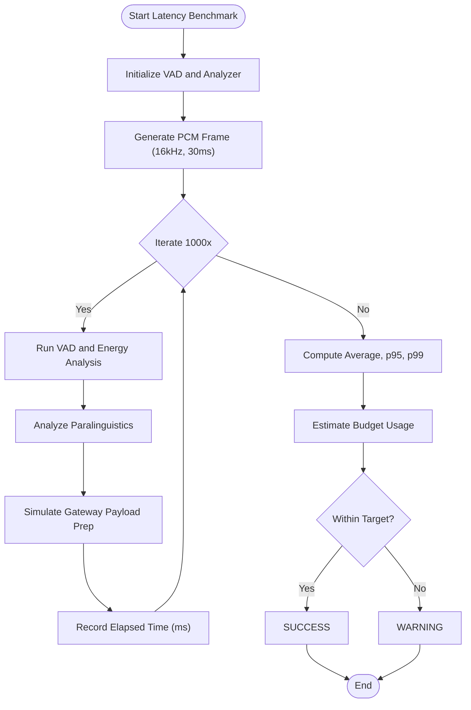

**Diagram sources**
- [bench_latency.py](file://tests/benchmarks/bench_latency.py#L23-L87)

**Section sources**
- [bench_latency.py](file://tests/benchmarks/bench_latency.py#L1-L88)

### Focus Detection Benchmark
Purpose: Evaluate paralinguistic accuracy for Zen Mode detection using synthetic and optionally real-world audio.

Key behaviors:
- Generates typing, speech, and silence chunks
- Optionally loads real WAV files labeled by filename convention
- Computes accuracy, precision, recall, and F1 score
- Validates against competitive-edge thresholds

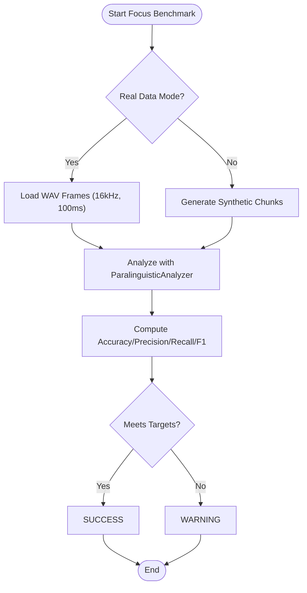

**Diagram sources**
- [bench_focus.py](file://tests/benchmarks/bench_focus.py#L83-L163)

**Section sources**
- [bench_focus.py](file://tests/benchmarks/bench_focus.py#L1-L164)

### DSP Performance Benchmark (Rust vs NumPy)
Purpose: Compare performance of Rust Cortex DSP functions versus NumPy baselines.

Key behaviors:
- Benchmarks energy_vad and find_zero_crossing
- Measures microseconds per call for both implementations
- Calculates speedup ratio when Rust backend is available
- Provides diagnostic output and success condition

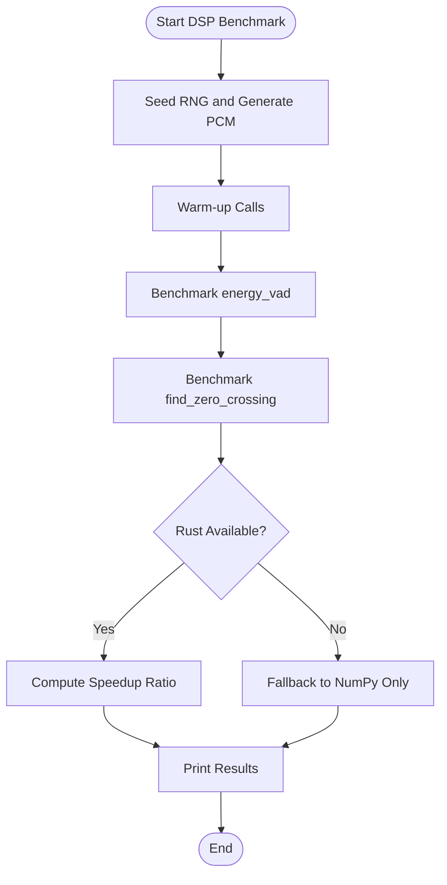

**Diagram sources**
- [bench_dsp.py](file://tests/benchmarks/bench_dsp.py#L76-L134)

**Section sources**
- [bench_dsp.py](file://tests/benchmarks/bench_dsp.py#L1-L135)

### Event Bus Stress: Lane Isolation
Purpose: Validate multi-lane isolation by flooding the Telemetry lane while measuring audio frame latency.

Key behaviors:
- Subscribes to audio events
- Publishes 10k telemetry events to simulate load
- Publishes a single high-priority audio frame mid-flood
- Asserts that audio latency remains under 10 ms

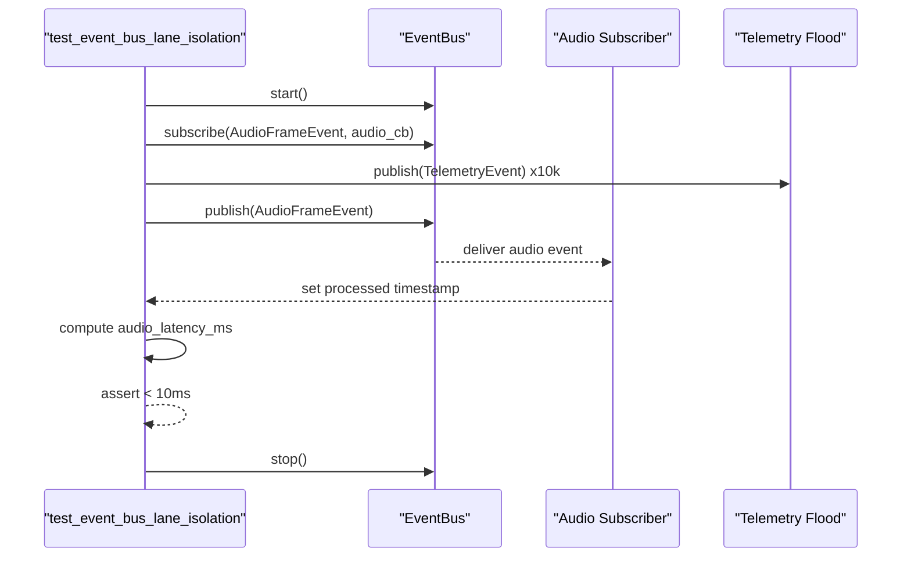

**Diagram sources**
- [test_event_bus_stress.py](file://tests/benchmarks/test_event_bus_stress.py#L9-L75)

**Section sources**
- [test_event_bus_stress.py](file://tests/benchmarks/test_event_bus_stress.py#L1-L76)

### Event Bus Load: 10k+ EPS
Purpose: Stress the event bus with 10,000+ events per second across three priority tiers.

Key behaviors:
- Publishes mixed Audio, Control, and Telemetry events
- Tracks processed counts per category
- Asserts minimum EPS and low drop rate under 10s

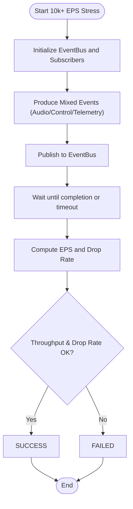

**Diagram sources**
- [test_event_bus_load.py](file://tests/stress/test_event_bus_load.py#L8-L67)

**Section sources**
- [test_event_bus_load.py](file://tests/stress/test_event_bus_load.py#L1-L70)

### System Alpha E2E (Zero-Mock)
Purpose: Hardened end-to-end test validating protocol handshake, session establishment, and basic audio flow with strict timeouts and diagnostics.

Key behaviors:
- Generates signing keys and initializes registry
- Starts gateway server and connects via WebSocket
- Handles challenge/response handshake and session ACK
- Sends dummy audio and asserts hive activity
- Uses timeouts to detect protocol hangs

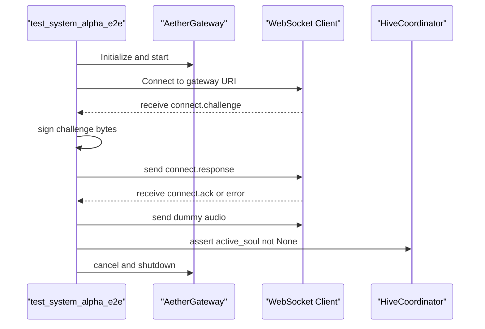

**Diagram sources**
- [test_system_alpha_e2e.py](file://tests/e2e/test_system_alpha_e2e.py#L61-L182)

**Section sources**
- [test_system_alpha_e2e.py](file://tests/e2e/test_system_alpha_e2e.py#L1-L187)

### Enhanced Three.js Component Testing Infrastructure

**Updated** Added comprehensive testing infrastructure for Three.js-based visual components.

#### FluidThoughtParticles Testing
Purpose: Test the immersive 3D conversation experience component with comprehensive rendering, store integration, and performance validation.

Key behaviors:
- Renders without crashing using Canvas mock
- Integrates with Aether store for transcript and audio state
- Handles empty and populated transcript arrays
- Validates particle generation and physics calculations
- Tests performance with large datasets
- Ensures proper memory cleanup

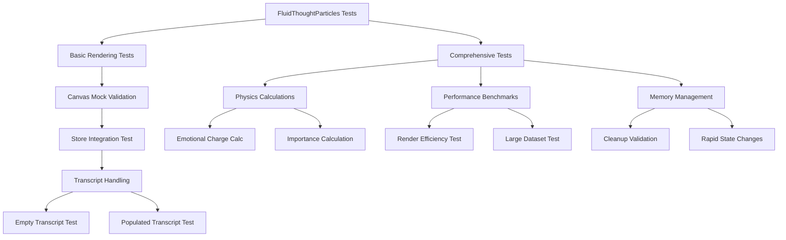

**Diagram sources**
- [FluidThoughtParticles.basic.test.tsx](file://apps/portal/src/__tests__/FluidThoughtParticles.basic.test.tsx#L69-L130)
- [FluidThoughtParticles.test.tsx](file://apps/portal/src/__tests__/FluidThoughtParticles.test.tsx#L127-L354)

#### QuantumNeuralAvatar Testing
Purpose: Test the 3D avatar component with size variants, state handling, and visual styling validation.

Key behaviors:
- Renders all size variants (icon, small, medium, large, fullscreen)
- Handles different avatar variants (minimal, standard, detailed)
- Validates engine state transitions and audio reactivity
- Tests carbon fiber styling and status indicators
- Ensures proper cleanup and performance optimization

```mermaid
flowchart TD
QNA["QuantumNeuralAvatar Tests"] --> SizeTests["Size Variant Tests"]
SizeTests --> IconSize["Icon Size Test"]
SizeTests --> SmallSize["Small Size Test"]
SizeTests --> MediumSize["Medium Size Test"]
SizeTests --> LargeSize["Large Size Test"]
SizeTests --> Fullscreen["Fullscreen Test"]
QNA --> VariantTests["Variant Tests"]
VariantTests --> Minimal["Minimal Variant"]
VariantTests --> Standard["Standard Variant"]
VariantTests --> Detailed["Detailed Variant"]
QNA --> StateTests["State Transition Tests"]
StateTests --> IdleState["IDLE State"]
StateTests --> Listening["LISTENING State"]
StateTests --> Thinking["THINKING State"]
StateTests --> Speaking["SPEAKING State"]
StateTests --> Interrupting["INTERRUPTING State"]
QNA --> StylingTests["Styling Tests"]
StylingTests --> CarbonFiber["Carbon Fiber Background"]
StylingTests --> TextureOverlay["Texture Overlay"]
StylingTests --> StatusIndicator["Status Indicator"]
```

**Diagram sources**
- [QuantumNeuralAvatar.basic.test.tsx](file://apps/portal/src/__tests__/QuantumNeuralAvatar.basic.test.tsx#L59-L108)
- [QuantumNeuralAvatar.test.tsx](file://apps/portal/src/__tests__/QuantumNeuralAvatar.test.tsx#L140-L476)

**Section sources**
- [FluidThoughtParticles.basic.test.tsx](file://apps/portal/src/__tests__/FluidThoughtParticles.basic.test.tsx#L1-L131)
- [QuantumNeuralAvatar.basic.test.tsx](file://apps/portal/src/__tests__/QuantumNeuralAvatar.basic.test.tsx#L1-L109)
- [FluidThoughtParticles.test.tsx](file://apps/portal/src/__tests__/FluidThoughtParticles.test.tsx#L1-L355)
- [QuantumNeuralAvatar.test.tsx](file://apps/portal/src/__tests__/QuantumNeuralAvatar.test.tsx#L1-L477)

### Continuous Integration and Quality Gates
The CI pipeline enforces:
- Rust check for Cortex
- Linting and formatting with ruff
- Python tests with coverage and import verification
- Next.js portal linting and testing with Vitest
- Security scanning with bandit and safety
- Docker image build check

**Updated** Enhanced with Vitest-based testing for Three.js components in the portal application.

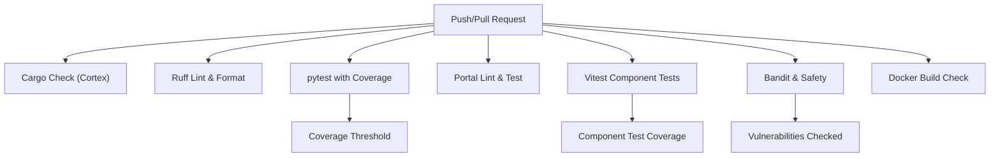

**Diagram sources**
- [aether_pipeline.yml](file://.github/workflows/aether_pipeline.yml#L20-L159)
- [vitest.config.ts](file://apps/portal/vitest.config.ts#L1-L17)

**Section sources**
- [aether_pipeline.yml](file://.github/workflows/aether_pipeline.yml#L1-L160)
- [vitest.config.ts](file://apps/portal/vitest.config.ts#L1-L17)

## Dependency Analysis
- Test discovery and filtering:
  - conftest.py excludes certain directories and ensures project root is in path
  - **Vitest configuration for portal component testing**
- Benchmark outputs:
  - Benchmarks write structured JSON reports consumed by dashboard tools
- CI orchestration:
  - GitHub Actions coordinates multi-stage jobs with dependencies
- **Enhanced Three.js component dependencies**:
  - React Three Fiber and Drei for 3D rendering
  - Three.js core library for 3D geometries and materials
  - Zustand for state management integration

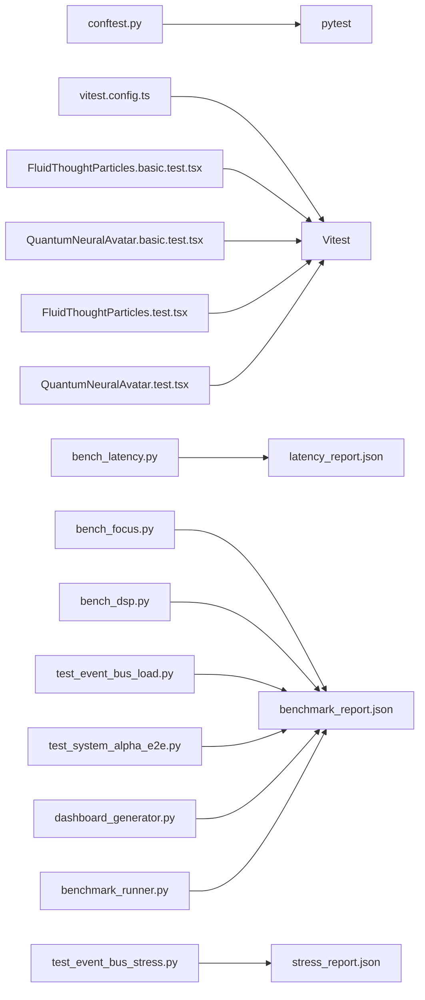

**Diagram sources**
- [conftest.py](file://conftest.py#L1-L10)
- [vitest.config.ts](file://apps/portal/vitest.config.ts#L1-L17)
- [bench_latency.py](file://tests/benchmarks/bench_latency.py#L1-L88)
- [bench_focus.py](file://tests/benchmarks/bench_focus.py#L1-L164)
- [bench_dsp.py](file://tests/benchmarks/bench_dsp.py#L1-L135)
- [test_event_bus_stress.py](file://tests/benchmarks/test_event_bus_stress.py#L1-L76)
- [test_event_bus_load.py](file://tests/stress/test_event_bus_load.py#L1-L70)
- [test_system_alpha_e2e.py](file://tests/e2e/test_system_alpha_e2e.py#L1-L187)
- [latency_report.json](file://tests/reports/latency_report.json#L1-L7)
- [stress_report.json](file://tests/reports/stress_report.json#L1-L6)
- [benchmark_report.json](file://tests/reports/benchmark_report.json#L1-L297)
- [dashboard_generator.py](file://tools/dashboard_generator.py)
- [benchmark_runner.py](file://tools/benchmark_runner.py)
- [FluidThoughtParticles.basic.test.tsx](file://apps/portal/src/__tests__/FluidThoughtParticles.basic.test.tsx#L1-L131)
- [QuantumNeuralAvatar.basic.test.tsx](file://apps/portal/src/__tests__/QuantumNeuralAvatar.basic.test.tsx#L1-L109)
- [FluidThoughtParticles.test.tsx](file://apps/portal/src/__tests__/FluidThoughtParticles.test.tsx#L1-L355)
- [QuantumNeuralAvatar.test.tsx](file://apps/portal/src/__tests__/QuantumNeuralAvatar.test.tsx#L1-L477)

**Section sources**
- [conftest.py](file://conftest.py#L1-L10)
- [vitest.config.ts](file://apps/portal/vitest.config.ts#L1-L17)
- [benchmark_report.json](file://tests/reports/benchmark_report.json#L1-L297)
- [latency_report.json](file://tests/reports/latency_report.json#L1-L7)
- [stress_report.json](file://tests/reports/stress_report.json#L1-L6)
- [FluidThoughtParticles.basic.test.tsx](file://apps/portal/src/__tests__/FluidThoughtParticles.basic.test.tsx#L1-L131)
- [QuantumNeuralAvatar.basic.test.tsx](file://apps/portal/src/__tests__/QuantumNeuralAvatar.basic.test.tsx#L1-L109)
- [FluidThoughtParticles.test.tsx](file://apps/portal/src/__tests__/FluidThoughtParticles.test.tsx#L1-L355)
- [QuantumNeuralAvatar.test.tsx](file://apps/portal/src/__tests__/QuantumNeuralAvatar.test.tsx#L1-L477)

## Performance Considerations
- Latency targets:
  - Internal processing budget should remain under 10 ms average to preserve ~175 ms for network and inference within the 180 ms total turnaround goal
- Throughput targets:
  - Expect 10k+ EPS in a clean environment with sub-10 ms per burst processing
- Accuracy targets:
  - Focus detection should meet competitive-edge thresholds (accuracy and F1 scores)
- Stability:
  - Long sessions should show bounded memory growth and convergence
- **Enhanced Visual Component Performance**:
  - Three.js components should render efficiently under 100ms
  - Particle systems handle large datasets without performance degradation
  - Avatar components support rapid state transitions without memory leaks

**Updated** Added performance considerations for enhanced Three.js component testing infrastructure.

[No sources needed since this section provides general guidance]

## Troubleshooting Guide
Common issues and techniques:
- Port conflicts:
  - If binding fails, the system should detect OSError and switch to a backup port without crashing
- Redis disconnects:
  - The global bus should log failures and enter a retry state without interrupting the primary audio stream
- Protocol hangs:
  - Use E2E tests with timeouts to detect stalls during handshake or session establishment
- Coverage failures:
  - Ensure coverage threshold is met and investigate missing modules
- TCC sandbox issues:
  - conftest.py adjusts collection paths to avoid TCC sandbox problems
- **Three.js Component Issues**:
  - Canvas mock failures indicate missing Three.js dependency mocking
  - Store integration issues suggest Zustand state management problems
  - Performance bottlenecks in particle systems require optimization of geometry and material usage

**Updated** Added troubleshooting guidance for enhanced Three.js component testing infrastructure.

**Section sources**
- [testing_matrix.md](file://docs/testing_matrix.md#L68-L79)
- [test_system_alpha_e2e.py](file://tests/e2e/test_system_alpha_e2e.py#L169-L174)
- [aether_pipeline.yml](file://.github/workflows/aether_pipeline.yml#L90-L101)
- [conftest.py](file://conftest.py#L1-L10)
- [FluidThoughtParticles.basic.test.tsx](file://apps/portal/src/__tests__/FluidThoughtParticles.basic.test.tsx#L13-L67)
- [QuantumNeuralAvatar.basic.test.tsx](file://apps/portal/src/__tests__/QuantumNeuralAvatar.basic.test.tsx#L17-L57)

## Conclusion
Aether Voice OS employs a rigorous, tiered testing strategy supported by dedicated benchmarks, stress tests, and a robust CI pipeline. **Enhanced with comprehensive Three.js component testing infrastructure** that validates visual components with both basic and comprehensive test suites. The framework validates latency budgets, accuracy thresholds, and system stability under load, while ensuring code quality through linting, security scanning, and coverage requirements. Contributors can extend the suite by adding new benchmarks, stress scenarios, E2E probes, and **enhanced visual component tests** aligned with the documented matrix and CI expectations.

**Updated** Enhanced conclusion to reflect the improved testing infrastructure for visual components.

[No sources needed since this section summarizes without analyzing specific files]

## Appendices

### Writing Custom Benchmarks
- Follow the pattern of existing benchmarks:
  - Initialize core components
  - Generate synthetic or real data
  - Measure and record metrics
  - Write a structured JSON report to tests/reports
- Example reference paths:
  - [bench_latency.py](file://tests/benchmarks/bench_latency.py#L23-L87)
  - [bench_focus.py](file://tests/benchmarks/bench_focus.py#L83-L163)
  - [bench_dsp.py](file://tests/benchmarks/bench_dsp.py#L76-L134)

**Section sources**
- [bench_latency.py](file://tests/benchmarks/bench_latency.py#L1-L88)
- [bench_focus.py](file://tests/benchmarks/bench_focus.py#L1-L164)
- [bench_dsp.py](file://tests/benchmarks/bench_dsp.py#L1-L135)

### Extending the Test Suite
- Add unit tests under tests/unit
- Add integration tests under tests/integration
- Add stress tests under tests/stress
- Add E2E tests under tests/e2e
- **Add Three.js component tests under apps/portal/src/__tests__**:
  - Use basic.test.tsx for simplified component structure validation
  - Use test.tsx for comprehensive functionality testing
  - Follow existing patterns for React Three Fiber and Three.js mocking
- Use pytest markers and async fixtures as demonstrated in existing tests
- Reference:
  - [test_event_bus_load.py](file://tests/stress/test_event_bus_load.py#L6-L67)
  - [test_system_alpha_e2e.py](file://tests/e2e/test_system_alpha_e2e.py#L60-L103)
  - [FluidThoughtParticles.basic.test.tsx](file://apps/portal/src/__tests__/FluidThoughtParticles.basic.test.tsx#L69-L130)
  - [QuantumNeuralAvatar.basic.test.tsx](file://apps/portal/src/__tests__/QuantumNeuralAvatar.basic.test.tsx#L59-L108)

**Updated** Added guidance for extending Three.js component testing infrastructure.

**Section sources**
- [test_event_bus_load.py](file://tests/stress/test_event_bus_load.py#L1-L70)
- [test_system_alpha_e2e.py](file://tests/e2e/test_system_alpha_e2e.py#L1-L187)
- [FluidThoughtParticles.basic.test.tsx](file://apps/portal/src/__tests__/FluidThoughtParticles.basic.test.tsx#L1-L131)
- [QuantumNeuralAvatar.basic.test.tsx](file://apps/portal/src/__tests__/QuantumNeuralAvatar.basic.test.tsx#L1-L109)

### Running Specific Test Suites
- Unit tests: pytest tests/unit
- Integration tests: pytest tests/integration
- Benchmarks: python tests/benchmarks/<benchmark_script>.py
- Stress tests: pytest tests/stress
- E2E tests: pytest tests/e2e
- **Portal component tests**: vitest run apps/portal/src/__tests__/*
- CI coverage threshold enforcement is configured in the pipeline

**Updated** Added guidance for running portal component tests with Vitest.

**Section sources**
- [aether_pipeline.yml](file://.github/workflows/aether_pipeline.yml#L90-L101)
- [testing_matrix.md](file://docs/testing_matrix.md#L14-L17)
- [vitest.config.ts](file://apps/portal/vitest.config.ts#L1-L17)

### Quality Metrics and Coverage
- Coverage threshold: configured to fail under 60%
- Import verification: core modules are checked after installation
- Security scanning: bandit and safety checks are part of CI
- Linting: ruff for style and correctness
- **Component test coverage**: Vitest-based testing for Three.js components with comprehensive rendering and behavior validation

**Updated** Added quality metrics for enhanced component testing infrastructure.

**Section sources**
- [aether_pipeline.yml](file://.github/workflows/aether_pipeline.yml#L90-L101)
- [aether_pipeline.yml](file://.github/workflows/aether_pipeline.yml#L140-L147)
- [aether_pipeline.yml](file://.github/workflows/aether_pipeline.yml#L52-L56)
- [vitest.config.ts](file://apps/portal/vitest.config.ts#L1-L17)

### Test Debugging and Profiling
- Use E2E tests with timeouts to isolate protocol stalls
- Enable debug mode in AI configurations for additional logs
- Inspect JSON reports for detailed metrics and trends
- Validate event bus behavior under load with stress tests
- **Debug Three.js component rendering issues**:
  - Verify Canvas mock configuration in test files
  - Check React Three Fiber and Three.js dependency mocking
  - Validate store integration with Zustand state management
  - Monitor performance with built-in render time benchmarks

**Updated** Added debugging guidance for enhanced Three.js component testing infrastructure.

**Section sources**
- [test_system_alpha_e2e.py](file://tests/e2e/test_system_alpha_e2e.py#L169-L174)
- [test_event_bus_stress.py](file://tests/benchmarks/test_event_bus_stress.py#L58-L75)
- [benchmark_report.json](file://tests/reports/benchmark_report.json#L1-L297)
- [FluidThoughtParticles.test.tsx](file://apps/portal/src/__tests__/FluidThoughtParticles.test.tsx#L296-L354)
- [QuantumNeuralAvatar.test.tsx](file://apps/portal/src/__tests__/QuantumNeuralAvatar.test.tsx#L431-L476)