# Unit Testing

<cite>
**Referenced Files in This Document**
- [engine.py](file://core/engine.py)
- [audio.py](file://core/logic/managers/audio.py)
- [router.py](file://core/tools/router.py)
- [event_bus.py](file://core/infra/event_bus.py)
- [telemetry.py](file://core/infra/telemetry.py)
- [test_core.py](file://tests/unit/test_core.py)
- [test_audio.py](file://tests/unit/test_audio.py)
- [test_telemetry.py](file://tests/unit/test_telemetry.py)
- [test_memory_deep.py](file://tests/unit/test_memory_deep.py)
- [test_gateway.py](file://tests/unit/test_gateway.py)
- [test_agent_manager.py](file://tests/unit/test_agent_manager.py)
- [test_voice_tool.py](file://tests/unit/test_voice_tool.py)
- [test_spectral.py](file://tests/unit/test_spectral.py)
- [test_vad.py](file://tests/unit/test_vad.py)
</cite>

## Table of Contents
1. [Introduction](#introduction)
2. [Project Structure](#project-structure)
3. [Core Components](#core-components)
4. [Architecture Overview](#architecture-overview)
5. [Detailed Component Analysis](#detailed-component-analysis)
6. [Dependency Analysis](#dependency-analysis)
7. [Performance Considerations](#performance-considerations)
8. [Troubleshooting Guide](#troubleshooting-guide)
9. [Conclusion](#conclusion)
10. [Appendices](#appendices)

## Introduction
This document provides comprehensive unit testing guidance for Aether Voice OS. It explains how to test individual components, modules, and functions across the core engine, audio processing, memory systems, and telemetry. It covers testing patterns for asynchronous code, event-driven components, and audio processing functions. It also details mocking strategies for external dependencies (Gemini API, Firebase services, and hardware), test isolation techniques, fixtures, parameterized testing, edge-case validation, and boundary testing. Guidance on test coverage and maintaining high-quality unit tests is included.

## Project Structure
The unit tests are primarily located under tests/unit and exercise core Python modules in core/, including:
- Engine orchestration and lifecycle
- Audio processing and capture/playback
- Tool routing and biometric middleware
- Event bus and telemetry sinks
- Memory tool and Firebase integration
- Gateway transport and WebSocket handshake

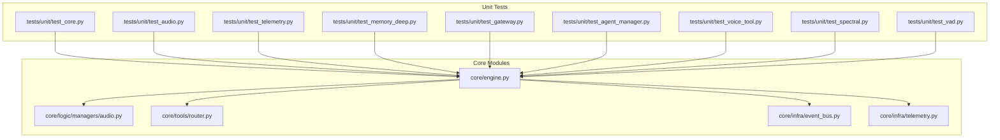

**Diagram sources**
- [test_core.py](file://tests/unit/test_core.py#L1-L503)
- [test_audio.py](file://tests/unit/test_audio.py#L1-L139)
- [test_telemetry.py](file://tests/unit/test_telemetry.py#L1-L77)
- [test_memory_deep.py](file://tests/unit/test_memory_deep.py#L1-L94)
- [test_gateway.py](file://tests/unit/test_gateway.py#L1-L198)
- [test_agent_manager.py](file://tests/unit/test_agent_manager.py#L1-L93)
- [test_voice_tool.py](file://tests/unit/test_voice_tool.py#L1-L234)
- [test_spectral.py](file://tests/unit/test_spectral.py#L1-L63)
- [test_vad.py](file://tests/unit/test_vad.py#L1-L141)
- [engine.py](file://core/engine.py#L1-L240)
- [audio.py](file://core/logic/managers/audio.py#L1-L98)
- [router.py](file://core/tools/router.py#L1-L360)
- [event_bus.py](file://core/infra/event_bus.py#L1-L152)
- [telemetry.py](file://core/infra/telemetry.py#L1-L130)

**Section sources**
- [test_core.py](file://tests/unit/test_core.py#L1-L503)
- [engine.py](file://core/engine.py#L1-L240)

## Core Components
Key components commonly tested in unit suites:
- AetherEngine: Orchestrator initializing managers, gateway, audio, infrastructure, and admin API; manages lifecycle and async task groups.
- AudioManager: Manages capture, playback, VAD, and paralinguistic analysis; bridges affective data to gateway and event bus.
- ToolRouter: Registers tools, generates declarations, dispatches function calls, applies biometric middleware, and profiles performance.
- EventBus: Tiered event bus with three queues and subscribers; enforces latency budgets and drops expired events.
- TelemetryManager: OpenTelemetry-based sink exporting traces; records usage and cost estimates.

Testing patterns demonstrated:
- Isolation via mocking external libraries and hardware dependencies
- Fixture usage for configuration and shared mocks
- Parameterized tests for edge cases and boundary conditions
- Async fixtures and callbacks for event-driven and audio pipelines
- Assertions on state transitions, counts, and performance metrics

**Section sources**
- [engine.py](file://core/engine.py#L26-L240)
- [audio.py](file://core/logic/managers/audio.py#L18-L98)
- [router.py](file://core/tools/router.py#L120-L360)
- [event_bus.py](file://core/infra/event_bus.py#L69-L152)
- [telemetry.py](file://core/infra/telemetry.py#L14-L130)

## Architecture Overview
The unit testing architecture focuses on isolating modules and validating interactions through mocks and fixtures.

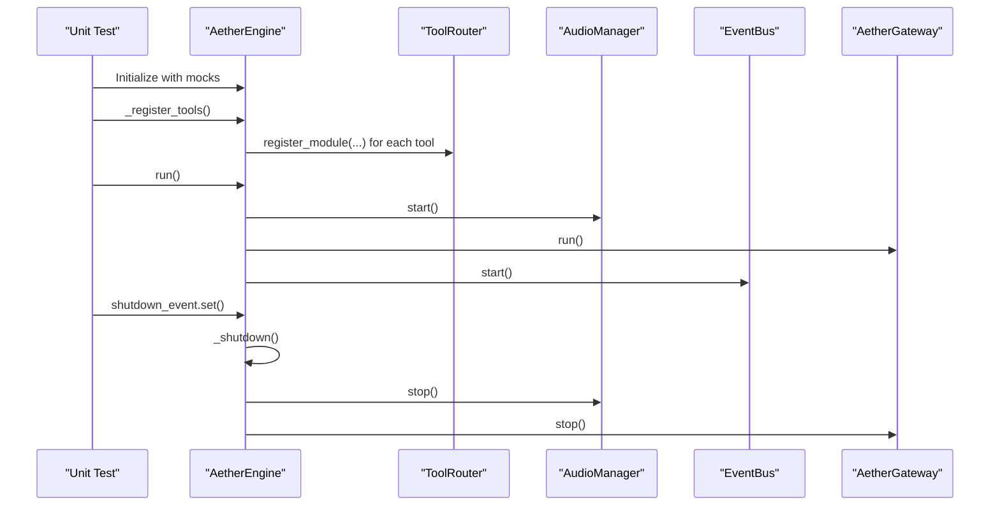

**Diagram sources**
- [engine.py](file://core/engine.py#L189-L240)
- [router.py](file://core/tools/router.py#L183-L200)
- [audio.py](file://core/logic/managers/audio.py#L51-L57)
- [event_bus.py](file://core/infra/event_bus.py#L102-L124)

## Detailed Component Analysis

### AetherEngine
- Responsibilities: Initializes managers, registers tools, starts/stops subsystems, coordinates async tasks, and handles shutdown.
- Testing focus:
  - Configuration loading and defaults
  - Tool registration pipeline
  - Async lifecycle and task group coordination
  - Shutdown sequence and cleanup
  - Delegate/handle complex task helpers for ADK runners

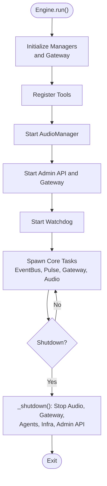

**Diagram sources**
- [engine.py](file://core/engine.py#L189-L240)

**Section sources**
- [engine.py](file://core/engine.py#L26-L240)
- [test_core.py](file://tests/unit/test_core.py#L458-L503)

### AudioManager
- Responsibilities: Capture, playback, VAD, paralinguistics; bridges affective data to gateway and event bus.
- Testing focus:
  - Start/stop and task spawning
  - Interrupt and flash interrupt semantics
  - Affective data bridge publishing to EventBus

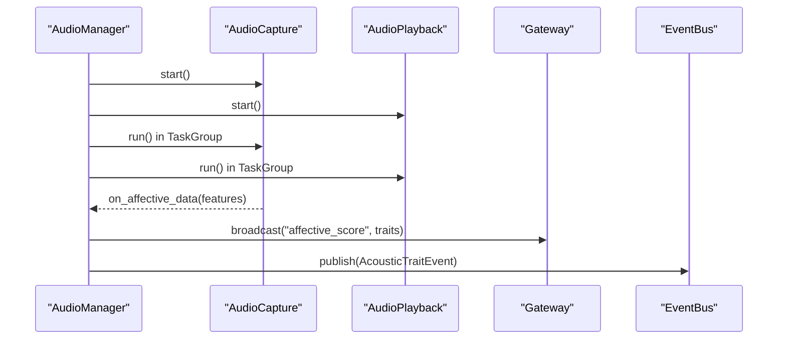

**Diagram sources**
- [audio.py](file://core/logic/managers/audio.py#L51-L98)
- [event_bus.py](file://core/infra/event_bus.py#L144-L152)

**Section sources**
- [audio.py](file://core/logic/managers/audio.py#L18-L98)
- [test_telemetry.py](file://tests/unit/test_telemetry.py#L23-L77)

### ToolRouter
- Responsibilities: Tool registration, declarations, dispatch, biometric middleware, performance profiling, semantic recovery.
- Testing focus:
  - Registration of modules and individual tools
  - Dispatch with synchronous and asynchronous handlers
  - Biometric middleware authorization
  - Performance statistics and latency tiers
  - Semantic recovery via vector store

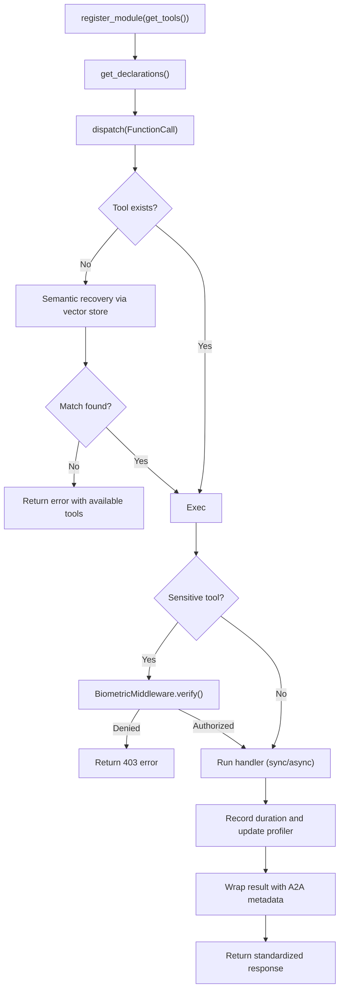

**Diagram sources**
- [router.py](file://core/tools/router.py#L183-L360)

**Section sources**
- [router.py](file://core/tools/router.py#L120-L360)
- [test_core.py](file://tests/unit/test_core.py#L458-L503)
- [test_voice_tool.py](file://tests/unit/test_voice_tool.py#L178-L203)

### EventBus
- Responsibilities: Three-tier queues, subscribers, expiration enforcement, and concurrent routing.
- Testing focus:
  - Publishing to correct queues by event type
  - Worker lanes dropping expired events when configured
  - Concurrent delivery to subscribers

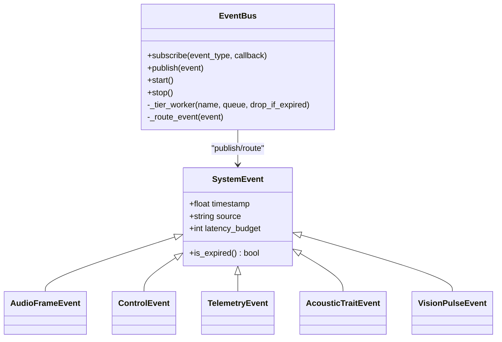

**Diagram sources**
- [event_bus.py](file://core/infra/event_bus.py#L69-L152)

**Section sources**
- [event_bus.py](file://core/infra/event_bus.py#L69-L152)
- [audio.py](file://core/logic/managers/audio.py#L72-L98)

### TelemetryManager
- Responsibilities: OpenTelemetry initialization, exporter selection, usage recording, and cost estimation.
- Testing focus:
  - Initialization with environment variables
  - Usage recording and span attribute updates
  - No-op fallback on initialization failure

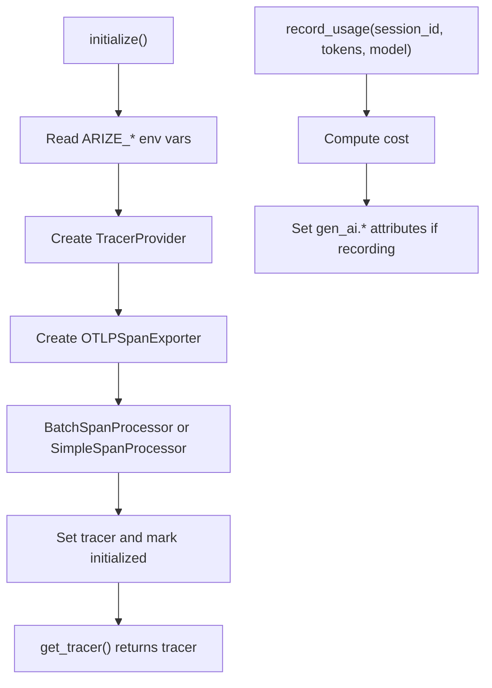

**Diagram sources**
- [telemetry.py](file://core/infra/telemetry.py#L35-L130)

**Section sources**
- [telemetry.py](file://core/infra/telemetry.py#L14-L130)

### Audio Processing and DSP
- Focus areas:
  - RingBuffer: wrap-around, overflow, clear, empty reads
  - Zero-crossing detection: crossings at boundaries, no crossings
  - Energy VAD: silence detection, thresholds, result structure
  - Adaptive VAD: baseline adaptation, soft/hard thresholds
  - Spectral coherence and ERLE: signal coherence and echo metrics

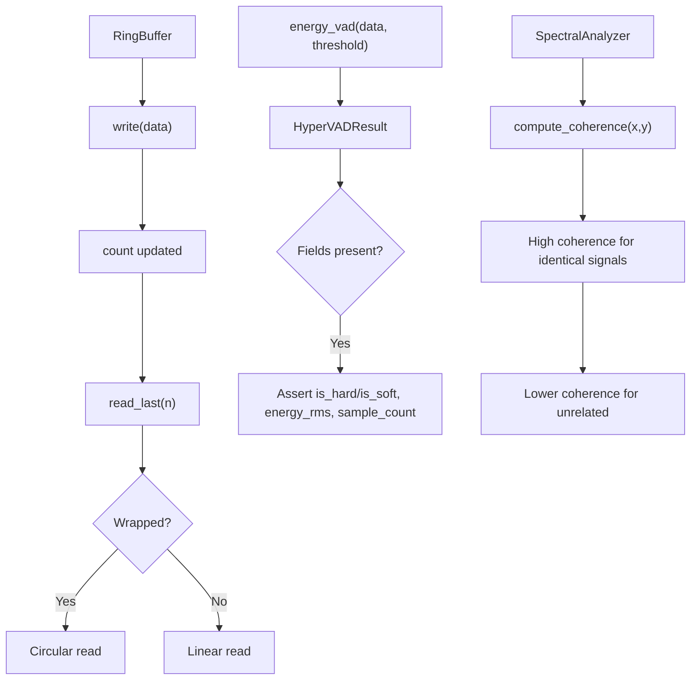

**Diagram sources**
- [test_audio.py](file://tests/unit/test_audio.py#L18-L139)
- [test_vad.py](file://tests/unit/test_vad.py#L39-L141)
- [test_spectral.py](file://tests/unit/test_spectral.py#L28-L63)

**Section sources**
- [test_audio.py](file://tests/unit/test_audio.py#L1-L139)
- [test_vad.py](file://tests/unit/test_vad.py#L1-L141)
- [test_spectral.py](file://tests/unit/test_spectral.py#L1-L63)

### Memory Tool and Firebase Integration
- Focus areas:
  - Offline fallback behavior for save/recall/list
  - Priority and tag handling in memory storage
  - Pruning logic targeting priority collections
  - Semantic search using array_contains_any

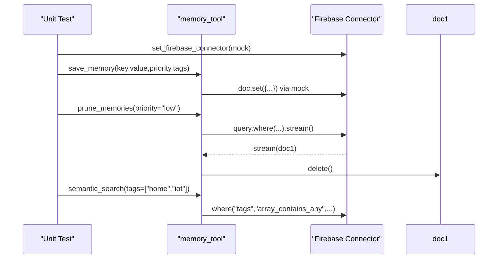

**Diagram sources**
- [test_memory_deep.py](file://tests/unit/test_memory_deep.py#L24-L94)

**Section sources**
- [test_memory_deep.py](file://tests/unit/test_memory_deep.py#L1-L94)

### Gateway Transport and WebSocket Handshake
- Focus areas:
  - Handshake challenge/response and ACK
  - Heartbeat tick/pong and client pruning
  - Broadcast to multiple clients

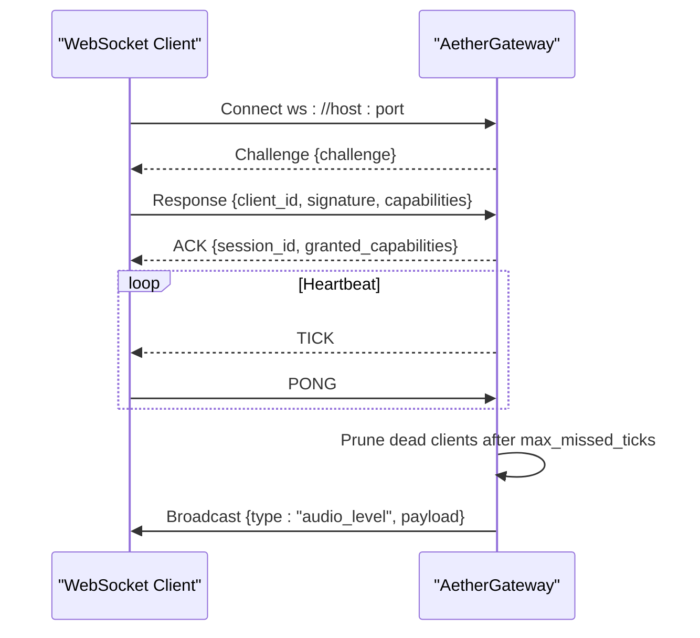

**Diagram sources**
- [test_gateway.py](file://tests/unit/test_gateway.py#L83-L198)

**Section sources**
- [test_gateway.py](file://tests/unit/test_gateway.py#L1-L198)

### VoiceTool State Machine and Lifecycle
- Focus areas:
  - State transitions and active state checks
  - Tool declaration structure and required fields
  - Setup/teardown lifecycle and interrupt handling

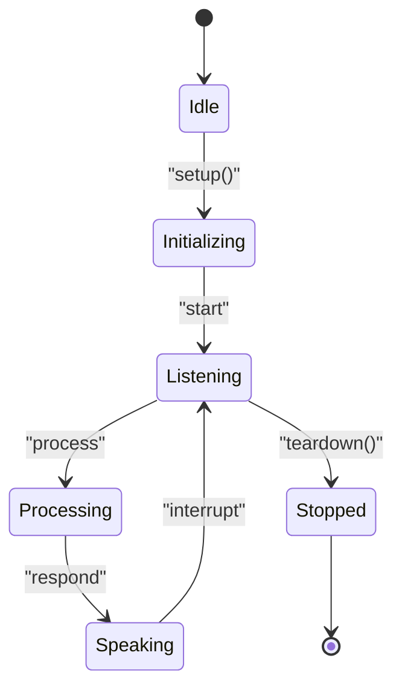

**Diagram sources**
- [test_voice_tool.py](file://tests/unit/test_voice_tool.py#L43-L85)

**Section sources**
- [test_voice_tool.py](file://tests/unit/test_voice_tool.py#L1-L234)

## Dependency Analysis
Unit tests isolate external dependencies and enforce test boundaries:
- Hardware and system libraries are mocked (e.g., pyaudio) to avoid runtime requirements.
- External services (Firebase, Gemini) are mocked via connectors and environment overrides.
- Async fixtures and callbacks decouple timing-sensitive components.

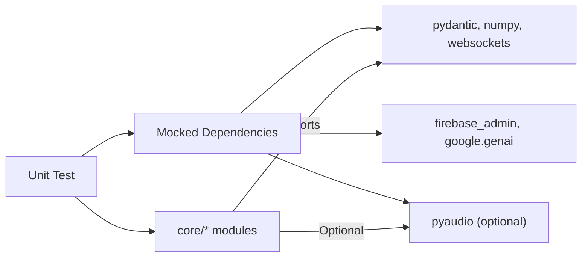

**Diagram sources**
- [test_agent_manager.py](file://tests/unit/test_agent_manager.py#L7-L47)
- [test_telemetry.py](file://tests/unit/test_telemetry.py#L10-L13)

**Section sources**
- [test_agent_manager.py](file://tests/unit/test_agent_manager.py#L1-L93)
- [test_telemetry.py](file://tests/unit/test_telemetry.py#L1-L77)

## Performance Considerations
- Asynchronous task orchestration: Use fixtures to spin up subsystems and cancel tasks deterministically.
- Event bus throughput: Validate tiered queue behavior and expiration policies.
- ToolRouter dispatch: Measure latency tiers and profile execution times.
- Audio telemetry throttling: Validate rate limiting and callback invocation windows.

[No sources needed since this section provides general guidance]

## Troubleshooting Guide
Common issues and resolutions:
- Missing external dependencies: Mock modules during import to avoid installation requirements.
- Async teardown failures: Ensure tasks are cancelled and gathered before assertions.
- Gateway handshake timeouts: Adjust heartbeat intervals and timeouts in fixtures.
- Memory tool offline behavior: Verify fallback statuses when Firebase is unavailable.

**Section sources**
- [test_agent_manager.py](file://tests/unit/test_agent_manager.py#L7-L47)
- [test_gateway.py](file://tests/unit/test_gateway.py#L110-L126)
- [test_memory_deep.py](file://tests/unit/test_memory_deep.py#L354-L374)

## Conclusion
Aether Voice OS unit tests emphasize isolation, deterministic behavior, and comprehensive coverage of asynchronous and event-driven paths. By leveraging fixtures, mocks, and targeted assertions, the suite validates core engine orchestration, audio processing correctness, tool routing reliability, and telemetry integrity. Adhering to these patterns ensures maintainable, high-quality unit tests across the platform.

[No sources needed since this section summarizes without analyzing specific files]

## Appendices

### Testing Patterns and Examples
- Configuration and defaults: Validate default configs and environment-driven loading.
- Audio processing: Boundary-value tests for silence, thresholds, and wrap-around behavior.
- Tool declarations: Verify handler presence and function declaration structure.
- Memory tool: Offline fallback, priority/tag handling, pruning, and semantic search queries.
- Gateway: Handshake, heartbeat, and broadcast behaviors.
- VoiceTool: State machine transitions and lifecycle.
- Telemetry: Throttling and usage recording.

**Section sources**
- [test_core.py](file://tests/unit/test_core.py#L28-L503)
- [test_audio.py](file://tests/unit/test_audio.py#L1-L139)
- [test_memory_deep.py](file://tests/unit/test_memory_deep.py#L1-L94)
- [test_gateway.py](file://tests/unit/test_gateway.py#L1-L198)
- [test_voice_tool.py](file://tests/unit/test_voice_tool.py#L1-L234)
- [test_telemetry.py](file://tests/unit/test_telemetry.py#L1-L77)