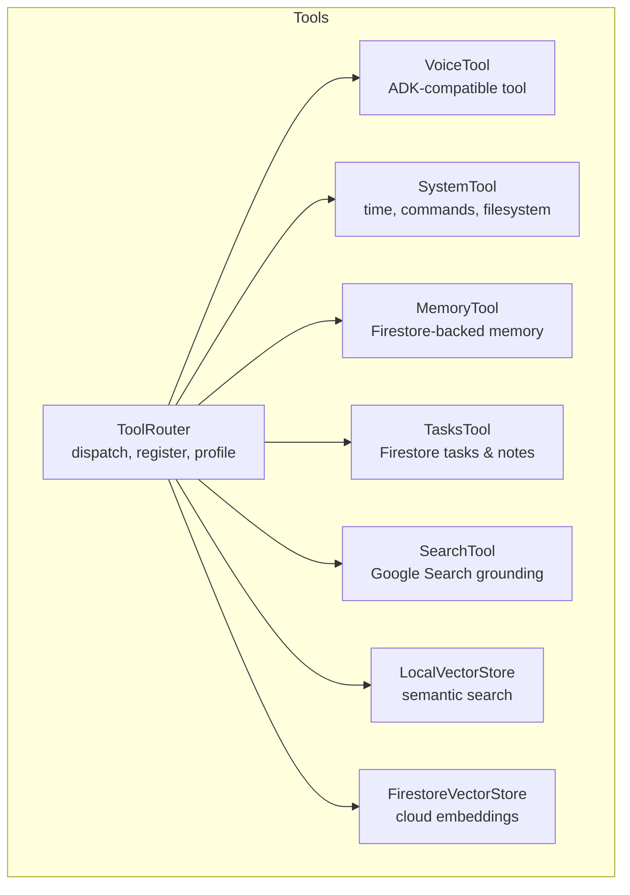
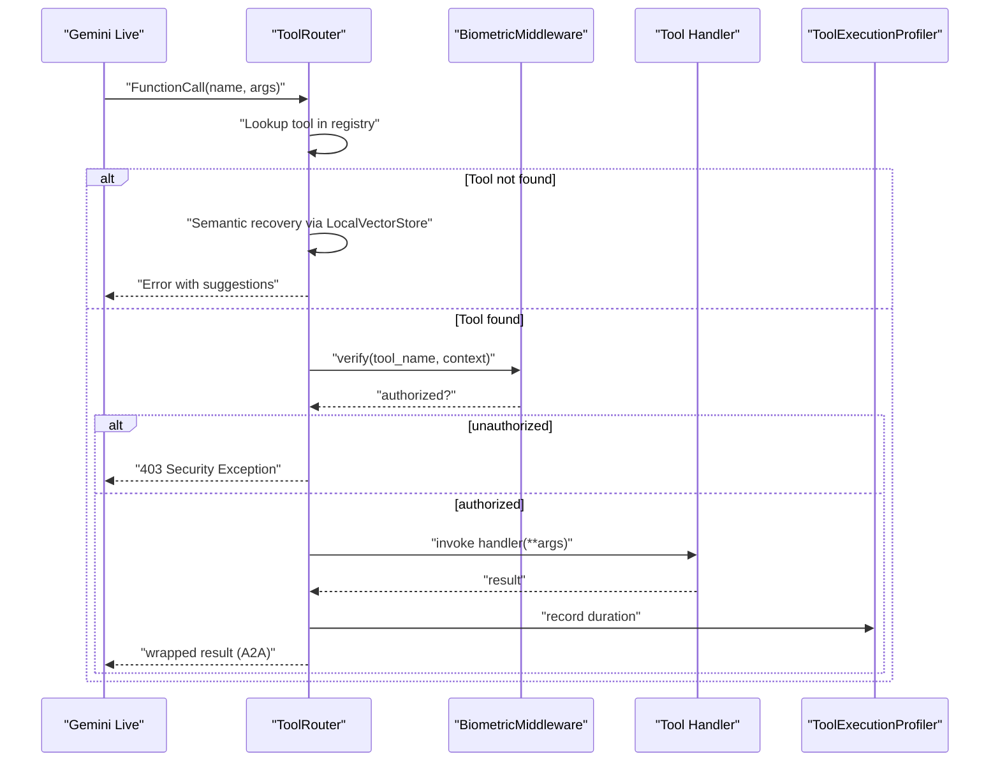
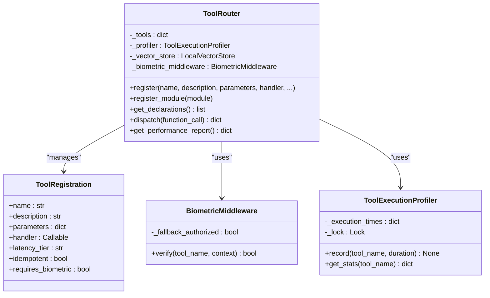
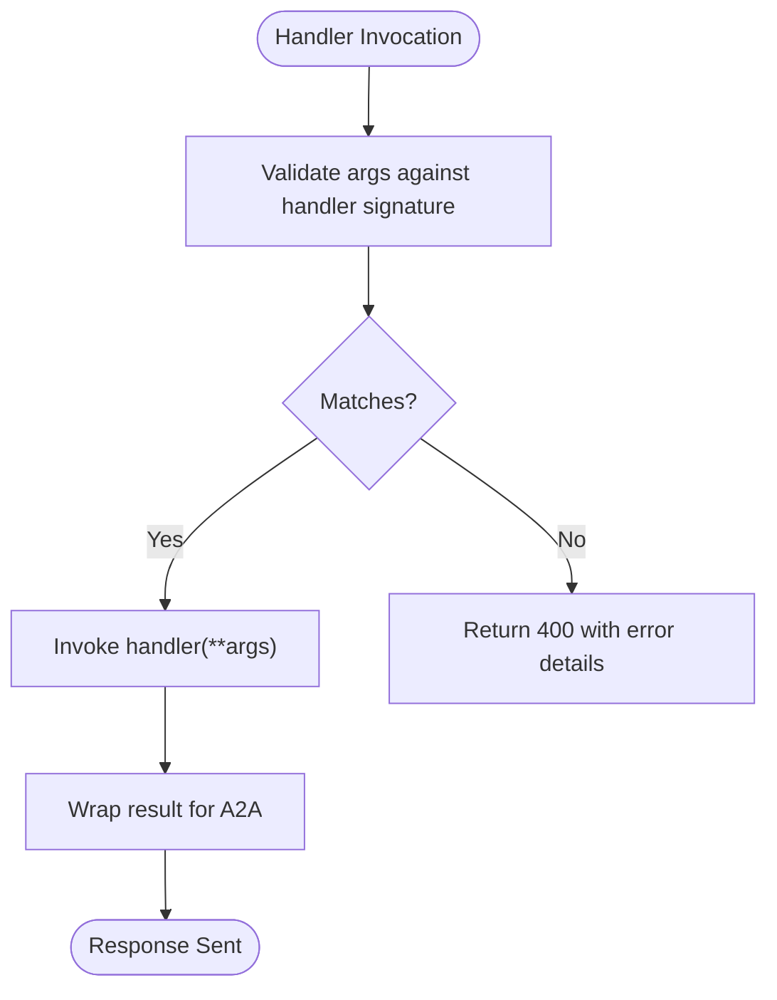
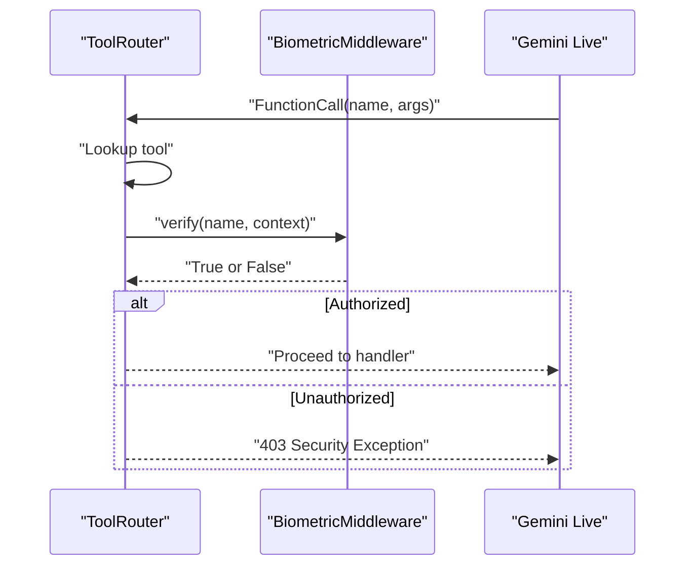
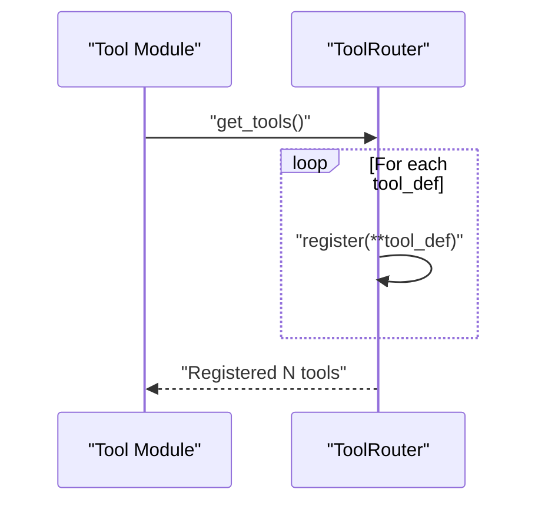
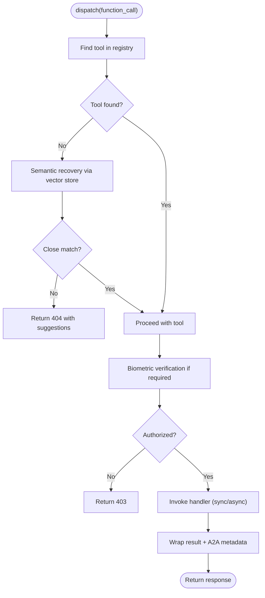
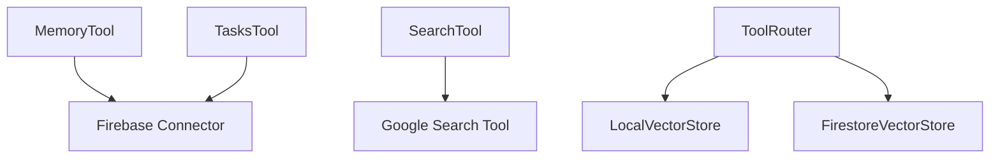
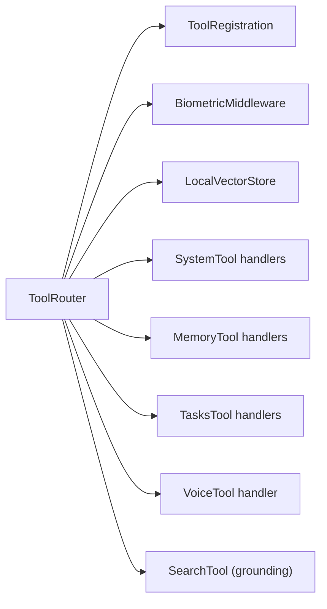

# Custom Tool Development

<cite>
**Referenced Files in This Document**
- [router.py](file://core/tools/router.py)
- [system_tool.py](file://core/tools/system_tool.py)
- [memory_tool.py](file://core/tools/memory_tool.py)
- [tasks_tool.py](file://core/tools/tasks_tool.py)
- [voice_tool.py](file://core/tools/voice_tool.py)
- [search_tool.py](file://core/tools/search_tool.py)
- [vector_store.py](file://core/tools/vector_store.py)
- [firestore_vector_store.py](file://core/tools/firestore_vector_store.py)
- [security.py](file://core/utils/security.py)
- [errors.py](file://core/utils/errors.py)
- [best_practices.md](file://best_practices.md)
- [test_voice_tool.py](file://tests/unit/test_voice_tool.py)
</cite>

## Table of Contents
1. [Introduction](#introduction)
2. [Project Structure](#project-structure)
3. [Core Components](#core-components)
4. [Architecture Overview](#architecture-overview)
5. [Detailed Component Analysis](#detailed-component-analysis)
6. [Dependency Analysis](#dependency-analysis)
7. [Performance Considerations](#performance-considerations)
8. [Troubleshooting Guide](#troubleshooting-guide)
9. [Conclusion](#conclusion)
10. [Appendices](#appendices)

## Introduction
This document explains how to develop custom tools for Aether Voice OS. It covers the entire lifecycle: designing function declarations and parameter schemas, implementing handlers, registering tools with the ToolRouter, enforcing parameter validation, executing tools synchronously or asynchronously, handling errors, and wrapping results for multi-agent interoperability. It also includes step-by-step examples, middleware patterns (such as biometric verification), integration with external APIs, testing strategies, debugging techniques, performance optimization, and best practices for security, documentation, and maintenance.

## Project Structure
Aether Voice OS organizes tooling around a central dispatcher (ToolRouter) and a set of modular tool implementations. Tools declare themselves via a module-level function and are registered either individually or via module discovery. Some tools integrate with external systems (e.g., Firebase, Google Search, or voice pipeline).

**Diagram sources**
- [router.py](file://core/tools/router.py#L120-L360)
- [voice_tool.py](file://core/tools/voice_tool.py#L50-L336)
- [system_tool.py](file://core/tools/system_tool.py#L198-L310)
- [memory_tool.py](file://core/tools/memory_tool.py#L246-L330)
- [tasks_tool.py](file://core/tools/tasks_tool.py#L216-L325)
- [search_tool.py](file://core/tools/search_tool.py#L26-L51)
- [vector_store.py](file://core/tools/vector_store.py#L21-L112)
- [firestore_vector_store.py](file://core/tools/firestore_vector_store.py#L22-L129)

**Section sources**
- [router.py](file://core/tools/router.py#L1-L360)
- [best_practices.md](file://best_practices.md#L1-L116)

## Core Components
- ToolRouter: Central dispatcher that registers tools, generates function declarations for Gemini, routes tool calls, applies biometric middleware, supports sync/async handlers, profiles latency, and wraps results for A2A interoperability.
- Tool implementations: Pure async functions with JSON Schema parameter definitions, often backed by external services (e.g., Firestore, subprocess, or voice pipeline).
- Middleware: Biometric verification for sensitive tools.
- Vector stores: Local and cloud semantic search for tool discovery and recovery.
- Security utilities: Signature verification and key generation helpers.
- Error utilities: Structured exceptions for consistent error handling.

**Section sources**
- [router.py](file://core/tools/router.py#L120-L360)
- [system_tool.py](file://core/tools/system_tool.py#L198-L310)
- [memory_tool.py](file://core/tools/memory_tool.py#L246-L330)
- [tasks_tool.py](file://core/tools/tasks_tool.py#L216-L325)
- [voice_tool.py](file://core/tools/voice_tool.py#L50-L336)
- [search_tool.py](file://core/tools/search_tool.py#L26-L51)
- [vector_store.py](file://core/tools/vector_store.py#L21-L112)
- [firestore_vector_store.py](file://core/tools/firestore_vector_store.py#L22-L129)
- [security.py](file://core/utils/security.py#L18-L71)
- [errors.py](file://core/utils/errors.py#L13-L94)

## Architecture Overview
The tool execution pipeline connects Gemini’s function calls to registered handlers, with optional biometric verification and semantic recovery.

**Diagram sources**
- [router.py](file://core/tools/router.py#L234-L356)
- [vector_store.py](file://core/tools/vector_store.py#L66-L112)

## Detailed Component Analysis

### ToolRouter: Registration, Dispatch, and Execution
- Registration: Tools are registered with name, description, JSON Schema parameters, handler, latency tier, and idempotency flags. Optional biometric requirement can be set per tool.
- Module registration: Modules expose a get_tools() returning a list of tool definitions; ToolRouter.register_module() iterates and registers each.
- Declarations: ToolRouter.get_declarations() produces FunctionDeclaration objects for Gemini.
- Dispatch: Supports both sync and async handlers, with robust awaitable detection. Records execution time and returns standardized A2A responses with status codes and metadata.
- Biometric middleware: Certain tools are protected by biometric verification; middleware checks a context flag and falls back to authorized in development mode.
- Semantic recovery: If a tool name is not found, ToolRouter attempts semantic matching using a local vector store and redirects if similarity exceeds threshold.

**Diagram sources**
- [router.py](file://core/tools/router.py#L33-L118)
- [router.py](file://core/tools/router.py#L120-L360)

**Section sources**
- [router.py](file://core/tools/router.py#L120-L360)

### Parameter Validation and JSON Schema Design
- Tools define a JSON Schema in the parameters field. Required fields, types, enums, and descriptions are declared to guide model reasoning and reduce ambiguity.
- Examples:
  - System tool “run_timer” declares integer minutes and optional string label.
  - Tasks tool “create_task” declares required title and optional priority.
  - Memory tool “save_memory” declares required key/value plus optional priority/tags.
- Validation behavior: ToolRouter dispatch catches TypeError when arguments do not match handler signature and returns a 400 error with structured message.

**Diagram sources**
- [router.py](file://core/tools/router.py#L344-L355)
- [system_tool.py](file://core/tools/system_tool.py#L234-L247)
- [tasks_tool.py](file://core/tools/tasks_tool.py#L230-L249)
- [memory_tool.py](file://core/tools/memory_tool.py#L255-L278)

**Section sources**
- [system_tool.py](file://core/tools/system_tool.py#L234-L247)
- [tasks_tool.py](file://core/tools/tasks_tool.py#L230-L249)
- [memory_tool.py](file://core/tools/memory_tool.py#L255-L278)
- [router.py](file://core/tools/router.py#L344-L355)

### Handler Implementation Patterns
- Async handlers: All tool handlers are async functions returning a dict payload. They encapsulate side effects and return structured results.
- Example handlers:
  - System tool: get_current_time, run_timer, run_terminal_command, list_codebase, read_file_content.
  - Memory tool: save_memory, recall_memory, list_memories, semantic_search, prune_memories.
  - Tasks tool: create_task, list_tasks, complete_task, add_note.
- Handler invocation: ToolRouter detects coroutine or regular function and runs them safely, awaiting results and handling leaks.

**Section sources**
- [system_tool.py](file://core/tools/system_tool.py#L36-L196)
- [memory_tool.py](file://core/tools/memory_tool.py#L40-L244)
- [tasks_tool.py](file://core/tools/tasks_tool.py#L43-L214)
- [router.py](file://core/tools/router.py#L312-L321)

### Biometric Middleware and Sensitive Tools
- Middleware: Enforces biometric verification for sensitive tools. Checks a context flag and falls back to authorized in development mode.
- Sensitive tools: A predefined set of tool names require biometric verification; individual tools can opt-in via requires_biometric.
- Use case: Protect high-risk operations (e.g., system commands, memory writes, configuration updates).

**Diagram sources**
- [router.py](file://core/tools/router.py#L287-L302)
- [router.py](file://core/tools/router.py#L46-L84)

**Section sources**
- [router.py](file://core/tools/router.py#L126-L133)
- [router.py](file://core/tools/router.py#L287-L302)
- [router.py](file://core/tools/router.py#L46-L84)

### Tool Registration Workflow
- Individual registration: ToolRouter.register(...) adds a single tool definition.
- Module-based registration: ToolRouter.register_module(module) expects module.get_tools() returning a list of dicts with keys: name, description, parameters, handler, and optional latency_tier/idempotent/requires_biometric.
- Example modules:
  - System tool module exports get_tools() with multiple tool definitions.
  - Tasks tool module exports get_tools() with CRUD-like functions.
  - Memory tool module exports get_tools() with persistence functions.
  - Voice tool module exposes a singleton-managed handler via get_tools().
  - Search tool module provides a separate Google Search grounding tool (not a function handler).

**Diagram sources**
- [router.py](file://core/tools/router.py#L183-L200)
- [system_tool.py](file://core/tools/system_tool.py#L198-L310)
- [tasks_tool.py](file://core/tools/tasks_tool.py#L216-L325)
- [memory_tool.py](file://core/tools/memory_tool.py#L246-L330)
- [voice_tool.py](file://core/tools/voice_tool.py#L306-L336)
- [search_tool.py](file://core/tools/search_tool.py#L41-L51)

**Section sources**
- [router.py](file://core/tools/router.py#L183-L200)
- [system_tool.py](file://core/tools/system_tool.py#L198-L310)
- [tasks_tool.py](file://core/tools/tasks_tool.py#L216-L325)
- [memory_tool.py](file://core/tools/memory_tool.py#L246-L330)
- [voice_tool.py](file://core/tools/voice_tool.py#L306-L336)
- [search_tool.py](file://core/tools/search_tool.py#L41-L51)

### Execution Pipeline: Async/Sync, Error Handling, and Result Wrapping
- Handler support: ToolRouter dispatch checks if handler is a coroutine; if not, it offloads to a thread and awaits completion. It also guards against leaked awaitables.
- Error handling: Catches TypeError for invalid arguments (returns 400) and generic exceptions (returns 500). Logs stack traces for debugging.
- Result wrapping: Ensures a dict result; if scalar, wraps under a data key. Adds A2A metadata: status code, latency tier, idempotency flag, and duration.

**Diagram sources**
- [router.py](file://core/tools/router.py#L234-L356)

**Section sources**
- [router.py](file://core/tools/router.py#L312-L356)

### External API Integrations
- Firestore-backed tools: MemoryTool and TasksTool use a Firebase connector injected at startup. Graceful fallbacks are returned when offline.
- Google Search grounding: SearchTool provides a specialized Tool for Gemini’s built-in Google Search capability.
- Vector stores: LocalVectorStore and FirestoreVectorStore provide semantic search for tool discovery and recovery.

**Diagram sources**
- [memory_tool.py](file://core/tools/memory_tool.py#L27-L37)
- [tasks_tool.py](file://core/tools/tasks_tool.py#L29-L40)
- [search_tool.py](file://core/tools/search_tool.py#L26-L38)
- [vector_store.py](file://core/tools/vector_store.py#L21-L112)
- [firestore_vector_store.py](file://core/tools/firestore_vector_store.py#L22-L129)
- [router.py](file://core/tools/router.py#L141-L144)

**Section sources**
- [memory_tool.py](file://core/tools/memory_tool.py#L27-L37)
- [tasks_tool.py](file://core/tools/tasks_tool.py#L29-L40)
- [search_tool.py](file://core/tools/search_tool.py#L26-L38)
- [vector_store.py](file://core/tools/vector_store.py#L21-L112)
- [firestore_vector_store.py](file://core/tools/firestore_vector_store.py#L22-L129)
- [router.py](file://core/tools/router.py#L141-L144)

### Step-by-Step: Creating a Custom Tool
- Define handler: Implement an async function that accepts keyword arguments and returns a dict. Use type hints and clear docstrings.
- Design parameters: Build a JSON Schema describing required fields, types, enums, and descriptions.
- Declare tool: Create a get_tools() in your module returning a list with name, description, parameters, handler, and optional metadata (latency_tier, idempotent, requires_biometric).
- Register:
  - Option A: Call ToolRouter.register(...) directly.
  - Option B: Use ToolRouter.register_module(your_module) so the router auto-discovers your tools.
- Test: Write unit tests validating handler behavior, parameter validation, and error conditions.

**Section sources**
- [system_tool.py](file://core/tools/system_tool.py#L198-L310)
- [tasks_tool.py](file://core/tools/tasks_tool.py#L216-L325)
- [memory_tool.py](file://core/tools/memory_tool.py#L246-L330)
- [router.py](file://core/tools/router.py#L146-L200)

### Step-by-Step: Implementing Biometric Middleware
- Identify sensitive tools: Add names to the sensitive set or set requires_biometric per tool.
- Context propagation: Ensure session context includes a biometric verification flag.
- Middleware: Use BiometricMiddleware.verify to gate execution; in development, enable fallback authorization.

**Section sources**
- [router.py](file://core/tools/router.py#L126-L133)
- [router.py](file://core/tools/router.py#L287-L302)
- [router.py](file://core/tools/router.py#L46-L84)

### Step-by-Step: Integrating with External APIs
- Firestore-backed tools:
  - Inject connector at startup (e.g., set_firebase_connector).
  - Guard operations with connectivity checks and return graceful fallbacks when offline.
- Google Search:
  - Use get_search_tool() to configure Gemini with automatic grounding.
- Vector search:
  - Initialize vector store and index tool metadata; use semantic recovery on dispatch failures.

**Section sources**
- [memory_tool.py](file://core/tools/memory_tool.py#L27-L37)
- [tasks_tool.py](file://core/tools/tasks_tool.py#L29-L40)
- [search_tool.py](file://core/tools/search_tool.py#L26-L38)
- [vector_store.py](file://core/tools/vector_store.py#L66-L112)
- [router.py](file://core/tools/router.py#L141-L144)

### Testing Methodologies and Debugging
- Unit tests: Validate state transitions, tool declarations, lifecycle, and tool call dispatch for VoiceTool.
- Mocking: Mock external SDKs and I/O to isolate logic.
- Coverage: Aim for high coverage in hot-path modules and async flows.
- Observability: Use structured logging and A2A status codes to surface issues.

**Section sources**
- [test_voice_tool.py](file://tests/unit/test_voice_tool.py#L43-L234)
- [best_practices.md](file://best_practices.md#L34-L49)

## Dependency Analysis
ToolRouter depends on:
- ToolRegistration for metadata and handlers.
- BiometricMiddleware for security gating.
- LocalVectorStore for semantic recovery.
- Handlers (module-defined) for execution.

**Diagram sources**
- [router.py](file://core/tools/router.py#L120-L360)
- [system_tool.py](file://core/tools/system_tool.py#L198-L310)
- [memory_tool.py](file://core/tools/memory_tool.py#L246-L330)
- [tasks_tool.py](file://core/tools/tasks_tool.py#L216-L325)
- [voice_tool.py](file://core/tools/voice_tool.py#L306-L336)
- [search_tool.py](file://core/tools/search_tool.py#L26-L38)

**Section sources**
- [router.py](file://core/tools/router.py#L120-L360)

## Performance Considerations
- Latency tiers: Use latency_tier metadata to categorize tool performance; ToolRouter records durations and computes percentiles.
- Idempotency: Mark idempotent tools to enable safe retries.
- Async/sync handlers: ToolRouter supports both; prefer async for I/O-bound workloads.
- Profiling: ToolExecutionProfiler tracks execution times and caps memory usage.
- Vector store indexing: Background indexing avoids blocking registration; tune thresholds for semantic recovery.

**Section sources**
- [router.py](file://core/tools/router.py#L87-L118)
- [router.py](file://core/tools/router.py#L357-L360)
- [router.py](file://core/tools/router.py#L165-L174)

## Troubleshooting Guide
- Unknown tool or typo: ToolRouter attempts semantic recovery; if no close match, returns 404 with available tools.
- Invalid arguments: TypeError triggers 400 with error details.
- Execution failure: Generic exception triggers 500 with logged stack trace.
- Biometric failure: 403 with security exception.
- Offline integrations: Tools return graceful fallbacks (e.g., memory offline).

**Section sources**
- [router.py](file://core/tools/router.py#L244-L282)
- [router.py](file://core/tools/router.py#L344-L355)
- [router.py](file://core/tools/router.py#L294-L301)
- [memory_tool.py](file://core/tools/memory_tool.py#L56-L63)

## Conclusion
Aether Voice OS provides a robust, extensible tooling framework centered on ToolRouter. By adhering to JSON Schema parameter design, implementing async handlers, leveraging module-based registration, applying biometric middleware where appropriate, and embracing structured error handling and profiling, developers can build secure, observable, and performant tools that integrate seamlessly with Gemini Live and external systems.

## Appendices

### Best Practices Checklist
- Use clear, descriptive tool names and descriptions.
- Define precise JSON Schema parameters with required fields and enums.
- Implement async handlers; avoid blocking operations in hot paths.
- Apply biometric middleware to sensitive tools.
- Provide graceful fallbacks for offline integrations.
- Instrument handlers with structured logging and A2A metadata.
- Write unit tests covering state transitions, lifecycle, and error paths.

**Section sources**
- [best_practices.md](file://best_practices.md#L50-L94)

### Security Utilities Reference
- Signature verification and key generation helpers are available for identity and capability-related use cases.

**Section sources**
- [security.py](file://core/utils/security.py#L18-L71)

### Error Types Reference
- Structured exceptions for audio, AI, transport, and identity domains to unify error handling across the system.

**Section sources**
- [errors.py](file://core/utils/errors.py#L13-L94)