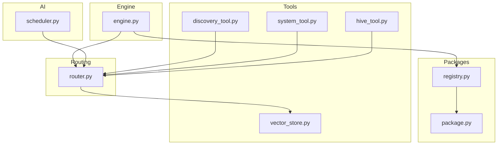
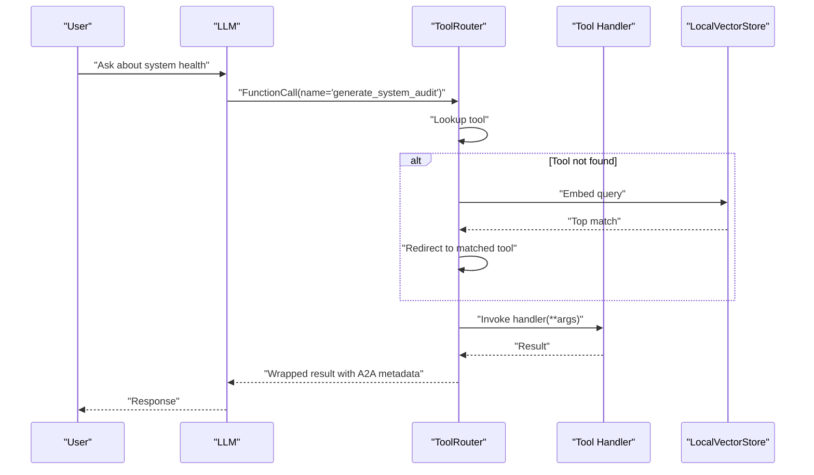
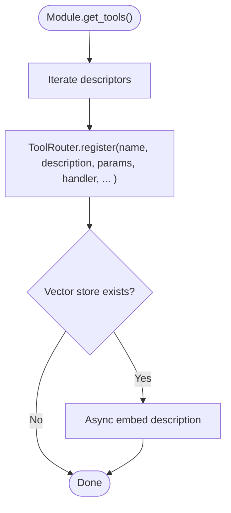
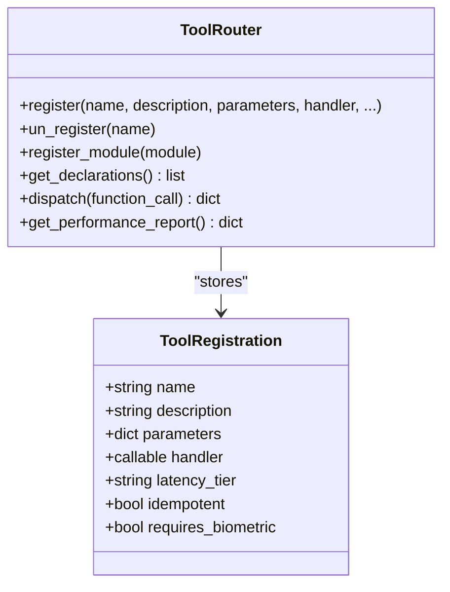
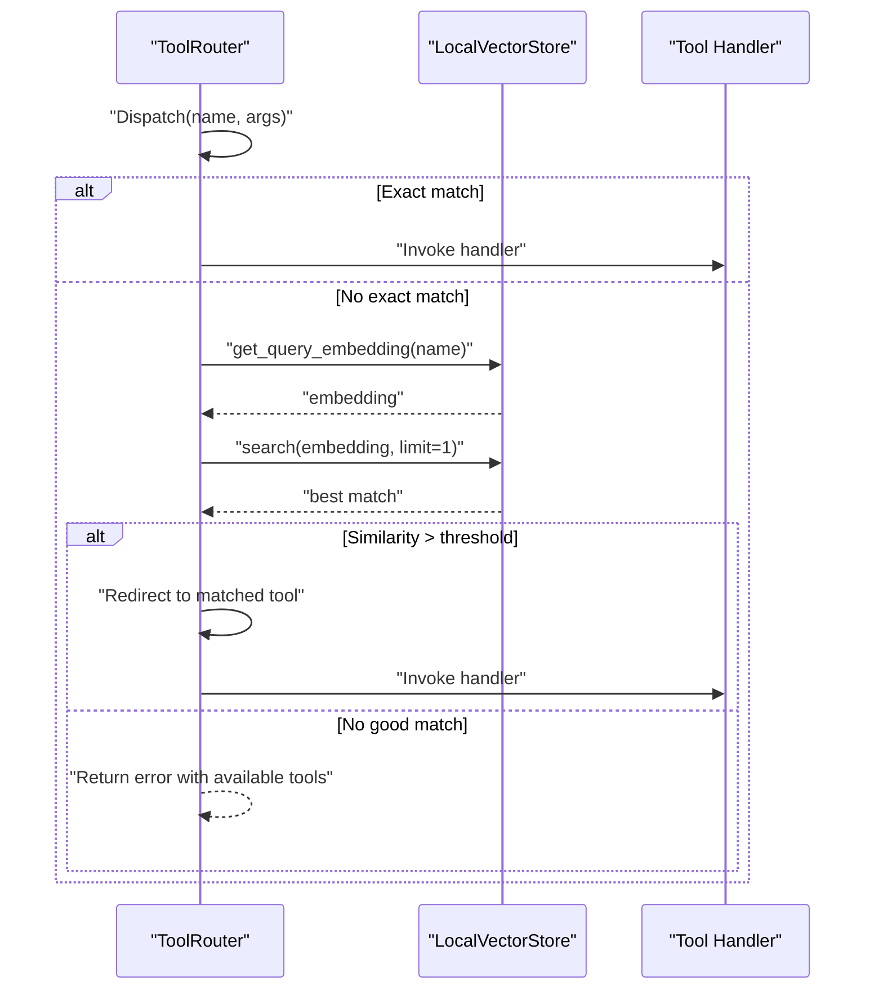
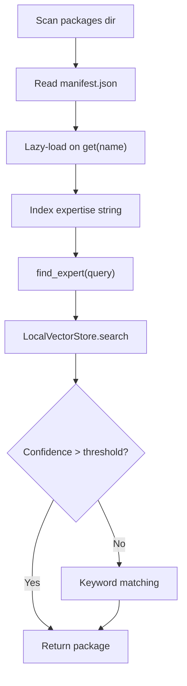
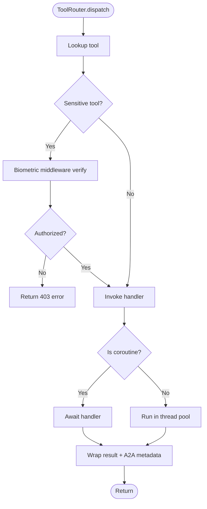
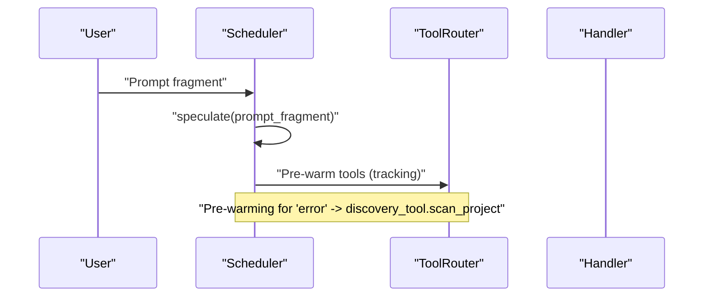
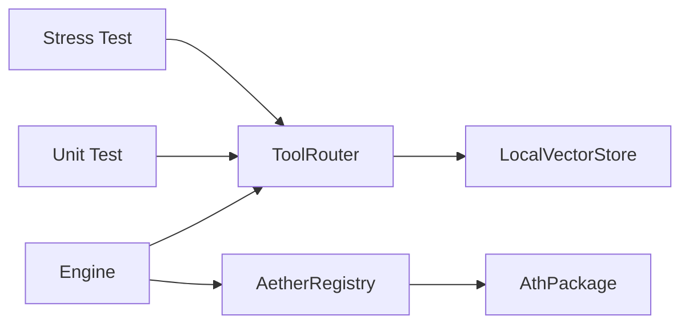

# Discovery Tools

<cite>
**Referenced Files in This Document**
- [discovery_tool.py](file://core/tools/discovery_tool.py)
- [router.py](file://core/tools/router.py)
- [system_tool.py](file://core/tools/system_tool.py)
- [vector_store.py](file://core/tools/vector_store.py)
- [registry.py](file://core/services/registry.py)
- [package.py](file://core/identity/package.py)
- [engine.py](file://core/engine.py)
- [scheduler.py](file://core/ai/scheduler.py)
- [test_core.py](file://tests/unit/test_core.py)
- [test_adk_stress.py](file://tests/integration/test_adk_stress.py)
</cite>

## Table of Contents
1. [Introduction](#introduction)
2. [Project Structure](#project-structure)
3. [Core Components](#core-components)
4. [Architecture Overview](#architecture-overview)
5. [Detailed Component Analysis](#detailed-component-analysis)
6. [Dependency Analysis](#dependency-analysis)
7. [Performance Considerations](#performance-considerations)
8. [Troubleshooting Guide](#troubleshooting-guide)
9. [Conclusion](#conclusion)
10. [Appendices](#appendices)

## Introduction
This document explains the discovery tools system in Aether Voice OS. It covers automatic tool identification and registration, plugin discovery and module loading, dynamic registration, the tool catalog and metadata extraction, integration with external tool providers and marketplace-style package discovery, validation and security scanning, and compatibility verification. It also provides usage examples, development patterns, security considerations, and operational guidance for maintaining and optimizing the discovery system.

## Project Structure
The discovery tools system spans several modules:
- Tool definition and registration via module-level get_tools() functions
- A central ToolRouter that declares tools for the LLM and dispatches calls
- A LocalVectorStore enabling semantic search and recovery
- A Package Registry for discovering and loading .ath packages with manifests
- Identity and validation of packages via SoulManifest and AthPackage
- Engine integration that registers tools and injects runtime dependencies
- Scheduler-based speculative execution that triggers discovery-related tools

**Diagram sources**
- [discovery_tool.py](file://core/tools/discovery_tool.py#L68-L84)
- [system_tool.py](file://core/tools/system_tool.py#L198-L200)
- [hive_tool.py](file://core/tools/hive_tool.py#L51-L78)
- [router.py](file://core/tools/router.py#L120-L232)
- [vector_store.py](file://core/tools/vector_store.py#L21-L112)
- [registry.py](file://core/services/registry.py#L44-L251)
- [package.py](file://core/identity/package.py#L23-L166)
- [engine.py](file://core/engine.py#L124-L140)
- [scheduler.py](file://core/ai/scheduler.py#L52-L75)

**Section sources**
- [discovery_tool.py](file://core/tools/discovery_tool.py#L1-L84)
- [router.py](file://core/tools/router.py#L1-L360)
- [system_tool.py](file://core/tools/system_tool.py#L1-L200)
- [vector_store.py](file://core/tools/vector_store.py#L1-L112)
- [registry.py](file://core/services/registry.py#L1-L251)
- [package.py](file://core/identity/package.py#L1-L166)
- [engine.py](file://core/engine.py#L124-L140)
- [scheduler.py](file://core/ai/scheduler.py#L52-L75)

## Core Components
- Discovery Tool: Provides a self-audit capability and a module-level tool declaration for discovery_tool.get_tools().
- Tool Router: Central dispatcher that registers tools, generates LLM declarations, dispatches calls, enforces biometric middleware for sensitive tools, profiles performance, and supports semantic recovery.
- System Tool: Pure functions for time, system info, timers, safe terminal commands, codebase listing, and file reading with built-in safety guards.
- Vector Store: Lightweight local semantic index for tool and package discovery and recovery.
- Package Registry: Discovers .ath packages, validates manifests, supports hot-reload, and provides semantic expert discovery.
- Identity Package: Defines SoulManifest and AthPackage with Pydantic validation and integrity checks.
- Engine Integration: Registers tools and injects runtime dependencies (e.g., Firebase connectors).
- Scheduler: Speculative execution that pre-warms discovery-related tools based on prompt fragments.

**Section sources**
- [discovery_tool.py](file://core/tools/discovery_tool.py#L27-L84)
- [router.py](file://core/tools/router.py#L120-L360)
- [system_tool.py](file://core/tools/system_tool.py#L22-L135)
- [vector_store.py](file://core/tools/vector_store.py#L21-L112)
- [registry.py](file://core/services/registry.py#L44-L251)
- [package.py](file://core/identity/package.py#L23-L166)
- [engine.py](file://core/engine.py#L124-L140)
- [scheduler.py](file://core/ai/scheduler.py#L52-L75)

## Architecture Overview
The discovery pipeline integrates tool definition, registration, dispatch, and semantic recovery:
- Modules expose get_tools() returning tool descriptors with handler functions.
- ToolRouter.register_module() auto-registers tools and asynchronously indexes descriptions for semantic search.
- ToolRouter.dispatch() routes calls, applies biometric middleware for sensitive tools, and wraps results with A2A metadata.
- LocalVectorStore provides embeddings for semantic recovery and expert discovery.
- AetherRegistry scans packages, validates manifests, and supports hot-reload; packages contribute expertise strings for discovery.
- Engine initializes registries and injects dependencies into tools.

**Diagram sources**
- [router.py](file://core/tools/router.py#L234-L359)
- [vector_store.py](file://core/tools/vector_store.py#L66-L112)
- [discovery_tool.py](file://core/tools/discovery_tool.py#L27-L65)

## Detailed Component Analysis

### Tool Discovery and Registration
- Automatic discovery: Each tool module implements a module-level get_tools() that returns a list of tool descriptors. ToolRouter.register_module() iterates descriptors and calls ToolRouter.register().
- Dynamic registration: ToolRouter.register() stores ToolRegistration entries, optionally indexing descriptions into LocalVectorStore for semantic search.
- LLM declarations: ToolRouter.get_declarations() produces FunctionDeclaration objects for Gemini Live.

**Diagram sources**
- [router.py](file://core/tools/router.py#L183-L200)
- [router.py](file://core/tools/router.py#L146-L176)

**Section sources**
- [router.py](file://core/tools/router.py#L183-L232)
- [system_tool.py](file://core/tools/system_tool.py#L198-L200)
- [discovery_tool.py](file://core/tools/discovery_tool.py#L68-L84)

### Tool Catalog and Metadata Extraction
- Tool metadata: ToolRegistration captures name, description, parameters, handler, latency tier, idempotency, and biometric requirement.
- ToolRouter.get_declarations(): Converts registrations to FunctionDeclaration objects for LLM consumption.
- Performance metadata: ToolRouter records execution durations and computes percentile latency statistics.

**Diagram sources**
- [router.py](file://core/tools/router.py#L33-L44)
- [router.py](file://core/tools/router.py#L146-L176)
- [router.py](file://core/tools/router.py#L211-L232)
- [router.py](file://core/tools/router.py#L357-L360)

**Section sources**
- [router.py](file://core/tools/router.py#L33-L44)
- [router.py](file://core/tools/router.py#L146-L232)
- [router.py](file://core/tools/router.py#L357-L360)

### Semantic Recovery and Tool Validation
- Semantic recovery: When a tool name does not match, ToolRouter attempts to embed the query and search LocalVectorStore for the nearest neighbor above a similarity threshold, redirecting execution accordingly.
- Validation: LocalVectorStore embeds texts and performs cosine similarity search; ToolRouter wraps results with standardized A2A metadata and status codes.

**Diagram sources**
- [router.py](file://core/tools/router.py#L234-L282)
- [router.py](file://core/tools/router.py#L250-L276)
- [vector_store.py](file://core/tools/vector_store.py#L106-L112)

**Section sources**
- [router.py](file://core/tools/router.py#L234-L282)
- [vector_store.py](file://core/tools/vector_store.py#L66-L112)

### Integration with External Tool Providers and Marketplace
- Package discovery: AetherRegistry scans a packages directory for .ath packages, reads manifests, and lazily loads packages on demand.
- Semantic expert discovery: AetherRegistry.initialize_vector_store() indexes package expertise strings; find_expert() uses semantic search with a confidence threshold and falls back to keyword matching.
- Hot-reload: Watchdog monitors filesystem changes and triggers package reloads, notifying callbacks to refresh tool registries.

**Diagram sources**
- [registry.py](file://core/services/registry.py#L64-L91)
- [registry.py](file://core/services/registry.py#L158-L170)
- [registry.py](file://core/services/registry.py#L171-L198)
- [registry.py](file://core/services/registry.py#L202-L246)
- [package.py](file://core/identity/package.py#L154-L162)

**Section sources**
- [registry.py](file://core/services/registry.py#L44-L251)
- [package.py](file://core/identity/package.py#L72-L166)

### Tool Validation, Security Scanning, and Compatibility
- Security scanning: SystemTool implements a command blacklist and strict timeouts for terminal commands, preventing dangerous operations.
- Compatibility verification: ToolRouter dispatch() supports both sync and async handlers, normalizes results, and handles argument mismatches and exceptions with appropriate status codes.
- Integrity checks: AthPackage.load() validates manifests and optionally verifies SHA256 checksums to ensure package integrity.
- Biometric middleware: ToolRouter enforces biometric verification for sensitive tools, simulating context checks and returning explicit security errors otherwise.

**Diagram sources**
- [router.py](file://core/tools/router.py#L287-L342)
- [router.py](file://core/tools/router.py#L344-L355)

**Section sources**
- [system_tool.py](file://core/tools/system_tool.py#L22-L33)
- [system_tool.py](file://core/tools/system_tool.py#L87-L131)
- [router.py](file://core/tools/router.py#L287-L342)
- [router.py](file://core/tools/router.py#L344-L355)
- [package.py](file://core/identity/package.py#L102-L138)

### Examples of Discovery Tool Usage and Plugin Development
- Using discovery_tool: Call generate_system_audit via ToolRouter.dispatch(); the module exposes get_tools() for registration.
- Developing a new tool: Implement handler functions and a module-level get_tools() returning descriptors with name, description, parameters, and handler; register via ToolRouter.register_module(module).
- Speculative execution: The scheduler pre-warms discovery-related tools when prompt fragments contain keywords like "error".

**Diagram sources**
- [scheduler.py](file://core/ai/scheduler.py#L52-L75)
- [router.py](file://core/tools/router.py#L183-L200)

**Section sources**
- [discovery_tool.py](file://core/tools/discovery_tool.py#L27-L84)
- [system_tool.py](file://core/tools/system_tool.py#L198-L200)
- [scheduler.py](file://core/ai/scheduler.py#L52-L75)

## Dependency Analysis
- ToolRouter depends on LocalVectorStore for semantic indexing and recovery.
- AetherRegistry depends on AthPackage for manifest validation and integrity checks.
- Engine integrates ToolRouter and AetherRegistry, injecting runtime dependencies into tools.
- Tests validate tool declarations and crash isolation behavior.

**Diagram sources**
- [router.py](file://core/tools/router.py#L141-L144)
- [registry.py](file://core/services/registry.py#L171-L178)
- [engine.py](file://core/engine.py#L124-L140)
- [test_core.py](file://tests/unit/test_core.py#L487-L502)
- [test_adk_stress.py](file://tests/integration/test_adk_stress.py#L55-L79)

**Section sources**
- [router.py](file://core/tools/router.py#L141-L144)
- [registry.py](file://core/services/registry.py#L171-L178)
- [engine.py](file://core/engine.py#L124-L140)
- [test_core.py](file://tests/unit/test_core.py#L487-L502)
- [test_adk_stress.py](file://tests/integration/test_adk_stress.py#L55-L79)

## Performance Considerations
- Profiling: ToolRouter records execution durations and computes p50/p95/p99 latency percentiles; use get_performance_report() to monitor tool performance.
- Async handling: ToolRouter dispatch() supports async handlers and runs sync handlers in a thread pool to avoid blocking the event loop.
- Semantic indexing: Asynchronous embedding minimizes latency impact; ensure LocalVectorStore is initialized early.
- Resource limits: SystemTool enforces timeouts and blacklists to prevent resource exhaustion.

**Section sources**
- [router.py](file://core/tools/router.py#L87-L118)
- [router.py](file://core/tools/router.py#L310-L324)
- [system_tool.py](file://core/tools/system_tool.py#L113-L125)

## Troubleshooting Guide
Common issues and resolutions:
- Unknown tool or semantic mismatch: ToolRouter returns an error with available tools; enable semantic recovery by initializing LocalVectorStore and ensuring embeddings are present.
- Argument errors: ToolRouter returns a 400 error with details; verify parameter schemas and handler signatures.
- Exceptions in handlers: ToolRouter returns a 500 error; wrap handlers defensively and log exceptions.
- Security failures: Biometric middleware returns a 403 error; ensure biometric context is properly set or adjust middleware configuration.
- Package discovery failures: Verify manifest.json validity and checksum; confirm filesystem watcher is active for hot-reload.

**Section sources**
- [router.py](file://core/tools/router.py#L277-L282)
- [router.py](file://core/tools/router.py#L344-L355)
- [router.py](file://core/tools/router.py#L294-L301)
- [registry.py](file://core/services/registry.py#L107-L157)
- [package.py](file://core/identity/package.py#L102-L138)

## Conclusion
The discovery tools system in Aether Voice OS combines automatic module-based registration, a robust central dispatcher with biometric middleware and performance profiling, and semantic recovery powered by a local vector store. External tool providers integrate via .ath packages with validated manifests and integrity checks, while the engine coordinates registration and dependency injection. Security is enforced through command guardrails, biometric verification, and strict error handling. The system is designed for maintainability, scalability, and operability with built-in diagnostics and hot-reload support.

## Appendices

### A. Security Considerations for Third-Party Tool Integration
- Enforce biometric verification for sensitive tools.
- Validate and checksum packages before loading.
- Restrict command execution with blacklists and timeouts.
- Use async handlers and thread pools to isolate blocking operations.
- Monitor tool performance and handle exceptions gracefully.

**Section sources**
- [router.py](file://core/tools/router.py#L127-L133)
- [router.py](file://core/tools/router.py#L287-L301)
- [package.py](file://core/identity/package.py#L123-L138)
- [system_tool.py](file://core/tools/system_tool.py#L22-L33)
- [system_tool.py](file://core/tools/system_tool.py#L113-L125)

### B. Maintenance and Optimization Guidelines
- Keep tool schemas minimal and explicit; update ToolRouter.get_declarations() when adding new tools.
- Initialize LocalVectorStore early and persist indices to disk for faster startup.
- Monitor performance reports and adjust latency tiers and idempotency flags.
- Use AetherRegistry’s hot-reload to iterate on .ath packages without restarts.
- Run periodic integrity checks on packages and update checksums as needed.

**Section sources**
- [router.py](file://core/tools/router.py#L211-L232)
- [router.py](file://core/tools/router.py#L141-L144)
- [vector_store.py](file://core/tools/vector_store.py#L30-L64)
- [registry.py](file://core/services/registry.py#L107-L157)