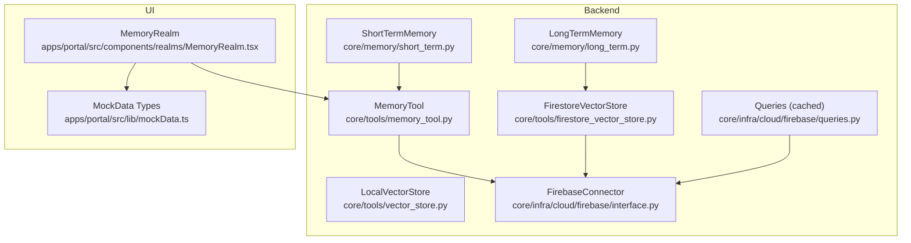
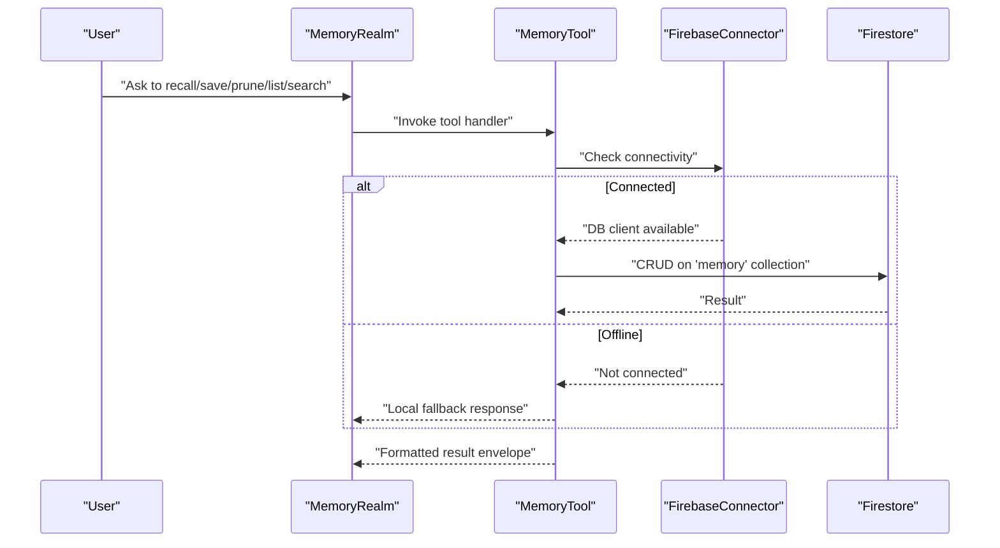
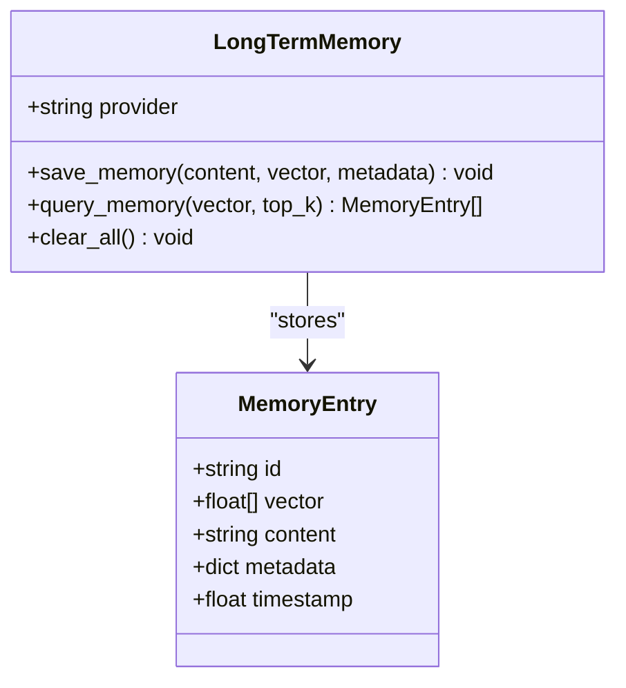
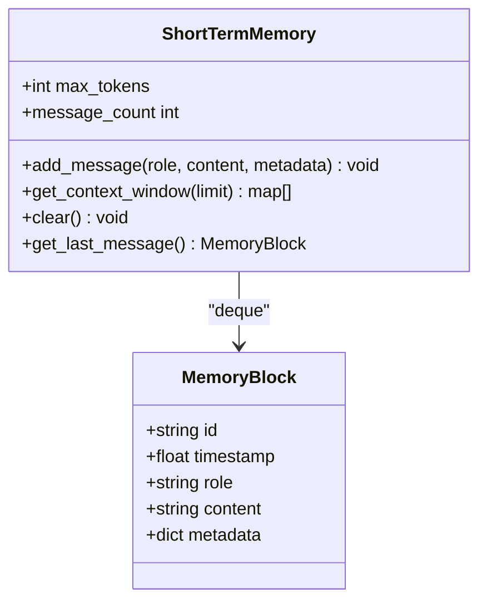
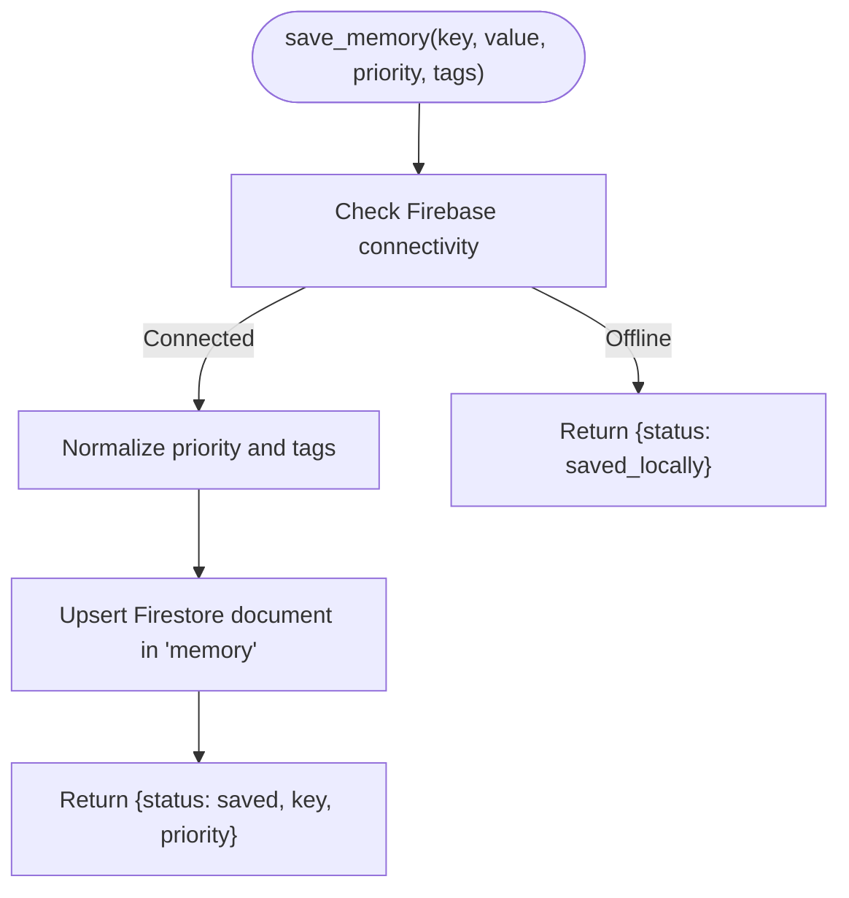
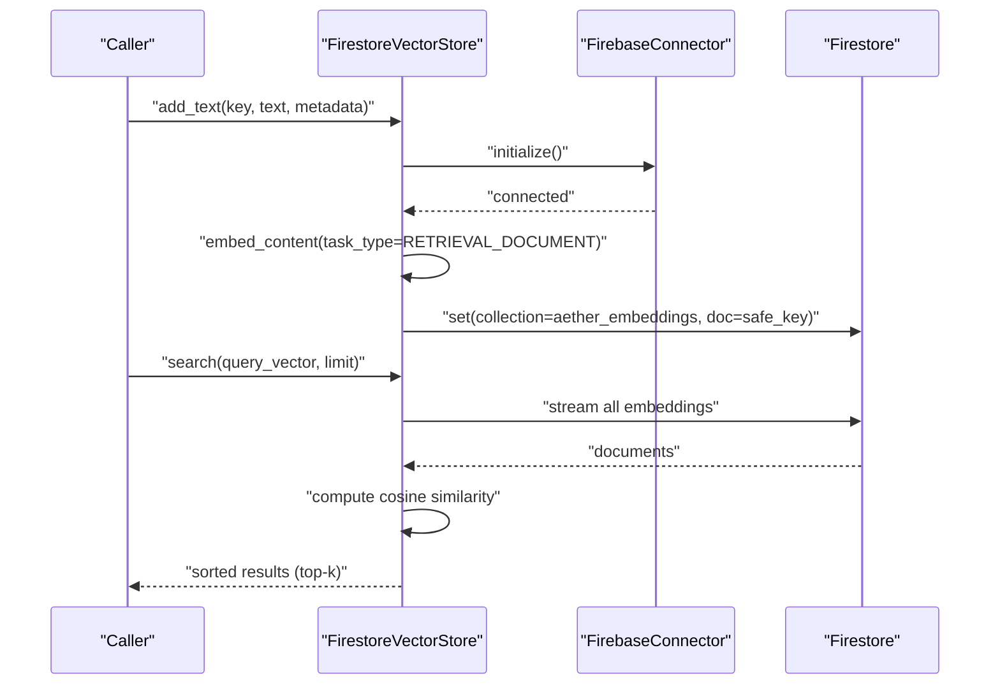
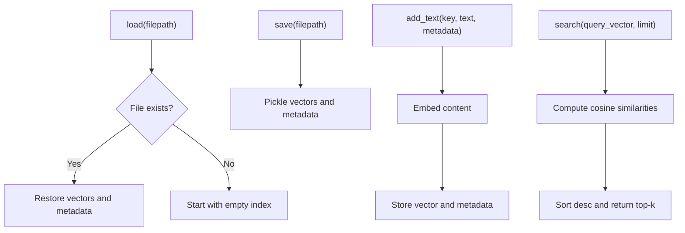
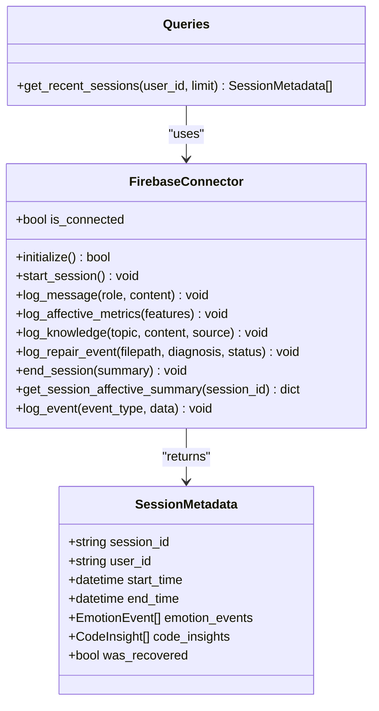
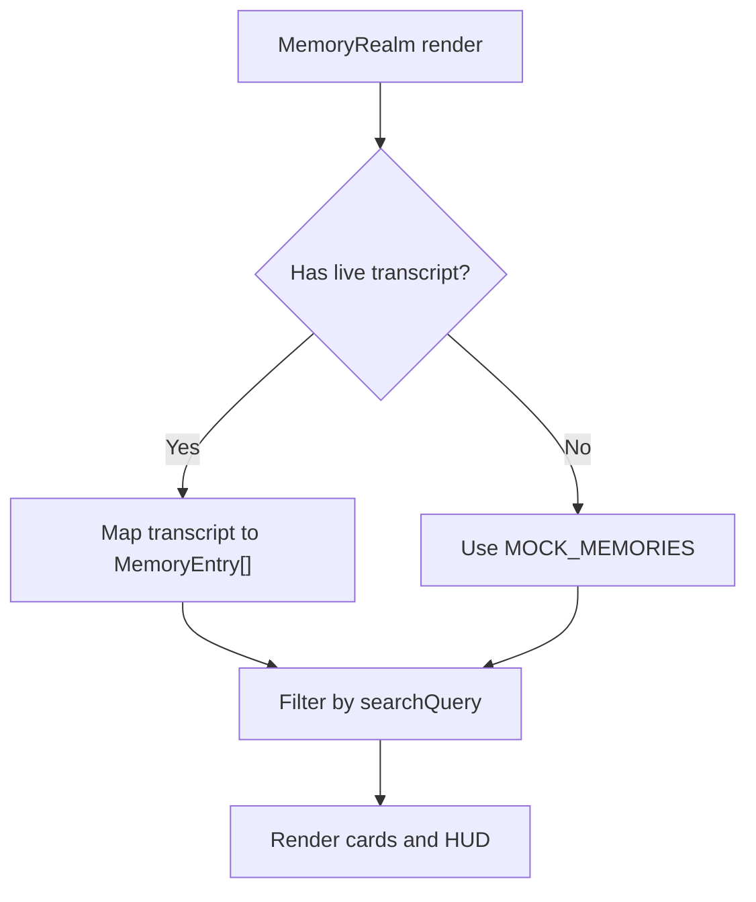
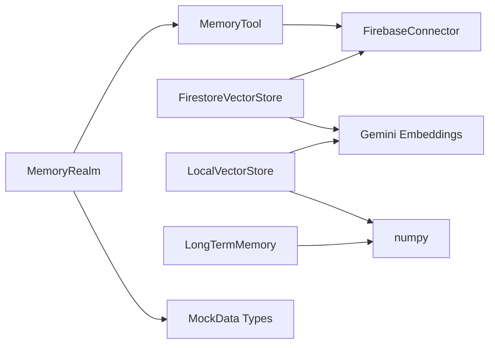

# Memory Tools

<cite>
**Referenced Files in This Document**
- [README.md](file://README.md)
- [.idx/memories.md](file://.idx/memories.md)
- [.idx/aether_v2_architecture.md](file://.idx/aether_v2_architecture.md)
- [core/memory/long_term.py](file://core/memory/long_term.py)
- [core/memory/short_term.py](file://core/memory/short_term.py)
- [core/tools/memory_tool.py](file://core/tools/memory_tool.py)
- [core/tools/firestore_vector_store.py](file://core/tools/firestore_vector_store.py)
- [core/tools/vector_store.py](file://core/tools/vector_store.py)
- [core/tools/hive_memory.py](file://core/tools/hive_memory.py)
- [core/infra/cloud/firebase/interface.py](file://core/infra/cloud/firebase/interface.py)
- [core/infra/cloud/firebase/queries.py](file://core/infra/cloud/firebase/queries.py)
- [core/infra/cloud/firebase/schemas.py](file://core/infra/cloud/firebase/schemas.py)
- [core/utils/security.py](file://core/utils/security.py)
- [apps/portal/src/components/realms/MemoryRealm.tsx](file://apps/portal/src/components/realms/MemoryRealm.tsx)
- [apps/portal/src/lib/mockData.ts](file://apps/portal/src/lib/mockData.ts)
- [tests/unit/test_memory_deep.py](file://tests/unit/test_memory_deep.py)
</cite>

## Table of Contents
1. [Introduction](#introduction)
2. [Project Structure](#project-structure)
3. [Core Components](#core-components)
4. [Architecture Overview](#architecture-overview)
5. [Detailed Component Analysis](#detailed-component-analysis)
6. [Dependency Analysis](#dependency-analysis)
7. [Performance Considerations](#performance-considerations)
8. [Troubleshooting Guide](#troubleshooting-guide)
9. [Conclusion](#conclusion)
10. [Appendices](#appendices)

## Introduction
This document explains the memory tools in Aether Voice OS, covering:
- Long-term vector memory and short-term working memory
- Memory indexing with semantic search and vector embeddings
- Persistence layer with Firebase integration and local caching strategies
- Memory query interface with natural language processing and context-aware search
- Examples of operations, parameter schemas, and result formatting
- Security considerations, access control, and data privacy
- Guidelines for memory tool development, performance optimization, and troubleshooting

## Project Structure
The memory system spans backend Python modules, cloud persistence, and a React-based UI realm for memory visualization and interaction.

**Diagram sources**
- [core/memory/long_term.py](file://core/memory/long_term.py#L24-L74)
- [core/memory/short_term.py](file://core/memory/short_term.py#L28-L72)
- [core/tools/memory_tool.py](file://core/tools/memory_tool.py#L40-L330)
- [core/tools/firestore_vector_store.py](file://core/tools/firestore_vector_store.py#L22-L129)
- [core/tools/vector_store.py](file://core/tools/vector_store.py#L21-L112)
- [core/infra/cloud/firebase/interface.py](file://core/infra/cloud/firebase/interface.py#L15-L259)
- [core/infra/cloud/firebase/queries.py](file://core/infra/cloud/firebase/queries.py#L20-L74)
- [apps/portal/src/components/realms/MemoryRealm.tsx](file://apps/portal/src/components/realms/MemoryRealm.tsx#L72-L99)
- [apps/portal/src/lib/mockData.ts](file://apps/portal/src/lib/mockData.ts#L60-L76)

**Section sources**
- [README.md](file://README.md#L132-L158)
- [.idx/aether_v2_architecture.md](file://.idx/aether_v2_architecture.md#L1-L68)

## Core Components
- Long-term vector memory: Persistent semantic memory with cosine similarity search and optional local provider.
- Short-term working memory: Sliding-window context maintained for LLM prompts.
- Memory tool: Persistent key-value memory with priority and tags, backed by Firestore.
- Vector stores: Local and cloud (Firestore) vector stores for semantic search and embeddings.
- Firebase persistence: Centralized connector and cached queries for session and telemetry.
- UI memory realm: Visual memory listing and filtering for the portal.

**Section sources**
- [core/memory/long_term.py](file://core/memory/long_term.py#L24-L74)
- [core/memory/short_term.py](file://core/memory/short_term.py#L28-L72)
- [core/tools/memory_tool.py](file://core/tools/memory_tool.py#L40-L330)
- [core/tools/firestore_vector_store.py](file://core/tools/firestore_vector_store.py#L22-L129)
- [core/tools/vector_store.py](file://core/tools/vector_store.py#L21-L112)
- [core/infra/cloud/firebase/interface.py](file://core/infra/cloud/firebase/interface.py#L15-L259)
- [apps/portal/src/components/realms/MemoryRealm.tsx](file://apps/portal/src/components/realms/MemoryRealm.tsx#L72-L99)

## Architecture Overview
The memory architecture integrates short-term context, persistent memory, and vector search across local and cloud environments, with Firebase as the persistence backbone and optional local caching.

**Diagram sources**
- [core/tools/memory_tool.py](file://core/tools/memory_tool.py#L33-L92)
- [core/infra/cloud/firebase/interface.py](file://core/infra/cloud/firebase/interface.py#L31-L60)

## Detailed Component Analysis

### Long-Term Vector Memory
- Purpose: Persistent semantic memory with cosine similarity search.
- Data model: MemoryEntry with id, vector, content, metadata, timestamp.
- Operations:
  - Save memory: creates a MemoryEntry and appends to an internal list (local provider).
  - Query memory: computes cosine similarity against stored vectors and returns top-k matches.
  - Clear all: wipes the local store.

**Diagram sources**
- [core/memory/long_term.py](file://core/memory/long_term.py#L12-L74)

**Section sources**
- [core/memory/long_term.py](file://core/memory/long_term.py#L24-L74)

### Short-Term Working Memory
- Purpose: Rolling window of recent interactions to maintain context relevance.
- Data model: MemoryBlock with id, timestamp, role, content, metadata.
- Operations:
  - Add message: appends a MemoryBlock to a deque with a max length.
  - Get context window: returns last N messages in role/content pairs.
  - Clear: empties the deque.
  - Get last message and message count: convenience accessors.

**Diagram sources**
- [core/memory/short_term.py](file://core/memory/short_term.py#L13-L72)

**Section sources**
- [core/memory/short_term.py](file://core/memory/short_term.py#L28-L72)

### Memory Tool (Persistent Key-Value Memory)
- Purpose: Provide persistent memory across sessions with priority and tags.
- Collections: memory (key-value store).
- Handlers:
  - save_memory: persists with priority and tags; falls back to local if offline.
  - recall_memory: retrieves by key.
  - list_memories: lists with optional priority filter.
  - semantic_search: tag-based lookup using array_contains_any.
  - prune_memories: deletes all memories of a given priority.
- Tool registration: get_tools returns tool descriptors with JSON Schema parameters.

**Diagram sources**
- [core/tools/memory_tool.py](file://core/tools/memory_tool.py#L40-L92)

**Section sources**
- [core/tools/memory_tool.py](file://core/tools/memory_tool.py#L40-L330)

### Firestore Vector Store (Cloud)
- Purpose: Embed and store text with embeddings in Firestore; perform semantic search via cosine similarity scan.
- Embedding: Uses Gemini embeddings with task_type RETRIEVAL_DOCUMENT for indexing and RETRIEVAL_QUERY for queries.
- Local cache: In-memory caches for vectors and metadata to reduce repeated work.
- Search: Fetches all documents and computes cosine similarity (prototype approach).

**Diagram sources**
- [core/tools/firestore_vector_store.py](file://core/tools/firestore_vector_store.py#L37-L129)
- [core/infra/cloud/firebase/interface.py](file://core/infra/cloud/firebase/interface.py#L31-L60)

**Section sources**
- [core/tools/firestore_vector_store.py](file://core/tools/firestore_vector_store.py#L22-L129)

### Local Vector Store
- Purpose: Lightweight, local-first semantic search using numpy and Gemini embeddings.
- Persistence: Pickle-based loading/saving of vectors and metadata.
- Search: Computes cosine similarity across indexed keys.

**Diagram sources**
- [core/tools/vector_store.py](file://core/tools/vector_store.py#L30-L112)

**Section sources**
- [core/tools/vector_store.py](file://core/tools/vector_store.py#L21-L112)

### Firebase Persistence and Caching
- FirebaseConnector: Initializes app and client, manages sessions, logs telemetry, and knowledge.
- Queries: Cached recent sessions with TTL to reduce Firestore reads.
- Schemas: Typed models for telemetry and metadata.

**Diagram sources**
- [core/infra/cloud/firebase/interface.py](file://core/infra/cloud/firebase/interface.py#L15-L259)
- [core/infra/cloud/firebase/queries.py](file://core/infra/cloud/firebase/queries.py#L20-L74)
- [core/infra/cloud/firebase/schemas.py](file://core/infra/cloud/firebase/schemas.py#L30-L38)

**Section sources**
- [core/infra/cloud/firebase/interface.py](file://core/infra/cloud/firebase/interface.py#L15-L259)
- [core/infra/cloud/firebase/queries.py](file://core/infra/cloud/firebase/queries.py#L20-L74)
- [core/infra/cloud/firebase/schemas.py](file://core/infra/cloud/firebase/schemas.py#L30-L38)

### UI Memory Realm
- Purpose: Visual memory listing and filtering in the portal.
- Behavior: Uses live transcript or mock data; filters by title/summary; indicates live vs mock mode.

**Diagram sources**
- [apps/portal/src/components/realms/MemoryRealm.tsx](file://apps/portal/src/components/realms/MemoryRealm.tsx#L72-L99)
- [apps/portal/src/lib/mockData.ts](file://apps/portal/src/lib/mockData.ts#L60-L76)

**Section sources**
- [apps/portal/src/components/realms/MemoryRealm.tsx](file://apps/portal/src/components/realms/MemoryRealm.tsx#L72-L99)
- [apps/portal/src/lib/mockData.ts](file://apps/portal/src/lib/mockData.ts#L60-L76)

## Dependency Analysis
- MemoryTool depends on FirebaseConnector for persistence and on Gemini for embeddings in vector store usage.
- LongTermMemory and LocalVectorStore depend on numpy and Gemini for embeddings.
- FirestoreVectorStore depends on FirebaseConnector and Gemini.
- UI MemoryRealm depends on MemoryTool and mock data.

**Diagram sources**
- [core/tools/memory_tool.py](file://core/tools/memory_tool.py#L23-L37)
- [core/tools/firestore_vector_store.py](file://core/tools/firestore_vector_store.py#L22-L35)
- [core/tools/vector_store.py](file://core/tools/vector_store.py#L21-L28)
- [core/memory/long_term.py](file://core/memory/long_term.py#L53-L68)
- [apps/portal/src/components/realms/MemoryRealm.tsx](file://apps/portal/src/components/realms/MemoryRealm.tsx#L72-L99)

**Section sources**
- [core/tools/memory_tool.py](file://core/tools/memory_tool.py#L23-L37)
- [core/tools/firestore_vector_store.py](file://core/tools/firestore_vector_store.py#L22-L35)
- [core/tools/vector_store.py](file://core/tools/vector_store.py#L21-L28)
- [core/memory/long_term.py](file://core/memory/long_term.py#L53-L68)
- [apps/portal/src/components/realms/MemoryRealm.tsx](file://apps/portal/src/components/realms/MemoryRealm.tsx#L72-L99)

## Performance Considerations
- Vector search cost: FirestoreVectorStore performs a scan-and-compute approach in the prototype; production should leverage Firebase Vector Search Extension or Vertex AI Search to avoid full scans.
- Local caching: FirestoreVectorStore maintains local caches for vectors and metadata to reduce recomputation.
- Query caching: Queries.get_recent_sessions uses an in-memory cache with TTL to reduce Firestore reads.
- Embedding reuse: LocalVectorStore persists embeddings to disk via pickle to avoid regenerating embeddings across runs.
- Memory growth: Monitor memory usage during long sessions; tests show stable memory around 7.3 MB in typical runs.

[No sources needed since this section provides general guidance]

## Troubleshooting Guide
Common issues and resolutions:
- Firebase offline: MemoryTool returns a local fallback envelope when not connected; ensure credentials and connectivity.
- Priority normalization: save_memory normalizes priority to a valid enum; invalid values default to medium.
- Tag-based search limit: semantic_search uses array_contains_any with up to 10 tags.
- Pruning correctness: prune_memories filters by priority and deletes matched documents; tests verify the where clause and delete invocation.
- UI memory display: MemoryRealm falls back to mock data when no live transcript is available.

**Section sources**
- [core/tools/memory_tool.py](file://core/tools/memory_tool.py#L56-L92)
- [core/tools/memory_tool.py](file://core/tools/memory_tool.py#L172-L211)
- [core/tools/memory_tool.py](file://core/tools/memory_tool.py#L213-L243)
- [tests/unit/test_memory_deep.py](file://tests/unit/test_memory_deep.py#L24-L72)
- [apps/portal/src/components/realms/MemoryRealm.tsx](file://apps/portal/src/components/realms/MemoryRealm.tsx#L72-L99)

## Conclusion
Aether Voice OS memory tools combine short-term working memory for context, persistent key-value memory with priority and tags, and vector-based semantic search across local and cloud environments. Firebase provides the persistence layer with caching and typed schemas, while the UI realm offers a visual interface for memory exploration. Security is addressed through cryptographic primitives and secure credential handling.

[No sources needed since this section summarizes without analyzing specific files]

## Appendices

### Memory Operation Examples and Parameter Schemas
- save_memory
  - Parameters:
    - key: string (required)
    - value: string (required)
    - priority: enum ["low","medium","high"] (default "medium")
    - tags: array[string] (optional)
  - Result envelope:
    - status: "saved" | "saved_locally" | "error"
    - key: string
    - priority: string
    - message: string
- recall_memory
  - Parameters:
    - key: string (required)
  - Result envelope:
    - status: "found" | "not_found" | "error"
    - key: string
    - value: string
    - priority: string
    - tags: array[string]
    - saved_at: string
- list_memories
  - Parameters:
    - limit: integer (default 10)
    - priority: enum ["low","medium","high"] (optional)
  - Result envelope:
    - status: "ok" | "error"
    - count: integer
    - memories: array of {key, value, priority, tags}
- semantic_search
  - Parameters:
    - tags: array[string] (required)
    - limit: integer (optional)
  - Result envelope:
    - status: "ok" | "error"
    - matches: integer
    - memories: array of {key, value, priority}
- prune_memories
  - Parameters:
    - priority: enum ["low","medium","high"] (default "low")
  - Result envelope:
    - status: "pruned" | "error"
    - count: integer
    - message: string

**Section sources**
- [core/tools/memory_tool.py](file://core/tools/memory_tool.py#L246-L330)

### Security and Access Control
- Cryptographic primitives: Ed25519 signature verification and keypair generation utilities are available for secure handshakes and identity.
- Credential handling: FirebaseConnector initializes with secure Base64 credentials or default credentials; offline degradation is supported.
- Data privacy: Consider encrypting sensitive memory values at rest and enforcing access control policies on Firestore rules.

**Section sources**
- [core/utils/security.py](file://core/utils/security.py#L18-L71)
- [core/infra/cloud/firebase/interface.py](file://core/infra/cloud/firebase/interface.py#L31-L60)

### Development Guidelines
- Prefer local vector store for development and testing; migrate to FirestoreVectorStore for production.
- Use semantic_search for tag-based discovery; combine with priority and tags for richer queries.
- Cache frequently accessed results and embeddings to minimize latency.
- Keep Firebase offline fallback logic in place for resilience.

[No sources needed since this section provides general guidance]