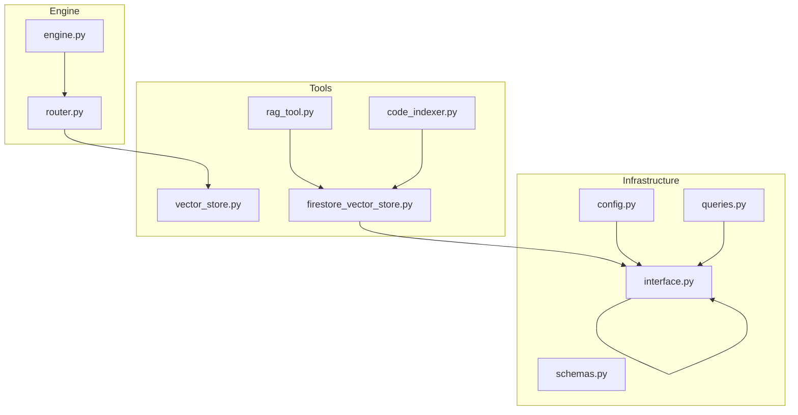
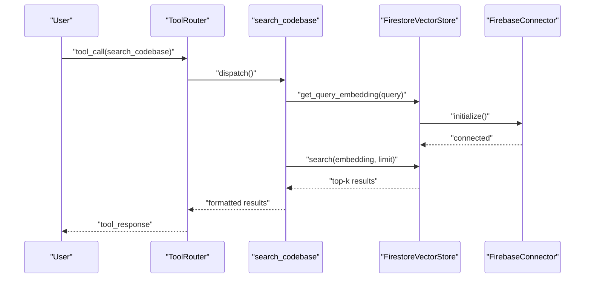
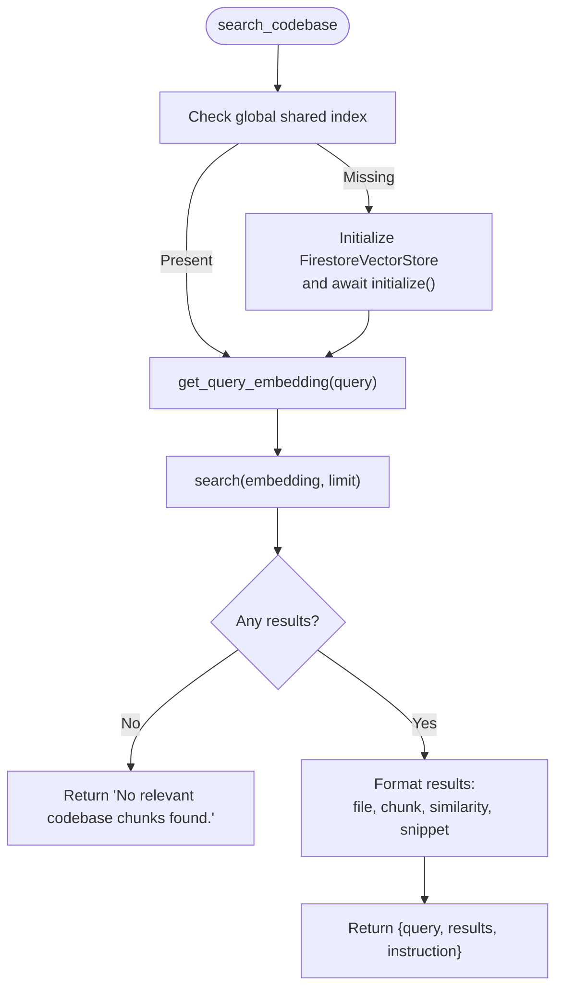
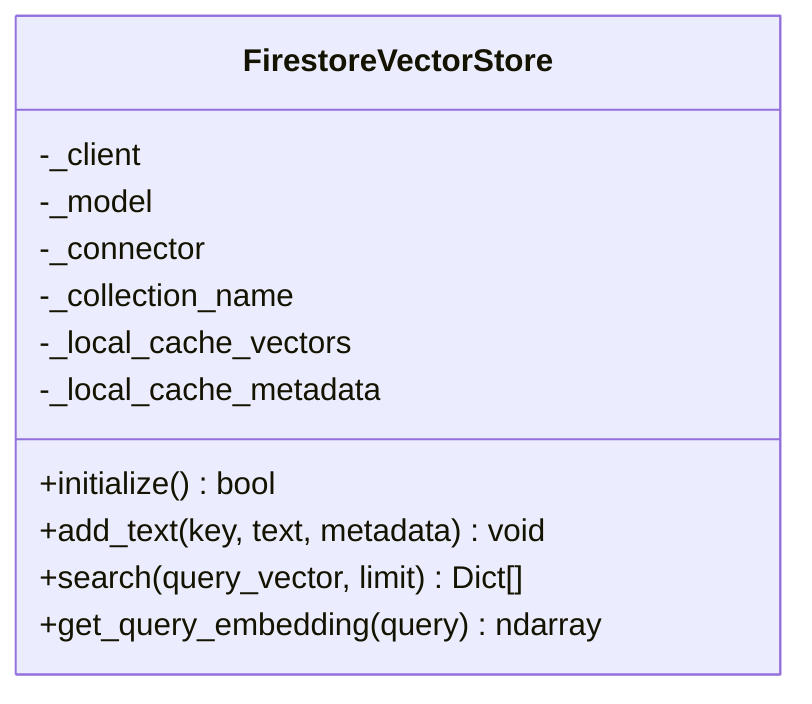
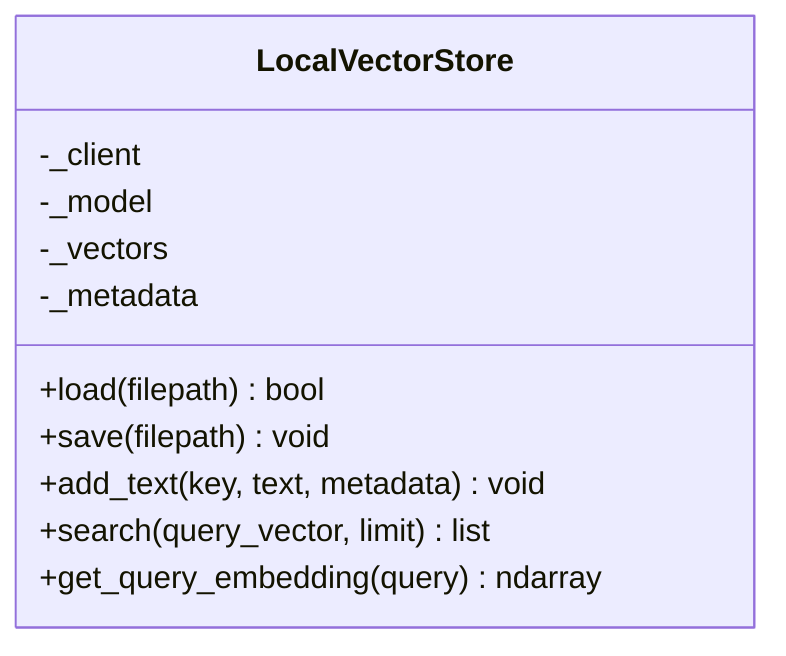
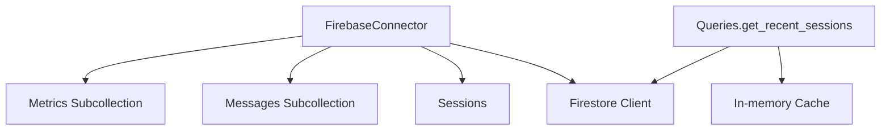
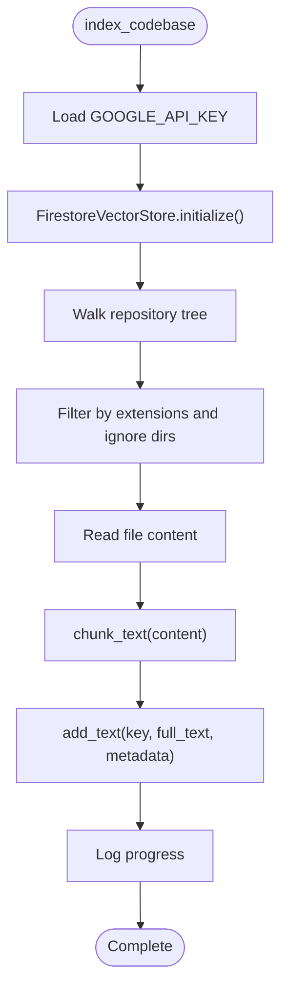
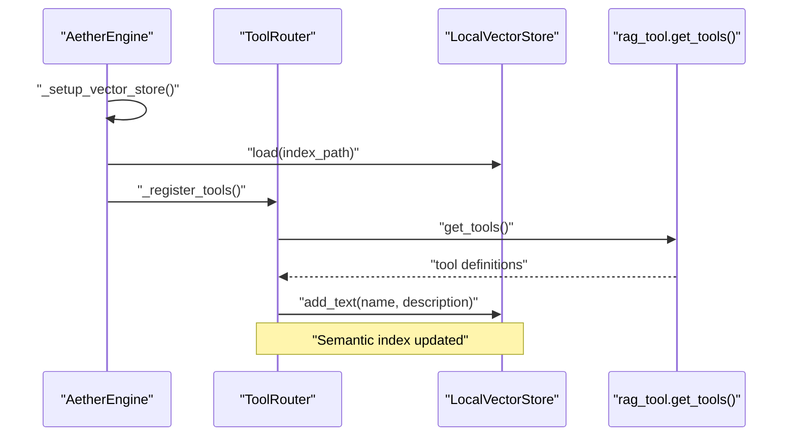
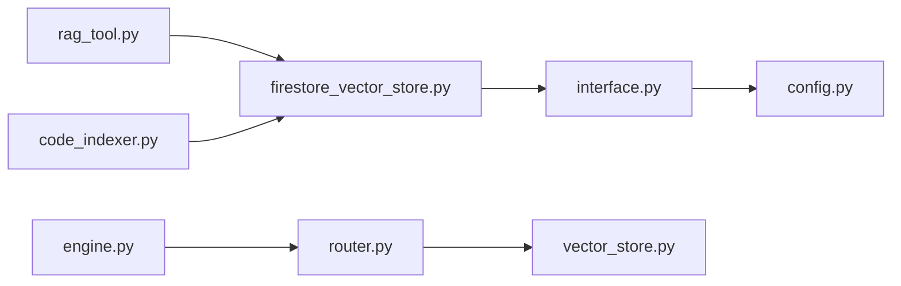

# RAG Tools

<cite>
**Referenced Files in This Document**
- [rag_tool.py](file://core/tools/rag_tool.py)
- [firestore_vector_store.py](file://core/tools/firestore_vector_store.py)
- [vector_store.py](file://core/tools/vector_store.py)
- [engine.py](file://core/engine.py)
- [router.py](file://core/tools/router.py)
- [interface.py](file://core/infra/cloud/firebase/interface.py)
- [queries.py](file://core/infra/cloud/firebase/queries.py)
- [schemas.py](file://core/infra/cloud/firebase/schemas.py)
- [code_indexer.py](file://core/tools/code_indexer.py)
- [config.py](file://core/infra/config.py)
- [README.md](file://README.md)
</cite>

## Table of Contents
1. [Introduction](#introduction)
2. [Project Structure](#project-structure)
3. [Core Components](#core-components)
4. [Architecture Overview](#architecture-overview)
5. [Detailed Component Analysis](#detailed-component-analysis)
6. [Dependency Analysis](#dependency-analysis)
7. [Performance Considerations](#performance-considerations)
8. [Troubleshooting Guide](#troubleshooting-guide)
9. [Conclusion](#conclusion)
10. [Appendices](#appendices)

## Introduction
This document describes the Retrieval-Augmented Generation (RAG) tools in Aether Voice OS. It explains how the system ingests, chunks, embeds, indexes, and retrieves relevant knowledge from the local codebase using vector embeddings. It covers semantic search with cosine similarity, relevance scoring, and retrieval synthesis. It also documents vector store integration with Google Cloud Firestore and local caching strategies, along with practical usage examples, parameter configuration, and performance optimization guidance for large-scale and real-time retrieval.

## Project Structure
The RAG pipeline spans several modules:
- Tool orchestration and registration
- Local and cloud vector stores
- Firebase connectivity and persistence
- Indexing and embedding utilities
- Engine initialization and integration

**Diagram sources**
- [rag_tool.py](file://core/tools/rag_tool.py#L1-L109)
- [firestore_vector_store.py](file://core/tools/firestore_vector_store.py#L1-L129)
- [vector_store.py](file://core/tools/vector_store.py#L1-L112)
- [code_indexer.py](file://core/tools/code_indexer.py#L1-L130)
- [engine.py](file://core/engine.py#L1-L240)
- [router.py](file://core/tools/router.py#L1-L360)
- [interface.py](file://core/infra/cloud/firebase/interface.py#L1-L259)
- [queries.py](file://core/infra/cloud/firebase/queries.py#L1-L74)
- [schemas.py](file://core/infra/cloud/firebase/schemas.py#L1-L38)
- [config.py](file://core/infra/config.py#L1-L175)

**Section sources**
- [README.md](file://README.md#L132-L180)
- [engine.py](file://core/engine.py#L81-L91)
- [router.py](file://core/tools/router.py#L120-L145)

## Core Components
- RAG Tool: Provides a semantic search over the codebase and formats results for downstream use.
- Firestore Vector Store: Embeds and persists vectors to Firestore, performs cosine similarity search, and generates query embeddings.
- Local Vector Store: Lightweight local semantic index for tool routing and memory retrieval.
- Firebase Connector: Initializes and manages Firestore connections and session telemetry.
- Code Indexer: Walks the repository, chunks files, and uploads embeddings to Firestore.
- Engine and Router: Initialize vector stores, register tools, and route function calls.

Key responsibilities:
- Document ingestion and chunking
- Embedding generation using Gemini
- Indexing and persistence
- Semantic search with cosine similarity
- Result formatting and retrieval synthesis

**Section sources**
- [rag_tool.py](file://core/tools/rag_tool.py#L26-L109)
- [firestore_vector_store.py](file://core/tools/firestore_vector_store.py#L22-L129)
- [vector_store.py](file://core/tools/vector_store.py#L21-L112)
- [interface.py](file://core/infra/cloud/firebase/interface.py#L15-L61)
- [code_indexer.py](file://core/tools/code_indexer.py#L39-L130)
- [engine.py](file://core/engine.py#L81-L91)
- [router.py](file://core/tools/router.py#L120-L176)

## Architecture Overview
The RAG pipeline integrates with the broader Aether Voice OS architecture:
- User speech triggers tool calls via the Neural Router.
- The RAG Tool resolves semantic queries against a Firestore-backed vector store.
- Results are returned to Gemini for answer synthesis and action execution.

**Diagram sources**
- [router.py](file://core/tools/router.py#L234-L360)
- [rag_tool.py](file://core/tools/rag_tool.py#L26-L77)
- [firestore_vector_store.py](file://core/tools/firestore_vector_store.py#L33-L129)
- [interface.py](file://core/infra/cloud/firebase/interface.py#L31-L61)

## Detailed Component Analysis

### RAG Tool
The RAG Tool exposes a single function for semantic codebase search. It lazily initializes a shared Firestore-backed vector store, computes a query embedding, performs a similarity search, and formats results with file path, chunk index, similarity score, and a snippet.

- Parameters:
  - query: Textual semantic query.
  - limit: Maximum number of results to return.
- Behavior:
  - Auto-initializes vector store if not present.
  - Generates query embedding and performs search.
  - Returns structured results with metadata and instruction guidance.

**Diagram sources**
- [rag_tool.py](file://core/tools/rag_tool.py#L26-L77)

**Section sources**
- [rag_tool.py](file://core/tools/rag_tool.py#L26-L109)

### Firestore Vector Store
The Firestore-backed vector store encapsulates embedding generation, persistence, and similarity search:
- Embedding generation uses Gemini with task types for document and query embeddings.
- Documents are stored with sanitized keys, text, embedding arrays, and metadata.
- Search performs a scan-and-compute over all vectors and sorts by cosine similarity.

**Diagram sources**
- [firestore_vector_store.py](file://core/tools/firestore_vector_store.py#L22-L129)

**Section sources**
- [firestore_vector_store.py](file://core/tools/firestore_vector_store.py#L22-L129)

### Local Vector Store
The local vector store provides a lightweight, in-memory index for tool routing and memory retrieval:
- Uses pickle for persistence and loads/saves indices.
- Computes cosine similarity against stored vectors.
- Integrates with the Neural Router for semantic recovery.

**Diagram sources**
- [vector_store.py](file://core/tools/vector_store.py#L21-L112)

**Section sources**
- [vector_store.py](file://core/tools/vector_store.py#L21-L112)
- [router.py](file://core/tools/router.py#L120-L176)

### Firebase Connector and Caching
The Firebase Connector manages Firestore initialization and session telemetry. The Queries module demonstrates a simple in-memory cache pattern to reduce read pressure.

- Initialization handles Base64 service account credentials and default application credentials.
- Logging utilities write session messages, affective metrics, and knowledge entries.
- Queries module caches recent sessions to reduce Firestore reads.

**Diagram sources**
- [interface.py](file://core/infra/cloud/firebase/interface.py#L15-L259)
- [queries.py](file://core/infra/cloud/firebase/queries.py#L20-L74)

**Section sources**
- [interface.py](file://core/infra/cloud/firebase/interface.py#L15-L259)
- [queries.py](file://core/infra/cloud/firebase/queries.py#L20-L74)
- [schemas.py](file://core/infra/cloud/firebase/schemas.py#L30-L38)

### Code Indexer
The code indexer walks the repository, chunks files, and uploads embeddings to Firestore:
- Supported extensions and ignored directories are configurable.
- Each chunk is stored with metadata indicating file and chunk index.
- Rate limiting and incremental logging are applied.

**Diagram sources**
- [code_indexer.py](file://core/tools/code_indexer.py#L56-L130)

**Section sources**
- [code_indexer.py](file://core/tools/code_indexer.py#L39-L130)

### Engine and Router Integration
The Engine initializes a local vector store for semantic routing and registers tools, including the RAG Tool. The Router maintains a semantic index of tool names and descriptions and supports semantic recovery when a tool name is misspelled or mismatched.

- Local vector store is loaded from a pickle file at startup.
- Tools are registered via modules exposing get_tools().
- Semantic recovery uses cosine similarity to redirect to the closest tool name.

**Diagram sources**
- [engine.py](file://core/engine.py#L81-L91)
- [router.py](file://core/tools/router.py#L183-L200)
- [rag_tool.py](file://core/tools/rag_tool.py#L79-L109)

**Section sources**
- [engine.py](file://core/engine.py#L81-L91)
- [router.py](file://core/tools/router.py#L120-L176)
- [rag_tool.py](file://core/tools/rag_tool.py#L79-L109)

## Dependency Analysis
- The RAG Tool depends on FirestoreVectorStore for embeddings and search.
- FirestoreVectorStore depends on FirebaseConnector for Firestore initialization and on Gemini for embeddings.
- The Engine initializes LocalVectorStore for tool routing and registers the RAG Tool.
- Router maintains a semantic index of tools and supports semantic recovery.

**Diagram sources**
- [rag_tool.py](file://core/tools/rag_tool.py#L12-L44)
- [firestore_vector_store.py](file://core/tools/firestore_vector_store.py#L17-L35)
- [interface.py](file://core/infra/cloud/firebase/interface.py#L10-L56)
- [engine.py](file://core/engine.py#L81-L91)
- [router.py](file://core/tools/router.py#L120-L145)
- [vector_store.py](file://core/tools/vector_store.py#L21-L30)
- [code_indexer.py](file://core/tools/code_indexer.py#L65-L66)
- [config.py](file://core/infra/config.py#L130-L175)

**Section sources**
- [rag_tool.py](file://core/tools/rag_tool.py#L12-L44)
- [firestore_vector_store.py](file://core/tools/firestore_vector_store.py#L17-L35)
- [interface.py](file://core/infra/cloud/firebase/interface.py#L10-L56)
- [engine.py](file://core/engine.py#L81-L91)
- [router.py](file://core/tools/router.py#L120-L145)
- [vector_store.py](file://core/tools/vector_store.py#L21-L30)
- [code_indexer.py](file://core/tools/code_indexer.py#L65-L66)
- [config.py](file://core/infra/config.py#L130-L175)

## Performance Considerations
- Vector search scanning: The Firestore implementation scans all vectors and computes cosine similarity. For production, use Firebase Vector Search Extension or Vertex AI Search to accelerate nearest neighbor search.
- Rate limiting: The code indexer applies a small sleep between requests to avoid quota errors.
- Caching: Firestore queries demonstrate an in-memory cache with TTL to reduce read volume.
- Embedding cost: Task types for embeddings are configured appropriately for document and query tasks.
- Local vs cloud trade-offs: Local vector store avoids network latency but lacks scale; Firestore enables enterprise-grade persistence and search acceleration.

[No sources needed since this section provides general guidance]

## Troubleshooting Guide
Common issues and remedies:
- Missing API key:
  - Ensure GOOGLE_API_KEY is set in the environment.
  - Verify configuration loading and credential decoding.
- Firebase offline mode:
  - The system gracefully degrades if Firebase is unavailable; embeddings are not persisted.
- Slow search:
  - Expect linear scan behavior in the prototype; upgrade to vector search extension for large datasets.
- Mis-typed tool names:
  - Router’s semantic recovery redirects to the closest tool name if similarity exceeds threshold.
- Index not found:
  - Local vector store returns empty if no index is present; initialize and load the index at startup.

**Section sources**
- [config.py](file://core/infra/config.py#L130-L175)
- [interface.py](file://core/infra/cloud/firebase/interface.py#L31-L61)
- [firestore_vector_store.py](file://core/tools/firestore_vector_store.py#L83-L85)
- [router.py](file://core/tools/router.py#L250-L274)
- [vector_store.py](file://core/tools/vector_store.py#L30-L48)

## Conclusion
Aether Voice OS implements a pragmatic RAG pipeline that leverages local and cloud vector stores, semantic search, and tool orchestration. The Firestore-backed vector store provides scalable persistence and search, while the local vector store supports fast, offline routing. The system is designed for real-time voice interactions with sub-200ms latency targets, and the modular architecture enables easy extension and optimization.

[No sources needed since this section summarizes without analyzing specific files]

## Appendices

### Usage Examples and Parameter Configuration
- RAG Tool invocation:
  - Parameters: query (string), limit (integer).
  - Returns: structured results with file path, chunk index, similarity, and snippet.
- Indexing:
  - Run the code indexer to embed and upload repository chunks to Firestore.
  - Configure supported extensions and ignored directories as needed.
- Configuration:
  - Set GOOGLE_API_KEY and FIREBASE_CREDENTIALS_BASE64 in the environment.
  - Adjust latency tiers and idempotency flags for tool execution.

**Section sources**
- [rag_tool.py](file://core/tools/rag_tool.py#L26-L109)
- [code_indexer.py](file://core/tools/code_indexer.py#L39-L130)
- [config.py](file://core/infra/config.py#L111-L175)