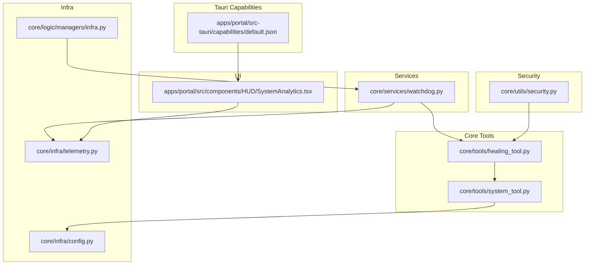
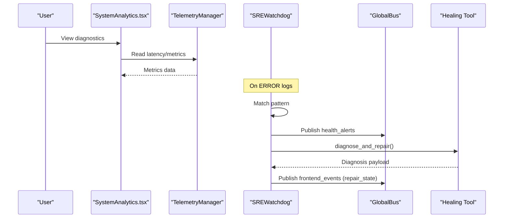
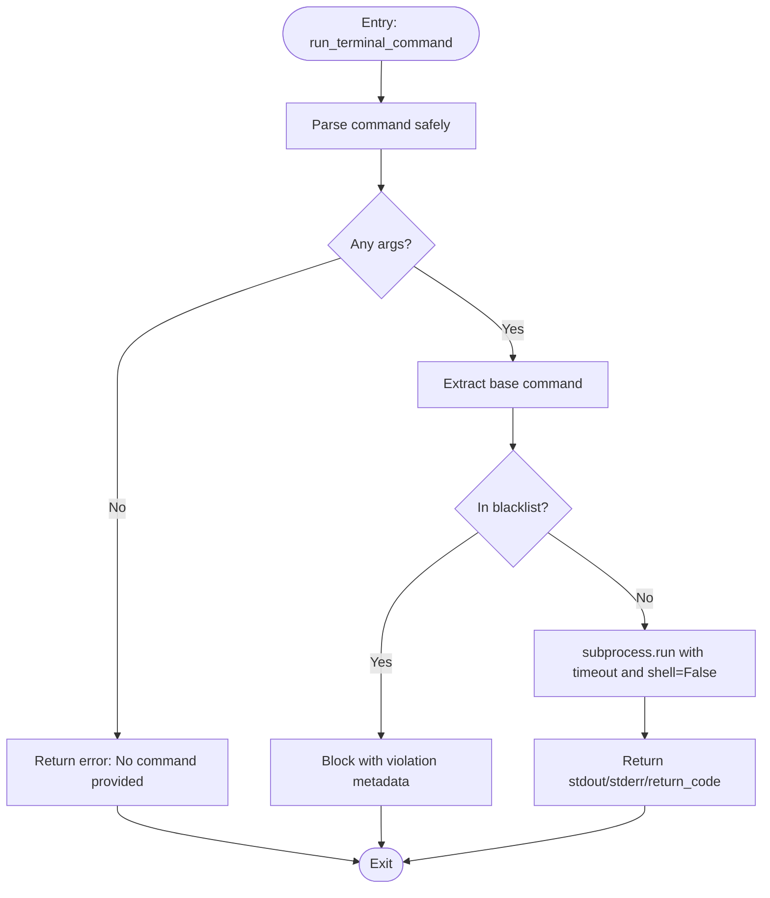
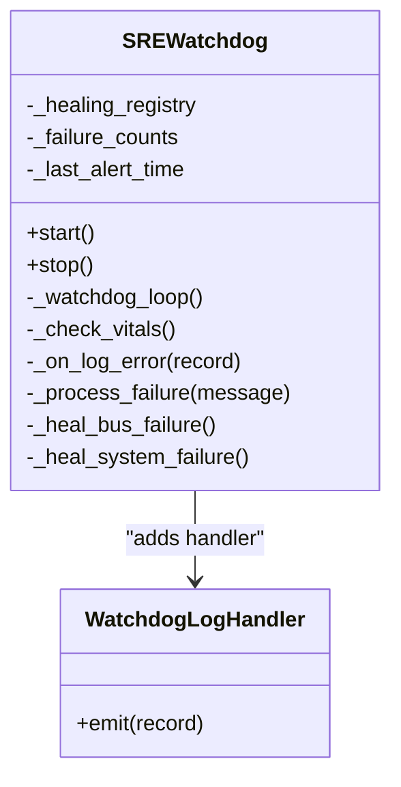
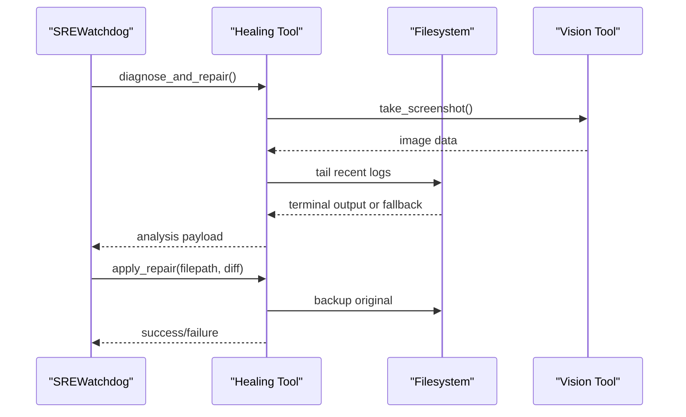
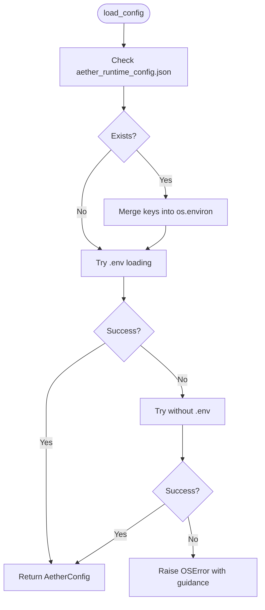
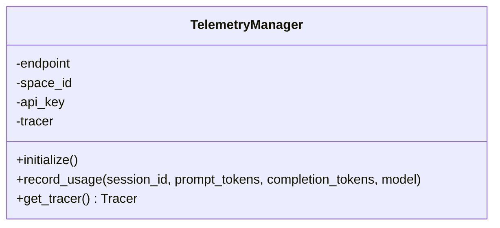
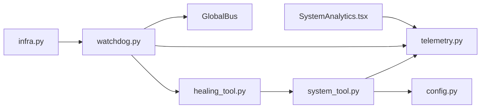

# System Tools

<cite>
**Referenced Files in This Document**
- [system_tool.py](file://core/tools/system_tool.py)
- [test_system_tool.py](file://tests/test_system_tool.py)
- [config.py](file://core/infra/config.py)
- [security.py](file://core/utils/security.py)
- [watchdog.py](file://core/services/watchdog.py)
- [healing_tool.py](file://core/tools/healing_tool.py)
- [infra.py](file://core/logic/managers/infra.py)
- [telemetry.py](file://core/infra/telemetry.py)
- [SystemAnalytics.tsx](file://apps/portal/src/components/HUD/SystemAnalytics.tsx)
- [default.json](file://apps/portal/src-tauri/capabilities/default.json)
- [stability_report.json](file://docs/audits/stability_report.json)
</cite>

## Table of Contents
1. [Introduction](#introduction)
2. [Project Structure](#project-structure)
3. [Core Components](#core-components)
4. [Architecture Overview](#architecture-overview)
5. [Detailed Component Analysis](#detailed-component-analysis)
6. [Dependency Analysis](#dependency-analysis)
7. [Performance Considerations](#performance-considerations)
8. [Troubleshooting Guide](#troubleshooting-guide)
9. [Conclusion](#conclusion)
10. [Appendices](#appendices)

## Introduction
This document describes the system tools in Aether Voice OS, focusing on:
- System command execution with process management, environment handling, and security restrictions
- System monitoring and health tools with alerting and autonomous healing
- Runtime configuration management and validation
- Practical usage examples, parameter validation, and result processing
- Security considerations around privilege control and sandboxing
- Troubleshooting guidance and performance optimization tips

## Project Structure
The system tools are implemented primarily in Python under the core tools and services modules, with supporting configuration, telemetry, and UI components for observability.

**Diagram sources**
- [system_tool.py](file://core/tools/system_tool.py#L1-L310)
- [healing_tool.py](file://core/tools/healing_tool.py#L1-L148)
- [watchdog.py](file://core/services/watchdog.py#L1-L228)
- [config.py](file://core/infra/config.py#L1-L175)
- [infra.py](file://core/logic/managers/infra.py#L1-L47)
- [telemetry.py](file://core/infra/telemetry.py#L1-L130)
- [SystemAnalytics.tsx](file://apps/portal/src/components/HUD/SystemAnalytics.tsx#L1-L88)
- [security.py](file://core/utils/security.py#L1-L71)
- [default.json](file://apps/portal/src-tauri/capabilities/default.json#L1-L11)

**Section sources**
- [system_tool.py](file://core/tools/system_tool.py#L1-L310)
- [watchdog.py](file://core/services/watchdog.py#L1-L228)
- [config.py](file://core/infra/config.py#L1-L175)
- [infra.py](file://core/logic/managers/infra.py#L1-L47)
- [telemetry.py](file://core/infra/telemetry.py#L1-L130)
- [SystemAnalytics.tsx](file://apps/portal/src/components/HUD/SystemAnalytics.tsx#L1-L88)
- [security.py](file://core/utils/security.py#L1-L71)
- [default.json](file://apps/portal/src-tauri/capabilities/default.json#L1-L11)

## Core Components
- System command execution: safe terminal command runner with strict parsing, blacklisting, timeouts, and isolation
- System info/time/timer: lightweight utilities for time, date, and timer
- Codebase listing and file reading: safe traversal and content retrieval with limits
- Health monitoring and alerting: watchdog that monitors logs and publishes health events
- Autonomous healing: grounded diagnosis and repair intent tooling
- Configuration management: validated runtime configuration with environment and JSON fallback
- Telemetry: OpenTelemetry tracing sink for usage and cost attribution
- UI diagnostics: system analytics HUD for latency and signal metrics

**Section sources**
- [system_tool.py](file://core/tools/system_tool.py#L36-L196)
- [watchdog.py](file://core/services/watchdog.py#L39-L170)
- [healing_tool.py](file://core/tools/healing_tool.py#L18-L100)
- [config.py](file://core/infra/config.py#L102-L175)
- [telemetry.py](file://core/infra/telemetry.py#L14-L130)
- [SystemAnalytics.tsx](file://apps/portal/src/components/HUD/SystemAnalytics.tsx#L36-L88)

## Architecture Overview
The system tools integrate with configuration, telemetry, and UI layers. The watchdog subscribes to logs and triggers healing actions, which may involve capturing screenshots and terminal context. The UI displays system analytics derived from runtime telemetry.

**Diagram sources**
- [SystemAnalytics.tsx](file://apps/portal/src/components/HUD/SystemAnalytics.tsx#L36-L88)
- [telemetry.py](file://core/infra/telemetry.py#L77-L112)
- [watchdog.py](file://core/services/watchdog.py#L119-L168)
- [healing_tool.py](file://core/tools/healing_tool.py#L18-L65)

## Detailed Component Analysis

### System Command Execution
The system command execution tool provides a safe way to run read-only or benign commands with strong safeguards:
- Argument parsing with safe splitting
- Blacklist enforcement for dangerous commands
- Strict timeout to prevent hangs
- Isolation via non-shell invocation
- Structured result reporting with stdout, stderr, and return code

**Diagram sources**
- [system_tool.py](file://core/tools/system_tool.py#L87-L131)

Usage examples and validations:
- Allowed command test verifies successful execution and return code
- Blacklisted commands are rejected with violation metadata
- Case-insensitive blocking ensures robust guardrails
- Shell injection prevention demonstrated by treating operators as literal arguments
- Timeout enforcement prevents long-running commands

**Section sources**
- [system_tool.py](file://core/tools/system_tool.py#L87-L131)
- [test_system_tool.py](file://tests/test_system_tool.py#L6-L68)

### System Info, Time, and Timer
- Time tool returns local time/date, UTC time, timezone, and Unix timestamp
- System info tool returns OS, version, machine, hostname, and Python version
- Timer tool acknowledges a timer request and returns a formatted message

These tools are lightweight and idempotent, suitable for frequent queries.

**Section sources**
- [system_tool.py](file://core/tools/system_tool.py#L36-L84)

### Codebase Listing and File Reading
- Codebase listing traverses the project tree while ignoring common artifact directories and truncates results to avoid context overflow
- File reading enforces a character limit to prevent memory pressure and reports truncation status

These tools support agent-driven exploration and inspection of project structure and content.

**Section sources**
- [system_tool.py](file://core/tools/system_tool.py#L137-L196)

### Health Monitoring and Alerting (Watchdog)
The SRE Watchdog:
- Hooks into the logging system to intercept ERROR and higher level records
- Matches observed patterns against a healing registry
- Publishes health alerts and frontend events via the Global Bus
- Executes healing actions with throttling to avoid alert storms
- Integrates with telemetry and Firebase for repair logging

**Diagram sources**
- [watchdog.py](file://core/services/watchdog.py#L39-L94)
- [watchdog.py](file://core/services/watchdog.py#L119-L168)

Operational flow:
- Start initializes logging hook and background loop
- On error, dispatch to processing with throttling
- Match pattern and publish health alerts
- Execute healing protocol and update frontend state

**Section sources**
- [watchdog.py](file://core/services/watchdog.py#L74-L168)

### Autonomous Healing Tool
The healing tool gathers grounded context and proposes repairs:
- Captures a screenshot for visual context
- Gathers terminal context from recent logs or falls back to directory listing
- Returns structured payload for diagnosis and repair
- Repair application creates backups and reports outcomes

**Diagram sources**
- [healing_tool.py](file://core/tools/healing_tool.py#L18-L100)

**Section sources**
- [healing_tool.py](file://core/tools/healing_tool.py#L18-L100)

### Configuration Management
Runtime configuration is validated and loaded from environment variables with a JSON fallback:
- Loads audio, AI, and gateway configurations
- Supports Base64-encoded Firebase credentials
- Attempts environment-based loading, then falls back to no-env mode, raising descriptive errors
- Provides decoding helper for credentials

**Diagram sources**
- [config.py](file://core/infra/config.py#L130-L159)

**Section sources**
- [config.py](file://core/infra/config.py#L102-L175)

### Telemetry and Diagnostics
Telemetry exports traces to Arize/Phoenix via OTLP with batch processing in production and simple processing in debug mode. It also records usage and cost attributes on spans.

**Diagram sources**
- [telemetry.py](file://core/infra/telemetry.py#L14-L112)

**Section sources**
- [telemetry.py](file://core/infra/telemetry.py#L14-L130)

### UI System Analytics
The HUD component visualizes system metrics such as neural flux, signal integrity, pitch, and spectral centroid, and displays latency and frequency metrics.

**Section sources**
- [SystemAnalytics.tsx](file://apps/portal/src/components/HUD/SystemAnalytics.tsx#L36-L88)

## Dependency Analysis
- System tools depend on configuration for environment-aware behavior and on telemetry for observability
- Watchdog depends on the Global Bus for alerting and healing coordination
- Healing tool depends on vision tooling and filesystem operations
- Infrastructure manager composes Firebase and Watchdog services
- UI components consume telemetry and state for visualization

**Diagram sources**
- [system_tool.py](file://core/tools/system_tool.py#L1-L310)
- [config.py](file://core/infra/config.py#L1-L175)
- [watchdog.py](file://core/services/watchdog.py#L1-L228)
- [healing_tool.py](file://core/tools/healing_tool.py#L1-L148)
- [infra.py](file://core/logic/managers/infra.py#L1-L47)
- [telemetry.py](file://core/infra/telemetry.py#L1-L130)
- [SystemAnalytics.tsx](file://apps/portal/src/components/HUD/SystemAnalytics.tsx#L1-L88)

**Section sources**
- [system_tool.py](file://core/tools/system_tool.py#L1-L310)
- [watchdog.py](file://core/services/watchdog.py#L1-L228)
- [healing_tool.py](file://core/tools/healing_tool.py#L1-L148)
- [config.py](file://core/infra/config.py#L1-L175)
- [infra.py](file://core/logic/managers/infra.py#L1-L47)
- [telemetry.py](file://core/infra/telemetry.py#L1-L130)
- [SystemAnalytics.tsx](file://apps/portal/src/components/HUD/SystemAnalytics.tsx#L1-L88)

## Performance Considerations
- Command execution timeout: enforced to prevent stalls and resource exhaustion
- Result truncation: codebase listing and file reads cap output sizes to maintain responsiveness
- Logging-based monitoring: reduces overhead by reacting to error events rather than polling
- Telemetry batching: batch processors reduce export overhead in production
- UI rendering: chart components use memoization and animation loops to minimize layout thrash

[No sources needed since this section provides general guidance]

## Troubleshooting Guide
Common issues and resolutions:
- Blocked commands: Review the blacklist and adjust to allowed commands; verify case-insensitive blocking
- Timeouts: Reduce command complexity or split into smaller steps; confirm external service availability
- File not found: Validate paths and permissions; ensure traversal ignores expected artifact directories
- Configuration loading failures: Check environment presence and JSON fallback; verify Base64 encoding for credentials
- Watchdog alert storms: Throttling is automatic; investigate recurring patterns and underlying causes
- Repair application failures: Confirm backup creation and file permissions; validate diff applicability

**Section sources**
- [system_tool.py](file://core/tools/system_tool.py#L87-L131)
- [test_system_tool.py](file://tests/test_system_tool.py#L15-L68)
- [config.py](file://core/infra/config.py#L130-L159)
- [watchdog.py](file://core/services/watchdog.py#L128-L168)
- [healing_tool.py](file://core/tools/healing_tool.py#L68-L100)

## Conclusion
Aether Voice OS system tools provide a secure, observable, and autonomous foundation for system-level operations. They enforce strict safety boundaries for command execution, offer robust health monitoring with alerting and healing, and expose validated runtime configuration. Together with telemetry and UI diagnostics, they enable effective system management and troubleshooting.

[No sources needed since this section summarizes without analyzing specific files]

## Appendices

### Security Considerations
- Command execution: shell=False, strict timeout, blacklist, and safe argument parsing
- Privilege control: no elevation; guarded against destructive commands
- Sandboxing: minimal filesystem access; content limits; environment-based configuration
- Signature utilities: Ed25519 verification and key generation for identity and integrity

**Section sources**
- [system_tool.py](file://core/tools/system_tool.py#L87-L131)
- [security.py](file://core/utils/security.py#L18-L71)

### Capability and Permissions
- Tauri default capability enables core permissions for the main window
- Frontend diagnostics rely on telemetry and state stores

**Section sources**
- [default.json](file://apps/portal/src-tauri/capabilities/default.json#L1-L11)
- [SystemAnalytics.tsx](file://apps/portal/src/components/HUD/SystemAnalytics.tsx#L36-L88)

### Stability and Metrics References
- Stability report includes CPU and memory metrics over time for operational insights

**Section sources**
- [stability_report.json](file://docs/audits/stability_report.json#L843-L895)