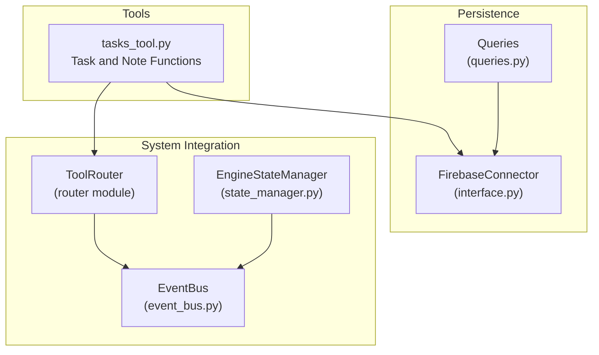
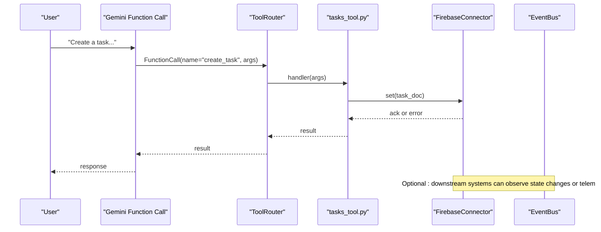
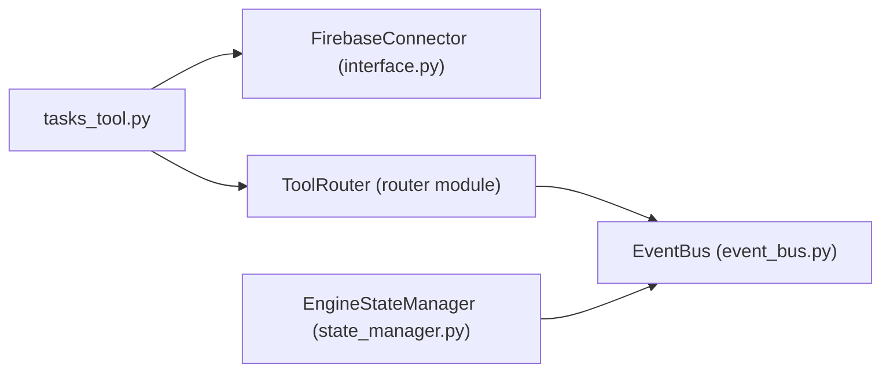

# Task Tools

<cite>
**Referenced Files in This Document**
- [tasks_tool.py](file://core/tools/tasks_tool.py)
- [handover_protocol.py](file://core/ai/handover_protocol.py)
- [handover_telemetry.py](file://core/ai/handover_telemetry.py)
- [event_bus.py](file://core/infra/event_bus.py)
- [state_manager.py](file://core/infra/state_manager.py)
- [interface.py](file://core/infra/cloud/firebase/interface.py)
- [queries.py](file://core/infra/cloud/firebase/queries.py)
- [test_neural_dispatcher.py](file://tests/integration/test_neural_dispatcher.py)
- [test_event_bus_load.py](file://tests/stress/test_event_bus_load.py)
</cite>

## Table of Contents
1. [Introduction](#introduction)
2. [Project Structure](#project-structure)
3. [Core Components](#core-components)
4. [Architecture Overview](#architecture-overview)
5. [Detailed Component Analysis](#detailed-component-analysis)
6. [Dependency Analysis](#dependency-analysis)
7. [Performance Considerations](#performance-considerations)
8. [Troubleshooting Guide](#troubleshooting-guide)
9. [Conclusion](#conclusion)
10. [Appendices](#appendices)

## Introduction
This document describes the task tools in Aether Voice OS, focusing on the task management system exposed to the AI agent via Gemini function calling. It covers task creation, listing, completion, and note-taking, along with the underlying persistence layer, integration points, and operational characteristics. It also outlines how task-related operations relate to broader system components such as the event bus, state transitions, and telemetry for handover operations.

## Project Structure
The task tools are implemented as a module that registers Gemini-callable functions for task and note operations. These functions rely on a Firebase-backed persistence layer and integrate with the system’s tool router and event bus.

**Diagram sources**
- [tasks_tool.py](file://core/tools/tasks_tool.py#L216-L324)
- [interface.py](file://core/infra/cloud/firebase/interface.py#L15-L61)
- [queries.py](file://core/infra/cloud/firebase/queries.py#L20-L45)
- [event_bus.py](file://core/infra/event_bus.py#L69-L152)
- [state_manager.py](file://core/infra/state_manager.py#L46-L99)

**Section sources**
- [tasks_tool.py](file://core/tools/tasks_tool.py#L1-L325)
- [interface.py](file://core/infra/cloud/firebase/interface.py#L15-L61)
- [queries.py](file://core/infra/cloud/firebase/queries.py#L20-L45)
- [event_bus.py](file://core/infra/event_bus.py#L69-L152)
- [state_manager.py](file://core/infra/state_manager.py#L46-L99)

## Core Components
- Task and Note Functions: Exposed as Gemini-callable tools for creating tasks, listing tasks, completing tasks, and saving notes. Each tool defines a JSON Schema for parameters and includes metadata such as latency tier and idempotency.
- Persistence Layer: Uses Firebase/Firestore via a connector abstraction. Operations are resilient to connectivity issues by falling back gracefully when Firestore is unavailable.
- Tool Router: Auto-discovers tools from modules and dispatches function calls to handlers.
- Event Bus and State Manager: Provide cross-cutting observability and state transitions that can be leveraged by higher-level orchestration.

Key responsibilities:
- tasks_tool.py: Implements create_task, list_tasks, complete_task, add_note, and get_tools.
- interface.py: Provides FirebaseConnector for initializing and managing Firestore connections.
- event_bus.py: Tiered event bus supporting audio/control/telemetry lanes with expiration and concurrency.
- state_manager.py: Enforces state transitions and publishes control events.

**Section sources**
- [tasks_tool.py](file://core/tools/tasks_tool.py#L43-L324)
- [interface.py](file://core/infra/cloud/firebase/interface.py#L15-L61)
- [event_bus.py](file://core/infra/event_bus.py#L69-L152)
- [state_manager.py](file://core/infra/state_manager.py#L46-L99)

## Architecture Overview
The task tools operate in an event-driven, observable system. When a user instructs the AI to manage tasks, Gemini emits a function call that the ToolRouter routes to the appropriate handler. Handlers interact with the persistence layer and optionally emit events or update state.

**Diagram sources**
- [tasks_tool.py](file://core/tools/tasks_tool.py#L216-L324)
- [interface.py](file://core/infra/cloud/firebase/interface.py#L15-L61)
- [event_bus.py](file://core/infra/event_bus.py#L69-L152)

## Detailed Component Analysis

### Task Tools Module
- Purpose: Expose task and note operations as Gemini-callable tools.
- Functions:
  - create_task(title, due?, priority?): Creates a task document with status pending and UTC timestamps.
  - list_tasks(status?, limit?): Lists tasks filtered by status and bounded by limit.
  - complete_task(task_id): Marks a task as completed with a completion timestamp.
  - add_note(content, tag?): Stores a note document.
- Tool Registration: get_tools returns structured tool descriptors with JSON Schemas, latency tiers, and idempotency flags.

Operational notes:
- Graceful degradation: When Firebase is unavailable, writes are skipped and logs a warning; reads return an unavailable status.
- Idempotency: list_tasks is idempotent; others are not.
- Latency: Declared latency tier indicates performance expectations.

**Section sources**
- [tasks_tool.py](file://core/tools/tasks_tool.py#L43-L324)

### Persistence Layer (Firebase)
- FirebaseConnector: Initializes the Firestore client using secure credentials or defaults, tracks connection state, and manages session documents.
- Queries: Provides cached retrieval helpers for recent sessions to reduce read pressure.

Integration:
- tasks_tool.py uses a module-level Firebase connector reference and guards operations with availability checks.
- Queries module demonstrates caching and indexing patterns that can inspire similar patterns for task lists if needed.

**Section sources**
- [interface.py](file://core/infra/cloud/firebase/interface.py#L15-L61)
- [queries.py](file://core/infra/cloud/firebase/queries.py#L20-L45)
- [tasks_tool.py](file://core/tools/tasks_tool.py#L24-L41)

### Event Bus and State Management
- EventBus: Tiered queues for audio, control, and telemetry with worker lanes, expiration checks, and concurrent subscriber delivery.
- EngineStateManager: Enforces allowed state transitions and publishes control events to the bus.

These components underpin observability and coordination. While task tools themselves primarily operate on Firestore, the event bus and state manager enable broader system reactions (e.g., HUD updates, telemetry) that complement task operations.

**Section sources**
- [event_bus.py](file://core/infra/event_bus.py#L69-L152)
- [state_manager.py](file://core/infra/state_manager.py#L46-L99)

### Handover Protocol and Telemetry (Contextual)
While not the primary task tool, the handover protocol and telemetry illustrate how task-related operations can be tracked and audited at a higher level. The protocol models task decomposition and completion, and telemetry captures outcomes, durations, and failure categories.

- HandoverContext: Includes a task tree with nodes, status tracking, and completion timestamps.
- HandoverTelemetry: Records outcomes, performance metrics, and analytics for optimization.

These concepts inform how task completion and progress can be monitored and audited beyond simple CRUD operations.

**Section sources**
- [handover_protocol.py](file://core/ai/handover_protocol.py#L81-L244)
- [handover_telemetry.py](file://core/ai/handover_telemetry.py#L97-L171)
- [handover_telemetry.py](file://core/ai/handover_telemetry.py#L295-L426)

### Tool Router Integration
- The ToolRouter auto-discovers tools from modules via get_tools and dispatches function calls.
- Tests validate registration and dispatch behavior for tasks_tool.

This ensures task tools are discoverable and callable by Gemini.

**Section sources**
- [test_neural_dispatcher.py](file://tests/integration/test_neural_dispatcher.py#L50-L59)
- [test_neural_dispatcher.py](file://tests/integration/test_neural_dispatcher.py#L207-L213)

## Dependency Analysis
The task tools module depends on:
- FirebaseConnector for persistence
- ToolRouter for function exposure
- Optional integration with EventBus and StateManager for observability

**Diagram sources**
- [tasks_tool.py](file://core/tools/tasks_tool.py#L24-L33)
- [interface.py](file://core/infra/cloud/firebase/interface.py#L15-L61)
- [event_bus.py](file://core/infra/event_bus.py#L69-L152)
- [state_manager.py](file://core/infra/state_manager.py#L46-L99)

**Section sources**
- [tasks_tool.py](file://core/tools/tasks_tool.py#L24-L33)
- [interface.py](file://core/infra/cloud/firebase/interface.py#L15-L61)
- [event_bus.py](file://core/infra/event_bus.py#L69-L152)
- [state_manager.py](file://core/infra/state_manager.py#L46-L99)

## Performance Considerations
- Latency expectations: Tools declare latency tiers suitable for interactive experiences.
- Event bus throughput: The event bus supports high EPS loads across three tiers, with expiration and concurrent delivery.
- Persistence resilience: When Firebase is unavailable, operations fall back gracefully rather than failing hard, preserving system stability.

Recommendations:
- Prefer idempotent reads (e.g., list_tasks) for frequent polling.
- Batch or debounce UI updates triggered by task changes.
- Monitor event bus saturation under load to avoid priority inversion.

**Section sources**
- [tasks_tool.py](file://core/tools/tasks_tool.py#L252-L253)
- [tasks_tool.py](file://core/tools/tasks_tool.py#L277-L278)
- [test_event_bus_load.py](file://tests/stress/test_event_bus_load.py#L8-L42)
- [event_bus.py](file://core/infra/event_bus.py#L102-L124)

## Troubleshooting Guide
Common scenarios and resolutions:
- Firestore Unavailable
  - Symptom: Tasks created locally only; list returns unavailable.
  - Action: Verify Firebase credentials and connectivity; retry after initialization.
- Write Failures
  - Symptom: Error status returned on create/update.
  - Action: Inspect logs for exceptions; confirm Firestore permissions and indexes.
- Task Not Found
  - Symptom: complete_task returns not_found.
  - Action: Confirm task_id correctness; ensure the document exists.
- Tool Discovery Issues
  - Symptom: Function not recognized by ToolRouter.
  - Action: Ensure get_tools is registered and called by ToolRouter; verify module imports.

Validation references:
- Integration tests demonstrate tool registration and basic dispatch behavior.
- Unit tests show fallback behavior when Firebase is not present.

**Section sources**
- [tasks_tool.py](file://core/tools/tasks_tool.py#L67-L78)
- [tasks_tool.py](file://core/tools/tasks_tool.py#L135-L137)
- [tasks_tool.py](file://core/tools/tasks_tool.py#L155-L159)
- [test_neural_dispatcher.py](file://tests/integration/test_neural_dispatcher.py#L50-L59)
- [test_neural_dispatcher.py](file://tests/integration/test_neural_dispatcher.py#L210-L213)

## Conclusion
The task tools provide a concise, resilient set of Gemini-callable functions for task and note management, backed by Firestore and integrated into the broader event-driven system. They emphasize graceful fallbacks, structured tool definitions, and compatibility with observability primitives. For production deployments, ensure robust credential management, monitor event bus health, and leverage telemetry to track task-related outcomes and performance.

## Appendices

### Task Operations and Parameter Schemas
- create_task
  - Parameters: title (string, required), due (string), priority (enum: low, medium, high)
  - Behavior: Creates a task with status pending and UTC timestamps; persists to Firestore if available.
- list_tasks
  - Parameters: status (enum: pending, completed, all), limit (integer)
  - Behavior: Returns paginated tasks filtered by status; idempotent.
- complete_task
  - Parameters: task_id (string, required)
  - Behavior: Updates status to completed and adds completion timestamp.
- add_note
  - Parameters: content (string, required), tag (string)
  - Behavior: Persists a note document.

**Section sources**
- [tasks_tool.py](file://core/tools/tasks_tool.py#L224-L324)

### Integration Examples
- Tool Registration: Modules expose get_tools; ToolRouter auto-registers them.
- Persistence: FirebaseConnector initializes Firestore; tasks_tool uses it via a module-level reference.
- Observability: EventBus and StateManager coordinate system-wide reactions to task operations.

**Section sources**
- [tasks_tool.py](file://core/tools/tasks_tool.py#L216-L324)
- [interface.py](file://core/infra/cloud/firebase/interface.py#L15-L61)
- [event_bus.py](file://core/infra/event_bus.py#L69-L152)
- [state_manager.py](file://core/infra/state_manager.py#L46-L99)

### Security and Audit Considerations
- Access Control: Firebase rules and credentials govern who can read/write tasks and notes.
- Audit Logging: Use telemetry and logs to track task creation, completion, and failures.
- Recovery: Graceful fallbacks prevent cascading failures when persistence is unavailable.

**Section sources**
- [interface.py](file://core/infra/cloud/firebase/interface.py#L31-L60)
- [tasks_tool.py](file://core/tools/tasks_tool.py#L73-L75)
- [tasks_tool.py](file://core/tools/tasks_tool.py#L135-L137)