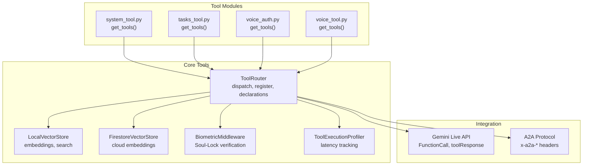
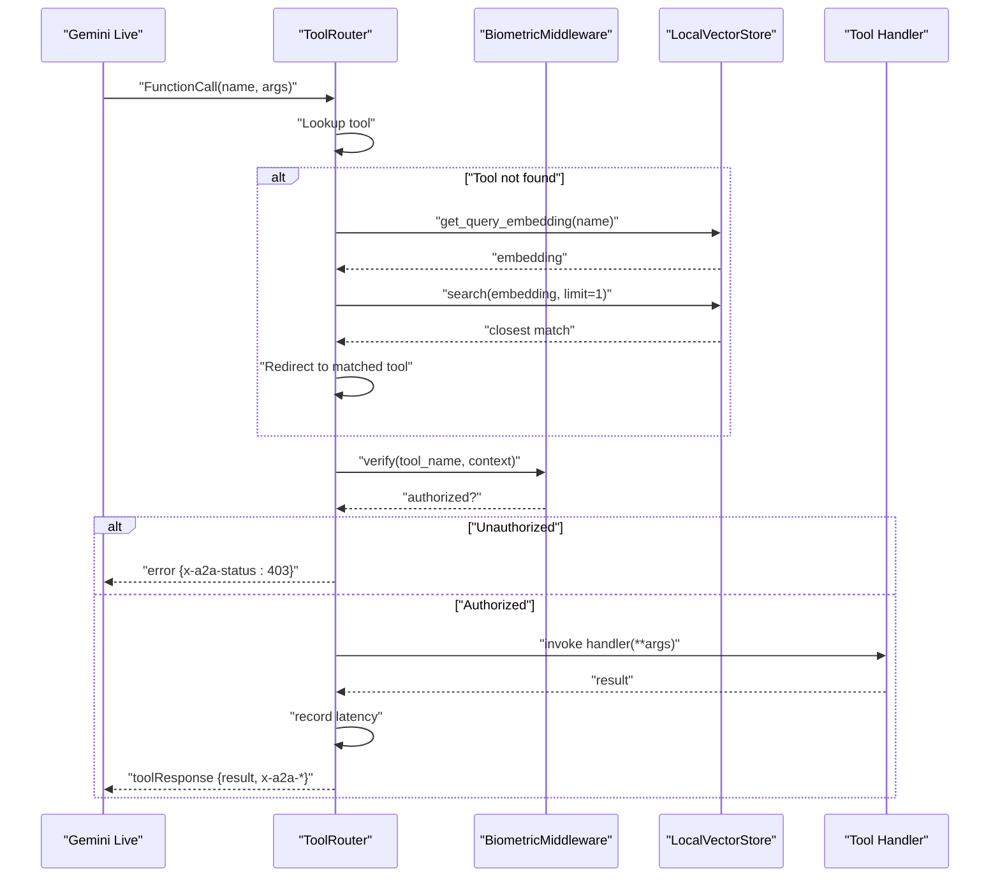
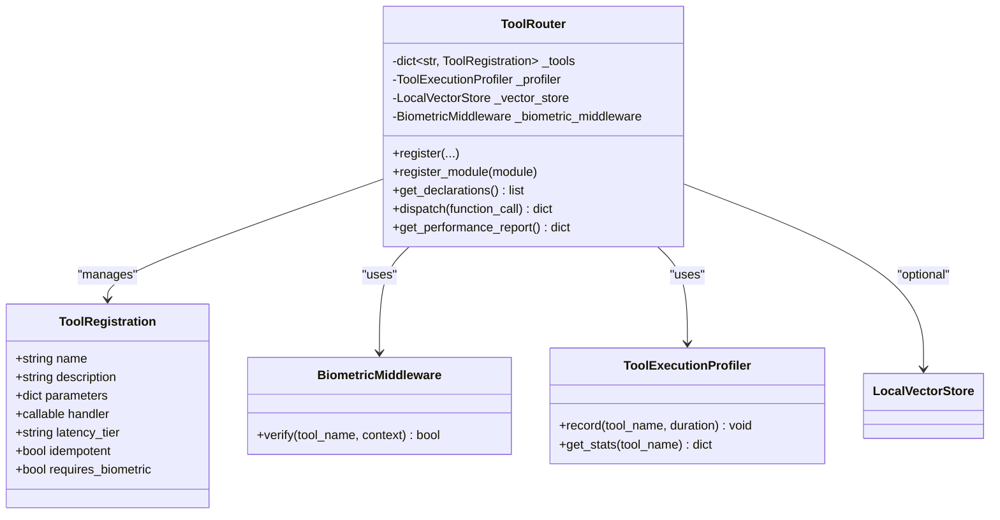
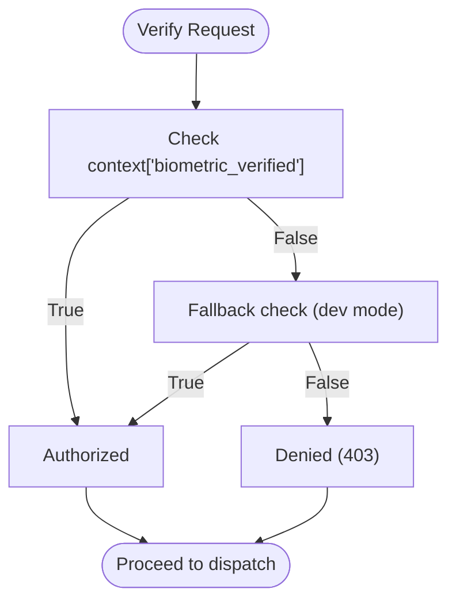
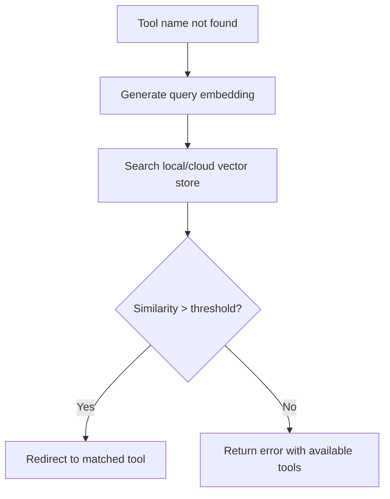
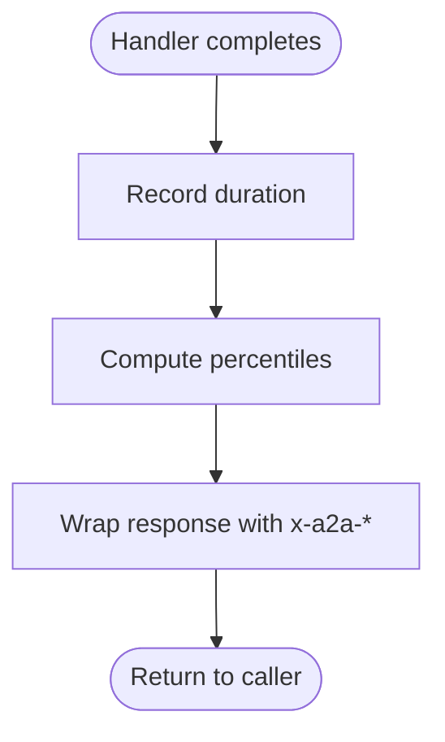
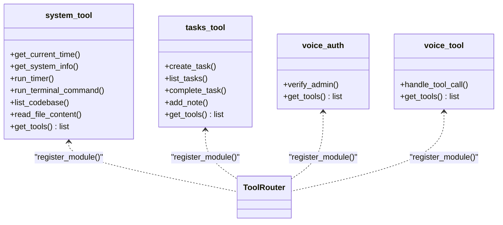
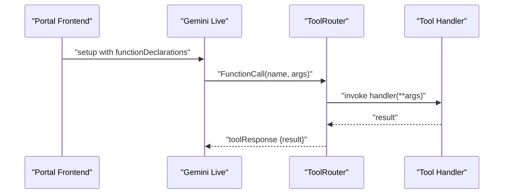
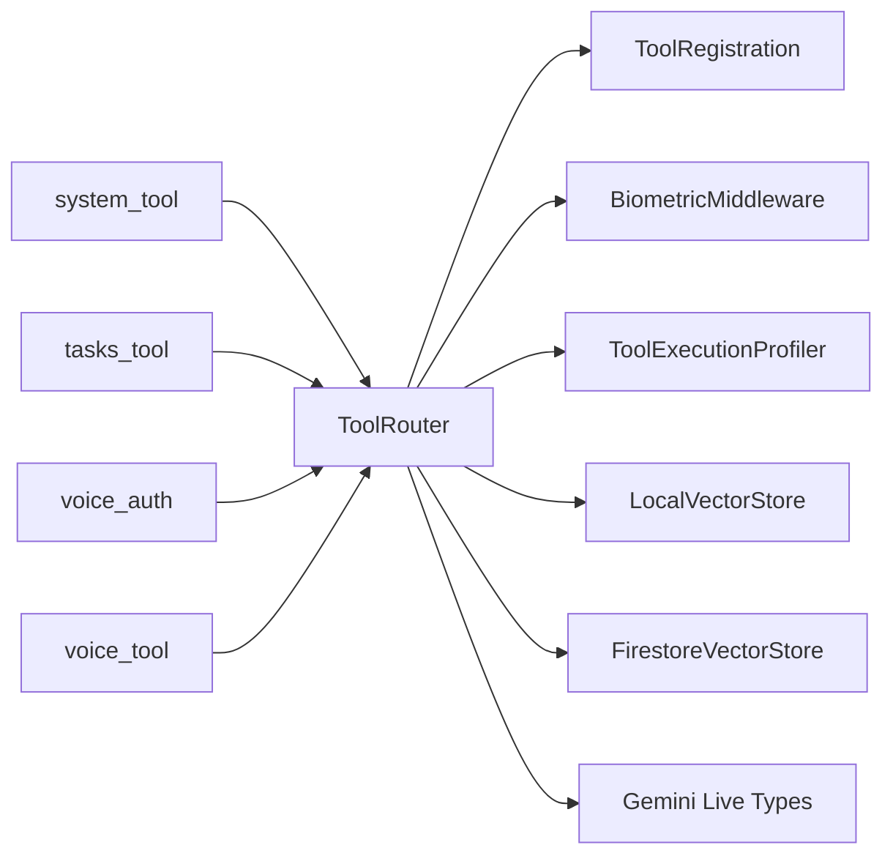

# Tool Router Architecture

<cite>
**Referenced Files in This Document**
- [router.py](file://core/tools/router.py)
- [vector_store.py](file://core/tools/vector_store.py)
- [firestore_vector_store.py](file://core/tools/firestore_vector_store.py)
- [system_tool.py](file://core/tools/system_tool.py)
- [tasks_tool.py](file://core/tools/tasks_tool.py)
- [voice_auth.py](file://core/tools/voice_auth.py)
- [voice_tool.py](file://core/tools/voice_tool.py)
- [useGeminiLive.ts](file://apps/portal/src/hooks/useGeminiLive.ts)
- [gateway_protocol.md](file://docs/gateway_protocol.md)
- [test_neural_dispatcher.py](file://tests/integration/test_neural_dispatcher.py)
- [test_adk_stress.py](file://tests/integration/test_adk_stress.py)
- [errors.py](file://core/utils/errors.py)
</cite>

## Table of Contents
1. [Introduction](#introduction)
2. [Project Structure](#project-structure)
3. [Core Components](#core-components)
4. [Architecture Overview](#architecture-overview)
5. [Detailed Component Analysis](#detailed-component-analysis)
6. [Dependency Analysis](#dependency-analysis)
7. [Performance Considerations](#performance-considerations)
8. [Troubleshooting Guide](#troubleshooting-guide)
9. [Conclusion](#conclusion)
10. [Appendices](#appendices)

## Introduction
This document describes the Tool Router architecture in Aether Voice OS. It focuses on the ToolRouter class, tool registration and function declaration generation, dispatch mechanism, biometric middleware (Soul-Lock), semantic recovery using vector stores, performance profiling, A2A protocol response wrapping, and integration with the Gemini Live API. It also provides guidelines for tool development, parameter schema design, and operational best practices.

## Project Structure
The Tool Router resides in the core tools package and integrates with:
- Tool modules that expose get_tools() for auto-registration
- Local and cloud vector stores for semantic recovery
- Biometric middleware for sensitive tool protection
- Gemini Live integration for tool calls and responses

**Diagram sources**
- [router.py](file://core/tools/router.py#L120-L360)
- [vector_store.py](file://core/tools/vector_store.py#L21-L112)
- [firestore_vector_store.py](file://core/tools/firestore_vector_store.py#L22-L129)
- [system_tool.py](file://core/tools/system_tool.py#L198-L310)
- [tasks_tool.py](file://core/tools/tasks_tool.py#L216-L325)
- [voice_auth.py](file://core/tools/voice_auth.py#L54-L82)
- [voice_tool.py](file://core/tools/voice_tool.py#L299-L336)

**Section sources**
- [router.py](file://core/tools/router.py#L1-L360)
- [vector_store.py](file://core/tools/vector_store.py#L1-L112)
- [firestore_vector_store.py](file://core/tools/firestore_vector_store.py#L1-L129)
- [system_tool.py](file://core/tools/system_tool.py#L1-L310)
- [tasks_tool.py](file://core/tools/tasks_tool.py#L1-L325)
- [voice_auth.py](file://core/tools/voice_auth.py#L1-L82)
- [voice_tool.py](file://core/tools/voice_tool.py#L1-L336)

## Core Components
- ToolRouter: Central dispatcher that registers tools, generates Gemini-compatible function declarations, routes tool calls, applies biometric middleware, performs semantic recovery, profiles execution, and wraps results per A2A protocol.
- ToolRegistration: Dataclass capturing tool metadata (name, description, parameters, handler, latency tier, idempotency, biometric requirement).
- BiometricMiddleware: Enforces Soul-Lock verification for sensitive tools.
- LocalVectorStore: Lightweight local semantic index for tool name matching.
- FirestoreVectorStore: Cloud-native vector store for scalable semantic search.
- ToolExecutionProfiler: Records execution durations and computes latency percentiles.

**Section sources**
- [router.py](file://core/tools/router.py#L33-L118)
- [router.py](file://core/tools/router.py#L120-L360)
- [vector_store.py](file://core/tools/vector_store.py#L21-L112)
- [firestore_vector_store.py](file://core/tools/firestore_vector_store.py#L22-L129)

## Architecture Overview
The Tool Router sits between Gemini Live and tool modules. Gemini emits FunctionCall messages; ToolRouter resolves handlers, enforces biometric checks, optionally recovers via semantic search, executes handlers (sync or async), records latency, and returns A2A-compliant responses.

**Diagram sources**
- [router.py](file://core/tools/router.py#L234-L356)
- [vector_store.py](file://core/tools/vector_store.py#L106-L112)
- [gateway_protocol.md](file://docs/gateway_protocol.md#L108-L124)

## Detailed Component Analysis

### ToolRouter
- Responsibilities:
  - Registration: register(name, description, parameters, handler, latency_tier, idempotent)
  - Auto-registration: register_module(module) reads module.get_tools()
  - Declarations: get_declarations() produces Gemini FunctionDeclaration objects
  - Dispatch: dispatch(function_call) with biometric middleware, semantic recovery, execution, and A2A wrapping
  - Profiling: get_performance_report() aggregates latency stats
- Sensitive tools: Built-in set of tools requiring biometric verification
- Biometric middleware: Optional context flag “biometric_verified” gates sensitive operations
- Semantic recovery: Uses LocalVectorStore to embed tool names and find nearest matches when a tool is not found
- A2A response wrapping: Adds x-a2a-status, x-a2a-latency, x-a2a-idempotent, x-a2a-duration_ms; supports overriding x-a2a-status via result.a2a_code

**Diagram sources**
- [router.py](file://core/tools/router.py#L33-L118)
- [router.py](file://core/tools/router.py#L120-L360)

**Section sources**
- [router.py](file://core/tools/router.py#L120-L360)

### ToolRegistration Dataclass
- Fields:
  - name: Unique tool identifier
  - description: Human-readable description for Gemini
  - parameters: JSON Schema for arguments
  - handler: Callable (sync or async)
  - latency_tier: String label for SLA classification
  - idempotent: Whether repeated invocation is safe
  - requires_biometric: Marks tool as sensitive

**Section sources**
- [router.py](file://core/tools/router.py#L33-L44)

### Biometric Middleware and Soul-Lock
- Purpose: Enforce biometric verification for sensitive tools
- Behavior:
  - Checks context for “biometric_verified”
  - Supports a development fallback
  - Logs verification attempts and outcomes
- Sensitive tools: Explicitly listed set plus tools with requires_biometric=True

**Diagram sources**
- [router.py](file://core/tools/router.py#L46-L85)

**Section sources**
- [router.py](file://core/tools/router.py#L46-L85)

### Semantic Recovery with Vector Stores
- LocalVectorStore:
  - Embeds tool name/description
  - Computes cosine similarity
  - Returns top matches with similarity scores
- FirestoreVectorStore:
  - Cloud-backed embeddings
  - Prototype scan-and-compute approach for similarity
- ToolRouter integrates both; on tool miss, queries embedding and searches for matches above threshold

**Diagram sources**
- [router.py](file://core/tools/router.py#L244-L282)
- [vector_store.py](file://core/tools/vector_store.py#L83-L112)
- [firestore_vector_store.py](file://core/tools/firestore_vector_store.py#L74-L129)

**Section sources**
- [router.py](file://core/tools/router.py#L244-L282)
- [vector_store.py](file://core/tools/vector_store.py#L66-L112)
- [firestore_vector_store.py](file://core/tools/firestore_vector_store.py#L37-L129)

### Performance Profiling
- Tracks per-tool execution times with bounded buffers
- Computes p50, p95, p99, average, and count
- Used to annotate responses with x-a2a-latency and x-a2a-idempotent

**Diagram sources**
- [router.py](file://core/tools/router.py#L87-L118)
- [router.py](file://core/tools/router.py#L325-L342)

**Section sources**
- [router.py](file://core/tools/router.py#L87-L118)
- [router.py](file://core/tools/router.py#L325-L342)

### A2A Protocol Response Wrapping and Status Codes
- Response envelope:
  - result: Normalized result (dict or {"data": value})
  - x-a2a-status: 200 (OK), 202 (Recovered), or overridden by result.a2a_code
  - x-a2a-latency: latency_tier
  - x-a2a-idempotent: idempotent flag
  - x-a2a-duration_ms: execution time in milliseconds
- Status codes:
  - 200: Successful execution
  - 202: Successful execution after semantic recovery
  - 400: Argument/type error
  - 403: Biometric verification failed
  - 500: Internal error

**Section sources**
- [router.py](file://core/tools/router.py#L325-L356)
- [gateway_protocol.md](file://docs/gateway_protocol.md#L108-L124)

### Tool Modules and Registration Patterns
- Modules implement get_tools() returning a list of dicts with keys: name, description, parameters, handler, latency_tier, idempotent, requires_biometric
- ToolRouter.register_module() auto-registers all tools from a module
- Examples:
  - system_tool.py: time, system info, timers, terminal commands, codebase listing, file reading
  - tasks_tool.py: create/list/complete tasks, add notes
  - voice_auth.py: verify_admin
  - voice_tool.py: aether_voice control tool

**Diagram sources**
- [system_tool.py](file://core/tools/system_tool.py#L198-L310)
- [tasks_tool.py](file://core/tools/tasks_tool.py#L216-L325)
- [voice_auth.py](file://core/tools/voice_auth.py#L54-L82)
- [voice_tool.py](file://core/tools/voice_tool.py#L299-L336)

**Section sources**
- [system_tool.py](file://core/tools/system_tool.py#L198-L310)
- [tasks_tool.py](file://core/tools/tasks_tool.py#L216-L325)
- [voice_auth.py](file://core/tools/voice_auth.py#L54-L82)
- [voice_tool.py](file://core/tools/voice_tool.py#L299-L336)

### Dispatch Workflow Examples
- Register a tool with ToolRouter.register(...)
- Generate declarations with ToolRouter.get_declarations() and pass to Gemini Live
- On FunctionCall:
  - ToolRouter.dispatch(...) resolves handler
  - BiometricMiddleware.verify(...) enforces Soul-Lock if required
  - Optional semantic recovery via vector store
  - Execution with robust sync/async support
  - A2A-wrapped response returned to Gemini

**Section sources**
- [router.py](file://core/tools/router.py#L146-L200)
- [router.py](file://core/tools/router.py#L211-L232)
- [router.py](file://core/tools/router.py#L234-L356)
- [test_neural_dispatcher.py](file://tests/integration/test_neural_dispatcher.py#L29-L129)

### Error Handling Patterns
- Argument errors: Caught as TypeError; returns 400 with error message
- Exceptions in handlers: Wrapped as 500 with error message
- Unknown tools: Attempts semantic recovery; otherwise returns 404 with available tools
- Biometric failures: Returns 403 with error message
- Crash isolation: Failing tools do not crash the router

**Section sources**
- [router.py](file://core/tools/router.py#L344-L356)
- [test_adk_stress.py](file://tests/integration/test_adk_stress.py#L55-L79)

### Integration with Gemini Live API
- Tool declarations: Generated by ToolRouter.get_declarations() and passed to Gemini Live
- Tool calls: Received as FunctionCall; ToolRouter.dispatch(...) executes handlers
- Tool responses: Sent back to Gemini via toolResponse with normalized result structure

**Diagram sources**
- [useGeminiLive.ts](file://apps/portal/src/hooks/useGeminiLive.ts#L28-L53)
- [useGeminiLive.ts](file://apps/portal/src/hooks/useGeminiLive.ts#L384-L404)
- [router.py](file://core/tools/router.py#L211-L232)
- [router.py](file://core/tools/router.py#L234-L356)

**Section sources**
- [useGeminiLive.ts](file://apps/portal/src/hooks/useGeminiLive.ts#L28-L53)
- [useGeminiLive.ts](file://apps/portal/src/hooks/useGeminiLive.ts#L384-L404)
- [router.py](file://core/tools/router.py#L211-L232)
- [router.py](file://core/tools/router.py#L234-L356)

## Dependency Analysis
- ToolRouter depends on:
  - ToolRegistration for metadata
  - BiometricMiddleware for security gating
  - LocalVectorStore/FirestoreVectorStore for semantic recovery
  - ToolExecutionProfiler for latency metrics
  - Gemini Live types for FunctionDeclaration/FunctionCall
- Tool modules depend on ToolRouter’s registration APIs and may rely on external services (e.g., Firestore, subprocess)

**Diagram sources**
- [router.py](file://core/tools/router.py#L120-L360)
- [system_tool.py](file://core/tools/system_tool.py#L198-L310)
- [tasks_tool.py](file://core/tools/tasks_tool.py#L216-L325)
- [voice_auth.py](file://core/tools/voice_auth.py#L54-L82)
- [voice_tool.py](file://core/tools/voice_tool.py#L299-L336)

**Section sources**
- [router.py](file://core/tools/router.py#L120-L360)

## Performance Considerations
- Concurrency: ToolRouter dispatch supports both sync and async handlers and runs them in threads or coroutines as appropriate.
- Profiling: ToolExecutionProfiler keeps bounded histories per tool to prevent memory growth while computing percentiles.
- Latency tiers: Tools can be tagged with latency_tier to inform downstream decisions.
- Semantic recovery: Embedding generation and similarity search add overhead; consider caching and thresholds to balance accuracy and latency.
- Stress testing: End-to-end tests demonstrate sustained throughput and crash isolation.

**Section sources**
- [router.py](file://core/tools/router.py#L310-L324)
- [router.py](file://core/tools/router.py#L87-L118)
- [test_adk_stress.py](file://tests/integration/test_adk_stress.py#L9-L79)

## Troubleshooting Guide
- Unknown tool:
  - Symptom: 404 response with available tools list
  - Action: Register tool or enable semantic recovery
- Biometric lock failure:
  - Symptom: 403 response
  - Action: Verify biometric context flag or adjust requires_biometric
- Argument/type error:
  - Symptom: 400 response
  - Action: Validate parameters schema and handler signatures
- Internal error:
  - Symptom: 500 response
  - Action: Inspect handler logs and stack traces
- Crash isolation:
  - Symptom: Single failing tool does not crash router
  - Action: Confirm error handling paths and logging

**Section sources**
- [router.py](file://core/tools/router.py#L274-L356)
- [test_adk_stress.py](file://tests/integration/test_adk_stress.py#L55-L79)

## Conclusion
The Tool Router is the central nervous system for tool orchestration in Aether Voice OS. It provides secure, observable, and resilient dispatch with biometric enforcement, semantic recovery, and A2A-compliant responses. Its modular design enables easy tool registration and integration with Gemini Live, while performance profiling and vector-backed recovery ensure robustness under real-world conditions.

## Appendices

### Guidelines for Tool Development
- Define a handler function with clear parameter schemas using JSON Schema
- Implement get_tools() returning a list of tool definitions with name, description, parameters, handler, latency_tier, idempotent, and requires_biometric
- For sensitive operations, mark requires_biometric=True or rely on built-in sensitive tool set
- Ensure handlers are either synchronous or asynchronous; ToolRouter handles both transparently
- Return structured dictionaries for consistent A2A wrapping; include a2a_code in result to override status if needed

**Section sources**
- [system_tool.py](file://core/tools/system_tool.py#L198-L310)
- [tasks_tool.py](file://core/tools/tasks_tool.py#L216-L325)
- [router.py](file://core/tools/router.py#L146-L200)
- [router.py](file://core/tools/router.py#L325-L356)

### Parameter Schema Design Best Practices
- Use explicit types and enums for constrained inputs
- Mark required fields clearly
- Keep descriptions concise but informative for Gemini
- Limit payload sizes and apply timeouts for external operations

**Section sources**
- [system_tool.py](file://core/tools/system_tool.py#L234-L247)
- [tasks_tool.py](file://core/tools/tasks_tool.py#L230-L249)

### Integration with Gemini Live API
- Generate declarations with ToolRouter.get_declarations() and pass to Gemini Live configuration
- Handle FunctionCall events and call ToolRouter.dispatch(...)
- Send toolResponse back to Gemini with the normalized result structure

**Section sources**
- [router.py](file://core/tools/router.py#L211-L232)
- [router.py](file://core/tools/router.py#L234-L356)
- [useGeminiLive.ts](file://apps/portal/src/hooks/useGeminiLive.ts#L384-L404)

### Security Notes
- Biometric middleware enforces Soul-Lock verification for sensitive tools
- Voice authentication module provides an auxiliary admin verification tool
- Use requires_biometric for high-risk tools and ensure proper context propagation

**Section sources**
- [router.py](file://core/tools/router.py#L127-L133)
- [router.py](file://core/tools/router.py#L287-L301)
- [voice_auth.py](file://core/tools/voice_auth.py#L54-L82)