# Tools and Extensions

<cite>
**Referenced Files in This Document**
- [router.py](file://core/tools/router.py)
- [discovery_tool.py](file://core/tools/discovery_tool.py)
- [system_tool.py](file://core/tools/system_tool.py)
- [memory_tool.py](file://core/tools/memory_tool.py)
- [vision_tool.py](file://core/tools/vision_tool.py)
- [tasks_tool.py](file://core/tools/tasks_tool.py)
- [rag_tool.py](file://core/tools/rag_tool.py)
- [vector_store.py](file://core/tools/vector_store.py)
- [firestore_vector_store.py](file://core/tools/firestore_vector_store.py)
- [search_tool.py](file://core/tools/search_tool.py)
- [code_indexer.py](file://core/tools/code_indexer.py)
- [context_scraper.py](file://core/tools/context_scraper.py)
- [environment_memory.py](file://core/tools/environment_memory.py)
- [hive_tool.py](file://core/tools/hive_tool.py)
- [healing_tool.py](file://core/tools/healing_tool.py)
</cite>

## Table of Contents
1. [Introduction](#introduction)
2. [Project Structure](#project-structure)
3. [Core Components](#core-components)
4. [Architecture Overview](#architecture-overview)
5. [Detailed Component Analysis](#detailed-component-analysis)
6. [Dependency Analysis](#dependency-analysis)
7. [Performance Considerations](#performance-considerations)
8. [Troubleshooting Guide](#troubleshooting-guide)
9. [Conclusion](#conclusion)
10. [Appendices](#appendices)

## Introduction
This document explains the tools and extensions system in Aether Voice OS, focusing on how tools are discovered, declared, validated, executed, and monitored by the Neural Router. It covers the available tool categories (system, memory, vision, tasks, RAG, discovery, context scraping, environment memory, hive handover, and healing), the tool creation process, and the orchestration pipeline. It also provides guidance on security, rate limiting, resource management, testing, debugging, and performance optimization.

## Project Structure
The tools subsystem resides under core/tools and includes:
- A central dispatcher (Neural Router) that registers tools, validates parameters, and executes handlers
- Category-specific tools (system, memory, vision, tasks, RAG)
- Supporting infrastructure (vector stores, discovery, context scraping, environment memory, hive handover, healing)
- A Google Search grounding tool declared separately from function tools

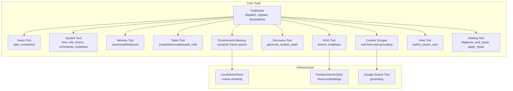

**Diagram sources**
- [router.py](file://core/tools/router.py#L120-L360)
- [vision_tool.py](file://core/tools/vision_tool.py#L1-L75)
- [system_tool.py](file://core/tools/system_tool.py#L1-L310)
- [memory_tool.py](file://core/tools/memory_tool.py#L1-L330)
- [tasks_tool.py](file://core/tools/tasks_tool.py#L1-L325)
- [rag_tool.py](file://core/tools/rag_tool.py#L1-L109)
- [discovery_tool.py](file://core/tools/discovery_tool.py#L1-L84)
- [context_scraper.py](file://core/tools/context_scraper.py#L1-L146)
- [environment_memory.py](file://core/tools/environment_memory.py#L1-L94)
- [hive_tool.py](file://core/tools/hive_tool.py#L1-L78)
- [healing_tool.py](file://core/tools/healing_tool.py#L1-L148)
- [vector_store.py](file://core/tools/vector_store.py#L1-L112)
- [firestore_vector_store.py](file://core/tools/firestore_vector_store.py#L1-L129)
- [search_tool.py](file://core/tools/search_tool.py#L1-L51)

**Section sources**
- [router.py](file://core/tools/router.py#L120-L360)
- [system_tool.py](file://core/tools/system_tool.py#L1-L310)
- [memory_tool.py](file://core/tools/memory_tool.py#L1-L330)
- [vision_tool.py](file://core/tools/vision_tool.py#L1-L75)
- [tasks_tool.py](file://core/tools/tasks_tool.py#L1-L325)
- [rag_tool.py](file://core/tools/rag_tool.py#L1-L109)
- [discovery_tool.py](file://core/tools/discovery_tool.py#L1-L84)
- [context_scraper.py](file://core/tools/context_scraper.py#L1-L146)
- [environment_memory.py](file://core/tools/environment_memory.py#L1-L94)
- [hive_tool.py](file://core/tools/hive_tool.py#L1-L78)
- [healing_tool.py](file://core/tools/healing_tool.py#L1-L148)
- [vector_store.py](file://core/tools/vector_store.py#L1-L112)
- [firestore_vector_store.py](file://core/tools/firestore_vector_store.py#L1-L129)
- [search_tool.py](file://core/tools/search_tool.py#L1-L51)

## Core Components
- ToolRouter: Central dispatcher that registers tools, generates function declarations for Gemini, validates parameters, enforces biometric middleware for sensitive tools, executes handlers (sync or async), records performance, and wraps results with A2A metadata.
- Tool Registration Model: ToolRegistration carries handler, description, JSON Schema parameters, latency tier, idempotency, and biometric requirement flags.
- Biometric Middleware: Enforces “Soul-Lock” verification for sensitive tools using session context.
- Execution Profiler: Tracks latency percentiles per tool to inform routing and performance tuning.
- Vector Stores: LocalVectorStore for fast semantic routing and FirestoreVectorStore for cloud-backed RAG.
- Specialized Tools: System, Memory, Vision, Tasks, RAG, Discovery, Context Scraper, Environment Memory, Hive Tool, and Healing Tool.

Key responsibilities:
- Parameter validation: JSON Schema-driven parameter definitions and runtime argument unpacking.
- Execution monitoring: Duration tracking, percentile computation, and A2A response wrapping.
- Security: Biometric verification for sensitive tools and guardrails for system commands.
- Resilience: Semantic recovery via vector search and graceful fallbacks when external services are unavailable.

**Section sources**
- [router.py](file://core/tools/router.py#L33-L176)
- [router.py](file://core/tools/router.py#L234-L356)
- [vector_store.py](file://core/tools/vector_store.py#L21-L112)
- [firestore_vector_store.py](file://core/tools/firestore_vector_store.py#L22-L129)

## Architecture Overview
The Neural Router orchestrates tool execution from Gemini’s function calls to handlers, with optional biometric verification, performance profiling, and A2A response wrapping.

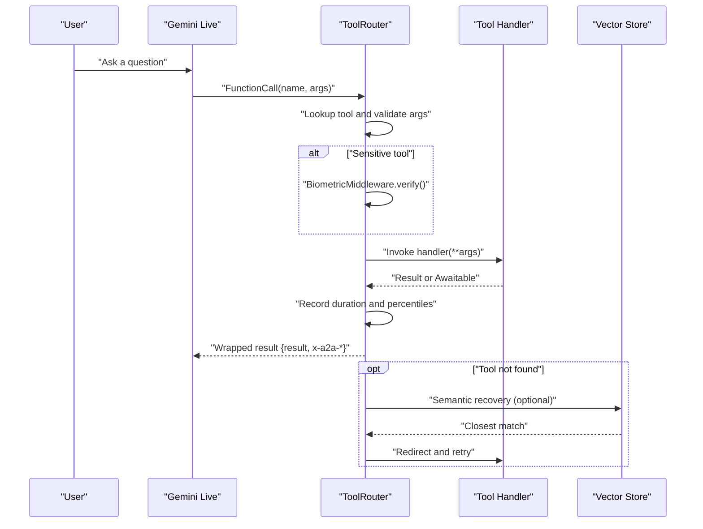

**Diagram sources**
- [router.py](file://core/tools/router.py#L234-L356)
- [vector_store.py](file://core/tools/vector_store.py#L66-L112)

**Section sources**
- [router.py](file://core/tools/router.py#L234-L356)

## Detailed Component Analysis

### ToolRouter: Registration, Validation, Execution, Monitoring
- Registration: register(name, description, parameters, handler, latency_tier, idempotent) and register_module(module) for bulk registration.
- Declarations: get_declarations() produces FunctionDeclaration objects for Gemini.
- Dispatch: dispatch(function_call) performs parameter unpacking, biometric checks for sensitive tools, handler invocation (sync or async), and A2A response wrapping.
- Biometric Middleware: Sensitive tools enforced by SENSITIVE_TOOLS list and requires_biometric flag.
- Performance: ToolExecutionProfiler records durations and computes p50/p95/p99 percentiles.
- Semantic Recovery: Optional nearest-neighbor search via LocalVectorStore when a tool name does not match.

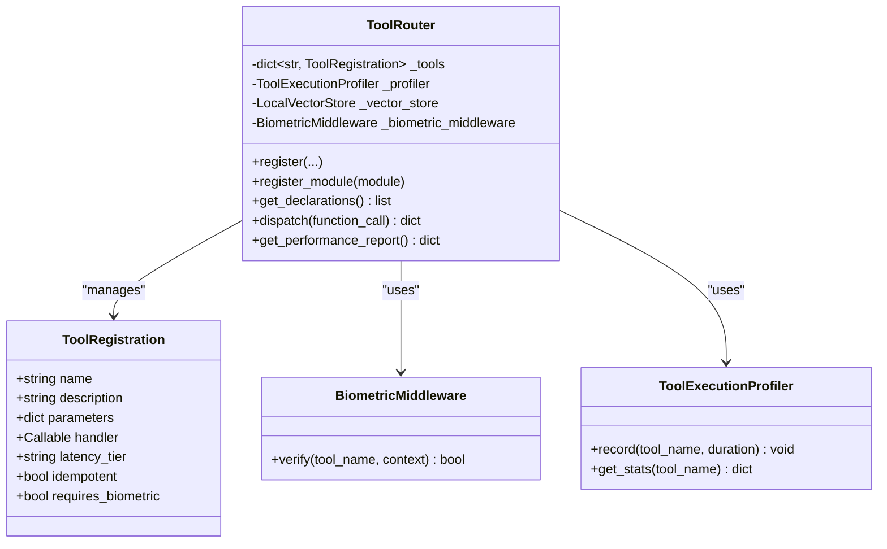

**Diagram sources**
- [router.py](file://core/tools/router.py#L33-L176)
- [router.py](file://core/tools/router.py#L120-L360)

**Section sources**
- [router.py](file://core/tools/router.py#L120-L360)

### Discovery Tool
- Purpose: Self-audit of internal systems, metrics, and codebase integrity.
- Handler: generate_system_audit returns timestamped diagnostics and counts.
- Registration: get_tools() exports a single function declaration.

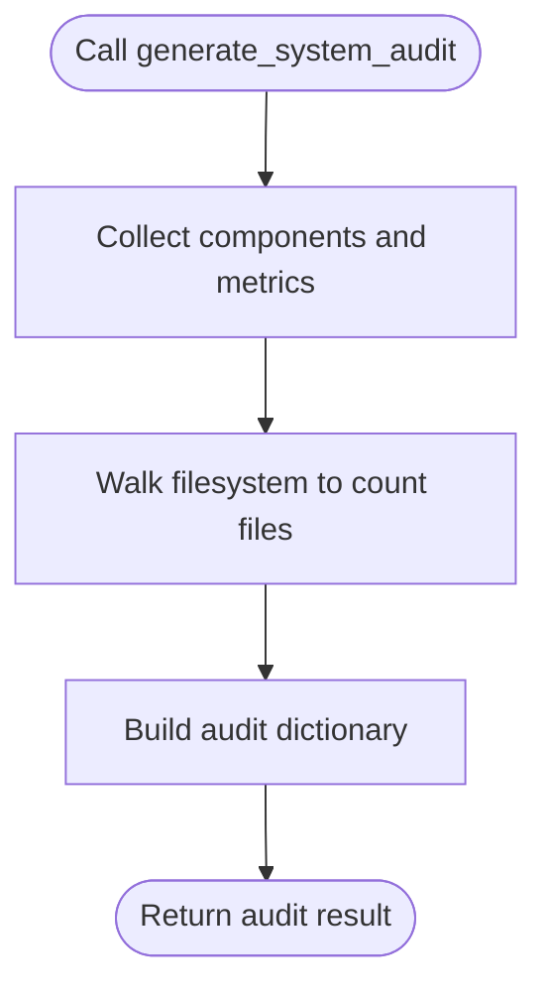

**Diagram sources**
- [discovery_tool.py](file://core/tools/discovery_tool.py#L27-L65)

**Section sources**
- [discovery_tool.py](file://core/tools/discovery_tool.py#L1-L84)

### System Tools
- Capabilities: get_current_time, get_system_info, run_timer, run_terminal_command, list_codebase, read_file_content.
- Security: run_terminal_command uses safe parsing, blacklist enforcement, timeouts, and non-shell execution.
- Idempotency: Many tools are idempotent; latency tiers are annotated for routing.

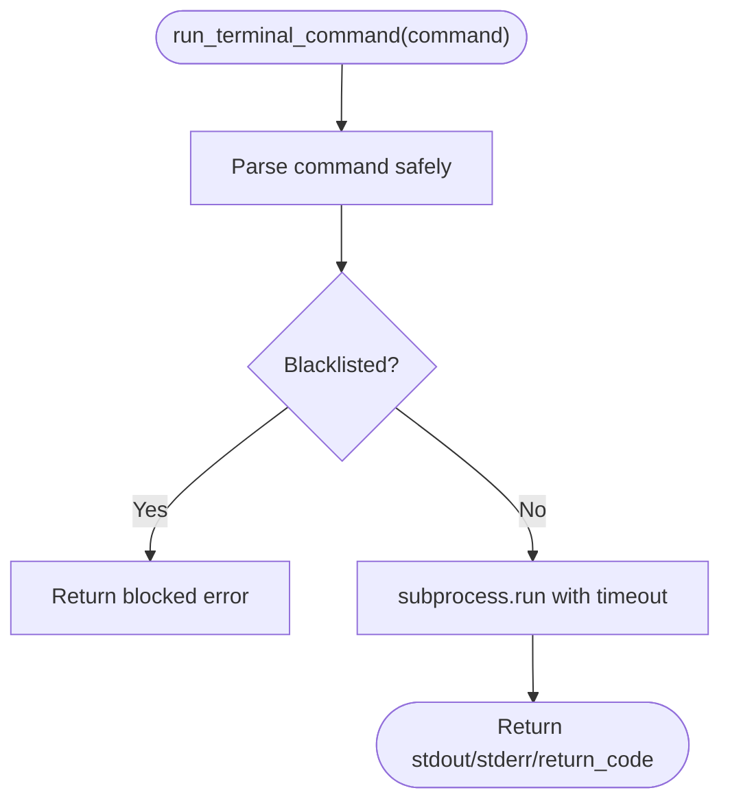

**Diagram sources**
- [system_tool.py](file://core/tools/system_tool.py#L87-L131)

**Section sources**
- [system_tool.py](file://core/tools/system_tool.py#L1-L310)

### Memory Tools
- Persistence: save_memory, recall_memory, list_memories, semantic_search backed by Firestore; graceful offline fallback.
- Tags and priorities: tagging and priority levels for semantic-assisted recall.
- Hygiene: prune_memories to remove low-importance memories.

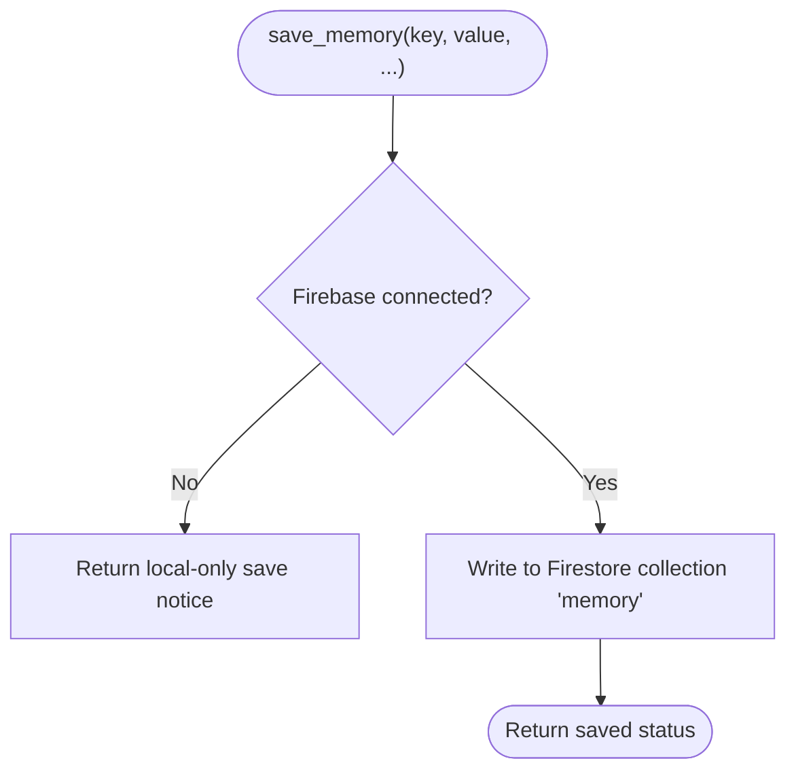

**Diagram sources**
- [memory_tool.py](file://core/tools/memory_tool.py#L40-L93)

**Section sources**
- [memory_tool.py](file://core/tools/memory_tool.py#L1-L330)

### Vision Tools
- Capability: take_screenshot captures primary monitor, encodes to Base64 PNG, returns MIME and data for multimodal injection.
- Latency: optimized capture with in-memory conversion.

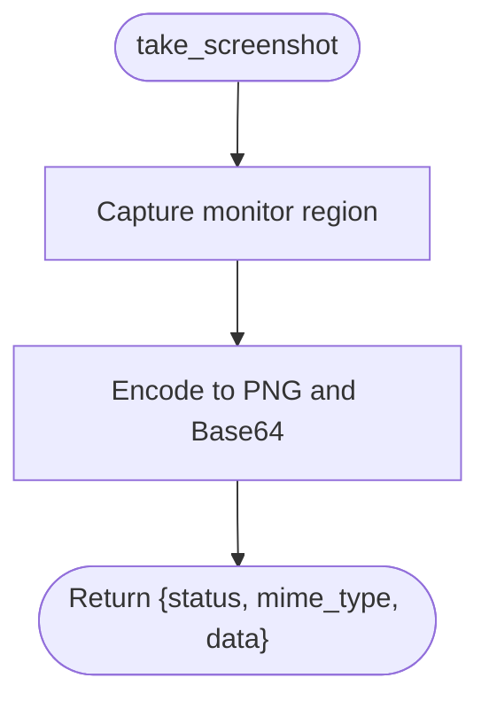

**Diagram sources**
- [vision_tool.py](file://core/tools/vision_tool.py#L19-L56)

**Section sources**
- [vision_tool.py](file://core/tools/vision_tool.py#L1-L75)

### Tasks Tools
- Persistence: create_task, list_tasks, complete_task, add_note backed by Firestore collections.
- Graceful degradation: returns offline/unavailable when Firebase is down.
- Idempotency: list_tasks is idempotent; others are not.

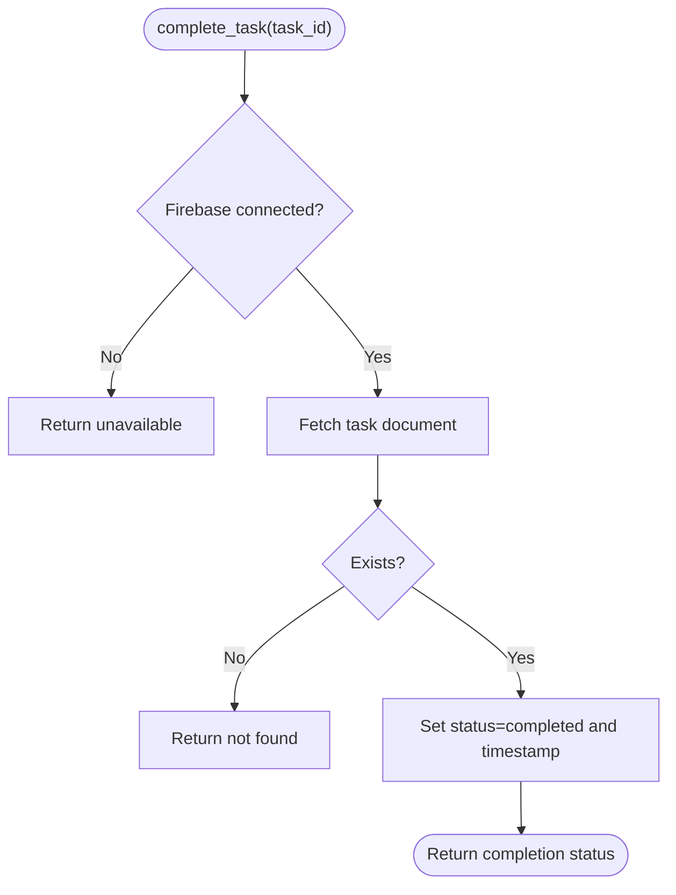

**Diagram sources**
- [tasks_tool.py](file://core/tools/tasks_tool.py#L140-L181)

**Section sources**
- [tasks_tool.py](file://core/tools/tasks_tool.py#L1-L325)

### RAG Tools
- Capability: search_codebase performs semantic search over the codebase using FirestoreVectorStore.
- Shared index: auto-initializes if not injected; returns formatted results with similarity scores and file/chunk metadata.

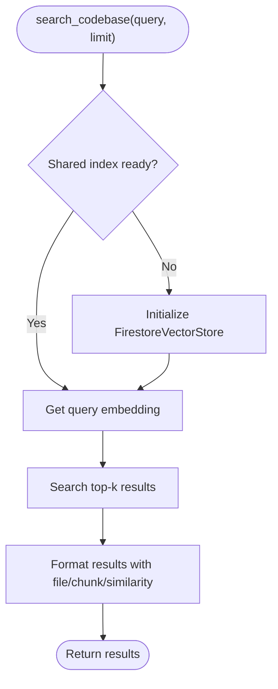

**Diagram sources**
- [rag_tool.py](file://core/tools/rag_tool.py#L26-L77)
- [firestore_vector_store.py](file://core/tools/firestore_vector_store.py#L74-L121)

**Section sources**
- [rag_tool.py](file://core/tools/rag_tool.py#L1-L109)
- [firestore_vector_store.py](file://core/tools/firestore_vector_store.py#L1-L129)

### Context Scraper
- Capability: scrape_context searches StackOverflow/GitHub/HackerNews and formats results as structured context for Gemini.
- Latency: marked as higher latency due to network I/O.

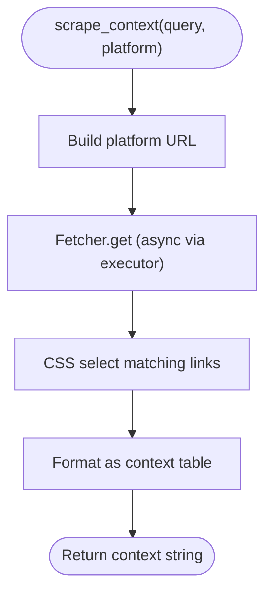

**Diagram sources**
- [context_scraper.py](file://core/tools/context_scraper.py#L19-L97)

**Section sources**
- [context_scraper.py](file://core/tools/context_scraper.py#L1-L146)

### Environment Memory
- Capability: EnvironmentMemory indexes visual frame descriptions and supports semantic queries to recall environment states.
- Persistence: Uses LocalVectorStore with incremental save/load.

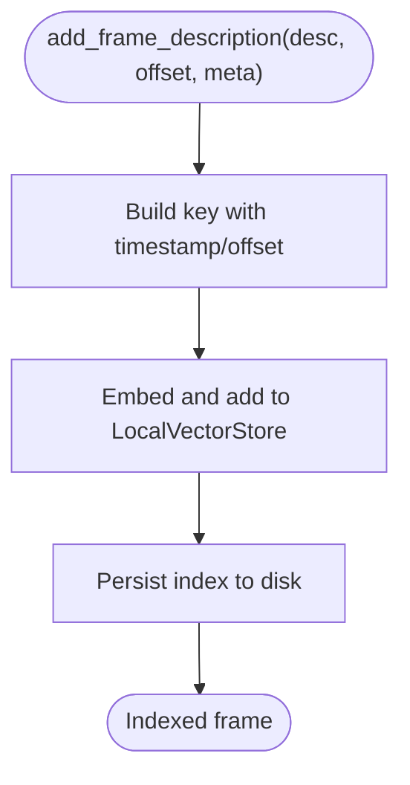

**Diagram sources**
- [environment_memory.py](file://core/tools/environment_memory.py#L30-L56)
- [vector_store.py](file://core/tools/vector_store.py#L66-L82)

**Section sources**
- [environment_memory.py](file://core/tools/environment_memory.py#L1-L94)
- [vector_store.py](file://core/tools/vector_store.py#L1-L112)

### Hive Tool
- Capability: switch_expert_soul requests a Hive handoff to a target soul with a reason.
- Integration: depends on HiveCoordinator reference injected at startup.

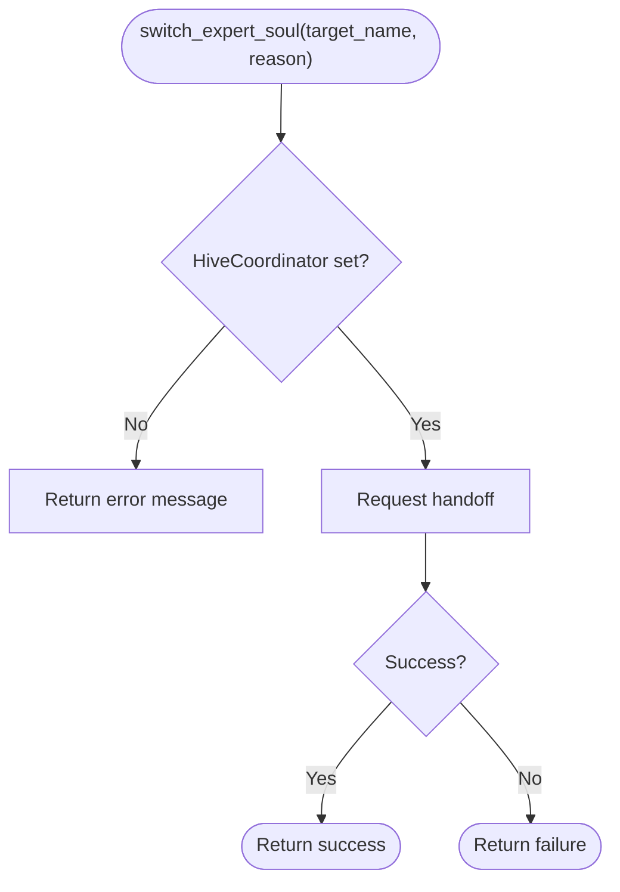

**Diagram sources**
- [hive_tool.py](file://core/tools/hive_tool.py#L27-L49)

**Section sources**
- [hive_tool.py](file://core/tools/hive_tool.py#L1-L78)

### Healing Tool
- Capability: diagnose_and_repair gathers visual and terminal context; apply_repair creates backups and applies fixes.
- Integration: reuses vision tool for screenshots.

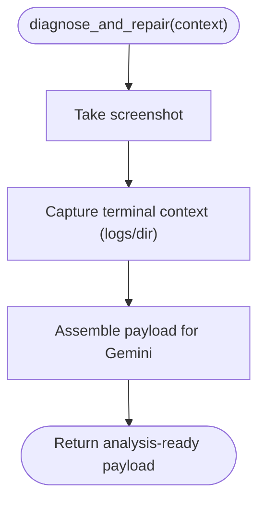

**Diagram sources**
- [healing_tool.py](file://core/tools/healing_tool.py#L18-L65)
- [vision_tool.py](file://core/tools/vision_tool.py#L19-L56)

**Section sources**
- [healing_tool.py](file://core/tools/healing_tool.py#L1-L148)

### Google Search Grounding
- Capability: get_search_tool returns a Tool configured for Google Search grounding, separate from function-calling tools.
- Usage: Declared in session config alongside function tools.

**Section sources**
- [search_tool.py](file://core/tools/search_tool.py#L1-L51)

## Dependency Analysis
- Router-to-Handlers: ToolRouter holds ToolRegistration entries; handlers are invoked directly by name.
- Vector Stores: RAG tool uses FirestoreVectorStore; discovery and environment memory use LocalVectorStore.
- External Integrations: Vision relies on mss; Context Scraper uses Scrapling; System commands rely on subprocess; FirestoreVectorStore relies on Firebase Admin and Google GenAI.

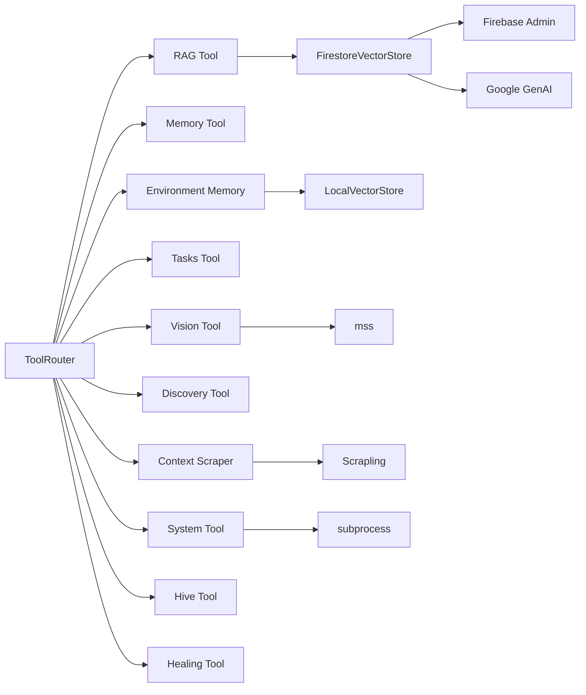

**Diagram sources**
- [router.py](file://core/tools/router.py#L120-L360)
- [system_tool.py](file://core/tools/system_tool.py#L1-L310)
- [memory_tool.py](file://core/tools/memory_tool.py#L1-L330)
- [vision_tool.py](file://core/tools/vision_tool.py#L1-L75)
- [tasks_tool.py](file://core/tools/tasks_tool.py#L1-L325)
- [rag_tool.py](file://core/tools/rag_tool.py#L1-L109)
- [discovery_tool.py](file://core/tools/discovery_tool.py#L1-L84)
- [context_scraper.py](file://core/tools/context_scraper.py#L1-L146)
- [environment_memory.py](file://core/tools/environment_memory.py#L1-L94)
- [hive_tool.py](file://core/tools/hive_tool.py#L1-L78)
- [healing_tool.py](file://core/tools/healing_tool.py#L1-L148)
- [firestore_vector_store.py](file://core/tools/firestore_vector_store.py#L1-L129)
- [vector_store.py](file://core/tools/vector_store.py#L1-L112)

**Section sources**
- [router.py](file://core/tools/router.py#L120-L360)
- [firestore_vector_store.py](file://core/tools/firestore_vector_store.py#L1-L129)
- [vector_store.py](file://core/tools/vector_store.py#L1-L112)

## Performance Considerations
- Latency tiers: Tools declare latency_tier to guide routing and expectations (e.g., low_latency, p95_sub_500ms, p95_sub_2s, p95_sub_5s).
- Profiling: ToolExecutionProfiler tracks durations and computes percentiles; use get_performance_report for insights.
- Vector search: LocalVectorStore and FirestoreVectorStore compute cosine similarity; optimize chunk sizes and limits.
- Rate limiting: FirestoreVectorStore indexing script demonstrates throttling to avoid quota errors; apply similar patterns in integrations.
- Resource limits: System tool command execution uses timeouts and blacklists; memory reads cap content length.

[No sources needed since this section provides general guidance]

## Troubleshooting Guide
Common issues and resolutions:
- Unknown tool or mismatched name:
  - Symptom: Error indicating unknown tool or semantic recovery attempts.
  - Resolution: Ensure tool is registered; confirm names match; enable vector store for semantic recovery.
- Biometric verification failure:
  - Symptom: Security exception for sensitive tools.
  - Resolution: Verify biometric context flag; adjust middleware fallback only for development.
- Argument errors:
  - Symptom: Invalid arguments error returned.
  - Resolution: Validate parameter schema; ensure required fields are present.
- External service unavailability:
  - Symptom: Offline or unavailable responses from memory/tasks tools.
  - Resolution: Confirm Firebase connectivity; handle graceful fallbacks in UI.
- Slow or blocked system commands:
  - Symptom: Timeout or blocked command.
  - Resolution: Review blacklist and timeouts; simplify commands; increase timeouts cautiously.
- RAG search returns no results:
  - Symptom: Empty results from search_codebase.
  - Resolution: Ensure shared index is initialized; verify embeddings were added; adjust query phrasing.

**Section sources**
- [router.py](file://core/tools/router.py#L244-L282)
- [router.py](file://core/tools/router.py#L294-L301)
- [router.py](file://core/tools/router.py#L344-L355)
- [memory_tool.py](file://core/tools/memory_tool.py#L56-L63)
- [tasks_tool.py](file://core/tools/tasks_tool.py#L102-L107)
- [system_tool.py](file://core/tools/system_tool.py#L127-L131)
- [rag_tool.py](file://core/tools/rag_tool.py#L37-L44)

## Conclusion
Aether Voice OS provides a robust, extensible tools framework centered on the Neural Router. Tools are declared with precise parameter schemas, validated at runtime, and executed with biometric safeguards and performance monitoring. The system integrates local and cloud vector stores, real-time web grounding, and specialized capabilities for memory, tasks, vision, environment recall, hive handovers, and autonomous healing. By following the guidelines in this document, developers can safely extend functionality, integrate external APIs, and maintain high reliability and performance.

[No sources needed since this section summarizes without analyzing specific files]

## Appendices

### Tool Categories and Examples
- System tools: Time, system info, timers, safe terminal commands, codebase listing, file reading.
- Memory tools: Persistent save/recall/list/prune with tags and priorities.
- Vision tools: Instant screen capture with Base64-encoded image data.
- Tasks tools: Task CRUD and notes with Firestore persistence.
- RAG tools: Semantic codebase search powered by cloud vector store.
- Discovery tools: Self-audit of internal systems and metrics.
- Context scraping: Real-time technical context from StackOverflow/GitHub/HackerNews.
- Environment memory: Semantic recall of visual frames.
- Hive tools: Specialist handover orchestration.
- Healing tools: Grounded diagnosis and repair intent.

**Section sources**
- [system_tool.py](file://core/tools/system_tool.py#L1-L310)
- [memory_tool.py](file://core/tools/memory_tool.py#L1-L330)
- [vision_tool.py](file://core/tools/vision_tool.py#L1-L75)
- [tasks_tool.py](file://core/tools/tasks_tool.py#L1-L325)
- [rag_tool.py](file://core/tools/rag_tool.py#L1-L109)
- [discovery_tool.py](file://core/tools/discovery_tool.py#L1-L84)
- [context_scraper.py](file://core/tools/context_scraper.py#L1-L146)
- [environment_memory.py](file://core/tools/environment_memory.py#L1-L94)
- [hive_tool.py](file://core/tools/hive_tool.py#L1-L78)
- [healing_tool.py](file://core/tools/healing_tool.py#L1-L148)

### Creating a Custom Tool
Steps:
1. Define handler function with clear parameter schema.
2. Export get_tools() returning a list of tool definitions with name, description, parameters, handler, latency_tier, idempotent, and optional requires_biometric.
3. Register with ToolRouter.register(...) or via register_module(...) if using the module pattern.
4. Integrate with external APIs carefully: enforce timeouts, quotas, and input validation; prefer async where possible.
5. Test with unit/integration tests; measure latency and profile performance.

Guidelines:
- Parameter schema: Use JSON Schema to define properties and required fields.
- Security: Apply guardrails for system commands; enforce biometric middleware for sensitive tools.
- Resilience: Provide graceful fallbacks when external services are unavailable.
- Observability: Record metrics and logs; leverage ToolExecutionProfiler.

**Section sources**
- [router.py](file://core/tools/router.py#L146-L200)
- [system_tool.py](file://core/tools/system_tool.py#L198-L310)
- [memory_tool.py](file://core/tools/memory_tool.py#L246-L330)
- [tasks_tool.py](file://core/tools/tasks_tool.py#L216-L325)
- [vision_tool.py](file://core/tools/vision_tool.py#L58-L75)
- [rag_tool.py](file://core/tools/rag_tool.py#L79-L109)
- [discovery_tool.py](file://core/tools/discovery_tool.py#L68-L84)
- [context_scraper.py](file://core/tools/context_scraper.py#L99-L134)
- [environment_memory.py](file://core/tools/environment_memory.py#L89-L94)
- [hive_tool.py](file://core/tools/hive_tool.py#L51-L78)
- [healing_tool.py](file://core/tools/healing_tool.py#L102-L148)

### Extending Existing Functionality
- Memory: Add new recall filters or hybrid search combining tags and embeddings.
- Tasks: Extend with due-date reminders, recurring tasks, or external calendar sync.
- Vision: Add OCR or region-of-interest analysis on captured images.
- RAG: Expand to include documentation, changelogs, or issue trackers.
- Context Scraper: Add more platforms or refine result ranking.

**Section sources**
- [memory_tool.py](file://core/tools/memory_tool.py#L1-L330)
- [tasks_tool.py](file://core/tools/tasks_tool.py#L1-L325)
- [vision_tool.py](file://core/tools/vision_tool.py#L1-L75)
- [rag_tool.py](file://core/tools/rag_tool.py#L1-L109)
- [context_scraper.py](file://core/tools/context_scraper.py#L1-L146)

### Integrating External APIs
- Authentication: Manage API keys securely; avoid hardcoding secrets.
- Rate limiting: Respect quotas; implement backoff and batching.
- Error handling: Wrap external calls with retries and circuit breaker patterns.
- Latency: Prefer async I/O; cache frequently accessed data.
- Security: Sanitize inputs; validate outputs; avoid exposing internal paths or credentials.

**Section sources**
- [firestore_vector_store.py](file://core/tools/firestore_vector_store.py#L1-L129)
- [code_indexer.py](file://core/tools/code_indexer.py#L1-L131)
- [context_scraper.py](file://core/tools/context_scraper.py#L1-L146)

### Tool Execution Pipeline, Error Handling, and Result Processing
- Pipeline: Router dispatch → biometric middleware (if required) → handler invocation → profiler → A2A wrap.
- Error handling: TypeErrors produce 400 responses; other exceptions produce 500 responses with error messages.
- Result processing: Results are normalized into a dictionary with a nested result field and A2A metadata.

**Section sources**
- [router.py](file://core/tools/router.py#L310-L356)

### Security Considerations, Rate Limiting, and Resource Management
- Security:
  - Biometric middleware for sensitive tools.
  - System command guardrails (blacklist, timeouts, non-shell execution).
  - Idempotency flags to guide safe retries.
- Rate limiting:
  - FirestoreVectorStore indexing script demonstrates throttling to avoid quota errors.
- Resource management:
  - Memory reads truncate content to prevent OOM.
  - Vision captures in-memory PNG to reduce disk I/O.

**Section sources**
- [router.py](file://core/tools/router.py#L126-L134)
- [system_tool.py](file://core/tools/system_tool.py#L22-L34)
- [system_tool.py](file://core/tools/system_tool.py#L127-L131)
- [memory_tool.py](file://core/tools/memory_tool.py#L177-L196)
- [code_indexer.py](file://core/tools/code_indexer.py#L107-L108)

### Testing, Debugging, and Performance Optimization
- Testing:
  - Unit tests for handlers (e.g., system_tool, memory_tool).
  - Integration tests for router dispatch and biometric middleware.
  - Benchmark tests for latency-sensitive tools.
- Debugging:
  - Enable logging; inspect ToolExecutionProfiler statistics.
  - Use semantic recovery logs to improve tool naming consistency.
- Optimization:
  - Tune chunk sizes and limits for vector search.
  - Use async handlers and avoid blocking I/O.
  - Cache frequently accessed data and precompute embeddings where feasible.

**Section sources**
- [system_tool.py](file://core/tools/system_tool.py#L1-L310)
- [memory_tool.py](file://core/tools/memory_tool.py#L1-L330)
- [router.py](file://core/tools/router.py#L87-L118)
- [vector_store.py](file://core/tools/vector_store.py#L1-L112)
- [firestore_vector_store.py](file://core/tools/firestore_vector_store.py#L1-L129)