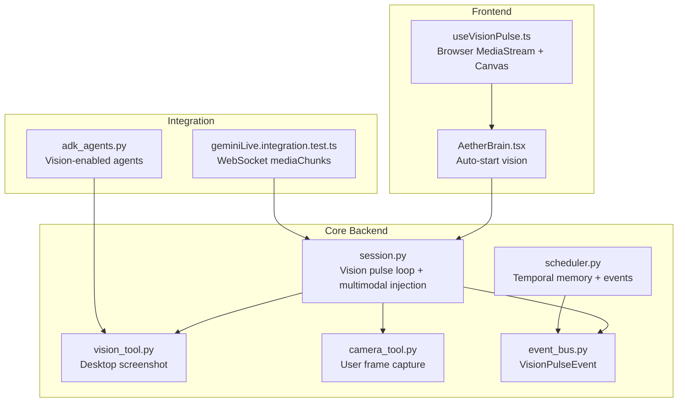
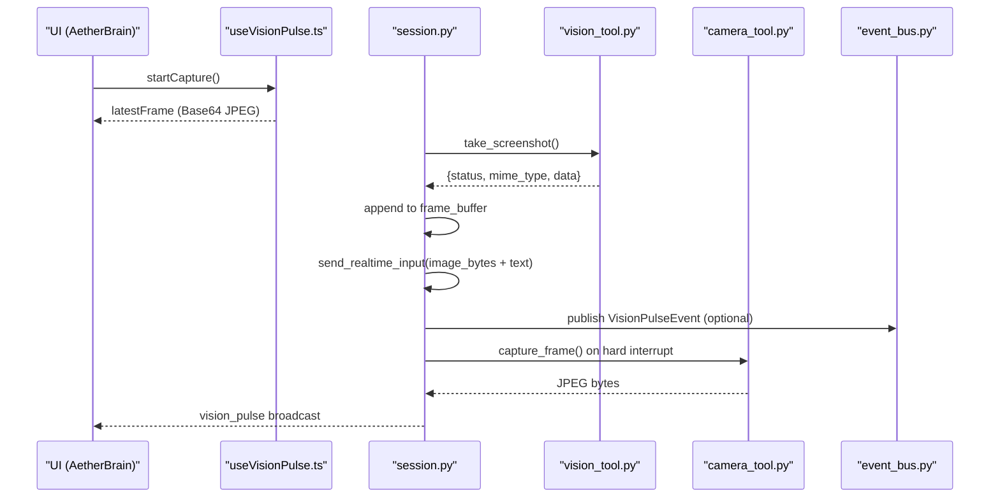
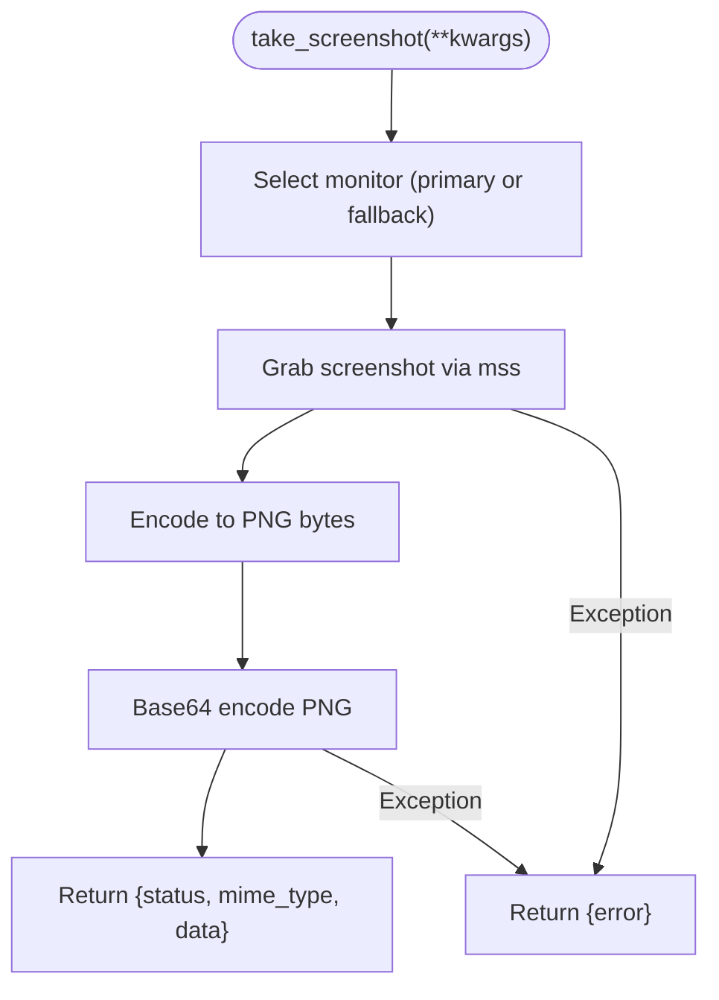
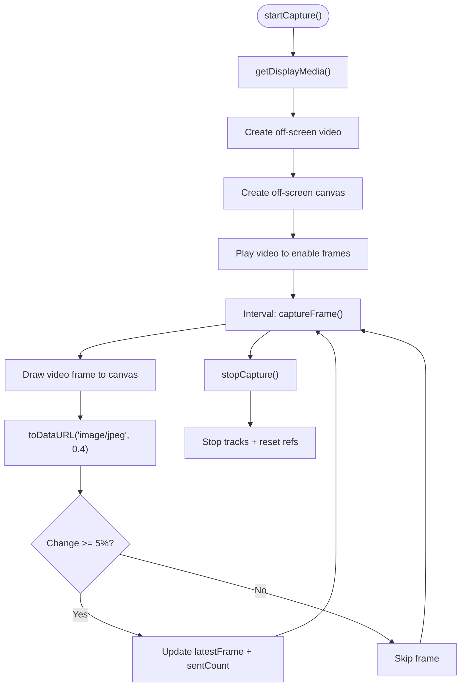
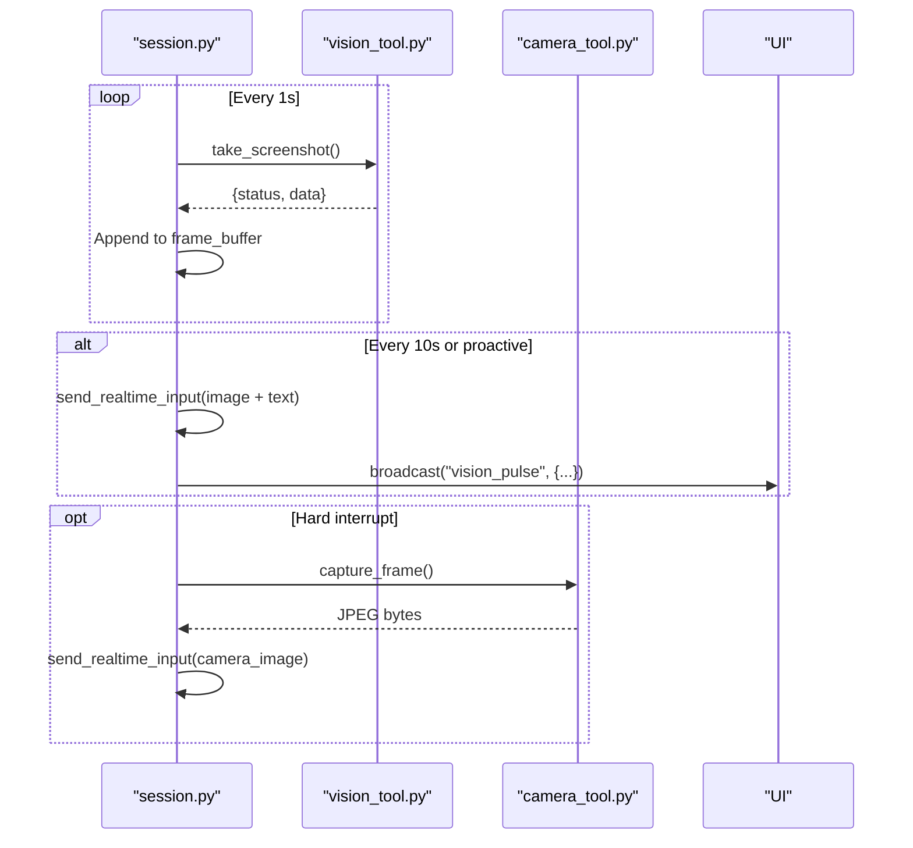
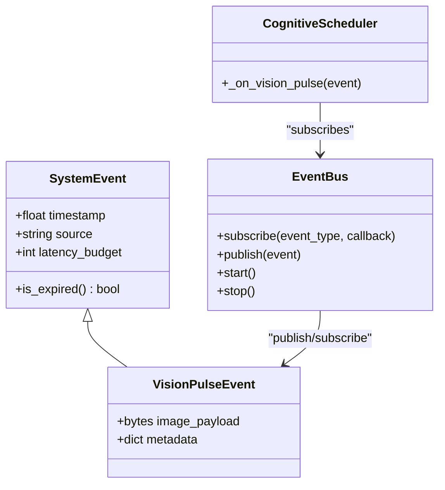
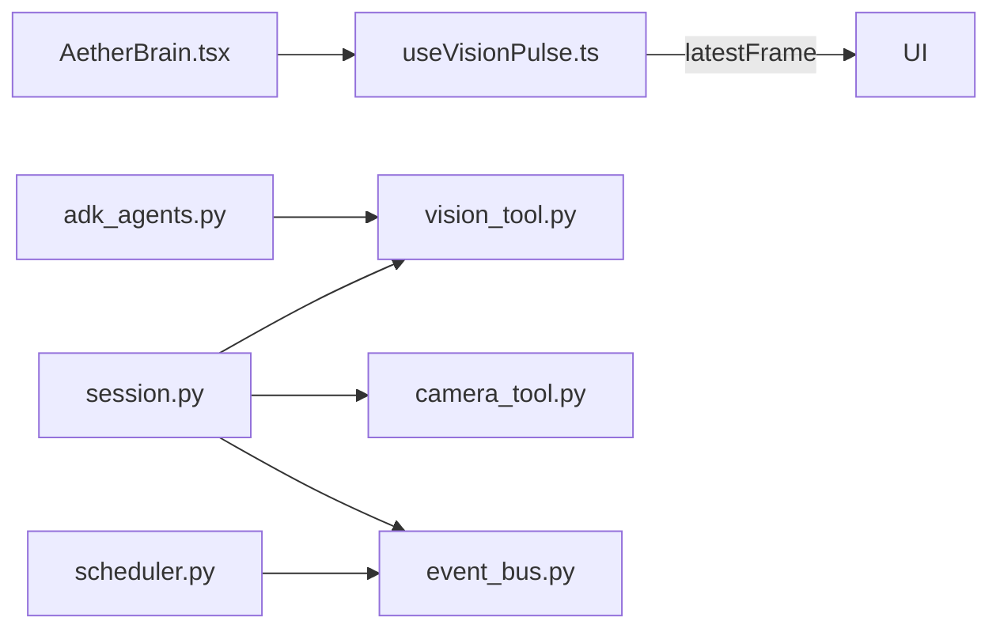

# Vision Tools

<cite>
**Referenced Files in This Document**
- [vision_tool.py](file://core/tools/vision_tool.py)
- [useVisionPulse.ts](file://apps/portal/src/hooks/useVisionPulse.ts)
- [session.py](file://core/ai/session.py)
- [camera_tool.py](file://core/tools/camera_tool.py)
- [scheduler.py](file://core/ai/scheduler.py)
- [event_bus.py](file://core/infra/event_bus.py)
- [adk_agents.py](file://core/ai/adk_agents.py)
- [geminiLive.integration.test.ts](file://apps/portal/src/__tests__/geminiLive.integration.test.ts)
- [AetherBrain.tsx](file://apps/portal/src/components/AetherBrain.tsx)
- [security.py](file://core/utils/security.py)
</cite>

## Table of Contents
1. [Introduction](#introduction)
2. [Project Structure](#project-structure)
3. [Core Components](#core-components)
4. [Architecture Overview](#architecture-overview)
5. [Detailed Component Analysis](#detailed-component-analysis)
6. [Dependency Analysis](#dependency-analysis)
7. [Performance Considerations](#performance-considerations)
8. [Troubleshooting Guide](#troubleshooting-guide)
9. [Privacy and Security](#privacy-and-security)
10. [Conclusion](#conclusion)
11. [Appendices](#appendices)

## Introduction
This document describes the vision tools in Aether Voice OS, focusing on:
- Image capture and processing for desktop and camera inputs
- Proactive and reactive vision pulses for context awareness
- Integration with multimodal sessions and UI telemetry
- Vision API interfaces, parameter validation, result processing, and error handling
- Examples, integration patterns, performance considerations, privacy, and troubleshooting

## Project Structure
Vision capabilities span three layers:
- Python backend tools for desktop capture and camera capture
- Frontend React hook for continuous screen capture with change detection
- Session orchestration for proactive pulses and multimodal injection
- Event bus for decoupled telemetry and temporal grounding
- ADK agent integration enabling vision-based tool usage

**Diagram sources**
- [useVisionPulse.ts](file://apps/portal/src/hooks/useVisionPulse.ts#L1-L226)
- [AetherBrain.tsx](file://apps/portal/src/components/AetherBrain.tsx#L63-L80)
- [session.py](file://core/ai/session.py#L265-L342)
- [vision_tool.py](file://core/tools/vision_tool.py#L19-L56)
- [camera_tool.py](file://core/tools/camera_tool.py#L20-L47)
- [scheduler.py](file://core/ai/scheduler.py#L33-L44)
- [event_bus.py](file://core/infra/event_bus.py#L58-L61)
- [adk_agents.py](file://core/ai/adk_agents.py#L26-L36)
- [geminiLive.integration.test.ts](file://apps/portal/src/__tests__/geminiLive.integration.test.ts#L230-L262)

**Section sources**
- [vision_tool.py](file://core/tools/vision_tool.py#L1-L75)
- [useVisionPulse.ts](file://apps/portal/src/hooks/useVisionPulse.ts#L1-L226)
- [session.py](file://core/ai/session.py#L265-L342)
- [camera_tool.py](file://core/tools/camera_tool.py#L1-L65)
- [scheduler.py](file://core/ai/scheduler.py#L1-L114)
- [event_bus.py](file://core/infra/event_bus.py#L1-L152)
- [adk_agents.py](file://core/ai/adk_agents.py#L1-L77)
- [geminiLive.integration.test.ts](file://apps/portal/src/__tests__/geminiLive.integration.test.ts#L230-L262)
- [AetherBrain.tsx](file://apps/portal/src/components/AetherBrain.tsx#L63-L80)

## Core Components
- Desktop screenshot tool: captures the primary monitor, encodes to PNG, returns Base64 for immediate multimodal injection.
- Browser-based vision pulse: continuously captures screen at 1 FPS, compresses to JPEG, applies change detection, and exposes latest frame.
- Session orchestration: runs a vision pulse loop, maintains a rolling frame buffer, and proactively injects images with temporal grounding.
- Camera tool: captures a single user frame for spatio-temporal grounding during hard interrupts.
- Event bus: defines VisionPulseEvent and routes proactive pulses to subscribers.
- ADK agents: register the vision tool as a function for agents to use.

**Section sources**
- [vision_tool.py](file://core/tools/vision_tool.py#L19-L75)
- [useVisionPulse.ts](file://apps/portal/src/hooks/useVisionPulse.ts#L1-L226)
- [session.py](file://core/ai/session.py#L265-L342)
- [camera_tool.py](file://core/tools/camera_tool.py#L20-L47)
- [event_bus.py](file://core/infra/event_bus.py#L58-L61)
- [adk_agents.py](file://core/ai/adk_agents.py#L26-L36)

## Architecture Overview
The vision pipeline integrates frontend capture, backend processing, and multimodal session injection.

**Diagram sources**
- [AetherBrain.tsx](file://apps/portal/src/components/AetherBrain.tsx#L63-L80)
- [useVisionPulse.ts](file://apps/portal/src/hooks/useVisionPulse.ts#L122-L174)
- [session.py](file://core/ai/session.py#L265-L342)
- [vision_tool.py](file://core/tools/vision_tool.py#L19-L56)
- [camera_tool.py](file://core/tools/camera_tool.py#L20-L47)
- [event_bus.py](file://core/infra/event_bus.py#L58-L61)

## Detailed Component Analysis

### Desktop Screenshot Tool
- Purpose: Provide instant PNG snapshots for multimodal context.
- Behavior:
  - Selects primary monitor if available; falls back to index 0.
  - Captures raw pixels, converts to PNG in-memory, encodes to Base64.
  - Returns structured result with status, MIME type, and data.
  - On error, returns an error object with details.
- Integration: Used by session pulse loop and ADK agents.

**Diagram sources**
- [vision_tool.py](file://core/tools/vision_tool.py#L19-L56)

**Section sources**
- [vision_tool.py](file://core/tools/vision_tool.py#L19-L75)

### Browser Vision Pulse Hook
- Purpose: Continuous low-latency screen capture with change detection.
- Behavior:
  - Uses getDisplayMedia with 1 FPS target.
  - Renders frames to an off-screen canvas and encodes to JPEG with quality 0.4.
  - Applies change detection using a size-delta threshold to reduce bandwidth.
  - Exposes state: isCapturing, latestFrame, frameCount, sentCount.
  - Cleans up streams, video element, and canvas on stop.
- Integration: UI auto-starts capture on connection; provides latestFrame for WebSocket injection.

**Diagram sources**
- [useVisionPulse.ts](file://apps/portal/src/hooks/useVisionPulse.ts#L122-L174)
- [useVisionPulse.ts](file://apps/portal/src/hooks/useVisionPulse.ts#L65-L117)
- [useVisionPulse.ts](file://apps/portal/src/hooks/useVisionPulse.ts#L179-L208)

**Section sources**
- [useVisionPulse.ts](file://apps/portal/src/hooks/useVisionPulse.ts#L1-L226)

### Session Vision Pulse Loop and Multimodal Injection
- Purpose: Maintain a rolling buffer of frames and proactively inject images with temporal grounding.
- Behavior:
  - Runs a loop that captures a screenshot every second, appends to a buffer, and optionally sends every 10 seconds.
  - Injects images into the live session with a text grounding part indicating elapsed time.
  - Broadcasts UI updates for explicit feedback.
  - On hard interrupts, captures a camera frame and injects it.
- Integration: Works with the event bus and UI telemetry.

**Diagram sources**
- [session.py](file://core/ai/session.py#L265-L342)
- [session.py](file://core/ai/session.py#L297-L321)
- [camera_tool.py](file://core/tools/camera_tool.py#L20-L47)

**Section sources**
- [session.py](file://core/ai/session.py#L265-L342)
- [session.py](file://core/ai/session.py#L297-L321)

### Camera Tool for Spatio-Temporal Grounding
- Purpose: Capture a single user frame to observe reactions during hard interrupts.
- Behavior:
  - Opens camera, reads a frame, closes camera.
  - Encodes to JPEG with moderate quality to balance latency and fidelity.
  - Returns JPEG bytes or None on failure.

**Section sources**
- [camera_tool.py](file://core/tools/camera_tool.py#L20-L47)

### Event Bus and Vision Pulse Events
- Purpose: Decouple proactive pulses and ground cognitive memory with temporal context.
- Behavior:
  - VisionPulseEvent carries optional image payload and metadata.
  - EventBus routes events to subscribers with tiered queues and expiration checks.
  - Scheduler stores recent vision pulses in temporal memory for grounding.

**Diagram sources**
- [event_bus.py](file://core/infra/event_bus.py#L15-L61)
- [event_bus.py](file://core/infra/event_bus.py#L69-L152)
- [scheduler.py](file://core/ai/scheduler.py#L33-L44)

**Section sources**
- [event_bus.py](file://core/infra/event_bus.py#L58-L61)
- [event_bus.py](file://core/infra/event_bus.py#L69-L152)
- [scheduler.py](file://core/ai/scheduler.py#L33-L44)

### ADK Agents Integration
- Purpose: Enable agents to use the vision tool as a function call.
- Behavior:
  - Architect and Root agents include the vision tool in their tool lists.
  - This allows multimodal reasoning with visual context when reviewing code or answering queries.

**Section sources**
- [adk_agents.py](file://core/ai/adk_agents.py#L26-L36)
- [adk_agents.py](file://core/ai/adk_agents.py#L71-L73)

### Vision API Interfaces and Result Processing
- Desktop screenshot API:
  - Input: kwargs (currently empty parameters).
  - Output: success object with status, mime_type, data (Base64), and message; or error object on failure.
  - Validation: minimal; returns structured error on exceptions.
- Browser JPEG pipeline:
  - Input: none (managed internally).
  - Output: latestFrame (Base64 JPEG without data URI prefix), plus counters.
  - Validation: checks readiness, dimensions, and delta threshold; skips unchanged frames.
- WebSocket injection (integration test):
  - Sends mediaChunks with mimeType image/jpeg and Base64 data.
  - Expects acceptance within a timeout window.

**Section sources**
- [vision_tool.py](file://core/tools/vision_tool.py#L19-L56)
- [useVisionPulse.ts](file://apps/portal/src/hooks/useVisionPulse.ts#L65-L117)
- [geminiLive.integration.test.ts](file://apps/portal/src/__tests__/geminiLive.integration.test.ts#L230-L262)

## Dependency Analysis
- Frontend-to-backend:
  - useVisionPulse.ts provides frames to the UI and can be wired into session injection.
  - AetherBrain.tsx auto-starts capture on connection.
- Backend orchestration:
  - session.py orchestrates periodic pulses, multimodal injection, and camera grounding.
  - vision_tool.py and camera_tool.py are the capture primitives.
- Event-driven grounding:
  - scheduler.py subscribes to VisionPulseEvent to maintain temporal memory.
  - event_bus.py enforces deadlines and tiers.

**Diagram sources**
- [useVisionPulse.ts](file://apps/portal/src/hooks/useVisionPulse.ts#L1-L226)
- [AetherBrain.tsx](file://apps/portal/src/components/AetherBrain.tsx#L63-L80)
- [session.py](file://core/ai/session.py#L265-L342)
- [vision_tool.py](file://core/tools/vision_tool.py#L19-L56)
- [camera_tool.py](file://core/tools/camera_tool.py#L20-L47)
- [scheduler.py](file://core/ai/scheduler.py#L33-L44)
- [event_bus.py](file://core/infra/event_bus.py#L69-L152)
- [adk_agents.py](file://core/ai/adk_agents.py#L26-L36)

**Section sources**
- [session.py](file://core/ai/session.py#L265-L342)
- [event_bus.py](file://core/infra/event_bus.py#L69-L152)
- [scheduler.py](file://core/ai/scheduler.py#L33-L44)
- [adk_agents.py](file://core/ai/adk_agents.py#L26-L36)

## Performance Considerations
- Latency targets:
  - Desktop capture uses an efficient library to minimize overhead.
  - Browser capture targets 1 FPS with JPEG compression and change detection to reduce payload.
- Compression and bandwidth:
  - JPEG quality tuned to ~20 KB per frame; scaling reduces CPU cost.
  - Change detection threshold avoids sending redundant frames.
- Throughput:
  - Rolling buffer and periodic proactive pulses balance context freshness and network load.
- Queue pressure:
  - Output queue overflow handling prevents backpressure from overwhelming playback.

[No sources needed since this section provides general guidance]

## Troubleshooting Guide
Common issues and remedies:
- Permission denied for screen capture:
  - The browser permission prompt must be accepted; otherwise capture fails and resources are cleaned up.
- Camera capture errors:
  - Device may be busy or unavailable; verify device access and permissions.
- Exceptions in desktop capture:
  - Errors are logged and returned as structured errors; inspect logs for details.
- WebSocket injection failures:
  - Ensure proper Base64 data and correct MIME type; verify session connectivity.

**Section sources**
- [useVisionPulse.ts](file://apps/portal/src/hooks/useVisionPulse.ts#L169-L173)
- [camera_tool.py](file://core/tools/camera_tool.py#L45-L47)
- [vision_tool.py](file://core/tools/vision_tool.py#L53-L55)
- [geminiLive.integration.test.ts](file://apps/portal/src/__tests__/geminiLive.integration.test.ts#L253-L258)

## Privacy and Security
- Data minimization:
  - Desktop capture is triggered on demand or at low cadence; browser pipeline skips unchanged frames.
- Local-first processing:
  - Frames are processed in-browser and optionally injected into the session; no persistent storage is implied by the referenced code.
- Signature utilities:
  - Security utilities support Ed25519 verification and key generation for identity-related operations; not directly used by vision tools but available for secure integrations.

**Section sources**
- [useVisionPulse.ts](file://apps/portal/src/hooks/useVisionPulse.ts#L1-L226)
- [security.py](file://core/utils/security.py#L18-L71)

## Conclusion
Aether’s vision tools combine efficient desktop capture, continuous browser-based screen pulses with change detection, and session-level multimodal injection. The event-driven architecture enables temporal grounding and proactive context awareness, while the ADK integration empowers agents to leverage visual context. Performance is optimized through targeted compression, throttling, and change detection, and the system provides robust error handling and UI telemetry.

[No sources needed since this section summarizes without analyzing specific files]

## Appendices

### Integration Patterns
- Proactive vision pulses:
  - Configure session to periodically capture and inject images with temporal grounding.
- Reactive camera pulses:
  - Capture user frames during hard interrupts to observe reactions.
- Browser-based streaming:
  - Use the hook to expose latest frames to the UI and integrate with WebSocket-based sessions.

**Section sources**
- [session.py](file://core/ai/session.py#L265-L342)
- [camera_tool.py](file://core/tools/camera_tool.py#L20-L47)
- [useVisionPulse.ts](file://apps/portal/src/hooks/useVisionPulse.ts#L1-L226)