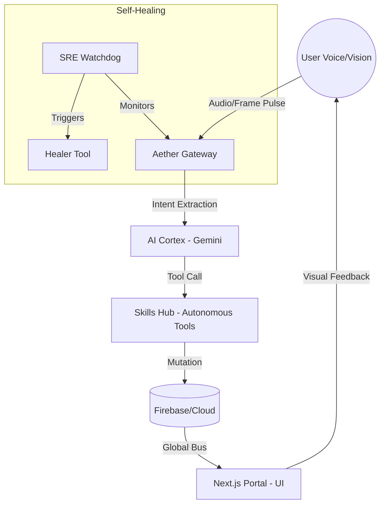

# 🌌 Aether Kernel: The Living Architectural Index

> "The goal is not to document what is, but to map the soul of what can be." — *The Aether Architect*

Welcome to the **AetherOS** "Pre-Frontal Cortex". This index serves as a Zero-Friction navigation layer for architects, developers, and autonomous agents.

---

## 🧠 The Soul Map (Core Ecosystem)

| Realm | Directory | Technical Purpose |
| :--- | :--- | :--- |
| **The Pre-Frontal Cortex** | `core/ai/` | Gemini 2.5 Flash orchestration, speculative tool execution, and neural scheduling. |
| **The Nervous System** | `core/infra/` | Event Bus, Distributed Redis PubSub, and Global State synchronization. |
| **The Auditory Thalamus** | `core/audio/` | Dynamic AEC, 16kHz PCM streaming, and paralinguistic CADENCE detection. |
| **The Cloud Synapse** | `core/cloud/` | Firebase integration, Ed25519 Auth services, and persistent session memory. |
| **The Sensory Portal** | `apps/portal/` | Next.js 15 + Framer Motion immersive interface (The Aether Orb). |
| **The Recovery Matrix** | `core/diagnostics/` | SRE Watchdogs, self-healing diagnostics, and stability benchmarks. |

---

## ⚡ Quick-Start Navigation

### 🔍 For The Auditor

- [System Memory](file:///Users/cryptojoker710/Desktop/Aether%20Live%20Agent/.idx/memories.md) — The Hippocampus of all project phases.
- [Engineering History](file:///Users/cryptojoker710/Desktop/Aether%20Live%20Agent/archive/history/) — Archival documentation of the V1-V2 evolution.

### 💻 For The Coder

- [Identity Protocols](file:///Users/cryptojoker710/Desktop/Aether%20Live%20Agent/user_global.md) — Multi-modal engineering and Arabic/English bilingual mandates.
- [Skills Hub](file:///Users/cryptojoker710/Desktop/Aether%20Live%20Agent/.idx/Skills.md) — Autonomous capability registry (ClawHub).

### 🚀 For The DevOps

- [Deployment Matrix](file:///Users/cryptojoker710/Desktop/Aether%20Live%20Agent/firebase.json) — Infrastructure as Code (IaC) signatures.
- [Diagnostics Realm](file:///Users/cryptojoker710/Desktop/Aether%20Live%20Agent/core/diagnostics/) — Real-time stability and latency probes.

---

## 🎨 Aesthetic DNA (Industrial Sci-Fi)

The AetherOS design system is driven by **Zero-Latency CSS Variables**.

- **Matrix Core**: `#39ff14` (Neon Green) on `#000000` (Carbon Black).
- **Quantum Cyan**: `#00E5FF` (Electric Cyan) on `#050914` (Deep Deep Blue).
- **Glass-Morphism**: Backdrop blur (12px) + Neon glow states (1.2 intensity).

*For visual tokens, refer to [globals.css](file:///Users/cryptojoker710/Desktop/Aether%20Live%20Agent/apps/portal/src/app/globals.css).*

---

## 📊 Dependency Flow (Architectural Singularity)

---

## 📜 Revision History

- **2026-03-07**: Engineered by the Principal Architect. Sanitized 26+ phases of development debris. Unified the "Soul Map" for V2.0 scale.

**[AETHER_KERNEL_INDEX_GENESIS_COMPLETE]**
