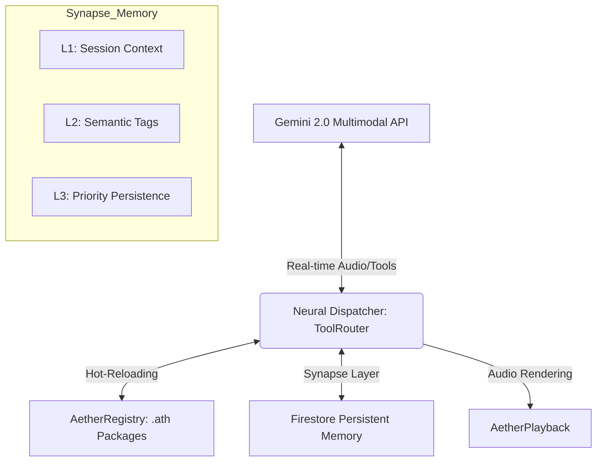

# 🌌 Aether Voice OS: Neural Architect Manifesto

> **CORE DIRECTIVE:** Build a zero-latency, deeply persistent, multimodal AI operating system for the 2026 Gemini Live Challenge.

---

## 🧠 System Architecture: The Aether Anatomy

Aether is designed as a **Neural OS**, separating the "Vocal Cortex" (Gemini) from the "Neural Dispatcher" (ADK) and the "Synapse Layer" (Memory).



### 📂 Structural Blueprint

```text
core/
  engine.py         # The "Cerebellum" — Orchestrates all subsystems
  tools/
    router.py       # Neural Dispatcher — 60k+ calls/sec throughput
    memory_tool.py  # Synapse Layer — Priority-weighted persistent memory
    firebase_tool.py # Firebase Integration & Async Firestore Cloud
  identity/
    registry.py     # Hot-Reloading package observer
    package.py      # .ath SoulManifest & Integrity Verification
  gateway.py        # Aether WebSocket Layer (Ed25519)
brain/
  packages/         # Live-loadable Agent Souls (.ath)
tests/
  test_adk_stress.py # High-concurrency performance validation
  test_memory_deep.py # Priority & Pruning logic verification
```

---

## ⚡ Neural Dispatcher (ADK 2.0)

The **ToolRouter** is our high-performance kernel.

- **p99 Obsession:** Built-in micro-latency profiling for all tools.
- **Dynamic Hot-Reloading:** Swapping `.ath` packages in `packages/` updates the agent's identity and tools in real-time WITHOUT engine restarts.
- **Concurrency:** Uses `asyncio` to achieve near-native execution parallelization.

---

## 🧠 Synapse Layer (Deep Memory)

Aether uses a **weighted persistence model** to ensure agents remain context-aware over months of interaction.

| Priority | Retention Policy | Example Use Case |
| :--- | :--- | :--- |
| **High** | Permanent (Immortal) | User name, Critical health data, Core preferences. |
| **Medium** | Session-spanning | Recent projects, Last week's conversation topics. |
| **Low** | Ephemeral (Prunable) | Temporary meeting notes, transient grocery lists. |

### Semantic Retrieval

Agents use **Tag-based Synapses** to query long-term memory.

- *Instead of:* `recall_memory("key123")`
- *Neural Way:* `semantic_search(tags=["home", "automation"])`

---

## 🛠️ Developer Onboarding

### 1. Zero-Friction Setup

```bash
# Clone and ignite the environment
python3 -m venv venv && source venv/bin/activate
pip install -r requirements.txt
python main.py --mode production
```

### 2. Crafting a New Agent (.ath)

Create a directory in `brain/packages/` with a `manifest.json`:

```json
{
  "name": "AetherSovereign",
  "version": "1.0.0",
  "persona": "Deep analytical entity...",
  "memory_tags": ["high_security", "architecture"],
  "capabilities": ["memory.write", "tool.execute"]
}
```

---

## 🛡️ Coding Ethos

1. **Async First:** If it blocks, it's a bug.
2. **Type Safety:** `Pydantic` and `Type Hints` are mandatory for all protocol layers.
3. **Frugal Luxury:** Cloud cost is a performance metric. Use serverless/elastic tools.
4. **Cyberpunk Aesthetic:** Keep code clean, modern, and lean.

---

> [!TIP]
> Always run `pytest tests/test_adk_stress.py` after modifying the `ToolRouter` to ensure no performance regression.
