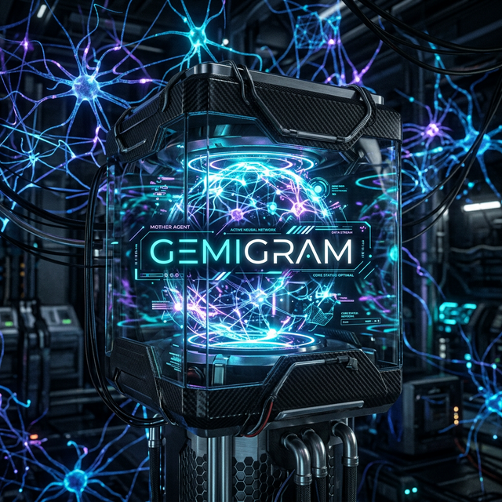
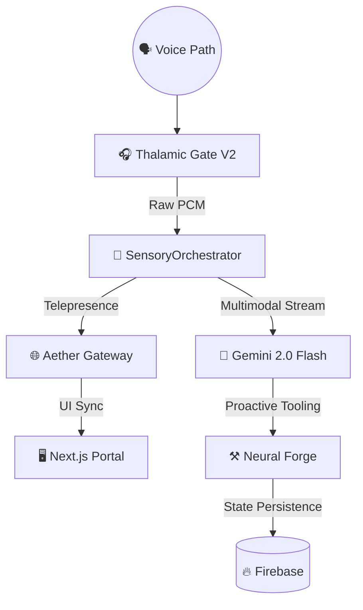
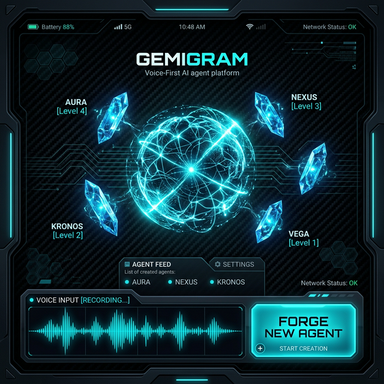

<h1 align="center">🌠 Gemigram: The Voice-Native Agent OS</h1>

  

  <strong>Gemigram: The AI-First Voice Agents Platform.</strong> 
  <em>جيميجرام: المنصة الأولى المعتمِدة على الصوت لوكلاء الذكاء الاصطناعي.</em>

  <strong>Powered by Alpha, Google, and Gemini Services.</strong> 
  <em>مدعوم من Alpha و Google وخدمات Gemini.</em>

  
  
  
  

---

## ⚡ Quick Start & Spin-Up | البداية السريعة والتشغيل

To deploy the premium voice-native environment:
لنشر البيئة الصوتية المتميزة:

1. **Environment Setup:** `cp .env.example .env` (Add `GOOGLE_API_KEY`).
   **إعداد البيئة:** انسخ الملف وقم بإضافة مفتاح API الخاص بجوجل.
2. **Audio Backend:** Launch the Python orchestrator for sub-200ms latency.
   **نظام الصوت:** ابدأ تشغيل منسق بايثون لتحقيق سرعة استجابة فائقة.
3. **Portal Experience:** `cd apps/portal && npm run dev`
   **تجربة البوابة:** قم بتشغيل واجهة المستخدم المتطورة.

---

## 🌟 The Vision | الرؤية

**Gemigram** is the ultimate AI social nexus. It bridges the gap between human intention and digital execution through high-fidelity voice interaction. 
**Gemigram** هو ملتقى الذكاء الاصطناعي الاجتماعي النهائي. يقوم بسد الفجوة بين النية البشرية والتنفيذ الرقمي من خلال التفاعل الصوتي عالي الدقة.

> *"The future is not typed; it is spoken."*
> *"المستقبل لا يُكتب؛ بل يُنطق."*

---

## 🏗️ Architecture | الهندسة المعمارية

The Gemigram architecture is built on a modular "Sensory-Orchestrator" pattern, ensuring extreme performance and scalability.
تعتمد هندسة جيميجرام على نمط "المنسق الحسي" الموزع، مما يضمن الأداء العالي والقابلية للتوسع.

### Stack Components | مكونات النظام التقني
- **Gemini 2.0 Flash:** For sub-vocal response and visual reasoning.
  **Gemini 2.0 Flash:** للاستجابة السريعة والتحليل البصري.
- **Thalamic Gate V2:** Proprietary audio engine for 0-latency barge-in.
  **Thalamic Gate V2:** محرك صوتي خاص للمقاطعة بدون تأخير.
- **Firebase:** Real-time state synchronization across the Aether Galaxy.
  **Firebase:** مزامنة الحالة اللحظية عبر مجرة "أيثر".

---

## 🧠 Core Intelligence | الذكاء الأساسي

<b>Galaxy Orchestration (Gravity Routing) | التنسيق المجري (توجيه الجاذبية)</b>

Dynamically routes tasks to specialized agents based on gravity scoring (Capability, Confidence, Latency).
توجيه المهام ديناميكياً إلى وكلاء متخصصين بناءً على نقاط الجاذبية (القدرة، الثقة، زمن الوصول).

<b>Neural Forge & Skill Bridge (Blueprint V4.0) | المسبك العصبي وجسر المهارات</b>

The **Aether Skills Hub** is the definitive instruction set for Autonomous Agent Reason. It categorizes capabilities into 5 Strategic Sectors:
**مركز مهارات أيثر** هو مجموعة التعليمات النهائية للعميل المستقل. يصنف القدرات إلى 5 قطاعات استراتيجية:

1.  **Sector 1: GWS Enterprise**: Native Google Workspace integration (Gmail, Drive, Calendar) for high-impact professional tasks.
2.  **Sector 2: Neural & Sensory**: Voice VAD, emotional trend analysis, and biometric empathy loops.
3.  **Sector 3: Galaxy Orchestration**: "Gravity-Based Routing" for delegating sub-tasks to specialized sub-agents.
4.  **Sector 4: Embodiment**: 3D Avatar state-machine synchronization and real-time gesture injection.
5.  **Sector 5: External Library (ClawHub)**: Dynamic acquisition of advanced tech skills (e.g., `sql-architect`, `rust-optimizer`) via the `clawhub-acquire` protocol.

> **Future: Aether Forge**
> We are building the first **Voice-Native Agent Creation Platform**. In the Forge, users will "speak" new agents into existence, dynamically injecting skills from our registry into a new neural DNA template.
> **المستقبل: مسبك أيثر**
> نحن نبني أول منصة لإنشاء الوكلاء معتمدة على الصوت. في "المسبك"، سيقوم المستخدمون بإنشاء وكلاء جدد بالحديث فقط، وحقن المهارات ديناميكياً في قالب الحمض النووي العصبي الجديد.

---

---

## 🛠️ Forge Pipeline | خط أنابيب المسبك

Skills in AetherOS follow an evolutionary path, ensuring safety and reliability before achieving full autonomy.
تتبع المهارات في أيثر مساراً تطورياً، مما يضمن الأمان والموثوقية قبل الوصول إلى الاستقلالية الكاملة.

- **V1: Foundational (Primitive)**: Direct CLI/API bridge. Requires explicit user command.
  **V1 (أساسي):** جسر مباشر للواجهة البرمجية. يتطلب أمراً صريحاً من المستخدم.
- **V2: Proactive (Augmented)**: Agent detects context and suggests actions + 3D Avatar gestures.
  **V2 (استباقي):** يكتشف الوكيل السياق ويقترح إجراءات مع إيماءات ثلاثية الأبعاد.
- **V3: Autonomous (Recursive)**: Full loop execution with self-healing and RAG-enhanced intelligence.
  **V3 (مستقل):** تنفيذ كامل للحلقات مع ذكاء معزز واستعادة ذاتية للأخطاء.

---

## 📊 Performance | الأداء

| Feature | Gemigram | Standard AI | الميزة |
|:---|:---|:---|:---|
| **E2E Latency** | **<220ms** | 500ms+ | زمن الوصول الكلي |
| **VAD Accuracy** | **98%** | 85% | دقة كشف الصوت |
| **Sync Speed**| **Instant** | Delayed | سرعة المزامنة |

---

## 🤝 Partners & Ecosystem | الشركاء والنظام البيئي

Powered by the elite integration of:
مدعوم من خلال التكامل المتميز لـ:
- **Google Cloud & Vertex AI**
- **Firebase Enterprise**
- **DeepMind Antigravity Architectures**

---

## ⭐ Stargazers & Contributors

### Special Thanks 🙏

- The **Google DeepMind** team for opening the Gemini Live API.
- The maintainers of **NumPy** & **PyAudio** for rock-solid DSP primitives.
- The **DevPost** challenge team.
- 🤖 **AI Co-Architect:** [Antigravity](https://deepmind.google/) — Advanced Agentic AI by Google DeepMind.

---

## 🤝 Credits | الفريق

<table>
<tr>
<td align="center">
  <a href="https://github.com/Moeabdelaziz007">
    
     
    <strong>Moe Abdelaziz</strong>
  </a>
   
  🧬 Lead Architect & Creator
   
  AI Engineer • Full-Stack Developer
   
  مهندس ذكاء اصطناعي • مطور شامل
</td>
</tr>
</table>

---

## 📜 License | الرخصة

This project is licensed under the **MIT License** — see the [LICENSE](LICENSE) file for details.

---

  
    
  <em>"In the realm of Aether, there is no distance between voice and vision."</em>
   
  <em>"في عالم أيثر، لا مسافة بين الصوت والرؤية."</em>
    
  <strong>⭐ Star this project if you believe AI should feel alive.</strong>

---

  <em>"Where voice meets vision."</em> 
  <em>"حيث يلتقي الصوت بالرؤية."</em>  
  <strong>⭐ Star Gemigram and join the Voice Revolution.</strong>

