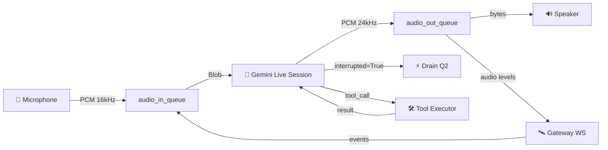

<p align="center">
  
</p>

<p align="center">
  
</p>

<h1 align="center">🌌 Aether Voice OS</h1>

<p align="center">
  <strong>The Neural Interface Between Thought and Action</strong><br/>
  <em>واجهة عصبية بين الفكر والتنفيذ</em>
</p>

<p align="center">
  <a href="https://geminiliveagentchallenge.devpost.com"></a>
  <a href="#"></a>
  <a href="#"></a>
  <a href="#"></a>
  <a href="#"></a>
</p>

<p align="center">
  <a href="#-the-vision--الرؤية">Vision</a> •
  <a href="#-architecture--الهندسة-المعمارية">Architecture</a> •
  <a href="#-core-modules--الوحدات-الأساسية">Modules</a> •
  <a href="#-getting-started--البداية">Start</a> •
  <a href="#-the-ath-package-system--نظام-الحزم">Packages</a> •
  <a href="#-credits--الفريق">Credits</a>
</p>

---

## 🌟 The Vision | الرؤية

> *"The ultimate interface is no interface at all. Aether is the pure upper air that the gods breathe — the invisible medium between intention and execution."*
>
> *"الواجهة المثالية هي اللاواجهة. أيثر هو الهواء النقي الذي يتنفسه الآلهة — الوسيط الخفي بين النية والتنفيذ."*

**Aether Voice OS** is not just another voice assistant — it's a **Voice Operating System** engineered from first principles for the [Gemini Live Agent Challenge 2026](https://geminiliveagentchallenge.devpost.com). It merges:

- ⚡ **Gemini 2.5 Flash Native Audio** for sub-200ms real-time voice streaming
- 🧠 **Google ADK** for multi-agent orchestration and reasoning
- 🔐 **OpenClaw Gateway** for secure, sandboxed tool execution
- 🔥 **Firebase** for persistent memory and serverless infrastructure

The result? An AI that doesn't just *respond* — it **executes**, **remembers**, and **evolves**.

**Aether Voice OS** ليس مجرد مساعد صوتي آخر — إنه **نظام تشغيل صوتي** تم هندسته من المبادئ الأولى لتحدي Gemini Live Agent 2026. يجمع بين:

- ⚡ **Gemini 2.5 Flash Native Audio** للبث الصوتي في الوقت الحقيقي بأقل من 200 مللي ثانية
- 🧠 **Google ADK** لتنسيق الوكلاء المتعددين والاستدلال
- 🔐 **OpenClaw Gateway** لتنفيذ الأدوات بشكل آمن ومعزول
- 🔥 **Firebase** للذاكرة المستمرة والبنية التحتية بدون خوادم

---

## 🏗️ Architecture | الهندسة المعمارية

Aether is built on a **Pipeline Architecture** — each stage is an independent async task communicating via `asyncio.Queue`. This design naturally handles backpressure, makes interruption trivial (drain the queue), and enables composable testing.

تم بناء أيثر على **معمارية الأنابيب** — كل مرحلة هي مهمة غير متزامنة مستقلة تتواصل عبر `asyncio.Queue`.



### System Layers | طبقات النظام

```
┌──────────────────────────────────────────────────┐
│                  AetherEngine                     │
│          (Lifecycle + TaskGroup Owner)            │
├──────────┬───────────┬───────────┬───────────────┤
│ Capture  │  Gemini   │  Playback │   Gateway     │
│  Task    │   Task    │   Task    │    Task       │
├──────────┼───────────┼───────────┼───────────────┤
│  mic →   │  send →   │  recv →   │  ws clients   │
│  Queue   │  session  │  Queue    │  events       │
└──────────┴───────────┴───────────┴───────────────┘
```

---

## 🧩 Core Modules | الوحدات الأساسية

| Layer | Module | Lines | Purpose |
|:---:|:---|:---:|:---|
| 🏛️ | `core/config.py` | 103 | Pydantic Settings & environment config |
| 🏛️ | `core/errors.py` | 88 | Exception hierarchy & error handling |
| 🎤 | `core/audio/capture.py` | 128 | Mic → `audio_in_queue` (PyAudio wrapper) |
| 🔊 | `core/audio/playback.py` | 113 | `audio_out_queue` → Speaker output |
| 🔬 | `core/audio/processing.py` | 169 | Ring buffer, zero-crossing, VAD |
| 🧠 | `core/ai/session.py` | 220 | Gemini Live session (send + receive loops) |
| 🛰️ | `core/transport/gateway.py` | 271 | WebSocket server + Ed25519 authentication |
| 📦 | `core/identity/package.py` | 137 | `.ath` package model & verification |
| 📦 | `core/identity/registry.py` | 87 | Package loader & hot-swap system |
| ⚙️ | `core/engine.py` | 177 | Main orchestrator (TaskGroup + Queues) |

> **📊 Total: 24 Python files • 2,279 lines of production code • 30/30 tests passing ✅**

---

## 🛠️ Tech Stack | المجموعة التقنية

<table>
<tr>
<td align="center"><strong>🧠 AI Brain</strong></td>
<td align="center"><strong>☁️ Cloud</strong></td>
<td align="center"><strong>🎨 Frontend</strong></td>
<td align="center"><strong>🔐 Security</strong></td>
</tr>
<tr>
<td>Gemini 2.5 Flash<br/>Native Audio API<br/>Google ADK Python</td>
<td>Firebase Firestore<br/>Cloud Functions<br/>Firebase AI Logic</td>
<td>Next.js 15<br/>Framer Motion<br/>Canvas Visualizer</td>
<td>Ed25519 Signing<br/>Capability RBAC<br/>Sandbox Isolation</td>
</tr>
</table>

---

## 🚀 Getting Started | البداية

### Prerequisites | المتطلبات

- Python 3.11+
- Node.js 20+
- A [Gemini API Key](https://aistudio.google.com/apikey)

### 1. Clone & Install | الاستنساخ والتثبيت

```bash
# Clone the repository
git clone https://github.com/Moeabdelaziz007/Aether-Voice-OS.git
cd Aether-Voice-OS

# Backend
python -m venv venv && source venv/bin/activate
pip install -r requirements.txt

# Frontend
cd apps/web && npm install && cd ../..
```

### 2. Configure | الإعداد

```bash
# Create .env in project root
cat > .env << EOF
GOOGLE_API_KEY="your_gemini_api_key"
AETHER_MODEL="gemini-2.5-flash-preview-native-audio"
AETHER_GATEWAY_PORT=18789
EOF
```

### 3. Launch | الإطلاق

```bash
# Start the Aether Engine (Backend)
python -m core.engine

# In another terminal — Start the Cyberpunk Dashboard
cd apps/web && npm run dev
```

---

## 📦 The `.ath` Package System | نظام الحزم

Aether introduces the **`.ath` (Aether Pack)** — a portable, signed identity package for AI agents.

| File | Purpose | الغرض |
|:---|:---|:---|
| `Soul.md` | Behavioral identity & core values | الهوية السلوكية والقيم الأساسية |
| `Skills.md` | Procedural tool knowledge | المعرفة الإجرائية للأدوات |
| `Heartbeat.md` | Autonomous background routines | الروتينات الخلفية المستقلة |
| `manifest.json` | Metadata, capabilities, version | البيانات الوصفية، القدرات، الإصدار |

```python
from core.identity import PackageRegistry

registry = PackageRegistry()
agent = registry.get("AetherCore")
print(f"Awakening {agent.manifest.name} v{agent.manifest.version}...")
# → Awakening AetherCore v1.0.0...
```

---

## 🔐 Gateway Protocol | بروتوكول البوابة

Aether uses a **3-step secure handshake** based on Ed25519 cryptographic signing:

```
Client                              Gateway
  │                                    │
  │◄──── connect.challenge ────────────│  (UUID + tickIntervalMs)
  │                                    │
  │───── connect.response ────────────►│  (signed challenge)
  │                                    │
  │◄──── connect.ack ─────────────────│  (permissions + caps)
  │                                    │
  │◄──── tick (every 15s) ────────────│  (heartbeat)
```

---

## 📊 Project Status | حالة المشروع

```
✅ Phase 1: Research & Architecture ···················· COMPLETE
✅ Phase 2: Core Infrastructure (Prototype) ············ COMPLETE
🟢 Phase 3: Cyberpunk UI & Visualizer ················· IN PROGRESS
✅ Phase 4: Expert Documentation & CI/CD ··············· COMPLETE
✅ Phase 5: Production-Grade Core Rewrite ·············· COMPLETE (30/30 tests)
⬜ Phase 6: Firebase Integration & Deployment ·········· QUEUED
```

---

## 🤝 Credits | الفريق

<table>
<tr>
<td align="center">
  <a href="https://github.com/Moeabdelaziz007">
    
    <br />
    <sub><strong>Moe Abdelaziz</strong></sub>
  </a>
  <br />
  <sub>🧬 Lead Architect & Creator</sub>
  <br />
  <sub>AI Engineer • Full-Stack Developer</sub>
  <br />
  <sub>مهندس ذكاء اصطناعي • مطور شامل</sub>
</td>
</tr>
</table>

> 🤖 **AI Co-Architect:** [Antigravity](https://deepmind.google/) — Advanced Agentic AI by Google DeepMind

---

## 📜 License | الرخصة

This project is licensed under the **Apache 2.0 License** — see the [LICENSE](LICENSE) file for details.

---

<p align="center">
  
  <br /><br />
  <em>"In the realm of Aether, there is no distance between voice and vision."</em>
  <br />
  <em>"في عالم أيثر، لا مسافة بين الصوت والرؤية."</em>
  <br /><br />
  <strong>⭐ Star this project if you believe AI should feel alive.</strong>
</p>
