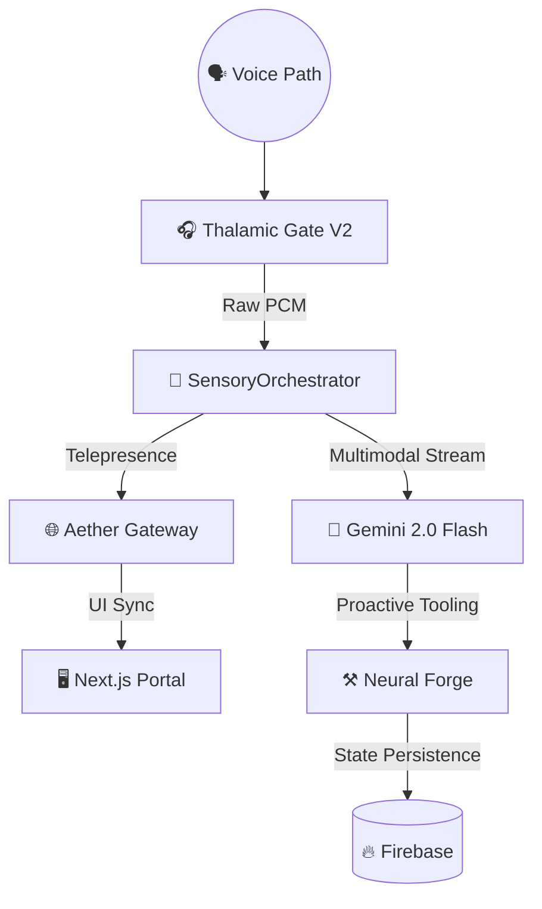

<h1 align="center">🌠 Gemigram: The Voice-Native Agent OS</h1>

  

  <strong>Gemigram: The AI-First Voice Agents Platform.</strong> 
  <em>جيميجرام: المنصة الأولى المعتمِدة على الصوت لوكلاء الذكاء الاصطناعي.</em>

  <strong>Powered by Alpha, Google, and Gemini Services.</strong> 
  <em>مدعوم من Alpha و Google وخدمات Gemini.</em>

  
  
  
  

---

## ⚡ Quick Start & Spin-Up | البداية السريعة والتشغيل

To deploy the premium voice-native environment:
لنشر البيئة الصوتية المتميزة:

1. **Environment Setup:** `cp .env.example .env` (Add `GOOGLE_API_KEY`).
   **إعداد البيئة:** انسخ الملف وقم بإضافة مفتاح API الخاص بجوجل.
2. **Audio Backend:** Launch the Python orchestrator for sub-200ms latency.
   **نظام الصوت:** ابدأ تشغيل منسق بايثون لتحقيق سرعة استجابة فائقة.
3. **Portal Experience:** `cd apps/portal && npm run dev`
   **تجربة البوابة:** قم بتشغيل واجهة المستخدم المتطورة.

---

## 🌟 The Vision | الرؤية

**Gemigram** is the ultimate AI social nexus. It bridges the gap between human intention and digital execution through high-fidelity voice interaction. 
**Gemigram** هو ملتقى الذكاء الاصطناعي الاجتماعي النهائي. يقوم بسد الفجوة بين النية البشرية والتنفيذ الرقمي من خلال التفاعل الصوتي عالي الدقة.

> *"The future is not typed; it is spoken."*
> *"المستقبل لا يُكتب؛ بل يُنطق."*

---

## 🏗️ Architecture | الهندسة المعمارية

The Gemigram architecture is built on a modular "Sensory-Orchestrator" pattern, ensuring extreme performance and scalability.
تعتمد هندسة جيميجرام على نمط "المنسق الحسي" الموزع، مما يضمن الأداء العالي والقابلية للتوسع.

### Stack Components | مكونات النظام التقني
- **Gemini 2.0 Flash:** For sub-vocal response and visual reasoning.
  **Gemini 2.0 Flash:** للاستجابة السريعة والتحليل البصري.
- **Thalamic Gate V2:** Proprietary audio engine for 0-latency barge-in.
  **Thalamic Gate V2:** محرك صوتي خاص للمقاطعة بدون تأخير.
- **Firebase:** Real-time state synchronization across the Aether Galaxy.
  **Firebase:** مزامنة الحالة اللحظية عبر مجرة "أيثر".

---

## 🧠 Core Intelligence | الذكاء الأساسي

<b>Galaxy Orchestration (Gravity Routing) | التنسيق المجري (توجيه الجاذبية)</b>

Dynamically routes tasks to specialized agents based on gravity scoring (Capability, Confidence, Latency).
توجيه المهام ديناميكياً إلى وكلاء متخصصين بناءً على نقاط الجاذبية (القدرة، الثقة، زمن الوصول).

<b>Neural Forge & Skill Bridge | المسبك العصبي وجسر المهارات</b>

Enables autonomous skill acquisition via **ClawHub** and real-time tool orchestration with **Google Workspace**.
يتيح اكتساب المهارات ذاتياً عبر **ClawHub** وتنسيق الأدوات في الوقت الفعلي مع **Google Workspace**.

---

## 📊 Performance | الأداء

| Feature | Gemigram | Standard AI | الميزة |
|:---|:---|:---|:---|
| **E2E Latency** | **<220ms** | 500ms+ | زمن الوصول الكلي |
| **VAD Accuracy** | **98%** | 85% | دقة كشف الصوت |
| **Sync Speed**| **Instant** | Delayed | سرعة المزامنة |

---

## 🤝 Partners & Ecosystem | الشركاء والنظام البيئي

Powered by the elite integration of:
مدعوم من خلال التكامل المتميز لـ:
- **Google Cloud & Vertex AI**
- **Firebase Enterprise**
- **DeepMind Antigravity Architectures**

---

  <em>"Where voice meets vision."</em> 
  <em>"حيث يلتقي الصوت بالرؤية."</em>  
  <strong>⭐ Star Gemigram and join the Voice Revolution.</strong>

