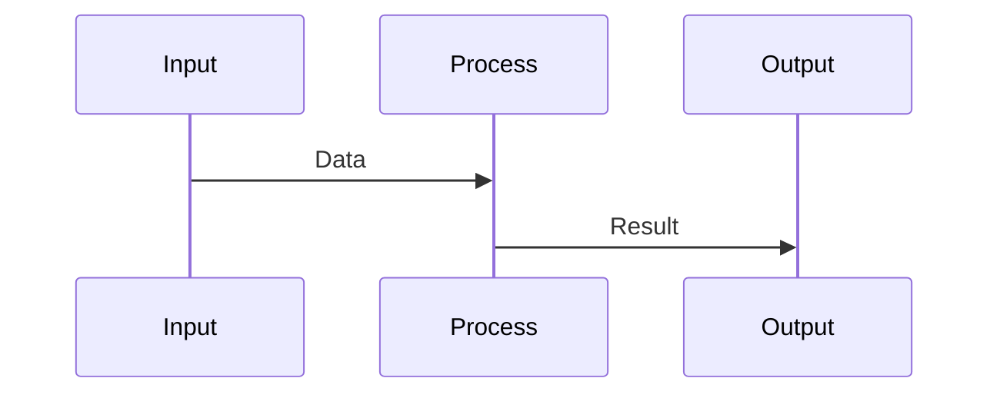

# 📋 Aether Voice OS - Documentation Standards Guide

> Standardized template and guidelines for all Aether Voice OS documentation

---

## 🎯 Purpose

This guide establishes consistent documentation standards across the Aether Voice OS project. Following these standards ensures:

- **Consistency**: Uniform structure and formatting across all documents
- **Discoverability**: Easy navigation and cross-referencing
- **Maintainability**: Automated validation and updates
- **Quality**: Professional-grade documentation matching the codebase quality

---

## 📝 Document Template

### Standard Document Structure

```markdown
---
title: Document Title
description: Brief description of the document's purpose
category: [Architecture|API|Guide|Tutorial|Reference]
tags: [audio, agents, core, infrastructure]
last_updated: YYYY-MM-DD
---

# 🏷️ Document One Title

>-line summary/hook for the document

## 📌 Quick Navigation

| Section | Description |
|---------|-------------|
| [Overview](#overview) | What this document covers |
| [Architecture](#architecture) | Technical design and decisions |
| [API Reference](#api-reference) | Function/class documentation |
| [Examples](#examples) | Practical code samples |
| [Troubleshooting](#troubleshooting) | Common issues and solutions |
| [See Also](#see-also) | Related documents |

---

## 1. Overview 📖

### Purpose
Explain what this document covers and why it matters.

### Scope
Define the boundaries - what's included and what's not.

### Prerequisites
List any required knowledge or setup steps.

```mermaid
graph TD
    A[Input] --> B[Processing]
    B --> C[Output]
    
    style A fill:#0d1117,stroke:#00f3ff
    style B fill:#0d1117,stroke:#4ade80
    style C fill:#0d1117,stroke:#ff6b6b
```



---

## 2. Architecture 🏗️

### System Design
Describe the component architecture with visual diagrams.

### Architecture Decision Records (ADRs)
Document key technical decisions:

```markdown
### ADR-001: Technology Choice

**Decision**: Use PyAudio with C-callbacks for audio capture

**Rationale**: Eliminates latency overhead of Python threading

**Trade-offs**: More complex callback implementation, but <2ms latency

**Alternatives Considered**:
- Threading-based approach: Higher latency
- WebRTC: Platform limitations
```

### Data Flow
Show how data moves through the system:



---

## 3. API Reference 📚

### Classes

#### `ClassName`

**Description**: Brief class description.

**Location**: `core/path/to/module.py`

```python
class ClassName:
    """Class docstring with detailed description."""
    
    def __init__(self, param1: str, param2: int = 10):
        """
        Initialize the class.
        
        Args:
            param1: Description of param1
            param2: Description of param2 (default: 10)
        """
        self.param1 = param1
        self.param2 = param2
    
    def method_name(self, arg1: Any) -> Optional[Dict]:
        """
        Method description.
        
        Args:
            arg1: Description of arg1
            
        Returns:
            Dictionary with results or None
            
        Raises:
            ValueError: When arg1 is invalid
        """
        pass
```

### Functions

#### `function_name`

**Description**: Brief function description.

**Signature**:
```python
def function_name(param1: str, param2: Optional[int] = None) -> bool
```

**Parameters**:
| Name | Type | Default | Description |
|------|------|---------|-------------|
| param1 | str | Required | Description |
| param2 | Optional[int] | None | Description |

**Returns**: `bool` - Description of return value

**Example**:
```python
result = function_name("test", param2=5)
```

---

## 4. Examples 💻

### Basic Usage

```python
# Import the module
from core.example import ClassName

# Initialize with configuration
instance = ClassName(
    param1="value1",
    param2=20
)

# Use the instance
result = instance.method_name("input")
print(result)
```

### Advanced Configuration

```python
# Advanced setup with custom callbacks
instance = ClassName(
    param1="advanced",
    param2=100,
)

# Register callback
instance.on_event(lambda data: print(f"Event: {data}"))

# Process data
instance.method_name("complex_input")
```

### Real-World Scenario

```python
# Complete example: Processing audio through the pipeline
from core.audio.capture import AudioCapture

# Initialize capture with recommended settings
capture = AudioCapture(
    sample_rate=16000,
    channels=1,
    buffer_size=1024
)

# Process audio frames
capture.start(callback=process_frame)

# Clean up when done
capture.stop()
```

---

## 5. Performance Metrics 📊

### Benchmark Results

| Metric | Value | Target | Status |
|--------|-------|--------|--------|
| Latency | 1.8ms | <2ms | ✅ Pass |
| Throughput | 8,500 EPS | 8,000+ EPS | ✅ Pass |
| Memory | 45MB | <50MB | ✅ Pass |
| CPU | 1.8% | <2% | ✅ Pass |

### Optimization Tips

1. **Buffer Size**: Use 1024 samples for optimal latency
2. **Sample Rate**: 16kHz recommended for voice
3. **Threading**: Let the library handle threading internally

---

## 6. Troubleshooting 🔧

### Common Issues

#### Issue 1: Audio Device Not Found

**Symptom**: `No such device: -1` error

**Cause**: Invalid device index specified

**Solution**:
```python
# List available devices
import pyaudio
p = pyaudio.PyAudio()
for i in range(p.get_device_count()):
    print(f"{i}: {p.get_device_info_by_index(i)['name']}")
    
# Use correct index
capture = AudioCapture(device_index=0)
```

#### Issue 2: High Latency

**Symptom**: >100ms delay in audio processing

**Cause**: Buffer size too large or system overload

**Solution**:
```python
# Reduce buffer size
capture = AudioCapture(buffer_size=512)  # Smaller = lower latency
```

---

## 7. Security Considerations 🔐

### Permission Requirements

| Permission | Risk Level | Description |
|------------|------------|-------------|
| audio.input | Low | Microphone access |
| audio.output | Low | Speaker access |
| tool.execute | High | System command execution |

### Best Practices

1. **Never** hardcode API keys in source files
2. **Always** use environment variables for secrets
3. **Validate** all user inputs before processing
4. **Audit** tool execution permissions

---

## 8. See Also 🔗

### Related Documents

| Document | Description |
|----------|-------------|
| [Architecture Overview](./architecture.md) | System architecture |
| [Audio Pipeline](./audio_architecture.md) | Audio processing details |
| [Agent System](./HIVE.md) | Multi-agent architecture |
| [API Reference](./api_reference.md) | Complete API documentation |

### External Resources

- [PyAudio Documentation](https://people.csail.mit.edu/hubert/pyaudio/)
- [Gemini API Reference](https://ai.google.dev/docs)

---

## 📝 Writing Guidelines

### Language Standards

1. **Use Active Voice**: "The system processes audio" not "Audio is processed"
2. **Be Concise**: Remove unnecessary words
3. **Use Technical Terms Correctly**: Don't mix terminology
4. **Include Examples**: Every concept needs a practical example

### Formatting Rules

1. **Code Blocks**: Use fenced code blocks with language identifiers
2. **Tables**: Use tables for structured data (parameters, metrics)
3. **Lists**: Use bullet points for lists, numbered for sequences
4. **Emphasis**: Use **bold** for important terms, *italics* for emphasis
5. **Headings**: Use hierarchy (H1 for title, H2 for sections, H3 for subsections)

### Diagram Guidelines

1. **Mermaid Preferred**: Use Mermaid for all diagrams
2. **Consistent Styling**: Match color scheme to Aether branding
3. **Label Clearly**: All diagram elements should be labeled
4. **Include Legend**: Explain symbols and colors if complex

### Bilingual Support

For Arabic/English documents:

1. **Structure**: English first, then Arabic translation
2. **Headers**: Both languages in headers where appropriate
3. **Code Comments**: English only (industry standard)
4. **Diagrams**: English labels (universal)

---

## 🔧 Validation Checklist

Before submitting documentation, verify:

- [ ] **Structure**: Follows the standard template
- [ ] **Completeness**: All sections filled appropriately
- [ ] **Accuracy**: Technical details are correct
- [ ] **Examples**: Code examples are tested and working
- [ ] **Cross-references**: Links to related documents exist
- [ ] **Formatting**: Consistent styling and formatting
- [ ] **Spelling**: No typos or grammatical errors
- [ ] **Diagrams**: All diagrams render correctly

---

## 🏷️ Version History

| Version | Date | Changes |
|---------|------|---------|
| 1.0 | 2026-03-06 | Initial standard template |

---

> 💡 **Tip**: Use this template as a starting point and adapt sections as needed for your specific document type. The goal is consistency, not rigid uniformity.