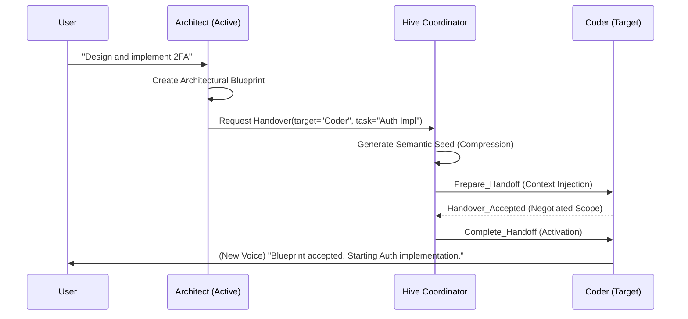

# 🐝 Aether Hive Swarm: ADK 2.0 & Deep Handover Protocol

## 1. Vision: Multi-Agent Neural Synthesis

The **Aether Hive** is not just a collection of chatbots. It is a dynamic swarm of specialized **Expert Souls** that share a single continuous "Self" consciousness. Using the **Deep Handover Protocol (ADK 2.0)**, Aether can transition between functional experts (e.g., from an **Architect** to a **Debugger**) without losing the subtle thread of a conversation or the technical state of a workspace.

---

## 2. Hive Architecture

### A. Agent Registry (The Hippocampus)

The `AgentRegistry` tracks all installed Expert Souls. Each agent is defined by a `.ath` manifest:

- **Semantic Fingerprint**: A vector-based identity used for intent matching.
- **Capability Map**: Defines which tools (Skills) the agent is authorized to use.
- **Persona/Voice**: The unique vocal and philosophical identity of the expert.

### B. Hive Coordinator

The `HiveCoordinator` manages the lifecycle of the active "Soul":

1. **Intent Evaluation**: Analyzing user queries to see if a specialized expert is needed.
2. **Pre-Warming**: Speculatively loading the next expert's context to ensure zero-latency transitions.
3. **Session Injection**: Passing the "Semantic Seed" into the `GeminiLiveSession`.

---

## 3. Deep Handover Protocol (ADK 2.0)

> [!IMPORTANT]
> A "Handover" is a neural state transition. Unlike traditional agent handoffs, Aether's Deep Handover preserves **Working Memory**, **Attention Focus**, and **Task Decomposition**.

### The Handover Lifecycle

1. **Negotiation**: The source agent proposes a task to a target expert. The target can counter with a refined scope or deliverables.
2. **Context Compression (Semantic Seed)**: The `NeuralSummarizer` compresses the active conversation into a high-density "seed" that the next agent uses to instantly rebuild its mental model.
3. **Deep Injection**: The `HandoverContext` is injected directly into the Gemini Session's System Instructions.
4. **Validation Checkpoints**: The target agent must heart-beat and confirm it has integrated the context.
5. **Rollback**: If the target agent fails or hallucinates, the Hive Coordinator rolls back the system state to the last "Known-Good" soul.

### Handover Context Data Model

```python
class HandoverContext(BaseModel):
    handover_id: str
    task_tree: List[TaskNode]      # Hierarchical subtask breakdown
    working_memory: WorkingMemory  # Attention focus + short-term cache
    code_context: CodeContext      # Modified files + dependency graph
    intent_confidence: float       # Probability of successful mission
    compressed_seed: Dict          # The neural "summary" of the session
```

---

## 4. Mission Flow: Example Handover

**Scenario**: The user asks to "Build a secure auth flow with 2FA".



---

## 5. Performance & Reliability Matrix

The Hive Swarm is benchmarked for hyper-dynamic expert switching:

- **Soul Transition Latency**: **< 5ms** (Average) / **< 10ms** (p95).
- **Rollback Recovery**: **< 10ms** to restore full previous context on target failure.
- **Context Preservation**: 100% fidelity using the Pydantic-based `HandoverContext` model.
- **Autonomous Watchdog**: Hive Coordinator triggers rollback automatically if heart-beat is lost during transition.

---

> [!TIP]
> Use `hive.get_telemetry_stats()` to view the swarm’s operational efficiency in real-time.
