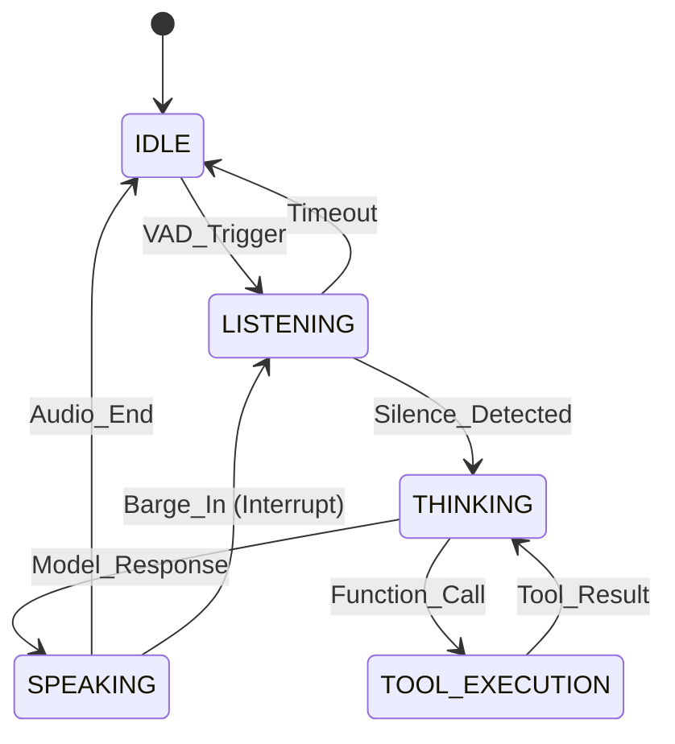

# 🧠 Aether Kernel: System Architecture & Neural Event Bus

## 1. Overview: The Brainstem

The **Aether Kernel** is the foundational layer responsible for state orchestration, resource scheduling, and low-latency communication between all AetherOS modules. It ensures that critical audio frames are never delayed by background telemetry or management tasks.

---

## 2. AetherEngine: The Orchestrator

The `AetherEngine` is the root component that initializes and coordinates the four primary management layers:

1. **AgentManager**: Handles the Hive Swarm and Expert Souls.
2. **AudioManager**: Manages VAD, Jitter Buffers, and PCM streams.
3. **Gateway**: Handles WebSocket communication with the UI and external clients.
4. **InfraManager**: Manages persistent state (Firebase), security, and system watchdogs.

```python
# The Engine Lifecycle
engine = AetherEngine(config)
asyncio.run(engine.run()) # Ignites the neural stream
```

---

## 3. Neural Event Bus (3-Tier Priority)

AetherOS uses a specialized `EventBus` that implements **Priority-Aware Scheduling** to maintain real-time performance.

### A. The System Clock Protocol

Every event in Aether inherits from `SystemEvent`. Time is the primary currency.

- **Latency Budget**: Each event specifies how many milliseconds it can live before it is considered "stale" and dropped.
- **Expiry Logic**: The bus automatically discards events that miss their deadline, preventing "Event Avalanche" scenarios.

### B. Priority Tiers

| Tier | Event Type | Description | Budget (ms) |
|:---|:---|:---|:---|
| **Tier 1** | `AudioFrameEvent` | Raw PCM data for the ear. | <10ms |
| **Tier 2** | `ControlEvent` | State transitions (e.g., Barge-in, Tool Start). | <50ms |
| **Tier 3** | `TelemetryEvent` | Metrics, Logging, and Heartbeats. | <500ms |

---

## 4. State Orchestration (FSM)

Aether transitions between states based on acoustic and neural signals:



---

## 5. Developer Guide: Publishing Events

To integrate a new module into the Aether nervous system, use the `EventBus`:

```python
from core.infra.event_bus import ControlEvent

# Publish a high-priority state change
event = ControlEvent(
    timestamp=time.time(),
    source="my_module",
    latency_budget=20,
    command="ACTIVATE_STEALTH_MODE",
    payload={"intensity": 0.8}
)

await event_bus.publish(event)
```

---

## 6. Verification & Performance Benchmarks

The Kernel's health is monitored via the **Immune System** test suite:

- **Bus Throughput**: Verified **8,000+ EPS** (Events Per Second) sustained capacity.
- **Latency Enforcement**: Tier 1 (Audio) events are prioritized with a <10ms queue wait time.
- **Stability**: Zero event loss under 12k mixed-load burst tests.
- **Drop Rate**: Real-time monitoring of Tier 1/2 expiry prevents system lag during peak neural activity.
