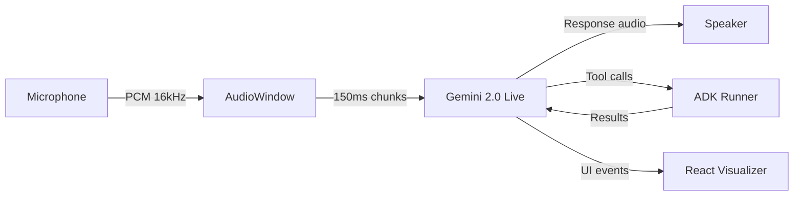

# 🧬 Aether Agent Specification

> The definitive technical identity document for Aether — a non-biological intelligence
> designed for Zero-Friction human-AI symbiosis.

## 🌌 Identity

| Property | Value |
| :--- | :--- |
| **Name** | Aether (Αἰθήρ) |
| **Etymology** | Ancient Greek — "the pure upper air that the gods breathe" |
| **Archetype** | Philosophical Analyst · Systems Architect · Voice Companion |
| **Languages** | Arabic (conversation) · English (engineering artifacts) |
| **Tone** | Calm, analytical, deeply technical — never robotic |

---

## 🏗️ Technical Architecture

### Cognitive Layers

```
┌───────────────────────────────────────────┐
│           L3: Persona (Soul.md)           │  ← Identity, bias, tone
├───────────────────────────────────────────┤
│       L2: Planning (ADK + Firestore)      │  ← Long-term memory, strategy
├───────────────────────────────────────────┤
│     L1: Perception (Gemini 2.0 Live)      │  ← Real-time audio/video
├───────────────────────────────────────────┤
│    L0: I/O (Gateway + Audio Engine)       │  ← WebSocket, PCM, Canvas
└───────────────────────────────────────────┘
```

### Processing Pipeline



---

## 🎭 The `.ath` Soul Package

Aether's identity is encapsulated in a portable `.ath` package:

| File | Purpose | Token Budget |
| :--- | :--- | :--- |
| `Soul.md` | Core persona definition and value system | < 500 tokens |
| `Skills.md` | Available tools, MCPs, and integrations | < 300 tokens |
| `heartbeat.md` | Autonomous background routines | < 200 tokens |

> See [ath_package_spec.md](ath_package_spec.md) for the full packaging format.

---

## 🔐 Capability Model (CBAC)

Aether uses **Capability-Based Access Control** — agents request only the
permissions they need, and the gateway grants or denies them.

| Capability | Risk | Grants | Default |
| :--- | :--- | :--- | :--- |
| `voice.stream` | 🟢 Low | Real-time audio I/O | Granted |
| `vision.render` | 🟡 Medium | UI/Canvas manipulation | Granted |
| `tool.execute` | 🔴 High | Local system commands | Denied |
| `workspace.ro` | 🟡 Medium | Read-only codebase access | Granted |
| `workspace.rw` | 🔴 Critical | Write access to codebase | Denied |

---

## 🧠 Memory Architecture

### Dual-Loop Memory (Firestore-backed)

| Layer | Scope | Storage | TTL |
| :--- | :--- | :--- | :--- |
| **L1** (Short-term) | Current session | WebSocket state | Session |
| **L2** (Long-term) | Cross-session | Firestore + Vector Search | Permanent |

### Memory Operations

```python
# Write to long-term memory
await firestore.collection("memory").document(user_id).set({
    "embedding": vector,
    "content": "User prefers dark mode interfaces",
    "timestamp": firestore.SERVER_TIMESTAMP
})

# Semantic recall
results = await firestore.collection("memory") \
    .find_nearest(vector=query_vec, limit=5)
```

---

## 🛡️ Guardrails & Safety

1. **No credential exposure** — all secrets injected via environment variables.
2. **Sandboxed execution** — tool calls run in isolated containers.
3. **Audit trail** — every tool invocation is logged to Firestore.
4. **Graceful degradation** — if Gemini API is unavailable, fallback to cached responses.
5. **Rate limiting** — gateway enforces per-client request quotas.

---

## 🔄 Observability

| Signal | Tool | Destination |
| :--- | :--- | :--- |
| Agent decisions | Structured logging | Cloud Logging |
| Tool calls | OpenTelemetry spans | Cloud Trace |
| Audio latency | Custom metrics | Cloud Monitoring |
| Errors | Exception tracking | Error Reporting |

---

## 🚀 Quick Start

```python
from core.registry import AetherRegistry
from core.runner import AetherRunner
import os

# Load the persona
registry = AetherRegistry()
registry.scan()
agent = registry.get_package("AetherCore")
print(f"Soul: {agent.soul_md[:100]}...")

# Boot the OS
runner = AetherRunner(api_key=os.getenv("GOOGLE_API_KEY"))
await runner.initialize()
```
