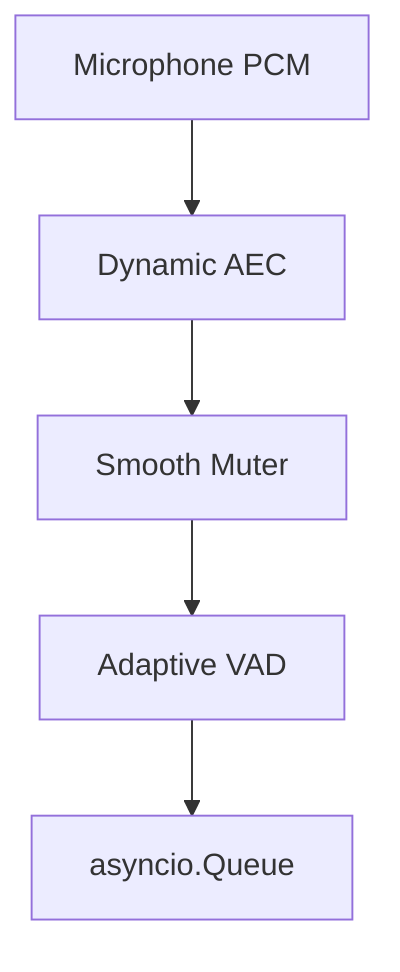

# Audio Processing Pipeline Architecture

This document details the architectural decisions and data flow for the Aether Voice OS audio processing pipeline.

## 1. Capture & Thalamic Gate (`capture.py`)

The audio capture module acts as the entry point for microphone data and immediately processes it through the Thalamic Gate.

### Architecture Decision Record (ADR)
- **Decision:** Use PyAudio C-callbacks with direct asyncio queue injection.
- **Rationale:** Eliminates the latency and CPU overhead associated with intermediate `queue.Queue` background threading.
- **Trade-off:** The callback function becomes highly complex as it must handle AEC, VAD, and hysteresis without blocking, but it successfully achieves near zero-latency handoffs.

### Data Flow Diagram



## 2. Dynamic AEC (`dynamic_aec.py`)

Handles real-time adaptive acoustic echo cancellation.

### Architecture Decision Record (ADR)
- **Decision:** Use Frequency-domain NLMS over Time-domain NLMS.
- **Rationale:** Delivers faster convergence and significantly lower CPU utilization for longer echo tails (filter lengths).
- **Trade-off:** Induces a higher algorithmic latency equal to one processing block, but this is acceptable for voice interaction.

### Data Flow Diagram


## 3. Playback (`playback.py`)

Handles emitting audio to the system speakers while recording the outgoing signal for echo cancellation reference.

### Architecture Decision Record (ADR)
- **Decision:** Isolate playback in thread-safe queues with PyAudio C-callbacks.
- **Rationale:** C-callbacks ensure the OS audio buffer is consistently filled, preventing underruns and maintaining a stable audio stream.
- **Trade-off:** Requires robust thread-safe handoffs (`queue.Queue`) between the asyncio domain and the C-thread, adding slight logic complexity.

### Data Flow Diagram

```mermaid
graph TD
    A[asyncio.Queue (AI Audio)] --> B[queue.Queue Buffer]
    B --> C[PyAudio Callback]
    C --> D[Subliminal Heartbeat Mixing]
    D --> E[Speaker Output]
    C --> F[16kHz Resampling]
    F --> G[AEC Far-End Reference]
```

## 4. Audio State (`state.py`)

Manages the global singleton state for audio telemetry, status, and synchronization across threads.

### Architecture Decision Record (ADR)
- **Decision:** Implement a Double-Locking Pattern.
- **Rationale:** By separating `_lock` (used for AEC metadata and telemetry) and `_playing_lock` (used specifically for playback transitions), we minimize lock contention and prevent blocking inside the high-priority C-callbacks.
- **Trade-off:** Slightly increases the complexity of lock management and the potential for deadlocks if not careful, but successfully guarantees thread-safe, non-blocking audio loops.
