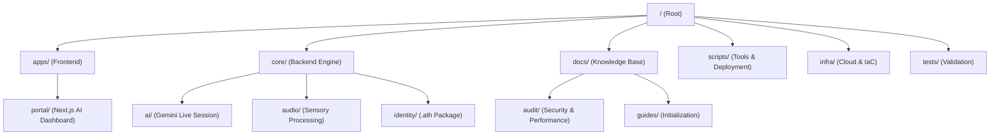

# 🌌 AetherOS: Project Structure Map

This document provides a high-level overview of the AetherOS directory structure and codebase organization.

## 📂 Directory Layout

---

### 🏛️ Core Components

| Directory | Purpose |
|:---|:---|
| `apps/portal` | The Next.js 15 Cyberpunk interface for agent management. |
| `core/ai` | Orchestration layer for Gemini 2.0 Multimodal sessions. |
| `core/audio` | Thalamic Gate V2 implementation for low-latency voice. |
| `docs/guides` | Quickstart, environment setup, and integration checklists. |
| `docs/audit` | Comprehensive project audits and performance benchmarks. |
| `scripts/deploy` | CI/CD automation and deployment scripts. |
| `infra` | Firebase/GCP configuration and safety rules. |

### 🛠️ Key Command Hub

- **Start Backend:** `python -m core.engine`
- **Start Portal:** `cd apps/portal && npm run dev`
- **Run Tests:** `pytest tests/`

---
*Aether Architecture // v3.0 Alpha // Confidential*
