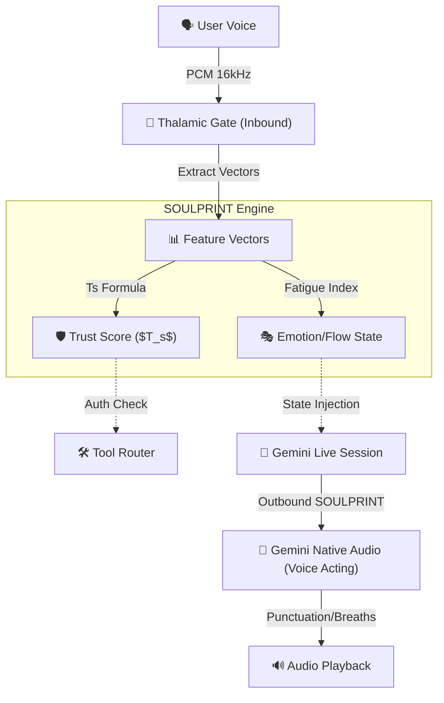

# 🧬 Aether OS: SOULPRINT Architecture

> **SOULPRINT** is the bi-directional acoustic identity of Aether OS. It replaces static, text-based personas with a living, breathing neural signature.

A Soulprint is not just "how the AI sounds" (Outbound Voice Acting) or "how the AI authenticates you" (Inbound Voice Trust)—it is the unified continuum of both. It dictates how the system dynamically tunes its audio DSP (VAD, AEC, Noise Floor), how Gemini natively vocalizes its thoughts, and how the Aether Gateway calculates trust scores to authorize actions like `rm -rf`.

---

## 🎯 Purpose

1. **Outbound Soul (Voice Acting):** Guide Gemini 2.0 Native Audio to produce specific speech rhythms, breath mechanics (sighs, exhales), and emotional modulation without relying on slow, external TTS systems.
2. **Inbound Soul (Security & Flow State):** Continuously analyze the user's voice (Pitch, Spectral Centroid, Speech Rate) via the Thalamic Gate to generate a rolling **Trust Score** and detect cognitive fatigue.
3. **Acoustic Adaptation:** Automatically tune DSP parameters (like Hysteresis and Leakage detection) based on the current active agent's expected pace (e.g., the Architect is slow; the Coder is fast).

---

## 📊 Feature Vector Spec (The Inbound Soul)

The `cortex` (Rust DSP) and `paralinguistics.py` extract a 4-dimensional Feature Vector 20 times per second:

| Vector Component | Measurement | Interpretation (Flow State / Trust) |
| :--- | :--- | :--- |
| **`ƒ_cent`** (Spectral Centroid) | The "brightness" of the sound. | High = Alert/Focused. Low = Muffled/Distracted. |
| **`Δ_pitch`** (Pitch Variance) | Frequency range over 500ms. | High = Emotional/Frustrated. Low = Calm/Analytical. |
| **`ZCR`** (Zero-Crossing Rate) | Noisiness of the signal. | Spikes indicate plosives/shouting or environment noise. |
| **`ω_rate`** (Speech Rate - WPM) | Words (or syllables) per minute. | Fast = Confident/Rushed. Slow = Thinking/Fatigued. |

---

## 🔐 Trust Score Formula

The **Aether Trust Score ($T_s$)** is a rolling metric between `0.0` and `1.0`. It acts as an invisible, continuous biometric authentication layer.

$$ T_s = \alpha(V_{match}) + \beta(C_{stability}) - \gamma(S_{stress}) $$

Where:
- **$V_{match}$ (Voice Signature Match):** Similarity to the pre-registered Admin profile (0-1).
- **$C_{stability}$ (Cognitive Stability):** Consistency in $\omega_{rate}$ and $\Delta_{pitch}$ (0-1).
- **$S_{stress}$ (Stress Index):** High ZCR + erratic $f_{cent}$ spikes (0-1).
- **Weights:** $\alpha = 0.6$, $\beta = 0.3$, $\gamma = 0.1$.

### Enforcement Levels (Gateway Integration)
- **`Ts > 0.90` (Absolute Trust):** Agent executes all `system_tool` commands instantly (Zero-Friction).
- **`Ts > 0.70` (Standard):** Agent executes safe commands (`ls`, `cat`), but requires confirmation for writes.
- **`Ts < 0.70` (Compromised/Fatigued):** Agent locks down `system_tool`, triggers Vision Pulse for manual auth, and switches to "Empathy State" (slows down pace, uses reassuring Voice Acting).

---

## 🏗️ Integration Points

1. **Capture & Auth (`core/audio/capture.py`):** Calculates the base vectors and feeds them to the engine.
2. **Tool Router (`core/tools/router.py`):** Intercepts high-risk function calls if the rolling Trust Score drops.
3. **Session Instruction (`core/ai/session.py`):** Injects the text-based Voice Acting rules (Pacing, Breaths, Rhythm) dynamically based on the current active agent (`Architect` vs `Coding`).

---

## 🛡️ Privacy & Retention Policy

Because VoiceDNA / SOULPRINT involves continuous biometric analysis:
1. **Ephemeral Processing:** Feature vectors are processed exclusively in RAM (Tumbling Windows). Raw PCM chunks are **never** stored to disk.
2. **Rolling History:** Only the rolling average of the Trust Score ($T_s$) is kept in the `SessionMetadata` (Firestore) for debugging purposes.
3. **Local Vector Sandbox:** The baseline Admin Voice Profile (used for $V_{match}$) is encrypted via Ed25519 and stored locally in the `.ath` package, **never transmitted to the cloud**.

---

## ✅ Test & Benchmark Checklist

To ensure the Soulprint architecture maintains low latency (<200ms) and high accuracy:

- [ ] **Inbound Trust Latency:** Feature vector extraction must complete in $< 5ms$ per audio chunk.
- [ ] **Spoofing Resistance:** Test with pre-recorded audio vs live mic (ZCR and Spectral Centroid should differentiate playback compression).
- [ ] **Outbound Voice Acting:** Verify Gemini correctly parses `[sigh]`, `[click]`, and `...` into non-verbal audio cues without hallucinating the literal text.
- [ ] **State Transition Speed:** Test how quickly the active Agent shifts from "Analytical Pacing" to "Empathy Mode" when a frustration spike is simulated.