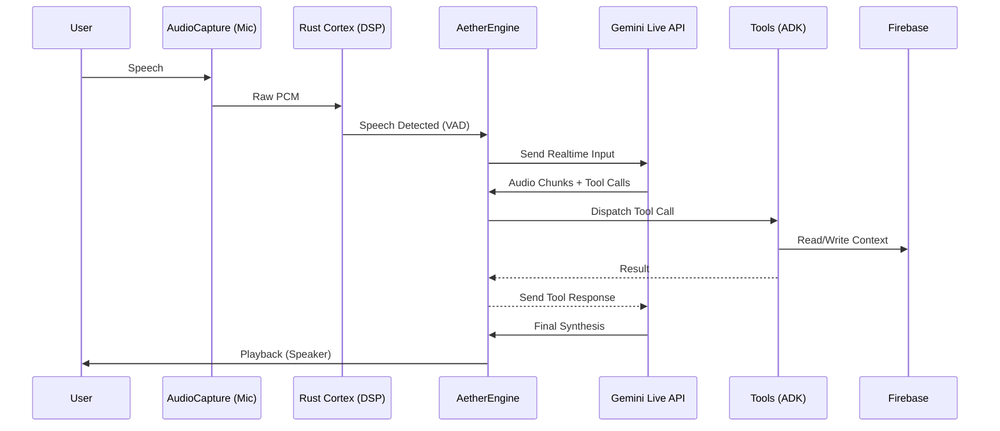

# 🧠 Aether OS Architecture: The Neural Pipeline

## 📡 Overview

Aether OS is built on a **Single-Modal Unified Pipeline** (WhisperFlow 2.0). Unlike traditional voice systems that chain disparate models (STT → LLM → TTS), Aether leverages **Gemini 2.0 Multimodal Live** to handle audio understanding, reasoning, and synthesis within a single neural context.

## 🏗️ The Nervous System (Engine)

The architecture is composed of four primary layers:

### 1. The Perceptual Layer (Audio I/O)

- **AudioCapture:** Captures 16kHz Mono PCM via PyAudio.
- **AudioWindow:** Implements tumbling windows for signal analysis.
- **Aether Cortex (Rust):** Provides high-performance DSP for VAD and Zero-Crossing detection.
  - *VAD:* Local energy-based detection for UI reactivity and preliminary noise filtering.
  - *Zero-Crossing:* Finds the mathematical "silent point" in a waveform to perform click-free audio interruptions (Barge-in).

### 2. The Cognitive Layer (Gemini Live Session)

- **WebSocket Protocol:** Low-latency bidirectional stream.
- **Multimodal Context:** Gemini receives raw PCM bytes and emits raw PCM bytes + Tool Calls.
- **Barge-in Logic:** When the user speaks, Gemini emits an `interrupted` signal. The engine instantly drains the `audio_out_queue` and uses Zero-Crossing to cut the current playback buffer smoothly.

### 3. The Executive Layer (ADK & Neural Dispatcher)

- **ToolRouter:** Maps Gemini's `function_calls` to Python handlers.
- **Async Execution:** Tools run concurrently without blocking the audio stream.
- **Grounding:** Google Search tools are injected directly into the Gemini session for real-time factual accuracy.

### 4. The Persistence Layer (Firebase/OpenClaw)

- **FirebaseConnector:** Manages session state, long-term memory, and task tracking.
- **OpenClaw Gateway:** Secure Ed25519-encrypted handshake for external UI/CLI clients.
- **Broadcast System:** Real-time event propagation (e.g., VAD levels, tool results) to the visualizer.

## 🔄 Data Flow Map

## ⚡ Performance Optimization

- **Multithreading:** PyAudio run in dedicated threads to prevent GIL blocking.
- **Structured Concurrency:** Uses `asyncio.TaskGroup` to ensure that if the gateway crashes, the mic/speaker are closed safely.
- **Zero-Copy Buffers:** NumPy arrays are shared between Python and Rust for minimal overhead.
