# 🛰️ OpenClaw Gateway Protocol V2 — Aether OS

> Secure, Zero-Latency Neural Handshake & Handover Protocol.
> Port: **18789** | Auth: **Ed25519 (L3)** | Handover: **ADK 2.0 (Deep)**

---

## 📡 Modern Connection Lifecycle

```mermaid
sequenceDiagram
    participant C as Client (e.g. Dashboard)
    participant G as Aether Gateway
    participant H as Hive Coordinator

    C->>G: WebSocket Connect
    G->>C: connect.challenge {challenge_hex, server_version}
    C->>G: connect.response {client_id, signature, capabilities}
    G->>C: connect.ack {session_id, tick_interval_s, granted_caps}

    rect rgb(20, 20, 30)
    Note right of G: Steady State (Heartbeat every 15s)
    G->>C: tick {timestamp}
    C->>G: pong
    end

    rect rgb(30, 20, 20)
    Note right of G: Deep Handover (ADK 2.0)
    G->>H: request_handoff(target_soul)
    H->>G: pre_warm_soul(target_soul)
    G->>C: ui.update {state: "HANDING_OFF"}
    end
```



---

## Phase 1: Cryptographic Handshake

The V2 protocol uses a non-interactive challenge-response based on Ed25519.

### `connect.challenge` (Server → Client)

```json
{
  "type": "connect.challenge",
  "challenge": "7f8b...", // 32 bytes random hex
  "server_version": "2.0.0"
}
```

### `connect.response` (Client → Server)

```json
{
  "type": "connect.response",
  "client_id": "AetherDashboard", // Or public-key-hex
  "signature": "...", // Ed25519 sign(challenge)
  "capabilities": ["audio.input", "ui.render"]
}
```

### `connect.ack` (Server → Client)

```json
{
  "type": "connect.ack",
  "session_id": "u-u-i-d",
  "granted_capabilities": ["audio.input"],
  "tick_interval_s": 15.0
}
```

---

## Phase 2: Performance Optimizations

### ⚡ Speculative Pre-warming

When a handover is initiated, the Gateway speculatively initializes the `GeminiLiveSession` for the target soul *before* the current session disconnects. This reduces the effective latency between experts by **~800ms**.

### 🔗 Deep Handover (ADK 2.0)

Handovers now transfer **Full Neural Context** (compressed delta diffs) between agents.

1. `prepare_handoff`: Serializes current session state.
2. `negotiate`: Target agent reviews the task context.
3. `commit`: Final transition and session swap.

---

## Message Schema V2

### Audio Transport (Binary)

Client sends raw **16kHz 16-bit Mono PCM** as binary WebSocket frames. Server broadcasts the same back to visualizers/speakers.

### JSON Control Plane

| Type | Direction | Payload Example |
| :--- | :--- | :--- |
| `tick` | S → C | `{"timestamp": 1740...}` |
| `audio.chunk` | C → S | `{"data": "...", "mime": "audio/pcm"}` |
| `tool.call` | S → C | `{"name": "get_weather", "args": {...}}` |
| `ui.update` | S → C | `{"state": "CONNECTED", "soul": "Moe"}` |

---

## Error & Status Codes

| Code | Label | Meaning |
| :--- | :--- | :--- |
| `100` | `SUCCESS` | Operation normal |
| `401` | `AUTH_FAILED` | Invalid Ed25519 signature |
| `403` | `CAP_DENIED` | Missing required capability |
| `408` | `TIMEOUT` | Handshake or Tick timeout |
| `500` | `CRASH` | Internal engine failure |

---

## Security (First Principles)

- **Zero Trust**: Every tool execution requires internal `BiometricMiddleware` check.
- **Identity Integrity**: All `.ath` packages must be signed and verified by the Registry.
- **Telemetry**: All handshakes and tool calls are traced via OTLP for real-time audit logs.
