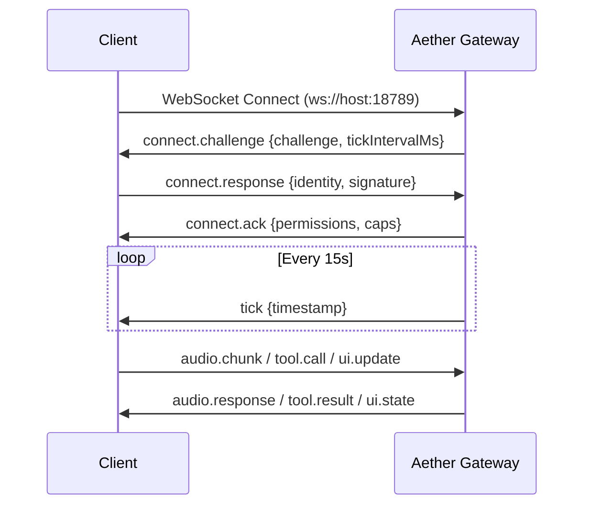

# 🛰️ OpenClaw Gateway Protocol — Aether Implementation

> Secure, low-latency WebSocket protocol for AI agent orchestration.
> Port: **18789** | Auth: **Ed25519** | Heartbeat: **15,000ms**

---

## 📡 Connection Lifecycle



---

## Phase 1: Handshake

### `connect.challenge` (Server → Client)

The gateway issues a unique challenge upon connection.

```json
{
  "type": "connect.challenge",
  "challenge": "a3f8e2c1-7b4d-4e9f-b6a2-1c3d5e7f9a0b",
  "tickIntervalMs": 15000,
  "serverVersion": "0.1.0",
  "serverIdentity": "AetherGateway"
}
```

### `connect.response` (Client → Server)

Client signs the challenge with its Ed25519 private key.

```json
{
  "type": "connect.response",
  "identity": "base64-encoded-public-key",
  "signature": "base64-encoded-signature-of-challenge",
  "clientVersion": "1.0.0",
  "requestedCaps": ["voice.stream", "tool.execute"]
}
```

### `connect.ack` (Server → Client)

Server validates signature and returns granted capabilities.

```json
{
  "type": "connect.ack",
  "sessionId": "uuid-v4",
  "permissions": ["voice.stream"],
  "deniedCaps": ["tool.execute"],
  "caps": {
    "multimodal": true,
    "workspace": "ro",
    "isolation": "sandbox"
  }
}
```

> ⚠️ If `tool.execute` is denied, the client must request elevated
> permissions through a separate `caps.elevate` message.

---

## Phase 2: Steady State

### `tick` (Server → Client, every 15s)

```json
{
  "type": "tick",
  "timestamp": 1740422400000,
  "activeClients": 3,
  "serverLoad": 0.42
}
```

**Dead Client Pruning:** Clients that fail to respond to 2 consecutive
ticks are automatically disconnected and their session state archived.

---

## Message Types

### Audio

| Message | Direction | Description |
| :--- | :--- | :--- |
| `audio.chunk` | Client → Server | PCM 16kHz mono, base64 encoded |
| `audio.response` | Server → Client | Gemini TTS response audio |
| `audio.interrupt` | Server → Client | Barge-in signal for clean cut |

### Tools

| Message | Direction | Description |
| :--- | :--- | :--- |
| `tool.call` | Server → Client | Function call from Gemini |
| `tool.result` | Client → Server | Execution result |
| `tool.error` | Client → Server | Execution failure |

### UI

| Message | Direction | Description |
| :--- | :--- | :--- |
| `ui.update` | Server → Client | State changes for visualizer |
| `ui.event` | Client → Server | User interaction events |

---

## Error Codes

| Code | Name | Description |
| :--- | :--- | :--- |
| `4001` | `AUTH_FAILED` | Signature verification failed |
| `4002` | `CAP_DENIED` | Requested capability not granted |
| `4003` | `TICK_TIMEOUT` | Client missed 2+ heartbeats |
| `4004` | `RATE_LIMITED` | Too many requests per second |
| `4005` | `INVALID_MSG` | Malformed message payload |

---

## Security Considerations

1. **Transport:** TLS 1.3 enforced in production.
2. **Authentication:** Ed25519 signatures prevent replay attacks.
3. **Authorization:** Least-privilege CBAC model.
4. **Isolation:** Tool execution runs in sandboxed containers.
5. **Audit:** All messages logged with timestamps for forensic analysis.
